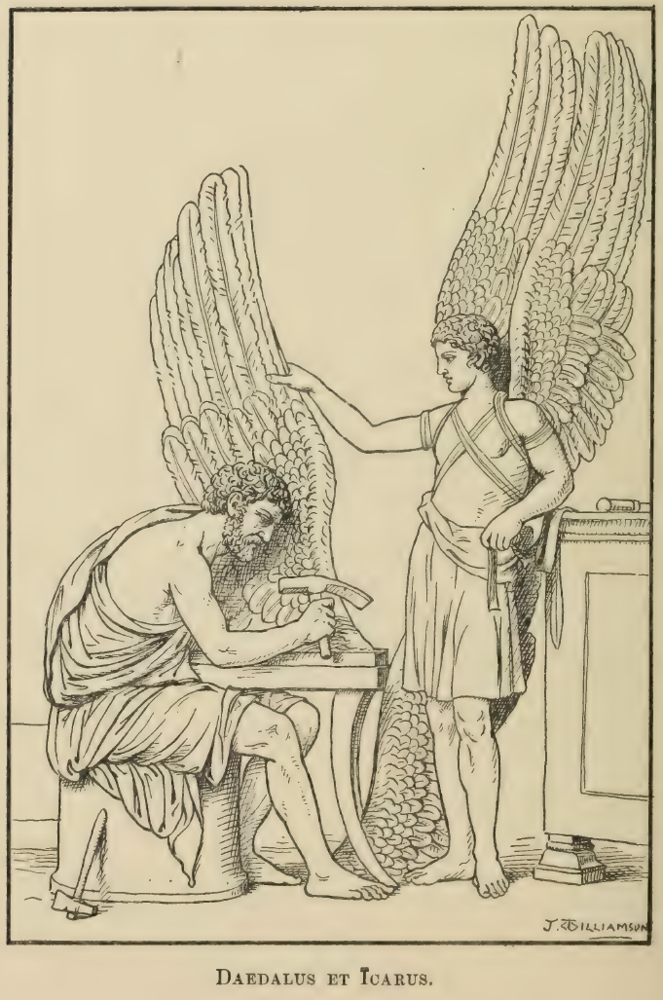

# Fābulae

Reginald B. Appleton

## Dē Sāgīs

### I

Ab Thessaliam ōlim negōtia aliquot āctūrus profectus eram, cum duōs viātōrēs, quī forte paululum prōcesserant, invēnī. Mox itinere dēfessī omnēs ad dēversōrium vēnimus, cuius caupōna erat sāga quaedam nōmine Meroē. Ita fessī erāmus ut statim cubitum īrēmus. Ūnus ē comitibus meīs, cui nōmen Sōcratēs, simul ac sē in lectum iēcit, stertere incēpit. Ego tamen, adductīs foribus, pessulīsque obditīs, grabātulum meum post cardinēs, nē quis posset intrāre, posuī. Tum dēmum somnō mē dabam. Prīmō tamen prae metū vigilō; deinde circā tertiam ferē vigiliam paululum obdormiō. Subitō autem impulsū maiōre quam ut latrōnēs adesse crēderēs iānua reserātur.

### II

Grabātulus meus tantā impetūs violentiā prōsternitur. Mē quoque ēvolūtum ēiectumque tegit. Dum in fimum dēiectus quid acciderit mīror, duās prōvectae aetātis mulierēs videō. Lucernam ferēbat prīma, altera spongiam et gladium nūdum. Ad Sōcratem, quī altē dormiēbat, appropinquāvērunt, et ea quae gladium ferēbat, capite ēius ad dextram dīmōtō, per iugulum capulō tenus gladium tōtum dēmersit. Deinde sanguinem effluentem, utre admōtō, ita dīligenter excēpit ut nūlla stīlla appārēret usquam. Tum, dextrā per volnus ad vīscera penitus immissā, cor miserī contubernālis meī extrāxit. Quibus factīs, ambae statim abiērunt.

### III

Simul ac sāgae illae abiērunt, ego humī prōiectus, nūdus et frīgidus, immō vērō sēmimortuus, “Quid,” inquam, “mē fīet, cum Sōcratēs iugulātus māne appāruerit?” Optimum igitur vīsum est fūrtim ēvādere, nē quis mē Sōcratem putāret interfēcisse. Itaque pessulōs redūcō, et, iānuā apertā, “Heus tū,” inquam, “ubi es? Valvās stabulī absolve! ante lūcem abīre volō” Sed haec mihi clāmantī iānitor sēmisomnus, “Quid tū,” inquit, “clāmās? Īgnōrāsne latrōnibus īnfēstārī viās, quī hōc nocturnum iter incipiās? Facinorisne alicuius cōnscius morī cupis? Quōmodo scīre possum utrum, comite tuō iugulātō, fugā praesidium quaerās necne?”

### IV

Quibus audītīs, sāgās intellēxī nōn misericordiā commōtās mihi pepercisse, sed ob saevitiam crucī mē reservāsse. In cubiculum igitur reversus, diū mēcum dēlīberābam quō modō mortem mihi possem cōnscīscere. Sed cum nūllum aliud tēlum mortiferum Fortūna quam grabātulum sōlum mihi subministrāret, restim, quā intextus erat grabātulus, expedīre aggredior. Deinde, alterā parte suprā tignum, quod ē mūrō ēminēbat, iniectā, alterā in nōdum coāctā, grabātulum ascendō, et caput in laqueum īnserō. Sed dum grabātulum, quō sustinēbar, pede alterō repellō, repente vetus ac putris ille fūnis dīrumpitur, et Sōcratem, quī iūxtā iacēbat, ego dē altō recidēns tōtō corpore obruō, ambōque nōs in terram dēvolvimur. Ad haec, cāsū meō experrēctus, Sōcratēs exsurgit.

### V

Posterō diē māne ē dēversōriō proficīscimur. At ego iugulum Sōcratis, quā parte gladium dīmersum vīderam, cūriōse spectābam; nec dubitāre poteram quīn vēsānus fuissem. Namque integrum et incolumem Sōcratem vīdī. Sed somnium meum eī nārrāre incēpī. Ad haec ille arrīdēns respondit sē quoque per somnium sibi iugulārī vīsum esse. Mox aliquid cibī edere volēbat; cui ego, pānem et cāseum ē saccō dēprōmēns, “Ecce,” inquam, “parātum tibi adest ientāculum; iūxtā platanum istam cōnsīdāmus.” Sed dum edimus, maciē et pallōre Sōcratem affectum esse vīdī. Nihil tamen dīxī; at Sōcratēs, cum maiōrem cāseī partem avidē dēvorāvisset, sitīre coeperat. Itaque eī imperāvī ut dē fluviō, quī haud ita longē fluēbat, biberet.

### VI

Sōcratēs igitur, ut sitim exstingueret, ad flūmen sē contulit. Sed vix satis extrēmīs labrīs summam attigit aquam, cum in iugulō ēius volnus in profundum dehīscit, et spongia, quam sāgae imposuerant, repente dēvolvitur! Ego, quamquam magnō terrōre affectus eram, eī succurrī, nam corpus ēius exanimātum in flūmen paene cecidit. Alterō tamen pede retentō, vix et aegrē ad superiōrem rīpam eum adtrāxī. Quibus factīs, cadāver rīte dēflētum in arēnā sepelīvī. Ipse trepidus et terrōre affectus per remōtās et āviās sōlitūdinēs, quasi sceleris mihi cōnscius, aufūgī. Cum pauca mīlia passuum prōgressus essem, aliam intrāvī tabernam, ubi dē caupōnā quaesīvī num Milōnem quemdam nōvisset.

### VII

Quae cum rogāvissem, caupōna mihi respondit Milōnem locuplētem vērō, avāritiae tamen extrēmae esse, quī ūsūrae nōmine pecūniam aliīs perscrīberet. Dēmōnstrāvit praetereā ubi habitāret. Illīc statim mē contulī, et iānuam claustrīs pāctam pulsāre incēpī. Tandem mulier quaedam ēgressa, “Heus tū,” inquit, “quī tam fortiter forēs verberāstī, num mūtuārī cupis?” Cum mē litterās ab amīcō quōdam portāre respondissem, ut intrārem ōrāvit. Domum igitur ingressus Milōnem grabātulō exiguō accumbentem et cēnāre incipientem invēnī; quī, vacuā mihi appositā mēnsā, “In,” inquit, “hospitium.” Nihil cibī aderat; sed mē cēnāre simulāvī. Haud ita multō post hospitem meum, ut ita eum nōminem, ut mihi cubitum īre licēret ōrāvī.

### VIII

Posterō diē ieiūnus, immō vērō ieiūnissimus, experrēctus, Milōnī mē ad balneās exitūrum dīxī. Rē vērā, ut aliquantulum cibī emerem, forum petiī; quō cum vēnissem, piscēs in pūblicō expositōs vīdī. Ē vēnditōre quantō essent quaesīvī; et illī vīgintī poscentī dēnāriōs sēdecim dedī. Ē forō digrēssus amīcō cuidam obviam īvī, quī mihi dīxit sē annōnam cūrāre et aedīlem sē gerere Cum piscēs meōs vīdisset, quantī parāvissem rogāvit. “Vix,” inquam, “piscātōrī persuāsī ut sēdecim acciperet dēnāriōs.” Quibus audītīs, aedīlis ille ad piscātōrem reversus, “Quid, malum,” inquit, “fēcistī, quī tantō pretiō inūtilēs vēndidistī piscēs ? Sed nōn impūne fēceris” Quō dictō, piscēs in medium profūsōs servum iussit tōtōs pedibus suīs obterere, et, “ Hōc modō,” inquit, “fūrēs pūnior.” Sed, cum piscātor nummōs meōs accēpisset, mē quoque eum pūnīrī putāvī.

### IX

Tribus post diēbus per forum prōgressus prōcērum quemdam senem animadvertī, quī clārā vōce num quis mortuum custōdīre vellet rogābat. Quae cum audīvissem, ad praetereuntem quemdam versus, “Quid hōc,” inquam, “audiō ? Solentne mortuī hīc aufugere?” “Tacē,” respondit ille “nam iuvenis et peregrīnus es. Num ignōrās tē in Thessaliā esse, ubi ōra mortuōrum sāgae passim rōdunt, ut sanguinem hūmānum magicīs suīs artibus subministrent ?” Quibus audītīs, eum rogāvī quid ut corpora custōdīrentur esset faciendum. “Tōtam noctem,” respondit, “vigilandum est, oculīs semper in cadāver intentīs; nam sāgae, corpore in quodvīs animal conversō, cadāverī appropinquāre possunt. Quō modō omnēs dēcipiunt; namque et avēs et canēs et mūrēs, immō vērō etiam muscae, fīunt. Sed, nisi māne integrum inventum erit corpus, custōdī necesse erit partem āmissam dē suā faciē renovāre.”

### X

Simul atque haec audīvī ad senem versus, “Clāmāre,” inquam, “iam dēsine. Adest tibi custōs parātus. Cedo praemium.” Senex igitur mē domum cuiusdam perdūxit, ubi mihi dēmōnstrāvit mātrōnam flēbilem, fūscā veste contēctam, quae mē ōrāvit ut quam dīligentissimē corpus marītī suī custōdīrem. Deinde in aliud cubiculum mē indūxit, ubi cadāver splendidīs linteīs coopertum vīdī. Septem deinde testibus intrōductīs, vidua corpus revēlāvit, et singula dēmōnstrāns, “Ecce,” inquit, “nāsus integer, incolumēs oculī, salvae aurēs, labra illībāta, mentum solidum.” Quō dictō, iam exīre incipiēbat; sed ego eam ōrāvī ut omnia quae mihi ūsuī essent adhibēret; cui quae vellem rogantī, “Lucernam,” inquam, “et magnam oleī cōpiam velim dēs.” Itaque ancillae cuidam imperāvit ut haec mihi daret. Quibus adhibitīs, omnēs statim exiērunt.

### XI

Cum omnēs exīssent, ego nūllō nisi cadāvere comite in cubiculō sum inclūsus. Iamque crepusculum aderat, et nox prōvecta, et nox altior, deinde iam nox intempesta. Magnō terrōre affectus sum, cum repente sub iānuam rēpsit mūstēla. Simul ac mūstēlam vīdī, omnia quae senex mihi exposuerat in memoriam revocāvī, et, mūstēlam sāgam esse ratus, eī quōminus cadāverī custōdiendō appropinquāret obstitī. Nūllō modō mē fallere poterat mūstēla. At ego operam dedī ut eam ē cubiculō agerem; id quod tandem perfēcī. Deinde cūrā solūtus, quippe quī sāgam tam facile vīcissem, somnō resistere nōn iam potuī. Obdormiēbam igitur, sed subitō experrēctus nimiōque pavōre perterritus, cadāver īnspexī. Ō mē beātum! integrum erat, et mihi grātulātus sum quod omnia adeō prōsperē ēvēnerant.

### XII

Postrīdiē corpus per forum, magnā comitante pompā, ut sepelīrētur ductum est. Subitō tamen senex quīdam accurrit, quī clāmāns, “Quirītēs,” inquit, “cīvī interfectō succurrite, extrēmumque facinus in nefāriam scelestamque istam fēminam sevēriter vindicāte! Haec enim (et viduam, cuius marītī corpus ego custōdīveram, digitō dēmōnstrāvit) miserum adulēscentem venēnō exstīnxit.” Quae cum fēmina negāvisset, senex vātem quemdam adesse respondit, quī paulīsper ab īnferīs spīritum redūcere posset, quō modō nōs omnēs vēra repertūrōs. Omnibus igitur flāgitantibus, deōs precibus quibusdam vātēs dēfatīgāre incēpit, herbulāsque alteram ob ōs, alteram suprā pectus cadāveris, incantantis rītū, posuit.  Quibus factīs, pectus tumōre extollī, sanguis per vēnās salūbrēs currere, corpus spīritū implērī coepit.

### XIII

Deinde, admīrantibus omnibus, cadāver assurgit ā profātur. “Quid, ōrō,” inquit, “mē post Lēthaea pōcula, iam Stygiīs palūdibus innatantem ad vītam redūcis?  Dēsine iam, precor, dēsine, et mē in quiētem remitte meam.” Quae cum audīrent, cēterī vērō timēbant; vātēs tamen dē cadāvere petiit ut quōmodo mortuum esset omnibus nārrāret. Cuī cadāver, “Noxiō,” inquit, “ pōculō exhaustō, quod nūpta mea mihi dedit, statim periī.” Tunc uxor summā audāciā marītō suō resistēns altercārī incēpit; aliī alia clāmābant, hī pessimam fēminam adhūc vīventem cum mortuō marītō sepeliendam; aliī mendāciīs cadāveris fidem nōn habendam. Sed mox nōn dubium erat quīn adulēscēns vēra nārrāvisset; nam rūrsus, “Dabō,” inquit, “dabō vōbīs vēritātis documenta,” et omnēs statim quid esset āctūrus mīrābantur.

### XIIII

Admīrantibus omnibus, adulēscēns hunc in modum perrēxit: Digitō suō mē dēmōnstrāns, “Hīc,” inquit, “dum corpus meum custōdit, sāga quaedam cubiculum intrāvit. Cum cubiculum esset ingressa, somnō custōdī iniectō. mē nōmine vocāre incēpit. Hīc tamen—namque eōdem mēcum nōmine forte appellātur—ignārus per somnum exsurgit. Ad iānuam it, et vicāriam prō mē poenam subit. Nam nāsō prius ac mox auribus abscīsīs, sāga eī nārēs et aurēs ex cērā fīctās imposuit.” Hīs verbīs perterritus ego manū nāsum prehendō. Manum nāsus sequitur! Deinde aurēs pertractō; aurēs in humum cadunt! Itaque, neglēctā reliquā adulēscentis nārrātiōne, inter rīdentēs ēvādō. Posteā autem, crīnibus hinc inde dēiectīs, aurium volnera cēlāvī, nāsīque dēdecus, linteō obductō, dīligenter obtēxī.

## Lūdibrium

### I

Ōlim apud amīcum quemdam cēnātus, crāpulā distentus domum titubantis gradū redībam, cum subitō lūmen quod ferēbam ventō exstinguitur. Multum per tenebrās vagātus, digitīs pedum in lapidēs offēnsīs, domum tandem pervēnī. Quō cum vēnissem, statim trēs quōsdam vegetōs virōs maximīs corporibus forēs meās irruentēs invēnī. Prīmō quālēs essent nesciēbam, deinde nōn immeritō latrōnēs esse mihi vidēbantur. Statim igitur gladium veste meā contēctum stringō; nec cūnctātus mediōs latrōnēs invādō. Diū pugnātum est, sed omnēs tandem interfēcī.  Intereā servus quīdam pugnantium tumultū ē somnō excitātus iānuam mihi aperuit; ego anhēlāns et sūdōre madidus in cubiculum ut dormīrem mē recēpī.

### II

Prīmā lūce cum quantum facinus commīsissem recordārer, magnō terrōre affectus sum. Iam forum et iūdicia, iam sententia, ipse dēnique carnifex mihi imminēre vidēbantur. Nōn dubitāre poteram quīn futūrum esset ut inter sīcāriōs accūsārer. Neque spērāre poteram mē crīminis absolūtum īrī, quippe quī trēs virōs ipse meā manū trucīdāvissem. Quae cum mēcum recordārer, patefactīs repente foribus, magna clāmantium turba cubiculum meum irruit, et magistrātuum iussū duo līctōrēs, manibus immissīs, mē ad carcerem trahere incēpērunt. Nūllō modō effugere potuī, et līctor alter, “Quicquid,” inquit, “dīcēs, prō testimōniō contrā tē erit.” Tacuī igitur, et līctōrēs forum versus mē dūcēbant. Magna rīdentium turba nōs comitāta est, sed quam ob rem rīdērent nesciēbam. Equidem vērō magnō terrōre affectus sum.

### III

Cum ad forum pervēnissēmus, statim inter sīcāriōs accūsātus sum. Praecō magnā vōce accūsātōrem vocāvit, quī, “Nōn necesse,” inquit, “iūdicēs, est multa dīcere. Rem ipsam nārrābō; namque ego, quippe quī nocturnīs custōdiīs praefectus sim, hāc nocte platēās custōdiendī causā circumībam, cum istum crūdēlissimum iuvenem, mūcrōne strictō, cīvēs invādentem offendī. Simul ac mē appropinquantem cōnspexit, tergum dedit, nōn prius tamen quam trēs virōs saevissimē trucīdāvit. Sevēriter igitur, iūdicēs, caedem tam saevam, tam inaudītam, in hunc scelestum, nefārium, improbissimum vindicāte!” Deinde ut iūdicēs misericordiā commōtī quam vehementissimē in mē saevīrent, ōrāvit ut corpora necātōrum hominum revēlārentur. Praetor igitur mihi imperāvit ut corpora ipse meā manū revēlārem. Corpora inter omnium rīsūs retēxī. Deōs immortālēs! Quae fortūnae meae repentīna mūtātiō! nam cadāvera illa iugulātōrum hominum erant trēs ūtrēs ventō īnflātī multīsque sectī forāminibus! Quibus vīsīs, intellēxī nescioquem mē lūdibriō habuisse.

## Pamphilē

### I

Ōlim apud sāgam quamdam, cui nōmen erat Pamphilē, manēbam, quia cognōscere volēbam quid facere posset sāga. Ancilla igitur mē ad dominae suae cubiculum perdūxit, ut per iānuae rīmam spectārem. Sāga in cubiculō erat. Prīmō omnia sua vestīmenta exuit; deinde, cistā parvā apertā, unguentum extrāxit, quō tōtum corpus suum oblinere incēpit; multaque lucernam allocūta omnia membra quatere coepit. Mox plūmae crēscere incipiēbant; nāsus incurvus fīēbat, unguēs aduncī. Pamphilē būbō est facta, atque ē fenestrā ēvolāvit.

### II

Quō vīsō, ego ancillam ōrāvī ut aliquantulum hūius unguentī mihi quoque daret. Itaque ancilla cubiculum intrāvit, cistamque ablātam mihi dedit. Avidē manūs meās in cistam immersī, et omnia corporis membra unguentō perfricuī. Deinde brāchia lībrāre incēpī; nūllae tamen crēscēbant plūmae, sed capillus mihi in sētās est mūtātus; cutis in corium dūrēscēbat; digitī concrēscunt, manūs et pedēs fīunt ungulae, dē corpore prōcessit cauda! Faciem ēnormem, nārēs hiantēs, labra pendula habuī, et mē nōn avem esse percēpī sed asinum!

### III

Ancilla autem, cum mē asinum esse factum vīdisset, faciem suam manibus percutere incēpit, et clāmāns, “Ō mē miserrimam,” inquit, “occīsa sum! Fēstīnātiō mea mē fefellit, cistārumque similitūdō mē dēcēpit. Sed simplex est remedium. Oportet tē rosam edere, statimque in fōrmam hūmānam redībis. Prīmō dīlūculō remedium tibi dabō”” Equidem vērō, quamquam asinī fōrmam gerēbam, sēnsum tamen hūmānum retinuī, et diū mēcum dēlīberābam utrum calcibus meīs nēquissimam fēminam necāre dēbērem necne. Hōc tamen, nē remedium omnīnō āmitterem, facere nōluī. Itaque ad stabulum mē contulī, ubi equum
meum aliumque invēnī asinum.

### IV

Cum stabulum intrāvissem, equum meum agnōvī, quem spērābam hospitium mihi praebitūrum esse. Sed equus meus asinusque ille nē praesaepiō quidem mē sinēbant appropinquāre. Auribus dēiectīs, īnfēstīs calcibus mē calcāre incēpērunt. Itaque in angulum stabulī, nē calcibus eōrum laederer, mē contulī; ubi, ō mē beātum ! corōnam ē rosīs textam, quae dē stabulī tēctō pendēbat, aspexī. Extēntīs statim priōribus pedibus, nec nōn labrīs porrēctīs, summīs vīribus īnsurgō corōnam appetendī causā Sed, ō mē miserum ! servus quī stabulum cūrābat, valdē indignātus fūstem ē fasce lignōrum extrāxit, quō tergum meum tundere incēpit. Tantā vī ūsus est ille, ut nōn facere possem quīn ā cōnātū dēsisterem.

### V

Mediā nocte, valvīs patefactīs, latrōnum turba magnō impetū stabulum invādit. Gladiōs et facēs, quibus noctem illūminārent, omnēs ferēbant; quī, cum stabulō nihil inesse invēnissent, horreum frūmentō refertum claustrīsque validīs pāctum aggrēssī, valvās secūribus effrēgērunt. Quibus patefactīs, tōtās opēs rapere incēpērunt; sed sarcinās portāre nōn poterant omnēs. Hī igitur quid facerent diū dēlīberābant. Tandem ūnus ex eīs stabulum iterum ingressus et mē et asinum et equum meum, quōs graviōribus sarcinīs onerārent, ēdūxit. Quibus factīs, omnēs nōs per āvia montium abdūxērunt.

### VI

Tantō frūmentī pondere onerātus eram ut nōn multum abesset quīn morerer. Utinam numquam apud sāgam īvissem! Utinam numquam quid facere posset sāga invenīre cupiissem! Sed factī sērō mē paenituit. Prōgrediendum mihi erat, frūmentumque portandum. Frūstrā latrōnibus mē hominem nōn asinum esse dīcere cōnātus sum. Tandem autem, dum oppidum quoddam praeterīmus, magnam hominum multitūdinem, quī ad forum convēnerant, vīdī. Itaque loquī temptāvī, sed nihil nisi rudere potuī! Latrōnēs praetereā, raucā meā vōce incēnsī, tot verberibus miserum meum corium caedēbant, ut nē crībrō quidem iam idōneum esset.

### VII

Sed tandem auxilium mihi Iūppiter dedit; nam dum oppidum quoddam praeterīmus, hortulum quemdam aspexī satis amoenum, in quō rosae quaedam flōrēbant. Simul atque rosās vīdī, omnia quae improbissima illa ancilla mihi dīxerat in memoriam revocāvī, et id ēgī ut rosīs potīrer. Itaque, nūllō vidente, hortulum sine morā ingressus, rosīs iam inhiābam; mihi quod remedium iam invēneram grātulābar, nec multum aberat quīn rosās ederem, cum repente aliquis speciē horribilī domō ēgrēssus tot verberibus mē percussit, ut nōn facere possem quīn in fugam mē darem. Itaque adhūc asinus faenum rōdēbam.

### VIII

Tertiō diē ad latrōnum spēluncam tandem pervēnimus, ubi sarcinīs levātōs in proximum prātum nōs pāstum abēgērunt. Postrīdiē mē ad urbem ut vēnderent dūxērunt. Quō cum perventum esset, praecō magnā vōce quis mē emere vellet rogābat. Complūrēs aetātem meam dē dentibus computāre cōnātī sunt, quōrum digitōs ego mordēre temptāvī. Diū nēmō mē emere voluit; praecō autem clāmāns, “Ēgregium,” inquit, “hīc asinum vēnum dō. Spectā quā faciē, quā sit statūrā! Crēderēs eum sēnsum hūmānum habēre.” Quibus audītīs, ēmptor quīdam, postquam num mānsuētus essem rogāvit, mē nōn ita magnō pretiō ēmptum domum sēcum redēgit.

### IX 

Is quī mē ēmerat servus quīdam erat, cui postrīdiē dominus pinguissimum cervī femur ad cēnam parandam mīsit. Hōc nēgligenter post culīnae forēs suspēnsum canis quīdam fūrtim abstulit. Quō damnō cognitō, servus dominī īram ita timēbat, ut mortem sibi cōnscīscere cōnstitueret. Uxor tamen, quae marītō multō erat prūdentior, eī obstitit quōminus hōc faceret. “Tam stultusne,” inquit, “es, ut remedium, quod fortūna tibi dedit, percipere nōn possīs? Nam, hōc asinō interfectō, abscīsōque femore, efficere poteris ut dominus utrum asinī an cervī edat carnem nesciat.” Quibus audītīs, servus uxōris cōnsilium laudāvit, cultrōsque statim acuere coepit.

### X

Ego autem, carnifice meō haec parante, effugere cōnstituī. Diū occāsiōnem idōneam frūstrā exspectābam; sed tandem, vinculō quō alligātus eram abruptō, cursū celerrimō effūgī, et cēnāculum, ubi dominus, triclīniīs appositīs, cēnābat, irrūpī; tantōque impetū intrāvī ut omnēs ēverterem mēnsās, summamque convīvīs inicerem perturbātiōnem. Quō factō, dominus ita est īrātus ut servīs imperāret ut mē statim abductum in stabulō, sīcut in carcere, inclūderent. Dominō servī nōn sine timōre pāruērunt, et mē in stabulum abdūxērunt. Ego tamen nūllō dolōre affectus sum, quia mortem scīlicet hōc modō effūgī. Faenum igitur, dum fortūnae vicēs reputō, aequō animō rōdō.

### XI

Posterō diē, valvīs stabulī apertīs, servī quīdam intrāvērunt, quī ad molās versandās mē abēgērunt; cuius tantī labōris mox ita mē taedēbat, ut nōn procul abesset quīn prae taediō morerer. Itaque frūmentum ambulandō molere nōn iam voluī; neque efficere poterant servī ut operī incumberem. Tandem autem ūnus ex eīs clāmāns, “ Nōn dubium est,” inquit, “quīn asinus aegrōtet. Ad stabulum est redūcendus.” Cēterī autem servī mē flagellāre perrēxērunt, sed cum nihil efficere possent, exercitātiōne dēfessī ad stabulum mē redūxērunt; quō modō ego asinus hominēs dēcēpī; nōn enim putāvērunt posse fierī ut asinus hominēs dēciperet.

### XII

Nōn ita multō post dominus meus, cum ut molās versārem nōn efficere posset, duōbus frātribus mē vēndidit, quōrum alter pīstor, coquus alter erat. Hī tabernam quamdam habēbant, ubi magna placentārum crūstulōrumque erat cōpia. Iūxtā hūius tabernae parietem erat stabulum meum. Itaque, capite per forāmen immissō, crūstula placentāsque edere poteram; et faenī mē adeō taedēbat, ut nōnnihil ē tabernā cottīdiē fūrārer. Quis cibum auferret frātrēs nesciēbant, et alter alterum accūsāvit. Tandem autem mē tam pinguem fierī percēpērunt, ut suspicārī incēperint fierī posse ut ego essem fūr. In tabernā igitur latēbant, et mē caput per forāmen īnserentem vīdērunt.

### XIII

Quae cum frātrēs vīdissent, omnī suī damnī cūrā dēpositā, rīsū maximō dīrumpuntur, vocātōque ūnō et alterō et deinde plūribus amīcīs, īnfandam asinī gulam dēmōnstrant. Tantus dēnique ac tam frequēns cachinnus cūnctōs invāsit, ut ad aurēs praetereuntis quoque cuiusdam pervenīret; quī tabernam ingressus ita novitāte spectāculī est dēlectātus, ut frātribus persuādēret ut mē sibi vēnderent. Solūtā pecūniā, domum mē ēgit; et, cum suīs ipse manibus ad triclīnium mē perdūxisset, mēnsā appositā, omne cibī genus appōnī iussit. Quem ad modum dum cēnāmus, ego asinus, homō ille, ūnus ex praesentibus, “Date,” inquit, “sodālī huic aliquantulum merī.” Quō dictō, servus mihi vīnum subministrāvit; at ego, labrō īnferiōre prōlātō, grandissimum illum calicem ūnō haustū dēvorāvī.

### XIV

Quod tam bene hūmānās imitābar āctiōnēs, dominus meus valdē gaudēbat. Mox, cubitō suppositō, mēnsam accumbere, deinde luctārī, etiam, sublātīs pedibus, saltāre mē docuit; quodque mīrābilius erat omnibus, verbīs nūtum ita accommodāre, ut quod nōllem, sublātō, quod vellem, dēiectō capite, mōnstrārem. Quae omnia, ut dominō meō mōrem gererem, per- facile fēcī; quī cum nimiōs vidēret mē spectātum domum suam frequentēs, obserātīs foribus ac singulīs modo spectātōribus admissīs, stipēs ob spectāculum accipere coepit. Pūblicum dēnique spectāculum adhibēre cōnstituit. Erat mulier quaedam quae īnfandī crīminis accūsāta ad bēstiās erat damnāta. Dominus igitur meus, quī magistrātus erat, mē cum hāc muliere, priusquam ad bēstiās iacerētur, in pūblicō cēnātūrum esse ēdīxit.

### XV

Diēs mūnerī dēstinātus aderat. Ad novum inūsitātumque spectāculum multī in theātrum convēnērunt. Omnēs caveās complēbant. Dēnique inter plaudentium clāmōrēs ego in scaenam dēdūcor; iamque torus fēstus pulcherrimō ōrnātū decorātus in mediō est appositus, nec nōn mēnsae variō ac dēlicāto cibō cumulātae. Deinde mīles quīdam, postulante populō, illam dē pūblicō carcere mulierem petītūrus ex theātrō abīvit. At ego, praeter pudōrem pūblicē cēnamobeundī, praeter contāgiōnem scelestae pollūtaeque fēminae, metū etiam mortis maximē cruciābar; nam hunc in modum mēcum reputābam. “Sī ad mulieris exitium bēstia erit immissa, nōn adeō vel prūdentiā sollers vel abstinentiā frūgī erit ut accumbentem mēcum laceret mulierem, mihi vērō quasi indemnātō et innocentī parcat.” Quae cum ita reputārem, occāsiōnem nactus cursū celerrimō aufūgī.

### XVI

Vītātīs omnibus, ad lītus contendī, ubi, sēcrētō recēssū ēlēctō, mē somnō dedī. Circā prīmam ferē noctis vigiliam pavōre subitō experrēctus lūnam candōre nimiō flūctibus ēmergentem vīdī. Ita fulgēbat lūna, ut mihi quidem nūllum esset dubium quīn dea quaedam esset. Eam igitur statim precātus sum ut fīnem labōribus meīs tandem pōneret. “Rēgīna caelī,” inquam, “dēpelle quadrupedis dīram faciem, redde mē cōnspectuī meōrum, redde mē mihi. Ac sī quod offēnsum nūmen inexōrābilī mē saevitiā premit, morī saltem liceat, sī nōn licet vīvere” Hunc ad modum fūsīs precibus, iterum dormītum iī, et, ecce! pelagō mediō voltum etiam deīs venerandum ērigēns dīvīna ēmergit faciēs; quae, excussō pelagō, ante mē cōnsistere vīsa est. “En adsum,” inquit, “tuīs, Lūcī, commōta precibus. Flētūs et lāmentātiōnēs iam mitte. Crās meī honōris causā cīvēs hūius oppidī pompam sacram dūcent. Huic pompae sacerdōs inerit, quī corōnam rosīs intextam dextrā portābit. Eī appropinquā, ut corōnam dēvorēs.”

### XVII

Posterō diē, simul ac dīlūxit experrēctus, oppidum petiī. Pompa iam dūcēbātur, et magna virōrum fēminārum puerōrum puellārum multitūdō tōtās complēbat platēās. Ut multī pompae inerant! mīlitēs balteōs ferēbant, cuspidēs et vēnābula vēnātōrēs; alius soccīs aurātīs et sēricā veste amictus fēminam imitābātur; alium porrō ocreīs, scūtō, galeā ferrōque īnsignem ē lūdō putārēs gladiātōriō prōcessisse. Nec ille dēerat sacerdōs, quī sīstrum sinistrā, dextrā corōnam rosīs intextam ferēbat. Eī statim appropinquāvī, corōnamque ē manū abreptam avidē dēvorāvī. Prōtinus mihi dēlābitur dēfōrmis et ferīna faciēs. Prīmō quidem pilus dēfluit, deinde cutis crassa fit tenuior; pedum plantae per ungulās in digitōs exeunt; manūs nōn iam pedēs sunt! Aurēs ēnormēs prīstinam repetunt fōrmam, et quae mē potissimum anteā cruciābat, cauda omnīnō ēvānēscit. Iterum homō sum factus.

## Latrō

Latrō quīdam, nōmine Alcimus, cum dormientis anūs, perfrāctō tuguriō, ad cubiculum ascendisset, rēs singulās per apertam fenestram sociīs scīlicet rapiendās forās coepit dīspergere.  Et cum nē torō quidem aniculae quiēscentis parcere vellet, eā lectulō suō dēvolūtā, vestem strāgulam subductam similī modō per fenestram erat iactūrus, cum genua ēius amplexa sīc callidissima illa fēmina dēprecātur: “Quid, ōrō, fīlī, vīlēs pānnōsāsque vestēs miserrimae anūs vīcīnīs dōnās dīvitibus, quōrum haec fenestra domum prōspicit?” Quō sermōne callidō dēceptus Alcimus nē ea, quae prius mīserat, nōn sociīs suīs sed in aliēnam domum iēcisset est veritus. Itaque omnia perspectūrus caput per fenestram immīsit. Quae cum vīdisset anus, repentīnō et inopīnātō pulsū nūtantem ac pendulum eum Pē fenestrā praecipitāvit.

## Actaeōn

Diāna cum in valle quādam aestīvō tempore ex assiduā vēnātiōne dēfatīgāta esset, ad fontem ut lavārētur sē contulit. Actaeōn autem vēnātor, cum ad eundem locum ut sē et canēs suōs refrīgerāret vēnisset, in cōnspectum deae incidit. Cum tamen nēminī mortālī deam invītam vidēre licēret, Actaeōn, nē glōriārī posset sē Diānam vīdisse, in cervum est conversus, ita ut prō ferā ā suīs ipse canibus est lacerātus.

## Zēnō et servus

Zēnō philosophus ūnum ex servīs suīs quem in fūrtō comprehenderat, lōrāriīs caedendum trādidit. Servus autem, ut supplicium dēprecārētur, fātō affīrmāvit dēcrētum esse sē fūrem fore. Quibus verbīs servus dominī suī sententiam spectāvit; ēnō scīlicet omnia fātō fierī cēnsēbat. Servō tamen tālia affīrmantī, “Et fātō,” inquit, “dēcrētum est fore ut
vāpulēs.”

## Prōteus

In Aegyptō Prōteus, senex marīnus, dīvīnus dīcitur fuisse, quī in omnēs sē figūrās convertere solitus est. Eum Menelāus catēnā alligāvit, ut eum sibi dīcere cōgeret quandō domum reditūrus esset. Prōteus tamen, nē vāticinārī cōgerētur, modo in phōcam, modo in leōnem, interdum in aprum, aliās in anguem atque in cētera animālia sē convertit. Sed nūllō modō īnsidiās Menelāī ēlūdere potuit; quod cum intellēxisset, ā Menelāō compulsus, docuit eum nōn prius domum ventūrum quam centum bovēs interfēcisset. Quibus audītīs, Menelāus cum hecatombēn fēcisset, tūtus in patriam rediit.

## Oleī amphora et porcus

Ōlim homō quīdam, cui līs in iūdiciō agerētur, ut praetōrem pretiō corrumperet, amphoram oleī dōnō mīsit. Adversārius tamen, nē largītiōne vincerētur, ad eundem praetōrem pinguissimum mīsit porcum, quō eum suam in partem trāxit. Itaque cum praetor lītem secandum hunc dedisset, questus est ille sē dōnum ideō mīsisse ut grātiam praetōris in sē conciliāret; cui praetor, “Vēra,” inquit, “nārrās, sed postquam oleī amphoram domum adportāvī, subitō ingēns irrūpit porcus, quī, amphoram ēvertēns, et oleum et operam tuam perdidit.”

## Orestēs

Orestēs, Agamemnonis et Clytaemnēstrae fīlius, postquam ad adulēscentiam vēnit, id ēgit ut patris suī mortem vindicāret. Itaque, cōnsiliō cum Pylade initō, Maecēnās ad mātrem Clytaemnēstram vēnit, docuitque sē Aeolium hospitem esse, quī ideō vēnisset ut Orestem mortuum esse nūntiāret. Haud ita multō post Pyladēs quoque ad Clytaemnēstram vēnit, quī urnam sēcum attulit, quā Orestis ossa condita esse dīxit. Ambō Aegisthus hospitiō laetus excēpit. Deinde Orestēs, occāsiōne datā, mātrem Clytaemnēstram atque Aegisthum interfēcit.

## Ōvī Vitellus

Avārus quīdam somniō quondam commōtus ad coniectōrem dētulit somniāsse sē ōvum pendēre ē fulcrō lectī suī cubiculāris; cui respondit coniector thēsaurum dēfossum esse sub lectō; vitellum enim aurum indicāre, et album, argentum. Quae cum audiisset, avārus ille terram statim fōdit. Quō factō, aurī aliquantulum invēnit, idque argentō circumdatum.  Coniectōrī igitur, ut meritās eī ageret grātiās, quantulum vīsum est, dē argentō mīsit. Cui coniector, “Nihilne,” inquit, “dē vitellō?”

## Īphigenīa

Agamemnōn et Menelāus cum Helenam, uxōrem Menelāī quam Paris āvexerat, Trōiam repetītum īrent, in Aulide tempestāte ob īram Diānae ita retinēbantur ut nāvigāre nōn possent, quod Agamemnōn in vēnandō cervam deae interfēcit. Is cum haruspicēs convocāsset, et Calchās eum respondisset aliter expiārī nōn posse, nisi Īphigenīam fīliam immolāsset, diū ā tam nefāriō scelere abhorruit. Tandem autem Ulixēs eī persuāsit ut vātī pārēret. Ulixēs igitur ad Īphigenīam addūcendam dīmissus est. Quī, cum ad Clytaemnēstram mātrem ēius vēnisset, ēmentītur eam Achillī in mātrimōnium dūcī. Quam cum adductam Agamemnōn in eō esset ut immolāret, Diānam virginis miseruit. Itaque, cālīgine eī obiectā, cervam prō eā supposuit, Īphigenīamque in terram Tauricam dēlātam templī suī sacerdōtem fēcit.

## Īphigenīa Taurica

### I

Orestēs, cum ob mātrem interfectam furiae eum exagitārent, Delphōs scīscitātum est profectus, quis tandem modus esset aerumnārum. Imperātum est ut in terram Tauricam ad rēgem Thoantem īret, unde dē templō Diānae signum Argōs adferret; tunc fīnem fore malōrum. Sorte audītā cum Pylade, sodāle suō, nāvem cōnscendit, celeriterque ad Tauricōs fīnēs dēvēnit. Quōrum fuit īnstitūtum ut, quī inter fīnēs suōs hospes vēnisset, in templō Diānae immolārētur. Ubi Orestēs et Pyladēs, cum in spēluncā latērent et occāsiōnem signī rapiendī expectārent, ā pāstōribus dēprehēnsī ad rēgem Thoantem sunt dēductī: quōs Thoas mōre suō in templum Diānae, ut immolārentur, dēdūcendōs cūrāvit.

### II

Hūius templī sacerdōs fuit Īphigenīa, Orestis soror; quae cum quī essent, unde vēnissent, ex signīs atque argūmentīs repperisset, cēterīs abāctīs sacerdōtibus, ipsa signum Diānae āvellere coepit. Thoas autem templum, ut accidit, ingressus, quam ob rem id ageret rogāvit; cui ēmentīta est Īphigenīa hospitēs scelerātōs signum contāmināsse, quod ad mare expiandum ferre oportēre. Praetereā iussit eum cīvibus interdīcere, nē quis extrā urbem exīret. Rēx sacerdōtī dictō audiēns fuit. Deinde Īphigenīa occāsiōnem nacta, sublātō signō, cum Oreste frātre et comite Pylade nāvem solvit.

### III

Quibus factīs, ad Electram, Orestis sorōrem, nūntius falsus vēnit, frātrem cum Pylade in templō Diānae ab Īphigenīa esse immolātum. Id Alētēs, Aegisthī fīlius, cum audiisset, ex Atrīdārum genere nēminem superesse ratus, rēgnum Mycēnīs obtinēre coepit. At Electra dē frātris nece Delphōs scīscitātum est profecta. Quō cum vēnisset, eōdem diē, ut accidit, Īphigenīa cum Oreste templum est ingressa. Itaque Electra truncum ārdentem ex ārā sustulit, ac sorōrī Īphigenīae īnscia oculōs ēruisset, nisi Orestēs intervēnisset. Frātre igitur agnitō, Mycēnās vēnērunt, ubi Orestēs Alētēn interfēcit.

## Architectī

Cum Athēniēnsēs templum quoddam exstruendum locāvissent, inter duōs architectōs, uter opus condūceret, summa orta est contentiō. Tandem ad iūdicium dēlāta est rēs. Uterque apud iūdicēs ōrātiōnem habuit; alter diffūsīs ac flōridīs sententiīs omnēs aedificiī partēs dēscrībēbat, et quibus ōrnāmentīs ipse, sī probātus esset, singula esset ōrnātūrus. Cuius ōrātiōne habitā, alter assurgēns, Omnia,” inquit, “iūdicēs, quae dēscrīpsit hīc, ego faciam,” isque operī est praefectus.

## Herbae magicae

### I

Iāsōn postquam Mēdēam ā parentibus abductam in Graeciam dūxit, multīs rēbus ingenium ēius expertus, petiit ut parentem suum Aesōnem, senectūte cōnfectum, in adulēscentiam redūceret. At illa nōndum amōre dēpositō, ut nihil eī dēnegāret, aēnum cōnstituit, herbāsque multās, quārum scientiam habēbat, ē multīs regiōnibus quaesītās immīsit. Quās cum coxisset, postquam animadvertit stīpitem, quō herbās versābat, in arborem oleam, bācīs onerātam, esse conversum, omnia iam parāta esse rata, Aesōnem interemptum cum madentibus herbīs admiscuit. Nec Iāsōnem fefellerat, sed patrem ē senectūte in prīstinum vigōrem redūxit.

### II

Peliadēs, ut animadvertērunt Aesōnem senectūtem remediīs Mēdēae expulisse, petiērunt ut proindē patrī suō Peliae ferret auxilium, eumque in adulēscentiae vigōrem redūceret. Itaque Mēdēa, quae inimīcum Iāsōnis, datā occāsiōne, pūnīrī cuperet, eīs persuāsit ut parentem interficerent, et lacerāta membra in aēnum fervēns immitterent. Quibus factīs, Mēdēa currum dracōnibus iūnctum cōnscendit, et per ācra ēlāta ē cōnspectū inimīcōrum omnīnō ēvānuit.

## Phaethōn

Phaethōn, sōlis fīlius, patrem suum ut currum ūnum diem sibi dīrigere licēret diū flāgitābat. Tandem optātum currum ascendit.  Monitīs itaque īnstrūctus patris, per iter ignōtum equōs summō gaudiō dīrigere incēpit.  Equī tamen, ignōtō agitātōre perterritī, mundī īnferiōrem partem petiērunt. Quamobrem cum propius terram currus esset vectus, cūnctī mortālēs, quod nimiō ardōre incendēbantur, ab Iove opem implōrantēs petiērunt nē orbem terrārum flammīs omnīnō cōnsūmeret. Itaque Iūppiter precibus commōtus Phaethontem, fulmine ictum, ē currū praecipitāvit, equīque vinculīs ita līberātī, agnitō itinere, ad suam statiōnem reversī sunt. Indī autem, quod calōre vīcīnī ignis sanguis eōrum in ātrum colōrem versus est, nigrī sunt factī.

## Mūsae in avēs conversae

Mūsae cum Parnassum montem adversīs tempestātibus petiissent, invītātae ā Pyrēneō, quī Daulida, Phōcidis urbem, incolēbat, tēcta subiērunt. Pyrēneus autem pulchritūdine virginum captus ūnam in mātrimōnium dūcere volēbat. Sed cum nūlla eī nūbere vellet, ad vīm īnferendam, claudī rēgiam iussit. Mūsae tamen, nē ab eō retinērentur, in volucrēs sunt conversae, quās ille dum per ardua montium persequitur, prōlāpsus per altitūdinem scopulōrum praecipitātus est, ita ut tōtum corpus ēlīsum sit vītamque fīnierit.

## Midās

Midās ex Apolline petiit, ut, quidquid tetigisset, aurum fieret. Quod cum impetrāvisset, mūnus in ultiōnem conversum est, nam mūneris eum paenitēre coepit. Quidquid enim tetigerat aurum statim fīēbat. Et cibus et pōtus rigēns aurī māteriā marmoris in modum dūrēscēbat. Quae cum ita essent, Midās, quippe quī neque edere neque bibere posset, fame est cruciātus. Itaque Apollinem ōrāvit ut male optāta converteret; cui imperāvit Apollō ut caput sub Pactōlī flūminis undās ter submergeret. Quō factō, Pactōlus deinceps arēnās aureās volvisse dīcitur!

## Rīxa

Andromedam belluae marīnae ōlim prōpositam Perseus, quī Medūsae Gorgonis caput ferēbat, ā parentibus coniugem pacīscitur, sī eam perīculō līberāsset. Quō factō, cum fidēs ā parentibus prōmissa praestita esset, et nūptiālibus epulīs prīncipēs interessent, Phīneus, cui Andromeda anteā erat dēspōnsa, contumēliam sibi gravissimam ratus illātam, quod advenae cōnsanguineus postpositus esset, vēscentium animōs pugnā cōnfūdit. Et cum rīxa miserābilis dīmicantium in rēgiā agerētur, ac multī ex utrāque parte armīs cecidissent, postrēmō Perseus, cum adversāriōrum multitūdinem timēret, imperāvit ut ē cōnspectū suō discēderent, caputque Gorgonis statim extulit. Quō vīsō, Phīneus cum auxiliantibus in saxum est conversus.

## Triptolemus

Cerēs, cum Proserpinam fīliam suam quaereret, ad Eleusīnum rēgem dēvēnit, cuius fīlius Triptolemus īnfāns modo erat, simulāvitque sē nūtrīcem esse. Eam rēgīna libenter fīliō suō nūtrīcem accēpit; quem cum Cerēs valdē amāret immortālem reddere cōnstituit. Noctū igitur eum ignī clam obruēbat, quod effēcit ut magis quam solēbant mortālēs crēsceret. Quae cum parentēs admīrārentur Cererem cūriōse observāvērunt; quam īnfantem nocte quādam in ignem immittentem vīdērunt.  Terrōre perculsī ambō conclāmābant; quod effēcit ut Cerēs, alumnō suō relictō, ē rēgiā effugeret.

## Nemesis

In īnsulā Cyprō puella quondam erat, quae fōrmā cēterās omnēs ēiusdem cīvitātis supergrēssa est. Sed, ut pulchritūdine inter omnēs ēminēbat, ita propter aspernātiōnem virōrum omnibus fuit abōminanda. Quam cum Īphis ēiusdem cīvitātis amōre dīligeret, neque aditum ad eam habēret, excruciātus quod in tam gravem sortem incidisset, mortem sibi cōnscīscere cōnstituit. Dēnique, nē diūtius dolēret, noctū clam ante forēs puellae suspendiō sē interfēcit. Cui cum fūnus prō dignitāte hominis per pūblicum maximā frequentiā dūcerētur, crūdēlissima illa puella ex superiōre domūs parte pompam prōspiciēbat. Venus autem ob nimiam ēius crūdēlitātem animīque dūritiam effēcit ut, dum pompae ē fenestrā inhiat, subitō lāpsa sē ad terram praecipitāret.

## Nauplius

Īliō captō et dīvīsī praedā, Danaī, cum domum redīrent, īrā deōrum, quod fāna spoliāverant, tempestāte ortā, ad saxa naufragium fēcērunt. Cum fidem deōrum noctū implōrārent, Nauplius, quī eam regiōnem incolēbat, audīvit, sēnsitque occāsiōnem vēnisse ad persequendās fīliī suī Palamēdis iniūriās. Itaque, tamquam auxilium eīs adferret, facem ārdentem eō locō extulit, quō saxa acūta et perīculōsissimus erat locus. Illī hūmānitātis causā id factum ratī, nāvēs eō appulērunt. Quō factō, plūrimae eārum cōnfrāctae sunt, mīlitēsque plūrimī cum ducibus tempestāte obrutī, membraque eōrum ad saxa sunt illīsa. Sī quī autem ad lītus natāre potuērunt, ā Naupliō sunt interfectī.

## Būsīris

Būsīris, Neptūnī fīlius, rēx Aegyptī erat. Ōlim cum Aegyptus novem annōs siccitāte exāruisset, tanta orta est omnium sterilitās, ut Būsīris augurēs ex Graeciā convocāret. Hī Būsīridī mōnstrāvērunt, immolātō hospite, ventūrōs imbrēs. Quae cum rēx audīvisset, sī quī hospitēs ad suōs fīnēs vēnissent immolāre cōnstituit. Herculēs quondam, ut accidit, iter ad Aegyptum fēcit, et quid facere solēret Būsīris certior est factus. Quibus audītīs, Herculēs sē passus est cum īnfulā ad āram addūcī. Cum tamen Būsīris deōs imprecārī incēpisset, Herculēs eum ac sacrōrum ministrōs clāvā suā interfēcit.

## Satyrus et pauper

Satyrus quondam pauperem frīgore paene exanimātum in tugurium suum hospitiō excēpit. Quem cum manibus animam inhālantem animadvertisset, rogāvit quō cōnsiliō ita ageret. Cui pauper, “Hōc,” inquit, “faciō quō calidiōrēs fīant manūs.” Nōn ita multō post eundem animadvertit animam et pultī, quam eī dederat, inhālāre; cui statim, “Et quō,” inquit, “cōnsiliō ita nunc agis?” Cui pauper, “Hōc,” inquit, “faciō quō frīgidior fīat puls.” Quibus audītīs, satyrus pauperem forās ēiēcit: sē enim nihil esse āctūrum cum eō quī adeō esset īnsānus ut omnīnō contrāria sē eōdem modō effectūrum putāret.

## Equus Trōiānus

Cum Achīvī per decem annōs Trōiam capere nōn possent, Epēus monitū Minervae equum mīrae magnitūdinis ligneum fēcit. In equō mīlitēs sunt inclūsī, et in tergō haec verba scrīpta, Danaī Minervae dōnō dant. Quibus factīs, castra trānstulērunt Tenedum. Quod Trōiānī cum vīdissent, hostēs abīsse arbitrātī sunt. Priamus equum in arcem Minervae dūcī iussit; et cum vātēs Cassandra hostēs inesse vōciferārētur, fidēs eī nōn est habita. Quem in arcem cum statuissent, et ipsī nocturnō lūsū ac vīnō fessī obdormiissent, Achīvī ex equō, ā Sinōne apertō, exiērunt, et, portārum custōdibus occīsīs, sociōs suōs, signō datō, recēpērunt, et Trōiā sunt potītī.

## Puer Procāx

Ōlim puer senem quemdam, quī iter faciēbat, iaciendīs lapidibus lacessīvit. Senex igitur cum, ut dēsisteret, frūstrā precātus esset, pecūniae aliquantulum eī dedit, dīxitque sē paenitēre quod plūs nōn habēret. Mōnstrāvit tamen divitiōrem quemdam viātōrem quī ā tergō appropinquābat, puerumque monuit ut, maiōris praemiī accipiendī causā in eum quoque lapidēs iniceret. Cuius praecepta secūtus, simul atque alter advēnit viātor, in eum quoque puer lapidēs iniēcit. Sed tantum āfuit ut dīves ille pecūniam salūtis causā praebēret, ut servōs suōs puerum ad magistrātum dūcere iubēret; maximāsque poenās puer dedit.

## Arma Achillis

Hectore sepultō, cum Achillēs circā moenia Trōiānōrum vagārētur, ac dīceret sē sōlum Trōiam expugnāsse, Apollō īrātus Parin sē esse simulāns, tālum, quem volnerābilem habuisse dīcitur Achillēs, percussit, eumque occīdit. Achille occīsō et sepultūrae trāditō, Aiāx, quod frāter patruēlis ēius fuit, ā Danaīs postulāvit ut arma sibi Achillis trāderentur; quae ab Agamemnone abiūdicāta sunt, aliīsque data. Aiāx furōre affectus per īnsāniam pecora sua et sē ipsum volnerātum occīdit eō gladiō quem ab Hectore mūnerī accēpit, dum cum eō in aciē contendit.

## Thalēs

Thalēs, vir Mīlēsius, ūnus erat ex septem sapientibus. Astrologiae praecipuē studēbat, et dum noctū ambulat sīdera semper suspiciēbat. Ōlim domō sīderum contemplandōrum causā ēgressus caelum sīderibus intentus adeō cūriōse suspiciēbat, ut in puteum, quem nōn animadverterat, prōnus inciderit. Cui cum auxilium miserē implōrāret, accurrit servus quīdam, quī simul ac quis in puteō esset agnōvit, “Quā ratiōne,” inquit, “Ō Thalēs, quae in caelō sunt comprehēnsūrum tē arbitrāris, quī ea quae proxima atque ante pedēs sunt, vidēre nōn possīs?”

## Pygmaliōn

Pygmaliōn, sculptor sī quis alius illūstris, mulierum superbiā offēnsus caelebs permanēre statuit; quī, cum signum virgināle ex ebore fēcisset, pulchritūdine ēius captus in summum incidit amōrem. Itaque ā deīs quaesīvit ut eī signō, cuius amōre exarsisset, anima īnfunderētur. Quī cum templō ēgrēssus domum pervēnisset, sē vōtī compotem esse factum repperit; namque in locō signī virginem pulcherrimam invēnit, quam statim in mātrimōnium dūxit.

## Simiī quī hominēs sē esse simulāvērunt

Dīcitur rēx aliquis Aegyptius sīmiōs quondam docuisse saltāre Pyrrhicham, eāsque bēstiās, (facillimē autem hūmānās imitantur āctiōnēs) celeriter didicisse saltāre, purpureīs vestibus indūtās, persōnīsque circumdatās; diū probātum spectāculum; dōnec spectātor aliquis urbānus, quī nucēs sinū gereret, prōiēcerit eās in medium. Tum vērō sīmiī, vīsā rē, oblītī saltātiōnis, repente prō hominibus sīmiī, quod erant scīlicet, factī, lārvās contrīvēre, lacerātīsque vestibus, dē frūctibus invicem dēpugnārunt—quod rīsuī fuit spectātōribus.

## Stēlliō

Cerēs cum fīliam Proserpinam quaesītum, orbem terrārum peragrāsset, aestū torrida ad casam cuiusdam anūs dēvēnit, petiitque ab eā ut sibi aquam ad sitim exstinguendam porrigeret. Quae cum eī pōtiōnem dedisset, et Cerēs avidius biberet, puer quīdam procāx aviditātem ēius in bibendō reprehendit. Cuius dea audāciā offēnsa partem pōtiōnis in eum effūdit, effēcitque ut maculōsum habēret ōs, et, quae modo bracchia, crūra gereret. Cauda aliīs additur membrīs, corpus in breviōrem fōrmam contrahitur. In stēlliōnem puer est mūtātus, quī pōtiōne sparsus maculās in tergō ostendit.

## Piscātor

Piscātor quīdam, Glaucus nōmine, cum piscēs speciōsōs cēpisset, eōsque recentissimōs in urbem ferre vellet, in opācō quōdam locō marī proximō, dum et ipse requiēsceret et rētia siccārentur, sub recentissimam herbam exposuit. At piscēs herbārum vigōre sūcōque contāctī, reciperātō quem āmīserant spīritū, in profundum sē mersērunt. Nōn ita multō post Glaucus experrēctus, cum piscēs effūgisse invēnisset, vim quamdam dīvīnam herbīs inesse ratus, ipse quoque nōn nūllās eārum avidē dēvorāvit. Unde accidit ut mente aliēnātus ex altō sē in mare praecipitāverit.

## Philēmōn et Baucis

Ōlim Iūppiter et Mercurius, ut quālēs essent mortālēs invenīrent, in hominum figūrās versī, ad Phrygiam sē recēpērunt. Diū mendīcōrum rītū vagābantur; ā nūllō tamen hospitiō exceptī sunt. Tandem autem ā duōbus pauperibus, Philēmone et Baucide, hospitāliter sunt exceptī. Quōrum ut benignitātem remūnerārentur casam eōrum in collem excelsiōrem sublātam in templum convertērunt, cui ipsōs pauperēs ut sacerdōtēs praefēcērunt. Oppidum autem eōrum, quod cēterōs cīvēs inhospitālēs habuit, aquārum magnitūdine obrutum stāgnum est factum.

## Īcarius

Cum Līber pater ad hominēs esset profectus, ut suōrum frūctuum suāvitātem atque iūcunditātem ostenderet, ab Īcariō magnificentissime hospitiō acceptus est. Eī igitur utrem vīnī plēnum mūnerī dedit, imperāvitque ut in reliquās terrās prōpāgāret. Itaque Īcarius, plaustrō onerātō, in terram Atticam ad pāstōrēs prōcessit, ut vīnum dulce impertīret. Pāstōrēs autem cum immoderātius bibissent, ēbriī factī, concidērunt; quī Īcarium sibi malum medicāmentum dedisse ratī fūstibus eum interfēcērunt.

## Tantalus

Iūppiter cōnsilia sua Tantalō concrēdere solitus erat, eumque ad epulās deōrum admittere; sed Tantalus ad hominēs reversus omnia renūntiāvit. Ob id dīcitur ad īnferōs in lacum īnfernum dēpositus ūsque ad medium corpus aquā dēmergī ac semper sitīre. Nam, cum aquae haustum sūmere vellet, aqua recēdēbat. Item pōma eī super caput pendēbant, quae cum edere volēbat, rāmī ventō mōtī semper recēdēbant. Nec nōn saxum super caput ēius ingēns pendēbat, quod semper timēbat nē in sē caderet.

## Alcēstis

Admētus Pheraeōrum rēx Alcēstim habuit coniugem, quī, cum gravissimē aegrōtāret, Apollinis miserātiōnem invocāvit. Cui respondit Apollō sē nihil in hōc eī posse praestāre, nisi quis dē propinquīs ēius sē prō illō mortī suā sponte offerret. Quod uxor ēius libentī animō fēcit, et sē ipsam interēmit. Quod cum Herculēs intellēxisset, mulieris tantā fidēlitāte misericordiā commōtus, ad īnferōs dēscendit, et Cerberum tricipitem sibi ad ōstium īnfernum resistentem, triplicī vīnctum catēnā, ab ōstiō abstrāxit. Quō modō Alcēstim ex īnfernīs redūxit.

## Procrūstēs

Procrūstēs Neptūnī fīlius erat. Ad hunc hospes cum vēnisset, sī longior erat, minōre lectō prōpositō, reliquam corporis partem praecīdēbat. Sīn autem breviōre statūrā erat, lectō longiōre datō, tormentō eum extendēbat dōnec lectī longitūdinem aequāret. Herculēs tamen cum dē hominis crūdēlitāte certior esset factus, ut omnēs ā tālī pēste līberet, iter ad eum fēcit. Procrūstēs nihil malī suspicātus Herculem hospitiō excēpit, et, minōre lectō adhibitō, pedēs ēius, ut mōs, mutilātūrus erat cum subitō vī superātus ab Herecule est interfectus.

## Myrmidonēs

Aeacus, rēx Aegīnae, cum gravī pestilentia plērōsque incolās āmīsisset, assiduīs precibus ab Iove impetrāvit ut quot formīcae in vāstātā īnsulā appāruissent, tot versae in hominum faciēs dēsīderātam cīvium multitūdinem ex- plērent. Neque immeritō sī quī ex hūiusmodī animālibus crēverant, Myrmidonēs sunt appellātī. Formīcae enim Graecē μύρμηκεξ appellantur.

## Ōtus et Ephiāltēs

Ōtus et Ephiāltēs mīrā magnitūdine dīcuntur fuisse. Hī novem digitōs singulīs mēnsibus crēscēbant. Itaque, cum essent annōrum novem, in caelum ascendere sunt cōnātī, quī aditum sibi in hunc modum faciēbant. Montem enim Ossam super Pēlion posuērunt, aliōsque montēs cōnstruēbant. Quae cum fēcissent, Apollō, ob audāciam īrātus, inter eōs cervam mīsit, quam illī, furōre incēnsī, dum iaculīs interficere volunt, alter alterum interfēcērunt.

## Philoctētēs

Philoctētēs cum in īnsulā Lemnō esset, coluber pedem ēius percussit. At aliī Achīvī, cum ex volnere taetrum odōrem diūtius ferre nōn possent, in Lemnō eum cum sagittīs dīvīnīs, quās ob beneficium acceptum Herculēs eī dederat, relīquērunt. Posteā tamen, cum ōrāculō respōnsum esset sine Herculis sagittīs Trōiam capī nōn posse, Ulixēs et Diomēdēs explōrātōrēs ad eum vēnērunt; cui persuāsērunt ut in grātiam redīret atque ad expugnandam Trōiam sibi auxiliō esset.

## Ulixēs

Agamemnōn et Menelāus, cum ad Trōiam oppugnandam coniūrātōs ducēs colligerent, in īnsulam Ithacam ad Ulixem vēnērunt; cui respōnsum ōrāculō erat, sī ad Trōiam īsset, post vīcēsimum annum, sōlum, sociīs perditīs, egentem domum esse reditūrum. Itaque cum scīret ad sē ducēs ventūrōs, īnsāniā simulātā, pīleum sūmpsit, et equum cum bove ad arātrum iūnxit. Quem Menelāus, ut vīdit, simulāre sēnsit, et Telemachum fīlium ēius ē cūnīs sublātum arātrō eī subiēcit et, “Dēpositā,” inquit, “simulātiōne, inter coniūrātōs venī.” Tunc Ulixēs fidem dedit sē ventūrum.

## Ulixis Errōrēs

### I

Ulixēs cum, Īliō captō, in patriam Ithacam redīret, tempestāte ad Lōtophagōs est dēlātus, quī lōtum edēbant, quae tantam suāvitātem omnibus praestābat, ut quī gustābant, oblīviōne captā, domum redīre nōllent. Ad eōs sociī duo ab Ulixe missī, cum herbam ab incolīs datam gustāssent, oblīviōne, ut fierī solēbat, obrutī, ad nāvēs nōn reversī sunt. Quōs cum Ulixēs diū frūstrā exspectāsset, cum aliīs sociīs, ut quid agerent illī invenīret, profectus est. Quibus inventīs, diū persuādēre ut sēcum redīrent cōnātus est; dēnique arcessītīs vinculīs, omnēs ad nāvem redūxit vīnctōs.

### II

Inde profectī ad Cyelōpem Polyphēmum, quī mediā fronte ūnum habēbat oculum et carne hūmānā vēscēbātur, dēvēnērunt. Huius in spēluncam Ulixēs et sociī ēius īnsciī intrāvērunt. At Polyphēmus, postquam pecus in spēluncam redēgit, mōlem saxeam ingentem ad iānuam opposuit, quā Ulixem cum sociīs inclūsit, quōrum nōnnūllōs coepit cōnsūmere. Ulixēs tamen, cum vidēret sē eī resistere nōn posse, vīnō, quod ā Marōne accēperat, eum ēbrium reddidit; cui, cum quid sibi nōmen esset rogāvisset, respondit sē Nēminem appellārī. Deinde cum oculum eī truncō ārdentī exussisset, sociōs suōs ad pecora alligāvit, nē ā Polyphēmō, dum exeunt, caperentur, et ipse sē ad arietem. Quō modō tūtī ēvāsērunt. At Polyphēmus clāmōre suō cēterōs Cyelōpēs convocāvit, quibus interrogantibus quam ob rem ita vōciferārētur respondit Nēminem sē interficere. Itaque illī dērīdendī causā Polyphēmum hōc dīcere ratī eum neglēxērunt.

### III

Inde ad Aeolum vēnērunt, cui ab Iove ventōrum custōdia fuit trādita. Is Ulixem hospitiō līberāliter accēpit, follēsque ventōrum eī plēnōs mūnerī dedit. Sociī vērō aurum et argentum inesse arbitrātī, Ulixe dormiente, follēs clam solvērunt; quibus solūtīs, ventī ēvolāvērunt. Unde accidit ut omnēs iterum ad Aeolum tempestāte sint dēlātī, quōs ille ē fīnibus suīs ēiēcit, quod deōs eīs esse īnfēnsōs putāvit.

### IV

Deinde ad Circēn, quae, pōtiōne datā, hominēs in ferās commūtābat, ēvāsērunt. Ad eam Ulixēs Eurylochum cum vīgintī duōbus sociīs mīsit, quōs illa in porcōs statim commūtāvit. Posteā Ulixēs, cum sociōs quaesītum profectus esset, Mercuriō obviam iit, quī omnia eī exposuit et, remediō datō, quōmodo Circēn dēcipere posset mōnstrāvit. Itaque, cum ad Circēn vēnisset, pōculum ab eā accēpit, sed remedium Mercuriī monitū iniēcit, atque ēnse strīctō, minātus est sē Circēn interfectūrum nisi sociōs sibi restitūisset; quae, fidē datā sē nihil tāle iterum commissūram, sociōs Ulixis ad prīstinam fōrmam restituit.

### V

Tum ad Sīrēnēs vēnit, quae partem superiōrem corporis muliebrem habēbant, immānem autem īnferiōrem. Hārum fātum fuit tamdiū vīvere, quamdiū eārum cantum mortālis audiēns nēmō praetervectus esset. Ulixēs tamen ā Circē monitus, sociīs aurēs cērā obtūrāvit, sēque ad mālum cōnstringī iussit, et sīc praetervectus est. Quō factō, Sīrēnēs sē in undās praecipitāvērunt.

### VI

Posteā Ulixēs ad īnsulam Siciliam, ubi Sōlis pecus erat sacrum, nāvem appulit. Hōc pecus Ulixēs ā Tīresiā monitus erat nē attingeret; sed sociī ēius, dum ipse dormit, nōn nūllōs bovēs interfēcērunt; quōs cum coquerent, carnēs ex aēnō dedērunt mūgītūs. Quō prōdigiō perterritī omnēs sēsē fugae mandāvērunt.

### VII

Tandem Ulixēs post vīcēsimum annum, sociīs āmissīs, sōlus in patriam rediit. Statim ad casam Eumaeī, subulcī suī, sē contulit. Sed Eumaeus dominum suum nōn agnōvit. Canis autem, quī Ulixem facile agnōvisset, eī blandīrī incēpit. Quō factō, Ulixēs omnia Eumaeō exposuit, es quōmodo rēs ibi sē habērent quaesīvit. Cui Eumaeus, “Post profectiōnem tuam,” inquit, “cōnfestim procī ad Pēnelopēn in coniugium petendam vēnērunt. Quōs hāc conditiōne Pēnelopē differēbat: *Cum tēlam texuerō, nūbam.* Noctū autem quae diē texuerat retexēbat; quō modō procōs semper differēbat.” Quibus audītīs, Ulixēs, cōnsiliō cum Eumaeō initō, procōs omnēs interfēcit.

## Volcānus

Volcānus Iovī cēterīsque deīs solia aurea suum cuique idōneum argenteāsque soleās, quās in officīnā suā ipse fabricātus est, dedit. Quibus dōnīs acceptīs, omnēs valdē gaudēbant; soleās pedibus quisque suās indūxit, et in soliō suō quisque cōnsēdit. Iūnō tamen, cum sēdisset, sē ā soliō līberāre nōn potuit. Itaque Volcānus arcessītus est ut mātrem, quam dēligāverat, solveret; sed ille īrātus quod dē caelō erat praecipitātus, sē mātrem nūllam habēre dīxit.  Līber pater autem, cum eum ēbrium reddidisset, in concilium deōrum adductum, Iūnōnem līberāre coēgit.

## Daedalus et Īcarus

Daedalus cum iamdiū rēgem Mīnōem, ā quō in custōdiā tenēbātur, effugere vellet, pennās sibi et fīliō Īcarō cērā aptāvit, quibus, ut volucrēs, ē rēgis fīnibus possent effugere. Hīs ad umerōs affīxīs, Daedalus Īcarum monuit nē sōlī dum volat appropinquāret. Īcarus tamen, quī praeceptīs parentis obtemperāre nequīvit, altius Daedalō sē pennīs ērēxit.  Pennae igitur, cērā sōlis radiīs liquefactā, ex umerīs dēcidērunt; ipse quoque Īcarus in īnsulam prōnus dēcidit, quae ab ēius nōmine Īcaria est appellāta. Daedalus autem, sepultō fīliō, in Siciliam effūgit.

## Mycilus

Mycilō cuidam, cum quiētī sē dedisset, Herculēs vīsus est appārēre atque eum ut patriam relinqueret monēre. Quae cum facere extimēsceret, quia lēx patriam dēserere atque in aliam trānsīre cīvitātem vetāret, rūrsus ab eōdem admonitus est. Nōn sine timōre igitur penātēs suōs dēstituit, ideōque in iūdicium pūblicum est dēvocātus. Iūdicibus calculī albī ac nigrī datī sunt, ut ātrīs damnārent, absolverent candidīs. Namque ut dīcit Ovidius : —

    Mōs erat antīquīs niveīs ātrīsque lapillīs,  
    Hīs damnāre reōs, illīs absolvere culpā.  

Itaque Mycilus, cum nē capitis damnārētur timēret, Herculem invocāvit ut labōrantī sibi, quia ēius iussīs obtemperāsset, ferret auxilium.  Cuius precēs nōn incassum sunt missae. Nam cum calculī mōre patriae ex urnā essent dēductī, omnēs appāruērunt in colōrem album conversī.

## Cūr apud fūnus tubicinēs adhibentur

Tyrrhēnus, Herculis fīlius, tubam prīmus hāc ratiōne invēnit: cum carne hūmānā comitēs ēius vescerentur, omnēs ēius regiōnis incolae ob crūdēlitātem eōrum diffūgērunt. Tunc ille, cum ex societāte suōrum discēssisset, conchā perforātā omnēs, ut būcinātor, convocāvit, fidemque dedit sē nēminem posteā ēsūrum, sed sī quis mortuus esset, sepultūrae datūrum. Et hodiē igitur Rōmānī, sī quis vītā dēcēssit, amīcōs convocant, et tubicinēs cantant, tēstandī grātiā eum neque venēnō neque ferrō interīsse.

## Cūr super hostiās mola salsa spargitur

Cerēs Triptolemum, alumnum suum, frūgēs docuit serere, quī cum sēvisset et sūs, quod sēverat, effōdisset, suem comprehendit, et ad āram Cereris, ut immolāret, addūxit. Prīmō tamen, ut dēmōnstrāret cūr immolārētur sūs, frūgēs quās effōderat super caput ēius posuit, deinde mactāvit. Unde et apud nōs molam salsam super hostiās impōnendī mōs est ortus.

## Autolycus

Autolycus Mercurī erat fīlius, cui pater ōlim concēssit ut omnium fūrācissimus esset, in fūrtō tamen numquam dēprehenderētur, sed ut quicquid subripuisset in quamcumque vellet effigiem mūtāre posset, ex albō in nigrum, vel ex nigrō in album. Is Sīsyphī pecus assiduē fūrābātur, nec ab eō dēprehendī potuit. Tandem Sīsyphus, quī fūrtum eum sibi facere sentīret, quod illīus pecoris augēbātur numerus, suus in diēs minuēbātur, ut eum dēprehenderet in pecorum ungulīs notam imposuit. Haec cum solitō mōre fūrātus esset Autolycus, Sīsyphus ad eum vēnit, et pecora sua ex ungulīs agnita domum redūxit.

## Achillēs

Thetis cum scīret Achillem fīlium suum, sī ad Trōiam expugnandam īsset, peritūrum, eum in īnsulam Scȳrum rēgī Lycomēdī commendāvit. Quem ille inter virginēs fīliās, mūtātō nōmine, habitū fēmineō servābat. Achīvī autem cum intellēxissent ibi eum occultārī, ad rēgem Lycomēdem ōrātōrēs mīsērunt, quī rogārent ut Achillem adiūtōrem Danaīs mitteret. Rēx cum apud sē esse negāvisset, potestātem eīs fēcit, ut in rēgiā quaererent; quī cum intellegere nōn possent quis eārum esset Achillēs, hōc iniērunt cōnsilium. Ulixēs, mūneribus fēmineīs in rēgiae vestibulō expositīs, inter quae clipeus et hasta erant, subitō tubicinem iussit canere, armōrumque crepitum et clāmōrem fierī Quō audītō, Achillēs hostem adesse ratus, vestem muliebrem abscidit, clipeumque et hastam arripuit. Quō modō agnitus est, operāsque suās Achīvīs prōmīsit.

## Lāomedōn

Lāomedōn, cum Īlium conderet, Apollinem et Neptūnum ōrāvit ut operam sibi ad exstrūendum mūrum darent. Quibus perfectīs, pactum aurum Lāomedōn negāvit.Neptūnus igitur, perfidiā rēgis offēnsus, in agrōs ēius mare ita mīsit ut omnēs frūctūs obrueret; cētum quoque mīsit quī Trōiam vexāret.  Quam ob causam rēx ad Apollinem mīsit cōnsultum. Apollō īrātus ita respondit: si Hēsionē fīlia ēius cētō trādita esset, fīnem pēstilentiae futūrum. Quā līberātā ab Hercule, rūrsus in fraude cognitus est Lāomedōn; equōs enim, quōs ob salūtem virginis pactus erat, eī abnegāvit. Herculēs igitur īrā incēnsus Īlium expugnāvit.

## Tībiae

Minerva ex osse tībiās prīma fēcit, quibus cum in convīviō deōrum cecinisset, ēiusque īnflātās buccās deī omnēs irrīsissent, illa ad fontem sē contulit, faciem suam speculātūra, et,cum turpem adiūdicāsset buccārum īnflātum, tībiās abiēcit et imprecāta est, ut quisquis eās sustulisset, gravī afficerētur suppliciō. Quibus repertīs Marsyās satyrus Apollinem dē cantibus in certāmen prōvocāvit. Midam rēgem sibi iūdicem dēligunt; quem Apollō, quod nōn rēctē iūdicāsset, asinī auribus dēprāvāvit. Marsyās, quod deō cēdendum nōn putāvisset, suspēnsus ac cute nūdātus est. Midās autem aurēs suās tōnsōrī tantum ostendit, affīrmāvitque sē eum, sī dēfōrmitātem cēlāvisset, participem rēgnī suī factūrum. Itaque tōnsor aurēs abscīsās in dēfossā terrā operuit. Posteā in eōdem locō calamus nātus est, unde pāstor quīdam sibi tībiam fēcit, quae cum percutiēbātur canēns, “Midās rēx,” inquit, “aurēs asinīnās habet.”

## Deucaliōn et Pyrrha

Iūppiter propter mortālium audāciam, quī sceleribus suīs etiam deōrum potentiam affectārent, orbem terrārum prōfūsīs imbribus dīluviō inundāvit. Et cum duo, Deucaliōn et Pyrrha, pietāte cēterōs mortālēs antecēssissent, et in Parnassuam montem imbrium prōluviem effūgissent, Iūppiter hōs servāvit; sed omne genus hūmānum praeter hōs interiit. Hī tamen cum propter sōlitūdinem vīvere nōn possent, ab Iove petiērunt ut aut hominēs daret aut sē parī calamitāte afficeret. Iūppiter igitur novae generandae prōlis veniam dedit. Imperāvit enim ut lapidēs post tergum iacerent, ex quibus hominēs nāscerentur. Quibus factīs, omnēs ā Deucaliōne missī lapidēs in virōs vertēbantur, ā Pyrrhā autem, in fēminās.

## Arachnē

### I

Arachnē, Lȳdia quaedam virgō, cuius māter studiō lānificiī fāmam quaesierat, cum māternā industriā cūnctās praecēssisset in opere faciendō, fēstīs quibusdam diēbus īnsolentius glōriābunda, quam mortālem decuit, ēlocūta est. Nam Minervam, ā quā docta fuerat, in certāmen prōvocāvit. Quae in anum versa, ut tantam audāciam pūnīrētur, ad eam vēnit. Quam cum in certāmine prōpositō vīdisset permanentem, in suam speciem reversa, opere prōpositō, in certāmen dēscendit; et singula, quae sequuntur, īnseruērunt tēlīs, prior Minerva, dehinc Arachnē.

### II

Minerva incēpit. Itaque tēlae suae intexuit contentiōnem dē urbe Athēnārum inter sē Neptūnumque habitam; quī lacū salsō in arce ēditō suam possessiōnem vindicābat: ipsa olīvā arbore ā sē inventī. Multās aliās variāsque rēs Minerva tēlae suae īnseruit ac fīnem operis suī explicuit. Arachnē autem ut vidērētur per opera respondisse contentiōnī, tēlae suae intexuit Iovem in taurum versum ob Eurōpae amōrem. Eundemque fēcit in aquilam multāsque aliās in fōrmās conversum. Sed cum omnia perfēcisset, ā deā compulsa est sē suspendiō interficere. Sed propter studium quod ā deā accēperat, in arāneam versa est, ut operī inūtilī tōtam impenderet vītam.

Comae, nārēs et aurēs dēflūxērunt; minimum factum est caput, tōtumque corpus parvum. In latere prō crūribus digitī exīlēs haerent, cētera pars est venter, dē quō stāmen remittit, et, arānea facta, antīquās exercet tēlās.

## Cūrētēs

Iuppiter Sāturnī erat fīlius, quem pater interficere voluit, quod sciēbat sī quis sibi fīlius nātus esset, sē rēgnō prīvātūrum esse. Ab uxōre igitur petiit ut fīlium sibi trāderet. Illa autem lapidem incūnābulīs involūtum ostendit, quem Sāturnus statim dēvorāvit. Quō factō, maximō cruciātū affectus est; sed ut Iovem quaereret per terrās est profectus. Iūnō autem ut Sāturnum ēlūderet aliās adhibuit īnsidiās. Iovem in Crētam īnsulam dēlātum in cūnīs dē arbore suspendit ut neque caelō, neque terrā neque marī invenīrētur. Praetereā, nē puerī vāgītus exaudīrētur, iuvenēs quōsdam convocāvit, quibus tympana aēnea et hastās dedit, iussitque eōs circum arborem euntēs concrepāre. Hōs aliī Cūrētēs, Corybantēs aliī appellant.

## Moerus

In Siciliā Dionȳsius tyrannus crūdēlissimus cum esset, suōsque cīvēs cruciātibus cōnficeret, Moerus tyrannum interficere est cōnātus; quem satellitēs cum armātum dēprehendissent ad rēgem perdūxērunt, quī interrogātus sē rēgem voluisse interficere respondit. Rēx igitur morte eum afficī iussit. Moerus autem petiit ut trīduum sibi parcerētur, dum sorōrem suam nūptiīs collocāret; rēgīque custōdiendum dedit Selīnuntium, amīcum suum et sodālem, quī spondēret sē tertiō diē esse reditūrum. Itaque rēx cum dīxisset Selīnuntium, nisi ad diem redīsset Moerus, eandam poenam passūrum, eum ad sorōrem collocandam dīmīsit. Moerus tamen cum, collocātā sorōre, iam reverterētur, ad fluvium quemdam vēnit, quī, tempestāte ac pluviīs ortīs, ita erat auctus ut neque trānsīre neque trānsnatāre posset. Ad rīpam igitur cōnsēdit et flēre incēpit nē amīcus prō sē perīret. Intereā tyrannus cum hōrae sex tertiī iam diēī essent, neque vēnisset Moerus, Selīnuntium in crucem tollī iussit; cui Selīnuntius diem nōndum praeterīsse respondit. Sed cum iam nōna adesset hōra, iterum Dionȳsius eum ad crucem dūcī iussit. Quī cum ductus esset, vix tandem Moerus, dēminūtō flūmine, quī carnificem erat cōnsecūtus, dē longinquō clāmāns, “Dēsiste, carnifex,” inquit, “adsum, quem spopondit.” Quō nūntiatō, Dionȳsius ambōs in amīcitiam recēpit, vītamque Moerō concēssit.

## Archelāus

Archelāus rēgnō ā frātribus ēiectus in Macedoniam ad rēgem Cisseum exsul vēnit: quī, cum ā fīnitimīs oppugnārētur, Archelāō rēgnum et fīliam suam sē in mātrimōnium datūrum esse pollicētur, sī sē ab hoste tūtātus esset. Itaque Archelāus, cum hostēs ūnō proeliō fugāvisset, ab rēge prōmissa petiit. Ille tamen, cum amīcī pactiōnem dissuāsissent, Archelāum fidē fraudātum per dolum interficere cōnstituit. Itaque foveam fierī iussit, et multōs carbōnēs eī impositōs incendī, et super virgulta tenuia pōnī. Quibus factīs, rēgis quīdam servus omnia Archelāō patefēcit; quī, rē cognitā, sē cum rēge, arbitrīs sēmōtīs, sēcrētō velle colloquī dīxit. Quō aditū datō, rēgem abreptum in foveam suam coniēcit.

## Harmodius et AristogītŌn

Harmodius, cum tyrannum Hipparchum interficere vellet, prīnō porcum occīdit, et ad Aristogītonem amīcum suum cum cruentō ēnse vēnit, cui dīxit sē mātrem interfēcisse; deinde, ut invenīret utrum fidēs eī habenda esset necne, ōrāvit ut sē cēlāret. Quī eum ab eō cēlārētur, Aristogītonem rogāvit ut prōgrederētur, rūmōrēsque, quī essent dē mātre, sibi renūntiāret. Ille prōgressus nūllōs esse rūmōrēs renūntiāvit. Harmodius autem, quō magis fidem amīcī perīclitārētur, mendācium ēius increpāre incēpit. Unde vespere lītem per īram ita contrāxērunt ut alter alterī maiōra obiceret; nec ideō Aristogītōn voluit obicere amīcum suum mātrem interfēcisse. Quae cum Harmodius intellegeret, fidem amīcī expertus, sē porcum modo interfēcisse dīxit, tyrannum autem interficere velle. Ōrāvit praetereā ut sibi auxiliō esset. Cum tamen ad rēgem interficiendum vēnissent, ā satellitibus dēprehēnsī in rēgiam perdūcēbantur. Aristogītōn vērō effūgit, et Harmodius sōlus ad rēgem est perductus, quī, cum ille quis fuisset comes quaereret, nē amīcum prōderet, linguam dentibus sibi praecīdit eamque rēgis in faciem exspuit.

## Palamēdēs

Ulixēs, quod Palamēdis dolō erat dēceptus, in diēs māchinābātur quōmodo eum interficeret. Tandem, initō cōnsiliō, ad Agamemnonem mīlitem mīsit quī dīceret castra eī movenda esse Agamemnōn igitur castra movērī iussit. Ulixēs autem magnum pondus aurī, ubi tabernāculum Palamēdis fuerat, clam noctū obruit; epistulam quoque cōnscrīptam Phrygī captīvō ad Priamum perferendam dedit, mīlitemque suum priōrem mīsit, quī eum nōn longē ā castrīs interficeret. Posterō diē, cum exercitus in castra redīret, mīles quīdam epistulam, quam Ulixēs scrīpserat, super cadāver Phrygis positam, invēnit, quam statim ad Agamemnonem attulit. In epistulā serīpta sunt haec verba, *Palamēdī ū Priamō missa*, tantumque aurī eī pollicitus erat Priamus, quantum Ulixēs in tabernāculō obruerat, sī castra Agamemnonis, ut eī prōmīserat, prōdidissst. Itaque Palamēdēs ad rēgem est adductus, sed factum negāvit. Mīlitēs autem ad tabernāculum ēius iērunt aurumque effōdērunt. Quod Agamemnōn cum vīdisset, vērē factum esse crēdidit. Quō cognitō, Palamēdēs, dolō Ulixis dēceptus, ab ūniversō exercitū innocēns est damnātus.

## Cūra

Cūra, dum fluvium quemdam trānsit, crētōsum lutum vīdit. Hōc diū contemplāta in hominis figūram coepit fingere. Dum sēcum dēlīberat quidnam fēcisset, Iūppiter intervēnit, quem Cūra ōrāvit ut signō spīritum daret. Hōc facile ab Iove impetrāvit; sed, cum nōmen suum eī indere vellet, Iūppiter prohibuit, suumque dīxit nōmen eī esse dandum. Dum dē nōmine Cūra et Iūppiter disceptant, accurrit et Tellūs, suumque nōmen eī impōnī dīxit oportēre, quandoquidem ē corpore suō facta esset figūra. Sāturnum iūdicem creāvērunt, quibus ille secus vidētur iūdicāsse:—*Tū, Iūppiter, quoniam spīritum dedistī, corpus recipitō: Cūra quoniam eum prīma fīnxit, quamdiū vīxerit, cūra eum teneat; sed quoniam dē nōmine ēius contrōversia est, Homō vocētur, quoniam ex humō vidētur esse factus.*

## Cleobis et Bitōn

Cleobis et Bitōn fīliī Cidippae, sacerdōtis Iūnōnis, erant, quae cum bovēs ad pāscua missī ad hōram, quā sacra dē mōre ad templum Iūnōnis dūcī dēbēbant, nōn appāruissent, magnō terrōre affecta est; nam mōs erat ut sacerdōs, nisi ad hōram sacra essent facta, interficerētur. Quae cum ita essent, Cleobis et Bitōn, postquam sēsē sub iugum mīsērunt, ad fānum sacra et mātrem Cidippen in plaustrō dūxērunt. Perāctō sacrificiō, Cidippē Iūnōnem est precāta, sī sacra ēius castē coluisset, sī fīliī adversus eam piī fuissent, ut quidquid bonī mortālibus contingere posset, id fīliīs suīs contingeret. Quibus fūsīs precibus, plaustrum et mātrem fīliī domum redūxērunt; quō cum vēnissent, fessī somnō acquiēvērunt, neque iterum umquam sunt experrēctī. At Cidippē nihil mortālibus melius quam morī esse intellēxit.

## Polyidus

Glaucus, Minōis fīlius, dum pilā lūdit in dōlium melle plēnum cecidit; quem cum parentēs quaererent, Apollinem scīscitātī sunt dē puerō. Quibus Apollō ita respondit: Mōnstrum apud vōs nātum est, quod sī quis solverit, puerum vōbīs restituet. Minōs, sorte audītā mōnstrum ā suīs coepit quaerere; cui dīxērunt nātum esse vitulum, quī ter in diē colōrem mūtāret, prīmō album, secundō rubrum, deinde nigrum. Quō audītō, Minōs ad mōnstrum solvendum augurēs convocāvit.  Quibus congregātīs, Polyidus mōnstrum arborī mōrō simile esse dēmōnstrāvit. “Nam prīmō,” inquit, “album est, deinde rubrum, et postquam mātūruit, nigram.” Tunc Minōs eī, “Ex Apollinis respōnsō,” inquit, “fīliam mihi restituere dēbēs” Deinde Polyidus dum augurātur, noctuam super cellam vīnāriam sedentem, apēsque fugantem, vīdit; et, auguriō acceptō, puerum mortuum dē dōliō ēdūxit. Cui Minōs, corpore inventō, “Nunc,” inquit, “spīritum restitue” Quod Polyidus cum negāret posse fierī. Minōs iussit eum in monumentō cum puerō, gladiō appositō, inclūdī. Quibus factīs, dracō repente ad corpus puerī prōcessit, quem Polyidus, puerum ēsūrum aestimāns, gladiō occīdit. Alter tamen serpēns, cum prīmum occīsum vīdisset, ē sepulchrō prōgressus herbam attulit, cuius tāctū spīritum priōrī restituit. Quibus vīsīs, Polyidus eādem herbā Īcarium perfricuit. Ambō deinde vōciferāīre incēpērunt, dōnec Minōs monumentum aperīrī iussit et fīlium incolumem reciperāvit.

## Atalanta

Schoeneus Atalantam fīliam, virginem fōrmōsissimam, habuit, quae virtūte suā cursū virōs omnēs superābat. Haec ā patre petiit ut sē virginem servāret. Itaque cum ā plūribus in coniugium peterētur, pater ēius certāmen procīs ēdīxit: Atalantam ēius futūram coniugem quī sē cursū pedum antecēssisset; victō autem necem statuit. Hūiusmodī enim erat certāmen: procī inermēs fugere dēbuērunt, Atalanta tamen cum tēlō īnsequī; quōs sī intrā terminum cōnstitūtum assecūta est tēlō interficiēbat, quōrum capita in stadiō affīgēbantur. Plērōsque cum superātōs occīdisset Atalanta, novissimum hospitiō excēpit Hippomenēn. Huic enim tria māla aurea īnsignis fōrmae Venus dederat, quae in cursū virginī prōiceret: futūrum enim ut cupiditāte eōrum tardāretur Atalanta, es dum peteret. Quae omnia prōsperē ēvēnērunt. Hippomenēs enim dum fugit māla aurea prōiēcit, quae ut caperet dēclīnāvit Atalanta; quō modō Hippomenēs victōriam est cōnsecūtus.

## Arīōn

Arīōn, citharoedus praeclārissimus, cum per cīvitātem artem suam illūstrāvisset, permagnam sibi parāvit pecūniam. Quod cum famulī ēius intellēxissent, cum nautīs coniūrāvērunt ut eum interficerent. Cui Apollō per somnium vēnit, eumque monuit ut ōrnātū suō et corōnā amictus dēcantāret, et eīs sē trāderet, quī eī praesidiō vēnissent. Quem cum famulī et nautae interficere vellent, petiit ab eīs ut dēcantāre prius licēret. Cum autem citharae sonus et vōx ēius audīrentur, delphīnī circā nāvem vēnērunt. Quibus vīsīs, Arīōn sē in mare praecipitāvit, quem delphīnī sublātum Corinthum ad rēgem attulērunt. Quō cum perventum esset, delphīnus quī eum portāverat in lītore est exanimātus. Rēx igitur delphīnum sepelīrī iussit, et eī monumentum fierī. Nōn ita multō post rēgī nūntiātum est nāvem, quā vectus esset Arīōn, Corinthum tempestāte esse dēlātam. Quibus audītīs, nautās ad sē perdūcī iussit, quī, cum rēx dē Arīone ab eīs quaesīvisset, eum obīsse respondērunt. Quibus rēx, “Crās,” inquit, “ad delphīnī monumentum iūrābitis.” Intereā eōs custōdīrī iussit, es Arīonem monuit ut eō ōrnātū, quō sē in mare praecipitāvisset, in monumentō delphīnī māne dēlitēsceret. Itaque, cum nautās ad monumentum adductōs rēx per delphīnī mānēs iūrāre Arīonem obīsse iūssisset, Arīōn ipse caput ē monumentō prōtulit. Itaque nautae stupefactī, quōmodo servātus esset, obmūtuērunt, quōs rēx iussit ad delphīnī monumentum interficī.

## Halcyonē

Cēyx, rēx Trāchīnius, prōdigiīs agitātus, Mīlētum ad ōrāculum Apollinis contendit, coniugīque Halcyonae profectiōnem suam ob dēsīderium tardantī sē intrā alterum mēnsem reditūrum affīrmāvit. Sed aliter ac spērāvit rēs ēvēnērunt; naufragiō enim, dum redit, vītum āmīsit. Cuius adventum Halcyonē in diēs exspectāvit; et, cum gravissimō lūctū afficerētur, Iūnōnem assiduīs precibus fatīgābat ut marītum suum sibi incolumem redderet. Itaque Iūnō misericordiā commōta fīlium suum, ut omnia nārrāret, ad Haleyonēn mīsit, quī per somnium eī appāruit, et marītum interīsse affīrmāvit. Illa igitur, excussō sopōre, lūmen īnferrī iussit. Deinde ad lītus ubi marītum dīmīserat dēcurrit, et, cum corpus apud proximum lītus flūctuantem perspexisset, sē in mare praecipitāvit. Ambō posteā in volucrēs quae ab Halcyonae nōmine *halcēdinēs* appellantur conversī sunt. Hae volucrēs hībernō tempore per septem diēs in mare nīlum pōnunt, pullōsque, quī cāsūs maiōrum suōrum dēplōrent, in lītore expōnunt.

## Anaximenēs

Anaximenēs rēgem Alexandrum hunc in modum dolō circumvēnit. Cum Lampsacēnī Persārum partibus studērent, Alexander īrā praeter modum commōtus gravissima quaedam illīs est minātus. Illī igitur, cum et uxōrēs et līberī et patria perīclitārentur, Anaximenem mīsērunt, quī supplicibus precibus calamitātem ab sēsē dēprecārētur. Alexander autem, cum cognōvisset quam ob rem adesset ille, per deōs iūrāvit sē contrāria illīus precibus factūrum. Ad haec Anaximenēs, “Hanc,” inquit, “ā tē grātiam, Rēx, petō, ut uxōrēs et līberōs Lampsacēnōrum in servitūtem redigās, ut templa incendās, ut urbem solō aequēs.” Alexander vērō, cum hās precēs nūllā arte ēlūdere posset, quod iūrisiūrandī necessitāte cōnstrīctus tenērētur, Lampsacēnīs invītus veniam dedit.

## Pentheus

Pentheus monita Tīresiae auguris, ut, Līberō deō appropinquante, Thēbānī hederā redimītī prōcēderent ac sacra susciperent, contemptuī habuit. Suōs igitur hīs monitīs pārēre prohibuit, et famulīs imperāvit ut in cōnspectum suum Līberum vīnctum adtraherent. At Līber, ut rēgem vēsānum ēlūderet, in Acoetēn versus ad Tyrrhēnōs effūgit, ēosque rogāvit ut sē Naxum dēferrent. Ab hīs autem propter eximiam pulchritūdinem captus prō praedā nāvī est impositus; quī cum sē in aliam dūcī regiōnem intellēxisset, armāmenta nāvis in ferās ac serpentēs convertit. Rēmōs in thyrsōs commūtāvit, vēla in pampinōs, rudentēs in hederam. Quō prōdigiō perterritī Tyrrhēnī in pelagus sē praecipitāvēre, quōs in delphīnōs et panthērās Līber mūtāvit. Post haec in montem Cithaerōnem dīgreditur, ubi Agāvēn, Pentheī mātrem, furōre aliēnātam impulit ut ipsīus fīliam, quī sacra deī prōtrīvisset, suā interimeret manū.

## Mūcius

Mūcius, nōbilis Rōmānus, potestāte ā senātū acceptā, in castra Porsenae rēgis, quī Rōmānōs obsidēbat, sōlus intrāvit, eō animō ut rēgem occīderet. Sed cum rēgem cognōscere nōn posset, ūnum ex purpurātīs prō rēge occīdit. Propter quod comprehēnsus ad rēgem perductus est; quī cum extrēma illī supplicia comminārētur, Mūcius iniectam in foculum dextram sponte suā exussit, partim ut eō documentō docēret sē vel exquīsītissima supplicia facile posse contemnere, partim ut poenam eam ā dextrā suā exigeret, quae satellitem purpurātum prō rēge occīdisset. Admīrātus igitur hominis fōrtitūdinem Porsena eum līberum dīmīsit. Cuius beneficiī nōmine, cum rēgī grātiās ille reddere vellet, indicāvit illī trecentōs iuvenēs similī modō in eum coniūrāsse. Quā rē territus Porsena, acceptīs obsidibus, bellum pāce mūtāvit.

## Pȳramus et Thisbe

Pȳramus et Thisbē, quī urbem Babyloniam, quam Semīramis rēgīna mūrō cīnxerat, incolēbant, cum et aetāte et fōrmā pārēs essent atque in propinquō habitārent, per rīmam parietis collocūtī amōris initia inībant. Cōnstituērunt itaque mātūtīnō tempore ad monumentum Nīnī rēgis sub arborem mōrum convenīre. Et cum celerius sub lūcem Thisbē, occāsiōnem nacta, ad locum dēstinātum vēnisset, cōnspectū leaenae perterrita, abiectō amictū, in silvam refūgit. At fera ā recentī praedā cum ad fontem tumulō vīcīnum sitiēns dēcurreret, relictam vestem ōre cruentō lacerāvit. Cuius post discēssum Pȳramus, cum ad eundem locum vēnisset, et amictum sanguine aspersum invēnisset, Thisbēn ā ferā cōnsumptam esse ratus, ferrō sē sub arbore interfēcit. Deinde Thisbē, dēpositō metū, cum ad eundem fuisset reversa locum, sē causam mortis adulēscentis exstitisse rata, nē diūtius dolōrī superesset, eōdem ferrō sē trāiēcit.

## Ancaeus

Ancaeus, Neptūnī fīlius, agrīs colendīs studiōsissimus, cum vītēs in vīneā sereret, nimiō labōre servōs premēbat; ē quibus ūnus dominum frūctum ex eā vīneā umquam perceptūrum negāvit. Ancaeus vērō postquam mātūruērunt ūvae, laetus eās colligēbat, collēctāque vindēmiā, dum vīnum ē prēlō sibi haurīrī iubet, increpuit eum quī futūrum praedīxerat ut numquam Pēius vīneae vīnum biberet. Cum ōrī calicem admōtūrus esset sermōnem illum in memoriam servō redēgit; cui servus, “Multa,” inquit, “inter calicem suprēmaque labra cadunt.” Dum haec aguntur, alter, ecce, famulus accurrēns quam maximum aprum vīneam ingressum vāstāre nūntiāvit. Ancaeus igitur, abiectō pōculō, cum ad aprum interficiendum fēstīnāvisset, dentibus ēius lacerātus interiit.

## Oenomaus

Oenomaus fīliam habuit Hippodamīam virginem eximiae pulchritūdinis, quam nūllī ideō dabat in coniugium, quod sibi ōrāculō respōnsum fuit ā generō nē interficerētur esse cavendum. Itaque, cum complūrēs eam in mātrimōnium peterent, certāmen cōnstituit, sē eī datūrum, quī sēcum quadrīgīs certāsset victorque exīsset, victus autem interficerētur. Oenomaus enim equōs Aquilōne vēlōciōrēs habuit. Multīs interfectīs, Pelops, Tantalī fīlius, novissimē advēnit, quī capita hūmāna super valvās affīxa vīdit. Eōrum igitur quī Hippodamīam in mātrimōnium petierant paenitēre eum coepit. Itaque Myrtilō, aurīgae Oenomaī, persuāsit, rēgnum dīmidium eī pollicitus, ut sē adiuvāret. Fidē datā Myrtilus currum equīs iūnxit, sed rotās nōn bene affīxit. Itaque, cursū incitātō, currum dēfectum Oenomaī equī distrāxērunt. Pelops eum Hippodamīā et Myrtilō domum victor rediit.

## Apellēs

Apellēs pīctor illūstris erat quī, perfectā operā, tabulam in pergulā trānseuntibus prōpōnere solēbat atque ipse post tabulam latēre, ut vitia quae notārentur auscultāret. Volgus enim dīligentiōrem iūdicem quam sē ipsum esse dīctitābat. Feruntque eum ā sūtōre quondam reprehēnsum quod in crepidā pauciōrēs fēcisset ānsās. Apellēs igitur, cum domum esset reversus, crepidam male pīctam ēmendāvit, posterōque diē eandem tabulam ita ēmendātam eādem in pergulā prōposuit. Mox īdem ille advēnit sūtor, quī, cum quod anteā reprehenderat iam ēmendātum esse vīdisset, superbiā ēlātus crūs quoque cavillārī incēpit. Quae cum audīret Apellēs caput subitō indignātus suprā tabulam ērēxit, et, “Heus tū,” inquit, “quī sūtor modo es, cavē nē suprā crepidam iūdicēs.” Unde fit prōverbium, *Nē sūtor suprā crepidam.*

## Achilles et Hectōr

Agamemnōn Brīsēidam, ex Moesiā captīvam, quam Achillēs cēperat, propter fōrmae dignitātem ab Achille abdūxit. Quam ob rem Achillēs īrā incēnsus in proelium nōn prōdībat, sed citharā in tabernāculō suō sē exercēbat. Sed cum Argīvī ab Hectore fugārentur, Achillēs obiūrgātus ā Patroclō arma sua eī trādidit, quibus ille Trōiānōs fugāvit; putāvērunt enim Achillem esse. Posteā ipse Patroclus ab Hectore est interfectus, armīsque spoliātus. Achillēs igitur cum Agamemnone in grātiam rediit, contrāque Hectorem inermis prōdībat, cum māter ēius Thetis ā Volcānō arma petiit. Quibus ille Hectorem occīdit, adstrīetumque ad currum circā mūrōs urbis trāxit; quem sepeliendam cum patrī Priamō nōllet dare, Priamus Iovis iussū, duce Mercūriō, in castra Danaōrum vēnit, et fīliī corpus aurō redēmptum accēpit, sepultūraeque trādidit.

## Venerātiō ergā seniōrēs

Athēnīs quīdam prōvectae aetātis, cum lūdōs spectātum in theātrum sērō vēnisset, sēdem vacuam invenīre nōn poterat. Quae cum vidērent nōnnūllī, digitīs signāvērunt sē suās sēdēs, sī modo sibi appropinquāvisset, eī esse concēssūrōs. Senex igitur nunc ad hōs, nunc ad illōs, appropinquāvit; sed omnēs simul atque advēnit ille, lūdibriī causā ōrdinēs suōs ita stīpāvērunt ut senex exclūsus spectātōribus rīsuī esset. Tandem autem ad Lacedaemoniōrum lēgātōs forte pervēnit, quī, misericordiā commōtī, et cānōs ēius et aetātem venerātī, omnēs assurrēxērunt, sēdemque eī inter ipsōs honōrātissimō locō dedērunt. Quod ubi fierī spectātōrēs adspexērunt, pudōre cōnfectī, maximō plausū aliēnae urbis ergā senēs venerātiōnem comprobāvērunt; quibus senex, “Athēniēnsēs vērō,” inquit, “quid sit rēctum, satis sciunt; Lacedaemoniī autem faciunt.”

## Prōtesilāus uxorque eius Lāodamīa

Achīvīs ōrāculō est respōnsum, quī prīmus lītora Trōiānōrum attigisset peritūrum. Cum Achīvī classēs applicuissent, cēterīs cūnctantibus, Prōtesilāus prīmus ē nāvī prōsiluit, quī ab Hectore cōnfestim est interfectus. Cuius uxor, Lāodamīa, āmissō coniuge, flētum et dolōrem patī nōn potuit. Itaque simulācrum Prōtesilāō coniugī simile fēcit, quod in thalamīs positum colere coepit. Quod cum famulus quīdam, quī mātūtīnō tempore pōma eī ad sacrificium attulerat, per rīmam adspexisset, vīdissetque eam simulācrum amplectantem atque ōsculantem, omnia Acastō patrī nūntiāvit. Quī cum vēnisset, invidiā commōtus, nē diūtius torquērētur, iussit signum et sacra, pyrā factā, combūrī. Lāodamīa autem, cum dolōrem diūtius sustinēre nōn posset, sē in rogam immīsit atque ūsta est.

## Dē Asinī umbrā

Dēmosthenēs ōrātor, cum capitis reum in iūdiciō dēfendendum suscēpisset, neque auscultārent iūdicēs, ex imprōvīsō clāmāns, “Lepidam,” inquit, “audīte nārrātiōnem: Adulēscēns aliquandō Athēnīs Megaram profectūrus asinum condūxit. Merīdiē vērō, ārdente sōle, onus dēposuit, asinīque umbram ipse subiit. Reiectus autem ab agāsōne vim contrā parat, et asinī etiam umbram sē condūxisse ait. Quae cum negāret agāsō, et asinum dumtaxat conductum affirmāret, ambō in iūs eunt.” Hīs dictīs, ē cōntiōne dēscendit Dēmosthenēs. Retinentibus autem eum iūdicibus atque ut nārrātiōnem perficeret flāgitantibus, cum suggestum iterum cōnscendisset, “Dē asinī, inquit, “umbrā libet, ō Athēniēnsēs, audīre; virī tamen dē vītā perīclitantis causam auscultāre recūsātis?”

## Tēlephus

Tēlephus ab Achille hastā in pugnā percussus est. Ex quō volnere cum in diēs maiōre cruciātū angerētur, sortem ab Apolline petiit; cui respōnsum est nēminem eī medērī posse nisi eādem hastā quā volnerātus esset. Quō audītō, Tēlephus ad rēgem Agamemnonem vēnit, et monitū Clytaemnēstrae Orestem īnfantem dē cūnābulīs rapuit, minitātus sē eum occīsūrum, nisi Achīvī sibi medērī vellent. Achīvī autem, quod ōrāculō respōnsum erat sine Tēlephō duce Trōiam capī nōn posse, facile cum eō in grātiam rediērunt, et ab Achille petiērunt ut eum sānāret. Quibus Achillēs respondit sē artem medicam nōn nōsse. Tunc Ulixēs, “Nōn tē, inquit, “dīcit Apollō, sed auctōrem volneris hastam nōminat.” Hāc igitur Achīvī Tēlephum perfricuērunt et sānāvērunt; quāpropter cum eīs ad Trōiam expugnandam profectus est.

## Chīlō

Lacedaemonium Chīlōnem scrīptum est in librīs eōrum quī vītās rēsque gestās clārōrum hominum memoriae mandāvērunt, cum diē vītae suae postrēmō imminēret mors, circumstantēs amīcōs sīc allocūtum: “Dicta mea,” inquit, “factaque in aetāte longā plēraque fuisse nōn paenitenda, forsitan vōs etiam sciātis. Ego certē in hōc quidem tempore nōn fallō mē, nihil esse quicquam commissum ā mē cuius memoria reī aliquid pariat aegritūdinis; nisi profectō illud ūnum sit, quod rēctēne an perperam fēcerim, nōndum mihi plānē liquet.” Flāgitantibus amīcīs ut quid reī esset nārrāret, hunc in modum perrēxit Chīlō: “Dē amīcī capite,” inquit, “iūdex cum duōbus aliīs fuī. Lēx ita fuit, ut hominem condemnārī necesse esset. Aut amīcus igitur reī capitālis erat damnandus, aut lēgī adhibenda fuit fraus. Multa cum animō meō dē cāsū tam ancipitī cōnsultantī optimum vīsum est id quod fēcī. Sed nesciō an rē vērā mē honestē gesserim” Cum amīcī quid ēgisset interrogārent, “Ipse,” inquit, “tacitus ad condemnandum sententiam tulī; aliīs, quī simul iūdicārent, ut absolverent, persuāsī.”

## Meleāger

Meleāger Althaeae fīlius erat, quī cum nātus esset, subitō in rēgiā appāruērunt Parcae, Clōthō, Lachesis, Ātropos, quae Meleāgrō fāta ita cecinērunt. Clōthō dīxit eum generōsum futūrum, Lachesis fortem. Ātropos taedam ārdentem in focō adspexit, et, “Tamdiū,” inquit, “hīc vīvet quamdiū haec taeda cōnsūmpta nōn fuerit” Hanc igitur Althaea in arcā clausam dīligenter servāvit. Multīs praeteritīs annīs, Diāna īrā incēnsa, quod sacra annua eī nōn facta erant, aprum mīrā magnitūdine, quī agrōs vastāret, mīsit; quem Meleāger cum dēlēctīs Graeciae iuvenibus interfēcit, pellemque ēius Atalantae virginī, quam dīligēbat, ob virtūtem dōnāvit. Hanc pellem Althaeae frātrēs, avunculī Meleāgrī, eī ēripere voluērunt. Quae cum Meleāgrī fidem implōrāsset, ille intervēnit, et amōre cognātiōnī antepositō, avunculōs occīdit suōs. Quae cum Althaeca māter audīvisset, fīlium suum tantum facinus esse ausum, Parcārum praeceptī memor taedam ex arcā prōlātam in ignem iēcit. Ita dum frātrēs ulcīscī volt, fīlium interfēcit.

## Polycrates

Polycratēs tyrannus, quī in Samō īnsulā rēgnāvit, opibus et fēlīcitāte celeber fuit. Nihil enim eī in vītā adversī umquam contigit. Ānulum habuisse dīcitur incrēdibilis pretiī sibique cārissimum, quem, ut nimis sibi prōsperam fortūnam aliquā adversitāte temperāret, in mare abiciendum statuit. Nāvem igitur cōnscendit atque in altum prōvehī iussit. Postquam ab īnsulā procul prōcessit, īnspectantibus eīs, quī ūnā nāvigābant, ānulum dē digitō dētrāctum in pelagus abiēcit.

Tribus post diēbus piscātor quīdam captum ā sē piscem grandem sānē ac pulchrum, putāvit dignum quō Polycratem dōnāret; eum ad forēs cum attulisset, dīxit sē in cōnspectum Polycratis velle īre ā iānitōre admissus, “Ō rēx,” inquit, “hunc ego quem cēpī piscem, in forum mihi ferendum esse nōn iūdicāvī, sed tē tuāque potentiā dignum. Eum igitur adferō tibi, dōnōque.” Polycratēs piscem ministrīs dedit, quī, cum alvum aperuissent, ānulum ibi latentem invēnērunt.

## Promētheus

Promētheus prīmus hominēs ex lutō fīnxit; posteā Iovis iussū mulieris quoque effigiem fēcit, cui Minerva animam dedit, cēterīque deī alius aliud dōnum dedērunt. Hominēs multa saecula sine oppidīs lēgibusve vītam exēgērunt ūnā linguā loquentēs sub imperiō Iovis. Sed, postquam Mercurius aliīs linguīs sermōnēs īnstituit, discordia inter mortālēs esse coepit, quod Iovī placitum nōn est. Itaque hominēs in nātiōnēs distribuit. Sed mox ignem ab immortālibus petere incipiēbant. Hunc cum Iūppiter dare nōllet, Promētheus in ferulā dētulit in terrās, hominibusque mōnstrāvit quōmodo cinere obrutum servāre possent. Quāpropter Mercurius Iovis iussū eum in monte Caucasō clāvīs ferreīs ad saxum dēligāvit; aquilam quoque apposuit quae cor ēius dēvorāret. Quantum aquila diē ēderat, tantum nocte cor crēscēbat. Hanc aquilam post trīgintā annōs Herculēs interfēcit, Promētheumque līberāvit.

