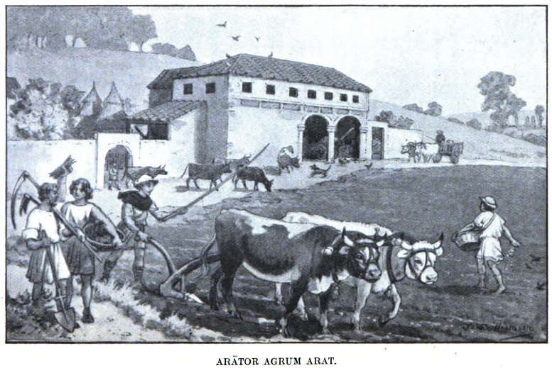

# Pons Tironum

## Expergīscor

**Animum attende! Imperō tibi ut animum attendās.**

Ante lūcem servus quīdam nōmine Dāvus ad cellam, ubi dormiō, venit; forēs pulsat, ac mihi ut surgam imperat. Ego dormīre volō; servō igitur ut abeat imperō. Servus abit, sed pater eum redīre iubet. Redit igitur et clāmāns “Pater tuus,” inquit, “ut statim surgās tibi imperat.” Ē lectulō, in quō dormiēbam, sine morā surgō; sed vestēs, quibus mē amicīre soleō, invenīre nōn possum. Dāvō igitur ut novam tunicam quaerat imperō. Ille autem “Cūr, inquit, “quod māter tibi imperat numquam facis? Cūr eī nōn pārēs? Nam semper tibi imperat ut tunicam apud lectulum tuum dēpōnās.” Ego tamen īrātus eī ut taceat imperō. Tacet igitur et aliī imperat servō ut tunicam novam mihi det. Servus ille alteram tunicam adfert, et mihi “Dāvus,” inquit, “ut hanc tunicam tibi darem mihi imperāvit. Imperāvit quoque ut celeriter tē amicīrēs.” Fēstīnō igitur et servum alterum calceōs (quōs in pedibus gerere soleō) adferre iubeō. Calceōs ille adfert, quōs ego pedibus indūcō. Deinde redit Dāvus, et “Māter tua,” inquit, “ut statim ad sē veniās tibi imperat.” Ad mātrem igitur eō, quae tunicam et calceōs meōs cūriōse īnspicit, et ut comās pectam mihi imperat. Dāvum igitur pectinem (quō comās pectimus) quaerere iubeō. Deinde māter mihi imperat ut collum iterum lavem, atque ut ad lūdum litterārium (ubi nōs puerī litterās discimus) proficīscar. Servum mēcum īre iubet. Hīc igitur servus, quī paedagōgus appellātur, mē ad lūdum comitātur. Loculōs meōs (quī librōs continent) ut portet imperō; at ille mihi imperat nē in viīs morer. Hōc modō ad lūdum venīmus, et paedagōgō ut domum redeat imperō.

Māter ad lūdum nōn it. Servōs ad sē venīre iubet. Omnibus nē tempus terant imperat; hunc ātrium pūrgāre, illum aquam ex impluviō (hōc est, ē stāgnō in mediō ātriō sitō in quod pluviae cadunt) adferre iubet. Dāvō tamen ut ad macellum (ubi multae sunt tabernae ex quibus variās rēs emimus) eat cibumque emat imperat. Dāvus igitur ad macellum abit et vēnditōrī ut būbulam domum nostram tempore mittat imperat. Saepenumerō tamen vēnditor nōn tempore mittit. Pater igitur īrātus Dāvum ad sē venīre iubet et “Nōnne,” inquit, “domina tibi imperāvit ut cibum emerēs ?” Cui Dāvus “Imperāvit,” inquit, “ut ad macellum īrem. Ad macellum īvī; laniō, ā quō carnem emere solēmus, ut būbulam mihi mōnstrāret imperāvī; nūllam praestō habēbat, sed aliī cuidam ut bovem quaereret imperāvit; alius ille in agrōs abīvit, agricolaeque ut bovem trucīdāret imperāvit. Agricola uxōrī imperāvit ut cultrum sibi daret; uxor vīcīnō, quī prope habitābat, cui mūtuum dederat cultrum, ut sibi redderet imperāvit. Īs cultrum reddidit, et uxōrī imperāvit ut grātiās marītō ageret. Uxor marītō suō cultrum dedit, eīque ut bovem statim trucīdāret imperāvit. Marītus ēius bovem trucīdāvit, servīsque ut ad macellum portārent imperāvit. Servī ad macellum bovem portāvērunt, laniōque ut pecūniam solveret imperāvērunt. Lanius eīs nē nimis poscerent imperāvit; ego quoque laniō nē nimis ā mē posceret imperāvī; būbulam ad nōs statim mittere iussī. Lanius ad nōs būbulam mīsit; ego coquō dedī, eīque ut statim coqueret imperāvī. Coquus mihi ut omnia tibi expōnerem imperāvit, ac būbulam coquere incēpit, quae nunc, ecce! Parāta adest.” Pater servum būbulam adportantem vīdit, et Dāvō ut ad culīnam redīret imperāvit.

Pater mihi nē nimis celeriter edam semper imperat. Ō mē miserum, ut multa sunt quibus semper dēbēmus abstinēre! Magister semper mihi imperat nē in lūdō lūdam; paedagōgus nē in viīs morer imperat; māter mihi nē digitōs rōdam imperat, imperat quoque nē frāterculum laedam. Frāterculus mihi nē crepundiīs suīs (quibus ipse lūdere solet) lūdam imperat. Herī frāterculum crepundia in ōs īnserentem vīdī, cui “Nōnne,” inquam, “māter tibi imperāvit nē crepundia in ōs īnsererēs?” ac crepundia ab eō āvellere cōnābar. Ille autem vāgīre incēpit; imperāvī eī nē īnfantem sē praestāret; vāgītum tamen māter audīvit, et mihi ut statim ad sē īrem imperāvit. “Nōnne,” inquit, “tibi imperāvī nē frātrem laederēs?” Cui ego “Nōnne frātrī,” inquam, “imperāvistī nē crepundia in ōs īnsereret? Ille tamen crepundia hōc modō in ōs īnserēbat“—et digitōs in ōs īnseruī Sed—ō mē miserum!—digitōs māter vīdit et “Nōnne,” inquit, “nē digitōs mordērēs tibi imperāvī?” Deinde paedagōgum ad sē venīre iubet, cui ut mē ad patrem dūcat imperat. Paedagōgus mē ad patrem dūcit. Ego īre nōlō; itaque moror, sed paedagōgus “Nōnne,” inquit, “saepenumerō nē morēris tibi imperāvī?” Pater mē reprehendit et “Nōnne,” inquit, “ut mātrī semper oboedīrēs tibi herī imperāvī?” Ego nihil respondeō, et pater mē ad cubiculum abīre iubet.

## Porta.

**Magister venit ut discipulōs doceat.
Discipulī ut recitent librōs aperiunt.**

Posterō diē pater meus negōtia aliquot āctūrus in urbem est prōgressus. Dum ante tabernam quandam stat, subitō accurrit malus nescioquis poēta quī “Carmen,” inquit, “ut recitem, amīce, ad tē veniō.” Cui pater “Nōn vacō,” respondet, nē tālī peste vexētur. Merīdiē in porticū Pompēiī ut sē recreāret cōnsēdit; cui sedentī Ligurīnus īdem accurrēns “Ō optime,” inquit, “iterum ad tē veniō ut carmina mea recitem.” Cui pater “Nōn vacō,” inquit, “nam ut dormīrem hūc ā multitūdine recessī.” Ligurīnus discessit, et pater iterum obdormīvit. Octāvā hōrā in thermās fūgit nē iterum poētae fieret obvius. Sed statim ad aurem sonat “Ō optime patrōne, vēnī tibi carmen aliquod recitātum.” Fugit pater ad piscīnam.  Nōn tamen natāre licet, quia Ligurīnus exclāmāns “Nunc tandem,” inquit, “ut audiās carmina prope aquam stāns sum tibi recitātūrus.”

Posteā pater hōc dē Ligurīnō scrīpsit carmen:—

Et stantī legis et legis sedentī,  
Currentī legis et legis morantī.  
In thermās fugiō; sonās ad aurem.  
Piscīnam petō: nōn licet natāre:  
Ad cēnam properō; tenēs euntem.  
Ad cēnam veniō; fugās sedentem.  
Lassus dormiō; suscitās iacentem.  

Quam pulchrum est carmen! Ego quoque dum carmina audiō poēta fierī volō. Nōnnumquam versūs compōnere cōnor, sed malī, immō vērō pessimī, sunt versiculī. Aliquando versiculōs quōs scrīpsī lūdī magistrō mōnstrō, sed ille “Vīsne, Lūcī,” inquit, “poēta fierī?” Ego aiō, et ille semper mihi imperat ut Graecōs scrīptōrēs identidem diēs noctēsque perlegam ut optima imiter exempla. Sed rēs est difficillima; multō facilius mihi vidētur esse prō patriā pugnāre. Herī dum domum redeō multōs vīdī mīlitēs, et mīles fierī et ipse cōnstituī Quam pulchram speciem prae sē ferunt mīlitēs! Ut dulce et decōrum est prō patriā pugnāre! Quam fortēs videntur esse mīlitēs! Ut nihil honestius agere possumus quam prō patriā morī! Nihil pulchrius esse potest quam mīlitis habitus. Ut hunc habitum videās spectā tabulam pictam.

## Mīles.

Hīc est mīles; gregārius est mīles quī ita appellātur quia quasi ūnus est ex grege mīlitum. Ut in pugnā servētur fert scūtum, galeam, lōrīcam, brācās; galeam quae caput ab ictibus dēfendat, lōrīcam quae pectus prōtegat, brācās nē crūra volnerentur, scūtum ut ab omnī corpore ictūs arceat. Tenet quoque, ut vidēs, pīlum et gladium; pīlum habet ut in hostēs ēminus coniciat, gladium ut comminus eōs feriat.

In Rōmānō exercitū alia quoque mīlitum sunt genera; equitēs, quī ex equō pugnant, ut victōs hostēs persequantur, funditōrēs quī fundīs glandēs vel lapidēs in hostēs iaciant, sagittāriī quī sagittās arcubus ēmittant. Est etiam dux ut exercitūs quasi caput sit. Īs ut omnia ōrdine agantur iussa dat mīlitibus. Ante pugnam solet omnibus imperāre ut summā virtūte, summō animō, summīs vīribus dēcertent.

## Cēna.

**Licetne nōbīs cēnāre? Ōrāmus tē ut nōbīs cēnāre liceat.**

Cottīdiē ferē domum apud nōs convīvae cēnātum veniunt. Convīvās pater ita dispōnit: ut in summō lectō accumbant rogat Semprōnium, avunculum meum, frātrēsque ēius duōs, ut in mediō cōnsulem aliōsque duōs magistrātūs, ut in īmō, ubi ipse accumbit, duōs reliquōs. Tum servō cuidam imperat ut gustum appōnat. Ōvīs plērumque aliīsque ēscīs, quō magis edere cupiant convīvae, initiō cēnae vēscimur; deinde per cēnam rēctam prōcēdimus ūsque ad mēnsās secundās, frūgēs cuiusvīs generis ut māla, pira, ūvās,—unde fit prōverbium “Ab ōvō ūsque ad mālum.” Dum secundīs fruuntur mēnsīs quīdam ex convīvīs patrem ōrat ut mē vocet. “Cupiō enim,” inquit, “eum recitantem audīre.” Pater igitur servō imperat ut mē roget ut praestō sim. Servus igitur mē intrōdūxit; tum pater mē ōrāvit ut quam optimē carmen aliquod recitārem. Ego autem omnēs precātus sum ut attentō animō mē audīrent et hunc in modum incēpī:—

Ut nova rīdent  
nitōre prāta daedalō,  
rīdet iuventūs  
ah! quam fugāx!  

Carpite (nam licet)  
pūra, sodālēs,  
gaudia quae dabit  
prīma iuventūs.  

Dum salit aestū  
fervente sanguis artubus,  
rōburque nescit  
frangī malīs,  

carpite (nam licet)  
pūra, sodālēs,  
gaudia quae dabit  
prīma iuventūs.  

Eia! per aurās  
follis sonantēs ēvolet;  
nec lūsus ācris  
cesset pilae.  

Carpite (nam licet)  
pūra, sodālēs,  
gaudia quae dabit  
prīma iuventūs.  

Ōtia lūdōs  
labōre parta suādeant  
lūdīque Mūsīs  
dent vigōrem.  

Carpite (nam licet)  
pūra, sodālēs,  
gaudia quae dabit  
prīma iuventūs.  

Postquam carmen recitāvī pater servum semper rogat ut crustula quaedam mihi adferat. Convīvae quoque nōnnūllīs praemiīs mē dōnant. Semprōnius librum pulcherrimum fābulās Aesōpī continentem mihi dedit. Hunc librum identidem legō, nam maximē mihi placet. Multae īnsunt tabulae pulcherrimē pictae, quārum dē ūnā vōbīs nārrābō. Spectā tabulam.

## Canis.

Quāle est hōc animal? Dīc mihi quāle sit.

Vidēsne hunc canem quī carnem ōre tenet? Scīsne quālis sit carō? Bovis est carō, būbulae nōmināta. Dīc mihi quid canis agat. Intellegisne cūr pontem trānseat? Ut ā laniō effugiat pontem trānsit; nam carnem, quam ōre portat, ā laniō quōdam abstulit. Rogāsne cūr fugiat? Nē ā laniō capiātur scīlicet fugit. Dum aufugit ad pontem pervēnit. Quō ferret pōns omnīnō nesciēbat, sed ut lanium vītāret trānsgredī incēpit. Dum trānsgreditur aliquid in aquā vīdit; quid esset nesciēbat, nūllus enim canis quid sit imāgō intellegere potest. Sed carō esse vidēbātur, et canis ille invenīre cupiēbat utrum illa in aquā carō melior esset carne (quam in ōre habēbat) necne. Quid igitur āctūrus sit omnēs, ut putō, bene scītis. Ōs enim ut imāginem rapiat apertūrus est, nam, ut dīxī, quid imāgō esset nōn intellegēbat.

Ut mihi placet hūiusmodī legere librōs! Multō iūcundiōrēs sunt quam grammaticī istī quōs in lūdō recitāmus. Equidem vērō cūr necesse sit tālēs legere librōs nesciō. Sed quō sapientior fīam pater mihi imperat ut lūdum frequentem; Iūdī magister omnibus ut librīs et stilō incumbāmus imperat nē semper rudēs incultīque sīmus. Sed cūr tantam necesse sit operam dare ut sapientēs fīāmus, nēmō mihi dīcere potest. Ōlim ipsum magistrum quam ob rem sapientēs nōn nātī essēmus rogāvī, sed ille nihil nisi mihi imperāvit nē stultum mē praestārem. Cūr hunc in modum respondisset tunc nescīvī; sed fortasse et ipse nescit quam ob rem necesse sit studēre ut sapientēs fīāmus. Ego saltem quōmodo rēs sē habeant nesciō; hōc tamen sciō—māter mihi ut ad lūdum eam imperat; pater imperat ut mātrī pāream; lūdī magister mē operam librīs dare iubet.

## Ludus.

**Ad lūdum currō quia timeō nē sērus veniam.**

Multa posteā tibi dē lūdō nārrābō, nunc autem haec pauca. Lūdum frequentāre mihi molestum est; quam molestum sit nēmō nisi puer intellegere potest. Sed cum condiscipulīs lūdere satis grātum mihi est, atque ut amīcōs mihi conciliem necesse est ad lūdum īre. Quot in lūdō nostrō sint discipulī nōn nārrābō. Quis enim hōc scīre volt? Nōn quot, sed quālēs sint discipulī scīre vīs. Dē omnibus nunc nārrāre nōn possum, sed quantum licet nunc audī Quīdam ex discipulīs, nōmine Gāius, ā condiscipulīs etiam Timidus est appellātus. Rogāsne cūr ita sit appellātus? Precārisne mē ut tibi dīcam cūr illud sit nōmen? Paucīs expōnam verbīs: Gāius semper timet, metuit, verētur; semper trepidus est. Māne timet nē pluat, nē magister pūniat. Dum pilā lūdit timet nē ipse cadat, vel nē cadat pila. Ante cēnam timet nē parum sit cibī. Dēnique semper timet nē quid malī accidat. Herī timēbat nē pēnsum recitāre nōn posset. A lūdō igitur omnīnō sē abstinuit; domum tamen nōn iit, timēbat enim nē māter sibi veniam nōn daret. Herī timēbat nē magister pūnīret; hodiē nē pūniat timet, crās timēbit nē pūniat. Intellegisne nunc tandem cūr Timidus sit appellātus?

Plērumque praelēctiōnēs in lūdō ōdī, sed interdum magister fābulās nōbīs nārrat. Hās valdē amō. Vīsne scīre quālēs sint? Animum igitur attende ut intellegās, ac tibi ūnam ex eīs quās magister nōbīs recitāvit nārrābō.

Fābula dē anū.

**Magistrō docente oportet discipulōs tacēre.**

“Ōlim erat anus quaedam quae sex assēs invēnit. Itaque ad macellum ut porculum emeret profecta est. Porculō ēmptō domum redībat, sed ad portam vēnit per quam porculus īre nōluit. Itaque anus canem ōrāvit ut porculum mordēret. Sed canis nōluit. Itaque cane recūsante ferulam ōrāvit ut canem percuteret. Sed ferula nōluit. Itaque ferulā recūsante ignem rogāvit ut ferulam ūreret. Sed ignis nōluit. Itaque ignī recūsante aquae imperāvit ut ignem exstingueret. Sed aqua nōluit. Itaque aquā recūsante taurum ōrāvit ut aquam biberet. Sed taurus nōluit. Itaque taurō recūsante lanium ōrāvit ut taurum interficeret. Sed lanius nōluit. Itaque laniō recūsante fūnem ōrāvit ut lanium suspenderet. Sed fūnis nōluit. Itaque fūne recūsante mūrem ōrāvit ut fūnem rōderet. Sed mūs nōluit. Itaque mūre recūsante fēlem ōrāvit ut mūrem ederet. Fēlēs autem ‘Sī lac,’ inquit, ‘mihi dederis, ego mūrem edam.’ Anus igitur ad vaccam prōgressa ōrāvit ut lac sibi daret. Vacca tamen ‘Sī aliquantulum faenī,’ inquit, ‘mihi dederis, ego lac tibi dabō.’ Itaque anus hominem quī agrōs colēbat ut faenum sibi daret ōrāvit. Sed homō ‘Sī,’ inquit, ‘aquam in crībrō mihi adportāveris, faenum tibi dabō.’ Anus igitur lapidēs et argillam crībrō imposuit et aquam adportāvit. Itaque aquā acceptā homō faenum dedit; faenō comēsō vacca lac dedit; lacte exhaustō fēlēs mūrem edere incēpit; caudā morsā mūs incēpit fūnem rōdere; quō factō fūnis lanium angere incēpit; iugulō compressō lanius incēpit taurum interficere; capite percussō taurus incēpit aquam bibere. Quibus factīs aqua ignem exstinguere incēpit; aquā sparsā ignis ferulam ūrere incēpit et ferula incēpit canem percutere. Itaque canis ferulā verberātus porculum mordēre incēpit et porculus per portam saltāns ēvāsit. Quibus factīs anus domum rediit.”

Nudius tertius hanc fābulam magister nōbīs nārrāvit, sed fābulās cottīdiē nōn nārrat. “Sī pēnsa,” inquit, “bene fēceritis fābulam vōbīs nārrābō,” sed ūnus et alter male faciunt. Nūllam igitur audīmus fābulam, sed magister artem grammaticam nōs docet.

Herī conclāve intrāvit. Cum intrāvisset discipulōs spectāvit. Cum discipulōs spectāvisset (vel, ubi discipulōs spectāvit; vel, postquam discipulōs spectāvit; vel, discipulīs spectātīs; vel, cum discipulī spectātī essent) crētam sustulit. Crētā sublātā (vel, cum sublāta esset crēta; vel, cum crētam sustulisset; vel, ubi crētam sustulit; vel, postquam crētam sustulit) in tabulā scrīpsit carmen. Carmine scrīptō (vel, ubi scrīptum est carmen; vel, postquam scrīpsit carmen; vel, cum scrīpsisset carmen; vel, cum scrīptum esset carmen) discipulōs recitāre iussit. Discipulī iussī carmen recitāvērunt. Carmine recitātō (vel, ubi recitāvērunt; vel, postquam recitāvērunt; vel, cum recitāvissent carmen) magister duās nārrāvit fābulās. Quibus fābulīs nārrātīs (vel, quās cum nārrāvisset fābulās; vel, quae cum nārrātae essent fābulae; vel; quās ubi nārrāvit fābulās) dīmīsit discipulōs. Discipulīs dīmissīs ipse prandium ēdit; discipulī dīmissī lūsum ēgressī sunt.

Ō mē miserrimum, stultissimum! Nōn possum haec omnia comprehendere. Mēns mihi perturbātur, cōnfunditur, miscētur. Quam multa idem significant!

Sed fēriae adsunt et lūdum multōs diēs omittam.

## Lectīcārius.

**Fēriae adsunt, sed nisi fēriae advēnissent ego mortuus essem.**  
**Sī magister nōs ad lūdum per fēriās īre vellet ego nōn īrem.**  

Dum hae fēriae aguntur Viā Sacrā forte ībam, cum subitō lectīcārius quīdam, quī aliquem lectīcā gestābat, ā tergō appropinquāns caput meum assere percussit. Petasum, ut accidit, gerēbam quī aliquid dē vī ictūs remīsit. Sed nisi petasum habuissem scelerātus ille omnīnō mē interfēcisset. Sī modo eum appropinquantem vīdissem dē viā eī dēcessissem, sed nōn vīdī. Sī modo “Cavē” clāmāvisset, idem fēcissem, sed nihil clāmāvit. Itaque mē offendit. Sī mē multō vehementius percussisset fortasse mē interfēcisset, et sī mē interfēcisset comprehēnsus esset ut sīcārius. Sī comprehēnsus esset in vincula esset iactus. Sī in vincula iactus esset inter sīcāriōs accūsātus esset. Sī accūsātus esset capitis esset damnātus. Sed, ut iam dīxī, nihil accidit nisi quod caput meum tumōre magnō fīēbat tumidum. Sī pater adfuisset valdē, putō, īrātus esset et hominem pulsāvisset. Tū quoque sī capitis tumōrem vīdissēs hominem reprehendissēs. Equidem vērō hunc in modum hominem allocūtus sum. “Quid, malum, fēcistī? Cūr tam celeriter curris? Nisi celeriter festīnāvissēs mē nōn percussissēs. Cavē nē poenās posteā dēs. Nam sī adultus essem tē iam caederem, quod nunc facerem sī modo baculum habērem. Utinam habērem, vel pater vel paedagōgus adesset, āctum esset dē pelle tuā, furcifer!” Ille autem “Tacē,” inquit, “nam quod mihi ita maledīxistī iterum tē percuterem nisi puerulus modo essēs.” Quibus dictīs ego hominem quī in lectīcā vehēbātur agnōvī. Ō mē miserum! Lūdī magister erat! Quō cognitō quam celerrimē mē recēpī; timēbam enim nē ille quoque mē agnōsceret. Domum reversus magistrum cum patre loquentem invēnī. Statim valdē timēbam nē rē vērā mē agnōvisset nēve quod lectīcāriō dīxeram audīvisset. Diū quam ob rem apud nōs adesset frūstrā mīrābar, sed tandem Dāvus ad mē vēnit et “Pater,” inquit, “ut statim ad sē in tablīnum eās tibi imperat.” Iterum nē poenās darem timuī, sed ut quam ob rem adesset magister invenīrem ad tablīnum sine morā mē contulī. Valvīs apertīs magistrum — mīrābile dictū! — rīdentem vīdī et, omnī timōre iam dēpositō, sēcūrus intrāvī Pater, cum mē adstantem percēpisset, “Cornēlius,” inquit, — ita enim nōminātus est lūdī magister — “ut negōtia quaedam sēcum agam mē in rūs vocāvit; itaque eum precātus sum ut tibi nōbīscum īre liceat.” Quibus audītīs vix auribus meīs crēdere potuī et magistrum rogāvī num vēra nārrāret pater. Ille ait, et pater mihi imperāvit ut statim mē parārem.

**Tam benignus est magister ut mē sēcum rūs īre sinat.**

Dum ego mē ad profectiōnem parō haec quoque pater mihi expōnit: “Adsunt Kalendae Sextīlēs. Itaque Cornēlius lūdum in Octōbrēs īdūs dīmīsit.” Quibus audītīs quam maximē gaudeō, nam tantā vī sōl aestāte ārdet ut nihil discere possim. Etiam sī lūdum aestāte frequentārem nihil discere possem. Quid enim? Nōnne Mārtiālis hunc in modum loquitur:—

Lūdī magister, parce simplicī turbae!  
Sīc tē frequentēs audiant capillātī.  
Ferulaeque trīstēs, scēptra paedagōgōrum  
Cessent, et īdūs dormiant in Octōbrēs.  
Aestāte puerī sī valent satis discunt.  

Nam sī qua alia urbs, est īnsalūbris Rōma; tantus est ardor sōlis ut nēmō quicquam possit discere; immō vērō adeō est īnsalūbris urbs ut lūdī magistrī suōs quisque discipulōs in īdūs Octōbrēs dīmittant. Ita grassantur febrēs ut dītissimus quisque aestāte in vīllās migret, immō vērō nēmō Rōmae maneat nisi urbāna cōgunt officia. Omnēs, ut putō, sī modo officia sinerent ad vīllās sē reciperent. Ultimō annō tempestās ita erat rabida ut omnēs tōtum diem in lectulīs ōtiōsī requiēscerent. Ita furēbat aestus ut neque litterās discere, neque ambulāre, neque edere, nihil nisi bibere possent. Ut Mārtiālis dīxit, tantum vītae ēius dētrāxit urbis pestilentia, ut, sī eōs modo computāret annōs per quōs valēbat, rē vērā īnfāns etiam nunc esset. Pater igitur ita veritus est nē in morbum inciderem, ut mē rūs sēcum addūcere cōnstituerit.

## Iter.

Sed ut nārrātiōnem meam bene intellegās, oportet mē aliquid grammaticē expōnere. Nōlī timēre nē tē taedeat. Nōn sum magister lūdī neque illī adsunt diēs per quōs lūdum frequentāmus. Fēriae adsunt, et iter nostrum sum tibi nārrātūrus.  Prīmum tamen hōc grammaticē: sententiam *Magister venit ut doceat* nōs Rōmānī hunc quoque in modum vertimus **Magister docendī causā venit.** Similiter dīcimus aut

**Puerī ut discant lūdum frequentant.**  

aut

**Puerī discendī causā lūdum frequentant.**  

Sed vereor ut intellegās. Oportet mē melius expōnere; melius mihi expōnendum est. *Docendī causā* idem significat quod *ut doceat* prīmā in sententiā, et *discendī causā* idem quod ut discant secundā in sententiā. Intellegisne nunc? Oportet tē intellegere; intellegendum est tibi. Hōc quoque mihi dīcendum est:—Eandem sententiam *Magister
docendī causā venit* hunc quoque in modum vertere possumus:—

**Magister ad discipulōs docendōs venit.**  

Sed vereor nē artis grammaticae iam tē taedeat. Reliquā igitur parte omissā, ad iter nostrum pergam.

Māne experrēctus cum patre ad forum īvī raedae condūcendae causā. Prīmā hōrā magistrō comitante profectī sumus ut iter tempore perficerēmus. Dum Viā Appiā vehimur, multa mihi posteā nārranda vīdimus. Quārtā circiter hōrā ad dēversōrium pervēnimus, ubi omnibus ex raedā dēscendendum erat edendī bibendīque causā. Quam ieiūnus eram! Tam avidē edēbam, ut pater hīs verbīs mē reprehendere incēperit. “Nōlī cibum tam avidē dēvorāre; nōnne saepenumerō tibi imperāvī nē avidum in edendō tē praestēs; prōverbium meum nōn ignōrās — *ut vīvāmus edendum est, nōn vīvendum est ut edāmus* — prūdentissimus quisque vīvendī causā edit; stultissimus quisque edendī causā vīvit. Festīnā tamen, namque iterum in raedam nōbīs est ascendendum.” Quibus audītīs ego festīnō; aliquantulum cibī in sinū pōnō, et omnēs iterum raedam ascendimus.

In itinere faciendō ut sunt multa cūranda! Nē nimis impedīmentōrum raedae impōnāmus prōvidendum est; ungulae equī identidem sunt spectandae, nē lapidēs inhaeserint, nec nōn rotae sunt īnspiciendae, nē quid damnī accēperint. Quae omnia in hōc itinere faciendō nōbīs accidērunt. Nam simul atque iterum sumus profectī, pater ad raedārium versus “Timeō, ” inquit, “nē sērō adveniāmus. Cūr nōn cursum accelerās?” Cui raedārius “Celerius,” inquit, “īre nōn possum; cūr tot impedīmenta tēcum adportās? Sī minus impedīmentōrum adportārēs, celerius īre possēmus. Num colōniae dēdūcendae causā iter facis?” Quibus audītīs Cornēlius quidem rīsit et facētiās hominis laudāvit, sed pater et raedārius paulīsper inter sē collocūtī, ad dēversōrium redīre cōnstituērunt, onera levandī causā. Itaque Cornēliō comitante hī duo reversī sunt. Ego tamen lūdendī causā ē raedā dēscendī Calculīs, quippe quī tālōs nōn habērem, hunc in modum lūdēbam. Septem vel octō calculōs in manum collēctōs in āera iaciēbam et dum calculī cadunt quam plūrimōs manū reversā excipere cōnābar. Diū hunc lūdum, dum patrem exspectō, lūsī. Tandem autem pater rediit et mihi ut in raedam iterum ascenderem imperāvit. Cui ego “Cūr, pater,” inquam, “tam diū āfuistī?” “Tam celeriter,” respondit ille, “ad dēversōrium contendēbāmus, ut rota dextra celerrimō cursū agitāta ab axe omnīnō sē līberāverit raedaque prōna nōs omnēs ad terram praecipitāverit.” Cui ego exclāmāns “Ō pater,” inquam, “num laesus es?” “Mīrābile dictū,” respondit ille, “nihil damnī accēpimus nisi quod rota refīxa iterum nōbīs erat affīgenda; cuius rotae affīgendae causā diū sumus morātī. Sed nisi Iūppiter nōs servāvisset, omnīnō essēmus interfectī. Nunc autem prōcēdāmus.” Quibus dictīs vix iterum profectī sumus, cum equus subitō claudicāre incēpit, et pater raedārium rogāvit quae causa esset. “Vereor, respondit raedārius, “nē calculus ungulae inhaereat,” et rūrsus nōbīs erat dēscendendum calculī ex ungulā extrahendī causā Quō extractō raedārius “Hunc,” inquit, “nisi extrāxissem equus omnīnō claudus esset factus.”

Tandem autem ad vīllam ad quam contendēbāmus tūtī pervēnimus. Equidem vērō adeō fatīgātus eram, ut statim cubitum īrem. Proximō diē māne in agrōs vagātus, multa inūsitāta neque anteā ā mē vīsa invēnī. Vīlicum mīrum quoddam īnstrūmentum fingentem vīdī, cui ego “Quid, sōdēs,” inquam, “ibi facis?” “Arātrum,” respondit, “fingō, namque ut pānis suppetat nōbīs segetēs sunt serendae; ut segetēs crēscant agrī arandī sunt, ac mihi ad agrōs arandōs hōc īnstrūmentum faciendum est.” Multa quoque alia vīlicus mihi expōnere incēpit, sed mox mihi abeundum erat ad prandium edendum. Ut in prandiō edendō gaudēbam! Coquus enim multa ac varia legūmina nōs dēlectandī causā apposuit. Ego timēbam nē pater mē iterum reprehenderet quod mē tam avidum in edendō praestārem.

Posterō diē pater, rēbus perfectīs ad quās perficiendās profectus est, Rōmam rediit. Mē tamen rūrī relīquit, nē sī ad urbem īnsalūbrem reversus essem in morbum inciderem. Mēnse tamen Octōbrī appropinquante mē quoque ad urbem revocāvit, ut ad lūdum redīrem. Dē lūdō pauca tibi iam nārrāvī, sed, ut anteā dīxī, multa alia mihi sunt nārranda.

## Iterum dē lūdō narrō.

Herī in lūdō discipulus quīdam, Decimus nōmine, rīsit. Magister “Decime,” inquit, “putō tē rīsisse.” Deinde perrēxit hunc in modum nōs docēre. “Sī ante hūiusmodī sententiās ‘Decimus rīdet,’ ‘Omnēs rīsērunt,’ ‘Rīdēbō,’ verbum pōnō dīcendī vel sentiendī (ut ‘dīcere,’ ‘respondēre,’ ‘arbitrārī,’ ‘putāre,’ ‘prō certō habēre’) subiectum (‘Decimus,’ ‘omnēs,’ ‘ego’) in cāsum vertitur accūsātīvum (‘Decimum,’ ‘omnēs, ‘mē’), verbum in īnfīnītīvum vertitur, ita tamen ut et tempus idem sit, et vōx quoque sit eadem.”

Decimus rīdet.

> putō Decimum rīdēre.

omnēs rīsērunt.

> putō omnēs rīsisse.

rīdēbō.

> putō mē rīsūrum esse.

mīles interficitur.

> putant mīlitem interficī.

mīles interfectus est.

> putābant mīlitem interfectum esse.

mīles interficiētur.

> putāvit mīlitem interfectum īrī.

Ut hunc dīcendī modum bene intellegāmus, magister nōnnumquam puerō cuidam imperat ut sententiās quāsdam dīcat, alterīque imperat puerō ut omnia cēterīs discipulīs nārret. Statim hunc in modum pergimus :—

Discipulus.

> Discipulus alter cēterīs nārrāns.

Magister est īrācundus.

> Sextus magistrum īrācundum esse dīcit.

Magister discipulōs male docuit.

> Sextus magistrum discipulōs male docuisse dīcit.

Magister mihi praemium dabit.

> Sextus magistrum sibi praemium datūrum esse dīcit.

Bonus sum discipulus.

> Sextus sē bonum esse discipulum putat.

Pessimī sunt aliī discipulī.

> Sextus aliōs discipulōs pessimōs esse putat.

Māter mea mihi crustula dabit.

> Sextus mātrem suam sibi crustula datūram esse putat.

Hanc cōnstrūctiōnem omnēs iam intellēxērunt.

> Sextus omnēs hanc cōnstrūctiōnem iam intellēxisse putat.

Et vōs omnia iam intellegere prō certō habeō. Nōn enim putō vōs stultōs esse discipulōs: vōs stultōs esse negō. Magister nōnnumquam mē stultum esse dīcit, sed putō eum errāre. Mox mē sapientem esse inveniet, nam pater et māter prō certō habent mē sapientem fore; negant enim magistrum omnia posse praedīcere. Cēterum magister omnēs parentēs stultōs esse putat, et saepenumerō in lūdō “Omnēs,” inquit, “parentēs suōs līberōs optimōs esse arbitrantur.”

## Rogātor.

Num ex memoriā tuā cecidit ille discipulus cui agnōmen erat Timidus? Est enim alius condiscipulus dē quō velim tibi nōnnūlla nārrāre. Nōmen eī est Mārcō. Cum tamen numquam loquātur nisi interrogandō, agnōmen eī quoque indidimus. Appellāmus enim Rogātōrem. Herī patrem rogāvit quid ageret, quid prīdiē ēgisset, quid posterō diē esset āctūrus. Deinde rogāvit quot mīlitēs stīpendia merērent, quōrum quot essent gregāriī, quot centuriōnēs, quot tribūnī, quot prīmipīlārēs. Mox dum ad lūdum pergit obvius fit condiscipulō cuidam quem statim rogāvit num pēnsum perfēcisset, quot hōrās in perficiendō cōnsūmpsisset, utrum difficile fuisset necne; utrum posteā lūsūrus esset necne, multa alia quōrum oblītus sum. Lūdum ingressus magistrum quoque rogandō excruciat. Rogat num pulchrē pēnsum scrīpserit; quandō fēriās rūrsus sīmus āctūrī, quandō incipiant spectācula, multās aliās nūgās quās taedet mē nārrandī. Et vereor nē tē quoque taedeat; reliquās igitur interrogātiōnēs ēius omittam, nam putō mē iam satis dē lūdō et condiscipulīs meīs nārrāvisse. Ad alia pergendum est.

## Patris ōrātiō apud tribūnal praetōris habita.

Ōlim pater, quī causidicus praeclārus est, ut ōrātiōnēs audīrem ad tribūnal praetōris sēcum mē addūxit. Quam multī hominēs aderant — reus ipse, quī fūrtī erat accūsātus, patrōnus ēius, quī eum dēfenderet, pater meus ōrātiōnem contrā accūsātum habitūrus, nec nōn praetor togā praetextā amictus quī in sellā curūlī sedēbat, iūdicēs quī in subselliīs ad praetōris pedēs sedēbant! Mox praetor ad patrem meum versus ut ōrātiōnem habēret eī imperāvit, quī hunc in modum statim incēpit:—

“Nēmō dubitāre potest, iūdicēs, quīn hīc improbissimus, scelerātissimus, nēquissimus, quem ante oculōs sūdantem, pallentem, rubentem, sceleris sibi cōnscium vidētis, sī quis alius nocēns sit. Nōn dubium est quīn valdē perturbētur. Spectāte, iūdicēs! Vidētisne labra quō modō eī tremant? Et genās ut exsanguēs fīant? Quis dubitāre potest quīn hīc sceleris sibi cōnscius sit? Mihi quidem nōn dubium est quīn iam ante oculōs carcerem, vincula, carnificem ipsum cernere videātur. Namque omnia ē testibus dīligenter quaesīvī, quae singula vōbīs expōnam. Hīc enim, quī nunc nē capitis damnētur vehementer timet, anteā nihil timēbat. Quid enim? Timēbatne nē comprehenderētur? Minimē vērō. Nōn dubitāvit quīn facile effugere posset. Intempestā nocte domuī petītōris appropinquāvit. Fenestram apertam vīdit; nōn dubium erat quīn omnēs iam dormīrent. Nūllum sonum audīvit. Nihil eī obstitit quīn per fenestram ingressus argentum caelātum auferret.  Per fenestram igitur tacitus, nē quem ē somnō excitāret, intrāvit. Omnia prospere ēvēnērunt; argentum caelātum facile invēnit; in saccum, quem sēcum adportāverat, immīsit. Nihil eum impediēbat quīn tūtus ēvāderet, cum subitō ab hōc, quī ut omnia mihi testificētur adest, oppressus ad terram dēicitur. Testem, iūdicēs, audīte.”

*Tēstis.* “Ex animī meī sententiā iūrābō vērumque dīcam. Nudius quīntus, quippe quī ex ventre labōrārem, noctū dormīre nōn poteram. Nōn dubitāvī quīn gravī morbō affectus moritūrus essem. Mūcium igitur quī testāmentum mihi cōnsignāret quaerere cōnstituī. Domum apud eum statim īvī, et — mīrābile dictū — aliquem per fenestram intrantem vīdī. Nōn dubitāre poteram quīn scelus quoddam conciperet, et eī obstāre cōnstituī quōminus effugeret. Itaque per fenestram et ipse ingressus quid esset āctūrus exspectāvī, nam nūllum mihi dubium erat quīn esset fūr. Et rēctē suspicātus sum. Multa enim pōcula argentea et aliud argentum, et pūrum et caelātum, in saccum immīsit, et iam ad fenestram, quā intrāverat, regrediēbātur, cum subitō ego ā tergō appropinquāvī et eum comprehendī.”

Quō testimōniō datō pater meus assurrēxit et “Nēmō,” inquit, “iūdicēs, dubitāre potest quīn hīc vēra nārret. Quid igitur vōbīs obstat quōminus hominem tam scelestum, tam nefārium, statim damnētis? Dīxī.”

Patrōnus fūris deinde ōrātiōnem habuit, sed ego quī nēminem nisi patrem audīre voluissem domum abīvī. Sed patrem posteā rogāvī utrum iūdicēs fūrem damnāvissent necne, et ille arrīdēns eum omnium cōnsēnsū esse damnātum dīxit.

## Fābulae.

Nōn ita multō post, convīvae quīdam ut diem mihi nātālem celebrārent apud nōs vēnērunt. Itaque mātrī persuādēre cōnābar, ut paulō diūtius quam solitum mihi licēret vigilāre. Facile eī persuāsum est. Itaque omnēs circā focum cōnsēdimus ut ōtiō fābulās nārrandō fruerēmur. Cum omnēs cōnsēdissent avunculus meus hunc in modum prīmus incēpit :—

**Scīrōn.**

“Scīrōn latrō īnfāmis erat, quī regiōnem inter Megaram et Atticam īnfēstam reddēbat. Ad mare locō quōdam praeruptō solēbat sedēre; deinde sī quis appropinquāverat viātor, eum cōgēbat sibi pedēs lavāre atque in mare praecipitābat. Hunc Thēseus, dum iter facit, saxō residentem cōnspexit. Quō vīsō statim quae audierat in memoriam revocāvit. Itaque ā tergō appropinquāns Scīrōnem ex imprōvīsō aggressus parī lētō in mare dēiēcit; cuius ossa flūctibus agitāta scopulīs inhaesērunt. Unde Scīrōnia saxa ab ēius nōmine sunt appellāta.”

Quā nārrātā fābulā, māter cum patrem nōn adesse animadvertisset, versa ad mē “Abī, Lūcī,” inquit, “ad patrem, quī epistulās in tablīnō scrībit, et cōnāre eī persuādēre ut ad nōs veniat.” Ego igitur abitūrus “Nōlīte,” inquam, “aliās nārrāre fābulās priusquam ego redeam.” Patrem in tablīnō invēnī, cui diū persuādēre cōnābar ut negōtia sua paulīsper omitteret. “Statim,” inquam, “venī, pater, priusquam aliam nārrent fābulam.” Quō dictō, eī persuāsum est ut ad nōs venīret. Quae iam nārrāta essent māter eī breviter exposuit. Avunculum fābulam hūiusmodī nārrāvisse dīxit: Scīrōnem latrōnem īnfāmem esse quī regiōnem inter Megaram et Atticam īnfēstam redderet. Solēre hunc ad mare locō praeruptō sedēre; deinde sī quis appropinquāvisset viātor cōgere eum sibi pedēs lavāre atque in mare praecipitāre. Quem Thēseum, dum iter facit, saxō residentem vīdisse. Quō vīsō statim quae audīvisset in memoriam revocāvisse. Itaque Thēseum ā tergō appropinquantem Scīrōnem ex imprōvīsō aggressum parī lētō in mare dēiēcisse.

Quibus expositīs et patrī persuāsimus ut aliquid nārrāret. Nec mora erat, sed ille statim “Nesciō,” inquit, “an possim; audīte tamen et quantum possum faciam.” Cui māter, “Festīnā modo,” inquit, “nam Lūcius nōn prius volt cubitum abīre quam aliam audiat fābulam, et secunda iam adest vigilia.” Pater igitur hunc in modum perrēxit.

**Nīsus.**

“Līber, cum in Indiam exercitum ductūrus esset, Nīsō nūtrīciō suō, dum ipse redīret, rēgnī Thēbānī potestātem trādidit. Sed postquam inde reversus est, Nīsus rēgnō cēdere nōluit. Itaque Līber, quippe quī cum nūtrīciō contendere nōllet, passus est eum rēgnum obtinēre dum occāsiō sibi rēgnī occupandī darētur. In grātiam igitur cum eō rediit, et post tertium annum ut rēgnō eum prīvāret hōc iniit cōnsilium. Cum sacra quaedam sē factūrum esse simulāvisset, mīlitēs muliebrī ōrnātū tamquam Bacchās intrōdūxit, quī Nīsum sē rēgnō abdicāre coēgērunt.”

Quibus nārrātīs māter statim mihi ut cubitum abīrem persuādēre est cōnāta, cui ego “Sine mē,” inquam, “māter, dōnec aliam audiam fābulam manēre.” Sed nūllō modō eī persuāsum est ut veniam mihi daret. Dum autem cōnor, ūnus ex convīvīs rogāvit cūr in lectīs adhibērentur asellōrum capita, quī negantibus sē scīre haec exposuit:—

**Cūr in Iectīs sunt asellōrum capita.**

“Ōlim asellus quīdam erat quī vītem in prātō inventam gustābat. Suāvitāte dēlectātus hanc edēbat; ac vītis palmite abrōsō in maius crēscēbat et multō ferācior reddita est. Ūvās dēnique prōcreāvit quās pāstōrēs invēnērunt, vīnumque fēcērunt. Quāpropter Rōmānī, quod asellus eōs vītēs amputāre docuit, in triclīniōrum fulcrīs capita asellōrum vīte alligāta habent.”

Quibus audītīs ego cubitum abīvī. Ut placet mihi tālēs audīre fābulās! Numquam iterum, ut putō, aliās tam ēgregiās sum audītūrus dōnec proximus mihi aderit diēs nātālis. Sed cum proximus aderit annus nōn iam fortasse Rōmae erimus.
