# Cicero's Selected Orations 

Charles E. Bennett

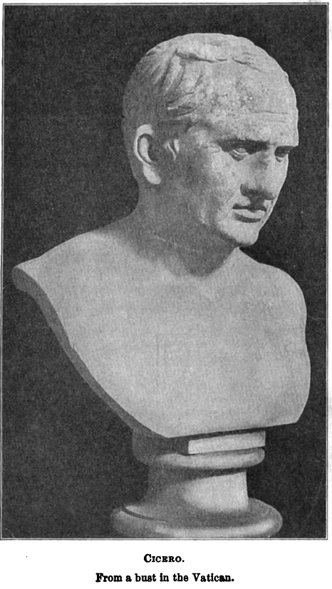

## Ōrātiō in Catilīnam prīma

*In senātū habita.*

### I.

**1.** Quō ūsque tandem abūtere, Catilīna, patientia nostrā? Quam diū etiam furor iste tuus nōs ēlūdet? Quem ad fīnem sēsē effrēnāta iactābit audācia ? Nihilne tē nocturnum praesidium Palātī, nihil urbis vigiliae, nihil timor populī, nihil concursus bonōrum omnium, nihil hīc mūnītissimus habendī senātūs locus, nihil hōrum ōra vultūsque mōvērunt ? Patēre tua cōnsilia nōn sentīs? Cōnstrictam iam hōrum omnium scientiā tenērī coniūrātiōnem tuam nōn vidēs? Quid proximā, quid superiōre nocte ēgeris, ubi fuerīs, quōs convocāverīs, quid cōnsilī cēperīs, quem nostrum ignōrāre arbitrāris?

**2.** Ō tempora; ō mōrēs! Senātus haec intellegit, cōnsul videt; hīc tamen vīvit. Vīvit? Immō vērō etiam in senātum venit, fit pūblicī cōnsilī particeps, notat et dēsignat oculīs ad caedem ūnum quemque nostrum. Nōs autem, fortēs virī, satis facere reī pūblicae vidēmur, sī istīus furōrem ac tēla vitēmus. Ad mortem tē, Catilīna, dūcī iussū cōnsulis iam prīdem oportēbat; in tē cōnferrī pestem, quam tū in nōs māchināris.

**3.** An vērō vir amplissimus, P. Scīpiō, pontifex maximus, Ti. Gracchum mediocriter labefactantem statum reī pūblicae prīvātus interfēcit; Catilīnam orbem terrae caede atque incendiīs vāstāre cupientem nōs cōnsulēs perferēmus? Nam illa nimis antīqua praetereō, quod C. Servīlius Ahāla Sp. Maelium novīs rēbus studentem manū suā occīdit. Fuit, fuit ista quondam in hāc rē pūblicā virtūs, ut virī fortēs acriōribus suppliciīs cīvem perniciōsum quam acerbissimum hostem coercērent. Habēmus senātūs cōnsultum in tē, Catilīna, vehemēns et grave; nōn dēest reī pūblicae cōnsilium neque auctōritās huius ōrdinis; nōs, nōs, dīcō apertō, cōnsulēs dēsumus.

### II.

**4.** Dēcrēvit quondam senātus, ut L. Opīmius cōnsul vidēret, nē quid rēs pūblica dētrīmentī caperet; nox nūlla intercessit; interfectus est propter quāsdam sēditiōnum suspīciōnēs C. Gracchus, clārissimō patre, avō, maiōribus; occīsus est cum līberīs M. Fulvius cōnsulāris. Similī senātūs cōnsultō C. Mariō et L. Valeriō cōnsulibus est permissa rēs pūblica; num ūnum diem posteā L. Sāturnīnum tribūnum plēbis et C. Servīlium praetōrem mors ac reī pūblicae poena remorāta est?

At nōs vīcēsimum iam diem patimur hebēscere aciem hōrum auctōritātis. Habēmus enim huiusce modī senātūs cōnsultum, vērum inclūsum in tabulīs tamquam in vāgīnā reconditum, quō ex senātūs cōnsultō cōnfestim tē interfectum esse, Catilīna, convēnit. Vīvis, et vīvis nōn ad dēpōnendam, sed ad cōnfirmandam audāciam. Cupiō, patrēs cōnscrīptī, mē esse clēmentem, cupiō in tantīs reī pūblicae perīculīs mē nōn dissolūtum vidērī, sed iam mē ipse inertiae nēquitiaeque condemnō.

**5.** Castra sunt in Italiā contrā populum Rōmānum in Etrūriae faucibus collocāta; crēscit in diēs singulōs hostium numerus; eōrum autem castrōrum imperātōrem ducemque hostium intrā moenia atque adeō in senātū vidēmus intestīnam aliquam cotīdiē perniciem reī pūblicae mōlientem: Sī tē iam, Catilīna, comprehendī, sī interficī iusserō, crēdō, erit verendum mihi, nē nōn potius hōc omnēs bonī sērius a mē quam quisquam crūdēlius factum esse dicat.

Vērum ego hōc, quod iam prīdem factum esse oportuit, certā dē causā nōndum addūcor ut faciam. Tum dēnique interficiēre, cum iam nēmō tam improbus, tam perditus, tam tuī similis invenīrī poterit, quī id nōn iūre factum esse fateātur.

**6.** Quamdiū quisquam erit, quī tē dēfendere audeat, vīvēs, et vīvēs ita ut vīvis, multīs meīs et firmīs praesidiīs obsessus, nō commovēre tē contrā rem pūblicam possīs Multōrum tē etiam oculī et aurēs nōn sentientem, sīcut adhūc fēcērunt, speculābuntur atque custōdient.

### III.

Etenim quid est, Catilīna, quod iam amplius exspectēs, sī neque nox tenebrīs obscūrāre coetūs nefāriōs nec prīvāta domus parietibus continēre vōcēs coniūrātiōnis tuae potest, sī illūstrantur, sī ērumpunt omnia? Mūtā iam istam mentem; mihi crēde; oblīvīscere caedis atque incendiōrum. Tenēris undique; lūce sunt clāriōra nōbīs tua cōnsilia omnia; quae iam mēcum licet recognōscās.

**7.** Meministīne mē ante diem XII Kalendās Novembris dīcere in senātū fore in armīs certō diē, quī diēs futūrus esset ante diem VI Kalendās Novembrīs, C. Mānlium, audāciae satellitem atque administrum tuae? Num mē fefellit, Catilīna, nōn modo rēs tanta, tam atrōx tamque incrēdibilis, vērum, id quod multō magis est admīrandum, diēs? Dīxī ego īdem in senātū caedem tē optimātium contulisse in ante diem V Kalendās Novembrīs, tam cum multī prīncipēs cīvitātis Rōmā nōn tam suī cōnservandī quam tuōrum cōnsiliōrum reprimendōrum causā profūgērunt. Num īnfitiārī potes tē illō ipsō diē meīs praesidiīs, meā dīligentiā circumclūsum, commovēre tē contrā rem pūblicam nōn potuisse, cum tū discessī cēterōrum nostrā tamen, quī remānsissēmus, caede tē contentum esse dīcēbās?

**8.** Quid? Cum tē Praeneste Kalendīs ipsīs Novembribus occupātūrum nocturnō impetū esse cōnfīderēs, sēnsistīne illam colōniam meō iussū meīs praesidiīs, custōdiīs, vigiliīs esse mūnītam ? Nihil agis, nihil mōlīris, nihil cōgitās, quod nōn ego nōn modo audiam, sed etiam videam plānēque sentiam.

### IV.

Recognōsce tandem mēcum noctem illam superiōrem; iam intellegēs multō mē vigilāre ācrius ad salūtem quam tē ad perniciem reī pūblicae. Dīcō tē priōre nocte vēnisse inter falcāriōs (nōn agam obscūre) in M. Laecae domum; convēnisse eōdem complūrēs eiusdem āmentiae scelerisque sociōs. Num negāre audēs? Quid tacēs? Convincam, sī negās. Videō enim esse hīc in senātū quōsdam, quī tēcum ūnā fuērunt.

**9.** Ō dī immortālēs! Ubinam gentium sumus? In quā urbe vīvimus? Quam rem pūblicam habēmus? Hīc, hīc sunt in nostrō numerō, patrēs cōnscrīptī, in hōc orbis terrae sānctissimō gravissimōque cōnsiliō, quī dē nostrō omnium interitū, quī dē huius urbis atque adeō dō orbis terrārum exitiō cōgitent! Hōs ego videō cōnsul et dē rē pūblicā sententiam rogō et, quōs ferrō trucīdārī oportēbat, eōs nōndum vōce vulnerō! Fuistī igitur apud Laecam illā nocte, Catilīna; distribuistī partēs Italiae; statuistī, quō quemque proficīscī placēret; dēlēgistī, quōs Rōmae relinquerēs, quōs tēcum ēdūcerēs; discrīpsistī urbis partēs ad incendia, cōnfirmāstī tē ipsum iam esse exitūrum; dīxistī paulum tibi esse etiam nunc morae, quod ego vīverem. Repertī sunt duo equitēs Rōmānī, quī tē istā cūrā līberārent et sēsē illā ipsā nocte paulō ante lūcem mē in meō lectulō interfectūrōs pollicērentur.

**10.** Haec ego omnia vixdum etiam coetū vestrō dīmissō comperī; domum meam maiōribus praesidiīs mūnīvī atque firmāvī, exclūsī eōs, quōs tū ad mē salūtātum māne mīserās, cum illī ipsī vēnissent, quōs ego iam multīs ac summīs virīs ad mē id temporis ventūrōs esse praedīxeram.

### V.

Quae cum ita sint, Catilīna, perge, quō coepistī; ēgredere aliquandō ex urbe; patent portae; proficīscere. Nimium diū tē imperātōrem tua illa Mānliāna castra dēsīderant. Ēdūc tēcum etiam omnēs tuōs; sī minus, quam plūrimōs; pūrgā urbem. Magnō mē metū līberābis, dum modo inter mē atque tē mūrus intersit. Nōbīscum versārī iam diūtius nōn potes; nōn feram, nōn patiar, nōn sinam.

**11.** Magna dīs immortālibus habenda est atque huic ipsī Iovī Statōrī, antīquissimō custōdī huius urbis, grātia, quod hanc tam taetram, tam horribilem tamque īnfēstam reī pūblicae pestem totiēns iam effūgimus. Nōn est saepius in ūnō homine summa salūs perīclitanda reī pūblicae. Quamdiū mihi cōnsulī dēsignātō, Catilīna, īnsidiātus es, nōn pūblicō mē praesidiō, sed prīvātā dīligentiā dēfendī. Cum proximīs comitiīs cōnsulāribus mē cōnsulem in Campō et competītōrēs tuōs interficere voluistī, compressī cōnātus tuōs nefāriōs amīcōrum praesidiō et cōpiīs, nūllō tumultū pūblicē concitātō; dēnique, quotiēnscumque mē petīstī, per mē tibi obstitī, quamquam vidēbam perniciem meam cum magnā calamitāte reī pūblicae esse coniūnctam.

**12.** Nunc iam apertē rem pūblicam ūniversam petis, templa deōrum immortālium, tēcta urbis, vītum omnium cīvium, Italiam tōtam ad exitium et vāstitātem vocās. Quārē, quoniam id, quod est prīmum, et quod huius imperī disciplīnaeque maiōrum proprium est, facere nōndum audeō, faciam id, quod est ad sevēritātem lēnius et ad commūnem salūtem ūtilius. Nam sī tē interficī iusserō, residēbit in rē pūblicā reliqua coniūrātōrum manus; sīn tū, quod tē iam dūdum hortor, exieris, exhauriētur ex urbe tuōrum comitum magna et perniciōsa sentīna reī pūblicae.

**13.** Quid est, Catilīna? Num dubitās id mē imperante facere, quod iam tuā sponte faciēbās? Exīre ex urbe iubet cōnsul hostem. Interrogās mē, num in exsilium; nōn iubeō, sed, sī mē cōnsulis, suādeō.

### VI.

Quid est enim, Catilīna, quod tē iam in hāc urbe dēlectāre possit? In quā nēmō est extrā istam coniūrātiōnem perditōrum hominum, quī tē nōn metuat, nēmō, quī nōn ōderit. Quae nota domesticae turpitūdinis nōn inusta vītae tuae est? Quod prīvātārum rērum dēdecus nōn haeret in fāmā? Quae libīdō ab oculīs, quod facinus ā manibus umquam tuīs, quod flāgitium ā tōtō corpore āfuit? Cui tū adulescentulō, quem corruptēlārum illecebrīs irrētīssēs, nōn aut ad audāciam ferrum aut ad libīdinem facem praetulistī?

**14.** Quid vērō? Nūper cum morte superiōris uxōris novīs nūptiīs domum vacuēfēcissēs, nōnne etiam aliō incrēdibilī scelere hōc scelus cumulāstī? Quod ego praetermittō et facile patior silerī, nē in hāc cīvitāte tantī facinoris immānitās aut exstitisse aut nōn vindicāta esse videātur. Praetermittō ruīnās fortūnārum tuārum, quās omnīs impendēre tibi proximīs Īdibus sentiēs; ad illa veniō, quae nōn ad prīvātam ignōminiam vitiōrum tuōrum, nōn ad domesticam tuam difficultātem ac turpitūdinem, sed ad summam rem pūblicam atque ad omnium nostrum vītam salūtemque pertinent.

**15.** Potestne tibi haec lūx, Catilīna, aut huius caelī spīritus esse iūcundus, cum sciās esse hōrum nēminem, quī nesciat tē prīdiē Kalendās Iānuāriās Lepidō et Tullō cōnsulibus stetisse in Comitiō cum tēlō, manum cōnsulum et prīncipum cīvitātis interficiendōrum causā parāvisse, scelerī ac furōrī tuō nōn mentem aliquam aut timōrem tuum, sed fortūnam populī Rōmānī obstitisse? Ac iam illa omittō (neque enim sunt aut obscūra aut nōn multa commissa posteā); quotiēns tū mē dēsignātum, quotiēns cōnsulem interficere cōnātus es! quot ego tuās petītiōnēs ita coniectās, ut vītārī posse nōn vidērentur, parvā quādam dēclīnātiōne et, ut aiunt, corpore effūgī! Nihil assequeris neque tamen cōnārī ac velle dēsistis.

**16.** Quotiēns tibi iam extorta est ista sīca dē manibus, quotiēns excidit cāsū aliquō et ēlāpsa est! Quae quidem quibus abs tē initiāta sacrīs ac dēvōta sit, nesciō, quod eam necesse putās esse in cōnsulis corpore dēfīgere.

### VII.

Nunc vērō quae tua est ista vīta? Sīc enim iam tēcum loquar, nōn ut odiō permōtus esse videar, quō dēbeō, sed ut misericordiā, quae tibi nūlla dēbētur. Vēnistī paulō ante in senātum. Quis tē ex hāc tantā frequentiā totque tuīs amīcīs ac necessāriīs salūtāvit? Sī hōc post hominum memoriam contigit nēminī, vōcis exspectās contumēliam, cum sīs gravissimō iūdiciō taciturnitātis oppressus ? Quid, quod adventū tuō ista subsellia vacuēfacta sunt, quod omnēs cōnsulārēs, quī tibi persaepe ad caedem cōnstitūtī fuērunt, simul atque assēdistī, partem istam subselliōrum nūdam atque inānem relīquērunt, quō tandem animō tibi ferendum putās?

**17.** Servī meherculē meī sī mē istō pāctō metuerent, ut tē metuunt omnēs cīvēs tuī, domum meam relinquendam putārem; tū tibi urbem nōn arbitrāris? Et, sī mē meīs cīvibus iniūriā suspectum tam graviter atque offēnsum vidērem, carēre mē aspectū cīvium quam īnfēstīs omnium oculīs cōnspicī māllem; tū cum cōnscientiā scelerum tuōrum agnōscās odiam omnium iūstum et iam diū tibi dēbitum, dubitās, quōrum mentēs sēnsūsque vulnerās, eōrum aspectum praesentiamque vītāre ? Sī tē parentēs timērent atque ōdissent tuī neque eōs ūllā ratiōne plācāre possēs, ut opīnor, ab eōrum oculīs aliquō concēderēs. Nunc tē patria, quae commūnis est parēns omnium nostrum, ōdit ac metuit et iam diū nihil tē iūdicat nisi dē parricīdiō suō cōgitāre; huius tī neque auctōritātem verēbere nec iūdicium sequēre nec vim pertimēscēs?

**18.** Quae tēcum, Catilīna, sīe agit et quōdam modō tacita loquitur:
‘Nūllum iam aliquot annīs facinus exstitit nisi per tē, nūllum flāgitium sine tē; tibi ūnī multōrum cīvium necēs, tibi vexātiō dīreptiōque sociōrum impūnīta fuit ac lībera; tū nōn sōlum ad neglegendās lēgēs et quaestiōnēs, vērum etiam ad ēvertendās perfringendāsque valuistī. Superiōra illa, quamquam ferenda nōn fuērunt, tamen, ut potuī, tulī; nunc vērō mē tōtam esse in metū propter ūnum tē; quicquid increpuerit, Catilīnam timērī; nūllum vidērī contrā mē cōnsilium inīrī posse, quod ā tuō scelere abhorreat, nōn est ferendum. Quam ob rem discēde atque hunc mihi timōrem ēripe; sī est vērus, nē opprimar, sīn falsus, ut tandem aliquandō timēre dēsinam.’

### VIII.

**19.** Haec sī tēcum, ita ut dīxĪ, patria loquātur, nōnne impetrāre dēbeat, etiamsī vim adhibēre nōn possit?
    Quid, quod tū tē ipse in custōdiam dedistī, quod vītandae suspīciōnis causā ad M’. Lepidum tē habitāre velle dīxistī? Ā quō nōn receptus etiam ad mē ventre ausus es atque, ut domī meae tē asservārem, rogāstī. Cum mē quoque id respōnsum tulissēs, mē nūllō modō posse īsdem parietibus tūtō esse tēcum, quī magnō in perīculō essem, quod īsdem moenibus continērēmur, ad Q. Metellum praetōrem vēnistī. Ā quō repudiātus ad sodālem tuum, virum optimum, M. Metellum, dēmigrāstī; quem tū vidēlicet et ad custōdiendum dīligentissimum et ad suspicandum sagācissimum et ad vindicandum fortissimum fore putāstī. Sed quam longē vidētur ā carcere atque ā vinculīs abesse dēbēre, quī sē ipse iam dignum custōdiā iūdicārit!

**20.** Quae cum ita sint, Catilīna, dubitās, sī ēmorī aequō animō nōn potes, abīre in aliquās terrās et vītam istam multīs suppliciīs iūstīs dēbitīsque ēreptam fugae sōlitūdinīque mandāre?

‘Refer,’ inquis, ‘ad senātum’; id enim postulās et, sī hīc ōrdō placēre dēcrēverit tē īre in exsilium, obtemperātūrum tē esse dīcis. Nōn referam, id quod abhorret ā meīs mōribus, et tamen faciam, ut intellegās, quid hī dē tē sentiant. Ēgredere ex urbe, Catilīna, līberā rem pūblicam metū; in exsilium, sī hanc vōcem exspectās, proficīscere. Quid est, Catilīna? Ecquid attendis, ecquid animadvertis hōrum silentium? Patiuntur, tacent. Quid exspectās auctōritātem loquentium, quōrum voluntātem tacitōrum perspicis?

**21.** At sī hōc idem huic adulēscentī optimō, P. Sestiō, sī fortissimō virō, M. Marcellō, dīxissem, iam mihi cōnsulī hōc ipsō in templō iūre optimō senātus vim et manūs intulisset. Dē tē autem, Catilīna, cum quiēscunt, probant; cum patiuntur, dēcernunt; cum tacent, clāmant; neque hī sōlum, quōrum tibi auctōritās est vidēlicet cāra, vīta vīlissima, sed etiam illī equitēs Rōmānī, honestissimī atque optimī virī, cēterīque fortissimī cīvēs, quī circumstant senātum, quōrum tū et frequentiam vidēre et studia perspicere et vōcēs paulō ante exaudīre potuistī. Quōrum ego vix abs tē iam diū manūs ac tēla contineō, eōsdem facile addūcam, ut tē haec, quae vāstāre iam prīdem studēs, relinquentem ūsque ad portās prōsequantur.

### IX.

**22.** Quamquam quid loquor? Tē ut ūlla rēs frangat, tū ut umquam tē corrigās, tū ut ūllam fugam meditēre, tē ut ūllum exsilium cōgitēs? Utinam tibi istam mentem dī immortālēs duint! Tametsī videō, sī meā vōce perterritus īre in exsilium animum indūxeris, quanta tempestās invidiae nōbīs; sī minus in praesēns tempus recentī memoriā scelerum tuōrum, at
in posteritātem impendeat. Sed est tantī, dum modo ista sit prīvāta calamitās et ā reī pūblicae perīculīs sēiungātur. Sed tū ut vitiīs tuīs commoveāre, ut lēgum poenās pertimēscās, ut temporibus reī pūblicae cēdās, nōn est postulandum. Neque enim is es, Catilīna, ut tē aut pudor umquam ā turpitūdine aut metus ā perīculō aut ratiō a furōre revocārit.

**23.** Quam ob rem, ut saepe iam dīxī, proficīscere ac, sī mihi inimīcō, ut praedicās, tuō cōnflāre vīs invidiam, rēctā perge in exsilium; vix feram sermōnēs hominum, sī id fēceris; vix mōlem istius invidiae, sī in exsilium iussū cōnsulis ieris, sustinēbō. Sīn autem servīre meae laudī et glōriae māvīs, ēgredere cum importūnā scelerātōrum manū, cōnfer tē ad Mānlium, concitā perditōs cīvēs, sēcerne tē ā bonīs, īnfer patriae bellum, exsultā impiō latrōciniō, ut ā mē nōn ēiectus ad aliēnōs sed invītātus ad tuōs īsse videāris.

**24.** Quamquam quid ego tē invītem, quō iam sciam esse praemissōs, quī tibi ad Forum Aurēlium praestōlārentur armātī, cui iam sciam pactam et cōnstitūtam cum Mānliō diem, ā quō etiam aquilam illam argenteam, quam tibi ac tuīs omnibus cōnfīdō perniciōsam ac fūnestam futūram, cui domī tuae sacrārium cōnstitūtum fuit, sciam esse praemissam? Tū ut illa carēre diūtius possīs, quam venerārī ad caedem proficīscēns solēbās, ā cuius altāribus saepe istam impiam dexterum ad necem cīvium trānstulistī?

### X.

**25.** Ībis tandem aliquandō, quō tē iam prīdem ista tua cupiditās effrēnāta ac furiōsa rapiēbat; neque enim tibi haec rēs affert dolōrem, sed quandam incrēdibilem voluptātem.

Ad hanc tē āmentiam nātūra peperit, voluntās exercuit, fortūna servāvit. Numquam tū nōn modo ōtium, sed nō bellum quidem nisi nefārium concupiistī. Nactus es ex perditīs atque ab omnī nōn modo fortūnā, vērum etiam spē dērelictīs cōnflātam improbōrum manum.

**26.** Hīc tū quā laetitiā perfruere, quibus gaudiīs exsultābis, quantā in voluptāte bacchābere, cum in tantō numerō tuōrum neque audiēs virum bonum quemquam neque vidēbis! Ad huius vītae studium meditātī illī sunt, quī feruntur, labōrēs tuī: iacēre humī nōn sōlum ad obsidendum stuprum, vērum etiam ad facinus obeundum, vigilāre nōn sōlum īnsidiantem somnō marītōrum, vērum etiam bonīs ōtiōsōrum. Habēs, ubi ostentēs tuam illam praeclāram patientiam famis, frīgoris, inopiae rērum omnium, quibus tē brevī tempore cōnfectum esse sentiēs.

**27.** Tantum prōfēcī tum, cum tē ā cōnsulātū reppulī, ut exsul potius temptāre quam cōnsul vexāre rem pūblicam possēs, atque ut id, quod est ā tē scelerātō susceptum, latrōcinium potius quam bellum nōminārētur.

### XI.

Nunc, ut mēō, patrēs cōnscrīptī, quandam prope iūstam patriae querimōniam dētester ac dēprecer, percipite, quaesō, dīligenter, quae dīcam, et ea penitus animīs vestrīs mentibusque mandāte. Etenim, sī mēcum patria, quae mihi vītā meā multō est cārior, sī cūncta Italia, sī omnis rēs pūblica loquātur: ‘M. Tullī, quid agis? Tane eum, quem esse hostem comperistī,; quem ducem bellī futūrum vidēs, quem exspectārī imperātōrem in castrīs hostium sentīs, auctōrem sceleris, prīncipem coniūrātiōnis, ēvocātōrem servōrum et cīvium perditōrum, exīre patiēre, ut abs tē nōn ēmissus ex urbe, sed immissus in urbem esse videātur? Nōnne hunc in vincula dūcī, nōn ad mortem rapī, nōn summō suppliciō mactārī imperābis?

**28.** Quid tandem tē impedit? Mōsne maiōrum ? At persaepe etiam prīvātī in hāc rē pūblicā perniciōsōs cīvēs morte multārunt. An lēgēs, quae dō cīvium Rōmānōrum suppliciō rogātae sunt? At numquam in hāc urbe, quī ā rē pūblicā dēfēcērunt, cīvium iūra tenuērunt. An invidiam posteritātis timēs? Praeclāram vērō populō Rōmānō refers grātiam, quī tē, hominem per tē cognitum, nūllā commendātiōne maiōrum, tam mātūrē ad summum imperium per omnīs honōrum gradūs extulit, sī propter invidiam aut alicuius perīculī metum salūtem cīvium tuōrum neglegis.

**29.** Sed, sī quis est invidiae metus, num est vehementius sevēritātis ac fortitūdinis invidia quam inertiae ac nēquitiae pertimēscenda? An, cum bellō vāstābitur Italia, vexābuntur urbēs, tēcta ārdēbunt, tum tē nōn exīstimās invidiae incendiō cōnflagrātūrum?’

### XII.

Hīs ego sānctissimīs reī pūblicae vōcibus et eōrum hominum, quī hōc idem sentiunt, mentibus pauca respondēbō. Ego sī hōc optimum factū iūdicārem, patrēs cōnscrīptī, Catilīnam morte multārī, ūnīus ūsūram hōrae gladiātōrī istī ad vīvendum nōn dedissem. Etenim, sī summī virī et clārissimī cīvēs Sāturnīnī et Gracchōrum et Flaccī et superiōrum complūrium sanguine nōn modo sē nōn contāminārunt, sed etiam honestārunt, certē verendum mihi nōn erat, nē quid hōc parricīdā cīvium interfectō invidiae mihī in posteritātem redundāret.  Quodsī ea mihī maximē impendēret, tamen hōc animō
fuī semper, ut invidiam virtūte partam glōriam, nōn invidiam putārem.

**30.** Quamquam nōnnūllī sunt in hōc ōrdine, quī aut ea, quae imminent, nōn videant aut ea, quae vident, dissimulent; quī spem Catilīnae mollibus sententiīs aluērunt coniūrātiōnemque nāscentem nōn crēdendō corrōborāvērunt; quōrum auctōritāte multī nōn sōlum improbī, vērum etiam imperītī, sī in hunc animadvertissem, crūdēliter et rēgie factum esse dīcerent. Nunc intellegō, sī iste, quō intendit, in Mānliāna castra pervēnerit, nēminem tam stultum fore, quī nōn videat coniūrātiōnem esse factam, nēminem tam improbum, quī nōn fateātur. Hōc autem ūnō interfectō, intellegō hanc reī pūblicae pestem paulīsper reprimī, nōn in perpetuum comprimī posse. Quodsī sē ēiēcerit sēcumque suōs ēdūxerit et eōdem cēterōs undique collēctōs naufragōs aggregārit, exstinguētur atque dēlēbitur nōn modo haec tam adulta reī pūblicae pestis, vērum etiam stirps ac sēmen malōrum omnium.

### XIII.

**31.** Etenim iam diū, patrēs cōnscrīptī, in hīs perīculīs coniūrātiōnis īnsidiīsque versāmur, sed nesciō quō pactō omnium scelerum ac veteris furōris et audāciae mātūritās in nostrī cōnsulātūs tempus ērūpit. Quodsī ex tantō latrōciniō iste ūnus tollētur, vidēbimur fortasse ad breve quoddam tempus cūrā et metū esse relevātī, perīculum autem residēbit et erit inclūsum penitus in vēnīs atque in vīsceribus reī pūblicae. Ut saepe hominēs aegrī morbō gravī, cum aestū febrīque iactantur, sī aquam gelidam bibērunt, prīmō relevārī videntur, deinde multō gravius vehementiusque afflīctantur, sīc hīs morbus, quī est in rē pūblicā, relevātus istīus poenā vehementius reliquīs vīvīs ingravēscet.

**32.** Quārē sēcēdant improbī, sēcernant sē ā bonīs, ūnum in locum congregentur, mūrō dēnique, quod saepe iam dīxī, sēcernantur ā nōbīs; dēsinant īnsidiārī domī suae cōnsulī, circumstāre tribūnal praetōris urbānī, obsidēre cum gladiīs Cūriam, malleolōs et facēs ad īnflammandam urbem comparāre; sit dēnique īnscrīptum in fronte ūnīus cuiusque, quid dē rē pūblicā sentiat. Polliceor hōc vōbīs, patrēs cōnscrīptī, tantam in nōbīs cōnsulibus fore dīligentiam, tantam in vōbīs auctōritātem, tantam in equitibus Rōmānīs virtūtem, tantam in omnibus bonīs cōnsēnsiōnem, ut Catilīnae profectiōne omnia patefacta, illūstrāta, oppressa, vindicāta esse videātis.

**33.** Hīsce ōminibus, Catilīna, cum summa reī pūblicae salūte, cum tuā peste ac perniciē cumque eōrum exitiō, quī sē tēcum omnī scelere parricīdiōque iūnxērunt, proficīscere ad impium bellum ac nefāriam. Tū, Iuppiter, quī īsdem, quibus haec urbs, auspiciīs Rōmulō es cōnstitūtus, quem Statōrem huius urbis atque imperī vērē nōmināmus, hunc et huius sociōs ā tuīs cēterīsque templīs, tēctīs urbis ac moenibus, ā vītā fortūnīsque cīvium arcēbis et hominēs bonōrum inimīcōs, hostīs patriae, latrōnēs Italiae scelerum foedere inter sē ac nefāriā societāte coniūnctōs, aeternīs suppliciīs vīvōs mortuōsque mactābis.

## Ōrātiō in Catilīnam secunda

*Ad populum.*

### I.

**1.** Tandem aliquandō, Quirītēs, L. Catilīnam furentem audāciā, scelus anhēlantem, pestem patriae nefārie mōlientem, vōbīs atque huic urbī ferrō flammāque minitantem, ex urbe vel ēiēcimus vel ēmīsimus vel ipsum ēgredientem verbīs prōsecūtī sumus. Abiit, excessit, ēvāsit, ērūpit. Nūlla iam perniciēs ā mōnstrō illō atque prōdigiō moenibus ipsīs intrā moenia comparābitur. Atque hunc quidem ūnum huius bellī domesticī ducem sine contrōversiā vīcimus. Nōn enim iam inter latera nostra sīca illa versābitur, nōn in Campō, nōn in Forō, nōn in Cūriā, nōn dēnique intrā domesticōs parietēs pertimēscēmus.

Locō ille mōtus est, cum est ex urbe dēpulsus. Palam iam cum hoste nūllō impediente bellum iūstum gerēmus. Sine dubiō perdidimus hominem magnificēque vīcimus, cum illum ex occultīs īnsidiīs in apertum latrōcinium coniēcimus.

**2.** Quod vērō nōn cruentum mūcrōnem, ut voluit, extulit, quod vīvīs nōbīs gressus est, quod eī ferrum ē manibus extorsimus, quod incolumēs cīvēs, quod stantem urbem relīquit, quantō tandem illum maerōre esse afflīctum et prōflīgātam putātis! Iacet ille nunc prōstrātus, Quirītēs, et sē perculsum atque abiectum esse sentit et retorquet oculōs profectō saepe ad hanc urbem, quam ō suīs faucibus ēreptam esse lūget; quae quidem mihi laetārī vidētur, quod tantam pestem ēvomuerit forāsque prōiēcerit.

### II.

**3.** Ac sī quis est (tālis, quālēs esse omnēs oportēbat), quī in hōc ipsō, in quō exsultat et triumphat ōrātiō mea, mē vehementer accūset, quod tam capitālem hostem nōn comprehenderim potius quam ēmīserim, nōn est ista mea culpa, Quirītēs, sed temporum. Interfectum esse L. Catilīnam et gravissimō suppliciō affectum iam prīdem oportēbat, idque ā mē et mōs maiōrum et huius imperī sevēritās et rēs pūblica postulābat. Sed quam multōs fuisse putātis, quī, quae ego dēferrem, nōn crēderent, quam multōs, quī etiam dēfenderent! Ac, sī illō sublātō dēpellī vōbīs omne perīculum iūdicārem, iam prīdem ego L. Catilīnam nōn modo invidiae meae, vērum etiam vītae perīculō sustulissem.

**4.** Sed cum vidērem, nē vōbīs quidem omnibus rē etiam tum probāta, sī illum, ut erat meritus, morte multāssem, fore ut eius sociōs invidiā oppressus persequī nōn possem, rem hūc dēdūxī, ut tum palam pugnāre possētis, cum hostem apertē vidērētis.

Quem quidem ego hostem, Quirītēs, quam vehementer forīs esse timendum putem, licet hinc intellegātis, quod etiam illud molestā ferō, quod ex urbe parum comitātus exierit. Utinam ille omnīs sēcum suās cōpiās ēdūxisset! Tongilium mihi ēdūxit, quem amāre in praetextā coeperat, Pūblicium et Minucium, quōrum aes aliēnum contractum in popīnā nūllum reī pūblicae mōtum afferre poterat; relīquit quōs virōs, quantō aere aliēnō, quam valentīs, quam nōbilīs! 

### III.

**5.** Itaque ego illum exercitum prae Gallicānīs legiōnibus et hōc dēlēctū, quem in agrō Pīcēnō et Gallicō Q. Metellus habuit, et hīs cōpiīs, quae ā nōbīs cotīdiē comparantur, magnō opere contemnō, collēctum ex senibus dēspērātīs, ex agrestī lūxuriā, ex rūsticīs dēcoctōribus, ex eīs, quī vadimōnia dēserere quam illum exercitum māluērunt; quibus ego nōn modo sī aciem exercitūs nostrī, vērum etiam sī ēdictum praetōris ostenderō, concident. Hōs, quōs videō volitāre in Forō, quōs stāre ad Cūriam, quōs etiam in senātum venīre, quī nitent unguentīs, quī fulgent purpurā, māllem sēcum suōs mīlitēs ēdūxisset; quī sī hīs permanent, mementōte nōn tam exercitum illum esse nōbīs quam hōs, quī exercitum dēseruērunt, pertimēscendōs.

Atque hōc etiam sunt timendī magis, quod, quid cōgitent, mē scīre sentiunt neque tamen permoventur.

**6.** Videō, cui sit Āpūlia attribūta, quis habeat Etrūriam, quis agrum Pīcēnum, quis Gallicum, quis sibi hās urbānās Īnsidiās caedis atque incendiōrum dēpoposcerit. Omnia superiōris noctis cōnsilia ad mē perlāta esse sentiunt; patefēcī in senātū hesternō diē; Catilīna ipse pertimuit, profūgit; hī quid exspectant ? Nē illī vehementer errant, sī illam meam prīstinam lēnitātem perpetuam spērant futūram.

### IV.

Quod exspectāvī, iam sum assecūtus, ut vōs omnēs factam esse apertē coniūrātiōnem contrā rem pūblicam vidērētis; nisi vērō sī quis est, quī Catilīnae similīs cum Catilīnā sentīre nōn putet. Nōn est iam lēnitātī locus; sevēritātem rēs ipsa flāgitat. Ūnum etiam nunc concēdam: exeant, proficīscantur; nē patiantur dēsīderiō suī Catilīnam miserum tābēscere. Dēmōnstrābō iter: Aurēliā Viā profectus est; sī accelerāre volent, ad vesperam cōnsequentur.

**7.** Ō fortūnātam rem pūblicam, sī quidem hanc sentīnam urbis ēiēcerit! Ūnō meherculē Catilīna exhaustō, levāta mihi et recreāta rēs pūblica vidētur.

Quid enim malī aut sceleris fingī aut cōgitārī potest, quod nōn ille concēperit? Quis tōtā Italiā venēficus, quis gladiātor, quis latrō, quis sīcārius, quis parricīda, quis testāmentōrum subiector, quis circumscriptor, quis gāneō, quis nepōs, quis adulter, quae mulier īnfāmis, quis corruptor iuventūtis, quis corruptus, quis perditus invenīrī potest, quī sē cum Catilīnā nōn familiārissime vīxisse fateātur? Quae caedēs per hōsce annōs sine illō facta est, quod nefārium stuprum nōn per illum?

**8.** Iam vērō quae tanta umquam in ūllō homine iuventūtis illecebra fuit, quanta in illō? quī aliōs ipse amābat turpissimē, aliōrum amōrī flāgitiōsissimō serviēbat, aliīs frūctum libīdinum, aliīs mortem parentum nōn modo impellendō, vērum etiam adiuvandō pollicēbātur. Nunc vērō quam subitō nōn sōlum ex urbe, vērum etiam ex agrīs ingentem numerum perditōrum hominum collēgerat! Nēmō nōn modo Rōmae, sed nē ūllō quidem in angulō tōtīus Italiae oppressus aere aliēnō fuit, quem nōn ad hōc incrēdibile sceleris foedus ascīverit.

### V.

**9.** Atque ut eius dīversa studia in dissimilī ratiōne perspicere possītis, nēmō est in lūdō gladiātōriō paulō ad facinus audācior, quī sē nōn intimum Catilīnae esse fateātur, nēmō in scaenā levior et nēquior, quī sē nōn eiusdem prope sodālem fuisse commemoret. Atque īdem tamen stuprōrum et scelerum exercitātiōne assuēfactus frīgore et famē et sitī et vigiliīs perferendīs fortis ab istīs praedicābātur, cum industriae subsidia atque īnstrūmenta virtūtis in libīdine audāciāque cōnsūmeret.

**10.** Hunc vērō sī secūtī erunt suī comitēs, sī ex urbe exierint dēspērātōrum hominum flāgitiōsī gregēs, ō nōs beātōs, ō rem pūblicam fortūnātam, ō praeclāram laudem cōnsulātūs meī!

Nōn enim iam sunt mediocrēs hominum libīdinēs, nōn hūmānae ac tolerandae audāciae; nihil cōgitant nisi caedem, nisi incendia, nisi rapīnās. Patrimōnia sua profūdērunt, fortūnās suās obligāvērunt; rēs eōs iam prīdem dēseruit, fidēs nūper dēficere coepit; eadem tamen illa, quae erat in abundantiā, libīdō permanet. Quodsī in vīnō et āleā cōmissātiōnēs sōlum et scorta quaererent, essent illī quidem dēspērandī, sed tamen essent ferendī; hōc vērō quis ferre possit, inertēs hominēs fortissimīs virīs īnsidiārī, stultissimōs prūdentissimīs, ēbriōsōs sōbriīs, dormientīs vigilantibus? Quī mihi accubantēs in convīviīs, complexī mulierēs impudīcās, vīnō languidī, cōnfertī cibō, sertīs redimītī, unguentīs oblitī, dēbilitātī stuprīs, ērūctant sermōnibus suīs caedem bonōrum atque urbis incendia.

**11.** Quibus ego cōnfīdō impendōre fàtum aliquod, et poenam iam diū improbitātī, nēquitiae scelerī, libīdinī dēbitam aut īnstāre iam plānē aut certē appropinquāre. Quōs sī meus cōnsulātus, quoniam sānāre nōn potest, sustulerit, nōn breve nesciō quod tempus, sed multa saecula prōpāgārit reī pūblicae.

Nūlla est enim nātiō, quam pertimēscāmus, nūllus rēx, quī bellum populō Rōmānō facere possit. Omnia sunt externa ūnīus virtūte terrā marīque pācāta; domesticum bellum manet; intus īnsidiae sunt, intus inclūsum perīculum est; intus est hostis. Cum lūxuriā nōbīs, cum āmentiā, cum scelere certandum est. Huic ego mē bellō ducem profiteor, Quirītēs; suscipiō inimīcitiās hominum perditōrum; quae sānārī poterunt, quācumque ratiōne sānābō; quae resecanda erunt, nōn patiar ad perniciem cīvitātis manēre. Proinde aut exeant aut quiēscant, aut sī et in urbe et in eīdem mente permanent, ea, quae merentur, exspectent.

### VI.

**12.** At etiam sunt, quī dīcant, Quirītēs, ā mē ēiectum in exsilium esse Catilīnam. Quod ego sī verbō assequī possem, istōs ipsōs ēicerem, quī haec loquuntur. Homō enim vidēlicet timidus aut etiam permodestus vōcem cōnsulis ferre nōn potuit; simul atque īre in exsilium iussus est, pāruit, īvit. Hesternō diē, Quirītēs, cum domī meae paene interfectus essem, senātum in aedem Iovis Statōris convocāvī, rem omnem ad patrēs cōnscrīptōs dētulī. Quō cum Catilīna vēnisset, quis eum senātor appellāvit, quis salūtāvit, quis dēnique ita aspexit ut perditum cīvem ac nōn potius ut importūnissimum hostem ? Quīn etiam prīncipēs eius ōrdinis partem illam subselliōrum, ad quam ille accesserat, nūdam atque inānem relīquērunt.

**13.** Hīc ego, vehemēns ille cōnsul, quī verbō cīvīs in exsilium ēiciō, quaesīvī ā Catilīnā, in nocturnō conventū apud M. Laecam fuisset necne. Cum ille homō audācissimus cōnscientiā convictus prīmō reticuisset, patefēcī cētera; quid eā nocte ēgisset, quid in proximam cōnstituisset, quem ad modum esset eī ratiō tōtīus bellī discrīpta, ēdocuī. Cum haesitāret, cum tenērētur, quaesīvī, quid dubitāret proficīscī eō quō iam prīdem parāret, cum arma, cum secūrēs, cum fascēs, cum tubās, cum signa mīlitāria, cum aquilam illam argenteam, cui ille etiam sacrārium domī suae fēcerat, scīrem esse praemissam.

**14.** In exsilium ēiciēbam, quem iam ingressum esse in bellum vidēbam ? Etenim, crēdō, Mānlius iste centuriō, quī in agrō Faesulānō castra posuit, bellum populō Rōmānō suō nōmine indīxit, et illa castra nunc nōn Catilīnam ducem exspectant, et ille ēiectus in exsilium sē Massiliam, ut aiunt, nōn in haec castra cōnferet.

### VII.

Ō condiciōnem miseram nōn modo administrandae, vērum etiam cōnservandae reī pūblicae! Nunc sī L. Catilīna cōnsiliīs, labōribus, perīculīs meīs circumclūsus ac dēbilitātus subitō pertimuerit, sententiam mūtāverit, dēseruerit suōs, cōnsilium bellī faciendī abiēcerit et ex hōc cursū sceleris ac bellī iter ad fugam atque in exsilium converterit, nōn ille ā mē spoliātus armīs audāciae, nōn obstupefactus ac perterritus meā dīligentiā, nōn dō spē cōnātūque dēpulsus, sed indemnātus, innocēns in exsilium ēiectus ā cōnsule vī et minīs esse dīcētur; et erunt, quī illum, sī hōc fēcerit, nōn improbum, sed miserum, mē nōn dīligentissimum cōnsulem, sed crūdēlissimum tyrannum exīstimārī velint!

**15.** Est mihi tantī, Quirītēs, huius invidiae falsae atque inīquae tempestātem subīre, dum modo ā vōbīs huius horribilis bellī ac nefāriī perīculum dēpellātur. Dīcātur sānē ēiectus esse 8 mē, dum modo eat in exsilium. Sed, mihi crēdite, nōn est itūrus. Numquam ego ab dīs immortālibus optābō, Quirītēs, invidiae meae levandae causā, ut L. Catilīnam dūcere exercitum hostium atque in armīs volitāre audiātis, sed trīduō tamen audiētis; multōque magis illud timeō, nē mihi sit invidiōsum aliquandō, quod illum ēmīserim potius quam quod ēiēcerim. Sed cum sint hominēs, quī illum, cum profectus sit, ēiectum esse dīcant, īdem, sī interfectus esset, quid dīcerent?

**16.** Quamquam istī, quī Catilīnam Massiliam īre dictitant, nōn tam hōc queruntur quam verentur. Nēmō est istōrum tam misericors, quī illum nōn ad Mānlium quam ad Massiliēnsēs Ire mālit. Ille autem, sī meherculē hōc, quod agit, numquam anteā cōgitāsset, tamen latrōcinantem sē interficī māllet quam exsulem vīvere. Nunc vērō, cum eī nihil adhūc praeter ipsīus voluntātem cōgitātiōnemque acciderit, nisi quod vīvīs nōbīs Rōmā profectus est, optēmus potius, ut eat in exsilium, quam querāmur.

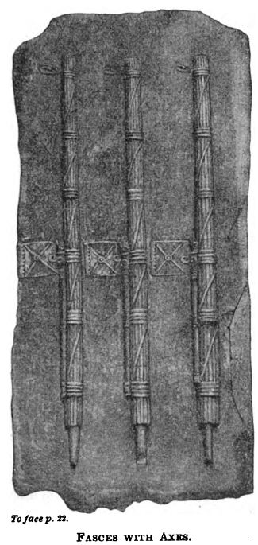

### VIII.

**17.** Sed cūr tam diā dē ūnō hoste loquimur, et dō eō hoste, quī iam fatētur sē esse hostem, et quem, quia, quod semper voluī, mūrus interest, nōn timeō; dē hīs, quī dissimulant, quī Rōmae remanent, quī nōbīscum sunt, nihil dīcimus? Quōs quidem ego, sī ūllō modō fierī possit, nōn tam ulcīscī studeō quam sānāre sibi ipsōs, plācāre reī pūblicae; neque, id quārē fierī nōn possit, sī mē audīre volent, intellegō. Expōnam enim vōbīs, Quirītēs, ex quibus generibus hominum istae cōpiae comparentur; deinde singulīs medicīnam cōnsilī atque ōrātiōnis meae, sī quam poterō, afferam.

**18.** Ūnum genus est eōrum, quī magnō in aere aliēnō maiōrēs etiam possessiōnēs habent, quārum amōre adductī dissolvī nūllō modō possunt. Hōrum hominum speciēs est honestissima (sunt enim locuplētēs), voluntās vērō et causa impudentissima. Tū agrīs, tū aedificiīs, tū argentō, tū familiā, tū rēbus omnibus ōrnātus et cōpiōsus sīs et dubitēs dē possessiōne dētrahere, acquīrere ad fidem? Quid enim exspectās? Bellum? Quid ergō? In vāstātiōne omnium tuās possessiōnēs sacrōsānctās futūrās putās ? An tabulās novās ? Errant, quī istās ā Catilīnā exspectant; meō beneficiō tabulae novae prōferentur, vērum auctiōnāriae; neque enim istī, quī possessiōnēs habent, aliā ratiōne ūllā salvī esse possunt. Quod sī mātūrius facere voluissent neque, id quod stultissimum est, certāre cum ūsūrīs frūctibus praediōrum, et locuplētiōribus hīs et meliōribus cīvibus ūterēmur. Sed hōsce hominēs minimē putō pertimēscendōs, quod aut dēdūcī dē sententiā possunt aut, sī permanēbunt, magis mihi videntur vōta factūrī contrā rem pūblicam quam arma lātūrī.

### IX.

**19.** Alterum genus est eōrum, quī, quamquam premuntur aere aliēnō, dominātiōnem tamen exspectant, rērum potīrī: volunt, honōrēs, quōs quiētā rē pūblicā dēspērant, perturbātā sē cōnsequī posse arbitrantur. Quibus hōc praecipiendum vidētur (ūnum scīlicet et idem quod reliquīs omnibus), ut dēspērent sē id, quod cōnantur, cōnsequī posse; prīmum omnium mē ipsum vigilāre, adesse, prōvidēre reī pūblicae; deinde magnōs animōs esse in bonīs virīs, magnam concordiam, magnās praetereā mīlitum cōpiās; deōs dēnique immortālīs huic invictō populō, clārissimō imperiō, pulcherrimae urbī contrā tantam vim sceleris praesentīs auxilium esse lātūrōs. Quodsī iam sint id, quod summō furōre cupiunt, adeptī, num illī in cinere urbis et in sanguine cīvium, quae mente cōnscelerātā ac nefāriā concupīvērunt, cōnsulēs sē aut dictātōrēs aut etiam rēgēs spērant futūrōs? Nōn vident id sē cupere, quod, sī adeptī sint, fugitīvō alicui aut gladiātōrī concēdī sit necesse?

**20.** Tertium genus est aetāte iam affectum, sed tamen exercitātiōne rōbustum; quō ex genere iste est Mānlius, cui nunc Catilīna succēdit. Hī sunt hominēs ex eīs colōniīs, quās Sulla cōnstituit; quās ego ūniversās cīvium esse optimōrum et fortissimōrum virōrum sentiō, sed tamen eī sunt colōnī, quī sē in īnspērātīs ac repentīnīs pecūniīs sūmptuōsius īnsolentiusque iactārunt. Hī dum aedificant tamquam beātī, dum praediīs lēctīs, familiīs magnīs, convīviīs apparātīs dēlectantur, in tantum aes aliēnum incidērunt, ut, sī salvī esse velint, Sulla sit eīs ab īnferīs excitandus; quī etiam nōnnūllōs agrestīs, hominēs tenuēs atque egentēs, in eandem illam spem rapīnārum veterum impulērunt. Quōs ego utrōsque in eōdem genere praedātōrum dīreptōrumque pōnō. Sed eōs hōc moneō, dēsinant furere ac prōscrīptiōnēs et dictātūrās cōgitāre. Tantus enim illōrum temporum dolor inustus est cīvitātī, ut iam ista nōn modo hominēs, sed nē pecudēs quidem mihi passūrae esse videantur.

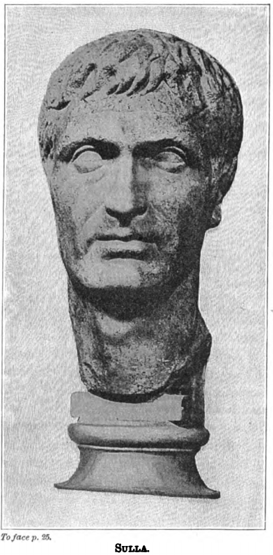

### X. 

**21.** Quārtum genus est sānē varium et mixtum et turbulentum; quī iam prīdem premuntur, quī numquam ēmergunt, quī partim inertiā, partim male gerendō negōtiō, partim etiam sūmptibus in vetere aere aliēnō vacillant, quī vadimōniīs, iūdiciīs, prōscrīptiōne bonōrum dēfatīgātī permultī et ex urbe et ex agrīs sē in illa castra cōnferre dīcuntur. Hōsce ego nōn tam mīlitēs ācris quam īnfitiātōrēs lentōs esse arbitror. Quī hominēs quam prīmum, sī stāre nōn possunt, corruant, sed ita, ut nōn modo cīvitās, sed nē vīcīnī quidem proximī sentiant. Nam illud nōn intellegō, quam ob rem, sī vīvere honestē nōn possunt, perīre turpiter velint, aut cūr minōre dolōre peritūrōs sē cum multīs, quam sī sōlī pereant, arbitrentur.

**22.** Quīntum genus est parricīdārum, sīcāriōrum, dēnique omnium facinorōsōrum. Quōs ego ā Catilīnā nōn revocō; nam neque ab eō dīvellī possunt, et pereant sānē in latrōciniō, quoniam sunt ita multī, ut eōs Carcer capere nōn possit. Postrēmum autem genus est nōn sōlum numerō, vērum etiam genere ipsō atque vītā, quod proprium Catilīnae est, dē eius dēlēctū, immō vērō dē complexū eius ac sinū; quōs pexō capillō nitidōs aut imberbīs aut bene barbātōs
vidētis, mānicātīs et tālāribus tunicīs, vēlīs amictōs, nōn togīs; quōrum omnis industria vītae et vigilandī labor in antelūcānīs cēnīs exprōmitur.

**23.** In hīs gregibus omnēs āleātōrēs, omnēs adulterī, omnēs impūrī impudīcīque versantur. Hī puerī tam lepidī ac dēlicātī nōn sōlum amāre et amārī, neque saltāre et cantāre, sed etiam sīcās vibrāre et spargere venēna didicērunt. Quī nisi exeunt, nisi pereunt, etiamsī Catilīna perierit, scītōte hōc in rē pūblicā sēminārium Catilīnārum futūrum. Vērum tamen quid sibi istī miserī volunt? Num suās sēcum mulierculās sunt in castra ductūrī? Quem ad modum autem illīs carēre poterunt, hīs praesertim iam noctibus? Quō autem pactō illī Appennīnum atque illās pruīnās ac nivēs perferent? Nisi idcircō sē facilius hiemem tolerātūrōs putant, quod nūdī in convīviīs saltāre didicērunt.

### XI.

**24.** Ō bellum magnō opere pertimēscendum, cum hanc sit habitūrus Catilīna scortōrum cohortem praetōriam! Īnstruite nunc, Quirītēs, contrā hās tam praeclārās Catilīnae cōpiās vestra praesidia vestrōsque exercitūs. Et prīmum gladiātōrī illī cōnfectō et sauciō cōnsulēs imperātōrēsque vestrōs oppōnite; deinde contrā illam naufragōrum ēiectam ac dēbilitātam manum flōrem tōtīus Italiae ac rōbur ēdūcite. Iam vērō urbēs colōniārum ac mūnicipiōrum respondēbunt Catilīnae tumulīs silvestribus. Neque ego cēterās cōpiās ōrnāmenta, praesidia vestra cum illīus latrōnis inopiā atque egestāte cōnferre dēbeō.

**25.** Sed sī omissīs hīs rēbus, quibus nōs suppeditāmur, eget ille, senātū, equitibus Rōmānīs, urbe, aerāriō, vectīgālibus, cūnctā Italiā, prōvinciīs omnibus, exterīs nātiōnibus, sī hīs rēbus omissīs causās ipsās, quae inter sē cōnflīgunt, contendere velīmus, ex eō ipsō, quam valdē illī iaceant, intellegere possumus. Ex hāc enim parte pudor pugnat, illinc petulantia; hinc pudīcitia, illinc stuprum; hinc fidēs, illinc fraudātiō; hinc pietās, illinc scelus; hinc cōnstantia, illinc furor; hinc honestās, illinc turpitūdō; hinc continentia, illinc libīdō; dēnique aequitās, temperantia, fortitūdō, prūdentia, virtūtēs omnēs, certant cum inīquitāte, lūxuriā, ignāviā, temeritāte, cum vitiīs omnibus; postrēmō cōpia cum egestāte, bona ratiō cum perditā, mēns sāna cum āmentiā, bona dēnique spēs cum omnium rērum dēspērātiōne cōnflīgit. In eius modī certāmine ac proeliō nōnne, sī hominum studia dēficiant, dī ipsī immortālēs cōgant ab hīs praeclārissimīs virtūtibus tot et tanta vitia superārī?

### XII.

**26.** Quae cum ita sint, Quirītēs, vōs, quem ad modum iam anteā dīxī, vestra tēcta vigiliīs custōdiīsque dēfendite; mihi, ut urbī sine vestrō mōtū ac sine ūllō tumultū satis esset praesidī, cōnsultum atque prōvīsum est. Colōnī omnēs mūnicipēsque vestrī certiōrēs ā mē factī: dē hāc nocturnā excursiōne Catilīnae facile urbēs suās fīnēsque dēfendent; gladiātōrēs, quam sibi ille manum certissimam fore putāvit (quamquam animō meliōre sunt quam pars patriciōrum), potestāte tamen nostrā continēbuntur. Q. Metellus, quem ego hōc prōspiciēns in agrum Gallicum Pīcēnumque praemīsī, aut opprimet hominem aut eius omnīs mōtūs cōnātūsque prohibēbit. Reliquīs autem dē rēbus cōnstituendīs, mātūrandīs, agendīs iam ad senātum referēmus, quem vocārī vidētis.

**27.** Nunc illōs, quī in urbe remānsērunt, atque adeō quī contrā urbis salūtem omniumque vestrum in urbe ā Catilīnā relictī sunt, quamquam sunt hostēs, tamen, quia sunt cīvēs, monitōs etiam atque etiam volō. Mea lēnitās adhūc sī cui solutior vīsa est, hōc exspectāvit ut id, quod latēbat, ērumperet. Quod reliquum est, iam nōn possum oblīvīscī meam hanc esse patriam, mē hōrum esse cōnsulem, mihi aut cum hīs vīvendum aut prō hīs esse moriendum. Nūllus est portīs custōs, nūllus īnsidiātor viae; sī quī exīre volunt, cōnīvēre possum; quī vērō sē in urbe commōverit, cuius ego nōn modo factum, sed inceptum ūllum cōnātumve contrā patriam dēprehenderō, sentiet in hāc urbe esse cōnsulēs vigilantīs, esse ēgregiōs magistrātūs, esse fortem senātum, ēsse arma, esse carcerem, quem vindicem nefāriōrum ac manifēstōrum scelerum maiōrēs nostrī esse voluērunt.

### XIII.

**28.** Atque haec omnia sīc agentur, Quirītēs, ut maximae rēs minimō mōtū, perīcula summa nūllō tumultū, bellum intestīnum ac domesticum post hominum memoriam crūdēlissimum et maximum mē ūnō togātō duce et imperātōre sēdētur. Quod ego sīc administrābō, Quirītēs, ut, sī ūllō modō fierī poterit, nē improbus quidem quisquam in hāc urbe poenam suī sceleris sufferat. Sed sī vīs manifēstae audāciae, sī impendēns patriae perīculum mē necessāriō dē hāc animī lēnitāte dēdūxerit, illud profectō perficiam, quod in tantō et tam īnsidiōsō bellō vix optandum vidētur, ut neque bonus quisquam intereat paucōrumque poenā vōs omnēs salvī esse possītis.

**29.** Quae quidem ego neque meā prūdentiā neque hūmānīs cōnsiliīs frētus polliceor vōbīs, Quirītēs, sed multīs et nōn dubiīs deōrum immortālium significātiōnibus, quibus ego ducibus in hanc spem sententiamque sum ingressus; quī iam nōn procul, ut quondam solēbant, ab externō hoste atque longinquō, sed hīc praesentēs suō nūmine atque auxiliō sua templa atque urbis tēcta dēfendunt. Quōs vōs, Quirītēs, precārī, venerārī, implōrāre dēbētis, ut, quam urbem pulcherrimam
flōrentissimamque esse voluērunt, hanc, omnibus hostium cōpiīs terrā marīque superātīs, ā perditissimōrum cīvium nefāriō scelere dēfendant.

## Ōrātiō in Catilīnam tertia

*Ad populum.*

### I.

**1.** Rem pūblicam, Quirītēs, vītamque omnium vestrum, bona, fortūnās, coniugēs līberōsque vestrōs atque hōc domicilium clārissimī imperī, fortūnātissimam pulcherrimamque urbem, hodiernō diē deōrum immortālium summō ergā vōs amōre, labōribus, cōnsiliīs, perīculīs meīs ē flammā atque ferrō ac paene ex faucibus fātī ēreptam et vōbīs cōnservātam ac restitūtam vidētis.

**2.** Et sī nōn minus nōbīs iūcundī atque illūstrēs sunt eī diēs, quibus cōnservāmur, quam illī, quibus nāscimur (quod salūtis certa laetitia est, nāscendī incerta condiciō, et quod sine sēnsū nāscimur, cum voluptāte servāmur), profectō, quoniam illum, quī hanc urbem condidit, ad deōs immortālīs benevolentiā fāmāque sustulimus, esse apud vōs posterōsque vestrōs in honōre dēbēbit is, quī eandem hanc urbem conditam amplificātamque servāvit. Nam tōtī urbī, templīs, dēlūbrīs, tēctīs ac moenibus subiectōs prope iam agnīs circumdatōsque restīnximus, īdemque gladiōs in rem pūblicam dēstrictōs rettudimus mūcrōnēsque eōrum ā iugulīs vestrīs dēiēcimus.

**3.** Quae quoniam in senātū illūstrāta, patefacta, comperta sunt per mē, vōbīs iam expōnam breviter, Quirītēs, ut, et quanta et quam manifēsta et quā ratiōne investīgāta et comprehēnsa sint, vōs, quī et ignōrātis et exspectātis, scīre possītis.

Prīncipiō, ut Catilīna paucīs ante diēbus ērūpit ex urbe, cum sceleris suī sociōs, huiusce nefāriī bellī ācerrimōs ducēs Rōmae relīquisset, semper vigilāvī et prōvīdī, Quirītēs, quem ad modum in tantīs et tam absconditīs īnsidiīs salvī esse possēmus.

### II.

Nam tum, cum ex urbe Catilīnam ēiciēbam (nōn enim iam vereor huius verbī invidiam, cum illa magis sit timenda, quod vīvus exierit), —sed tum, cum illum exterminārī volēbam, aut reliquam coniūrātōrum manum simul exitūram aut eōs, quī restitissent, īnfirmōs sine illō ac dēbilēs fore putābam.

**4.** Atque ego ut vīdī, quōs maximō furōre et scelere esse īnflammātōs sciēbam, eōs nōbīscum esse et Rōmae remānsisse, in eō omnēs diēs noctēsque cōnsūmpsī, ut, quid agerent, quid mōlīrentur, sentīrem ac vidērem, ut, quoniam auribus vestrīs propter incrēdibilem magnitūdinem sceleris minōrem fidem faceret ōrātiō mea, rem ita comprehenderem, ut tum dēmum animīs salūtī vestrae prōvidērētis, cum oculīs maleficium ipsum vidērētis. Itaque, ut comperī lēgātōs Allobrogum bellī Trānsalpīnī et tumultūs Gallicī excitandī causā ā P. Lentulō esse sollicitātōs, eōsque in Galliam ad suōs cīvīs eōdemque itinere cum litterīs mandātīsque ad Catilīnam esse missōs, comitemque eīs adiūnctum esse T. Volturcium, atque huic esse ad Catilīnam datās litterās, facultātem mihi oblātam putāvī, ut, quod erat difficillimum, quodque ego semper optābam ab dīs immortālibus, ut tōta rēs nōn sōlum ā mē, sed etiam ā senātū et ā vōbīs manifēstō dēprehenderētur

**5.** Itaque hesternō diē L. Flaccum et C. Pomptīnum praetōrēs, fortissimōs atque amantissimōs reī pūblicae virōs, ad mē vocāvī; rem exposuī; quid fierī placēret, ostendī. Illī autem, quī omnia dē rē pūblicā praeclāra atque ēgregia sentīrent, sine recūsātiōne ac sine ūllā morā negōtium suscēpērunt et, cum advesperāsceret, occultē ad Pontem Mulvium pervēnērunt atque ibi in proximīs vīllīs ita bipartītō fuērunt, ut Tiberis inter eōs et pōns interesset. Eōdem autem et ipsī sine cuiusquam suspīciōne multōs fortīs virōs ēdūxerant, et ego ex praefectūrā Reātīnā complūrēs dēlēctōs adulēscentēs, quōrum operā ūtor assiduē in reī pūblicae praesidiō, cum gladiīs mīseram.

**6.** Interim tertiā ferē vigiliā exāctā cum iam Pontem Mulvium magnō comitātū lēgātī Allobrogum ingredī inciperent ūnāque Volturcius, fit in eōs impetus; ēdūcuntur et ab illīs gladiī et ā nostrīs. Rēs praetōribus erat nōta sōlīs, ignōrābātur ā cēterīs.

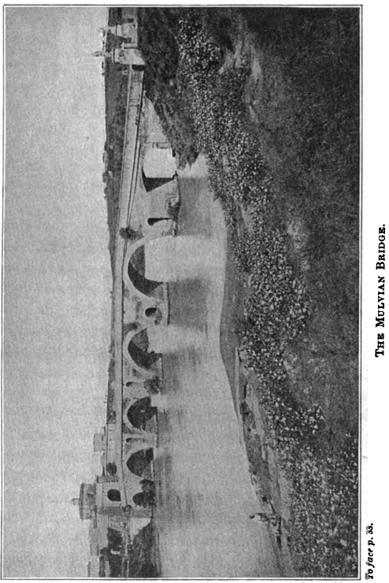

### III.

Tum interventū Pomptīnī atque Flaccī pugna, quae erat commissa, sēdātur. Litterae, quaecumque erant in eō comitātū, integrīs signīs, praetōribus trāduntur; ipsī comprehēnsī ad mē, cum iam dīlūcēsceret, dēdūcuntur.

Atque hōrum omnium scelerum improbissimum māchinātōrem, Cimbrum Gabīnium, statim ad mē nihildum suspicantem vocāvī; deinde item arcessītus est L. Statilius et post eum C. Cethēgus; tardissimē autem Lentulus vēnit, crēdō quod in litterīs dandīs praeter cōnsuētūdinem proximā nocte vigilārat.

**7.** Cum summīs et clārissimīs huius cīvitātis virīs, quī audītā rē frequentēs ad mē māne convēnerant, litterās ā mē prius aperīrī quam ad senātum dēferrī placēret, — nē, sī nihil esset inventum, temere ā mē tantus tumultus iniectus cīvitātī vidērētur, — negāvī mē esse factūrum, ut dē perīculō pūblicō nōn ad cōnsilium pūblicum rem integram dēferrem. Etenim, Quirītēs, sī ea, quae erant ad mē dēlāta, reperta nōn essent, tamen ego nōn arbitrābar in tantīs reī pūblicae perīculīs esse mihī nimiam dīligentiam pertimēscendam. Senātum frequentem celeriter, ut vīdistis, coēgī.

**8.** Atque intereā statim admonita Allobrogum C. Sulpicium praetōrem, fortem virum, mīsī, quī ex aedibus Cethēgī, eī quid tēlōrum esset, efferret; ex quibus ille maximum sīcārum numerum et gladiōrum extulit.

### IV.

Intrōdūxī Volturcium sine Gallīs; fidem pūblicam iussū senātūs dedī; hortātus sum, ut ea, quae scīret, sine timōre indicāret. Tum ille dīxit, cum vix sē ex magnō timōre recreāsset, ā P. Lentulō sē habēre ad Catilīnam mandāta et litterās, ut servōrum praesidiō ūterētur, ut ad urbem quam prīmum cum exercitū accēderet; id autem eō cōnsiliō, ut, cum urbem ex omnibus partibus, quem ad modum discrīptum distribūtumque erat, incendissent caedemque īnfīnītam cīvium fēcissent, praestō esset ille, quī et fugientīs exciperet et sē cum hīs urbānīs ducibus coniungeret.

**9.** Intrōductī autem Gallī iūs iūrandum sibi et litterās ab Lentulō, Cethēgō, Statiliō ad suam gentem data esse dīxērunt, atque ita sibi ab hīs et ā L. Cassiō esse praescrīptum, ut equitātum in Italiam quam prīmum mitterent; pedestrēs sibi cōpiās nōn dēfutūrās. Lentulum autem sibi cōnfirmāsse ex fātīs Sibyllīnīs haruspicumque respōnsīs sē esse tertium illum Cornēlium, ad quem rēgnum huius urbis atque imperium pervenīre esset necesse; Cinnam ante sē et Sullam fuisse. Eundemque dīxisse fātālem hunc annum esse ad interitum huius urbis atque imperī, quī esset annus decimus post Virginum absolūtiōnem, post Capitōlī autem incēnsiōnem vīcēsimus.

**10.** Hanc autem Cethēgō cum cēterīs contrōversiam fuisse dīxērunt, quod Lentulō et aliīs Sāturnālibus caedem fierī atque urbem incendī placēret, Cethēgō nimium id longum vidērētur.

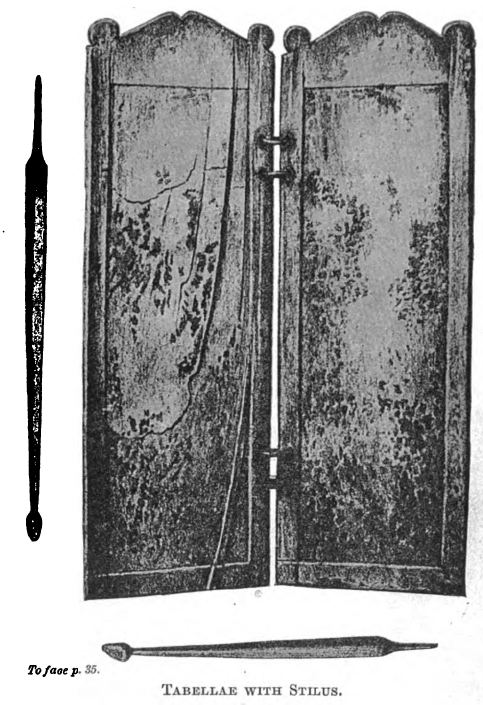

### V.

Ac nē longum sit, Quirītēs, tabellās prōferrī iussimus, quae ā quōque dīcēbantur datae. Prīmō ostendimus Cethēgō; signum cognōvit. Nōs līnum incīdimus, lēgimus. Erat scrīptum ipsīus manū Allobrogum senātuī et populō sēsē, quae eōrum lēgātīs cōnfirmāsset, factūrum esse; ōrāre, ut item illī facerent, quae sibi eōrum lēgātī recēpissent. Tum Cethēgus, quī paulō ante aliquid tamen dē gladiīs ac sīcīs, quae apud ipsum erant dēprehēnsa, respondisset dīxissetque sē semper bonōrum ferrāmentōrum studiōsum fuisse, recitātīs litterīs dēbilitātus atque abiectus cōnscientiā repente conticuit. Intrōductus est Statilius; cognōvit et signum et manum suam. Recitātae sunt tabellae in eandem ferē sententiam; cōnfessus est.  Tum ostendī tabellās Lentulō et quaesīvī, cognōsceretne signum. Annuit. ‘Est vērō,’ inquam, ‘nōtum quidem signum, imāgō avī tuī, clārissimī virī, quī amāvit ūnicē patriam et cīvēs suōs; quae quidem tē ā tantō scelere etiam mūta revocāre dēbuit.’

**11.** Leguntur eādem ratiōne ad senātum Allobrogum populumque litterae. Sī quid dē hīs rēbus dīcere vellet, fēcī potestātem. Atque ille prīmō quidem negāvit; post autem aliquantō, tōtō iam indiciō expositō atque ēditō, surrēxit; quaesīvit ā Gallīs, quid sibi esset cum eīs, quam ob rem domum suam vēnissent, itemque ā Volturciō. Quī cum illī breviter cōnstanterque respondissent, per quem ad eum quotiēnsque vēnissent, quaesīssentque ab eō, nihilne sēcum esset dē fātīs Sibylīnīs locūtus, tum ille subitō scelere dēmēns, quanta cōnscientiae vīs esset, ostendit. Nam, cum id posset īnfitiārī, repente praeter opīniōnem omnium cōnfessus est. Ita eum nōn modo ingenium illud et dīcendī exercitātiō, quā semper valuit, sed etiam propter vim sceleris manifēstī atque dēprehēnsī impudentia, quā superābat omnīs, improbitāsque dēfēcit.

**12.** Volturcius vērō subitō litterās prōferrī atque aperīrī iubet, quās sibi ā Lentulō ad Catilīnam datās esse dīcēbat. Atque ibi vehementissimē perturbātus Lentulus tamen et signum et manum suam cognōvit. Erant autem sine nōmine, sed ita: ‘Quis sim, sciēs ex eō quem ad tē mīsī. Cūrā, ut vir sīs, et cōgitā, quem in locum sīs prōgressus. Vidē, ecquid tibi iam sit necesse, et cūrā, ut omnium tibi auxilia adiungās, etiam īnfimōrum.’ Gabīnius deinde intrōductus cum prīmō impudenter respondēre coepisset, ad extrēmum nihil ex eīs, quae Gallī īnsimulābant, negāvit.

**13.** Ac mihi quidem, Quirītēs, cum illa certissima vīsa sunt argūmenta atque indicia sceleris, tabellae, signa, manūs, dēnique ūnīus cūiusque cōnfessiō, tam multō certiōra illa, color, oculī, vultūs, taciturnitās. Sīc enim obstupuerant, sīc terram intuēbantur, sīc fūrtim nōnnumquam inter sēsē aspiciēbant, ut nōn iam ab aliīs indicārī, sed indicāre sē ipsī vidērentur.

### VI.

Indiciīs expositīs atque ēditīs, Quirītēs, senātum cōnsuluī, dē summā rē pūblicā quid fierī placēret. Dictae sunt ā prīncipibus ācerrimae ac fortissimae sententiae, quās senātus sine ūllā varietāte est secūtus. Et quoniam nōndum est perscrīptum senātūs cōnsultum, ex memoriā vōbīs, Quirītēs, quid senātus cēnsuerit, expōnam.

**14.** Prīmum mihi grātiae verbīs amplissimīs aguntur, quod virtūte, cōnsiliō, prōvidentiā meā rēs pūblica maximīs perīculīs sit līberāta. Deinde L. Flaccus et C. Pomptīnus praetōrēs, quod eōrum operā fortī fidēlīque ūsus essem, meritō ac iūre laudantur. Atque etiam virō fortī, collēgae meō, laus impertītur, quod eōs, quī huius coniūrātiōnis participēs fuissent, ā suīs et ā reī pūblicae cōnsiliīs remōvisset.

Atque ita cēnsuērunt, ut P. Lentulus, cum sē praetūrā abdicāsset, in custōdiam trāderētur; itemque utī C. Cethēgus, L. Statilius, P. Gabīnius, quī omnēs praesentēs erant, in custōdiam trāderentur; atque idem hōc dēcrētum est in L. Cassium, quī sibi prōcūrātiōnem incendendae urbis dēpoposcerat; in M. Cēpārium, cui ad sollicitandōs pāstōrēs Āpūliam attribūtam esse erat indicātum; in P. Fūrium, quī est ex eīs colōnīs, quōs Faesulās L. Sulla dēdūxit; in Q. Annium Chīlōnem, quī ūnā cum hōc Fūriō semper erat in hāc Allobrogum sollicitātiōne versātus; in P. Umbrēnum, lībertīnum hominem, ā quō prīmum Gallōs ad Gabīnium perductōs esse cōnstābat. Atque ea lēnitāte senātus est ūsus, Quirītēs, ut ex tantā coniūrātiōne tantāque hāc multitūdine domesticōrum hostium novem hominum perditissimōrum poenā rē pūblicā cōnservātā reliquōrum mentēs sānārī posse arbitrā rētur.

**15.** Atque etiam supplicātiō dīs immortālibus prō singulārī eōrum meritō meō nōmine dēcrēta est, quod mihi prīmum post hanc urbem conditam togātō contigit, et hīs dēcrēta verbīs est, *quod urbem incendiīs, caede cīvīs, Italiam bellō līberāssem.* Quae supplicātiō sī cum cēterīs supplicātiōnibus cōnferātur, hōc interest, quod cēterae bene gestā, haec ūna cōnservātā rē pūblicā cōnstitūta est. Atque illud, quod faciendum prīmum fuit, factum atque trānsāctum est. Nam P. Lentulus, quamquam patefactīs indiciīs, cōnfessiōnibus suīs, iūdiciō senātūs nōn modo praetōris iūs, vērum etiam cīvis āmīserat, tamen magistrātū sē abdicāvit, ut, quae religiō C. Mariō, clārissimō virō, nōn fuerat, quō minus C. Glauciam, dē quō nihil nōminātim erat dēcrētum, praetōrem occīderet, eā nōs religiōne in prīvātō P. Lentulō pūniendō līberārēmur.

### VII.

**16.** Nunc quoniam, Quirītēs, cōnscelerātissimī perīculōsissimīque bellī nefāriōs ducēs captōs iam et comprehēnsōs tenētis, exīstimāre dēbētis omnīs Catilīnae cōpiās, omnīs spēs atque opēs, hīs dēpulsīs urbis perīculīs, concidisse.

Quem quidem ego cum ex urbe pellēbam, hoc prōvidēbam animō, Quirītēs, remōtō Catilīnā nōn mihi esse P. Lentulī somnum nec L. Cassī adipēs nec C. Cethēgī furiōsam temeritātem pertimēscendam. Ille erat ūnus timendus ex istīs omnibus, sed tam diū, dum urbis moenibus continēbātur. Omnia nōrat, omnium aditūs tenēbat; appellāre, temptāre, sollicitāre poterat, audēbat. Erat eī cōnsilium ad facinus aptum, cōnsiliō autem neque manus neque lingua dēerat. Iam ad certās rēs cōnficiendās certōs hominēs dēlēctōs ac discrīptōs habēbat. Neque vērō, cum aliquid mandārat, cōnfectum putābat; nihil erat, quod nōn ipse obīret, occurreret, vigilāret, labōrāret; frīgus, sitim, famem ferre poterat.

**17.** Hunc ego hominem tam ācrem, tam audācem, tam parātum, tam callidum, tam in scelere vigilantem, tam in perditīs rēbus dīligentem nisi ex domesticīs īnsidiīs in castrēnse latrōcinium compulissem (dīcam id quod sentiō, Quirītēs), nōn facile hanc tantam mōlem malī ā cervīcibus vestrīs dēpulissem. Nōn ille nōbīs Sāturnālia cōnstituisset neque tantō ante exitī ac fātī diem reī pūblicae dēnūntiāvisset neque commīsisset, ut signum, ut litterae suae, testēs manifēstī sceleris, dēprehenderentur. Quae nunc illō absente sīc gesta sunt, ut nūllum in prīvātā domō fūrtum umquam sit tam palam inventum, quam haec tanta in rē pūblicā coniūrātiō manifēstō inventa atque dēprehēnsa est. Quodsī Catilīna in urbe ad hanc diem remānsisset (quamquam, quoad fuit, omnibus eius cōnsiliīs occurrī atque obstitī), tamen, ut levissimē dīcam, dīmicandum nōbīs cum illō fuisset, neque nōs umquam, dum ille in urbe hostis esset, tantīs perīculīs rem pūblicam tantā pāce, tantō ōtiō, tantō silentiō līberāssēmus.

### VIII.

**18.** Quamquam haec omnia, Quirītēs, ita sunt ā mē administrāta, ut deōrum immortālium nūtū atque cōnsiliō et gesta et prōvīsa esse videantur. Idque cum coniectūrā cōnsequī possumus (quod vix vidētur hūmānī cōnsilī tantārum rērum gubernātiō esse potuisse), tum vērō ita praesentēs hīs temporibus opem et auxilium nōbīs tulērunt, ut eōs paene oculīs vidēre possēmus. Nam ut illa omittam, vīsās nocturnō tempore ab occidente facēs ārdōremque caelī, ut fulminum iactus, ut terrae mōtūs relinquam, ut omittam cētera, quae tam multa nōbīs cōnsulibus facta sunt, ut haec, quae nunc fīunt, canere dī immortālēs vidērentur, hōc certē, quod sum dictūrus, neque praetermittendum neque relinquendum est.

**19.** Nam profectō memoriā tenētis, Cottā et Torquātō cōnsulibus, complūrēs in Capitōliō rēs dē caelō esse percussās, cum et simulācra deōrum dēpulsa sunt et statuae veterum hominum dēiectae et lēgum aera liquefacta et tāctus etiam ille, quī hanc urbem condidit, Rōmulus, quem inaurātum in Capitōliō parvum atque lactantem ūberibus lupīnīs inhiantem fuisse meministis. Quō quidem tempore cum haruspicēs ex tōtā Etrūriā convēnissent, caedēs atque incendia et lēgum interitum et bellum cīvīle ac domesticum et tōtīus urbis atque imperī occāsum appropinquāre dīxērunt, nisi dī immortālēs omnī ratiōne plācātī suō nūmine prope fāta ipsa flexissent.

**20.** Itaque illōrum respōnsīs tum et lūdī per decem diēs factī sunt, neque rēs ūlla, quae ad plācandōs deōs pertinēret, praetermissa est. Īdemque iussērunt simulācrum Iovis facere maius et in excelsō collocāre et contrā, atque anteā fuerat, ad orientem convertere; ac sē spērāre dīxērunt, sī illud signum, quod vidētis, sōlis ortum et Forum Cūriamque cōnspiceret, fore ut ea cōnsilia, quae clam essent inita contrā salūtem urbis atque imperī, illūstrārentur, ut ā senātū populōque Rōmānō perspicī possent. Atque illud signum collocandum cōnsulēs illī locāvērunt; sed tanta fuit operis tarditās, ut neque superiōribus cōnsulibus neque nōbīs ante hodiernum diem collocārētur.

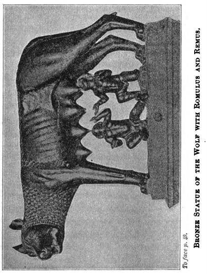

### IX.

**21.** Hīc quis potest esse, Quirītēs, tam āversus ā vērō, tam praeceps, tam mente captus, quī neget haec omnia, quae vidēmus, praecipuēque hanc urbem deōrum immortālium nūtū ac potestāte administrārī? Etenim, cum esset ita respōnsum, caedēs, incendia, interitum reī pūblicae comparārī, et ea per cīvēs, quae tum propter magnitūdinem scelerum nōnnūllīs incrēdibilia vidēbantur, ea nōn modo cōgitāta ā nefāriīs cīvibus, vērum etiam suscepta esse sēnsistis. Illud vērō nōnne ita praesēns est, ut nūtū Iovis Optimī Maximī factum esse videātur, ut, cum hodiernō diē māne per Forum meō iussū et coniūrātī et eōrum indicēs in aedem Concordiae dūcerentur, eō ipsō tempore signum statuerētur? Quō collocātō atque ad vōs senātumque conversō, omnia, quae erant contrā salūtem omnium cōgitāta, illūstrāta et patefacta vīdistis

**22.** Quō etiam maiōre sunt istī odiō suppliciōque dignī, quī nōn sōlum vestrīs domiciliīs atque tēctīs, sed etiam deōrum templīs atque dēlūbrīs sunt fūnestōs ac nefāriōs ignēs īnferre cōnātī. Quibus ego sī mē restitisse dīcam, nimium mihi sūmam et nōn sim ferendus; ille, ille Iuppiter restitit; ille Capitōlium, ille haec templa, ille cūnctam urbem, ille vōs omnīs salvōs esse voluit. Dīs ego immortālibus ducibus, hanc mentem, Quirītēs, voluntātemque suscēpī atque ad haec tanta indicia pervēnī. Iam vērō ab Lentulō cēterīsque domesticīs hostibus tam dēmenter tantae rēs crēditae et ignōtīs et barbarīs commissaeque litterae numquam essent profectō, nisi ab dīs immortālibus huic tantae audāciae cōnsilium esset ēreptum. Quid vērō? Ut hominēs Gallī ex cīvitāte male pācātā, quae gēns ūna restat, quae bellum populō Rōmānō facere et posse et nōn nōlle videātur, spem imperī ac rērum maximārum ultrō sibi ā patriciīs hominibus oblātam neglegerent vestramque salūtem suīs opibus antepōnerent, id nōn dīvīnitus esse factum putātis, praesertim quī nōs nōn pugnandō, sed tacendō superāre potuerint?

### X.

**23.** Quam ob rem, Quirītēs, quoniam ad omnia pulvīnāria supplicātiō dēcrēta est, celebrātōte illōs diēs cum coniugibus ac līberīs vestrīs. Nam multī saepe honōrēs dīs immortālibus iūstī habitī sunt ac dēbitī, sed profectō iūstiōrēs numquam. Ēreptī enim estis ex crūdēlissimō ac miserrimō interitū; sine caede, sine sanguine, sine exercitū, sine dīmicātiōne, togātī, mē ūnō togātō duce et imperātōre, vīcistis.

**24.** Etenim recordāminī, Quirītēs, omnīs cīvīlēs dissēnsiōnēs, nōn sōlum eās, quās audīstis, sed eās, quās vōsmet ipsī meministis atque vīdistis. L. Sulla P. Sulpicium oppressit; C. Marium, custōdem huius urbis, multōsque fortīs virōs partim ēiēcit ex cīvitāte, partim interēmit. Cn. Octāvius cōnsul armīs expulit ex urbe collēgam; omnis hīc locus acervīs corporum et cīvium sanguine redundāvit. Superāvit posteā Cinna cum Mariō; tum vērō clārissimīs virīs interfectīs lūmina cīvitātis exstīncta sunt. Ultus est huius victōriae crūdēlitātem posteā Sulla; nē dīcī quidem opus est, quantā dēminūtiōne cīvium et quantā calamitāte reī pūblicae. Dissēnsit M. Lepidus ā clārissimō et fortissimō virō, Q. Catulō; attulit nōn tam ipsīus interitus reī pūblicae lūctum quam cēterōrum.

**25.** Atque illae tamen omnēs dissēnsiōnēs erant eius modī, quae nōn ad dēlendam, sed ad commūtandam rem pūblicam pertinērent. Nōn illī nūllam esse rem pūblicam, sed in eā, quae esset, sē esse prīncipēs, neque hanc urbem cōnflagrāre, sed sē in hāc urbe flōrēre voluērunt. Atque illae tamen omnēs dissēnsiōnēs, quārum nūlla exitium reī pūblicae quaesīvit, eius modī fuērunt, ut nōn reconciliātiōne concordiae, sed interneciōne cīvium dīiūdicātae sint. In hōc autem ūnō post hominum memoriam maximō crūdēlissimōque bellō, quāle bellum nūlla umquam barbaria cum suā gente gessit, quō in bellō lēx haec fuit ā Lentulō, Catilīnā, Cethēgō, Cassiō cōnstitūta, ut omnēs, quī salvā urbe salvī esse possent, in hostium numerō dūcerentur, ita mē gessī, Quirītēs, ut salvī omnēs cōnservārēminī, et, cum hostēs vestrī tantum cīvium superfutūrum putāssent, quantum īnfīnītae caedī restitisset, tantum autem urbis, quantum flamma obīre nōn potuisset, et urbem et cīvīs integrōs incolumēsque servāvī.

### XI.

**26.** Quibus prō tantīs rēbus, Quirītēs, nūllum ego ā vōbīs praemium virtūtis, nūllum īnsigne honōris, nūllum monumentum laudis postulō praeterquam huius diēī memoriam sempiternam. In animīs ego vestrīs omnēs triumphōs meōs, omnia ōrnāmenta honōris, monumenta glōriae, laudis īnsignia condī et collocārī volō. Nihil mē mūtum potest dēlectāre, nihil tacitum, nihil dēnique eius modī, quod etiam minus dignī assequī possint. Memoriā vestrā, Quirītēs, nostrae rēs alentur, sermōnibus crēscent, litterārum monumentīs inveterāscent et corrōborābuntur; eandemque diem intellegō, quam spērō aeternam fore, prōpāgātam esse et ad salūtem urbis et ad memoriam cōnsulātūs meī, ūnōque tempore in hāc rē pūblicā duōs cīvīs exstitisse, quōrum alter fīnīs vestrī imperī nōn terrae, sed caelī regiōnibus termināret, alter eiusdem imperī domicilium sēdēsque servāret.

### XII.

**27.** Sed quoniam eārum rērum, quās ego gessī, nōn eadem est fortūna atque condiciō quae illōrum, quī externa bella gessērunt, quod mihi cum eīs vīvendum est, quōs vīcī ac subēgī, illī hostēs aut interfectōs aut oppressōs relīquērunt, vestrum est, Quirītēs, sī cēterīs facta sua rēctē prōsunt, mihi mea nē quandō obsint, prōvidēre. Mentēs enim hominum audācissimōrum scelerātae ac nefāriae nē vōbīs nocēre possent, ego prōvīdī; nē mihi noceant, vestrum est prōvidēre. Quamquam, Quirītēs, mihi quidem ipsī nihil ab istīs iam nocērī potest. Magnum enim est in bonīs praesidium, quod mihi in perpetuum comparātum est, magna in rē pūblicā dignitās, quae mē semper tacita dēfendet, magna vīs cōnscientiae, quam quī neglegunt, cum mē violāre volent, sē ipsī indicābunt.

**28.** Est enim in nōbīs is animus, Quirītēs, ut nōn modo nūllīus audāciae cēdāmus, sed etiam omnīs improbōs ultrō semper lacessāmus. Quodsī omnis impetus domesticōrum hostium dēpulsus ā vōbīs sē in mē ūnum converterit, vōbīs erit videndum, Quirītēs, quā condiciōne posthāc eōs esse velītis, quī sē prō salūte vestrā obtulerint invidiae perīculīsque omnibus; mihi quidem ipsī quid est quod iam ad vītae frūctum possit acquīrī, cum praesertim neque in honōre vestrō neque in glōriā virtūtis quicquam videam altius quō mihi libeat ascendere?

**29.** Illud perficiam profectō, Quirītēs, ut ea, quae gessī in cōnsulātū, prīvātus tuear atque ōrnem, ut, sī qua est invidia in cōnservandā rē pūblicā suscepta, laedat invidōs, mihi valeat ad glōriam. Dēnique ita mē in rē pūblicā tractābō, ut meminerim semper, quae gesserim, cūremque, ut ea virtūte, nōn cāsū gesta esse videantur. Vōs, Quirītēs, quoniam iam est nox, venerātī Iovem illum, custōdem huius urbis ac vestrum, in vestra tēcta discēdite et ea, quamquam iam est perīculum dēpulsum, tamen aequē ac priōre nocte custōdiīs vigiliīsque dēfendite. Id nē vōbīs diūtius faciendum sit, atque ut in perpetuā pāce esse possītis, prōvidēbō.

## In Catilīnam ōrātiō quārta

*Habita in senātū.*

### I.

**1.** Videō, patrēs cōnscrīptī, in mē omnium vestrum ōra atque oculōs esse conversōs, videō vōs nōn sōlum dē vestrō ac reī pūblicae, vērum etiam, sī id dēpulsum sit, dē meō perīculō esse sollicitōs. Est mihi iūcunda in malīs et grāta in dolōre vestra ergā mē voluntās, sed eam, per deōs immortālēs, dēpōnite atque oblītī salūtis meae dē vōbīs ac dē vestrīs līberīs cōgitāte. Mihi sī haec condiciō cōnsulātūs data est, ut omnīs acerbitātēs, omnīs dolōrēs cruciātūsque perferrem, feram nōn sōlum fortiter, vērum etiam libenter, dum modo meīs labōribus vōbīs populōque Rōmānō dignitās salūsque pariātur.

**2.** Ego sum ille cōnsul, patrēs cōnscrīptī, cui nōn Forum, in quō omnis aequitās continētur, nōn Campus cōnsulāribus auspiciīs cōnsecrātus, nōn Cūria, summum auxilium omnium gentium, nōn domus, commūne perfugium, nōn lectus ad quiētem datus, nōn dēnique haec sēdēs honōris umquam vacua mortis perīculō atque īnsidiīs fuit. Ego multa tacuī, multa pertulī, multa concessī, multa meō quōdam dolōre in vestrō timōre sānāvī. Nunc sī hunc exitum cōnsulātūs meī dī immortālēs esse voluērunt, ut vōs populumque Rōmānum ex caede miserrimā, coniugēs līberōsque vestrōs virginēsque Vestālēs ex acerbissimā vexātiōne, templa atque dēlūbra, hanc pulcherrimam patriam omnium nostrum ex foedissimā flammā, tōtam Italiam ex bellō et vāstitāte ēriperem, quaecumque mihi ūnī prōpōnētur fortūna, subeātur. Etenim, sī P. Lentulus suum nōmen inductus ā vātibus fātāle ad perniciem reī pūblicae fore putāvit, cūr ego nōn laeter meum cōnsulātum ad salūtem populī Rōmānī prope fātālem exstitisse?

### II.

**3.** Quārē, patrēs cōnscrīptī, cōnsulite vōbīs, prōspicite patriae, cōnservāte vōs, coniugēs, līberōs fortūnāsque vestrās, populī Rōmānī nōmen salūtemque dēfendite; mihi parcere ac dē mē cōgitāre dēsinite. Nam prīmum dēbeō spērāre omnīs deōs, quī huic urbī praesident, prō eō mihi, ac mereor, relātūrōs esse grātiam; deinde, sī quid obtigerit, aequō animō parātōque moriar. Nam neque turpis mors fortī virō potest accidere neque immātūra cōnsulārī nec misera sapientī. Nec tamen ego sum ille ferreus, quī frātris cārissimī atque amantissimī praesentis maerōre nōn movear hōrumque omnium lacrimīs, ā quibus mē circumsessum vidētis. Neque meam mentem nōn domum saepe revocat exanimāta uxor et abiecta metū fīlia et parvulus fīlius, quem mihi vidētur amplectī rēs pūblica tamquam obsidem cōnsulātūs meī, neque ille, quī exspectāns huius exitum diēī stat in cōnspectū meō, gener. Moveor hīs rēbus omnibus, sed in eam partem, utī salvī sint vōbīscum omnēs, etiamsī mē vīs aliqua oppresserit, potius quam et illī et nōs ūnā reī pūblicae peste pereāmus.

**4.** Quārē, patrēs cōnscrīptī, incumbite ad salūtem reī pūblicae, circumspicite omnēs procellās, quae impendent, nisi prōvidētis. Nōn Ti. Gracchus, quod iterum tribūnus plēbis fierī voluit, nōn C. Gracchus, quod agrāriōs concitāre cōnātus est, nōn L. Sāturnīnus, quod C. Memmium occīdit, in discrīmen aliquod atque in vestrae sevēritātis iūdicium addūcitur; tenentur eī, quī ad urbis incendium, ad vestram omnium caedem, ad Catilīnam accipiendum Rōmae restitērunt; tenentur litterae, signa, manūs, dēnique ūnīus cūiusque cōnfessiō; sollicitantur Allobrogēs, servitia excitantur, Catilīna arcessitur; id est initum cōnsilium, ut interfectīs omnibus nēmō nē ad dēplōrandum quidem populī Rōmānī nōmen atque ad lāmentandam tantī imperī calamitātem relinquātur.

### III.

**5.** Haec omnia indicēs dētulērunt, reī cōnfessī sunt, vōs multīs iam iūdiciīs iūdicāvistis, prīnum quod mihi grātiās ēgistis singulāribus verbīs et meā virtūte atque dīligentiā perditōrum hominum coniūrātiōnem patefactam esse dēcrēvistis, deinde quod P. Lentulum sē abdicāre praetūrā coēgistis, tam quod eum et cēterōs, dē quibus iūdicāstis, in custōdiam dandōs cēnsuistis, maximēque quod meō nōmine supplicātiōnem dēcrēvistis, quī honōs togātō habitus ante mē est nēminī; postrēmō hesternō diē praemia lēgātīs Allobrogum Titōque Volturciō dedistis amplissima. Quae sunt omnia eius modī, ut eī, quī in custōdiam nōminātim datī sunt, sine ūllā dubitātiōne ā vōbīs damnātī esse videantur.

**6.** Sed ego īnstituī referre ad vōs, patrēs cōnscrīptī, tamquam integrum, et dē factō quid iūdicētis, et dē poenā quid cēnseātis. Illa praedīcam, quae sunt cōnsulis. Ego magnum in rē pūblicā versārī furōrem et nova quaedam miscērī et concitārī mala iam prīdem vidēbam, sed hanc tantam, tam exitiōsam habērī coniūrātiōnem ā cīvibus numquam putāvī. Nunc quicquid est, quōcumque vestrae mentēs inclīnant atque sententiae, statuendum vōbīs ante noctem est. Quantum facinus ad vōs dēlātum sit, vidētis. Huic sī paucōs putātis affīnēs esse, vehementer errātis, Lātius opīniōne dissēminātum est hōc malum; mānāvit nōn sōlum per Italiam, vērum etiam trānscendit Alpēs et obscūre serpēns multās iam prōvinciās occupāvit. Id opprimī sustentandō aut prōlātandō nūllō pactō potest; quācumque ratiōne placet, celeriter vōbīs vindicandum est.

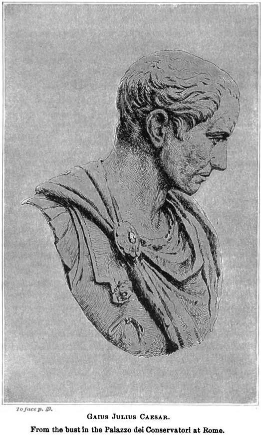

### IV.

**7.** Videō duās adhūc esse sententiās, ūnam D. Sīlānī, quī cēnset eōs, quī haec dēlēre cōnātī sunt, morte esse multandōs, alteram C. Caesaris, quī mortis poenam removet, cēterōrum suppliciōrum omnīs acerbitātēs amplectitur. Uterque et prō suā dignitāte et prō rērum magnitūdine in summā sevēritāte versātur. Alter eōs, quī nōs omnīs vītā prīvāre cōnātī sunt, quī dēlēre imperium, quī populī Rōmānī nōmen exstinguere, pūnctum temporis fruī vītā et hōc commūnī spīritū nōn putat oportēre atque hōc genus poenae saepe in improbōs cīvīs in hāc rē pūblicā esse ūsūrpātum recordātur.

Alter intellegit mortem ab dīs immortālibus nōn esse supplicī causā cōnstitūtam, sed aut necessitātem nātūrae aut labōrum ac miseriārum quiētem esse. Itaque eam sapientēs numquam invītī, fortēs saepe etiam libenter oppetīvērunt. Vincula vērō et ea sempiterna, certē ad singulārem poenam nefāriī sceleris inventa sunt. Mūnicipiīs dispertīrī iubet. Habēre vidētur ista rēs inīquitātem, sī imperāre velīs, difficultātem, sī rogāre. Dēcernātur tamen, sī placet.

**8.** Ego enim suscipiam et, ut spērō, reperiam, quī id, quod salūtis omnium causā statueritis, nōn putent esse suae dignitātis recūsāre. Adiungit gravem poenam mūnicipiīs, sī quis eōrum vincula rūperit; horribilēs custōdiās circumdat et dignās scelere hominum perditōrum; sancit, nē quis eōrum poenam, quōs condemnat, aut per senātum aut per populum levāre possit; ēripit etiam spem, quae sōla hominēs in miseriīs cōnsōlārī solet. Bona praetereā pūblicārī iubet, vītam sōlam relinquit nefāriīs hominibus; quam sī ēripuisset, multōs ūnā dolōrēs animī atque corporis et omnīs scelerum poenās adēmisset. Itaque, ut aliqua in vītā formīdō improbīs esset posita, apud īnferōs eius modī quaedam illī antīquī supplicia impiīs cōnstitūta esse voluērunt, quod vidēlicet intellegēbant, hīs remōtīs, nōn esse mortem ipsam pertimēscendam.

### V.

**9.** Nunc, patrēs cōnscrīptī, ego meā videō quid intersit. Sī eritis secūtī sententiam C. Caesaris, quoniam hanc is in rē pūblicā viam, quae populāris habētur, secūtus est, fortasse minus erunt, hōc auctōre et cognitōre huiusce sententiae, mihi populārēs impetūs pertimēscendī; sīn illam alteram, nesciō an amplius mihi negōtī contrahātur. Sed tamen meōrum perīculōrum ratiōnēs ūtilitās reī pūblicae vincat. Habēmus enim ā Caesare, sīcut ipsīus dignitās et maiōrum eius amplitūdō postulābat, sententiam tamquam obsidem perpetuae in rem pūblicam voluntātis. Intellēctum est, quid interesset inter levitātem cōntiōnātōrum et animum vērē populārem salūtī populī cōnsulentem.

**10.** Videō dē istīs, quī sē populārēs habērī volunt, abesse nōn nēminem, nē dē capite vidēlicet cīvium Rōmānōrum sententiam ferat. At is et nūdiūs tertius in custōdiam cīvēs Rōmānōs dedit et supplicātiōnem mihi dēcrēvit et indicēs hesternō diē maximīs praemiīs affēcit. Iam hōc nēminī dubium est, quī reō custōdiam, quaesītōrī grātulātiōnem, indicī praemium dēcrērit, quid dē tōtā rē et causā iūdicārit. At vērō C. Caesar intellegit lēgem Semprōniam esse dē cīvibus Rōmānīs cōnstitūtam; quī autem reī pūblicae sit hostis, eum cīvem esse nūllō modō posse; dēnique ipsum lātōrem Semprōniae lēgis iniussū populī poenās reī pūblicae dēpendisse. Īdem ipsum Lentulum, largītōrem et prōdigum, nōn putat, cum dē perniciē populī Rōmānī, exitiō huius urbis tam acerbe, tam crūdēliter cōgitārit, etiam appellārī posse populārem.  Itaque homō mītissimus atque lēnissimus nōn dubitat P. Lentulum aeternīs tenebrīs vinculīsque mandāre et sancit in posterum, nē quis huius suppliciō levandō sē iactāre et in perniciē populī Rōmānī posthāc populāris esse possit. Adiungit etiam pūblicātiōnem bonōrum, ut omnīs animī cruciātūs et corporis etiam egestās ac mendīcitās cōnsequātur.

### VI.

**11.** Quam ob rem, sīve hōc statueritis, dederitis mihi comitem ad cōntiōnem populō cārum atque iūcundum, sīve Sīlānī sententiam sequī mālueritis, facile mē atque vōs ā crūdēlitātis vituperātiōne populō Rōmānō pūrgābō atque obtinēbō eam multō lēniōrem fuisse. Quamquam, patrēs cōnscrīptī, quae potest esse in tantī sceleris immānitāte pūniendā crūdēlitās? Ego enim dē meō sēnsū iūdicō. Nam ita mihi salvā rē pūblicā vōbīscum perfruī liceat, ut ego — quod in hāc causā vehementior sum — nōn atrōcitāte animī moveor (quis enim est mē mītior?), sed singulārī quādam hūmānitāte et misericordiā. Videor enim mihi vidēre hanc urbem, lūcem orbis terrārum atque arcem omnium gentium, subitō ūnō incendiō concidentem; cernō animō sepultā in patriā miserōs atque īnsepultōs acervōs cīvium; versātur mihi ante oculōs aspectus Cethēgī et furor in vestrā caede bacchantis.

**12.** Cum vērō mihi prōposuī rēgnantem Lentulum, sīcut ipse sē ex fātīs spērāsse cōnfessus est, purpurātum esse huic Gabīnium, cum exercitū vēnisse Catilīnam, tum lāmentātiōnem mātrum familiās, tam fugam virginum atque puerōrum ac vexātiōnem virginum Vestālium perhorrēscō et, quia mihi vehementer haec videntur misera atque miseranda, idcircō in eōs. Quī ea perficere voluērunt, mē sevērum vehementemque praebeō. Etenim quaerō, sī quis pater familiās, līberīs suīs ā servō interfectīs, uxōre occīsā, incēnsā domō, supplicium dē servō nōn quam acerbissimum sūmpserit, utrum is clēmēns ac misericors an inhūmānissimus et crūdēlissimus esse videātur. Mihi vērō importūnus ac ferreus, quī nōn dolōre et cruciātū nocentis suum dolōrem cruciātumque lēnierit. Sīc nōs in hīs hominibus, quī nōs, quī coniugēs, quī līberōs nostrōs trucīdāre voluērunt, quī singulās ūnīus cūiusque nostrum domōs et hōc ūniversum reī pūblicae domicilium dēlēre cōnātī sunt, quī id ēgērunt, ut gentem Allobrogum in vestīgiīs huius urbis atque in cinere dēflagrātī imperī collocārent, sī vehementissimī fuerimus, misericordēs habēbimur; sīn remissiōrēs esse voluerimus, summae nōbīs crūdēlitātis in patriae cīviumque perniciē fāma subeunda est.

**13.** Nisi vērō cuipiam L. Caesar, vir fortissimus et amantissimus reī pūblicae, crūdēlior nūdiūs tertius vīsus est, cum sorōris suae, fēminae lēctissimae, virum praesentem et audientem vītā prīvandum esse dīxit, cum avum suum iussū cōnsulis interfectum fīliumque eius impūberem lēgātum ā patre missum in carcere necātum esse dīxit. Quōrum quod simile factum? Quod initum dēlendae reī pūblicae cōnsilium? Largītiōnis voluntās tum in rē pūblicā versāta est et partium quaedam contentiō. Atque illō tempore huius avus Lentulī, vir clārissimus, armātus Gracchum est persecūtus. Ille etiam grave tum vulnus accēpit, nē quid dē summā rē pūblicā dēminuerētur; hīc ad ēvertenda reī pūblicae fundāmenta Gallōs arcessit, servitia concitat, Catilīnam vocat, attribuit nōs trucīdandōs Cethēgō et cēterōs cīvīs interficiendōs Gabīniō, urbem īnflammandam Cassiō, tōtam Italiam vāstandam dīripiendamque Catilīnae. Vereāminī, cēnseō, nē in hōc scelere tam immānī ac nefandō nimis aliquid sevēre statuisse videāminī; multō magis est verendum, nē remissiōne poenae crūdēlēs in patriam quam nē sevēritāte animadversiōnis nimis vehementēs in acerbissimōs hostīs fuisse videāmur.

### VII.

**14.** Sed ea quae exaudiō, patrēs cōnscrīptī, dissimulāre nōn possum. Iaciuntur enim vōcēs, quae perveniunt ad aurīs meās, eōrum, quī verērī videntur, ut habeam satis praesidī ad ea, quae vōs statueritis hodiernō diē, trānsigenda. Omnia et prōvīsa et parāta et cōnstitūta sunt, patrēs cōnscrīptī, cum meā summā cūrā atque dīligentiā, tum etiam multō maiōre populī Rōmānī ad summum imperium retinendum et ad commūnēs fortūnās cōnservandās voluntāte. Omnēs adsunt omnium ōrdinum hominēs, omnium dēnique aetātum; plēnum est Forum, plēna templa circum Forum, plēnī omnēs aditūs huius templī ac locī. Causa est enim post urbem conditam haec inventa sōla, in quā omnēs sentīrent ūnum atque idem praeter eōs, quī, cum sibi vidērent esse pereundum, cum omnibus potius quam sōlī perīre voluērunt.

**15.** Hōsce ego hominēs excipiō et sēcernō libenter neque in improbōrum cīvium, sed in acerbissimōrum hostium numerō habendōs putō. Cēterī vērō (dī immortālēs!) quā frequentiā, quō studiō, quā virtūte ad commūnem salūtem dignitātemque cōnsentiunt! Quid ego hīc equitēs Rōmānōs commemorem? Quī vōbīs ita summam ōrdinis cōnsilīque concēdunt, ut vōbīscum dē amōre reī pūblicae certent; quōs ex multōrum annōrum dissēnsiōne huius ōrdinis ad societātem concordiamque revocātōs hodiernus diēs vōbīscum atque haec causa coniungit. Quam sī coniūnctiōnem in cōnsulātū cōnfirmātam meō perpetuam in rē pūblicā tenuerimus, cōnfirmō vōbīs nūllum posthāc malum cīvīle ac domesticum ad ūllam reī pūblicae partem esse ventūrum. Parī studiō dēfendendae reī pūblicae convēnisse videō tribūnōs aerāriōs, fortissimōs virōs; scrībās item ūniversōs, quōs cum cāsū hīc diēs ad aerārium frequentāsset, videō ab exspectātiōne sortis ad salūtem commūnem esse conversōs.

**16.** Omnis ingenuōrum adest multitūdō, etiam tenuissimōrum. Quis est enim, cui nōn haec templa, aspectus urbis, possessiō lībertātis, lūx dēnique haec ipsa et commūne patriae solum cum sit cārum, tum vērō dulce atque iūcundum?

### VIII.

Operae pretium est, patrēs cōnscrīptī, lībertīnōrum hominum studia cognōscere, quī suā virtūte fortūnam huius cīvitātis cōnsecūtī vērē hanc suam esse patriam iūdicant, quam quīdam hīc nātī, et summō nātī locō, nōn patriam suam, sed urbem hostium esse iūdicāvērunt. Sed quid ego hōsce hominēs ōrdinēsque commemorō, quōs prīvātae fortūnae, quōs commūnis rēs pūblica, quōs dēnique lībertās, ea quae dulcissima est, ad salūtem patriae dēfendendam excitāvit? Servus est nēmō, quī modo tolerābilī condiciōne sit servitūtis, quī nōn audāciam cīvium perhorrēscat, quī nōn haec stāre cupiat, quī nōn, quantum audet et quantum potest, cōnferat ad commūnem salūtem, voluntātis.

**17.** Quārē sī quem vestrum forte commovet hōc, quod audītum est, lēnōnem quendam Lentulī concursāre circum tabernās, pretiō spērāre sollicitārī posse animōs egentium atque imperītōrum, est id quidem coeptum atque temptātum, sed nūllī sunt inventī tam aut fortūnā miserī aut voluntāte perditī, quī nōn illum ipsum sellae atque operis et quaestūs cotīdiānī locum, quī nōn cubīle ac lectulum suum, quī dēnique nōn cursum hunc ōtiōsum vītae suae salvum esse velint. Multō vērō maxima pars eōrum, quī in tabernīs sunt, immō vērō (id enim potius est dīcendum) genus hōc ūniversum amantissimum est ōtī. Etenim omne īnstrūmentum, omnis opera atque quaestus frequentiā cīvium sustentātur, alitur ōtiō; quōrum sī quaestus occlūsīs tabernīs minuī solet, quid tandem incēnsīs futūrum fuit?

**18.** Quae cum ita sint, patrēs cōnscrīptī, vōbīs populī Rōmānī praesidia nōn dēsunt; vōs nē populō Rōmānō dēesse videāminī, prōvidēte.

### IX.

Habētis cōnsulem ex plūrimīs perīculīs et īnsidiīs atque ex mediā morte nōn ad vītam suam, sed ad salūtem vestram reservātum. Omnēs ōrdinēs ad cōnservandam rem pūblicam mente, voluntāte, studiō, virtūte, vōce cōnsentiunt. Obsessa facibus et tēlīs impiae coniūrātiōnis vōbīs supplex manūs tendit patria commūnis, vōbīs sē, vōbīs vītam omnium cīvium, vōbīs Arcem et Capitōlium, vōbīs ārās Penātium, vōbīs illum ignem Vestae sempiternum, vōbīs omnium deōrum templa atque dēlūbra, vōbīs mūrōs atque urbis tēcta commendat. Praetereā dē vestrā vītā, dē coniugum vestrārum atque līberōrum animā, dē fortūnīs omnium, dē sēdibus, dē focīs vestrīs hodiernō diē vōbīs iūdicandum est.

**19.** Habētis ducem memorem vestrī, oblītum suī, quae nōn semper facultās datur; habētis omnīs ōrdinēs, omnīs hominēs, ūniversum populum Rōmānum, id quod in cīvīlī causā hodiernō diē prīnum vidēmus, ūnum atque idem sentientem. Cōgitāte, quantīs labōribus fundātum imperium, quantā virtūte stabilītam lībertātem, quantā deōrum benignitāte auctās exaggerātāsque fortūnās ūna nox paene dēlērit. Id nē umquam posthāc nōn modo cōnficī, sed nē cōgitārī quidem possit ā cīvibus, hodiernō diē prōvidendum est. Atque haec, nōn ut vōs, quī mihi studiō paene praecurritis, excitārem, locūtus sum, sed ut mea vōx, quae dēbet esse in rē pūblicā prīnceps, officiō fūncta cōnsulārī vidērētur.

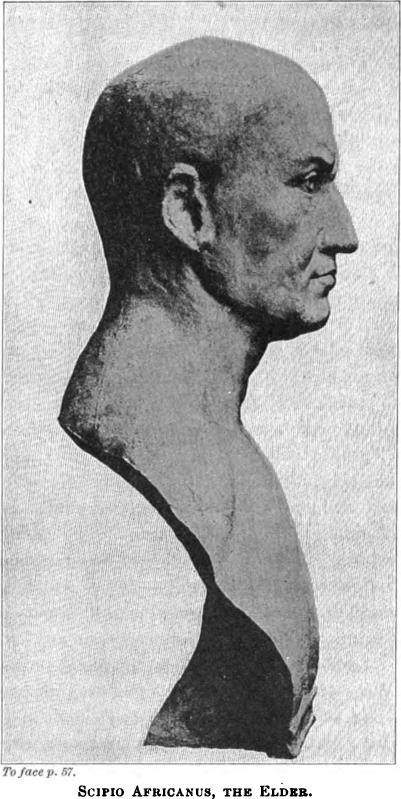

### X.

**20.** Nunc, antequam ad sententiam redeō, dē mē pauca dīcam. Ego, quanta manus est coniūrātōrum (quam vidētis esse permagnam), tantam mē inimīcōrum multitūdinem suscēpisse videō; sed eam esse iūdicō turpem et īnfirmam et abiectam. Quodsī aliquandō alicuius furōre et scelere concitāta manus ista plūs valuerit quam vestra ac reī pūblicae dignitās, mē tamen meōrum factōrum atque cōnsiliōrum numquam, patrēs cōnscrīptī, paenitēbit. Etenim mors, quam illī fortasse minitantur, omnibus est parāta; vītae tantam laudem, quantā vōs mē vestrīs dēcrētīs honestāstis, nēmō est assecūtus. Cēterīs enim bene gestā, mihi ūnī cōnservātā rē pūblicā, grātulātiōnem dēcrēvistis.

**21.** Sit Scīpiō clārus ille, cuius cōnsiliō atque virtūte Hannibal in Āfricam redīre atque Italiā dēcēdere coāctus est; ōrnētur alter eximiā laude Āfricānus, quī duās urbēs huic imperiō īnfēstissimās, Carthāginem Numantiamque, dēlēvit; habeātur vir ēgregius Paulus ille, cuius currum rēx potentissimus quondam et nōbilissimus Persēs honestāvit; sit aeternā glōriā Marius, quī bis Ītaliam obsidiōne et metū servitūtis līberāvit; antepōnātur omnibus Pompeius, cuius rēs gestae atque virtūtēs īsdem, quibus sōlis cursus, regiōnibus ac terminīs continentur; erit profectō inter hōrum laudēs aliquid locī nostrae glōriae, nisi forte maius est patefacere nōbīs prōvinciās, quō exīre possīmus, quam cūrāre, ut etiam illī, quī absunt, habeant, quō victōrēs revertantur.

**22.** Quamquam est ūnō locō condiciō melior externae victōriae quam domesticae, quod hostēs aliēnigenae aut oppressī serviunt aut receptī in amīcitiam beneficiō sē obligātōs putant; quī autem ex numerō cīvium dēmentiā aliquā dēprāvātī hostēs patriae semel esse coepērunt, eōs, cum ā perniciē reī pūblicae reppulerīs, nec vī coercēre nec beneficiō plācāre possīs. Quārē mihi cum perditīs cīvibus aeternum bellum susceptum esse videō. Id ego vestrō bonōrumque omnium auxiliō memoriāque tantōrum perīculōrum, quae nōn modo in hōc populō, quī servātus est, sed in omnium gentium sermōnibus ac mentibus semper haerēbit, ā mē atque ā meīs facile prōpulsārī posse cōnfīdō. Neque ūlla profectō tanta vīs reperiētur, quae coniūnctiōnem vestram equitumque Rōmānōrum et tantam cōnspīrātiōnem bonōrum omnium cōnfringere et labefactāre possit.

### XI.

**23.** Quae cum ita sint, prō imperiō, prō exercitū, prō prōvinciā, quam neglēxī, prō triumphō cēterīsque laudis īnsignibus, quae sunt ā mē propter urbis vestraeque salūtis custōdiam repudiāta, prō clientēlīs hospitiīsque prōvinciālibus, quae tamen urbānīs opibus nōn minōre labōre tueor quam comparō, prō hīs igitur omnibus rēbus, prō meīs in vōs singulāribus studiīs prōque hāc, quam perspicitis, ad cōnservandam rem pūblicam dīligentiā nihil ā vōbīs nisi huius temporis tōtīusque meī cōnsulātūs memoriam postulō; quae dum erit in vestrīs fīxa mentibus, tūtissimō mē mūrō saeptum esse arbitrābor. Quodsī meam spem vīs improbōrum fefellerit atque superāverit, commendō vōbīs parvum meum fīlium, cui profectō satis erit praesidī nōn sōlum ad salūtem, vērum etiam ad dignitātem, sī eius, quī haec omnia suō sōlīus perīculō cōnservārit, illum fīlium esse memineritis.

**24.** Quāpropter dē summā salūte vestrā populīque Rōmānī, dē vestrīs coniugibus ac līberīs, dē ārīs ac focīs, dē fānīs atque templīs, dē tōtīus urbis tēctīs ac sēdibus, dē imperiō ac lībertāte, dē salūte Italiae, dē ūniversā rē pūblicā dēcernite dīligenter, ut īnstituistis, ac fortiter. Habētis eum cōnsulem, quī et pārēre vestrīs dēcrētīs nōn dubitet et ea, quae statueritis, quoad vīvet, dēfendere et per sē ipsum praestāre possit.

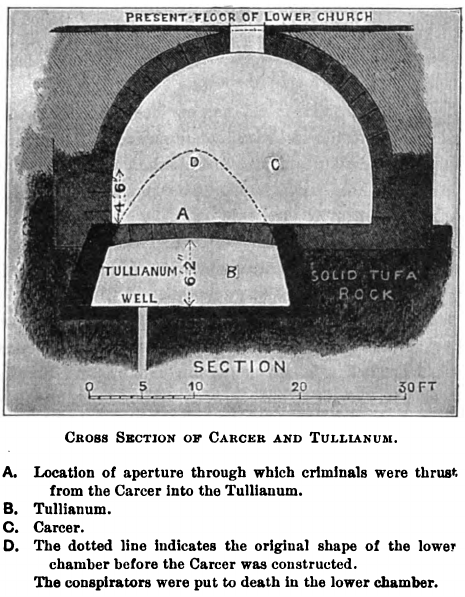

## Dē imperiō Cn. Pompei ad quirītēs ōrātiō.

### I.

**1.** Quamquam mihi semper frequēns cōnspectus vester multō iūcundissimus, hīc autem locus ad agendum amplissimus, ad dīcendum ōrnātissimus est vīsus, Quirītēs, tamen hōc aditū laudis, quī semper optimō cuique maximē patuit, nōn mea mē voluntās adhūc, sed vītae meae ratiōnēs ab ineunte aetāte susceptae prohibuērunt. Nam cum anteā per aetātem nōndum huius auctōritātem locī attingere audērem statueremque nihil hūc nisi perfectum ingeniō, ēlabōrātum industriā afferrī oportēre, omne meum tempus amīcōrum temporibus trānsmittendum putāvī.

**2.** Ita neque hīc locus vacuus umquam fuit ab eīs, quī vestram causam dēfenderent, et meus labor in prīvātōrum perīculīs castē integrēque versātus ex vestrō iūdiciō frūctum est amplissimum cōnsecūtus. Nam cum propter dīlātiōnem comitiōrum ter praetor prīmus centuriīs cūnctīs renūntiātus sum, facile intellēxī, Quirītēs, et quid dē mē iūdicārētis et quid aliīs praescrīberētis. Nunc cum et auctōritātis in mē tantum sit, quantum vōs honōribus mandandīs esse voluistis, et ad agendum facultātis tantum, quantum hominī vigilantī ex forēnsī ūsū prope cotīdiāna dīcendī exercitātiō potuit afferre, certē et, sī quid auctōritātis in mē est, apud eōs ūtar, quī eam mihi dedērunt, et, sī quid in dīcendō cōnsequī possum, eīs ostendam potissimum, quī eī quoque reī frūctum suō iūdiciō tribuendum esse dūxērunt.

**3.** Atque illud in prīmīs mihi laetandum iūre esse videō, quod in hāc īnsolitā mihi ex hōc locō ratiōne dīcendī causa tālis oblāta est, in quā ōrātiō dēesse nēminī possit. Dīcendum est enim dē Cn. Pompeī singulārī eximiāque virtūte; huius autem ōrātiōnis difficilius est exitum quam prīncipium invenīre. Ita mihi nōn tam cōpia quam modus in dīcendō quaerendus est.

### II.

**4.** Atque ut inde ōrātiō mea proficīscātur, unde haec omnis causa dūcitur, bellum grave et perīculōsum vestrīs vectīgālibus ac sociīs ā duōbus potentissimīs rēgibus īnfertur, Mithridāte et Tigrāne, quōrum alter relictus, alter lacessītus occāsiōnem sibi ad occupandam Asiam oblātam esse arbitrātur. Equitibus Rōmānīs, honestissimīs virīs, afferuntur ex Asiā cotīdiē litterae, quōrum magnae rēs aguntur in vestrīs vectīgālibus exercendīs occupātae; quī ad mē prō necessitūdine, quae mihi est cum illō ōrdine, causam reī pūblicae perīculaque rērum suārum dētulērunt;

**5.** Bīthȳniae, quae nunc vestra prōvincia est, vīcōs exustōs esse complūrēs, rēgnum Ariobarzānis, quod fīnitimum est vestrīs vectīgālibus, tōtum esse in hostium potestāte; L. Lūcullum magnīs rēbus gestīs ab eō bellō discēdere; huic quī successerit, nōn satis esse parātum ad tantum bellum administrandum; ūnum ab omnibus sociīs et cīvibus ad
id bellum imperātōrem dēposcī atque expetī, eundem hunc ūnum ab hostibus metuī, praetereā nēminem.

**6.** Causa quae sit, vidētis; nunc, quid agendum sit, cōnsīderāte. Prīmum mihi vidētur dē genere bellī, deinde dē magnitūdine, tam dē imperātōre dēligendō esse dīcendum. Genus est enim bellī eius modī, quod maximē vestrōs animōs excitāre atque īnflammāre ad persequendī studium dēbeat; in quō agitur populī Rōmānī glōria, quae vōbīs ā maiōribus, cum magna in omnibus rēbus, tum summa in rē mīlitārī trādita est; agitur salūs sociōrum atque amīcōrum, prō quā multa maiōrēs vestrī magna et gravia bella gessērunt; aguntur certissima populī Rōmānī vectīgālia et maxima, quibus āmissīs et pācis ōrnāmenta et subsidia bellī requīrētis; aguntur bona multōrum cīvium, quibus est ā vōbīs et ipsōrum et reī pūblicae causā cōnsulendum.

### III.

**7.** Et quoniam semper appetentēs glōriae praeter cēterās gentēs atque avidī laudis fuistis, dēlenda est vōbīs illa macula Mithridāticō bellō superiōre concepta, quae penitus iam īnsēdit ac nimis inveterāvit in populī Rōmānī nōmine, quod is, quī ūnō diē tōtā in Asiā tot in cīvitātibus ūnō nūntiō atque ūnā significātiōne litterārum cīvēs Rōmānōs omnēs necandōs trucīdandōsque dēnotāvit, nōn modo adhūc poenam nūllam suō dignam scelere suscēpit, sed ab illō tempore annum iam tertium et vīcēsimum rēgnat, et ita rēgnat, ut sē nōn Pontī neque Cappadociae latebrīs occultāre velit, sed ēmergere ex patriō rēgnō atque in vestrīs vectīgālibus, hōc est in Asiae lūce, versārī.

**8.** Etenim adhūc ita nostrī cum illō rēge contendērunt imperātōrēs, ut ab illō īnsignia victōriae, nōn victōriam reportārent. Triumphāvit L. Sulla, triumphāvit L. Mūrēna dē Mithridāte, duo fortissimī virī et summī imperātōrēs, sed ita triumphārunt, ut ille pulsus superātusque rēgnāret. Vērum tamen illīs imperātōribus laus est tribuenda, quod ēgērunt, venia danda, quod relīquērunt, proptereā quod ab eō bellō Sullam in Ītaliam rēs pūblica, Mūrēnam Sulla revocāvit.

### IV.

**9.** Mithridātēs autem omne reliquum tempus nōn ad oblīviōnem veteris bellī, sed ad comparātiōnem novī contulit; quī posteā, cum maximās aedificāsset ōrnāssetque classēs exercitūsque permagnōs, quibuscumque ex gentibus potuisset, comparāsset et sē Bosporānīs, fīnitimīs suīs, bellum īnferre simulāret, ūsque in Hispāniam lēgātōs ac litterās mīsit ad eōs ducēs, quibuscum tum bellum gerēbāmus, ut, cum duōbus in locīs disiūnctissimīs maximēque dīversīs ūnō cōnsiliō ā bīnīs hostium cōpiīs bellum terrā marīque gererētur, vōs ancipitī contentiōne districtī dē imperiō dīmicārētis.

**10.** Sed tamen alterius partis perīculum, Sertōriānae atque Hispāniēnsis, quae multō plūs firmāmentī ac rōboris habēbat, Cn. Pompeī dīvīnō cōnsiliō ac singulārī virtūte dēpulsum est; in alterā parte ita rēs ā L. Lūcullō, summō virō, est administrāta, ut initia illa rērum gestārum magna atque praeclāra nōn fēlīcitātī eius, sed virtūtī, haec autem extrēma, quae nūper accidērunt, nōn culpae, sed fortūnae tribuenda esse videantur. Sed dē Lūcullō dīcam aliō locō, et ita dīcam, Quirītēs, ut neque vēra laus eī dētracta ōrātiōne meā neque falsa afficta esse videātur.

**11.** Dē vestrī imperī dignitāte atque glōriā, quoniam is est exōrsus ōrātiōnis meae, vidēte quem vōbīs animum suscipiendum putētis.

### V.

Maiōrēs nostrī saepe, mercātōribus aut nāviculāriīs nostrīs iniūriōsius tractātīs, bella gessērunt; vōs, tot mīlibus cīvium Rōmānōrum ūnō nūntiō atque ūnō tempore necātīs, quō tandem animō esse dēbētis? Lēgātī quod erant appellātī superbius, Corinthum patrēs vestrī, tōtīus Graeciae lūmen, exstīnctum esse voluērunt; vōs eum rēgem inultum esse patiēminī, quī lēgātum populī Rōmānī cōnsulārem vinculīs ac verberibus atque omnī suppliciō excruciātum necāvit? Illī lībertātem imminūtam cīvium Rōmānōrum nōn tulērunt; vōs ēreptam vītam neglegētis? Iūs lēgātiōnis verbō violātum illī persecūtī sunt; vōs lēgātum omnī suppliciō interfectum relinquētis?

**12.** Vidēte, nē, ut illīs pulcherrimum fuit tantam vōbīs imperī glōriam trādere, sīc vōbīs turpissimum sit id, quod accēpistis, tuērī et cōnservāre nōn posse.

Quid? Quod salūs sociōrum summum in perīculum ac discrīmen vocātur, quō tandem animō ferre dēbētis? Rēgnō est expulsus Ariobarzānēs rēx, socius populī Rōmānī atque amīcus; imminent duo rēgēs tōtī Asiae nōn sōlum vōbīs inimīcissimī, sed etiam vestrīs sociīs atque amīcīs; cīvitātēs autem omnēs cūnctā Asiā atque Graeciā vestrum auxilium exspectāre propter perīculī magnitūdinem cōguntur; imperātōrem ā vōbīs certum dēposcere, cum praesertim vōs alium mīserītis, neque audent neque sē id facere sine summō perīculō posse arbitrantur.

**13.** Vident et sentiunt hōc idem, quod vōs, ūnum virum esse, in quō summa sint omnia, et eum propter esse, quō etiam carent aegrius; cuius adventū ipsō atque nōmine, tametsī ille ad maritimum bellum vēnerit, tamen impetūs hostium repressōs esse intellegunt ac retardātōs. Hī vōs, quoniam līberē loquī nōn licet, tacitē rogant, ut sē quoque sīcut cēterārum prōvinciārum sociōs dignōs exīstimētis, quōrum salūtem tālī virō commendētis, atque hōc etiam magis, quod cēterōs in prōvinciam eius modī hominēs cum imperiō mittimus, ut, etiamsī ab hoste dēfendant, tamen ipsōrum adventūs in urbēs sociōrum nōn multum ab hostīlī expugnātiōne differant. Hunc audiēbant anteā, nunc praesentem vident, tantā temperantiā, tantā mānsuētūdine, tantā hūmānitāte, ut eī beātissimī esse videantur, apud quōs ille diūtissimē commorātur.

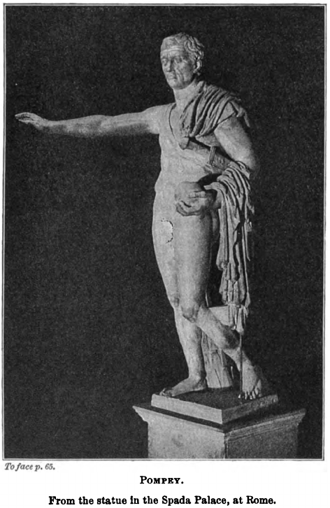

### VI.

**14.** Quārē, sī propter sociōs, nūllā ipsī iniūriā lacessītī, maiōrēs nostrī cum Antiochō, cum Philippō, cum Aetōlīs, cum Poenīs bella gessērunt, quantō vōs studiō convenit iniūriīs prōvocātōs sociōrum salūtem ūnā cum imperī vestrī dignitāte dēfendere, praesertim cum dē maximīs vestrīs vectīgālibus agātur? Nam cēterārum prōvinciārum vectīgālia, Quirītēs, tanta sunt, ut eīs ad ipsās prōvinciās tūtandās vix contentī esse possīmus; Asia vērō tam opīma est ac fertilis, ut et ūbertāte agrōrum et varietāte frūctuum et magnitūdine pāstiōnis et multitūdine eārum rērum, quae exportentur, facile omnibus terrīs antecellat. Itaque haec vōbīs prōvincia, Quirītēs, sī et bellī ūtilitātem et pācis dignitātem retinēre vultis, nōn modo ā calamitāte, sed etiam ā metū calamitātis est dēfendenda.

**15.** Nam in cēterīs rēbus cum venit calamitās, tum dētrīmentum accipitur; at in vectīgālibus nōn sōlum adventus malī, sed etiam metus ipse affert calamitātem. Nam cum hostium cōpiae nōn longē absunt, etiamsī irruptiō nūlla facta est, tamen pecuāria relinquitur, agrī cultūra dēseritur, mercātōrum nāvigātiō conquiēscit. Ita neque ex portū neque ex decumīs neque ex scrīptūrā vectīgal cōnservārī potest; quārē saepe tōtīus annī frūctus ūnō rūmōre perīculī atque ūnō bellī terrōre āmittitur.

**16.** Quō tandem animō esse exīstimātis aut eōs, quī vectīgālia nōbīs pēnsitant, aut eōs, quī exercent atque exigunt, cum duo rēgēs cum maximīs cōpiīs propter adsint, cum ūna excursiō equitātūs perbrevī tempore tōtīus annī vectīgal auferre possit, cum pūblicānī familiās maximās, quās in saltibus habent, quās in agrīs, quās in portubus atque custōdiīs, magnō perīculō sē habēre arbitrentur? Putātisne vōs illīs rēbus fruī posse, nisi eōs, quī vōbīs frūctuī sunt, cōnservāritis nōn sōlum, ut ante dīxī, calamitāte, sed etiam calamitātis formīdine līberātōs?

### VII.

**17.** Ac nē illud quidem vōbīs neglegendum est, quod mihi ego extrēmum prōposueram, cum essem dē bellī genere dictūrus, quod ad multōrum bona cīvium Rōmānōrum pertinet; quōrum vōbīs prō vestrā sapientiā, Quirītēs, habenda est ratiō dīligenter. Nam et pūblicānī, hominēs honestissimī atque ōrnātissimī, suās ratiōnēs et cōpiās in illam prōvinciam contulērunt, quōrum ipsōrum per sē rēs et fortūnae vōbīs cūrae esse dēbent. Etenim, sī vectīgālia nervōs esse reī pūblicae semper dūximus, eum certē ōrdinem, quī exercet illa, firmāmentum cēterōrum ōrdinum rēctē esse dīcēmus.

**16.** Deinde ex cēterīs ōrdinibus hominēs gnāvī atque industriī partim ipsī in Asiā negōtiantur, quibus vōs absentibus cōnsulere dēbētis, partim eōrum in eā prōvinciā pecūniās magnās collocātās habent. Est igitur hūmānitātis vestrae magnum numerum eōrum cīvium calamitāte prohibēre, sapientiae vidēre multōrum cīvium calamitātem ā rē pūblicā sēiūnctam esse nōn posse. Etenim prīmum illud parvī refert, nōs pūblicānīs omissīs vectīgālia posteā victōriā recuperāre; neque enim īsdem redimendī facultās erit propter calamitātem neque aliīs voluntās propter timōrem.

**19.** Deinde, quod nōs eadem Asia atque īdem iste Mithridātēs initiō bellī Āsiāticī docuit, id quidem certē calamitāte doctī memoriā retinēre dēbēmus. Nam tum, cum in Asiā rēs magnās permultī āmīserant, scīmus Rōmae, solūtiōne impedītā, fidem concidisse. Nōn enim possunt ūnā in cīvitāte multī rem ac fortūnās āmittere, ut nōn plūrēs sēcum in eandem trahant calamitātem. Ā quō perīculō prohibēte rem pūblicam et mihi crēdite, id quod ipsī vidētis, haec fidēs atque haec ratiō pecūniārum, quae Rōmae, quae in Forō versātur, implicāta est cum illīs pecūniīs Āsiāticīs et cohaeret; ruere illa nōn possunt, ut haec nōn eōdem labefacta mōtū concidant. Quārē vidēte, num dubitandum vōbīs sit omnī studiō ad id bellum incumbere, in quō glōria nōminis vestrī, salūs sociōrum, vectīgālia maxima, fortūnae plūrimōrum cīvium coniūnctae cum rē pūblicā dēfendantur.

### VIII.

**20.** Quoniam dē genere bellī dīxī, nunc dē magnitūdine pauca dīcam. Potest enim hōc dīcī, bellī genus esse ita necessārium, ut sit gerendum, nōn esse ita magnum, ut sit pertimēscendum. In quō maximē labōrandum est, nē forte ea vōbīs, quae dīligentissimē prōvidenda sunt, contemnenda esse videantur. Atque ut omnēs intellegant mē L. Lūcullō tantum impertīre laudis, quantum fortī virō et sapientī hominī et magnō imperātōrī dēbeātur, dīcō eius adventū maximās Mithridātī cōpiās omnibus rēbus ōrnātās atque īnstrūctās fuisse, urbemque Asiae clārissimam nōbīsque amīcissimam Cȳzicēnōrum obsessam esse ab ipsō rēge maximā multitūdine et oppugnātam vehementissimē; quam L. Lūcullus virtūte, assiduitāte, cōnsiliō summīs obsidiōnis perīculīs līberāvit;

**21.** ab eōdem imperātōre classem magnam et ōrnātam, quae ducibus Sertōriānīs ad Italiam studiō īnflammāta raperētur, superātam esse atque dēpressam; magnās hostium praetereā cōpiās multīs proeliīs esse dēlētās patefactumque nostrīs legiōnibus esse Pontum, quī anteā populō Rōmānō ex omnī aditū clausus fuisset; Sinōpēn atque Amīsum, quibus in oppidīs erant domicilia rēgis, omnibus rēbus ōrnātās ac refertās cēterāsque urbēs Pontī et Cappadociae permultās ūnō aditū adventūque esse captās; rēgem spoliātum rēgnō patriō atque avītō ad aliōs sē rēgēs atque ad aliās gentēs supplicem contulisse; atque haec omnia salvīs populī Rōmānī sociīs atque integrīs vectīgālibus esse gesta. Satis opīnor haec esse laudis, atque ita, Quirītēs, ut hōc vōs intellegātis, ā nūllō istōrum, quī huic obtrectant lēgī atque causae, L. Lūcullum similiter ex hōc locō esse laudātum.

### IX.

**22.** Requīrētur fortasse nunc, quem ad modum, cum haec ita sint, reliquum possit magnum esse bellum. Cognōscite, Quirītēs; nōn enim hōc sine causā quaerī vidētur. Prīmum ex suō rēgnō sīc Mithridātēs profūgit, ut ex eōdem Pontō Mēdēa illa quondam profūgisse dīcitur, quam praedicant in fugā frātris suī membra in eīs locīs, quā sē parēns persequerētur, dissipāvisse, ut eōrum collēctiō dispersa maerorque patrius celeritātem persequendī retardāret. Sīc Mithridātēs fugiēns maximam vim aurī atque argentī pulcherrimārumque rērum omnium, quās et ā maiōribus accēperat et ipse bellō superiōre ex tōtā Asiā dīreptās in suum rēgnum congesserat, in Pontō omnem relīquit. Haec dum nostrī colligunt omnia dīligentius, rēx ipse ē manibus effūgit. Ita illum in persequendī studiō maeror, hōs laetitia tardāvit.

**23.** Hunc in illō timōre et fugā Tigrānēs, rēx Armenius, excēpit diffīdentemque rēbus suīs cōnfirmāvit et afflīctum ērēxit perditumque recreāvit. Cuius in rēgnum posteāquam L. Lūcullus cum exercitū vēnit, plūrēs etiam gentēs contrā imperātōrem nostrum concitātae sunt. Erat enim metus iniectus eīs nātiōnibus, quās numquam populus Rōmānus neque lacessendās bellō neque temptandās putāvit; erat etiam alia gravis atque vehemēns opīniō, quae animōs gentium barbarārum pervāserat, fānī locuplētissimī et religiōsissimī dīripiendī causā in eās ōrās nostrum esse exercitum adductum. Ita nātiōnēs multae atque magnae novō quōdam terrōre ac metū concitābantur. Noster autem exercitus tametsī urbem ex Tigrānis rēgnō cēperat et proeliīs ūsus erat secundīs, tamen nimiā longinquitāte locōrum ac dēsīderiō suōrum commovēbātur.

**24.** Hīc iam plūra nōn dīcam; fuit enim illud extrēmum, ut ex eīs locīs ā mīlitibus nostrīs reditus magis mātūrus quam prōcessiō longior quaererētur. Mithridātēs autem et suam manum iam cōnfirmārat et eōrum, quī sē ex ipsīus rēgnō collēgerant, et magnīs adventīciīs auxiliīs multōrum rēgum et nātiōnum iuvābātur. Nam hōc ferē sīc fierī solēre accēpimus, ut rēgum afflīctae fortūnae facile multōrum opēs alliciant ad misericordiam, maximēque eōrum, quī aut rēgēs sunt aut vīvunt in rēgnō, ut eīs nōmen rēgāle magnum et sānctum esse videātur.

**25.** Itaque tantum victus efficere potuit, quantum incolumis numquam est ausus optāre. Nam, cum sē in rēgnum suum recēpisset, nōn fuit eō contentus, quod eī praeter spem acciderat, ut illam, posteāquam pulsus erat, terram umquam attingeret, sed in exercitum nostrum clārum atque victōrem impetum fēcit. Sinite hōc locō, Quirītēs, sīcut poētae solent, quī rēs Rōmānās scrībunt, praeterīre mē nostram calamitātem, quae tanta fuit, ut eam ad aurēs imperātōris nōn ex proeliō nūntius, sed ex sermōne rūmor afferret.

**26.** Hīc in illō ipsō malō gravissimāque bellī offēnsiōne L. Lūcullus, quī tamen aliquā ex parte eīs incommodīs medērī fortasse potuisset, vestrō iussū coāctus, quod imperī diūturnitātī modum statuendum vetere exemplō putāvistis, partem mīlitum, quī iam stīpendiīs cōnfectī erant, dīmīsit, partem M’. Glabriōnī trādidit. Multa praetereō cōnsultō; sed ea vōs coniectūrā perspicite, quantum illud bellum factum putētis, quod coniungant rēgēs potentissimī, renovent agitātae nātiōnēs, suscipiant integrae gentēs, novus imperātor noster accipiat vetere exercitū pulsō.

### X.

**27.** Satis mihi multa verba fēcisse videor, quārē esset hōc bellum genere ipsō necessārium, magnitūdine perīculōsum; restat, ut dē imperātōre ad id bellum dēligendō ac tantīs rēbus praeficiendō dīcendum esse videātur. Utinam, Quirītēs, virōrum fortium atque innocentium cōpiam tantam habērētis, ut haec vōbīs dēlīberātiō difficilis esset, quemnam potissimum tantīs rēbus ac tantō bellō praeficiendum putārētis! Nunc vērō cum sit ūnus Cn. Pompeius, quī nōn modo eōrum hominum, quī nunc sunt, glōriam, sed etiam antīquitātis memoriam virtūte superārit, quae rēs est, quae cuiusquam animum in hāc causā dubium facere possit?

**28.** Ego enim sīc exīstimō, in summō imperātōre quattuor hās rēs inesse oportēre, scientiam reī mīlitāris, virtūtem, auctōritātem, fēlīcitātem.

Quis igitur hōc homine scientior umquam aut fuit aut esse dēbuit? quī ē lūdō atque pueritiae disciplīnīs, bellō maximō atque ācerrimīs hostibus, ad patris exercitum atque in mīlitiae disciplīnam profectus est, quī extrēmā pueritiā mīles in exercitū fuit summī imperātōris, ineunte adulēscentiā maximī ipse exercitūs imperātor, quī saepius cum hoste cōnflīxit, quam quisquam cum inimīcō concertāvit, plūra bella gessit quam cēterī lēgērunt, plūrēs prōvinciās cōnfēcit quam aliī concupīvērunt, cuius adulēscentia ad scientiam reī mīlitāris nōn aliēnīs praeceptīs, sed suīs imperiīs, nōn offēnsiōnibus bellī, sed victōriīs, nōn stīpendiīs, sed triumphīs est ērudīta. Quod dēnique genus esse bellī potest, in quō illum nōn exercuerit fortūna reī pūblicae? Cīvīle, Āfricānum, Trānsalpīnum, Hispāniēnse mixtum ex cīvitātibus atque ex bellicōsissimīs nātiōnibus, servīle, nāvāle bellum, varia et dīversa genera et bellōrum et hostium, nōn sōlum gesta ab hōc ūnō, sed etiam cōnfecta, nūllam rem esse dēclārant in ūsū positam mīlitārī, quae huius virī scientiam fugere possit.

### XI.

**29.** Iam vērō virtūtī Cn. Pompeī quae potest ōrātiō pār invenīrī? Quid est, quod quisquam aut illō dignum aut vōbīs novum aut cuiquam inaudītum possit afferre? Neque enim illae sunt sōlae virtūtēs imperātōriae, quae vulgō exīstimantur, labor in negōtiīs, fortitūdō in perīculīs, industria in agendō, celeritās in cōnficiendō, cōnsilium in prōvidendō, quae tanta sunt in hōc ūnō, quanta in omnibus reliquīs imperātōribus, quōs aut vīdimus aut audīvimus, nōn fuērunt.

**30.** Testis est Italia, quam ille ipse victor L. Sulla huius virtūte et subsidiō cōnfessus est līberātam; testis est Sicilia, quam multīs undique cīnctam perīculīs nōn terrōre bellī, sed cōnsilī celeritāte explicāvit; testis est Āfrica, quae magnīs oppressa hostium cōpiīs eōrum ipsōrum sanguine redundāvit; testis est Gallia, per quam legiōnibus nostrīs iter in Hispāniam Gallōrum interneciōne patefactum est; testis est Hispānia, quae saepissimē plūrimōs hostēs ab hōc superātōs prōstrātōsque cōnspexit; testis est iterum et saepius Italia, quae cum servīlī bellō taetrō perīculōsōque premerētur, ab hōc auxilium absente expetīvit, quod bellum exspectātiōne eius attenuātum atque imminūtum est, adventū sublātum ac sepultum.

**31.** Testēs nunc vērō iam omnēs sunt ōrae atque omnēs exterae gentēs ac nātiōnēs, dēnique maria omnia cum ūniversa, tum in singulīs ōrīs omnēs sinūs atque portūs. Quis enim tōtō marī locus per hōs annōs aut tam firmum habuit praesidium, ut tūtus esset, aut tam fuit abditus, ut latēret? Quis nāvigāvit, quī nōn sē aut mortis aut servitūtis perīculō committeret, cum aut hieme aut refertō praedōnum marī nāvigāret? Hōc tantum bellum, tam turpe, tam vetus, tam lātē dīvīsum atque dispersum quis umquam arbitrārētur aut ab omnibus imperātōribus ūnō annō aut omnibus annīs ab ūnō imperātōre cōnficī posse?

**32.** Quam prōvinciam tenuistis ā praedōnibus līberam per hōsce annōs? Quod vectīgal vōbīs tūtum fuit? Quem socium dēfendistis ? Cui praesidiō classibus vestrīs fuistis? Quam multās exīstimātis īnsulās esse dēsertās, quam multās aut metū relictās aut ā praedōnibus captās urbēs esse sociōrum?

### XII.

Sed quid ego longinqua commemorō? Fuit hōc quondam, fuit proprium populī Rōmānī, longē ā domō bellāre et prōpugnāculīs imperī sociōrum fortūnās, nōn sua tēcta dēfendere. Sociīs ego nostrīs mare per hōs annōs clausum fuisse dīcam, cum exercitūs vestrī numquam ā Brundisiō nisi hieme summā trānsmīserint? Quī ad vōs ab exterīs nātiōnibus venīrent, captōs querar, cum lēgātī populī Rōmānī redēmptī sint ? Mercātōribus tūtum mare nōn fuisse dīcam, cum duodecim secūrēs in praedōnum potestātem pervēnerint?

**33.** Cnidum aut Colophōnem aut Samum, nōbilissimās urbēs, innumerābilēsque aliās captās esse commemorem, cum vestrōs portūs atque eōs portūs, quibus vītam ac spīritum dūcitis, in praedōnum fuisse potestāte sciātis? An vērō ignōrātis portum Caiētae celeberrimum ac plēnissimum nāvium īnspectante praetōre ā praedōnibus esse dīreptum, ex Mīsēnō autem eius ipsīus līberōs, quī cum praedōnibus anteā ibi bellum gesserat, ā praedōnibus esse sublātōs? Nam quid ego Ōstiēnse incommodum atque illam lābem atque ignōminiam reī pūblicae querar, cum prope īnspectantibus vōbīs classis ea, cui cōnsul populī Rōmānī praepositus esset, ā praedōnibus capta atque oppressa est? Prō dī immortālēs! Tantamne ūnīus hominis incrēdibilis ac dīvīna virtūs tam brevī tempore lūcem afferre reī pūblicae potuit, ut vōs, quī modo ante ōstium Tiberīnum classem hostium vidēbātis, eī nunc nūllam intrā Ōceanī ōstium praedōnum nāvem esse audiātis?

**34.** Atque haec quā celeritāte gesta sint, quamquam vidētis, tamen ā mē in dīcendō praetereunda nōn sunt. Quis enim umquam aut obeundī negōtī aut cōnsequendī quaestūs studiō tam brevī tempore tot loca adīre, tantōs cursūs cōnficere potuit, quam celeriter, Cn. Pompeiō duce, tantī bellī impetus nāvigāvit? Quī, nōndum tempestīvō ad nāvigandum marī, Siciliam adiit, Āfricam explōrāvit, in Sardiniam cum classe vēnit atque haec tria frūmentāria subsidia reī pūblicae firmissimīs praesidiīs classibusque mūnīvit.

**35.** Inde cum sē in Italiam recēpisset, duābus Hispāniīs et Galliā Trānsalpīnā praesidiīs ac nāvibus cōnfirmātā, missīs item in ōram Īllyricī maris et in Achāiam omnemque Graeciam nāvibus, Italiae duo maria maximīs classibus firmissimīsque praesidiīs adōrnāvit; ipse autem ut Brundisiō profectus est, ūndēquīnquāgēsimō diē tōtam ad imperium populī Rōmānī Ciliciam adiūnxit; omnēs, quī ubīque praedōnēs fuērunt, partim captī interfectīque sunt, partim ūnīus huius sē imperiō ac potestātī dēdidērunt. Īdem Crētēnsibus, cum ad eum ūsque in Pamphȳliam lēgātōs dēprecātōrēsque mīsissent, spem dēditiōnis nōn adēmit obsidēsque imperāvit. Ita tantum bellum, tam diūturnum, tam longē lātēque dispersum, quō bellō omnēs gentēs ac nātiōnēs premēbantur, Cn. Pompeius extrēmā hieme apparāvit, ineunte vēre suscēpit, mediā aestāte cōnfēcit.

### XIII.

**36.** Est haec dīvīna atque incrēdibilis virtūs imperātōris. Quid? Cēterae, quās paulō ante commemorāre coeperam, quantae atque quam multae sunt! Nōn enim bellandī virtūs sōlum in summō ac perfectō imperātōre quaerenda est, sed multae sunt artēs eximiae huius administrae comitēsque virtūtis. Ac prīnum quantā innocentiā dēbent esse imperātōrēs, quantā deinde in omnibus rēbus temperantiā, quantā fidē, quantā facilitāte, quantō ingeniō, quantā hūmānitāte! Quae breviter quālia sint in Cn. Pompeiō, cōnsīderēmus. Summa enim omnia sunt, Quirītēs, sed ea magis ex aliōrum contentiōne quam ipsa per sēsē cognōscī atque intellegī possunt.

**37.** Quem enim imperātōrem possumus ūllō in numerō putāre, cuius in exercitū centuriātūs vēneant atque vēnierint? Quid hunc hominem magnum aut amplum dē rē pūblicā cōgitāre, quī pecūniam ex aerāriō dēprōmptam ad bellum administrandum aut propter cupiditātem prōvinciae magistrātibus dīvīserit aut propter avāritiam Rōmae in quaestū relīquerit? Vestra admurmurātiō facit, Quirītēs, ut agnōscere videāminī, quī haec fēcerint; ego autem nōminō nēminem; quārē īrāscī mihi nēmō poterit, nisi quī ante dē sē voluerit cōnfitērī. Itaque propter hanc avāritiam imperātōrum quantās calamitātēs, quōcumque ventum sit, nostrī exercitūs ferant, quis ignōrat?

**38.** Itinera quae per hōsce annōs in Italiā per agrōs atque oppida cīvium Rōmānōrum nostrī imperātōrēs fēcerint, recordāminī; tum facilius statuētis, quid apud exterās nātiōnēs fierī exīstimētis. Utrum plūrēs arbitrāminī per hōsce annōs mīlitum vestrōrum armīs hostium urbēs an hībernīs sociōrum cīvitātēs esse dēlētās? Neque enim potest exercitum is continēre imperātor, quī sē ipse nōn continet, neque sevērus esse in iūdicandō, quī aliōs in sē sevērōs esse iūdicēs nōn vult.

**39.** Hīc mīrāmur hunc hominem tantum excellere cēterīs, cuius legiōnēs sīc in Asiam pervēnerint, ut nōn modo manus tantī exercitūs, sed nē vestīgium quidem cuiquam pācātō nocuisse dīcātur? Iam vērō quem ad modum mīlitēs hībernent, cotīdiē sermōnēs ac litterae perferuntur; nōn modo ut sūmptum faciat in mīlitem, nēminī vīs affertur, sed nē cupientī quidem cuiquam permittitur. Hiemis enim, nōn avāritiae perfugium maiōrēs nostrī in sociōrum atque amīcōrum tēctīs esse voluērunt.

### XIV.

**40.** Age vērō, cēterīs in rēbus quā sit temperantiā, cōnsīderāte. Unde illam tantam celeritātem et tam incrēdibilem cursum inventum putātis? Nōn enim illum eximia vīs rēmigum aut ars inaudīta quaedam gubernandī aut ventī aliquī novī tam celeriter in ultimās terrās pertulērunt, sed eae rēs, quae cēterōs remorārī solent, nōn retardārunt; nōn avāritia ab īnstitūtō cursū ad praedam aliquam dēvocāvit, nōn libīdō ad voluptātem, nōn amoenitās ad dēlectātiōnem, nōn nōbilitās urbis ad cognitiōnem, nōn dēnique labor ipse ad quiētem; postrēmō signa et tabulās cēteraque ōrnāmenta Graecōrum oppidōrum, quae cēterī tollenda esse arbitrantur, ea sibi ille nē vīsenda quidem exīstimāvit.

**41.** Itaque omnēs nunc in eīs locīs Cn. Pompeium sīcut aliquem nōn ex hāc urbe missum, sed dē caelō dēlāpsum intuentur; nunc dēnique incipiunt crēdere fuisse hominēs Rōmānōs hāc quondam continentiā, quod iam nātiōnibus exterīs incrēdibile ac falsō memoriae prōditum vidēbātur; nunc imperī vestrī splendor illīs gentibus lūcem afferre coepit; nunc intellegunt nōn sine causā maiōrēs suōs tum, cum eā temperantiā magistrātūs habēbāmus, servīre populō Rōmānō quam imperāre aliīs māluisse. Iam vērō ita facilēs aditūs ad eum prīvātōrum, ita līberae querimōniae dē aliōrum iniūriīs esse dīcuntur, ut is, quī dignitāte prīncipibus excellit, facilitāte īnfimīs pār esse videātur.

**42.** Iam quantum cōnsiliō, quantum dīcendī gravitāte et cōpiā valeat (in quō ipsō inest quaedam dignitās imperātōria), vōs, Quirītēs, hōc ipsō ex locō saepe cognōvistis. Fidem vērō eius quantam inter sociōs exīstimārī putātis, quam hostēs omnēs omnium generum sānctissimam iūdicārint? Hūmānitāte iam tantā est, ut difficile dictū sit, utrum hostēs magis virtūtem eius pugnantēs timuerint an mānsuētūdinem victī dīlēxerint. Et quisquam dubitābit, quīn huic hōc tantum bellum trānsmittendum sit, quī ad omnia nostrae memoriae bella cōnficienda dīvīnō quōdam cōnsiliō nātus esse videātur?

### XV.

**43.** Et quoniam auctōritās quoque in bellīs administrandīs multum atque in imperiō mīlitārī valet, certē nēminī dubium est, quīn eā rē īdem ille imperātor plūrimum possit. Vehementer autem pertinēre ad bella administranda, quid hostēs, quid sociī dē imperātōribus nostrīs exīstiment, quis ignōrat, cum sciāmus hominēs, in tantīs rēbus ut aut contemnant aut metuant aut ōderint aut ament, opīniōne nōn minus et fāmā quam aliquā ratiōne certā commovērī? Quod igitur nōmen umquam in orbe terrārum clārius fuit? Cuius rēs gestae parēs? Dē quō homine vōs, id quod maximē facit auctōritātem, tanta et tam praeclāra iūdicia fēcistis?

**44.** An vērō ūllam usquam esse ōram tam dēsertam putātis, quō nōn illīus diēī fāma pervāserit, cum ūniversus populus Rōmānus refertō Forō complētīsque omnibus templīs, ex quibus hīc locus cōnspicī potest, ūnum sibi ad commūne omnium gentium bellum Cn. Pompeium imperātōrem dēpoposcit ? Itaque, ut plūra nōn dīcam neque aliōrum exemplīs cōnfirmem, quantum auctōritās valeat in bellō, ab eōdem Cn. Pompeiō omnium rērum ēgregiārum exempla sūmantur; quī quō diē ā vōbīs maritimō bellō praepositus est imperātor, tanta repente vīlitās annōnae ex summā inopiā et cāritāte reī frūmentāriae cōnsecūta est ūnīus hominis spē ac nōmine, quantam vix ex summā ūbertāte agrōrum diūturna pāx efficere potuisset.

**45.** Iam acceptā in Pontō calamitāte ex eō proeliō, dē quō vōs paulō ante invītus admonuī, cum sociī pertimuissent, hostium opēs animīque crēvissent, satis firmum praesidium prōvincia nōn habēret, āmīsissētis Asiam, Quirītēs, nisi ad
ipsum discrīmen eius temporis dīvīnitus Cn. Pompeium ad eās regiōnēs fortūna populī Rōmānī attulisset. Huius adventus et Mithridātem īnsolitā īnflammātum victōriā continuit et Tigrānem magnīs cōpiīs minitantem Asiae retardāvit. Et quisquam dubitābit, quid virtūte perfectūrus sit, quī tantum auctōritāte perfēcerit, aut quam facile imperiō atque exercitū sociōs et vectīgālia cōnservātūrus sit, quī ipsō nōmine ac rūmōre dēfenderit?

### XVI.

**46.** Age vērō illa rēs quantam dēclārat eiusdem hominis apud hostēs populī Rōmānī auctōritātem, quod ex locīs tam longinquīs tamque dīversīs tam brevī tempore omnēs huic sē ūnī dēdidērunt! Quod Crētēnsium lēgātī, cum in eōrum īnsulā noster imperātor exercitusque esset, ad Cn. Pompeium in ultimās prope terrās vēnērunt eīque sē omnēs Crētēnsium cīvitātēs dēdere velle dīxērunt! Quid? Īdem iste Mithridātēs nōnne ad eundem Cn. Pompeium lēgātum ūsque in Hispāniam mīsit? Eum, quem Pompeius lēgātum semper iūdicāvit, eī, quibus erat molestum ad eum potissimum esse missum, speculātōrem quam lēgātum iūdicārī māluērunt. Potestis igitur iam cōnstituere, Quirītēs, hanc auctōritātem multīs posteā rēbus gestīs magnīsque vestrīs iūdiciīs amplificātam quantum apud illōs rēgēs, quantum apud exterās nātiōnēs valitūram esse exīstimētis.

**47.** Reliquum est, ut dē fēlīcitāte, quam praestāre dē sē ipsō nēmō potest, meminisse et commemorāre dē alterō possumus, sīcut aequum est hominēs dē potestāte deōrum, timidē et pauca dīcāmus. Ego enim sīc exīstimō, Māximō, Mārcellō, Scīpiōnī, Mariō et cēterīs magnīs imperātōribus nōn sōlum propter virtūtem, sed etiam propter fortūnam
saepius imperia mandāta atque exercitūs esse commissōs. Fuit enim profectō quibusdam summīs virīs quaedam ad amplitūdinem et ad glōriam et ad rēs magnās bene gerendās dīvīnitus adiūncta fortūna. Dē huius autem hominis fēlīcitāte, dē quō nunc agimus, hāc ūtar moderātiōne dīcendī, nōn ut in illīus potestāte fortūnam positam esse dīcam, sed ut praeterita meminisse, reliqua spērāre videāmur, nē aut invīsa dīs immortālibus ōrātiō nostra aut ingrāta esse videātur.

**48.** Itaque nōn sum praedicātūrus, quantās ille rēs domī mīlitiae, terrā marīque quantāque fēlīcitāte gesserit; ut eius semper voluntātibus nōn modo cīvēs assēnserint, sociī obtemperārint, hostēs oboedierint, sed etiam ventī tempestātēsque obsecundārint; hōc brevissimē dīcam, nēminem umquam tam impudentem fuisse, quī ab dīs immortālibus tot et tantās rēs tacitus audēret optāre, quot et quantās dī immortālēs ad Cn. Pompeium dētulērunt. Quod ut illī proprium ac perpetuum sit, Quirītēs, cum commūnis salūtis atque imperī, tum ipsīus hominis causā, sīcutī facitis, velle et optāre dēbētis.

**49.** Quārē cum et bellum sit ita necessārium, ut neglegī nōn possit, ita magnum, ut accūrātissimē sit administrandum, et cum eī imperātōrem praeficere possītis, in quō sit eximia bellī scientia, singulāris virtūs, clārissima auctōritās, ēgregia fortūna, dubitātis, Quirītēs, quīn hōc tantum bonī, quod vōbīs ab dīs immortālibus oblātum et datum est, in rem pūblicam cōnservandam atque amplificandam cōnferātis?

### XVII.

**30.** Quodsī Rōmae Cn. Pompeius prīvātus esset hōc tempore, tamen ad tantum bellum is erat dēligendus atque mittendus; nunc cum ad cēterās summās ūtilitātēs haec quoque opportūnitās adiungātur, ut in eīs ipsīs locīs adsit, ut habeat exercitum, ut ab eīs, quī habent, accipere statim possit, quid exspectāmus? Aut cūr nōn, ducibus dīs immortālibus, eīdem, cui cētera summā cum salūte reī pūblicae commissa sunt, hōc quoque bellum rēgium committāmus?

**51.** At enim vir clārissimus, amantissimus reī pūblicae, vestrīs beneficiīs amplissimīs affectus, Q. Catulus, itemque summīs ōrnāmentīs honōris, fortūnae, virtūtis, ingenī praeditus, Q. Hortēnsius, ab hāc ratiōne dissentiunt. Quōrum ego auctōritātem apud vōs multīs locīs plūrimum valuisse et valēre oportēre cōnfiteor; sed in hāc causā, tametsī cognōscētis auctōritātēs contrāriās virōrum fortissimōrum et clārissimōrum, tamen, omissīs auctōritātibus, ipsā rē ac ratiōne exquīrere possumus vēritātem, atque hōc facilius, quod ea omnia, quae ā mē adhūc dicta sunt, īdem istī vēra esse concēdunt, et necessārium bellum esse et magnum et in ūnō Cn. Pompeiō summa esse omnia.

**52.** Quid igitur ait Hortēnsius? Sī ūnī omnia tribuenda sint, dignissimum esse Pompeium, sed ad ūnum tamen omnia dēferrī nōn oportēre.

Obsolēvit iam ista ōrātiō rē multō magis quam verbīs refūtāta. Nam tū īdem, Q. Hortēnsī, multa prō tuā summā cōpiā ac singulārī facultāte dīcendī et in senātū contrā virum fortem, A. Gabīnium, graviter ōrnātēque dīxistī, cum is dē ūnō imperātōre contrā praedōnēs cōnstituendō lēgem prōmulgāsset, et ex hōc ipsō locō permulta item contrā eam lēgem verba fēcistī.

**53.** Quid? Tum, per deōs immortālēs, sī plūs apud populum Rōmānum auctōritās tua quam ipsīus populī Rōmānī salūs et vēra causa valuisset, hodiē hanc glōriam atque hōc orbis terrae imperium tenērēmus ? An tibi tum imperium hōc esse vidēbātur, cum populī Rōmānī lēgātī, quaestōrēs praetōrēsque capiēbantur, cum ex omnibus prōvinciīs commeātū et prīvātō et pūblicō prohibēbāmur, cum ita clausa nōbīs erant maria omnia, ut neque prīvātam rem trānsmarīnam neque pūblicam iam obīre possēmus?

### XVIII.

**54.** Quae cīvitās anteā umquam fuit,—nōn dīcō Athēniēnsium, quae satis lātē quondam mare tenuisse dīcitur, nōn Carthāginiēnsium, quī permultum classe ac maritimīs rēbus valuērunt, nōn Rhodiōrum, quōrum ūsque ad nostram memoriam disciplīna nāvālis et glōria remānsit, — quae cīvitās, inquam, anteā tam tenuis, quae tam parva īnsula fuit, quae nōn portūs suōs et agrōs et aliquam partem regiōnis atque ōrae maritimae per sē ipsa dēfenderet? At herculē aliquot annōs continuōs ante lēgem Gabīniam ille populus Rōmānus, cuius ūsque ad nostram memoriam nōmen invictum in nāvālibus pugnīs permānserit, magnā ac multō maximā parte nōn modo ūtilitātis, sed dignitātis atque imperī caruit;

**55.** nōs, quōrum maiōrēs Antiochum rēgem classe Persemque superārunt omnibusque nāvālibus pugnīs Carthāginiēnsīs, hominēs in maritimīs rēbus exercitātissimōs parātissimōsque, vīcērunt, eī nūllō in locō iam praedōnibus parēs esse poterāmus; nōs, quī anteā nōn modo Italiam tūtam habēbāmus, sed omnēs sociōs in ultimīs ōrīs auctōritāte nostrī imperī salvōs praestāre poterāmus, tum, cum īnsula Dēlos tam procul ā nōbīs in Aegaeō marī posita, quō omnēs undique cum mercibus atque oneribus commeābant, referta dīvitiīs, parva, sine mūrō nihil timēbat, īdem nōn modo prōvinciīs atque ōrīs Ttaliae maritimīs ac portubus nostrīs, sed etiam Appiā iam Viā carēbāmus; et eīs temporibus nōn pudēbat magistrātūs populī Rōmānī in hunc ipsum locum escendere, cum eum nōbīs maiōrēs nostrī exuviīs nauticīs et classium spoliīs ōrnātum relīquissent!

### XIX.

**56.** Bonō tē animō tum, Q. Hortēnsī, populus Rōmānus et cēterōs, quī erant in eādem sententiā, dīcere exīstimāvit ea, quae sentiēbātis; sed tamen in salūte commūnī īdem populus Rōmānus dolōrī suō māluit quam auctōritātī vestrae obtemperāre. Itaque ūna lēx, ūnus vir, ūnus annus nōn modo nōs illā miseriā ac turpitūdine līberāvit, sed etiam effēcit, ut aliquandō vērē vidērēmur omnibus gentibus ac nātiōnibus terrā marīque imperāre.

**57.** Quō mihi etiam indignius vidētur obtrectātum esse adhūc (Gabīniō dīcam anne Pompeiō an utrīque, id quod est vērius ?), nē lēgārētur A. Gabīnius Cn. Pompeiō expetentī ac postulantī. Utrum ille, quī postulat ad tantum bellum lēgātum, quem velit, idōneus nōn est, quī impetret, cum cēterī ad expīlandōs sociōs dīripiendāsque prōvinciās, quōs voluērunt, lēgātōs ēdūxerint, an ipse, cuius lēge salūs ac dignitās populō Rōmānō atque omnibus gentibus cōnstitūta est, expers esse dēbet glōriae eius imperātōris atque eius exercitūs, quī cōnsiliō ipsīus ac perīculō est cōnstitūtus?

**58.** An C. Falcidius, Q. Metellus, Q. Caelius Latīniēnsis, Cn. Lentulus, quōs omnēs honōris causā nōminō, cum tribūnī plēbī fuissent, annō proximō lēgātī esse potuērunt? In ūnō Gabīniō sunt tam dīligentēs, quī in hōc bellō, quod lēge Gabīniā geritur, in hōc imperātōre atque exercitū, quem per vōs ipse cōnstituit, etiam praecipuō iūre esse dēbēret? Dē quō lēgandō cōnsulēs spērō ad senātum relātūrōs. Quī sī dubitābunt aut gravābuntur, ego mē profiteor relātūrum; neque mē impediet cuiusquam inimīcum ēdictum, quō minus vōbīs frētus vestrum iūs beneficiumque dēfendam, neque praeter intercessiōnem quicquam audiam, dē quā, ut arbitror, istī ipsī, quī minantur, etiam atque etiam, quid liceat, cōnsīderābunt. Meā quidem sententiā, Quirītēs, ūnus A. Gabīnius bellī maritimī rērumque gestārum Cn. Pompeiō socius ascrībitur, proptereā quod alter ūnī illud bellum suscipiendum vestrīs suffrāgiīs dētulit, alter dēlātum susceptumque cōnfēcit.

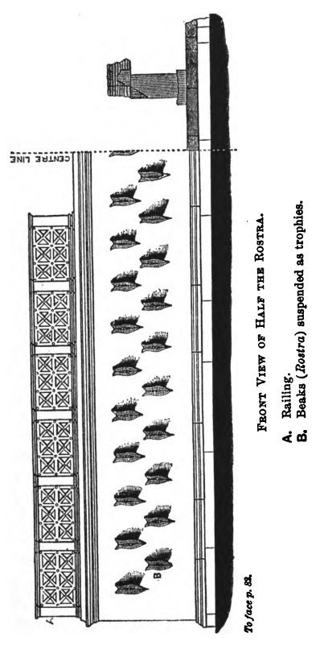

### XX.

**59.** Reliquum est, ut dē Q. Catulī auctōritāte et sententiā dīcendum esse videātur. Quī cum ex vōbīs quaereret, sī in ūnō Cn. Pompeiō omnia pōnerētis, sī quid eō factum esset, in quō spem essētis habitūrī, cēpit magnum suae virtūtis frūctum ac dignitātis, cum omnēs ūnā prope vōce in eō ipsō vōs spem habitūrōs esse dīxistis. Etenim tālis est vir, ut nūlla rēs tanta sit ac tam difficilis, quam ille nōn et cōnsiliō regere et integritāte tuērī et virtūte cōnficere possit. Sed in hōc ipsō ab eō vehementissimē dissentiō, quod, quō minus certa est hominum ac minus diūturna vīta, hōc magis rēs pūblica, dum per deōs immortālēs licet, fruī dēbet summī virī vītā atque virtūte.

**60.** At enim, ‘nē quid novī fīat contrā exempla atque īnstitūta maiōrum.’ Nōn dīcam hōc locō maiōrēs nostrōs
semper in pāce cōnsuētūdinī, in bellō ūtilitātī pāruisse, semper ad novōs cāsūs temporum novōrum cōnsiliōrum ratiōnēs accommodāsse; nōn dīcam duo bella maxima, Pūnicum atque Hispāniēnse, ab ūnō imperātōre esse cōnfecta duāsque urbēs potentissimās, quae huic imperiō maximē minitābantur, Karthāginem atque Numantiam, ab eōdem Scīpiōne esse dēlētās; nōn commemorābō nūper ita vōbīs patribusque vestrīs esse vīsum, ut in ūnō C. Mariō spēs imperī pōnerētur, ut īdem cum Iugurthā, īdem cum Cimbrīs, īdem cum Teutonīs bellum admiristrāret.

**61.** In ipsō Cn. Pompeiō, in quō novī cōnstituī nihil vult Q. Catulus, quam multa sint nova summā Q. Catulī voluntāte cōnstitūta, recordāminī.

### XXI.

Quid tam novum quam adulescentulum prīvātum exercitum difficilī reī pūblicae tempore cōnficere? Cōnfēcit. Huic praeesse ? Praefuit. Rem optimē ductū suō gerere? Gessit. Quid tam praeter cōnsuētūdinem quam hominī peradulescentī, cuius aetās ā senātōriō gradū longē abesset, imperium atque exercitum darī, Siciliam permittī atque Āfricam bellumque in eā prōvinciā administrandum? Fuit in hīs prōvinciīs singulārī innocentiā, gravitāte, virtūte; bellum in Āfricā maximum cōnfēcit, victōrem exercitum dēportāvit. Quid vērō tam inaudītam quam equitem Rōmānum triumphāre? At eam quoque rem populus Rōmānus nōn modo vīdit, sed omnium etiam studiō vīsendam et concelebrandam putāvit.

**62.** Quid tam inūsitātum, quam ut, cum duo cōnsulēs clārissimī fortissimīque essent, eques Rōmānus ad bellum maximum formīdolōsissimumque prō cōnsule mitterētur? Missus est. Quō quidem tempore cum esset nōn nēmō in senātū, quī dīceret nōn oportēre mittī hominem prīvātum prō cōnsule, L. Philippus dīxisse dīcitur nōn sē illum suā sententiā prō cōnsule, sed prō cōnsulibus mittere. Tanta in eō reī pūblicae bene gerendae spēs cōnstituēbātur, ut duōrum cōnsulum mūnus ūnīus adulēscentis virtūtī committerētur. Quid tam singulāre, quam ut ex senātūs cōnsultō lēgibus solūtus cōnsul ante fieret, quam ūllum alium magistrātum per lēgēs capere licuisset? Quid tam incrēdibile, quam ut iterum eques Rōmānus ex senātūs cōnsultō triumphāret? Quae in omnibus hominibus nova post hominum memoriam cōnstitūta sunt, ea tam multa nōn sunt quam haec, quae in hōc ūnō homine vidēmus.

**63.** Atque haec tot exempla tanta ac tam nova profecta sunt in eundem hominem ā Q. Catulī atque ā cēterōrum eiusdem dignitātis amplissimōrum hominum auctōritāte.

### XXII.

Quārē videant, nē sit perinīquum et nōn ferendum illōrum auctōritātem dē Cn. Pompeī dignitāte ā vōbīs comprobātam semper esse, vestrum ab illīs dē eōdem homine iūdicium populīque Rōmānī auctōritātem improbārī, praesertim cum iam suō iūre populus Rōmānus in hōc homine suam auctōritātem vel contrā omnēs, quī dissentiunt, possit dēfendere, proptereā quod, īsdem istīs reclāmantibus, vōs ūnum illum ex omnibus dēlēgistis, quem bellō praedōnum praepōnerētis. 64. Hōc sī vōs temere fēcistis et reī pūblicae parum cōnsuluistis, rēctē istī studia vestra suīs cōnsiliīs regere cōnantur; sīn autem vōs plūs tum in rē pūblicā vīdistis, vōs, eīs repugnantibus, per vōsmet ipsōs dignitātem huic imperiō, salūtem orbī terrārum attulistis, aliquandō istī prīncipēs et sibi et cēterīs populī Rōmānī ūniversī auctōritātī pārendum esse fateantur. Atque in hōc bellō Āsiāticō et rēgiō nōn sōlum mīlitāris illa virtūs, quae est in Cn. Pompeiō singulāris, sed aliae quoque virtūtēs animī magnae et multae requīruntur. Difficile est in Asiā, Ciliciā, Syriā rēgnīsque interiōrum nātiōnum ita versārī nostrum imperātōrem, ut nihil aliud nisi dē hoste ac dē laude cōgitet. Deinde, etiamsī quī sunt pudōre ac temperantiā moderatiōrēs, tamen eōs esse tālēs propter multitūdinem cupidōrum hominum nēmō arbitrātur.

**65.** Difficile est dictū, Quirītēs, quantō in odiō sīmus apud exterās nātiōnēs propter eōrum, quōs ad eās per hōs annōs cum imperiō mīsimus, libīdinēs et iniūriās. Quod enim fānum putātis in illīs terrīs nostrīs magistrātibus religiōsum, quam cīvitātem sānctam, quam domum satis clausam ac mūnītam fuisse? Urbēs iam locuplētēs et cōpiōsae requīruntur, quibus causa bellī propter dīripiendī cupiditātem īnferātur.

**66.** Libenter haec cōram cum Q. Catulō et Q. Hortēnsiō, summīs et clārissimīs virīs, disputārem; nōvērunt enim sociōrum vulnera, vident eōrum calamitātēs, querimōniās audiunt. Prō sociīs vōs contrā hostēs exercitum mittere putātis an hostium simulātiōne contrā sociōs atque amīcōs? Quae cīvitās est in Asiā, quae nōn modo imperātōris aut lēgātī, sed ūnīus tribūnī mīlitum animōs ac spīritūs capere possit?

### XXIII.

Quārē, etiamsī quem habētis, quī, collātīs signīs, exercitūs rēgiōs superāre posse videātur, tamen, nisi erit īdem, quī sē ā pecūniīs sociōrum, quī ab eōrum coniugibus ac līberīs, quī ab ōrnāmentīs fānōrum atque oppidōrum, quī ab aurō gazāque rēgiā manūs, oculōs, animum cohibēre possit, nōn erit idōneus, quī ad bellum Āsiāticum rēgiumque mittātur.

**67.** Ecquam putātis cīvitātem pācātam fuisse, quae locuplēs sit? Ecquam esse locuplētem, quae istīs pācāta esse videātur? Ōra maritima, Quirītēs, Cn. Pompeium nōn sōlum propter reī mīlitāris glōriam, sed etiam propter animī continentiam requīsīvit. Vidēbat enim imperātōrēs locuplētārī quotannīs pecūniā pūblicā praeter paucōs, neque eōs quicquam aliud assequī classium nōmine, nisi ut dētrīmentīs accipiendīs maiōre afficī turpitūdine vidērēmur. Nunc quā cupiditāte hominēs in prōvinciās et quibus iactūrīs, quibus condiciōnibus proficīscantur, ignōrant vidēlicet istī, quī ad ūnum dēferenda omnia esse nōn arbitrantur. Quasi vērō Cn. Pompeium nōn cum suīs virtūtibus, tuam etiam aliēnīs vitiīs magnum esse videāmus.

**68.** Quārē nōlīte dubitāre, quīn huic ūnī crēdātis omnia, quī inter tot annōs ūnus inventus sit, quem sociī in urbēs suās cum exercitū vēnisse gaudeant.

Quodsī auctōritātibus hanc causam, Quirītēs, cōnfīrmandam putātis, est vōbīs auctor vir bellōrum omnium maximārumque rērum perītissimus, P. Servīlius, cuius tantae rēs gestae terrā marīque exstitērunt, ut, cum dē bellō dēlīberētis, auctor vōbīs gravior esse nēmō dēbeat; est C. Cūriō, summīs vestrīs beneficiīs maximīsque rēbus gestīs, summō ingeniō et prūdentiā praeditus; est Cn. Lentulus, in quō omnēs prō amplissimīs vestrīs honōribus summum cōnsilium, summam gravitātem esse cognōvistis; est C. Cassius, integritāte, virtūte, cōnstantiā singulārī. Quārē vidēte num hōrum auctōritātibus illōrum ōrātiōnī quī dissentiunt, respondēre posse videāmur.

### XXIV. 

**69.** Quae cum ita sint, C. Mānīlī, prīmum istam tuam et lēgem et voluntātem et sententiam laudō vehementissimēque comprobō; deinde tē hortor, ut, auctōre populō Rōmānō, maneās in sententiā nēve cuiusquam vim aut minās pertimēscās. Prīmum in tē satis esse animī persevērantiaeque arbitror; deinde, cum tantam multitūdinem cum tantō studiō adesse videāmus, quantam iterum nunc in eōdem homine praeficiendō vidēmus, quid est, quod aut dē rē aut dē perficiendī facultāte dubitēmus? Ego autem, quicquid est in mē studī, cōnsilī, labōris, ingenī, quicquid hōc beneficiō populī Rōmānī atque hāc potestāte praetōriā, quicquid auctōritāte, fidē, cōnstantiā possum, id omne ad hanc rem cōnficiendam tibi et populō Rōmānō polliceor ac dēferō testorque omnēs deōs,

**70.** et eōs maximē, quī huic locō templōque praesident, quī omnium mentēs eōrum, quī ad rem pūblicam adeunt, maximē perspiciunt, mē hōc neque rogātū facere cūiusquam, neque quō Cn. Pompeī grātiam mihi per hanc causam conciliārī putem, neque quō mihi ex cuiusquam amplitūdine aut praesidia perīculīs aut adiumenta honōribus quaeram, proptereā quod perīcula facile, ut hominem praestāre oportet, innocentiā tēctī repellēmus, honōrem autem neque ab ūnō neque ex hōc locō, sed eādem illā nostrā labōriōsissimā ratiōne vītae, sī vestra voluntās feret, cōnsequēmur.

**71.** Quam ob rem, quicquid in hāc causā mihi susceptum est, Quirītēs, id ego omne mē reī pūblicae causā suscēpisse cōnfirmō, tantumque abest, ut aliquam mihi bonam grātiam quaesīsse videar, ut multās mē etiam simultātēs partim obscūrās, partim apertās intellegam mihi nōn necessāriās, vōbīs nōn inūtilēs suscēpisse. Sed ego mē hōc honōre praeditum, tantīs vestrīs beneficiīs affectum statuī, Quirītēs, vestram voluntātem et reī pūblicae dignitātem et salūtem prōvinciārum atque sociōrum meīs omnibus commodīs et ratiōnibus praeferre oportēre.

## Prō A. Licinīo Archīa poēta ōrātiō.

### I.

**1.** Sī quid est in mē ingenī, iūdicēs (quod sentiō quam sit exiguum), aut sī qua exercitātiō dīcendī, in quā mē nōn īnfitior mediocriter esse versātum, aut sī huiusce reī ratiō aliqua ab optimārum artium studiīs ac disciplīnā profecta, ā quā ego nūllum cōnfiteor aetātis meae tempus abhorruisse, eārum rērum omnium vel in prīmīs hīc A. Licinius frūctum ā mē repetere prope suō iūre dēbet. Nam, quoad longissimē potest mēns mea respicere spatium praeteritī temporis et pueritiae memoriam recordārī ultimam, inde ūsque repetēns hunc videō mihi prīncipem et ad suscipiendam et ad ingrediendam ratiōnem hōrum studiōrum exstitisse. Quodsī haec vōx, huius hortātū praeceptīsque cōnfōrmāta, nōnnūllīs aliquandō salūtī fuit, ā quō id accēpimus, quō cēterīs opitulārī et aliōs servāre possēmus, huic profectō ipsī, quantum est situm in nōbīs, et opem et salūtem ferre dēbēmus.

**2.** Ac nē quis ā nōbīs hōc ita dīcī forte mīrētur, quod alia quaedam in hōc facultās sit ingenī neque haec dīcendī ratiō aut disciplīna, nē nōs quidem huic ūnī studiō penitus umquam dēditī fuimus. Etenim omnēs artēs, quae ad hūmānitātem pertinent, habent quoddam commūne vinculum et quasi cognātiōne quādam inter sē continentur.

### II.

**8.** Sed nē cui vestrum mīrum esse videātur mē in quaestiōne lēgitimā et in iūdiciō pūblicō, cum rēs agātur apud praetōrem populī Rōmānī, lēctissimum virum, et apud sevērissimōs iūdicēs, tantō conventū hominum ac frequentiā, hōc ūtī genere dīcendī, quod nōn modo ā cōnsuētūdine iūdiciōrum, vērum etiam ā forēnsī sermōne abhorreat, quaesō ā vōbīs, ut in hāc causā mihi dētis hanc veniam, accommodātam huic reō, vōbīs, quem ad modum spērō, nōn molestam, ut mē prō summō poētā atque ērudītissimō homine dīcentem, hōc concursū hominum litterātissimōrum, hāc vestrā hūmānitāte, hōc denique praetōre exercente iūdicium, patiāminī dē studiīs hūmānitātis ac litterārum paulō loquī līberius et in eius modī persōnā, quae propter ōtium ac studium minimē in iūdiciīs perīculīsque tractāta est, ūtī prope novō quōdam et inūsitātō genere dīcendī.

**4.** Quod sī mihi ā vōbīs tribuī concēdīque sentiam, perficiam profectō, ut hunc A. Licinium nōn modo nōn sēgregandum, cum sit cīvis, ā numerō cīvium, vērum etiam, sī nōn esset, putētis ascīscendum fuisse.

### III.

Nam, ut prīmum ex puerīs excessit Archiās atque ab eīs artibus, quibus aetās puerīlis ad hūmānitātem īnfōrmārī solet, sē ad scrībendī studium contulit, prīmum Antiochēae (nam ibi nātus est locō nōbilī), celebrī quondam urbe et cōpiōsā atque ērudītissimīs hominibus līberālissimīsque studiīs affluentī, celeriter antecellere omnibus ingenī glōriā coepit. Post in cēterīs Asiae partibus cūnctāque Graeciā sīc eius adventūs celebrābantur, ut fāmam ingenī exspectātiō hominis, exspectātiōnem ipsīus adventus admīrātiōque superāret.

**5.** Erat Italia tum plēna Graecārum artium ac disciplīnārum, studiaque haec et in Latiō vehementius tum colēbantur quam nunc īsdem in oppidīs et hīc Rōmae propter tranquillitātem reī pūblicae nōn neglegēbantur. Itaque hunc et Tarentīnī et Rēgīnī et Neāpolitānī cīvitāte cēterīsque praemiīs dōnārunt, et omnēs, quī aliquid dē ingeniīs poterant iūdicāre, cognitiōne atque hospitiō dignum exīstimārunt. Hāc tantā celebritāte fāmae cum esset iam absentibus nōtus, Rōmam vēnit Mariō cōnsule et Catulō. Nactus est prīmum cōnsulēs eōs, quōrum alter rēs ad scrībendum maximās, alter cum rēs gestās, tum etiam studium atque aurēs adhibēre posset. Statim Lūcullī, cum praetextātus etiam tum Archiās esset, eum domum suam recēpērunt. Et erat hōc nōn sōlum ingenī ac litterārum, vērum etiam nātūrae atque virtūtis, ut domus, quae huius adulēscentiae prīma fāvit, eadem esset familiārissima senectūtī.

**6.** Erat temporibus illīs iūcundus Q. Metellō illī Numidicō et eius Piō fīliō, audiēbātur ā M. Aemiliō, vīvēbat cum Q. Catulō et patre et fīliō, ā L. Crassō colēbātur; Lūcullōs vērō et Drūsum et Octāviōs et Catōnem et tōtam Hortēnsiōrum domum dēvīnctam cōnsuētūdine cum tenēret, afficiēbātur summō honōre, quod eum nōn sōlum colēbant, quī aliquid percipere atque audīre studēbant, vērum etiam sī quī forte simulābant.

### IV.

Interim satis longō intervāllō, cum esset cum M. Lūcullō in Siciliam profectus et cum ex eā prōvinciā cum eōdem Lūcullō dēcēderet, vēnit Hēraclēam. Quae cum esset cīvitās aequissimō iūre ac foedere, ascrībī sē in eam cīvitātem voluit idque, cum ipse per sē dignus putārētur, tum auctōritāte et grātiā Lūcullī ab Hēraclēēnsibus impetrāvit.

**7.** Data est cīvitās Silvānī lēge et Carbōnis: *Sī quī foederātīs cīvitātibus āscrīptī fuissent, sī tum, cum
lēx ferēbātur, in Italiā domicilium habuissent et sī sexāqintā diēbus apud praetōrem essent professī.* Cum hīc domicilium Rōmae multōs iam annōs habēret, professus est apud praetōrem, Q. Metellum, familiārissimum suum.

**8.** Sī nihil aliud nisi dē cīvitāte ac lēge dīcimus, nihil dīcō amplius; causa dicta est. Quid enim hōrum īnfirmārī, Grattī, potest? Hēraclēaene esse eum ascrīptum negābis? Adest vir summā auctōritāte et religiōne et fidē, M. Lūcullus; quī sē nōn opīnārī, sed scīre, nōn audīvisse, sed vīdisse, nōn interfuisse, sed ēgisse dīcit. Adsunt Hēraclēēnsēs lēgātī, nōbilissimī hominēs; huius iūdicī causā cum mandātīs et cum pūblicō testimōniō vēnērunt; quī hunc ascrīptum Hēraclēēnsem dīcunt. Hīc tū tabulās dēsīderās Hēraclēēnsium pūblicās, quās Italicō bellō incēnsō tabulāriō interīsse scīmus omnēs. Est rīdiculum ad ea, quae habēmus, nihil dīcere, quaerere, quae habēre nōn possumus, et dē hominum memoriā tacēre, litterārum memoriam flāgitāre, et, cum habeās amplissimī virī religiōnem, integerrimī mūnicipī iūs iūrandum fidemque, ea, quae dēprāvārī nūllō modō possunt, repudiāre, tabulās, quās īdem dīcis solēre corrumpī, dēsīderāre.

**9.** An domicilium Rōmae nōn habuit is, quī tot annīs ante cīvitātem datam sēdem omnium rērum ac fortūnārum suārum Rōmae collocāvit? An nōn est professus? Immō vērō eīs tabulīs professus, quae sōlae ex illā professiōne collēgiōque praetōrum obtinent pūblicārum tabulārum auctōritātem.

### V.

Nam, cum Appī tabulae neglegentius asservātae dīcerentur, Gabīnī, quamdiū incolumis fuit, levitās, post damnātiōnem calamitās omnem tabulārum fidem resignāsset, Metellus, homō sānctissimus modestissimusque omnium, tantā dīligentiā fuit, ut ad L. Lentulum praetōrem et ad iūdicēs vēnerit et ūnīus nōminis litūrā sē commōtum esse dīxerit. Hīs igitur in tabulīs nūllam litūram in nōmine A. Licinī vidētis.

**10.** Quae cum ita sint, quid est, quod dē eius cīvitāte dubitētis, praesertim cum aliīs quoque in cīvitātibus fuerit ascrīptus? Etenim, cum mediocribus multīs et aut nūllā aut humilī aliquā arte praeditīs grātuītō cīvitātem in Graeciā hominēs impertiēbant, Rēgīnōs crēdō aut Locrēnsēs aut Neāpolitānōs aut Tarentīnōs, quod scaenicīs artificibus largīrī solēbant, id huic summā ingenī praeditō glōriā nōluisse! Quid? Cēterī nōn modo post cīvitātem datam, sed etiam post lēgem Pāpiam aliquō modō in eōrum mūnicipiōrum tabulās irrēpsērunt ? Hīc, quī nē ūtitur quidem illīs, in quibus est scrīptus, quod semper sē Hēraclēēnsem esse voluit, reiciētur?

**11.** Cēnsūs nostrōs requīris. Scīlicet; est enim obscūrum proximīs cēnsōribus hunc cum clārissimō imperātōre, L. Lūcullō, apud exercitum fuisse; superiōribus cum eōdem quaestōre fuisse in Asiā; prīmīs, Iūliō et Crassō, nūllam populī partem esse cēnsam. Sed, quoniam cēnsus nōn iūs cīvitātis cōnfirmat ac tantum modo indicat eum, quī sit cēnsus, ita sē iam tum gessisse prō cīve, eīs temporibus, quibus tū crīmināris nē ipsīus quidem iūdiciō in cīvium Rōmānōrum iūre esse versātum, et testāmentum saepe fēcit nostrīs lēgibus et adiit hērēditātēs cīvium Rōmānōrum et in beneficiīs ad aerārium dēlātus est ā L. Locullō, prō cōnsule.

### VI.

Quaere argūmenta, sī quae potes; numquam enim hīc neque suō neque amīcōrum iūdiciō revincētur.

**12.** Quaerēs ā nōbīs, Grattī, cūr tantō opere hōc homine dēlectēmur. Quia suppeditat nōbīs, ubi et animus ex hōc forēnsī strepitū reficiātur et aurēs convīciō dēfessae conquiēscant. An tū exīstimās aut suppetere nōbīs posse, quod cotīdiē dīcāmus in tantā varietāte rērum, nisi animōs nostrōs doctrīnā excolāmus, aut ferre animōs tantam posse contentiōnem, nisi eōs doctrīnā eādem relaxēmus? Ego vērō fateor mē hīs studiīs esse dēditum. Cēterōs pudeat, sī quī ita sē litterīs abdidērunt, ut nihil possint ex eīs neque ad commūnem afferre frūctum neque in aspectum lūcemque prōferre; mē autem quid pudeat, quī tot annōs ita vīvō, iūdicēs, ut ā nūllīus umquam mē tempore aut commodō aut ōtium meum abstrāxerit aut voluptās āvocārit aut dēnique somnus retardārit?

**13.** Quārē quis tandem mē reprehendat, aut quis mihi iūre suscēnseat, sī, quantum cēterīs ad suās rēs obeundās, quantum ad fēstōs diēs lūdōrum celebrandōs, quantum ad aliās voluptātēs et ad ipsam requiem animī et corporis concēditur temporum, quantum aliī tribuunt tempestīvīs convīviīs, quantum dēnique alveolō, quantum pilae, tantum mihi egomet ad haec studia recolenda sūmpserō? Atque hōc eō mihi concēdendum est magis, quod ex hīs studiīs haec quoque crēscit ōrātiō et facultās, quae, quantacumque in mē est, numquam amīcōrum perīculīs dēfuit. Quae sī cui levior vidētur, illa quidem certē, quae summa sunt, ex quō fonte hauriam, sentiō. 14. Nam, nisi multōrum praeceptīs multīsque litterīs mihi ab adulēscentiā suāsissem nihil esse in vītā magnō opere expetendum nisi laudem atque honestātem, in eā autem persequendā omnēs cruciātūs corporis, omnia perīcula mortis atque exsilī parvī esse dūcenda, numquam mē prō salūte vestrā in tot ac tantās dīmicātiōnēs atque in hōs prōflīgātōrum hominum cotīdiānōs impetūs obiēcissem. Sed plēnī omnēs sunt librī, plēnae sapientium vōcēs, plēna exemplōrum vetustās; quae iacērent in tenebrīs omnia, nisi litterārum lūmen accēderet.  Quam multās nōbīs imāginēs nōn sōlum ad intuendum, vērum etiam ad imitandum fortissimōrum virōrum expressās scrīptōrēs et Graecī et Latīnī relīquērunt! Quās ego mihi semper in administrandā rē pūblicā prōpōnēns, animum et mentem meam ipsā cōgitātiōne hominum excellentium cōnfōrmābam.

### VII.

**15.** Quaeret quispiam: ‘Quid? Illī ipsī summī virī, quōrum virtūtēs litterīs prōditae sunt, istāne doctrīnā, quam tū effers laudibus, ērudītī fuērunt?’ Difficile est hōc dē omnibus cōnfirmāre, sed tamen est certum, quid respondeam. Ego multōs hominēs excellentī animō ac virtūte fuisse sine doctrīnā et nātūrae ipsīus habitū prope dīvīnō per sē ipsōs et moderātōs et gravēs exstitisse fateor; etiam illud adiungō, saepius ad laudem atque virtūtem nātūram sine doctrīnā quam sine nātūrā valuisse doctrīnam. Atque īdem ego hōc contendō, cum ad nātūram eximiam et illūstrem accesserit ratiō quaedam cōnfōrmātiōque doctrīnae, tum illud nesciō quid praeclārum ac singulāre solēre exsistere.

**16.** Ex hōc esse hunc numerō, quem patrēs nostrī vīdērunt, dīvīnum hominem, Āfricānum, ex hōc C. Laelium, L. Fūrium, moderatissimōs hominēs et continentissimōs, ex hōc fortissimum virum et illīs temporibus doctissimum, M. Catōnem illum senem; quī profectō sī nihil ad percipiendam colendamque virtūtem litterīs adiuvārentur, numquam sē ad eārum studium contulissent. Quodsī nōn hīc tantus frūctus ostenderētur, et sī ex hīs studiīs dēlectātiō sōla peterētur, tamen, ut opīnor, hanc animī remissiōnem hūmānissimam ac līberālissimam iūdicārētis. Nam cēterae neque temporum sunt neque aetātum omnium neque locōrum; at haec studia adulēscentiam alunt, senectūtem oblectant, secundās rēs ōrnant, adversīs perfugium ac sōlācium praebent, dēlectant domī, nōn impediunt forīs, pernoctant nōbīscum, peregrīnantur, rūsticantur.

**17.** Quodsī ipsī haec neque attingere neque sēnsū nostrō gustāre possēmus, tamen ea mīrārī dēbērēmus, etiam cum in aliīs vidērēmus.

### VIII.

Quis nostrum tam animō agrestī ac dūrō fuit, ut Rōscī morte nūper nōn commovērētur? Quī cum esset senex mortuus, tamen propter excellentem artem ac venustātem vidēbātur omnīnō morī nōn dēbuisse. Ergō ille corporis mōtū tantum amōrem sibi conciliārat ā nōbīs omnibus; nōs animōrum incrēdibilēs mōtūs celeritātemque ingeniōrum neglegēmus?

**18.** Quotiēns ego hunc Archiam vīdī, iūdicēs (ūtar enim vestrā benignitāte, quoniam mē in hōc novō genere dīcendī tam dīligenter attenditis), quotiēns ego hunc vīdī, cum litteram scrīpsisset nūllam, magnum numerum optimōrum versuum dē eīs ipsīs rēbus, quae tum agerentur, dīcere ex tempore! Quotiēns revocātum eandem rem dīcere, commūtātīs verbīs atque sententiīs! Quae vērō accūrātē cōgitāteque scrīpsisset, ea sīc vīdī probārī, ut ad veterum scrīptōrum laudem pervenīret. Hunc ego nōn dīligam, nōn admīrer, nōn omnī ratiōne dēfendendum putem? Atque sīc ā summīs hominibus ērudītissimīsque accēpimus, cēterārum rērum studia ex doctrīnā et praeceptīs et arte cōnstāre, poētam nātūrā ipsā valēre et mentis vīribus excitārī et quasi dīvīnō quōdam spīritū īnflārī. Quārē suō iūre noster ille Ennius ‘sānctōs’ appellat poētās, quod quasi deōrum aliquō dōnō atque mūnere commendātī nōbīs esse videantur.

**19.** Sit igitur, iūdicēs, sānctum apud vōs, hūmānissimōs hominēs, hōc poētae nōmen, quod nūlla umquam barbaria violāvit. Saxa et sōlitūdinēs vōcī respondent, bēstiae saepe immānēs cantū flectuntur atque cōnsistunt; nōs īnstitūtī: rēbus optimīs nōn poētārum vōce moveāmur? Homērum Colophōniī cīvem esse dīcunt suum, Chiī suum vindicant, Salamīniī repetunt, Smyrnaeī vērō suum esse cōnfirmant itaque etiam dēlūbrum eius in oppidō dēdicāvērunt; permultī aliī praetereā pugnant inter sē atque contendunt.

### IX.

Ergō illī aliēnum, quia poēta fuit, post mortem etiam expetunt; nōs hunc vīvum, quī et voluntāte et lēgibus noster est, repudiābimus, praesertim cum omne ōlim studium atque omne ingenium contulerit Archiās ad populī Rōmānī glōriam laudemque celebrandam? Nam et Cimbricās rēs adulēscēns attigit et ipsī illī C. Mariō, quī dūrior ad haec studia vidēbātur, iūcundus fuit.

**20.** Neque enim quisquam est tam āversus ā Mūsīs, quī nōn mandārī versibus aeternum suōrum labōrum facile praecōnium patiātur. Themistoclem illum, summum Athēnīs virum, dīxisse aiunt, cum ex eō quaererētur, quod acroāma aut cuius vōcem libentissimē audīret: eius, ā quō sua virtūs optimē praedicārētur. Itaque ille Marius item eximiē L. Plōtium dīlēxit, cuius ingeniō putābat ea, quae gesserat, posse celebrārī.

**21.** Mithridāticum vērō bellum, magnum atque difficile et in multā varietāte terrā marīque versātum, tōtum ab hōc expressum est; quī librī nōn modo L. Lūcullum, fortissimum et clārissimum virum, vērum etiam populī Rōmānī nōmen illūstrant. Populus enim Rōmānus aperuit, Lūcullō imperante, Pontum et rēgiīs quondam opibus et ipsā nātūrā et regiōne vāllātum; populī Rōmānī exercitus, eōdem duce, nōn maximā manū innumerābilīs Armeniōrum cōpiās fūdit; populī Rōmānī laus est urbem amīcissimam Cyricēnōrum eiusdem cōnsiliō ex omnī impetū rēgiō atque tōtīus bellī ōre ac faucibus ēreptam esse atque servātam; nostra semper ferētur et praedicābitur, L. Lūcullō dīmicante, cum, interfectīs ducibus, dēpressa hostium classis est, incrēdibilis apud Tenedum pugnā illa nāvālis; nostra sunt tropaea, nostra monumenta, nostrī triumphī. Quae quōrum ingeniīs efferuntur, ab eīs populī Rōmānī fāma celebrātur.

**22.** Cārus fuit Āfricānō superiōrī noster Ennius, itaque etiam in sepulcrō Scīpiōnum putātur is esse cōnstitūtus ex marmore; cuius laudibus certē nōn sōlum ipse, quī laudātur, sed etiam populī Rōmānī nōmen ōrnātur. In caelum huius proavus Catō tollitur; magnus honōs populī Rōmānī rēbus adiungitur. Omnēs dēnique illī Māximī, Mārcellī, Fulviī nōn sine commūnī omnium nostrum laude decorantur.

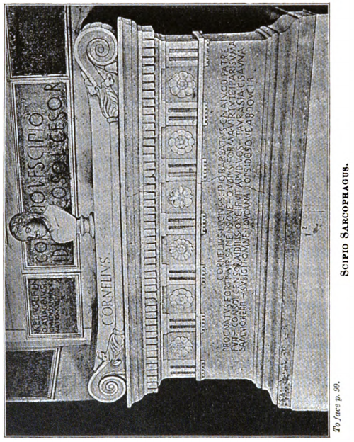

### X.

Ergō illum, quī haec fēcerat, Rudīnum hominem maiōrēs nostrī in cīvitātem recēpērunt; nōs hunc Hēraclēēnsem multīs cīvitātibus expetītum, in hāc autem lēgibus cōnstitūtum dē nostrā cīvitāte ēiciēmus?

**23.** Nam sī quis minōrem glōriae frūctum putat ex Graecīs versibus percipī quam ex Latīnīs, vehementer errat, proptereā quod Graeca leguntur in omnibus ferē gentibus, Latīna suīs fīnibus exiguīs sānē continentur. Quārē, sī rēs eae, quās gessimus, orbis terrae regiōnibus dēfīniuntur, cupere dēbēmus, quō manuum nostrārum tēla pervēnerint, eōdem glōriam fāmamque penetrāre, quod cum ipsīs populīs, dē quōrum rēbus scrībitur, haec ampla sunt, tum eīs certē, quī dē vītā glōriae causā dīmicant, hōc maximum et perīculōrum incitāmentum est et labōrum.

**24.** Quam multōs scrīptōrēs rērum suārum magnus ille Alexander sēcum habuisse dīcitur! Atque is tamen, cum in Sīgēō ad Achillis tumulum astitisset: ‘Ō fortūnāte’, inquit, ‘adulēscēns, quī tuae virtūtis Homērum praecōnem invēnerīs!” Et vērē. Nam, nisi Īlias illa exstitisset, īdem tumulus, quī corpus eius contēxerat, nōmen etiam obruisset. Quid ? Noster hīc Magnus, quī cum virtūte fortūnam adaequāvit, nōnne Theophanem Mytilēnaeum, scrīptōrem rērum suārum, in cōntiōne mīlitum cīvitāte dōnāvit, et nostrī illī fortēs virī, sed rūsticī ac mīlitēs, dulcēdine quādam glōriae commōtī, quasi participēs eiusdem laudis, magnō illud clāmōre approbāvērunt?

**25.** Itaque, crēdō, sī cīvis Rōmānus Archiās lēgibus nōn esset, ut ab aliquō imperātōre cīvitāte dōnārētur, perficere nōn potuit. Sulla cum Hispānōs et Gallōs dōnāret, crēdō, hunc petentem repudiāsset; quem nōs in cōntiōne vīdimus, cum eī libellum malus poēta dē populō subiēcisset, quod epigramma in eum fēcisset tantum modo alternīs versibus longiusculīs, statim ex eīs rēbus, quās tum vēndēbat, iubēre eī praemium tribuī, sed eā condiciōne, nē quid posteā scrīberet. Quī sēdulitātem malī poētae dūxerit aliquō tamen praemiō dignam, huius ingenium et virtūtem in scrībendō et cōpiam nōn expetīsset?

**26.** Quid? Ā Q. Metellō Piō, familiārissimō suō, quī cīvitāte multōs dōnāvit, neque per sē neque per Lūcullōs impetrāvisset? Quī praesertim ūsque eō dē suīs rēbus scrībī cuperet, ut etiam Cordubae nātīs poētīs pingue quiddam sonantibus atque peregrīnum tamen aurēs suās dēderet.

### XI.

Neque enim est hōc dissimulandum, quod obscūrārī nōn potest, sed prae nōbīs ferendum: Trahimur omnēs studiō laudis, et optimus quisque maximē glōriā dūcitur. Ipsī illī philosophī etiam in eīs libellīs, quōs dē contemnendā glōriā scrībunt, nōmen suum īnscrībunt; in eō ipsō, in quō praedicātiōnem nōbilitātemque dēspiciunt, praedicārī dē sē ac nōminārī volunt.

**27.** Decimus quidem Brūtus, summus vir et imperātor, Accī, amīcissimī suī, carminibus templōrum ac monumentōrum aditūs exōrnāvit suōrum. Iam vērō ille, quī cum Aetōlīs, Enniō comite, bellāvit, Fulvius nōn dubitāvit Mārtis manubiās Mūsīs cōnsecrāre. Quārē, in quā urbe imperātōrēssprope armātī poētārum nōmen et Mūsārum dēlūbra coluērunt, in eā nōn dēbent togātī iūdicēs ā Mūsārum honōre et ā poētārum salūte abhorrēre.

**28.** Atque ut id libentius faciātis, iam mē vōbīs, iūdicēs, indicābō et dē meō quōdam amōre glōriae, nimis ācrī fortasse, vērum tamen honestō, vōbīs cōnfitēbor. Nam, quās rēs nōs in cōnsulātū nostrō vōbīscum simul prō salūte huius urbis atque imperī et prō vītā cīvium prōque ūniversā rē pūblicā gessimus, attigit hīc versibus atque incohāvit. Quibus audītīs, quod mihi magna rēs et iūcunda vīsa est, hunc ad perficiendum adhortātus sum.

Nūllam enim virtūs aliam mercēdem labōrum perīculōrumque dēsīderat praeter hanc laudis et glōriae; quā quidem dētractā, iūdicēs, quid est, quod in hōc tam exiguō vītae curriculō et tam brevī tantīs nōs in labōribus exerceāmus?

**29.** Certē, sī nihil animus praesentīret in posterum, et sī, quibus regiōnibus vītae spatium circumscrīptum est, eīsdem omnēs cōgitātiōnēs termināret suās, nec tantīs sē labōribus frangeret neque tot cūrīs vigiliīsque angerētur nec totiēns dē ipsā vītā dīmicāret. Nunc īnsidet quaedam in optimō quōque virtūs, quae noctēs ac diēs animum glōriae stimulīs concitat atque admonet nōn cum vītae tempore esse dīmittendam commemorātiōnem nōminis nostrī, sed cum omnī posteritāte adaequandam.

### XII.

**30.** An vērō tam parvī animī videāmur esse omnēs, quī in rē pūblicā atque in hīs vītae perīculīs labōribusque versāmur, ut, cum ūsque ad extrēmum spatium nūllum tranquillum atque ōtiōsum spīritum dūxerīmus, nōbīscum simul moritūra omnia arbitrēmur? An statuās et imāginēs, nōn animōrum simulācra, sed corporum, studiōsē multī summī hominēs relīquērunt; cōnsiliōrum relinquere ac virtūtum nostrārum effigiem nōnne multō mālle dēbēmus, summīs ingeniīs expressam et polītam? Ego vērō omnia, quae gerēbam, iam tum in gerendō spargere mē ac dissēmināre arbitrābar in orbis terrae memoriam sempiternam. Haec vērō sīve ā meō sēnsū post mortem āfutūra est, sīve, ut sapientissimī hominēs putāvērunt, ad aliquam animī meī partem pertinēbit, nunc quidem certē cōgitātiōne quādam spēque dēlector.

**31.** Quārē cōnservāte, iūdicēs, hominem pudōre eō, quem amīcōrum vidētis comprobārī cum dignitāte tum etiam vetustāte, ingeniō autem tantō, quantum id convenit exīstimārī, quod summōrum hominum ingeniīs expetītum esse videātis, causā vērō eius modī, quae beneficiō lēgis, auctōritāte mūnicipī, testimōniō Lūcullī, tabulīs Metellī comprobētur. Quae cum ita sint, petimus ā vōbīs, iūdicēs, sī qua nōn modo hūmāna, vērum etiam dīvīna in tantīs ingeniīs commendātiō dēbet esse, ut eum, quī vōs, quī vestrōs imperātōrēs, quī populī Rōmānī rēs gestās semper ōrnāvit, quī etiam hīs recentibus nostrīs vestrīsque domesticīs perīculīs aeternum sē testimōnium laudis datūrum esse profitētur estque ex eō numerō, quī semper apud omnēs sānctī sunt habitī itaque dictī, sīc in vestram accipiātis fidem, ut hūmānitāte vestrā levātus potius quam acerbitāte violātus esse videātur.

32. Quae dē causā prō meā cōnsuētūdine breviter simpliciterque dīxī, iūdicēs, ea cōnfīdō probāta esse omnibus; quae ā forēnsī aliēna iūdiciālīque cōnsuētūdine et dē hominis ingeniō et commūniter dē ipsō studiō locūtus sum, ea, iūdicēs, ā vōbīs spērō esse in bonam partem accepta; ab eō, quī iūdicium exercet, certō sciō.

## Prō M. Mārcellō ōrātiō.

### I.

**1.** Diūturnī silentī, patrēs cōnscrīptī, quō eram hīs temporibus ūsus nōn timōre aliquō, sed partim dolōre, partim verēcundiā, fīnem hodiernus diēs attulit īdemque initium, quae vellem quaeque sentīrem, meō prīstinō mōre dīcendī. Tantam enim mānsuētūdinem, tam inūsitātam inaudītamque clēmentiam, tantum in summā potestāte rērum omnium modum, tam dēnique incrēdibilem sapientiam ac paene dīvīnam tacitus praeterīre nūllō modō possum. 

**2.** M. enim Mārcellō vōbīs, patrēs cōnscrīptī, reīque pūblicae redditō, nōn illīus sōlum, sed etiam meam vōcem et auctōritātem et vōbīs et reī pūblicae cōnservātam ac restitūtam putō. Dolēbam enim, patrēs cōnscrīptī, et vehementer angēbar virum tālem, cum in eādem causā in quā ego fuisset, nōn in eādem esse fortūnā nec mihi persuādēre poteram nec fās esse dūcēbam versārī mē in nostrō vetere curriculō, illō aemulō atque imitātōre studiōrum ac labōrum meōrum quasi quōdam sociō ā mē et comite distractō. Ergō et mihi meae prīstinae vītae cōnsuētūdinem, C. Caesar, interclūsam aperuistī et hīs omnibus ad bene dē omnī rē pūblicā spērandum quasi signum aliquod sustulistī.

**3.** Intellēctum est enim mihi quidem in multīs et maximē in mē ipsō, sed paulō ante omnibus, cum M. Mārcellum senātuī reīque pūblicae concessistī, commemorātīs praesertim offēnsiōnibus, tē auctōritātem huius ōrdinis dignitātemque reī pūblicae tuīs vel dolōribus vel suspīciōnibus anteferre. Ille quidem frūctum omnis ante āctae vītae hodiernō diē maximum cēpit cum summō cōnsēnsū senātūs, tum iūdiciō tuō gravissimō et maximō. Ex quō profectō intellegis, quanta in datō beneficiō sit laus, cum in acceptō sit tanta glōria. Est vērō fortūnātus ille, cuius ex salūte nōn minor paene ad omnēs, quam ad ipsum ventūra sit, laetitia pervēnerit;

**4.** quod quidem eī meritō atque optimō iūre contigit. Quis enim est illō aut nōbilitāte aut probitāte aut optimārum artium studiō aut innocentiā aut ūllō laudis genere praestantior?

### II.

Nūllīus tantum flūmen est ingenī, nūllīus dīcendī aut scrībendī tanta vīs, tanta cōpia, quae, nōn dīcam exōrnāre, sed ēnārrāre, C. Caesar, rēs tuās gestās possit. Tamen affirmō, et hōc pāce dīcam tuā, nūllam in hīs esse laudem ampliōrem quam eam, quam hodiernō diē cōnsecūtus es.

**5.** Soleō saepe ante oculōs pōnere idque libenter crēbrīs ūsūrpāre sermōnibus, omnīs nostrōrum imperātōrum, omnīs exterārum gentium potentissimōrumque populōrum, omnīs clārissimōrum rēgum rēs gestās cum tuīs nec contentiōnum magnitūdine nec numerō proeliōrum nec varietāte regiōnum nec celeritāte cōnficiendī nec dissimilitūdine bellōrum posse cōnferrī, nec vērō disiūnctissimās terrās citius passibus cuiusquam potuisse peragrārī, quam tuīs, nōn dīcam cursibus, sed victōriīs lūstrātae sunt.

**6.** Quae quidem ego nisi ita magna esse fatear, ut ea vix cuiusquam mēns aut cōgitātiō capere possit, āmēns sim; sed tamen sunt alia maiōra. Nam bellicās laudēs solent quīdam extenuāre verbīs eāsque dētrahere ducibus, commūnicāre cum multīs, nē propriae sint imperātōrum. Et certē in armīs mīlitum virtūs, locōrum opportūnitās, auxilia sociōrum, classēs, commeātūs multum iuvant, maximam vērō partem quasi suō iūre Fortūna sibi vindicat et, quicquid prospere gestum est, id paene omne dūcit suum.

**7.** At vērō huius glōriae, C. Caesar, quam es paulō ante adeptus, socium habēs nēminem; tōtum hōc, quantumcumque est, quod certē maximum est, tōtum est, inquam, tuum. Nihil sibi ex istā laude centuriō, nihil praefectus, nihil cohors, nihil turma dēcerpit; quīn etiam illa ipsa rērum hūmānārum domina, Fortūna, in istīus societātem glōriae sē nōn offert, tibi cēdit, tuam esse tōtam et propriam fatētur. Numquam enim temeritās cum sapientiā commiscētur, neque ad cōnsilium cāsus admittitur.

### III.

**8.** Domuistī gentēs immānitāte barbarās, multitūdine innumerābilēs, locīs īnfīnītās, omnī cōpiārum genere abundantēs; sed tamen ea vīcistī, quae et nātūram et condiciōnem, ut vincī possent, habēbant. Nūlla est enim tanta vīs, quae nōn ferrō et vīribus dēbilitārī frangīque possit. Animum vincere, īrācundiam cohibēre, victōriae temperāre, adversārium nōbilitāte, ingeniō, virtūte praestantem nōn modo extollere iacentem, sed etiam amplificāre eius prīstinam dignitātem, haec quī facit, nōn ego eum cum summīs virīs comparō, sed simillimum deō iūdicō.

**9.** Itaque, C. Caesar, bellicae tuae laudēs celebrābuntur illae quidem nōn sōlum nostrīs, sed paene omnium gentium litterīs atque linguīs, nec ūlla umquam aetās dē tuīs laudibus conticēscet; sed tamen eius modī rēs nesciō quō modō, etiam cum leguntur, obstrepī clāmōre mīlitum videntur et tubārum sonō. At vērō cum aliquid clēmenter, mānsuēte, iūste, moderāte, sapienter factum, in īrācundiā praesertim, quae est inimīca cōnsiliō, et in victōriā, quae nātūrā īnsolēns et superba est, audīmus aut legimus, quō studiō incendimur, nōn modo in gestīs rēbus, sed etiam in fīctīs, ut eōs saepe, quōs numquam vīdimus, dīligāmus!

**10.** Tē vērō, quem praesentem intuēmur, cuius mentem sēnsūsque et ōs cernimus, ut, quicquid bellī fortūna reliquum reī pūblicae fēcerit, id esse salvum velīs, quibus laudibus efferēmus, quibus studiīs prōsequēmur, quā benevolentiā complectēmur! Parietēs medius fīdius, ut mihi vidētur, huius Cūriae tibi grātiās agere gestiunt, quod brevī tempore futūra sit illa auctōritās in hīs maiōrum suōrum et suīs sēdibus.

### IV.

Equidem cum C. Mārcellī, virī optimī et commemorābilī pietāte praeditī, lacrimās modo vōbīscum vidērem, omnium Mārcellōrum meum pectus memoria offūdit, quibus tū etiam mortuīs, M. Mārcellō cōnservātō, dignitātem suam reddidistī nōbilissimamque familiam iam ad paucōs redāctam paene ab interitū vindicāstī.

**11.** Hunc tū igitur diem tuīs maximīs et innumerābilibus grātulātiōnibus iūre antepōnēs. Haec enim rēs ūnīus est propria C. Caesaris; cēterae duce tē gestae magnae illae quidem, sed tamen multō magnōque comitātū. Huius autem reī tū īdem es et dux et comes; quae quidem tanta est, ut tropaeīs et monumentīs tuīs allātūra fīnem sit aetās (nihil est enim opere et manū factum, quod nōn aliquandō cōnficiat et cōnsūmat vetustās);

**12.** at haec tua iūstitia et lēnitās animī flōrēscit cotīdiē magis, ita ut, quantum tuīs operibus diūturnitās dētrahet, tantum afferat laudibus. Et cēterōs quidem omnēs victōrēs bellōrum cīvīlium iam ante aequitāte et misericordiā vīcerās; hodiernō vērō diē tē ipsum vīcistī. Vereor, ut hōc, quod dīcam, perinde intellegī possit audītum, atque ipse cōgitāns sentiō: Ipsam victōriam vīcisse vidēris, cum ea, quae illa erat adepta, victīs remīsistī. Nam cum ipsīus victōriae condiciōne omnēs victī occidissēmus, clēmentiae tuae iūdiciō cōnservātī sumus. Rēctē igitur ūnus invictus, ā quō etiam ipsīus victōriae condiciō vīsque dēvicta est.

### V.

**13.** Atque hōc C. Caesaris iūdicium, patrēs cōnscrīptī, quam lātē pateat, attendite. Omnēs enim, quī ad illa arma fātō sumus nesciō quō reī pūblicae miserō fūnestōque compulsī, etsī aliquā culpā tenēmur errōris hūmānī, scelere certē līberātī sumus. Nam, cum M. Mārcellum, dēprecantibus vōbīs, reī pūblicae cōnservāvit, mē et mihi et item reī pūblicae, nūllō dēprecante, reliquōs amplissimōs virōs et sibi ipsōs et patriae reddidit, quōrum et frequentiam et dignitātem hōc ipsō in cōnsessū vidētis, nōn ille hostēs indūxit in Cūriam, sed iūdicāvit ā plērīsque ignōrātiōne potius et falsō atque inānī metū quam cupiditāte aut crūdēlitāte bellum esse susceptum.

**14.** Quō quidem in bellō semper dē pāce audiendum putāvī semperque doluī nōn modo pācem, sed etiam ōrātiōnem cīvium pācem flāgitantium repudiārī. Neque enim ego illa nec ūlla umquam secūtus sum arma cīvīlia, semperque mea cōnsilia pācis et togae socia, nōn bellī atque armōrum fuērunt. Hominem sum secūtus prīvātō officiō, nōn pūblicō, tantumque apud mē grātī animī fidēlis memoria valuit, ut (nūllā nōn modo cupiditāte, sed nē spē quidem) prūdēns et sciēns tamquam ad interitum ruerem voluntārium.

**15.** Quod quidem meum cōnsilium minimē obscūrum fuit. Nam et in hōc ōrdine, integrā rē, multa dē pāce dīxī et in ipsō bellō eadem etiam cum capitis meī perīculō sēnsī. Ex quō nēmō iam erit tam iniūstus exīstimātor rērum, quī dubitet, quae Caesaris dē bellō voluntās fuerit, cum pācis auctōrēs cōnservandōs statim cēnsuerit, cēterīs fuerit īrātior. Atque id minus mīrum fortasse tum, cum esset incertus exitus et anceps fortūna bellī; quī vērō victor pācis auctōrēs dīligit, is profectō dēclārat sē māluisse nōn dīmicāre quam vincere.

### VI.

**16.** Atque huius quidem reī M. Mārcellō sum testis. Nostrī enim sēnsūs ut in pāce semper, sīc tum etiam in bellō congruēbant. Quotiēns ego eum et quantō cum dolōre vīdī cum īnsolentiam certōrum hominum, tum etiam ipsīus victōriae ferōcitātem extimēscentem! Quō grātior tua līberālitās, C. Caesar, nōbīs, quī illa vīdimus, dēbet esse. Nōn enim iam causae sunt inter sē, sed victōriae comparandae.

**17.** Vīdimus tuam victōriam proeliōrum exitū terminātam, gladium vāgīnā vacuum in urbe nōn vīdimus. Quōs āmīsimus cīvēs, eōs Mārtis vīs perculit, nōn īra victōriae, ut dubitāre dēbeat nēmō, quīn multōs, sī fierī posset, C. Caesar ab īnferīs excitāret, quoniam ex eādem aciē cōnservat, quōs potest. Alterius vērō partis nihil amplius dīcam quam, id quod omnēs verēbāmur, nimis īrācundam futūram fuisse victōriam.

**18.** Quīdam enim nōn modo armātīs, sed interdum etiam ōtiōsīs minābantur nec, quid quisque sēnsisset, sed ubi fuisset, cōgitandum esse dīcēbant, ut mihi quidem videantur dī immortālēs, etiamsī poenās ā populō Rōmānō ob aliquod dēlictum expetīvērunt, quī cīvīle bellum tantum et tam lūctuōsum excitāvērunt, vel plācātī iam vel satiātī aliquandō omnem spem salūtis ad clēmentiam victōris et sapientiam contulisse.

**19.** Quārē gaudē tuō istō tam excellentī bonō et fruere cum fortūnā et glōriā, tum etiam nātūrā et mōribus tuīs, ex quō quidem maximus est frūctus iūcunditāsque sapientī. Cētera cum tua recordābere, etsī persaepe virtūtī, tamen plērumque fēlīcitātī tuae grātulābere; dē nōbīs, quōs in rē pūblicā tēcum simul esse voluistī, quotiēns cōgitābis, totiēns dē maximīs tuīs beneficiīs, totiēns dē incrēdibilī līberālitāte, totiēns dē singulārī sapientiā tuā cōgitābis; quae nōn modo summa bona, sed nīmīrum audēbō vel sōla dīcere. Tantus est enim splendor in laude vērā, tanta in magnitūdine animī et cōnsilī dignitās, ut haec ā Virtūte dōnāta, cētera ā Fortūnā commodāta esse videantur.

**20.** Nōlī igitur in cōnservandīs bonīs virīs dēfatīgārī, nōn cupiditāte praesertim aliquā aut prāvitāte lāpsīs, sed opīniōne officī stultā fortasse, certē nōn improbā, et speciē quādam reī pūblicae. Nōn enim tua ūlla culpa est, sī tē aliquī timuērunt; contrāque summa laus, quod minimē timendum fuisse sēnsērunt.

### VII.

**21.** Nunc veniō ad gravissimam querēllam et atrōcissimam suspīciōnem tuam, quae nōn tibi ipsī magis quam cum omnibus cīvibus, tam maximē nōbīs, quī ā tē cōnservātī sumus, prōvidenda est; quam etsī spērō falsam esse, tamen numquam extenuābō. Tua enim cautiō nostra cautiō est, ut, sī in alterutrō peccandum sit, mālim vidērī nimis timidus quam parum prūdēns. Sed quisnam est iste tam dēmēns? Dē tuīsne (tametsī quī magis sunt tuī, quam quibus tū salūtem īnspērantibus reddidistī)? An ex hōc numerō, quī ūnā tēcum fuērunt? Nōn est crēdibilis tantus in ūllō furor, ut, quō duce omnia summa sit adeptus, huius vītam nōn antepōnat suae. An, sī nihil tuī cōgitant sceleris, cavendum est, nē quid inimīcī? Quī? Omnēs enim, quī fuērunt, aut suā pertināciā vītam āmīsērunt aut tuā misericordiā retinuērunt, ut aut nūllī supersint dē inimīcīs aut, quī fuērunt, sint amīcissimī.

**22.** Sed tamen cum in animīs hominum tantae latebrae sint et tantī recessūs, augeāmus sānē suspīciōnem tuam; simul enim augēbimus dīligentiam. Nam quis est omnium tam ignārus rērum, tam rudis in rē pūblicā, tam nihil umquam nec dē suā nec dē commūnī salūte cōgitāns, quī nōn intellegat tuā salūte continērī suam et ex ūnīus tuā vītā pendēre omnium? Equidem dē tē diēs noctēsque, ut dēbeō, cōgitāns cāsūs dumtaxat hūmānōs et incertōs ēventūs valētūdinis et nātūrae commūnis fragilitātem, extimēscō, doleōque, cum rēs pūblica immortālis esse dēbeat, eam in ūnīus mortālis animā cōnsistere.

**23.** Sī vērō ad hūmānōs cāsūs incertōsque mōtūs valētūdinis sceleris etiam accēdit īnsidiārumque cōnsēnsiō, quem deum, sī cupiat, posse opitulārī reī pūblicae crēdāmus?

### VIII.

Omnia sunt excitanda tibi, C. Caesar, ūnī, quae iacēre sentīs, bellī ipsīus impetū, quod necesse fuit, perculsa atque prōstrāta; cōnstituenda iūdicia, revocanda fidēs, comprimendae libīdinēs, prōpāganda subolēs; omnia, quae dīlāpsa iam difflūxērunt, sevērīs lēgibus vincienda sunt.

**24.** Nōn fuit recūsandum in tantō cīvīlī bellō, tantō animōrum ardōre et armōrum, quīn quassāta rēs pūblica, quīcumque bellī ēventus fuisset, multa perderet et ōrnāmenta dignitātis et praesidia stabilitātis suae, multaque uterque dux faceret armātus, quae īdem togātus fierī prohibuisset. Quae quidem tibi nunc omnia bellī vulnera sānanda sunt, quibus praeter tē medērī nēmō potest.

**25.** Itaque illam tuam praeclārissimam et sapientissimam vōcem invītus audīvī: ‘Satis diū vel nātūrae vīxī vel glōriae.’ Satis, sī ita vīs, fortasse nātūrae, addō etiam, sī placet, glōriae, at, quod maximum est, patriae certē parum. Quārē omitte istam, quaesō, doctōrum hominum in contemnendā morte prūdentiam; nōlī nostrō perīculō esse sapiēns. Saepe enim venit ad aurēs meās, tē idem istud nimis crēbrō dīcere, tibi satis tē vīxisse. Crēdō; sed tum id audīrem, sī tibi sōlī vīverēs aut sī tibi etiam sōlī nātus essēs. Omnium salūtem cīvium cūnctamque rem pūblicam rēs tuae gestae complexae sunt; tantum abes ā perfectiōne maximōrum operum, ut fundāmenta nōndum, quae cōgitās, iēcerīs. Hīc tū modum vītae tuae nōn salūte reī pūblicae, sed aequitāte animī dēfīniēs? Quid, sī istud nē glōriae quidem satis est? cuius tē esse avidissimum, quamvīs sīs sapiēns, nōn negābis.

**26.** ‘Parumne igitur’, inquiēs, ‘magna relinquēmus?’ Immō vērō aliīs quamvīs multīs satis, tibi ūnī parum. Quicquid est enim, quamvīs amplum sit, id est parum tum, cum est aliquid amplius. Quodsī rērum tuārum immortālium, C. Caesar, hīc exitus futūrus fuit, ut, dēvictīs adversāriīs, rem pūblicam in eō statū relinquerēs, in quō nunc est, vidē, quaesō, nē tua dīvīna virtūs admīrātiōnis plūs sit habitūra quam glōriae, sīquidem glōria est illūstris ac pervagāta magnōrum vel in suōs cīvēs vel in patriam vel in omne genus hominum fāma meritōrum.

### IX.

**27.** Haec igitur tibi reliqua pars est, hīc restat āctus, in hōc ēlabōrandum est, ut rem pūblicam cōnstituās, eāque tū in prīmīs summā tranquillitāte et ōtiō perfruāre; tum tē, sī volēs, cum et patriae, quod dēbēs, solveris et nātūram ipsam explēveris satietāte vīvendī, satis diū vīxisse dīcitō. Quid enim est omnīnō hōc ipsum ‘diū,’ in quō est aliquid extrēmum? Quod cum vēnit, omnis voluptās praeterita pro nihilō est, quia posteā nūlla est futūra. Quamquam iste tuus animus numquam hīs angustiīs, quās nātūra nōbīs ad vīvendum dedit, contentus fuit; semper immortālitātis amōre flagrāvit.

**28.** Nec vērō haec tua vīta dūcenda est, quae corpore et spīritū continētur; illa, inquam, illa vīta est tua, quae vigēbit memoriā saeculōrum omnium, quam posteritās alet, quam ipsa aeternitās semper tuēbitur. Huic tū īnserviās, huic tē ostentēs oportet, quae quidem, quae mīrētur, iam prīdem multa habet; nunc etiam, quae laudet, exspectat. Obstupēscent posterī certē imperia, prōvinciās, Rhēnum, Ōceanum, Nīlum, pugnās innumerābilēs, incrēdibilēs victōriās, monumenta, mūnera, triumphōs audientēs et legentēs tuōs.

**29.** Sed nisi haec urbs stabilīta tuīs cōnsiliīs et īnstitūtīs erit, vagābitur modo tuum nōmen longe atque lātē, sēdem stabilem et domicilium certum nōn habēbit. Erit inter eōs etiam, quī nāscentur, sīcut inter nōs fuit, magna dissēnsiō, cum aliī laudibus ad caelum rēs tuās gestās efferent, aliī fortasse aliquid requīrent, idque vel maximum, nisi bellī cīvīlis incendium salūte patriae restīnxeris, ut illud fātī fuisse videātur, hōc cōnsilī. Servī igitur eīs etiam iūdicibus, quī multīs post saeculīs dē tē iūdicābunt, et quidem haud sciō an incorruptius quam nōs; nam et sine amōre et sine cupiditāte et rūrsus sine odiō et sine invidiā iūdicābunt.

**30.** Id autem etiamsī tum ad tē, ut quīdam putant, nōn pertinēbit, nunc certē pertinet esse tē tālem, ut tuās laudēs obscūrātūra nūlla umquam sit oblīviō.

### X.

Dīversae voluntātēs cīvium fuērunt distrāctaeque sententiae. Nōn enim cōnsiliīs sōlum et studiīs, sed armīs etiam et castrīs dissidēbāmus; erat enim obscūritās quaedam, erat certāmen inter clārissimōs ducēs; multī dubitābant, quid optimum esset, multī, quid sibi expedīret, multī, quid decēret, nōnnūllī etiam, quid licēret.

**31.** Perfūncta rēs pūblica est hōc miserō fātālīque bellō; vīcit is, quī nōn fortūnā īnflammāret odium suum, sed bonitāte lēnīret, nec quī omnēs, quibus īrātus esset, eōsdem exsiliō aut morte dignōs iūdicāret. Arma ab aliīs posita, ab aliīs ērepta sunt. Ingrātus est iniūstusque cīvis, quī armōrum perīculō līberātus animum tamen retinet armātum, ut etiam ille melior sit, quī in causā animam profūdit. Quae enim pertinācia quibusdam, eadem aliīs cōnstantia vidērī potest.

**32.** Sed iam omnis frācta dissēnsiō est armīs, exstīncta aequitāte victōris; restat, ut omnēs ūnum velint, quī modo habent aliquid nōn sōlum sapientiae, sed etiam sānitātis. Nisi tē, C. Caesar, salvō et in istā sententiā, quā cum anteā, tum hodiē vel maximē ūsus es, manente, salvī esse nōn possumus. Quārē omnēs tē, quī haec salva esse volumus, et hortāmur et obsecrāmus, ut vītae tuae et salūtī cōnsulās, omnēsque tibi (ut prō aliīs etiam loquar, quod dē mē ipse
sentiō), quoniam subesse aliquid putās, quod cavendum sit, nōn modo excubiās et custōdiās, sed etiam laterum nostrōrum oppositūs et corporum pollicēmur.

### XI.

**33.** Sed ut, unde est ōrsa, in eōdem terminētur ōrātiō, maximās tibi omnēs grātiās agimus, C. Caesar, maiōrēs etiam habēmus. Nam omnēs idem sentiunt, quod ex omnium precibus et lacrimīs sentīre potuistī. Sed quia nōn est omnibus stantibus necesse dīcere, ā mē certē dīcī volunt, cui necesse est quōdam modō; et, quod fierī decet, M. Mārcellō ā tē huic ōrdinī populōque Rōmānō et reī pūblicae redditō, fierī id intellegō. Nam laetārī omnēs nōn dē ūnīus sōlum, sed dē commūnī salūte sentiō.

**34.** Quod autem summae benevolentiae est, quae mea ergā illum omnibus semper nōta fuit, ut vix C. Mārcellō, optimō et amantissimō frātrī, praeter eum quidem cēderem nēminī, cum id sollicitūdine, cūrā, labōre tamdiū praestiterim, quamdiū est dē illīus salūte dubitātum, certē hōc tempore magnīs cūrīs, molestiīs, dolōribus līberātus praestāre dēbeō. Itaque, C. Caesar, sīc tibi grātiās agō, ut, omnibus mē rēbus ā tē nōn cōnservātō sōlum, sed etiam ōrnātō, tamen ad tua in mē ūnum innumerābilia merita, quod fierī iam posse nōn arbitrābar, maximus hōc tuō factō cumulus accesserit.
