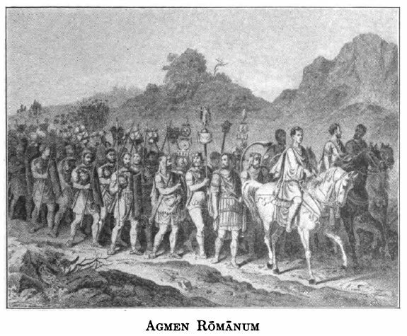

# First Latin Reader

Edward C. Chickering, Ph.D.

## Prōlūsiō

1. Asia est terra. Asia est magna terra. Asia urbēs habuit. Asia multās urbēs habuit. Asia multās urbēs iam habuerat. Asia multās urbēs iam per longum tempus habuerat.

    Asia est magna terra quae multās urbēs iam per longum tempus habuerat.

2. Trōia fuit urbs. Ad Trōiam bellum gerēbant. Ad Trōiam mīlitēs bellum gerēbant. Trōia fuit urbs ubi mīlitēs bellum gerēbant. Mīlitēs fīnēs tenēre voluērunt. Mīlitēs fīnēs suōs tenēre voluērunt. Mīlitēs fīnēs suōs tenēre voluērunt in Asiā. Trōia fuit urbs ubi mīlitēs bellum gerēbant quod fīnēs suōs tenēre voluērunt in Asiā.

    Trōia fuit urbs ubi mīlitēs bellum gerēbant quod fīnēs suōs tenēre voluērunt in Asiā, illā magnā terrā quae multās urbēs iam per longum tempus habuerat.

3. Aenēās fuit vir. Aenēās fuit vir magnae virtūtis. Aenēās Trōiam relīquit. Aenēās ad aliam cīvitātem suōs tulit. Aenēās ad aliam cīvitātem, Trōiā relictā, suōs tulit. Aenēās, vir magnae virtūtis, ad aliam cīvitātem, Trōiā relictā, suōs tulit.

    Aenēās, vir magnae virtūtis, ad aliam cīvitātem, Trōiā relictā, suōs tulit. Trōia fuit urbs ubi mīlitēs bellum gerēbant quod fīnēs suōs tenēre voluērunt in Asiā, illā magnā terrā quae multās urbēs iam per longum tempus habuerat.

4. Ītalia est terra. Ītaliam manus hominum petīvit. Ītaliam manus illa hominum nāvibus petīvit. Ītaliam manus illa hominum cum Aenēā petīvit. Ītalia est ea terra quam manus illa hominum nāvibus cum Aenēā petīvit.

    Ītalia est ea terra quam manus illa hominum nāvibus petīvit, cum Aenēās, vir magnae virtūtis, ad aliam cīvitātem, Trōiā relictā, suōs tulit. Trōia fuit urbs ubi mīlitēs bellum gerēbant quod fīnēs suōs tenēre voluērunt in Asiā, illā magnā terrā quae multās urbēs iam per longum tempus habuerat.

5. Latīnus nōn fuit hostis. Latīnus Aenēān socium fierī iussit. Latīnus ipse Aenēān socium in Ītaliā tum fierī iussit. Latīnus Aenēān ūnā cum suīs cōpiīs socium fierī iussit. Nec hostis fuit Latīnus, sed Aenēān ūnā cum suīs cōpiīs ipse socium in Ītaliā tum fierī iussit. Cum Aenēā bellum nōn gessit. Sīc fēcit nē cum eō bellum gereret.

    Nec hostis fuit Latīnus, sed Aenēān ūnā cum suīs cōpiīs ipse socium in Ītaliā tum fierī iussit: sīc fēcit nē cum eō bellum gereret. Ītalia est ea terra quam manus illa hominum nāvibus petīvit, cum Aenēās, vir magnae virtūtis, ad aliam cīvitātem, Trōiā relictā, suōs tulit. Trōia fuit urbs ubi mīlitēs bellum gerēbant quod fīnēs suōs tenēre voluērunt in Asiā, illā magnā terrā quae multās urbēs iam per longum tempus habuerat.

6. Quis fuit Mārs? Mārs fuit deus. Mārs fuit bellī deus. Mārs fuit bellī deus, ac armōrum exercituum castrōrum. Mārs virtūtem cōnsiliumque dedit. Mārs Latīnō virtūtem cōnsiliumque dedit. Latīnus illa loca tenēbat. Latīnus fuit vir quī illa loca tenēbat. Mārs virtūtis cōnsilīque plūs Latīnō quam aliīs dedit. Mārs virtūtis cōnsilīque plūs Latīnō, virō quī illa loca tenēbat, quam aliīs dedit.

    Quis fuit Mārs? Fuit bellī deus, ac armōrum es exercituum castrōrum: virtūtis cōnsilīque plūs Latīnō, virō quī illa loca tenēbat, quam aliīs dedit. Nec hostis fuit Latīnus, sed Aenēān ūnā cum suīs cōpiīs ipse socium in Ītaliā tum fierī iussit: sīc fēcit nē cum eō bellum gereret. Ītalia est ea terra quam manus illa hominum nāvibus petīvit, cum Aenēās, vir magnae virtūtis, ad aliam cīvitātem, Trōiā relictā, suōs tulit. Trōia fuit urbs ubi mīlitēs bellum gerēbant quod fīnēs suōs tenēre voluērunt in Asiā, illā magnā terrā quae multās urbēs iam per longum tempus habuerat.

7. Rōmulus urbem parāverat. Rōmulus hanc urbem (Rōmam) sibi parāverat. Quis fuistī tū, Rōmule? Multum potuistī. Pater tuus fuit Mārs. Tantum potuistī quod pater tuus fuit Mārs.

    Rōmulus hanc urbem sibi parāverat. Quis fuistī tū, Rōmule? Tantum potuistī quod pater tuus fuit Mārs. Quis fuit Mārs ? Fuit bellī deus, ac armōrum exercituum castrōrum: virtūtis cōnsilīque plūs Latīnō, virō quī illa loca tenēbat, quam aliīs dedit. Nec hostis fuit Latīnus, sed Aenēān ūnā cum suīs cōpiīs ipse socium in Ītaliā tum fierī iussit: sīc fēcit nē cum eō bellum gereret. Ītalia est ea terra quam manus illa hominum nāvibus petīvit, cum Aenēās, vir magnae virtūtis, ad aliam cīvitātem, Trōiā relictā, suōs tulit. Trōia fuit urbs ubi mīlitēs bellum gerēbant quod fīnēs suōs tenēre voluērunt in Asiā, illā magnā terrā quae multās urbēs iam per longum tempus habuerat.

8. Rōma est urbs. Rōma est nunc prīma in Ītaliā. Rōma est nunc prīma inter omnēs urbēs. Rōma est nunc prīma inter omnēs tōtīus Ītaliae urbēs. Haec eadem urbs est nunc prīma inter omnēs tōtīus Ītaliae urbēs. Eō tamen tempore nōn tanta fuit. Hoc imperium prīmum nōn habuit. Quā dē causā Rōmulus bellum gessit. Rōmulus multōs diēs bellum gessit. Huius etiam imperī causā Rōmulus multōs diēs bellum gessit.

    Rōma: haec eadem urbs est nunc prīma inter omnēs tōtīus Ītaliae urbēs; eō tamen tempore nōn tanta fuit; huius etiam imperī causā Rōmulus multōs diēs bellum gessit. Rōmulus hanc urbem sibi parāverat. Quis fuistī tū, Rōmule? Tantum potuistī quod pater tuus fuit Mārs. Quis fuit Mārs? Fuit bellī deus, ac armōrum exercituum castrōrum: virtūtis cōnsilīque plūs Latīnō, virō quī illa loca tenēbat, quam aliīs dedit. Nec hostis fuit Latīnus, sed Aenēān ūnā cum suīs cōpiīs ipse socium in Ītaliā tum fierī iussit: sīc fēcit nē cum eō bellum gereret. Ītalia est ea terra quam manus illa hominum nāvibus petīvit, cum Aenēās, vir magnae virtūtis, ad aliam cīvitātem, Trōiā relictā, suōs tulit. Trōia fuit urbs ubi mīlitēs bellum gerēbant quod fīnēs suōs tenēre voluērunt in Asiā, illā magnā terrā quae multās urbēs iam per longum tempus habuerat.

9. Brūtus multa fēcit. Brūtus prō rē pūblicā multa fēcit. Ante eum populus nōn habuerat cīvitātem. Ante eum populus nūllam habuerat cīvitātem. Ille populō Rōmam dedit.

    Brūtus prō rē pūblicā multa fēcit. Ante eum populus nūllam habuerat cīvitātem; ille populō Rōmam dedit. Rōma: haec eadem urbs est nunc prīma inter omnēs tōtīus Ītaliae urbēs; eō tamen tempore nōn tanta fuit; huius etiam imperī causā Rōmulus multōs diēs bellum gessit. Rōmulus hanc urbem sibi parāverat. Quis fuistī tū, Rōmule? Tantum potuistī quod pater tuus fuit Mārs. Quis fuit Mārs? Fuit bellī deus, ac armōrum exercituum castrōrum: virtūtis cōnsilīque plūs Latīnō, virō quī illa loca tenēbat, quam aliīs dedit. Nec hostis fuit Latīnus, sed Aenēān ūnā cum suīs cōpiīs ipse socium in Ītaliā tum fierī iussit: sīc fēcit nē cum eō bellum gereret. Ītalia est ea terra quam manus illa hominum nāvibus petīvit, cum Aenēās, vir magnae virtūtis, ad aliam cīvitātem, Trōiā relictā, suōs tulit. Trōia fuit urbs ubi mīlitēs bellum gerēbant quod fīnēs suōs tenēre voluērunt in Asiā, illā magnā terrā quae multās urbēs iam per longum tempus habuerat.

10. Caesar ēgit. Nōn ut Cicerō ēgit. Nōn hōc modō ēgit Caesar. Caesar imperium petīvit. Caesar sibi summum imperium petīvit. Caesar sibi summum imperium magnō animō petīvit. Legiōnēs in Galliam mīsit. Lēgātī Rōmam vēnērunt. Lēgātī ab omnibus terrīs Rōmam vēnērunt. Lēgātī ex omnibus reliquīs urbibus Rōmam vēnērunt. Ab omnibus terrīs, ex omnibus reliquīs urbibus Rōmam vēnērunt lēgātī.

    Nōn hōc modō (ut Cicerō) ēgit Caesar, quī sibi summum imperium magnō animō petīvit; legiōnēs in Galliam mīsit, ab omnibus terrīs, ex omnibus reliquīs urbibus Rōmam vēnērunt lēgātī. Brūtus prō rē pūblicā multa fēcit. Ante eum populus nūllam habuerat cīvitātem; ille populō Rōmam dedit. Rōma: haec eadem urbs est nunc prīma inter omnēs tōtīus Ītaliae urbēs; eō tamen tempore nōn tanta fuit; huius etiam imperī causā Rōmulus multōs diēs bellum gessit. Rōmulus hanc urbem sibi parāverat. Quis fuistī tū, Rōmule? Tantum potuistī quod pater tuus fuit Mārs. Quis fuit Mārs? Fuit bellī deus, ac armōrum exercituum castrōrum: virtūtis cōnsilīque plūs Latīnō, virō quī illa loca tenēbat, quam aliīs dedit. Nec hostis fuit Latīnus, sed Aenēān ūnā cum suīs cōpiīs ipse socium in Ītaliā tum fierī iussit: sīc fēcit nē cum eō bellum gereret. Ītalia est ea terra quam manus illa hominum nāvibus petīvit, cum Aenēās, vir magnae virtūtis, ad aliam cīvitātem, Trōiā relictā, suōs tulit. Trōia fuit urbs ubi mīlitēs bellum gerēbant quod fīnēs suōs tenēre voluērunt in Asiā, illā magnā terrā quae multās urbēs iam per longum tempus habuerat.

11. Cicerō dīxit: “Ego altus sum.” “Omnēs mē vident.” “Ego tam altus sum ut omnēs mē videant.” “Dē rē pūblicā agitur.” “Dē nostrā rē pūblicā agitur.” “Mea nōn vidētur virtūs.” “Nōn mea, popule Rōmāne, sed vestra vidētur virtūs.” “Dīcō ut nōn mea, popule Rōmāne, sed vestra videātur virtūs.” “Sī dē nostrā rē pūblicā agitur, dīcō ut nōn mea, popule Rōmāne, sed vestra videātur virtūs.”

    Cicerō dīxit: “Ego tam altus sum ut omnēs mē videant; et sī dē nostrā rē pūblicā agitur, dīcō ut nōn mea, popule Rōmāne, sed vestra videātur virtūs.” Nōn hōc modō ēgit Caeser, quī sibi summum imperium magnō animō petīvit; legiōnēs in Galliam mīsit, ab omnibus terrīs, ex omnibus reliquīs urbibus Rōmam vēnērunt lēgātī. Brūtus prō rē pūblicā multa fēcit. Ante eum populus nūllam habuerat cīvitātem; ille populō Rōmam dedit. Rōma: haec eadem urbs est nunc prīma inter omnēs tōtīus Ītaliae urbēs; eō tamen tempore nōn tanta fuit; huius etiam imperī causā Rōmulus multōs diēs bellum gessit. Rōmulus hanc urbem sibi parāverat. Quis fuistī tū, Rōmule? Tantum potuistī quod pater tuus fuit Mārs. Quis fuit Mārs? Fuit bellī deus, ac armōrum exercituum castrōrum: virtūtis cōnsilīque plūs Latīnō, virō quī illa loca tenēbat, quam aliīs dedit. Neec hostis fuit Latīnus, sed Aenēān ūnā cum suīs cōpiīs ipse socium in Ītaliā tum fierī iussit: sīc fēcit nē cum eō bellum gereret. Ītalia est ea terra quam manus illa hominum nāvibus petīvit, cum Aenēās, vir magnae virtūtis, ad aliam cīvitātem, Trōiā relictā, suōs tulit. Trōia fuit urbs ubi mīlitēs bellum gerēbant quod fīnēs suōs tenēre voluērunt in Asiā, illā magnā terrā quae multās urbēs iam per longum tempus habuerat.

## I. Ecce Aenēās in Ītaliā

“Fortēs fortūna adiuvat”

Audīte, puerī puellaeque! Nam rēs Rōmānās narrō. Et prīmum necesse est Trōiam urbem memorāre. Graecī Graeciam incolunt, sed Trōiam oppugnant. Decem annōs pugnant. Post hōs annōs Trōiam expugnant. Deinde urbem incendunt. Cīvēs fugiunt, et Aenēān ducem habent. Aenēās patrem suum portat, et Ascanium fīlium dūcit. Alium locum quaerunt, domum enim dēsīderant.

Septem annōs errant. Dēnique ad fluvium perveniunt. Discunt hunc fluvium esse Tiberim. Hanc terram ubi fluvius est Latīnus rēx regit. Itaque rēgem amīcum faciunt. Ille quoque eōs amīcōs accipit. Latīnus pulchram fīliam habet. “Cape,” inquit, “Aenēā, fīliam meam. Coniugem nōn habēs. Illa bona est fīlia. Eam uxōrem tuam nunc faciō.” Itaque Aenēās Laviniam uxōrem dūcit. Posteā Trōiānī urbem novam condunt, quam Lavinium appellant.

Vīvunt igitur, et beātam vītam agunt. Aenēān senem vidēmus, mox Ascanium fīlium rēgem accipiunt Trōiānī. Rēx novus novam urbem condit, quam Albam Longam appellat. Nam urbem vident esse et longam et albam. Cīvēs quī Albam Longam incolunt Albānōs appellant. Sīc haec fābula fīnem habet.

## II. Amūlius et Numitor, Rōmulus et Remus

“Multa cadunt inter calicem suprēmaque labra”

Post multōs annōs Silvius Procas est rēx Albānus. Duōs fīliōs, Numitōrem seniōrem, Amūlium iūniōrem, habet. Ubi Silvius animam agit, Amūlius frātrī optiōnem dat[^II-1]: “Utrum vīs habēre, rēgnum an pecūniam et omnēs rēs quās pater noster relinquit? Numitor respondet sē pecūniam et aliās rēs habēre velle. Deinde Amūlius rēgnum firme tenēre volt; frāter fīlium habet, quem Amūlius occīdit, et fīliam, quam Vestālem virginem facit. Nam nūllus virginem Vestālem uxōrem dūcit: nōn licet. Vestālis virgō numquam coniugem habēre potest.

Propter hoc Amūlius putat sē semper rēgem esse posse. Sed Mārs est deus: Mārs Rheam Silviam uxōrem dūcit. Rhea Silvia, ut omnēs scītis, est virgō illa quam Amūlius timet. Silvia geminōs parit, quō Rōmulum et Remum appellat.

Amūlius autem, rēx malus, puerōs in Tiberim dēicit. Sed nunc fluvius ultrā rīpās fluit. Deinde refluit, et Rōmulum et Remum siccōs relinquit. Nātūra geminōs cūrat dōnec Faustulus pāstor eōs capit. Uxor duōs puerōs īnstituit, quī, ubi virī sunt, discunt Numitōrem esse avum suum. Amūlium interficiunt, Numitōrem rēgem faciunt, urbem suam prope Tiberim condunt, quam Rōmam vocāmus. Iam hanc fābulam habētis.

[^II-1]: Frātrī optiōnem dat: i.e., pōnit ante frātrem duās rēs, et dīcit: “Dēlige ūnam.”

## III. Rōmulus Remum interficit: Sabīnae rapiuntur

“Timeō Danaōs et dōna ferentēs”

Iam scītis Rōmam esse conditam[^III-1]. Sed nōmen urbs nōndum habet. Frātrēs inter sē contendunt, nam ambō nōmen suum et imperium urbem habēre volunt. Auspicia igitur dēcernunt adhibēre. Omnēs partēs caelī spectant, multās avēs ūnus quisque vidēre volt. Remus sex cōnspicere potest, sed Rōmulus duodecim videt. Itaque Rōmulus propter nōmen suum Rōmam urbem vocat. Circum urbem vallum aedificat, quod novam urbem tūtam esse volt. Quod hoc vallum tam angustum est Remus rīdet, super id trāicit. Deinde Rōmulus frātrem interficit, et sōlus imperium habet.

Tamen Rōmulus imāginem urbis magis quam urbem habet: nūllōs continet cīvēs. Rūmōrem igitur dispergit ille libenter sē omnēs hominēs accipere, et eō cōnfugiunt latrōnēs pāstōrēsque permultī. Uxōrēs autem dēsunt. Lēgātōs mittit, quī ad societātem cōnūbiumque vīcīnās gentēs invītant.

Nūllī grātum faciunt respōnsum; quaerunt: “Cūr nōn fēminās quoque accipis, sīc ut latrōnēs?” Rōmulus tum aegrum animum dissimulat; lūdōs parat; multōs fīnitimōs invītat. Magnus numerus convenit, Sabīnōrum et puerī et coniugēs. Ubi ad spectāculum tempus venit, et omnium mentēs oculīque eō convertuntur[^III-2], iuvenēs Rōmānī sē dispergunt, virginēs rapiunt. Bellum quod propter hoc gerunt fābula proxima nārrat.

[^III-1]: Esse conditam: vōx passīva, tempus praeteritum: id est, Aliquis antehāc urbem condidit.
[^III-2]: Convertuntur: vōx passīva: id est, Omnēs mentēs oculōsque eō convertunt.

## IV. Tarpēia occīditur: Rōmulus rēx moritur

“Heu pietās, heu prīsca fidēs”

Sabīnī ob virginēs captās[^IV-1] contrā Rōmānōs bellum sūmunt. Prope urbem Tarpēiam virginem inveniunt, quae extrā fīnēs mūrōrum aquam petit. Huius pater est arcis imperātor. Titus Tatius, Sabīnōrum dux, Tarpēiam corrumpit. “Volō tē,” inquit, “exercitum meum in Capitōlium perdūcere. Ampla mūnera tibi[^IV-2] offerō.” Illa petit ōrnāmenta sinistrārum manuum. Sīc Sabīnōs in arcem patris perdūcit, ubi hostēs scūta conicientēs eam statim obruunt; sīc iubet rēx, ea enim ōrnāmenta laevārum sunt. Haec est poena prōditiōnis.

Deinde Rōmulus et Tatius proelium committunt, cuius locus est ubi nunc forum Rōmānum est. Prīmō mala est fortūna Rōmānōrum, sed Rōmulus auxilium Iovem ōrat, propter quod commūtātiō rērum sequitur[^IV-3]. Mox posteā precēs mulierum, hinc patrum hinc virōrum causā[^IV-4], pācem inter duōs exercitūs conciliant. Foedus fit[^IV-5], Sabīnī et Rōmānī Rōmam incolunt.

Post mortem Tatī Rōmulus sōlus rēx est. Centum deinde seniōrēs dēligit, quōrum cōnsilium sequēns[^IV-6] omnia regit, quōs senātum nōminat propter senectūtem. Posteā exercitum lūstrat, conventum ad Capuae palūdem habet. Subitō coorītur[^IV-6] tempestās; Rōmulus rapitur[^IV-7], et ad deōs trānsit, ut volgō crēdunt. Collis Quirīnālis aedem eius habet, ipse Quirīnus appellātur[^IV-8]. Nārrātae sunt[^IV-9] rēs prīmī rēgis Rōmānī.

[^IV-1]: Captās: participium passīvum praeteritum: Virginēs aliquis antehāc cēpit.
[^IV-2]: Mūnera tibi offerō: Tē possessōrem mūnerum faciam.
[^IV-3]: Sequitur: verbum dēpōnēns: significātiō est āctīva.
[^IV-4]: Virōrum causā: id est, Propter virōs.
[^IV-5]: Fit: vōx passīva: id est, Aliquī foedus faciunt. 
[^IV-6]: Sequitur, Coorītur: verba dēpōnentia.
[^IV-7]: Rapitur: vōx passīva: id est, Aliquis Rōmulum rapit.
[^IV-8]: Appellātur: vōx passīva: id est, Hominēs eum Quirīnum appellant.
[^IV-9]: Nārrātae sunt: passīvum praeteritum: id est, Nārrāvī rēs.

## V. Numa Pompilius, secundus rēx

“Requiēscat in pāce”

Post Rōmulum succēdit Numa Pompilius, vir magnae iūstitiae et religiōnis. Curēs, oppidum Sabīnōrum, fuit[^V-1] anteā domicilium eius. Populum Rōmānum ferum invenit, itaque sacra plūrima īnstituit.

Āram Vestae prōvidet, ubi mūnus est virginum ignem semper alere. Dīcitur[^V-2] Iuppiter ipse quondam ad illum dēscendisse[^V-3]. Prīmum fulmina in urbem dēmittit, deinde in nemus Aventīnum venit, ubi certa prōmissa imperī dat, quae populus Rōmānus posteā habuit[^V-3]. Postrīdiē enim, ubi omnēs ad aedēs rēgiās conveniunt silentēsque[^V-4] exspectant, caelum scinditur[^V-5], unde dēlābitur[^V-6] scūtum, quod sacrum esse cognōscit Numa. Fūrtum timet, itaque Māmūrium ūndecim scūta eiusdem fōrmae facere iubet. Duodecim autem Saliōs Mārtis sacerdōtēs legit, quī hōrum custōdēs sunt, quae Kalendīs Mārtiīs[^V-7] per urbem canentēs[^V-8] ferunt.

Annum in duodecim mēnsēs ad cursum lūnae dīvidit. Portās Iānī geminās aedificat, quae signa sunt bellī et pācis. Apertae[^V-9], arma indicant, clausae[^V-9] contrārium. Frūmenta quoque plūrima et ūtilia fert Numa. Bellum nūllum gerit. Trēs et quadrāgintā annōs regit, deinde aeger fit[^V-10] et moritur[^V-11].

[^V-1]: Fuit: tempus praeteritum.
[^V-2]: Dīcitur: vōx passīva.
[^V-3]: Dēscendisse, habuit: tempus praeteritum.
[^V-4]: Silentēs: participium praesēns āctīvum: id est, Silent et exspectant.
[^V-5]: Scinditur: vōx passīva.
[^V-6]: Dēlābitur: verbum dēpōnēns.
[^V-7]: Kalendīs Mārtiīs: i.e., ubi mēnsis Mārtius incipit.
[^V-8]: Canentēs: participium praesēns āctīvum.
[^V-9]: Apertae, Clausae: participia passīva praeterita.
[^V-10]: Fit: vōx passīva.
[^V-11]: Moritur: verbum dēpōnēns.

## VI. Tullus Hostilius: Horātiī et Cūriātiī

“Dulce et decōrum est prō patriā morī”

Post mortem Numae Tullus Hostilius rēx est. Hic nōn sōlum proximī rēgis dissimilis, sed ferōcior etiam quam Rōmulus esse vidētur[^VI-1]. Nunc bellum inter Rōmānōs et Albānōs coorītur[^VI-2]. Dēcernunt autem ducēs paucōs, nōn omnēs utrīusque partis, in certāmen mittere Sunt apud Rōmānōs trēs frātrēs Horātiī, trēs apud Albānōs Cūriātiī. Itaque cōnstituitur[^VI-3] hōs pugnāre, victōrēs patriam suam victōrem sīc facere.

Ternī frātrēs arma capiunt et in medium inter duās aciēs prōcēdunt. Cōnsīdunt utrimque duo exercitūs. Datur[^VI-4] signum et ternī iuvenēs, magnōrum exercituum animōs gerentēs[^VI-5], concurrunt. Ut prīmum congrediuntur[^VI-6] micantque gladiī, perterrentur[^VI-7] spectantēs[^VI-8] omnēs; nam statim duo Rōmānī alius super alium morientēs[^VI-9] cadunt; trēs Albānī volnerantur[^VI-10]. Ad cāsum Rōmānōrum exsultat exercitus Albānus. Rōmānōs iam spēs tōta dēserit.

Ūnum Horātium trēs Cūriātiī circumsistunt. Forte is integer est; sed quia tribus[^VI-11] minimē pār est, fugam capit, singulōs per intervalla secūtūrōs esse[^VI-12] spērāns[^VI-13]. Iam paulum spatī ex eō locō[^VI-15], ubi dēcertāvērunt[^VI-16], fugit, cum respicit et videt ūnum Cūriātium nōn longē ab sēsē[^VI-17] abesse. In eum impetum facit, et dum Albānus exercitus rogat Cūriātiōs frātrem adiuvāre, iam Horātius eum occīdit. Alterum deinde, dum tertius cōnsequī[^VI-18] nōn potest, interficit. Iam singulī supersunt.

[^VI-1]: Vidētur: vōx passīva.
[^VI-2]: Coorītur: verbum dēpōnēns.
[^VI-3]: Cōnstituitur: vōx passīva.
[^VI-4]: Datur: vōx passīva.
[^VI-5]: Gerentēs: participium āctīvum praesēns.
[^VI-6]: Congrediuntur: verbum dēpōnēns.
[^VI-7]: Perterrentur: vōx passīva.
[^VI-8]: Spectantēs: participium.
[^VI-9]: Morientēs: participium.
[^VI-10]: Volnerantur: vōx passīva.
[^VI-11]: Tribus: cāsus datīvus cum adiectīvō.
[^VI-12]: Secūtūrōs esse: verbum dēpōnēns, tempus futūrum.
[^VI-14]: Spērāns: participium.
[^VI-15]: Locō: cāsus ablātīvus, post praepositiōnem ex.
[^VI-16]: Dēcertāvērunt: tempus praeteritum.
[^VI-17]: Sēsē: cāsus ablātīvus, post praepositiōnem ab.
[^VI-18]: Cōnsequī: verbum dēpōnēns.

## VII. Horātiī superant

“Fīnis corōnat opus”

Tam singulī supersunt, sed illīs[^VII-1] nec spēs nec vīrēs parēs sunt. Alter est integer, et propter duplicem victōriam ferōx; alter dēfessum ob volnus trahit corpus. Nec illud proelium est. Rōmānus exsultāns male sustinentem arma Cūriātium cōnficit, iacentem spoliat. Rōmānī ēlātī Horātium accipiunt et domum dēdūcunt.

Prīnceps it Horātius trium frātrum spolia ante sē gerēns. Cui[^VII-2] obvia est soror, quae pacta fuit Cūriātī; sed ubi super umerōs frātris vestem pactī videt, quam ipsa cōnfēcit, flēre et crīnēs solvere incipit. Movent ferōcis iuvenis animum lacrimae sorōris ubi omnēs exsultant; itaque stringit gladium et puellam occīdit, simul eī[^VII-3] obiciēns: “Abī hinc, tū et immātūrus amor ad pactum, oblīta frātrum, oblīta patriae. Sīc tū, et omnēs Rōmānae quae mortem hostis dolent!”

Dēdecus id vidētur patribus plēbīque[^VII-4]; itaque rapiunt in iūs Horātium et apud iūdicēs damnant. Iam accēdit supplicium. Tum Horātius populum appellat. Intereā pater Horātī senex clāmat fīliam suam mortem meruisse; et iuvenem complexus spoliaque Cūriātiōrum ostendēns ōrat populum: “Nōlīte meōs omnēs līberōs adimere!” Nōn fert populus patris lacrimās iuvenemque līberat proptereā quod admīrantur virtūtem. Sed pater propter maleficium fīlī quaedam sacra peragit et fīlium sub trabem quasi sub iugum mittit.

[^VII-1]: Illīs: cāsus datīvus: Illī spem nōn habent et c.
[^VII-2]: Cui: datīvus: Ob vel prope eum venit soror.
[^VII-3]: Eī: datīvus: ob vel ad eam iaciēns.
[^VII-4]: Patribus plēbīque: datīvus: i.e., Patrēs plēbsque putant id esse dēdecus.

## VIII. Tullus et eius glōria bellī

“Post nūbila, Phoebus”

Nōn diū pāx Albāna mānsit, nam Mettius, dux Albānōrum, cīvēs suōs sē dēficere vīdit, graviter enim ferēbant[^VIII-1] ūnum paucōrum certāmen fīnem bellī fēcisse. Itaque Vēientēs Fīdēnātēsque ad bellum contrā Rōmānōs impulit. Ipsum Tullus in auxilium arcessīvit, sed ille aciem in collem subdūxit et fortūnam bellī exspectāvit. Tullus hoc intellegit et clāmat: “Ego Mettium hoc facere iussī, hostēs ā tergō[^VIII-2] circumvenīre volumus!” Propter hoc audītum magnopere perterritī hostēs victī sunt.

Posterō diē[^VIII-3] Mettius ad Tullum vēnit, quī tamen iussit eum ad quattuor equōs vincīrī et in dīversa dīripī. Deinde Tullus Albam propter ducis maleficium dēlēvit et Albānōs Rōmam trānsīre iussit. Rōma interim crēvit propter Albae exitium; duplex factus est cīvium numerus; mōns Caelius ad urbem additus est et, quod frequentius incolī voluit, eum sēdem rēgnī Tullus fēcit ibique deinde incoluit. Ob auctās vīrēs audāx factus bellum contrā Sabīnōs gessit; nūlla quidem quiēs armōrum data est. Crēdidit enim rēx bellicōsus magis valēre mīlitiae[^VIII-4]] quam domī[^VIII-4] iuvenum corpora.

Sed ipsum quoque longa aegritūdō fatīgāvit. Tum vērō frāctī sunt cum[^VIII-5] corpus tum[^VIII-5] spīritūs illī ferōcēs, neque ūlla rēs deinde nisi sacra eum dēlectāvit. Memorant Tullum et domum eius propter fulminis ictum exustum esse. Tullus magnam glōriam bellicam habuit; rēgnāvit annōs trīgintā duōs.

[^VIII-1]: Ferēbant: tempus imperfectum.
[^VIII-2]: Ā tergō: ablātīvus cāsus: i.e., post tergum.
[^VIII-3]: Posterō diē: ablātīvus: i.e., ubi posterus diēs advēnit. 
[^VIII-4]: Mīlitiae, Domī: locātīvus cāsus: respondent quaestiōnī Ubi fit hoc?
[^VIII-5]: Cum—tum=et—et.

## IX. Ancus Mārcius, Rōmānōrum rēx quārtus

“Animīs opibusque parātī”

Post Tullī mortem Ancum Mārcium rēgem populus creāvit. Numae Pompilī nepōs Ancus Mārcius fuit, aequus, religiōsus, avī similis. Tunc Latīnī, quī cum Tullō[^IX-1] rēge foedus fēcērunt, sustulērunt animōs, et impetum in agrum Rōmānum fēcērunt. Ancus prīmō iīs[^IX-2] bellum nōn indīxit, sed lēgātum mīsit, quī rēs repetīvit, eumque mōrem posterī accēpērunt. Id autem sīc fit.

Lēgātus, ubi ad fīnēs eōrum venit, quī bellum minantur, caput vēlat: “Audī, Iuppiter,” inquit, “audīte, fīnēs huius populī. Ego sum pūblicus nūntius Populī Rōmānī: verba mea vēra esse accipite” Deinde peragit postulāta. Sī nōn dēduntur rēs quās poscit, hastam in fīnēs hostium immittit bellumque ita indīcit. Lēgātus, quī propter hanc rem mittitur, modusque bellī indīcendī proprium nōmen habent.

Ubi lēgātus Rōmānus rēs repetīvit superbē respondērunt Latīnī: quā rē bellum iīs[^IX-2] indictum est. Ancus exercitum cōnscrīpsit, Latīnōs vīcit, complūra oppida dēlēvit, cīvēs Rōmam trādūxit. Sed propter tantam hominum multitūdinem facinora audācia fīēbant[^IX-3], quā rē Ancus carcerem prope mediam urbem ad terrōrem crēscentis audāciae aedificāvit. Īdem nova moenia urbī[^IX-2] circumdedit, pontem Sublicium trāns Tiberim fēcit et Iāniculum montem urbī[^IX-2] coniūnxit, prope ōs Tiberis Ōstiam urbem condidit. Complūrēs aliās rēs intrā paucōs annōs cōnfēcit, sed per immātūram mortem raptus obiit.

[^IX-1]: Tullō: ablātīvus post praepositiōnem cum.
[^IX-2]: Iīs (bis), urbī (bis): datīvus cāsus propter praepositiōnēs verbīs praepositās.
[^IX-3]: Fīēbant: vōx passīva, tempus imperfectum.

## X. Tarquinius Prīscus

“Carpe diem”

Dum Ancus rēgnat Lūcius Tarquinius Tarquiniīs[^X-1], ex Etrūriae urbe[^X-2], profectus cum coniuge[^X-2] et fortūnīs[^X-2] omnibus Rōmam vēnit. Additur haec fābula: aquila super carrum eius volāns dēmōnstrāvit eum rēgem fore[^X-2]; quod eius coniūnx intellēxit, et virum complexa excelsa et alta spērāre eum iussit. Hās spēs cogitātaque sēcum[^X-2] portantēs urbem ingressī sunt, ubi mox Tarquinius dignitātem atque etiam Ancī rēgis familiāritātem cōnsecūtus est; ā quō[^X-2] magister līberōrum factus rēgnum cēpit et administrāvit.

Tarquinius Prīscus Latīnōs vīcit; Circum Maximum aedificāvit; Sabīnōs superāvit; mūrum urbī[^X-3] circumdedit. Equitum centuriārum numerum auxit, nōmina mūtāre nōn potuit, quod Accius Navius dēterruit. Accius enim, augurī perītus, id fierī posse negāvit contrā avium indicium; īrātus rēx ad artem experiendam eum rogāvit: “Fierīne potest, id quod nunc cōgitō?” “Potest,” respondet Accius. “Sed hoc,” inquit rēx, “cōgitāvī: num possum lapidem illum secāre gladiō?” “Potes ergō,” inquit Accius, et rēx secuisse dīcitur.

Superfuērunt duo Ancī fīliī, quī aegrē tulērunt sē patris rēgnum āmīsisse. Duōs pāstōrēs ferōcissimōs dēligunt ad rēgem necandum[^X-5]. Hī ante aedēs rēgiās tumultum faciunt. Quōrum clāmor penitus in aedēs pervēnit, ad rēgem vocātī sunt. Iussī in vicem dīcere, ūnus rem incipit; dumque intentus in eum sē rēx tōtus āvertit, alter ēlātam secūrim in eius caput dēicit; deinde ambō tēlum in volnere[^X-2] relinquunt et fugiunt.

[^X-1]: Tarquiniīs: nōn postulat praepositiōnem quod est nōmen urbis.
[^X-2]: Vocābula stēllā indicāta sunt ablātīvō cāsū propter praepositiōnēs suās, nisi hīc explicantur.
[^X-3]: Fore: īnfīnītīvum futūrum verbī esse.
[^X-4]: Urbī: cāsus datīvus propter praepositiōnem verbō praepositam.
[^X-5]: Ad rēgem necandum: Ferōcissimōs dēligunt quod volunt eōs rēgem necāre.

## XI. Servius Tullius imperium suscipit

“Potior est, quī prior est”

Post hunc Servius Tullius suscēpit imperium nātus ex nōbilī fēminā,[^XI-1] captīvā[^XI-1] tamen et famulā[^XI-1]. Ille in domō[^XI-1] Tarquinī Prīscī īnstitūtus est, in quā[^XI-1] dīcunt ōmen mīrum accidisse. Flammae speciēs puerī in somnō[^XI-1] iacentis caput complexa est. Ubi hoc vīdit Tanaquil, Tarquinī uxor, summam eius dignitātem fore intellēxit. Is postquam adolēvit, et fortissimus et sapientissimus fuit. In proeliō[^XI-1] quōdam, in quō[^XI-1] rēx Tarquinius contrā Sabīnōs cōnflīxit, quod mīlitēs nōn satis audācter dīmicāvērunt, raptum signum in hostēs mīsit. Cuius recipiendī grātiā[^XI-2] Rōmānī ācerrimē pugnāvērunt, et signum et victōriam rettulērunt.

Post interitum Tarquinī, Tanaquil mortem cēlāvit, populumque ex superiōre parte[^XI-1] aedium cohortāta ait, rēgem grave quidem, sed nōn fātāle volnus accēpisse eumque Servium Tullium rēgem ad tempus cōnstituere. Sīc Servius Tullius rēgnāre coepit, sed rēctē imperium administrāvit. Sabīnōs imperiō[^XI-1] suō subiēcit; montēs trēs urbī[^XI-1] adiūnxit; fossās circum mūrum dūxit. Īdem populum in classēs et centuriās distribuit.

Servius Tullius aliquod urbī[^XI-1] decus addere voluit. Iam tum nōbile erat Diānae Ephesiae templum. Id commūniter ā cīvitātibus[^XI-1] Asiae factum fāma tulit. Itaque ob eius voluntātem Latīnī templum Diānae cum populō[^XI-1] Rōmānō Rōmae in Aventīnō monte[^XI-1] aedificāvērunt.

[^XI-1]: Omnia alia vocābula stēllā indicāta coniūncta sunt cum praepositiōnibus: sī praepositiō cum verbō est coniūncta, cāsus substantīvī est datīvus: aliter ablātīvus.
[^XI-2]: Grātiā: hoc potest appellārī praepositiō.

## XII. Dē bove illā et dē Tulliae impietāte

“Ō tempora, ō mōrēs”

Iam cognōvimus templum Diānae in Aventīnō aedificātum esse. Post hoc bovem mīrae magnitūdinis quīdam Latīnus habuisse dīcitur et respōnsum ā deō datum: Is populus summam imperī habēbit[^XII-1], cuius ā cīve bovem illam Diāna accipiet[^XII-1]. Latīnus bovem ad templum Diānae ēgit et dē causā sacerdōtem Rōmānum certiōrem fēcit. Ille callidus dīxit, prius eum vīvō flūmine[^XII-2] manūs pūrās facere dēbēre. Latīnus dum ad Tiberim dēscendit, sacerdōs bovem interfēcit. Ita imperium cīvēs, ipse glōriam cōnsecūtus est.

Servius Tullius fīliās alteram ferōcem, mītem alteram habuit, Tarquinius fīliōs parī animō[^XII-3], itaque ferōcem cum mītī, mītem cum ferōcī coniugēs iūnxit, nōlēns duo praecipitia ingenia coniungī. Sed mītēs seu forte seu dolō[^XII-4] periērunt; ferōcēs mōrum similitūdō coniūnxit. Statim Tarquinius ā Tulliā incitātus rēgnum patris repetere coepit.

Deinde Servius dum ad senātum contendit, iussū[^XII-5] Tarquinī per gradūs dēiectus et domum rediēns interfectus est. Tullia carrō vecta in forum properāvit et coniugī[^XII-6] ē senātū ēvocātō[^XII-6] prīma rēgī[^XII-6] salūtem dīxit; cuius iussū, ubi domum rediit et patris corpus vīdit, eum quī equōs agēbat[^XII-7] cūnctantem super ipsum corpus carrum agere iussit. Unde vīcus ille scelerātus dictus est. Tullius rēgnāvit annōs quadrāgintā quattuor.

[^XII-1]: Habēbit, Accipiet: tempus futūrum.
[^XII-2]: Flūmine: in flūmine, vel respondet quaestiōnī Quō īnstrūmentō?
[^XII-3]: Fīliōs parī animō: respondet quaestiōnī Quālēs fīliōs?
[^XII-4]: Dolō: respondet quaestiōnī Quā dē causā?
[^XII-5]: Iussū: item.
[^XII-6]: Coniugī seqq.: coniūncta cum verbō dīxit. Cf. Dīxit mihi. .
[^XII-7]: Agēbat: tempus imperfectum.

## XIII. Tarquinius Superbus: Lucrētia

“Hinc illae lacrimae”

Tarquinius Superbus rēgnum per scelus occupāvit. Tamen bellicōsus fuit; urbem Gabiōs in potestātem redēgit per Sextum fīlium. Is indigne tulit eam urbem ā patre expugnārī nōn posse, itaque ad Gabīnōs sē contulit, patris crūdēlitātem in sē querēns. Amīcē ā Gabīnīs exceptus paulātim eōrum grātiam cōnsequitur, ad postrēmum dux bellī dēligitur. Tum ē suīs ūnum ad patrem mittit quaesītum[^XIII-1]: “Quid mē facere vīs?” Pater nūntiō nihil respondit, sed velut cōgitāns in agrum trānsiit ibique vagāns altissima flōrum capita dēiēcit. Nūntius rediit Gabiōs, Sextō nārrāvit illa quae accidērunt. Sextus intellēxit voluntātem patris, prīncipēs cīvitātis interfēcit patrīque urbem sine ūllō certāmine trādidit.

Posteā rēx Ardēam urbem obsēdit. Ibi Tarquinius Collātīnus, sorōris rēgis fīlius, forte morābātur[^XIII-2] apud Sextum Tarquinium, necessārium suum. Incidit dē uxōribus colloquium cum iuvenibus rēgiīs; suam ūnus quisque laudat; placuit experīrī. Rēgiās mulierēs in convīviō dēprehendunt; Lucrētiam, Collātīnī uxōrem, inter famulās labōrantem inveniunt. Ea ergō cēterīs praestāre iūdicātur. Post paucōs diēs Sextus Collātiam rediit et Lucrētiae vim attulit. Illa postrīdiē patrem et coniugem vocat, rem expōnit, sē occīdit. Conclāmant vir paterque et in exitium rēgum coniūrant. Tarquiniō Rōmam redeuntī clausae sunt urbis portae et exsilium indictum.

[^XIII-1]: Quaesītum: supīnum; quaerendī grātiā, vel quod eum quaerere voluit.
[^XIII-2]: Morābātur: tempus imperfectum.

## XIV. Librī Sibyllīnī: Iūnius Brūtus

“Perīculum in morā”

In antīquīs scrīptīs memoriae haec sunt prōdita. Vetus mulier hospes atque ignōta ad Tarquinium quondam Superbum rēgem adiit, novem librōs ferēns, quōs esse dīcēbat dīvīnōs; eōs sē velle vēndere. Tarquinius pretium quaesīvit; mulier nimium atque maximum poposcit. Rēx, putāns eam ob aetātem esse dēmentem, rīsit. Tum illa ignem affert et trēs librōs ex novem incendit; et “Reliquōsne sex eōdem pretiō[^XIV-1] emere vīs?” rēgem rogāvit. Sed Tarquinius id rīsit magis, dīxitque mulierem iam sine dubiō mente captam esse. Mulier ibi statim trēs aliōs librōs exussit; atque id ipsum iterum placidē rogat, “Vīsne trēs reliquōs eōdem pretiō[^XIV-1] emere?”

Tarquiniō ōs iam sevērum atque intentior animus fit; eam fidem nōn neglegendam intellegit; librōs trēs reliquōs ēmit eōdem pretiō quod erat petītum prō omnibus. Sed eam mulierem ā Tarquiniō post discessum nusquam vīsam esse cōnstat. Librī trēs in templō conditī Sibyllīnīque appellātī sunt. Ad eōs Quīndecimvirī adeunt, cum diī pūblicē cōnsulendī sunt.

Iūnius Brūtus fīlius erat sorōris Tarquinī Superbī. Profectus est Delphōs cum Tarquinī fīliīs, Apollinī mūnera datūrus. Postquam perācta sunt mandāta patris, iuvenēs Apollinem cōnsulunt: “Quis ex nōbīs Rōmae rēgnātūrus est?” Respōnsum est: “Is Rōmae summam potestātem habēbit, quī prīmus mātrī ōsculum dabit.” Tunc Brūtus, simulāns sē cāsū[^XIV-2] cecidisse, terrae ōsculum dedit, scīlicet quod ea commūnis māter omnium hominum est.

[^XIV-1]: Eōdem pretiō (abl.) emere: eandem pecūniam dare.
[^XIV-2]: Cāsū (abl.): forte.

## XV. Rēgēs nōn restituuntur

“Parēs cum paribus facillimē congregantur”

Ubi rēgēs expulsī sunt Rōmānī duōs creāvērunt cōnsulēs, Iūnium Brūtum et Tarquinium Collātīnum Lucrētiae virum. At lībertās modo parta per dolum et prōditiōnem paene āmissa est. Erant Rōmae iuvenēs aliquot, sociī fīliōrum Tarquiniōrum. Hī cum lēgātīs, quōs rēx Rōmam mīsit, quod bona sua repetere voluit, dē restituendīs rēgibus colloquuntur, ipsōs Brūtī cōnsulis fīliōs in societātem cōnsilī sūmunt.

Sermōnem eōrum ex servīs ūnus excēpit; rem ad cōnsulēs dētulit. Datae ad Tarquinium litterae manifestum facinus fēcērunt. Prōditōrēs in vincula coniectī sunt, deinde damnātī. Stetērunt vīnctī iuvenēs nōbilissimī; sed ā cēterīs līberī cōnsulis omnium in sē oculōs āvertērunt. Cōnsulēs in sēdem prōcessēre suam, missīque eī quibus hoc officium est nūdātōs caedunt. Supplicī spectātor erat Brūtus, quī tunc patrem exuit, cōnsulem ēgit[^XV-1].

Tarquinius deinde per bellum apertum rēgnum recipere cōnātus est. Equitibus praefuit Arūns, Tarquinī fīlius; rēx ipse cum legiōnibus secūtus est. Obviam hostī cōnsulēs eunt; Brūtus cum equitātū prōcessit. Arūns, ubi procul Brūtum cognōvit, “Ille est vir,” inquit, “quī nōs ex patriā expulit” Tum concitat equum atque ipsum cōnsulem adorītur. Brūtus avidē sē certāminī offert. Īnfestī concurrērunt, ambō morientēs cecidērunt; reiectus tamen est exercitus Tarquinī. Alter cōnsul Rōmam triumphāns rediit, Brūtī fūnus fēcit. Brūtī mortem mulierēs, ut parentis, tōtum annum doluērunt.

[^XV-1]: Patrem exuit, et c.: i.e., Nōn iam ut pater ēgit, sed ut cōnsul.

## XVI. Duo fortēs Rōmānī

“Per aspera ad astra”

Porsena, rēx Etrūscōrum, Tarquiniōs in rēgnum restituere voluit, itaque cum īnfestō exercitū Rōmam vēnit. Statim Iāniculum cēpit. Numquam aliās tantus terror Rōmānīs incidit; adeō potēns rēs tum Clūsīna fuit magnumque Porsenae nōmen. Ex agrīs in urbem dēveniunt, urbī ipsī praesidia pōnunt. Alia urbis pars propter mūrōs, alia propter Tiberim tūta vīsa est. Pōns Sublicius iter paene hostibus dedit, sed id prohibuit ūnus vir Horātius Coclēs, quī illud nōmen habuit proptereā quod in aliō proeliō oculum āmīsit.

Is extrēmam pontis partem occupāvit, aciem hostium sōlus sustinuit, cōnfīdēns pontem ā tergō concīdī posse. Ipsa audācia perturbāvit hostēs; ubi pōns concīsus est Horātius armātus in Tiberim dēsiluit et quamquam multa incidērunt tēla incolumis ad suōs rediit. Grāta ergā tantam virtūtem cīvitās fuit; eī tantum agrī pūblicē datum est, quantī inter ortum et occāsum sōlis circuitum perēgit. Imāgō quoque eī in Comitiō posita est.

Tum quoque Mūcius, vir Rōmānae virtūtis, senātum adiit et dīxit: “Permittite mihi ad hostēs trānsīre, rēgis enim caedem polliceor vōbīs.” Potestās data est, in castra Porsenae vēnit, ibi in cōnfertissimā multitūdine prope prīncipēs cōnstitit. Stīpendium tunc forte mīlitibus dabātur[^XVI-1], et tribūnus cum rēge idem ferē ōrnāmentum gerēns sedēbat[^XVI-1]. Mūcius nesciit illum nōn esse rēgem, illum prō rēge occīdit. Comprehēnsus et ad rēgem perductus dextram ignī iniēcit, velut manum ulcīscēns, quod in caede errāvit. Attonitus propter rem mīram rēx iuvenem removērī ab ārīs iussit. Tum Mūcius, quasi prō beneficiō pendēns, ait trecentōs contrā eum suī similēs coniūrāsse. Quā rē ille perterritus obsidēs accēpit, bellum dēposuit. Mūciō agrī trāns Tiberim datī, ab eō Mūcia appellātī sunt. Effigiēs quoque eī honōris grātiā cōnstitūta est.

[^XVI-1]: Dabātur, sedēbat: tempus imperfectum.

# XVII. Coriolānus

“Omnia vincit amor”

Gāius Mārcius, vir ā gente nōbilī, Coriolānus, quod Coriolōs, urbem Volscōrum, cēpit, dictus est. Mortuus est pater, māter eum īnstituit. Ubi prīma stīpendia facere coepit adulēscēns, ē proeliīs quibus interfuit numquam rediit nisi corōnā[^XVII-1] aut aliō mīlitārī praemiō dōnātus[^XVII-1]. In omnī vītae ratiōne nihil aliud sibi voluit nisi mātrī placēre; cumque illa audīvit fīlium laudārī aut corōnā[^XVII-1] dōnārī vīdit, tum dēmum beātum ipse sē putāvit.

Posteā cōnsul factus vectum ē Siciliā frūmentum magnō pretiō[^XVII-2] dandum populō cūrāvit, quod plēbem agrōs, nōn pugnās colere voluit. Quā dē causā damnātus ad Volscōs tum Rōmānīs īnfestōs cōnfūgit. Magnō ubīque pretiō virtūs habētur. Itaque quō latebrās quaesītum[^XVII-3] vēnit, ibi mox summum adeptus est imperium. Imperātor ā Volscīs factus castra ad quārtum ab urbe lapidem pōnit, agrum Rōmānum populātur.

Missī dē pāce ad Mārcium lēgātī ferōx respōnsum rettulērunt. Iterum deinde iīdem missī nōn recipiuntur in castra. Sacerdōtēs quoque missī rem facere nōn potuērunt. Attonitus est senātus; perterritus populus; virī pariter ac mulierēs exitium imminēns doluērunt. Tum Veturia, Coriolānī māter, et Volumnia uxor, duōs parvōs fīliōs sēcum trahēns, castra Volscōrum petiērunt. Ubi mātrem cōnspexit Coriolānus: “Vīcistī,” inquit, “īram meam, patria; huic tuam in mē iniūriam condōnō.” Complexus inde suōs castra mōvit et exercitum ex agrō Rōmānō dēdūxit. Coriolānus posteā ā Volscīs ut prōditor occīsus esse fertur; aliī usque ad senectūtem vīxisse eundem trādunt.

[^XVII-1]: Corōnā, praemiō dōnātus: datur illī corōna, praemium.
[^XVII-2]: Magnō pretiō: magnum pretium ā populō postulāvit.
[^XVII-3]: Quaesītum: hoc est supīnum: quod quaerere voluit.

# XVIII. Cincinnātus

“Prō bonō pūblicō”

Aequī cōnsulem Minucium atque exercitum eius cīnctōs tenuērunt. Id ubi Rōmam nūntiātum est, magnus timor, magnus metus fuit, populus enim putāvit urbem ipsam, nōn castra hostēs obsidēre. Quod autem in alterō cōnsule parum esse praesidī vīsum est, magistrum[^XVIII-1] populī dīcī placuit, nam rem afflīctam restituī voluērunt. Quīnctius Cincinnātus omnium cōnsēnsū magister populī est dictus. Ille, spēs sōla imperī Rōmānī, trāns Tiberim tunc coluit agrum. Ad quem missī lēgātī nūdum[^XVIII-2] eum in agrō[^XVIII-3] repperērunt. Salūs data redditaque est, deinde Quīnctius vestem celeriter ē tēctō prōferre uxōrem Raciliam iussit, senātūs enim mandāta togātus audīre voluit.

Mox veste indūtus prōcessit Quīnctius, magistrum populī eum lēgātī aggrediuntur laetī; magnum esse in exercitū terrōrem expōnunt. Quīnctius igitur Rōmam vēnit et domum dēductus est. Posterō diē ab urbe profectus Minucium obsidiōne līberāvit, victōs hostēs sub iugum mīsit. Urbem triumphāns ingressus est. Ductī sunt ante currum hostium ducēs; mīlitāria signa praelāta sunt; secūtus est exercitus praedam comportāns; epulae īnstrūctae sunt ante omnium domōs. Atque haec magnā celeritāte gessit Quīnctius, sextō decimō enim diē officiō iam fūnctus est, quamquam mūnus in sex mēnsēs accēpit. Tum ad bovēs redit et agrum iterum colit.

[^XVIII-1]: Magister populī: saepius appellātur Dictātor.
[^XVIII-2]: Nūdus: i.e., nōn togātus. 
[^XVIII-3]: In agrō Cincinnātus arābat.

## XIX. M. Fūrius Camillus

“Suum cuique”

Dum M. Fūrius Camillus urbem Falēriōs obsidet, lūdī magister plūrimōs et nōbilissimōs inde puerōs in castra Rōmānōrum perdūxit, et Camillō trādidit, quā rē certum fuit Faliscōs dēpositūrōs bellum sēsēque Rōmānīs dēditūrōs esse. Sed Camillus dolum prōditōris dēspiciēns, “Nōn ad similem tuī,” inquit, “vēnistī; sunt et bellī, sīcut pācis, iūra; arma habēmus nōn contrā eam aetātem, cui etiam in captīs urbibus parcitur, sed contrā armātōs, quī nec laesī nec lacessītī ā nōbīs castra Rōmāna ad Vēiōs oppugnāvērunt.” Nūdārī deinde magistrum iussit eīque manūs post tergum vincīrī. Sīc in urbem redūcendum puerīs trādidit, quāsdam rēs[^XIX-1] iīs dedit, quibus prōditōrem ēgērunt in urbem ferientēs. Statim Faliscī, beneficiō magis quam armīs victī, portās Rōmānīs aperuērunt.

Vēientēs etiam illō tempore bellum renovārunt. Quōrum magnās cōpiās fuisse indicat longa obsidiō. Tunc prīmum ā mīlitibus hiemātum est sub pellibus, tum prīmum stīpendium ex aerāriō mīlitibus datum est adāctīque sunt mīlitēs iūreiūrandō, nisi post urbem captam sē nōn esse discessūrōs.

Posteā Camillus est accūsātus; dīxērunt eum albīs equīs triumphāsse et praedam nōn aequē dīvīsisse. Diē dictā ab Lūciō Apulēiō tribūnō plēbis damnātus Ardeam concessit. Urbe ēgrediēns deōs implōrāvisse dīcitur; “Sī integrō[^XIX-2] mihi haec iniūria facta est, prīmō quoque tempore dēsīderium meī cīvitātī ingrātae facite.”

[^XIX-1]: Quāsdam rēs: i.e., virgās puerīs dedit.
[^XIX-2]: Integrō: i.e., sī nihil malī fēcī.

## XX. Rōma servātur

“Sunt lacrimae rērum”

Neque multō post Gallī Senonēs Clūsium, Etrūriae oppidum, obsēdērunt. Clūsīnī ab Rōmānīs auxilium petiērunt. Missī sunt Rōmā trēs lēgātī, ex quibus autem ūnus contrā iūs gentium in aciem prōcessit et ducem Senonum interfēcit. Quā rē commōtī Senonēs in dēditiōnem lēgātōs petiērunt. Quod hoc nōn impetrāvērunt, aggressī sunt Rōmam et exercitum Rōmānum apud Alliam flūmen cecīdērunt.

Victōrēs nōn multō ante sōlis occāsum ad urbem Rōmam perveniunt. Postquam hostēs adesse nūntiātum est reliquī iuvenēs Rōmānī in arcem fūgērunt; seniōrēs vērō domōs rediērunt et adventum Senonum exspectāvērunt. Quī eōrum magistrātūs gesserant[^XX-1], ōrnātī honōrum īnsignibus in portīs aedium sēdērunt, adventū hostium in suā dignitāte moritūrī. Interim Gallī,; domōs patentēs ingressī, vident senēs, virōs veste et voltūs nōbilitāte diīs simillimōs. Ad hōs Gallī velutī ad simulācra conversī stetērunt, sed ūnus ex hīs senibus dīcitur Gallum sē audācter attingentem[^XX-2] percussisse. Īrātus Gallus eum occīdit; ab eō initium caedis ortum est. Cēterī omnēs in sēdibus suīs trucidātī sunt.

Gallī deinde impetum facere in arcem statuunt. Nocte occultī, trahentēs aliī aliōs, in summum saxum ēvāsērunt, neque canēs quidem excitātī sunt. Avēs[^XX-3] quāsdam nōn fefellēre, quibus in summā inopiā Rōmānī pepercerant[^XX-1], quia erant Iūnōnī sacrae. Quae rēs Rōmānīs salūtī fuit.

[^XX-1]: Gesserant, pepercerant: tempus est plūsquamperfectum.
[^XX-2]: Attingentem: barbam permulsit.
[^XX-3]: Avēs: ānserēs.

# XXI. Gallī superantur

“Vae victīs”

Mānlius, vir bellō ēgregius, strepitū excitātus cēterōs ad arma vocat et dum cēterī dubitant arma rapit et Gallum, quī iam in summō cōnstitit, scūtō percussum dēicit. Is cadēns proximōs sternit, et hōc modō omnēs Gallī ascendentēs facile dēiciuntur.

Tunc cōnsēnsū omnium placuit ab exsiliō Camillum revocāre. Missīsunt igitur ad eum lēgātī ipseque magister populī absēns dictus est. Interim famēs utrumque exercitum urget; sed quod Rōmānī nōluērunt Gallōs putāre sē eā necessitāte ad dēditiōnem cōgī, multīs locīs dē Capitōliō cibus iactātur in hostium statiōnēs.

Ad postrēmum Gallī quoque obsidiōne fatīgātī pretiō aurī adductī obsidiōnem relinquere pollicentur. Nōn aequa autem pondera sunt allāta, et Gallōrum dux gladium per contumēliam addit[^XXI-1]. Statim Camillus magister populī intercēdit, colligit enim Rōmānī exercitūs reliquiās, adimī aurum dē mediō iubet nūntiatque Gallīs, “Vōs ad proelium expedīte!” Īnstruit deinde aciem et Gallōs obruit. Nē nūntius quidem calamitātis relictus est.

Magister populī, quod patriam ex hostibus recēpit, triumphāns urbem ingreditur et ā mīlitibus parēns patriae conditorque alter urbis appellātur. Sed ut oppidum cīvibus, ita cīvēs oppidō reddidit. Iubent enim tribūnī plēbem ruīnās relinquere et in urbem parātam Vēiōs omnia sua trānsportāre. Sed ōmen senātus accipit, quod centuriō quīdam dīxit: “Statue signum, hīc manēbimus[^XXI-2] optimē,” nec Rōmam dēseruērunt.

[^XXI-1]: Gladium per contumēliam addit: dīxit quoque, “Vae victīs!”
[^XXI-2]: Manēbimus: tempus futūrum.

## XXII. T. Mānlius Torquātus

“Fortiter, fidēliter, fēlīciter”

T. Mānlius ob ingenī et linguae impedīmenta ā patre rūs dīmissus est. Audīvit posteā patrī diem dictam esse ā Pompōniō, tribūnō plēbis, itaque cēpit cōnsilium agrestis animī, sed pietāte laudābile. Gladiō cinctus prīmā lūce in urbem atque ā portā cōnfestim ad Pompōnium pergit; immissus gladium stringit et Pompōniō imminēns “Tē interficiam[^XXII-1],” inquit, nisi ab inceptā accūsātiōne dēsistēs[^XXII-1].” Perterritus tribūnus, quī vīdit ferrum ante oculōs micāns, accūsātiōnem dīmīsit. Ea rēs adulēscentī eō maiōrī fuit honōrī, quod animum eius sevēritās paterna ā pietāte nōn āvertit, itaque eōdem annō tribūnus mīlitum factus est.

Posteā Gallī ad tertium lapidem trāns Aniēnem fluvium castra posuērunt, exercitus Rōmānus ab urbe profectus in citeriōre rīpā flūminis cōnstitit. Pōns in mediō fuit; tunc Gallus eximiā corporis magnitūdine in vacuum pontem prōcessit et quam maximā vōce potuit: “Tū quem nunc,” inquit, “Rōma fortissimum habet, prōcēde ad pugnam.” Diū inter prīncipēs iuvenum Rōmānōrum silentium fuit. Tum T. Mānlius ex statiōne ad imperātōrem pergit: “Sī tū permittis, volō ego illī ostendere mē ex eā familiā ortum esse, quae Gallōrum agmen ex rūpe Tarpēiā dēiēcit” Cui imperātor “Perge,” inquit, “et nōmen Rōmānum clārissimum praestā.”

Armant deinde iuvenem amīcī. Exspectat eum Gallus laetus. Ubi cōnstitērunt inter duās aciēs, Gallus gladium cum magnō sonitū in arma Mānlī dēicit. Mānlius vērō hostem occīdit. Iacentī ōrnāmentum[^XXII-2] dētrahit, quod collō circumdedit suō. Mānlius inde Torquātī cognōmen accēpit.

[^XXII-1]: Interficiam, dēsistēs: tempus futūrum.
[^XXII-2]: Ōrnāmentum: hoc appellātur torquis.

## XXIII. Dē sevēritāte Rōmānā

“Nōn omnis moriar”

Īdem Mānlius, posteā cōnsul factus bellō Latīnō, disciplīnam mīlitārem restituere voluit, itaque prōnūntiāvit: “Nūllī licet extrā ōrdinem cum hostibus pugnāre.” T. Mānlius, cōnsulis fīlius, propius forte ad statiōnem hostium accesserat, et is quī Latīnō equitātuī praeerat, ubi cōnsulis fīlium agnōvit: “Vīsne,” inquit, “congredī mēcum et singulāris certāminis ēventū cernere maximē equitem Latīnum Rōmānō praestāre?” Iuvenis igitur oblītus imperī paternī in certāmen ruit, Latīnum ex equō dēiectum occīdit, spolia lēgit, in castra ad patrem vēnit. Fīlium cōnspicātus cōnsul sine morā mīlitēs tubā convocat. Quī postquam frequentēs convēnēre: “Quandōquidem,” inquit, “tū, fīlī, contrā imperium cōnsulis pugnāstī, oportet tē disciplīnam, quam solvistī, poenā tuā restituere. Trīste exemplum, sed in posterum idōneum iuvenibus eris” Deinde fīlium suum statim caedī iussit.

Operae pretium erit aliud sevēritātis disciplīnae Rōmānae exemplum prōferre Cn. Pīsō fuit vir ā multīs vitiīs līber, sed praeceps et maximē sevērus. Is īrātus ad mortem dūcī iusserat mīlitem, putāns eum interfēcisse socium. Illī rogantī tempus aliquod ad quaerendum nōn dedit. Damnātus mīles extrā castrōrum vallum ductus est et iam cervīcem offerēbat, cum subitō cōnspexērunt illum socium, quī occīsus dīcēbātur. Tunc centuriō suppliciō praepositus condī gladium iubet. Ambō sociī alter alterum complexī ingentī concursū et magnō gaudiō exercitūs dēdūcuntur ad Pīsōnem. Ille furēns utrumque ad mortem dūcī iubet, addit etiam centuriōnem, quī damnātum redūxerat, haec fātus: “Tē morte poenās dare iubeō, quia iam damnātus es; tē, quia causa damnātiōnis sociō fuistī; tē, quia iussus occīdere mīlitem imperātōrī nōn pāruistī.”

## XXIV. P. Valerius Laevīnus et Pyrrhus

“Inest clēmentia fortī”

Tarentīnī Rōmānōrum lēgātīs iniūriam fēcerant, illīs igitur bellum indictum est. Hī ā Pyrrhō, Ēpīrī rēge, contrā Rōmānōs auxilium poposcērunt, quī ex genere Achillis ortum trahēbat. Is paulō post in Ītaliam vēnit tumque prīmum Rōmānī cum hoste quī trāns mare vēnerat dīmicāvērunt. Missus est contrā eum cōnsul P. Valerius Laevīnus. Hic explōrātōrēs Pyrrhī cēpit, iussit eōs per castra dūcī, ostendit illīs omnem exercitum, dīmīsit dīcēns: “Renūntiāte Pyrrhō quaecumque ā Rōmānīs aguntur.” Commissa est mox pugna, et ubi iam Pyrrhī exercitus pedem referēbat, rēx ferās[^XXIV-1] in Rōmānōrum aciem agī iussit; tumque mūtāta est proelī fortūna. Rōmānōs ingentium corporum mōlēs armātōrumque in eīs stantium speciēs perterruit. Equī etiam, cōnspectū perturbātī, equitēs vel ab sē dēiciēbant vel sēcum in fugam rapiēbant. Nox proeliō fīnem dedit.

Pyrrhus captīvōs Rōmānōs summō honōre habuit; occīsōs sepelīvit. Quōs ubi adversō volnere et ferōcī voltū etiam mortuōs iacentēs vīdit, tulisse ad caelum manūs dīcitur cum hāc vōce: “Tōtīus orbis dominus esse poterō, sī tālēs mihi mīlitēs contingent.” Amīcīs laetīs: “Quid est mihi cum tālī victōriā,” inquit, “ubi exercitūs rōbur āmittō? Sī iterum eōdem modō vīcerō, sine ūllō mīlite in Ēpīrum revertar.” Deinde ad urbem Rōmam magnīs itineribus contendit; omnia ferrō ignīque vāstāvit; ad vīcēsimum ab urbe lapidem castra posuit. Pyrrhō obviam vēnit Laevīnus cum novō exercitū. Quem ubi vīdit rēx ait sibi eandem contrā Rōmānōs esse fortūnam quam Herculī contrā feram[^XXIV-2], cui tot capita rursum nāscēbantur, quot ab eō caesa erant. Deinde in Campāniam sē recēpit; missōs ā senātū dē redimendīs captīvīs lēgātōs cum honōre excēpit. Captīvōs sine pretiō reddidit, et Rōmānī, quī virtūtem eius iam cognōverant, cognōvērunt etiam hūmānitātem.

[^XXIV-1]: Ferās: i.e., elephantōs. 
[^XXIV-2]: Feram: i.e., hydram, serpentem quae in aquā habitābat.

## XXV: Rōmānī pācem recūsant

“In vīnō vēritās”

Erat Pyrrhus mītī ac indulgentī animō. Tarentīnī intellēxērunt sē prō sociō dominum accēpisse, quā rē sortem suam dolēbant idque quidem līberius ubi vīnō indulserant. Rūmor ad Pyrrhum dēlātus est. Sed ubi rēx quaesīvit: “Num ea, quae pervēnērunt ad aurēs meās, dīxistis?” “Et haec dīximus,” inquiunt, “rēx, et multō plūra et graviōra dictūrī fuimus, sed vīnum dēfēcit.” Pyrrhus, quī mālēbat vīnī quam hominum eam culpam vidērī, rīdēns eōs dīmīsit.

Pyrrhus igitur, volēns pācem et foedus cum Rōmānīs post victōriam facere, Rōmam mīsit lēgātum Cīneam, iussit eum pācem aequīs condiciōnibus prōpōnere. Erat is rēgī familiāris multumque apud eum grātiā valēbat. Cīneās tamen rēgis cupiditātem nōn laudābat; nam Pyrrhus quondam dīxit sē velle Ītaliam imperiō suō subicere, sed Cīneās: “Ubi Rōmānī superātī sunt,” inquit, “quid agere in animō habēs, rēx?” “Ītaliae vīcīna est Sicilia,” inquit Pyrrhus, “nec difficile erit eum armīs occupāre.” Tunc Cīneās, “Quid deinde āctūrus es?” Rēx, quī nōndum Cīneae mentem perspexerat: “In Āfricam,” inquit, “trāicere mihi in animō est.” Cui ille: “Quid deinde, rēx?” “Tum dēnique, mī Cīneās,” inquit Pyrrhus, “nōs quiētī dabimus dulcīque ōtiō fruēmur.” Tum Cīneās: “At quid impedit, quōminus istō ōtiō iam nunc fruāris[^XXV-1]?”

Intrōductus Cīneās in senātum rēgis virtūtem amīcumque in Rōmānōs animum verbīs laudābat, et sententia senātūs ad pācem et foedus faciendum vergere vidēbātur. Sed Appius Claudius, ob senectūtem abesse ā cūriā nūper solitus, cōnfestim in senātum dēferrī sē iussit. Ibi gravissimā ōrātiōne contrā pācem suāsit, itaque respōnsum Pyrrhō ā senātū est: “Dōnec Ītaliā excesseris, pācem cum Rōmānīs habēre nōn poteris.” Praetereā Rōmānī captīvīs omnibus, quōs Pyrrhus reddiderat, dēdecorī habērī iussērunt, armātī enim captī erant. Ita lēgātus ad rēgem revertit; ā quō ubi Pyrrhus quaesīvit, “Quālem Rōmam comperistī?” Cīneās respondit, urbem sibi templum, senātum vērō concilium rēgum esse vīsum.

[^XXV-1]: Fruāris: subiūnctīvum praesēns post quōminus: Quid est propter quod ōtiō nōn nunc frueris?

## XXVI C. Fabricius et Pyrrhus

“Semper īdem”

Ex lēgātīs, quī ad Pyrrhum dē captīvīs redimendīs vēnerant, fuit C. Fabricius. Cuius postquam audīvit Pyrrhus magnum esse apud Rōmānōs nōmen, ut virī bonī et bellō ēgregiī, sed parum pecūniae habentis, eum prae cēterīs cum honōre ac līberāliter habuit, eīque mūnera atque aurum obtulit; quae omnia repudiāvit Fabricius.

Eius admīrātus virtūtem Pyrrhus illum sēcrētō invītāvit, nam voluit eum patriam dēserere sēcumque velle vīvere, quārtamque etiam rēgnī suī partem obtulit. Cui Fabricius ita respondit: “Sī mē virum bonum iūdicās, cūr mē vīs corrumpere? Sīn vērō malum, cūr mihi īnstās?”

Posteā ūnō annō, ubi omnis spēs pācis inter Pyrrhum et Rōmānōs conciliandae dēposita est, Fabricius cōnsul factus contrā eum missus est. Vīcīna castra ipse et rēx habuērunt, et servus quīdam[^XXVI-1] rēgis nocte ad Fabricium vēnit eīque pollicitus est ob praemium acceptum Pyrrhum venēnō necāre. Hunc Fabricius vīnctum redūcī iussit ad dominum, et Pyrrhō dīcī servum hoc contrā caput eius prōposuisse. Tum rēx admīrātus eum dīxisse fertur: “Ille est Fabricius, quī difficilius ab integritāte quam sōl ā cursū potest āvertī.”

Pyrrhus ubi contrā Rōmānōs parum perfectūrum sē intellēxit, Siciliam imperī suī facere statuit. Inde reversus praeter Locrōs classe vehēbātur, et opēs templī Prōserpinae integrōs ad eam diem spoliāvit; atque ita ubi pecūniam in nāvēs imposuit ipse terrā est profectus. Quid ergō ēvēnit? Classis posterō diē maximā tempestāte frācta est omnēsque nāvēs, quae sacram pecūniam habēbant, in lītora Locrōrum ēiectae sunt. Quā tantā calamitāte doctus tandem deōs esse, superbissimus rēx pecūniam omnem collēctam in templum Prōserpinae referrī iussit. Nec tamen illīumquam bonī quicquam ēvēnit, pulsusque Ītaliā miseram mortem obiit.

[^XXVI-1]: Servus quīdam: in hāc fābulā, est medicus.

## XXVII. Mānius Curius

“Tū regere imperiō populōs, Rōmāne, mementō”

Mānius Curius contrā Samnītēs profectus eōs ingentibus proeliīs vīcit. In quō bellō permultum agrī hominumque maximam vim cēpit, sed ipse inde dīves fierī nōluit. Illī ad focum sedentī magnum aurī pondus Samnītēs attulērunt, ab eō autem repudiātī sunt, dīxitque nōn aurum habēre sibi clārum vidērī, sed aurum habentibus imperāre. Quō respōnsō Curius Samnītibus ostendit, sē neque aciē vincī neque pecūniā corrumpī posse.

Posteā cōnsul creātus contrā Pyrrhum missus est; in Capitōliō dēlēctus habēbātur et iūniōrēs dēfessī bellō nōmina nōn dabant. Coniēcit igitur in ūnum locum omnium cīvium nōmina, prīmum nōmen extractum vocārī iussit. Ubi adulēscēns nōn respondit, bona eius hastae subiēcit. Deinde is questus dē iniūriā cōnsulis tribūnōs plēbis appellāvit; Curius autem ipsum quoque vēndidit, nam “Nihil,” inquit, “opus est reīpūblicae eō cīve quī nescit pārēre.” Neque tribūnī plēbis adulēscentī auxiliō fuērunt; posteāque rēs in cōnsuētūdinem abiit, et quī post dēlēctum rīte āctum mīlitiam recūsāvit, in servitūtem vēnditus est. Hōc terrōre cēterī adāctī nōmina mātūrissimē dedērunt.

Hīs cōpiīs Curius Pyrrhī exercitum vīcit dēque eō rēge triumphāvit. īnsignem triumphum fēcērunt quattuor ferae[^XXVII-1] cum turribus suīs, tum prīmum Rōmae vīsae. Victus rēx praesidium Tarentī relīquit et in Ēpīrum revertit.

Posteā subita mors rēgis Rōmānōs metū līberāvit. Pyrrhus enim, dum Argōs oppugnat, urbem iam ingressus ā iuvene quōdam Argīvō hastā leviter volnerātus est. Māter adulēscentis cum aliīs mulieribus ē tēctō domūs proelium spectābat; quae ubi vīdit Pyrrhum in auctōrem volneris suī magnō impetū ferrī, perīculō fīlī suī commōta continuō tēctī partem[^XXVII-2] rapuit et utrāque manū sublātam in caput rēgis dēiēcit.

[^XXVII-1]: Quattuor ferae: elephantī.
[^XXVII-2]: Tēctī partem: tēgulam.

## XXVIII. Rēgulus contrā Poenōs et serpentem

“Cum grānō salis”

M. Rēgulus Poenōs magnā ruīnā oppressit, et Hannō Carthāginiēnsis ad eum vēnit, quasi dē pāce āctūrus. Rē vērā autem mōram interpōnere voluit, nam novās cōpiās ex Āfricā exspectābat. Is ubi ad cōnsulem accessit, ēditus est mīlitum clāmor audītaque vōx: “Idem huic faciendum est, quod paucīs ante annīs Cornēliō cōnsulī ā Poenīs factum est.” Cornēlius enim velut in colloquium per dolum ēvocātus ā Poenīs comprehēnsus erat et in vincula coniectus. Iam Hannō timēre incipiēbat, sed perīculum callidō respōnsō āvertit: “Hoc vērō,” inquit, “sī fēceritis, nihilō eritis Āfrīs meliōrēs.” Cōnsul silēre iussit eōs quī pār parī referrī volēbant, et aptum dignitātī Rōmānae respōnsum dedit: “Istō tē metū, Hannō, fidēs Rōmāna līberat.” Dē pāce, quia neque Poenus bonā fidē agēbat et cōnsul victōriam quam pācem mālēbat, nōn convēnit.

Rēgulus deinde in Āfricam prīmus Rōmānōrum ducum trāiēcit. Clypeam urbem et trecenta castella expugnāvit, neque cum hominibus sōlum, sed etiam cum mōnstrīs dīmicāvit. Nam ubi ad flūmen Bagradam castra habuit, serpēns mīrā magnitūdine exercitum Rōmānōrum vexābat; multōs mīlitēs ingentī ōre comprehendit; nōnnūllōs foedō spīritū exanimāvit. Neque ea tēlōrum ictū volnerārī potuit, quod dūrissima pellis omnia tēla facile reppulit. Tandem, velut arx quaedam mūnīta, dēiecta est. Sed ubi saxōrum pondere oppressa iacuit, cruōre suō flūmen corporeque foedō vīcīna loca corrūpit Rōmānōsque castra inde removēre coēgit. Pellem ferae, centum et vīgintī pedēs longam, Rōmam mīsit Rēgulus.

## XXIX: Rēgulus apud Poenōs

“Iūstum et tenācem prōpositī virum”

Huic ob rēs bene gestās imperium in annum proximum prōductum est. Quod ubi cognōvit Rēgulus, scrīpsit senātuī, custōdem suum (in agellō quem habēbat) mortuum esse, et servum occāsiōnem nactum cum multīs bonīs fūgisse. Itaque petīvit: “Mihi successōrem in Āfricam mittite, proptereā quod, sī ager dēserētur, neque uxor neque līberī cibum habēbunt.” Senātus ubi litterās accēpit rēs quās Rēgulus āmīserat pūblicā pecūniā redimī iussit, agellum colendum locāvit, cibum coniugī ac līberīs praebuit. Rēgulus deinde multīs proeliīs Carthāginiēnsium opēs frēgit eōsque pācem petere coēgit. Hanc autem Rēgulus nōluit nisi dūrissimīs condiciōnibus dare, itaque ā Lacedaemoniīs illī auxilium petiērunt.

Lacedaemoniī Xanthippum, virum bellī perītissimum, Carthāginiēnsibus auxiliō mīsērunt, ā quō Rēgulus victus est ultimā calamitāte; nam duo sōlum mīlia hominum ex omnī Rōmānō exercitū ēvāsērunt, et Rēgulus ipse captus et in carcerem coniectus est. Inde Rōmam dē commūtātiōne captīvōrum missus est; pollicitus est autem illīs; “Sī nōn impetrābō, redībō ipse Carthāginem.”

Rōmam vēnit; inductus in senātum mandāta exposuit; sententiam dīcere recūsāvit; “Iūreiūrandō hostium,” inquit, “teneor, neque iūre dīcam.” Iussus tamen sententiam dīcere, negāvit esse ūtile, captīvōs Poenōs reddī, illōs enim adulēscentēs esse et bonōs ducēs, sē iam cōnfectum senectūte. Cuius quod valuit auctōritās, captīvī retentī sunt, ipse, quamquam retinēbātur ā propinquīs et amīcīs, Carthāginem rediit. Neque vērō tunc eum fefellit, sē ad dūrissimum hostem et ad sevērissima supplicia proficīscī, sed iūreiūrandō sē tenērī putāvit. Reversum Carthāginiēnsēs omnī cruciātū necāvērunt. Hic fuit Rēgulī exitus, ipsā vītā clārior et nōbilior.

## XXX: Fabius Cūnctātor

“Festīnā lentē”

Hannibal, Hamilcaris fīlius, novem annōs nātus, ā patre ad ārās adductus odium in Rōmānōs aeternum iūrāvit. Quae rēs maximē vidētur concitāsse bellum Pūnicum secundum. Nam post mortem Hamilearis Hannibal causam bellī quaerēns Saguntum, cīvitātem Hispāniae, dīripit. Quam ob rem Rōmā missī sunt Carthāginem lēgātī. Urbem reficere nōluērunt Poeryī, itaque bellum eīs indictum est.

Hannibal iuga Pȳrēnaeī et Alpium superāvit et in Ītaliam vēnit. Trēs imperātōrēs Rōmānōs singulōs vīcit. Contrā hostem tam saepe victōrem missus Q. Fabius magister populī Hannibalis impetum morā frēgit; nam priōrum ducum calamitātibus doctus bellī ratiōnem mūtāvit. Discēdere ab ancipitī proeliō et Ītaliam sōlum tuērī cōnstituit, Cūnctātōrisque nōmen et laudem summī ducis meruit.

Per loca alta agmen dūcēbat satis magnō ab hoste intervāllō, quā rē neque eum āmīsit neque cum eō congressus est; castrīs mīlitēs tenēbantur. Dux neque dēerat occāsiōnī reī bene gerendae quae ab hostibus dabātur, neque ūllam ipse hostibus dabat. Itaque ubi ex levibus proeliīs superior discessit, mīlitēs minus iam coepit paenitēre aut virtūtis suae aut fortūnae.

Hīs artibus Hannibalem Fabius in agrō Falernō locōrum angustiīs clausit, sed ille sine ūllō exercitūs dētrīmentō sē expedīvit. Nam āridās frondēs in boum cornibus vīnctās prīmā nocte incendī bovēsque ad montēs, quōs Rōmānī occupāverant, agī iussit. Quī ubi incēnsīs cornibus per montēs, per silvās hūc illūc agēbantur, Rōmānī spectāculō attonitī cōnstitērunt; ipse Fabius, īnsidiās esse exīstimāns, mīlitēs extrā vallum ēgredī vetuit. Intereā Hannibal ex angustiīs ēvāsit.

## XXXI. Plūra dē Fabiō

“Virtūs vincit invidiam”

Deinde Hannibal, ut Fabius apud suōs habeat invidiam, omnia circum vāstat, agrum eius integrum relinquit. At Fabius Rōmam Quīntum fīlium mittit, incolumem ab hoste relictum agrum vēndit, ut eius pretiō captīvōs Rōmānōs redimat.

Minimē grāta tamen Rōmānīs est Fabī cūnctātiō. Auget invidiam Minucius, magister equitum, quī dīcit: illum bellum dūcere, quō diūtius in magistrātū sit, sōlusque et Rōmae et in exercitū imperium habeat. Hīs sermōnibus adducta plēbs magistrō populī magistrum equitum imperiō aequat. Hanc iniūriam aequō animō fert Fabius, exercitumque suum cum Minuciō dīvidit. Minucius autem temere proelium committit, eum ut iuvet venit Fabius. Cuius subitō adventū pressus Hannibal receptuī canit, sīc cōnfessus, ab sē Minucium, sē ā Fabiō victum esse. Minucius autem perīculō līberātus castra cum Fabiō iungit, patrem eum
appellat, mīlitibus imperat ut idem faciant.

Posteā Hannibal Tarentō per prōditiōnem potītus est. Hanc urbem ut Poenīs trādant, tredecim ferē nōbilēs iuvenēs Tarentīnī coniūrant. Hī nocte urbe ēgressī ad Hannibalem veniunt. Quid parent, expōnunt, quā rē Hannibal laudat eōs monetque: “Redeuntēs pecora Carthāginiēnsium ad urbem agite et velutī praedam ex hoste factam custōdibus portārum dōnāte.” Id iterum ac saepius fit, quā rē, quōcumque noctis tempore dant signum, porta urbis aperītur. Tunc Hannibal eōs nocte mediā cum decem mīlibus hominum dēlēctōrum sequitur. Putant vigiliae sē scīre quis sit; Hannibal ingreditur; Rōmānī passim trucīdantur. Līvius Salīnātor, Rōmānōrum praefectus, in arcem cōnfūgit.

## XXXII. Valē, Fabī

“Dux fēmina factī”

Proficīscitur igitur Fabius ut Tarentum recipiat, urbemque obsidiōne cingit. Levissima rēs eum adiuvat ut ingentem rem perficiat. Praefectus praesidī Tarentīnī maximum habet amōrem ergā gracilem puellam, cuius frāter est in Fabī exercitū. Mīles, quī ā Fabiō iubētur, prō prōditōre Tarentum trānsit ac per sorōrem praefectō persuādet ut urbem trādat. Fabius vigiliā prīmā accēdit ad eam partem mūrī, cuius praefectus custōs est. Adiuvant recipiuntque eius mīlitēs, Rōmānī in urbem trānseunt. Hannibalī nūntiātur Tarentī oppugnātiō, quā rē ut opem ferat mātūrat; sed ubi captam urbem esse audit: “Et Rōmānī,” inquit, “suum Hannibalem habent; eādem, quā cēpimus, arte Tarentum āmīsimus.”

Posteā Līvius Salīnātor cōram Fabiō sē iactat, dīcēns sē arcem Tarentīnam retinuisse, eum suā operā Tarentum recēpisse. “Certē,” inquit Fabius rīdēns, “nam nisi tū āmīsissēs[^XXXII-1], ego numquam recēpissem[^XXXII-1].”

Q. Fabius iam senex fīliō suō cōnsulī lēgātus est; et ubi in eius castra venit, fīlius obviam patrī prōgreditur, duodecim virī[^XXXII-2], ut mōs est, ante eum prōcēdunt. Equō vehitur senex neque ubi appropinquat cōnsul dēscendit. Tam ex hīs duodecim virīs ūndecim paternam dignitātem verentēs silentiō praeter eum eunt. Quod cōnsul animadvertit, proximum virum iubet imperāre Fabiō patrī, ut ex equō dēscendat. Pater tum dēsiliēns: “Nōn ego, fīlī, inquit, “tuum imperium neglegō, sed experīrī volō, num sciās tē cōnsulem esse.”

Ad summam senectūtem vīxit Fabius Maximus, dē rē pūblicā bene merēns. Ille enim rem Rōmānam cūnctandō restituit.

[^XXXII-1]: Nisi āmīsissēs, et c.: subiūnctīvum plūsquamperfectum: condiciō indicat rem vēram nōn fuisse.
[^XXXII-2]: Duodecim virī: līctōrēs.

## XXXIII. Hannibal Terentium Varrōnem superat

“Quem Iuppiter volt perdere, dēmentat prius”

Hannibal in Etrūriam iam pervēnit. Contrā eum Rōmā profectī sunt duo cōnsulēs, Paulus Aemilius et Terentius Varrō. Paulō Fabī cūnctātiō magis placet; Varrō autem, quī ferōcior est, acriōra sequitur cōnsilia. Ambō cōnsulēs ad vīcum, quī Cannae appellātur, castra mūnīvērunt. Ibi deinde Varrō contrā Paulī voluntātem aciem īnstruit et signum pugnae dat.

Victus caesusque est Rōmānus exercitus; numquam graviōre volnere afflīcta est rēs pūblica. Paulus Aemilius tēlīs obrutus cadit; quem mediā in pugnā sedentem in saxō saucium et morientem cōnspicit quīdam tribūnus mīlitum. “Cape,” inquit, “hunc equum et fuge, Aemilī. Etiam sine tuā morte lacrimārum satis dolōrisque est” Ad eum cōnsul: “Tū quidem cavē nē brevī tempore ē manibus hostium fuga interclūdātur! Abī, nūntiā patribus, ut urbem mūniant ac praesidiīs cōnfirment. Mē in hāc caede meōrum mīlitum patere perīre.”

Alter cōnsul cum paucīs equitibus Venusiam effūgit. Cōnsulārēs cadunt vīgintī, ex senātū captī aut occīsī trīgintā, nōbilēs virī trecentī, mīlitum quadrāgintā mīlia, equitum tria mīlia et quīngentī.

Ab Hannibale victōre cēterī quaerunt cūr quiētem nōn ipse sūmat et dēfessīs mīlitibus det; sed Maharbal, minimē intermittendum esse proelium exīstimāns, Hannibalem hortātur ut statim Rōmam pergat. Hannibal illud nōn probat, cui Maharbal: “Nōn omnia certē,” inquit, “eīdem diī dedēre. Vincere scīs, Hannibal; victōriā ūtī nescīs.” Mora huius diēī satis crēditur salūtī fuisse urbī et imperiō, nam Hannibal victōriā potest ūtī, fruī māvolt.

## XXXIV. Rōmānī vīrēs recuperant

“Rōma aeterna”

Numquam tantum metūs Rōmae fuit, quantum ubi acceptae calamitātis nūntius pervēnit. Nihilō tamen dēterior fit virtūs populī; quīn etiam animō cīvitās maximō est, Varrōnī ex tantā calamitāte redeuntī obviam eunt et grātiās agunt, dīcunt eum dē rē pūblicā spē nōn dēiectum esse. Nōn autem ex vītae cupiditāte, sed ex reī pūblicae amōre sē superfuisse, reliquō aetātis suae tempore probat. Nam crīnēs submittit, et posteā numquam nisi stāns cibum capit; omnibus quoque honōribus renūntiat, dīcit fēlīciōribus magistrātibus reī pūblicae opus esse.

Dum igitur Hannibal nihil agit, Rōmānī interim sē reficere incipiunt. Arma nōn sunt; dētrahuntur templīs vetera hostium spolia. Dēest iuventūs; servī līberātī armantur. Dēsīderātur aerārium; opēs suās cīvēs crēbrī suā sponte in medium prōferunt, nec quicquam sibi aurī relinquunt. Patrum exemplum sequuntur equitēs et omnēs cīvēs.

Captīvīs Rōmānīs Hannibal facit cōpiam ut sē redimant, et decem ex ipsīs Rōmam eā dē rē mittuntur. Nec indicium aliud fideī ab eīs postulātur, quam ut iūrent, sē nōn impetrantēs in castra esse reditūrōs. Eōs nōn redimendōs senātūs sententia est. Ūnus ex eā lēgātiōne ē castrīs Poenōrum ēgressus, velutī aliquid oblītus, paulō post in castra revertitur, deinde novem aliōs ante noctem subsequitur. Is ergō, ubī rēs nōn impetrātur, domum redit, namque reversum in castra sē līberātum esse iūreiūrandō nītitur. Quod ubi scit senātus, iubet illum comprehendī et vīnctum catēnīs ad Hannibalem dūcī. Ea rēs Hannibalis audāciam maximē frangit, ubi intellegit quam excelsō semper animō sit senātus populusque Rōmānus.

## XXXV. Casilīnī oppugnātiō

“Dum spīrō, spērō”

Claudius Mārcellus Hannibalem vincī posse prīmus docet. Ad Nōlam enim Hannibal accēdit ut urbem per prōditiōnem recipiat, sed Mārcellus ante urbis portam aciem īnstruit, cum eō cōnflīgit, Poenōs superat. Pulsus Hannibal exercitum ad Casilīnum, parvam Campāniae urbem, dūcit. In eā quamquam parvum est praesidium, tamen propter inopiam frūmentī nimium hominum esse vidētur. Hannibal prīmō cīvēs verbīs amīcīs incipit hortārī ut portās aperiant; deinde, ubi in Rōmānōrum fidē manent, accēdit ad urbem, portās frangere parat. Tum ex urbe ingentī cum tumultū duae cohortēs ad id ipsum īnstrūctae ēruptiōnem faciunt et Hannibalem repellunt. Hiems deinde venit, quā rē Hannibal praesidium circum Casilīnum relinquit, nē neglēcta rēs videātur, et in hīberna Capuam concēdit.

Ubi mītēscit iam hiems Hannibal Casilīnum redit. Quamquam oppugnātiō intermissa est, obsidiō tamen continua oppidānōs praesidiumque ad ultimum inopiae addūxit. Mārcellum cupientem obsessīs ferre auxilium Volturnus flūmen aquīs tenet; Gracchus, quī cum equitātū Rōmānō castra nōn longē habet, frūmentum ex agrīs undique colligit, ut per flūmen dēferātur. Quod frūmentum noctū secundō missum flūmine ad urbem nāvigat, aequē inter omnēs dīviditur. Id posterō quoque diē ac tertiō fit; custōdēs hostium fallit. Rem vērō mox cognōscit Hannibal, catēnam per medium flūmen obicit.

Postrēmō Ceasilīnātēs pellēs scūtīs dētrahunt, quibus prō cibō ūtuntur, parvās quoque ferās[^XXXV-1] cōnsūmunt. Ex iīs quīdam feram captam maximō potius pretiō vēndere quam ipse minuendae famis grātiā cōnsūmere māvolt. Sed deōrum iūstitia et vēnditōrī et ēmptōrī, quem uterque merētur, exitum impōnit. Cupidō enim famē cōnsūmptō suā pecūniā fruī nōn licet; ēmptor vērō, quod cibum comparāvit, vīvit. Tandem omne rādīcum genus īnfimīs aggeribus mūrī ēruunt, et sēmen iterum iniciunt. Ad postrēmum Hannibal aequās dēditiōnis condiciōnēs nōn repudiat.

[^XXXV-1]: Parvās ferās: mūrēs.

## XXXVI, Mārcellus in Siciliā

“Mors omnibus commūnis”

Posteā cum Sicilia ā Rōmānīs ad Poenōs dēficit, Mārcellus cōnsul creātus Syrācūsās, urbem Siciliae nōbilissimam, oppugnat. Longa est obsidiō, neque urbem, nisi post trēs annōs, capit Mārcellus. Ūnus enim homō eā tempestāte Syrācūsīs est, Archimēdēs, incrēdibilī ingeniō, quī multīs rēbus quās invenit opera Rōmānōrum dēlet. Post Syrācūsās captās Mārcellus prōnūntiat ut capitī illīus parcātur. Archimēdēs, dum in terrā quāsdam fōrmās dēscrībit dīligenter, patriam suam captam esse nōn sentit, et mīlitī, quī praedandī causā in domum eius sē īnfert, gladium super caput stringit, quaerit quis sit, ille propter nimiam cupiditātem illud cōnsectandī cui studet, nōmen suum nōn indicat, sed petit ut opus suum integrum relinquat[^XXXVI-1]. Itaque ā mīlite necātur. Eius mortem aegrē fert Mārcellus et cūrat ut sepeliātur.

Deinde Mārcellus ad urbem redit et postulat ut sibi triumphantī Rōmam inīre liceat. Id nōn impetrat, sed sōlum ut cum captīs ingrediātur. Cum simulācrō captārum Syrācūsārum praeferunter multa urbis ōrnāmenta nōbiliaque signa, quibus Syrācūsae ōrnātae erant. Quae omnia ad aedem Honōris atque Virtūtis cōnfert; nihil in suīs aedibus pōnit. Cumque dē Mārcellō tunc cōnsule Siculī questum Rōmam veniunt, querentēs dē sē patienter sustinet, et per reliquam vītam illīs bene facere nōn dēsistit.

Īnsequentī annō iterum contrā Hannibalem mittitur. Tumulus est inter Pūnica et Rōmāna castra, quem occupāre Mārcellus cupit. Eō proficīscitur ut explōret, sed in īnsidiās dēlābitur et occīditur. Inventum Mārcellī corpus Hannibal amplissimē sepelīrī iubet.

[^XXXVI-1]: Dīxit Archimēdēs: “Nōlī turbāre circulōs meōs!”

## XXXVII. P. Cornēlius Scīpiō Āfricānus iuvenis

“In mediās rēs”

P. Cornēlius Scīpiō Āfricānus, nōndum in prīmā adulēscentiā, patrem singulārī virtūte servat. Nam graviter volnerātus in hostium manūs iam ventūrus est, cum fīlius Poenīs īnsistentibus occurrit, et patrem perīculō līberat. Quam ob pietātem Scīpiōnī posteā honōrem petentī favet populus. Cum resistunt tribūnī plēbis, negantēs ratiōnem eius esse habendam, quod nōndum ad petendum apta aetās sit, “Sī mē,” inquit Scīpiō, “omnēs Quirītēs magistrātum facere volunt, satis annōrum habeō.” Tantā inde grātiā apud populum fit, ut tribūnī inceptō dēsistant.

Post calamitātem Cannēnsem Rōmāni exercitūs reliquiae Canusium profugiunt; cumque ibi tribūnī mīlitum quattuor sint, tamen omnium cōnsēnsū ad P. Scīpiōnem, adulēscentem, summa imperī dēfertur. Ubi colloquuntur nūntiat eīs P. Fūrius Philus, cōnsulāris virī fīlius, nōbilēs quōsdam iuvenēs cōnsilium dē Ītaliā dēserendā inīre. Statim in hospitium Metellī, quī coniūrātōrum est prīnceps, sē cōnfert Scīpiō; et cum cōnsilium ibi iuvenum, dē quibus allātum est, invenit, stringit super capita cōnsentientium gladium. “Iūrāte,” inquit, “vōs neque ipsōs rem pūblicam dēsertūrōs esse, neque alium cīvem Rōmānum dēserere passūrōs; quī nōn iūrāverit, in sē hunc gladium strictum esse sciet” Quō imperātō tam imprōvīsō omnēs perterrentur, iūrant sēque id quod eīs mandet factūrōs esse omnēs pollicentur.

## XXXVIII. Scīpiō in Hispāniā

“Manus manum lavat”

Ubi Rōmānī bis in Hispāniā superātī sunt duoque ibi summī imperātōrēs intrā diēs trīgintā cecidērunt, placet exercitum augērī eōque prōcōnsulem mittī; vērum tamen quem subsidiō mittant[^XXXVIII-1] nōn satis cōnstat. Eā dē rē convocātur populus. Prīmō exspectant, ut, quī sē tantō dignōs imperiō crēdant, ultrō prōdeant; sed nēmō audet illud imperium suscipere. Trīstis igitur cīvitās ac sine ūllō cōnsiliō in campum dēscendit.

Subitō P. Cornēlius Scīpiō, nōndum quīnque et vīgintī annōs nātus, nūntiat sē petere, et in superiōre, unde cōnspicī possit, locō cōnsistit. In quem postquam omnia ōra conversa sunt, ad ūnum omnēs Scīpiōnem in Hispāniā prōcōnsulem esse iubent. At postquam animōrum impetus minus alacer factus est, populum Rōmānum incipit factī paenitēre; ob aetātem Scīpiōnī nōn satis fideī habent. Quod ubi animadvertit Scīpiō, ōrātiōnem dē bellō tam fortem habet, ut hominēs cūrā līberet spēque certissimā compleat.

Profectus igitur in Hispāniam Scīpiō Carthāginem Novam, quō diē venit, expugnat. Inter captīvōs ad eum addūcitur eximiae fōrmae adulta virgō. Quam ubi comperit summō locō inter Celtibērōs nātam esse, prīncipīque eius gentis adulēscentī pactam esse, arcessit parentēs et pactum, quibus eam reddit. Parentēs virginis, quī ut eam redimant satis magnum aurī pondus attulērunt, Scīpiōnem ōrant, ut id ā sē dōnum accipiant. Scīpiō aurum ante pedēs pōnī iubet et virginis pactum ad sē vocat. “Super illa,” inquit, “quae acceptūrus ā patre pactae es, haec tibi ā mē dōna accēdent,” aurumque tollere ac sibi habēre iubet. Ille domum reversus, ut Scīpiōnī grātiam referat, Celtibērōs Rōmānīs conciliat.

[^XXXVIII-1]: Mittant: quaestiō est Quem mittāmus? id est, Quem oportet mittere?

## XXXIX. Scīpiō rēx esse recūsat: socium capit

“Firmior quō parātior”

Deinde Scīpiō Hasdrubalem victum ex Hispāniā expellit. Castrīs hostium potītus, omnem praedam mīlitibus concēdit, captīvōs Hispānōs sine pretiō domum dīmittit; Āfrōs vērō vēndī iubet.

Cum sē ergā Hispānōs molliter gerat, prōsecūta multitūdō eum rēgem ingentī cōnsēnsū appellat; at Scīpiō silentium fierī iubet et “Nōmen imperātōris,” inquit, “quō mē meī mīlitēs appellant, mihi maximum est; rēgium nōmen, hīc magnum, Rōmae vel in odiō habētur. Sī id amplissimum iūdicātis, quod rēgium est, vōbīs licet exīstimāre rēgium in mē esse animum; sed ōrō vōs, nē rēgis nōmen mihi dētis” Sentiunt etiam barbarī magnitūdinem animī, quā Scīpiō id recūsat quod cēterī mortālēs admīrantur et cupiunt.

Scīpiō, cum iam bellum in ipsā Āfricā suscipere velit, conciliandōs esse prius rēgem et gentium animōs exīstimat. Syphācem, Maurōrum rēgem, dītissimum tōtīus Āfricae rēgem, quem magnō ūsuī sibi fore spēret, prīmum tentāre statuit. Itaque lēgātum cum dōnīs ad eum mittit C. Laelium, quōcum summā familiāritāte vīvit. Syphāx amīcitiam Rōmānōrum sē accipere dīcit, sed fidem nec dare nec accipere, nisi cum ipsō cōram duce Rōmānō, volt. Scīpiō igitur in Āfricam trāicit.

Forte ita incidit ut eō ipsō tempore Hasdrubal pulsus Hispāniā ad eundem portum appellat, ut Syphācis quoque amīcitiam petat. Uterque ā rēge in hospitium invītātur. Eādem hōrā apud rēgem adsunt, dē multīs rēbus Scīpiō atque Hasdrubal loquuntur. Tanta autem est hūmānitās in Scīpiōne, ut nōn Syphācem modo, sed etiam hostem īnfestissimum Hasdrubalem sibi conciliet. Scīpiō, postquam cum Syphāce foedus fēcit, in Hispāniam ad exercitum redit.

## XL. Scīpiō in Siciliā et in Āfricā

“Suāviter in modō, fortiter in rē”

Masinissam quoque, dē quō mox plūra audiēmus, prīncipem quendam Āfricānum, Scīpiō in societātem recipit. Rōmam deinde redit et ante annōs[^XL-1] cōnsul fit. Sicilia eī prōvincia dēcernitur, permittiturque ut in Āfricam inde trāiciat.

Quī cum velit ex fortissimīs peditibus Rōmānīs trecentōrum equitum numerum complēre, nec possit illōs subitō armīs et equīs īnstruere, id sapiente cōnsiliō perficit. Namque ex omnī Siciliā trecentōs iuvenēs nōbilissimōs et dītissimōs, quī equōs condūcant et sēcum in Āfricam trāiciant, legit, diemque eīs cōnstituit, quā equīs armīsque īnstrūctī atque ōrnātī adsint. Ubi autem diēs, quae dicta est, venit, arma equōsque ostendunt, sed omnēs ferē longinquum et grave bellum perterrēre vidētur. Tunc Scīpiō mīlitiam iīs sē remissūrum esse ait, sed arma et equōs mīlitibus Rōmānīs trādendōs esse. Laetī condiciōnem accipiunt iuvenēs Siculī. Ita Scīpiō efficit ut cōpiae pedestrēs equestrēs fīant.

Tunc Scīpiō ex Siciliā in Āfricam proficīscitur. Celeriter nāvēs ā cōnspectū Siciliae flūctibus abduntur cōnspiciunturque brevī Āfricae lītora. Scīpiō cum ēgrediēns ad terram ex nāvī cāsū prōicitur et ob hoc attonitōs esse mīlitēs cernit, “Āfricam oppressī,” inquit, “mīlitēs.” Expōnit cōpiās in proximīs tumulīs et castra mūnit.

Ibi explōrātōrēs hostium in castrīs dēprehēnsōs et ad sē perductōs nec ad supplicium trādit nec dē cōnsiliīs ac vīribus Poenōrum quaerit, sed per omnēs Rōmānī exercitūs partēs cūrat dēdūcendōs; deinde rogat num ea satis nōverint[^XL-2], quae explōrāre sunt iussī, et incolumēs dīmittit.

[^XL-1]: Ante annōs: necesse erat XLIII annōs nātum esse.
[^XL-2]: Nōverint: subiūnctīvum perfectum.

## XLI. Scīpiō Āfricānōs vincit

“Ēventus stultōrum magister”

Cum Scīpiō in Āfricam pervēnisset Masinissa cum parvīs equitum cōpiīs illī sē coniūnxit. Hasdrubeal, Poenōrum dux, et Syphāx, quī ā Rōmānīs ad Poenōs dēfēcerat, contrā Scīpiōnem exiērunt; quī utrīusque castra ūnā nocte repentīnō impetū cēpit et incendit. Syphāx ipse captus et vīvus ad Scipiōnem ductus est. Syphācem in castra addūcī cum esset nūntiātum, omnis velut ad spectāculum triumphī multitūdō exiit; prīmus ībat ipse vīnctus; sequēbātur manus nōbilium Maurōrum. Movēbat omnēs fortūna virī, cuius amīcitiam anteā Scīpiō petierat. Rēgem aliōsque captīvōs Rōmam mīsit Scīpiō; Masinissam, quī ēgregiē rem Rōmānam adiūverat, aureā corōnā dōnāvit.

Hae et aliae, quae sequēbantur, calamitātēs Carthāginiēnsibus tantum terrōris intulērunt, ut Hannibalem quī patriam tuērētur ex Ītaliā vocārent. Etsī gravātus est ac vix lacrimīs temperāvit, lēgātōrum verba audīsse mandātīsque pāruisse dīcitur. Respexit saepe Ītaliae lītora, et sē accūsāvit, quod nōn victōrem exercitum statim ab Cannēnsī pugnā Rōmam dūxisset. Cum Zamam vēnisset Hannibal, quae urbs quīnque diērum iter ā Carthāgine abest, nūntium ad Scīpiōnem mīsit, ut colloquendī sēcum potestātem faceret.

Scīpiō cum colloquium minimē negāvisset, diēs locusque cōnstituitur. Itaque congressī sunt duo clārissimī suae aetātis ducēs. Stetērunt paulīsper tacitī et admīrātiōne dēfīxī. Cum vērō dē condiciōnibus pācis neuter alterīus prōpositum accēpisset, ad suōs sē recēpērunt, renūntiāvērunt armīs dēcernendum esse. Proelium deinde committitur, Hannibal victus cum quattuor equitibus fūgit. Cēterum cōnstat, utrumque dē alterō cōnfessum esse, nec melius īnstruī aciem nec ācrius potuisse pugnārī.

## XLII. Varia dē Scīpiōne

“Fortūna multīs dat nimium, nūllīs satis”

Carthāginiēnsēs metū perterritī lēgātōs mittunt, septendecim cīvitātis prīncipēs, quī pācem petant. Hī ubi in castra Rōmāna vēnērunt, supplicēs veniam ā cīvitāte petēbant, sed initium culpae Hannibalī imposuērunt. Victīs lēgēs imposuit Scīpiō. Lēgātī, cum nūllās condiciōnēs recūsārent, Rōmam profectī sunt, ut, quae ā Scīpiōne pacta essent, ea patrum ac populī auctōritāte cōnfirmārentur.

Cum pāx terrā marīque ita facta esset, Scīpiō Rōmam revertit. Ad quem venientem concursus ingēns fuit; profecta nōn ex urbibus modo, sed etiam ex agrīs multitūdō viam obsidēbat. Prīmus nōmine victae ā sē gentis est nōbilitātus Āfricānusque appellātus.

Ex hīs rēbus gestīs virum eum esse virtūtis dīvīnae volgō crēditum est. Id quoque dīcere nihil nocet, quod dē eō litterīs mandātum est; Scīpiōnem cōnsuēvisse, priusquam lūx fieret, in Capitōlium īre ac iubēre aperīrī sacrum Iovis locum atque ibi sōlum diū remanēre, quasi prīvātim colloquentem dē rē pūblicā cum Iove; custōdēs eius templī saepe esse mīrātōs, quod eum id temporis in Capitōlium ingredientem canēs, semper in aliōs saevientēs, nūllam vōcem ēderent. Hās volgī dē Scīpiōne opīniōnēs cōnfirmāre vidēbantur dicta factaque eius plēraque.

Hannibal, ā Scīpiōne victus nec suīs iam acceptus, ad Antiochum Syriae rēgem cōnfūgit, eumque hostem Rōmānīs fēcit. Missi sunt Rōmā lēgātī ad Antiochum; in quibus erat Scīpiō: quī cum Hannibalī Ephesī collocūtus ab eō quaesīvit, quem fuisse maximum imperātōrem crēderet. Respondit Hannibal, Alexandrum, Macedonum rēgem, maximum sibi vidērī, quod parvā manū permultōs exercitūs vīcisset. Quaerentī deinde, quem secundum pōneret: “Pyrrhum,” inquit, “quod nēmō illō commodius loca cēpit ac praesidia dēposuit.” Rogantī dēnique, quem tertium dūceret, sē ipsum dīxit. Tum rīdēns Scīpiō: “Quid vērō tū dīcerēs[^XLII-1],” inquit, “sī mē vīcissēs?” “Tum mē,” respondit Hannibal, “et ante Alexandrum et ante omnēs aliōs imperātōrēs posuissem.”

[^XLII-1]: Quid dīcerēs, sī mē vīcissēs? cf. condiciōnem in Pēnsō XXXII.

## XLIII. Dē Scīpiōnis frātre et fīliō

“Pār nōbile frātrum”

Postquam bellum contrā Antiochum dēcrētum est, cum Syria prōvincia data esset L. Scīpiōnī, quoniam parum in eō putābātur esse animī, parum rōboris, senātus gerendī huius bellī onus subīre C. Laelium volēbat. Surrēxit tunc Scīpiō Āfricānus, frāter maior L. Scīpiōnis, et illam familiae contumēliam reprehendit: dīxit in frātre suō summam esse virtūtem, sēque eī lēgātum fore nūntiāvit. Quod cum ab eō esset dictum, nihil est dē L. Scīpiōnis prōvinciā nūntiātum; tamque bene eum adiūvit frāter ut triumphum ille et cognōmen Asiāticī pareret.

Eōdem bellō fīlius Scīpiōnis Āfricānī captus est et ad Antiochum dēductus. Līberāliter adulēscentem rēx habuit, sed cum deinde pācem Antiochus ā Rōmānīs peteret, lēgātus eius P. Scīpiōnem adiit eīque fīlium sine pretiō redditūrum esse rēgem dīxit, sī per eum pācem impetrāsset. Cui Scīpiō respondit: “Abī, nūntiā rēgī, me prō tantō mūnere grātiās agere; sed nunc aliam grātiam nōn possum referre, quam ut eī suādeam, nē diūtius bellet, nēve pācis condiciōnem ūllam recūset.”

Postquam victus est Antiochus, cum praedae ratiō ab L. Scīpiōne flāgitārētur, Āfricānus prōlātum ab eō librum, quō acceptae et solūtae continēbantur summae, dēlēvit, īrātus quod dē eā rē dubitārētur, quae sub ipsō lēgātō administrāta esset. Quīn etiam hunc in modum verba fēcit: “Nōn est, quod quaerātis, patrēs cōnscrīptī, num parvam pecūniam in aerārium rettulerim, quī anteā illud Pūnicō aurō complēverim. Cum Āfricam tōtam potestātī subiēcerim, nihil ex eā praeter cognōmen rettulī. Et ego et frāter invidiā quam pecūniā dītiōrēs sumus.” Quod ille tantō studiō dēfendit, senātus omnīnō probāvit.

## XLIV. Scīpiō ad reliquam vītam agendam rūs it

“Crēscit sub pondere virtūs”

Deinde Scīpiōnī āfricānō duo tribūnī plēbis diem dīxērunt, quod praedam ex Antiochō captam ad aerārium nōn remīsisset. Ubi causae dīcendae diēs vēnit, Scīpiō magnō hominum fremitū in forum est dēductus. Iussus causam dīcere rōstra cōnscendit et ubi corōnam capitī suō imposuerat: ‘Hōc ego diē,” inquit, “Hannibalem Poenum magnō proeliō vīcī, terram Āfricam pācāvī, nōbīs maximam victōriam peperī. Nōn oportet igitur nōs deīs ingrātōs esse, sed in Capitōlium īre et Iovī Optimō Maximō grātiās agere.”

Ā rōstrīs in Capitōlium ascendit; simul sē omnis multitūdō ā tribūnīs āvertit et secūta Scīpiōnem est, nec quisquam omnīnō cum illīs remānsit. Magis eō diē grātiā hominum flōruit, quam quō triumphāns dē Syphāce rēge et Carthāginiēnsibus urbem est ingressus. Biduō post, nē amplius iniūriīs vexārētur, rūs concessit, ubi reliquam ēgit aetātem sine urbis dēsīderiō.

Cum rūrī in domiciliō suō sē continēret, complūrēs latrōnum ducēs ad eum videndum forte convēnērunt. Quōs cum ad vim faciendam venīre suspicārētur, praesidium servōrum in tēctō collocāvit. Quod autem ubi latrōnēs animadvertērunt, arma ab sē iaciunt, iānuae appropinquant, clārā vōce nūntiant Scīpiōnī sē nōn hostēs vēnisse, sed cōnspectum tantī virī petentēs; et hortantēs nē gravārētur sē spectandum praebēre.

Haec postquam audīvit Scīpiō, iānuam aperīrī eōsque intrōdūcī iussit. Illī cupidē Scīpiōnis dextram comprehendērunt, deinde ante aditum dōna posuērunt et laetī quod sibi, Scīpiōnem ut vidērent, contigisset, domum revertērunt. Paulō post mortuus est Scīpiō moriēnsque ab uxōre petiit, nē corpus suum Rōmam referrētur.

## XLV. Tiberius Gracchus

“Nē nimium”

Tiberius et Gāius Gracchī Scīpiōnis Āfricānī ex fīliā nepōtēs erant. Hōrum adulēscentiae exercitātiōnēs in bonīs artibus et magnā omnium spē fuērunt; ad ēgregiam enim nātūram optima accēdēbat ratiō studiōrum. Sunt ā Cornēliā mātre tam dīlēctī ut ā puerīs etiam Graecīs litterīs docērentur. Maximum mātris ōrnāmentum esse līberōs bene īnstitūtōs meritō putābat māter illa sapientissima.

Cum Campāna fēmina, apud illam hospes, ōrnāmenta sua, illīs temporibus pulcherrima, eī ostenderet, Cornēlia trāxit eam sermōne quoad ē lūdō redīrent līberī. Quōs reversōs hospitī ostendēns: “Haec,” inquit, “mea ōrnāmenta sunt.” Nihil quidem hīs adulēscentibus aut nātūrā aut disciplīnā dēfuit; sed ambō rem pūblicam, quam tuērī poterant, perturbāre māluērunt.

Tiberius Gracchus, tribūnus plēbis creātus, ā senātū discessit; populī grātiam, quod largus bonīs fuit, sibi conciliāvit; agrōs plēbī dīvidēbat; prōvinciās novīs aedificiīs ōrnābat. Cum autem tribūnī potestātem sibi prōdūcī vellet et apertē dīceret, tollī senātum et omnia per plēbem agī dēbēre, viam suam ad rēgnum parāre vidēbātur. Quā rē cum convocātī patrēs in animō versārent, quid faciendum esset, statim Tiberius Capitōlium petīvit, manum ad caput referēns, quō signō salūtem suam populō commendābat.

Hoc nōbilitās ita accēpit, quasi corōnam posceret, et quod cōnsul rem differret, Scīpiō Nāsīca, cum esset cōnsanguineus Tiberī Gracchī, tamen dextram sustulit et clāmāvit: “Quī rem pūblicam servāre volunt, mē sequiminī!” Deinde nōbilēs, senātus atque equestris ōrdinis pars maior in Gracchum ruunt, quī fugiēns dēcurrēnsque dē Capitōliō tēlō percussus vītam immātūrā morte āmīsit. Mortuī Tiberī corpus in flūmen prōiectum est.

## XLVI. Gāius Gracchus

“Mediō tūtissimus ībis”

C. Gracchum īdem furor quī frātrem Tiberium occupāvit; mōtūs afferēbat reī pūblicae, nec in hāc rē frātrī cēdēbat. Tribūnus enim creātus, seu ulcīscendae frāternae mortis, seu comparandae rēgiae potestātis causā, pessima coepit inīre cōnsilia; largiter pecūniam distribuit; lēgem dē frūmentō plēbī dīvidendō tulit; cīvitātem omnibus Ītalicīs dabat. Hīs Gracchī cōnsiliīs resistēbant omnēs bonī, in quibus maximē Pīsō, vir cōnsulāris.

Is multa contrā lēgem frūmentāriam dīxīt, sed cum lēx tamen lāta esset, ad frūmentum cum cēterīs accipiendum vēnit. Gracchus ubi animadvertit in conventū Pīsōnem stantem, eum sīc appellāvit: “Quō modō tibi cōnstās, Pīsō, cum eā lēge frūmentum petās, quam prohibēre cōnābāris?” Cui Pīsō: “Invītus quidem, Gracche,” inquit, “tē mea bona cuivīs distribuere videō; sed ad rēs quamvīs reī pūblicae aliēnās mē accommodō.”

Dēcrētum ā senātū est, ut vidēret cōnsul Opīmius, nē quid dētrīmentī rēs pūblica caperet; quod nisi in maximō perīculō dēcernī nōn solēbat. C. Gracchus ā cōnsule pulsus profūgit, et cum iam comprehenderētur, ā servō occīsus est. Ut Tiberī Gracchī anteā corpus, ita Gāī mīrā crūdēlitāte victōrum in Tiberim dēiectum est.

Est C. Gracchī ē Sardiniā Rōmam reversī ōrātiō, in quā cum alia tum haec dē sē nārrat: “Versātus sum in prōvinciā, quō modō ex ūsū vestrō exīstimābam esse, nōn quō modō negōtiō meō condūcere sciēbam. Nēmō potest vērē dīcere, ūllam pecūniam in mūneribus mē accēpisse aut meā causā quemquam minus dīvitem factum esse. Nāvem quam Rōmā proficīscēns complētam argentō extulī, eam ex prōvinciā vacuam rettulī. Aliī nāvēs, quās commeātū cōnfertās extulērunt, eās argentō complētās domum rettulērunt.”

## XLVII. C. Marius

“Macte virtūte”

C. Marius, humilī locō nātus, erat maximē Scīpiōnī cārus ob singulārem virtūtem. Cum quondam Scīpiōnem quīdam rogāsset, sī quid illī accidisset[^XLVII-1], quem rēs pūblica aequē magnum habitūra esset imperātōrem, Scīpiō, Marī umerō manum impōnēns, “Fortasse hunc,” inquit.

Posteā Marius cōnsul creātus in Numidiam contrā Iugurtham missus est, et bellum facile cōnfēcit. Sed Iugurtha ad Gaetūlōs iam cōnfūgerat, eōrumque rēgem Bocchum contrā Rōmānōs concitāverat. Marius Bocchum mox vīcit, quā rē hic lēgātōs ad illum mīsit, quī pācem ōrārent. Sulla quaestor ā Mariō ad rēgem remissus Boechō persuāsit, ut Iugurtham Rōmānīs trāderet. Iugurtha igitur vīnctus ad Marium dēductus est; quem Mearius triumphāns ante currum ēgit et in carcerem coniēcit. Quō cum Iugurtha ingrederētur, simulāvit sē mente captum esse, et clāmāvit: “Quam frīgidae sunt vestrae aedēs[^XLVII-2]!” Paucīs post diēbus in carcere necātus est.

Posteā bellum contrā Cimbrōs et Teutonēs dēcrētum est. Hae nātiōnēs, ab extrēmīs Germāniae fīnibus discēdere compulsī, novās sēdēs quaerēbant, et ā Rōmānīs, ut aliquid sibi terrae darent, petiērunt. Repulsī, quod nōn potuerant precibus, armīs petere cōnstituunt. Cum trēs ducēs Rōmānī victī essent, Marius Teutonēs secūtus sub ipsīs Alpium rādīcibus proeliō oppressit.

Vallem fluviumque medium hostēs tenēbant; Rōmānīs aquārum nūlla fuit cōpia. Aucta necessitāte virtūs causa victōriae fuit, nam, cum aquam flāgitārent, Marius: “Virī, inquit, “estis; illīc aquam habētis.” Tanta caedēs hostium fuit ut Rōmānī victōrēs dē flūmine nōn plūs aquae biberent quam sanguinis barbarōrum. Caesa trāduntur hostium ducenta mīlia, capta nōnāgintā. Rēx ipse comprehēnsus īnsigne spectāculum triumphī fuit.

[^XLVII-1]: Accidisset: tempus est plūsquamperfectum: condiciō autem est futūra.
[^XLVII-2]: Aedēs: fortasse dīxit, “Quam frīgidum est vestrum balneum.”

## XLVIII. Marius Cimbrōs vincit

“Labor omnia vincit”

Postquam Teutonēs dēlētī sunt C. Marius in Cimbrōs sē convertit. Quī cum ex aliā parte Ītaliam ingressī;. nōn ponte nec nāvibus, sed arboribus, quās velut aggerem iniēcissent, Athesim flūmen trāiēcissent, occurrit iīs C. Marius. Cimbrī lēgātōs ad cōnsulem mīsērunt, pāgōs urbēsque sibi et frātribus postulantēs; Teutonum enim calamitātem nōn cognōverant.

Cum quaereret Marius, quōs illī frātrēs dīcerent, Teutonēs nōminārunt. Deinde rīdēns Marius: “Omittite, inquit, “frātrēs; tenent hī nōminātim acceptam ā nōbīs terram nec umquam hāc prīvābuntur.” Quod lēgātī nōn intellēxērunt quoad Marius vīnctōs addūcī iussit Teutonum ducēs, quī in proeliō captī erant.

Paulō post Cimbrī ēdūcuntur castrīs et cum octō suōrum ad vallum Rōmānum appropinquāvit Boiorix, Cimbrōrum dux; Marium ad pugnam vocat et diem pugnae ā Rōmānōrum imperātōre petit. Proximum dedit cōnsul. Marius cum cōpiās disposuisset, incrēdibilī caede fūsa est illa Cimbrōrum multitūdō; caesa trāduntur centum octōgintā hominum mīlia.

Nec minor cum uxōribus pugna quam cum virīs fuit, cum carrōs undique obicerent et ex ēlātiōre locō, quasi ē turribus, pīlīs pugnārent. Victae tamen cum lībertātem nōn impetrāssent, līberōs occīdērunt, deinde aut aliae aliās concīdērunt aut fūnēs ē crīnibus suīs fēcērunt et ab arboribus pependērunt. Canēs quoque post caedem Cimbrōrum domōs eōrum dēfendēre.

Marius prō duōbus triumphīs, quī offerēbantur, ūnō contentus fuit. In ipsā aciē duās Camertium cohortēs, mīrā virtūte vim Cimbrōrum sustinentēs, contrā lēgem cīvitāte dōnāverat. Nec frūstrā veniam propter hoc rogāvit, dīcēns, inter armōrum strepitum verba sē iūris cīvīlis audīre nōn potuisse.

## XLIX. Marī īnfēlīcitās

“Fortūna caeca est”

Illā tempestāte prīmum Rōmae bellum cīvīle commōtum est. Causam bellō dedit C. Marius. Cum enim Sulla cōnsul contrā Mithridātem, rēgem Pontī, missus fuisset, Sulpicius, tribūnus plēbis, lēgem ad populum tulit, ut Sullae imperium adimerētur, C. Mariō bellum permitterētur Mithridāticum. Quā rē Sulla commōtus cum exercitū ad urbem vēnit, eam armīs occupāvit, Sulpicium interfēcit, Marium expulit.

Mearius inimīcōs sequentēs fugiēns trīduum in palūde latēbat. Sed quīntō diē eum nūdō corpore repertum, cum in collum eī fūnem iniēcissent, Minturnās rapuērunt et in catēnās ferreās coniēcērunt. Missus est ad eum occīdendum servus pūblicus, nātiōne Cimber, quem Marius voltūs auctōritāte dēterruit. Cum enim hominem, quī iam gladium strīnxerat, in sē venientem vīdisset: “Tūne, homō,” inquit, “C. Marium audēbis occīdere?” Quod cum audīsset, attonitus ac perterritus ferrum reiēcit et fūgit, Marium sē nōn posse occīdere clāmāns. Marius deinde ab iīs, quī prius eum occīdere voluerant, ē carcere līberātus est.

Cum ratem accēpisset in āfricam trāiēcit et in agrum Carthāginiēnsem pervēnit. Ibi cum in locīs dēsertīs sedēret, vēnit ad eum nūntius Sextīī praetōris, quī tum Āfricam obtinēbat. Ab hōc, quem numquam laesisset, Marius hūmānitātis tamen aliquod officium exspectābat; at nūntius dēcēdere eum prōvinciā iussit, nisi in sē animadvertī vellet; gravīque fronte tuentem et nihil dīcentem Marium rogāvit tandem, quod respōnsum ad praetōrem perferrī vellet. Marius: “Abī,” inquit, “nūntiā, vīdisse tē C. Marium in Carthāginis ruīnīs sedentem.” Duōbus clārissimīs exemplīs quam variae essent rēs hūmānae eum monēbat, cum et urbis maximae exitium et virī clārissimī cāsum ante oculōs pōneret.

# L. Quālis vir fuerit Marius

“Dē mortuīs nīl nisi bonum”

Cum Sulla ad bellum Mithridāticum profectus esset, Marius revocātus ā Cinnā in Ītaliam rediit, sed magis īrā permōtus quam calamitāte est victus. Cum exercitū Rōmam ingressus eam caedibus vāstāvit; omnēs adversae partis nōbilēs variīs suppliciōrum generibus periērunt; quīnque diēs continuōs totidemque noctēs ille scelerum omnium saeviēbat furor.

Hōc tempore plānē bene populus Rōmānus sē gessit. Cum enim Marius occīsōrum domōs multitūdinī dīripiendās obiēcisset, invenīrī potuit nēmō quī cīvīlī lūctū praedam peteret; quae quidem continentia plēbis crūdēlitātem victōrum opportūnē reprehendit.

Tandem Marius, senectūte et labōribus cōnfectus, annōs iam septuāgintā trēs nātus vītā dēcessit. Cuius virī sī cōnferuntur cum virtūtibus vitia, nōn facile est dictū utrum bellō melior an pāce peior fuerit; nam quam rem pūblicam armātus servāvit, eam prīmō togātus omnī genere malōrum, postrēmō armīs ut hostis dīripuit.

Erat Marius dūrior ad hūmānitātis studia et optimās artēs dēspexit. Cum aedem Honōris exstruere cōnstituisset, Graecae māteriae nōbilitātem sprēvit, eam volgārī lapide cūrāvit aedificandam. Et Graecās litterās dēspiciēbat, quod magistrīs suīs parum ūtilēs ad virtūtem fuissent. At īdem fortis et in dolōre cōnfirmātus fuit. Cum eī propter aegritūdinem membrum secārētur, vetuit sē astringī. ācrem tamen fuisse dolōrem ipse ostendit; nam alterum membrum secārī nōluit, quod prīmō tantopere passus esset.

## LI. L. Cornēlius Sulla

“Ōderint dum metuant”

Cornēlius Sulla cum parvus esset puer, mulier obvia: “Tū eris,” inquit, “et tibi et reī pūblicae fēlīx,” et statim quaesītae, quae haec dīxisset, nē vestīgium potuit reperīrī.

Hic bellō Īugurthīnō quaestor Marī fuit. Cuius propter mōrēs, C. Marius cōnsul aegrē tulisse trāditur, quod sibi gravissimum bellum gerentī tam levis quaestor sorte datus esset. Idem tamen et in Āfricā et bellō Cimbricō nōn timidus fuit, sed mulieris dictō, quod suprā scrīptum est, virtūtem adaequāvit. Cōnsul posteā factus pulsō in exsilium Mariō contrā Mithridātem profectus est. Mithridātēs enim, Asiae quae ad septentriōnēs spectat gubernātor, vir bellō ācerrimus, virtūte eximius, occupātā Asiā necātīsque in eā omnibus cīvibus Rōmānīs, quōs quidem eādem diē atque hōrā per omnēs cīvitātēs interficī iusserat, Eurōpae quoque Ītaliaeque imminēre vidēbātur. Quem Sulla nōn omnīnō oppressit, cum ad bellum cīvīle in Ītaliam mātūrāret.

Sulla propter mōtūs cīvīlīs cum victōre exercitū Rōmam properāvit; eōs quī Mariō favēbant, omnēs superāvit. Nihil autem eā victōriā fuit crūdēlius. Tria mīlia nōngentōs dēditōs inermēs cīvēs in Circō interficī iussit. Quis autem animō fingere potest numerum eōrum, quōs in urbe passim, quīcumque voluit, occīdit, dōnec monēret Fūfidius quīdam vīvere aliquōs dēbēre, ut essent, quibus imperāret?

Novō et crūdēlissimō exemplō tabulam prōposuit, in quā nōmina eōrum, quī occīdendī erant, continēbantur; cumque omnium orta esset īra, postrīdiē plūra etiam addidit nōmina. Nec sōlum in eōs saevīvit, quī armīs contrā sē dīmicāvissent, sed etiam aliōs cīvēs propter pecūniae magnitūdinem numerō addidit. Nūllus fuit tūtus quōcumque īret, ac ingēns caesōrum fuit multitūdō.

## LII. Sulla: Sertōrius

“Post tot naufragia, portum”

Pulsīs strātīsque inimīcōrum partibus Sulla ut Fēlīx appellārētur praescrīpsit; cumque eius uxor geminōs eōdem tempore ēdidisset, puerum Faustum puellamque Faustam nōminārī voluit. Sed paucīs annīs post subitō contrā omnium opīniōnem potestātem dēposuit. Deinde rūs profectus sagittās coniciendō ferās captāre et sīc vītam agere coepit. Ibi sexāgintā annōs nātus dēcessit, vir ingentis animī et glōriae cupidissimus.

Litterīs Graecīs atque Latīnīs doctus virōs quī facultātem scrībendī habēbant tantum dīlēxit, ut studium etiam malī cuiusdam scrīptōris aliquō praemiō dignum dūceret. Nam, praesertim quondam cum dē eō ille aliquid scrīpsisset eīque subiēcisset, Sulla statim praemium eī darī iussit, dummodo sē nihil posteā scrīptūrum esse pollicērētur. Ante victōriam laudandus; in iīs vērō quae secūta sunt, numquam satis reprehendendus; per urbem enim et Ītaliam cīvīlis sanguinis flūmina lātē flūxērunt.

Q. Sertōrius, humilī locō nātus, prīma stīpendia bellō Cimbricō fēcit. Posteā in sociālī bellō cum alter oculus eī esset dēlētus, id nōn vitium ōris sed ōrnāmentum exīstimābat. Dīcēbat enim, cētera mīlitāris virtūtis īnsignia, ut corōnās, nec semper nec ubīque gerī; sē vērō, cum in pūblicum prōdīret, suae virtūtis indicium in ipsā fronte semper ostendere nec quemque sibī occurrere, quī merita sua nōn facile intellegeret.

Postquam Sulla in Ītaliā potestātem habēre coepit, Sertōrius, quī partium Mariānārum fuerat, in Hispāniam sē contulit. Ibi cum virtūtis admīrātiōne tum imperiō mītī, Hispānōrum animōs sibi conciliāvit et clientēs habuit. Missum ā Sullā Metellum, deinde Pompēium superāvit; sed, cum cautus esset imperātor, nōn tōtī Rōmānōrum exercituī sē obiēcit. Ad ultimum autem crūdēlis factus ā sociīs dēsertus, prōditus, interfectus est.

## LIII. Gnaeus Pompeius

“Iūniōrēs ad labōrēs”

Cn. Pompēius, iuvenis, bellō cīvīlī sē et patrem cōnsiliō servāvit. Cum enim in Pompēī patrem coniūrāvissent aliquī. Terentius quīdam, Cn. Pompēī fīlī familiāris, hunc occīdendum suscēpit, dum aliī tēctum patris incenderent. Quae rēs cum iuvenī Pompēiō ēnūntiāta esset, mox simulātiōne tēctum suum ingrediendī sē clam subdūxit et firmōs patrī circumdedit custōdēs. In spē igitur dēceptus est Terentius.

Eōdem bellō Pompēius partēs Sullae secūtus ita sē gessit, ut ab eō maximē dīligerētur. Paternī exercitūs reliquiās collēgit, tum ad Sullam iter fēcit et in eō itinere ter hostium exercitūs fūdit aut sibi adiūnxit. Quem ubi Sulla ad sē accēdere audīvit ēgregiamque iuventūtem in ūnum locum contractam vīdit, dēsiluit ex equō Pompēiōque salūtem dīxit imperātōrī.

Posteā Pompēius in Siciliam profectus est, ut eam ā Carbōne, Sullae inimīcō, occupātam reciperet. Carbōnem sine ūllā difficultāte comprehēnsum ad supplicium dūcī iussit. Longē mītior fuit ergā Sthenium, Siciliae cuiusdam cīvitātis prīncipem. Cum enim in eam cīvitātem animadvertere dēcrēvisset, nōn aequē eum factūrum Sthenius dīxit, sī ob ūnīus culpam omnēs ulcīscerētur. Quaerentī Pompēiō, quis ille ūnus esset: “Ego,” inquit Sthenius, “quī cīvēs meōs ad id indūxī.” Tam līberā vōce dēlectātus Pompēius omnibus et Stheniō ipsī ignōvit.

Cursū maritimō inde in Āfricam cōnfectō Iarbam, Numidiae rēgem, aggressus diēbus circiter quīnquāgintā oppressit. Deinde, cum ā Sullā iubērētur, exercitū dīmissō Rōmam revertit. Revertentem Sulla laetus eum excēpit et Magnī cognōmine appellāvit. Nihilō minus Pompēiō triumphum petentī restitit; sed Pompēius ausus est dīcere plūrēs adōrāre sōlem orientem quam occidentem; quō dictō indicābat Sullae auctōritātem minuī, suam crēscere.

## LIV. Pompēius et pīrātae

“Nōmen atque ōmen”

Metellō iam senī et bellō in Hispāniā tardius gerentī auxiliō missus est Pompēius, quī contrā Sertōrium variō ēventū dīmicāvit. Dēnique autem mīlitēs legiōnāriī Rōmānōrum hostēs superāvērunt, et Pompēius, Sertōriō interfectō, Hispāniam recēpit.

Cum praedōnēs maritimī illā tempestāte maria omnia et īnsulās tenērent et quāsdam etiam Ītaliae urbēs dīripuissent, ad eōs opprimendōs cum summō imperiō missus est Pompēius. Huic lēgī Gabīniae resistēbant quīdam, quī omnia ūnī nōn tribuenda esse dīcēbant, sed eīs invītīs dēcrētum est.

Aliquot annōs continuōs ante lēgem Gabīniam populus Rōmānus magnā ex parte et dignitāte et imperiō caruit. Nūllō in locō iam praedōnibus parēs esse poterant; nōn modo prōvinciīs atque ōrīs Ītaliae maritimīs ac portibus suīs, sed etiam Appiā iam viā carēbant. Nūllus tōtō marī locus per multōs annōs aut tam firmum habuit praesidium, ut tūtus esset, aut tam fuit abditus, ut latēret. Nūllus prīvātus nāvigāvit, quī nōn sē aut mortis aut servitūtis perīculō committeret, cum aut hieme aut cōnfertō praedōnum marī nāvigāret. Praedōnēs plūs quam cautēs aut vada timēbant nautae. Mercātōrum nāvibus onerāriīs tūtum mare nōn fuit; exercitūs quidem Rōmānī numquam ā Brundisiō nisi hieme summā nāvigātiōnī sē commīsērunt.

Sed hoc tantum bellum, tam longē lātēque dispersum, Gnaeus Pompēius extrēmā hieme parāvit, mediā aestāte cōnfēcit. Praedōnēs in dēditiōnem acceptōs in urbibus et agrīs procul ā marī collocāvit. Post hanc victōriam audiēbant Rōmānī nūllam intrā ōceanī ōstium praedōnum nāvem esse.

## LV. Pompēī victōriae et mors

“Tempus edāx rērum”

Bellō cum praedōnibus cōnfectō Cn. Pompēius contrā Mithridātem profectus in Asiam magnā celeritāte contendit. Sed Mithridātēs noctū sōlum facultātem pugnandī dedit. Nocte quidem in locīs ignōtīs cum hoste congredī nōn tūtum erat, lūna autem magnō fuit Rōmānīs auxiliō. Quam cum post diēs quattuordecim Rōmānī ā tergō habērent, umbrae corporum longius prōiectae ad prīmās usque hostium phalangēs pertinēbant; unde dēceptī rēgiī mīlitēs in umbrās, quasi in propinquum hostem, tēla mittēbant. Victus Mithridātēs in Pontum profūgit; ibi ā fīliō obsessus venēnum sūmpsit; quod cum tardius subīret. ā mīlite, quī prīdiē omnia ad nūtum eius facere pollicitus erat, interfectus est.

Tigrānī deinde, Armeniae rēgī, quī Mithridātis partēs secūtus erat, Pompēius bellum intulit, eumque ad dēditiōnem compulit. Inde in Iūdacam profectus Rōmānōrum prīmus Iūdaeōs superāvit, Hierosolyma, caput gentis, cēpit, templum iūre victōris ingressus est.

Post hanc triplicem victōriam in Ītaliam versus ad urbem vēnit, et tertium triumphum biduō dūxit. In quō nihil hōc clārius vīsum est, quam quod tribus triumphīs trēs orbis partēs victae causam praebuerant; Pompēius enim, quod anteā contigerat nēminī, prīmum ex Āfricā, iterum ex Eurōpā, tertiō ex Asiā triumphāvit.

Posteriōre tempore ortō inter Pompēium et Caesarem odiō gravī, quod hic superiōrem, ille parem ferre nōn posset, bellum cīvīle esse coepit. Caesar īnfestō exercitū in Ītaliam vēnit; Pompēius Thessaliam petīvit; quem secūtus Caesar apud Pharsālum fūdit. Victus Pompēius ad Ptolemaeum, Aegyptī rēgem, profūgit, nec abest suspīciō quīn ille Pompēium interficī iusserit. Latere sub oculīs uxōris gladiō percussō Pompēius prōnus prōcubuit.

## LVI. C. Iūlius Caesar

“Mēns sāna in corpore sānō”

C. Iūlius Caesar, ex nōbilissimā Iūliōrum gente, vix sēdecim annōs nātus patrem āmīsit. Cornēliam, Cinnae fīliam, dūxit uxōrem; cuius pater cum esset Sullae inimīcissimus, is Caesarem voluit compellere ut eam repudiāret; neque id potuit efficere Quā rē Caesar bonīs spoliātus cum etiam ad interitum quaererētur, mūtātā veste nocte urbe effūgit et quamquam tunc aeger erat, prope per singulās noctēs latebrās mūtāre cōgēbātur; et octāvō vel nōnō diē comprehēnsus, nē ad Sullam perdūcerētur, datā pecūniā vix ēvāsit. Postrēmō per propinquōs suōs veniam impetrāvit.

Satis cōnstat Sullam, cum precantibus amīcissimīs et ōrnātissimīs virīs quamdiū posset negāsset atque illī semel atque iterum contenderent, expugnātum tandem clāmāsse, necesse esse eōs scīre eum, quem incolumem tantopere cuperent, aliquō tempore nōbilitātis partibus, quās sēcum simul dēfendissent, exitiō futūrum; nam in Caesare multōs esse Mariōs.

Stīpendia prīma in Asiā fēcit. Expugnātīs Mitylēnīs corōnā ob cīvem servātum dōnātus est. Deinde dum Rhodum trāicit, ā praedōnibus captus est mānsitque apud eōs plūs quam quīnquiēs quīnōs diēs. Comitēs interim servōsque ad expediendās pecūniās, quibus redimerētur, dīmīsit. Quōrum post profectiōnem id quod postulāverant praedōnēs ille triplex datūrum sē pollicitus est. Quibus datīs cum expositus esset in lītore, cōnfestim Mīlētum, quae urbs nōn longē inde distābat, properāvit, ibique contractā classe vēlōciter vectus in eum locum in quō ipsī praedōnēs erant, partem classis dispersit, nōnnūllās nāvēs cēpit, praedōnēs summō cruciātū suppliciōque necāvit.

## LVII. Caesaris cursus honōrum

“Summa summārum”

Quaestor ulteriōrem Hispāniam accēpit. Quō profectus cum Alpēs trānsīsset et ad cōnspectum cuiusdam vīcī vēnisset ubi vīctus tenuissimus esset, comitēs sub vīneā sedentēs inter sē dubitābant, num illīc etiam esset glōriae locus. Caesar autem dīxit, mālle sē ibi prīmum esse, quam Rōmae secundum.

Cumque Gādēs, quod est Hispāniae oppidum, vēnisset, animadversā apud Herculis templum magnī Alexandrī imāgine sē testūdinis similem esse dolēbat, quod nihil ā sē dignum memoriā āctum esset in eā aetāte, quā iam Alexander orbem terrārum vīcisset.

Aedīlis praeter forum etiam Capitōlium ōrnāvit templīs. Lūdōs ex prīstinō īnstitūtō ūnā cum M. Bibulō, sed etiam per sē ēdidit; quō factum est, ut rērum commūniter quoque datārum ille sōlus grātiam caperet. Tantō quidem illī cōnstitērunt haec[^LVII-1], ut ipse dīceret, sibi opus esse maximam pecūniam, ut habēret nihil.

Cōnsul deinde cum M. Bibulō creātus societātem cum Cn. Pompēiō et M. Crassō iūnxit Caesar, nē quid agerētur in rē pūblicā, quod nōn omnibus tribus placēret. Deinde lēgem tulit, ut ager Campānus plēbī dīviderētur. Cui lēgī cum senātus resisteret, quod eī aliter vidērētur, rem ad populum dētulit. Bibulus in forum vēnit, ut contrā lēgem dīceret, sed tanta in eum commōta est īra, ut armīs forō expellerētur.

Quā rē cum Bibulus per reliquum annī tempus domō abditus in cūriam nōn venīret, ūnus ex eō tempore Caesar omnia in rē pūblicā administrābat, ut nōnnūllī cīvium, sī interdum litterās scrīberent, nōn, ut mōs erat, cōnsulibus Caesare et Bibulō āctum indicārent, sed Iūliō et Caesare, ūnum cōnsulem nōmine et cognōmine prō duōbus appellantēs. Fūnctus officiō cōnsulārī Caesar Galliam prōvinciam accēpit. Quae ibi bis quaternīs annīs cōnfēcit ad caput proximum reservantur.

[^LVII-1]: I.e., tantam pecūniam prō hīs dare necesse fuit.

## LVIII. Dē nāvibus venetōrum

“Disiecta membra”

Oppida Venetōrum posita in extrēmīs lingulīs neque pedibus aditum habuērunt cum ex altō sē aestus incitāvisset, quod bis accidit semper hōrārum vīgintī quattuor spatiō, neque nāvibus, quod rūrsus minuente aestū nāvēs in vadīs relinquerentur. Ita utrāque rē oppidōrum oppugnātiō impediēbātur; ac sī suīs fortūnīs nōn iam spērābant, magnō numerō nāvium appulsō, sē in proxima oppida recipiēbant. Haec eō facilius magnam partem aestātis faciēbant, quod nostrae nāvēs tempestātibus retinēbantur, summaque erat ingentī atque apertō marī, magnīs aestibus, rārīs ac prope nūllīs portibus, difficultās nāvigandī.

Namque ipsōrum nāvēs ad hunc modum factae armātaeque erant; puppēs altae ad magnitūdinem flūctuum accommodātae; nāvēs tōtae factae ex rōbore ad quamvīs vim et contumēliam perferendam; ancorae prō fūnibus ferreīs catēnīs vīnctae; pellēs prō vēlīs, quod tantās tempestātēs ōceanī tantōsque impetūs ventōrum sustinērī ac tanta onera nāvium regī vēlīs nōn satis commodē posse exīstimābant.

Hīs nāvibus nostra classis ūnā celeritāte et rēmīs praestitit, neque enim iīs nostrae rōstrō nocēre poterant, neque propter altitūdinem facile tēlum adigēbātur. In proeliō autem bracchia, quae vēla passa nāvium Venetōrum sustinēbant, Rōmānī dēiēcērunt. Deinde, cum singulās bīnae ac ternae nāvēs circumsteterant, mīlitēs summā vī trānsīre in hostium nāvēs contendēbant. Mox omnēs victae sē Caesarī dedērunt, et bellum Venetōrum tōtīusque ōrae maritimae cōnfectum est.

## LIX. Dē Britanniā

“Ultima Thūlē”

Britannia īnsula tria habet latera, quōrum ūnum quod est contrā Galliam longius quam mīlia passuum quadringenta pertinet. Alterum vergit ad Hispāniam atque occāsum sōlis; quā ex parte est Hibernia īnsula. Huius est longitūdō lateris septingentōrum milium. In hīs quoque regiōnibus sunt multī lacūs pulcherrimī. Tertium est contrā septentriōnēs, cui partī nūlla est obiecta terra, sed ōrae maritimae fīnis alter maximē ad Germāniam spectat. Hoc mīlium passuum octingentōrum in longitūdinem esse exīstimātur. Tōta īnsula in lātitūdinem circiter ducenta mīlia, in longitūdinem sescenta mīlia passuum patet.

Pars interior ab iīs incolitur quōs nātōs in īnsulā ipsā memoriā prōditum trādunt. Hī plērumque frūmenta nōn habent, sed lacte et carne vīvunt. Maritima pars ab iīs tenētur quī praedae ac bellī īnferendī causā ex Belgiō trānsiērunt.

Dē ūnō sōlum proeliō Caesaris narrābitur. Accessum erat ad Britanniam omnibus nāvibus; deinde, expositō exercitū et equitibus quī praesidiō nāvibus essent ad mare relictīs, ad hostēs contendit. Illī ex locō superiōre proelium committere coepērunt. Repulsī ab equitātū sē in silvās abdidērunt, locum nactī ēgregiē et nātūrā et opere mūnītum. At mīlitēs legiōnis septimae testūdine factā et aggere ad mūnītiōnēs exstrūctō locum cēpērunt eōsque ex silvīs expulērunt. Sed eōs fugientēs longius Caesar prōsequī vetuit, quod mūnītiōnī castrōrum tempus relinquī volēbat.

## LX. Dē Germānīs

“Nimium nē crēde colōrī”

Eā quae secūta est hieme, Usipetēs Germānī et item Tēncterī flūmen Rhēnum trānsiērunt. Causa trānseundī fuit quod ab Suēbīs bellō premēbantur. Suēbōrum gēns est longē maxima Germānōrum omnium. Neque multum frūmentō sed maximam partem lacte atque pecore vīvunt multumque ferās sequuntur; quae rēs et cibī genere et cotīdiānā exercitātiōne et vīrēs alit et mīrā corporum magnitūdine hominēs efficit.

Pūblicē maximam putant esse laudem quam lātissimē ā suīs fīnibus vacāre agrōs; hāc rē indicārī magnum numerum cīvitātum suam vim sustinēre nōn posse. Itaque ūnā ex parte ā Suēbīs circiter mīlia passuum sescenta agrī vacāre dīcuntur. Ad alteram partem succēdunt Ubiī, quī sunt cēterīs Germānīs hūmāniōrēs, proptereā quod Rhēnum attingunt multumque ad eōs mercātōrēs veniunt. Hōs cum Suēbī in perpetuum fīnibus expellere nōn potuissent, tamen vectīgālēs sibi fēcērunt.

In eādem causā fuērunt Usipetēs et Tēncterī, quī recēns ā Suēbīs expulsī ad Rhēnum pervēnerant; quās regiōnēs Menapiī incolēbant. Hī ad utramque rīpam flūminis vīcōs habēbant; sed tantae multitūdinis ad- ventū perterritī aedificia quae trāns flūmen habuerant in praesēns relīquērunt, et in citeriōre rīpā dispositīs praesidiīs Germānōs trānsīre prohibēbant. Illī omnia cotīdiē expertī, revertī sē in suās sēdēs regiōnēsque simulāvērunt, et trīduī viam prōgressī rūrsus vesperī revertērunt, atque omnī hōc itinere ūnā nocte equitātū cōnfectō Menapiōs, quī dē eōrum discessū per explōrātōrēs praemissōs certiōrēs factī erant, oppressērunt.

## LXI. Cōnsidius cōnsilium Caesaris frūstrātur

“Tū quoque”

Eōdem diē Caesar ab explōrātōribus certior factus hostēs sub monte cōnsēdisse mīlia passuum ab ipsīus castrīs octō, quālis esset nātūra montis et quālis in circuitū ascēnsus quī cognōscerent mīsit. Renūntiātum est facilem esse. Dē tertiā vigiliā Titum Labiēnum, lēgātum prō praetōre, cum duābus legiōnibus et iīs ducibus quī iter cognōverant summum iugum montis ascendere iubet; quid suī cōnsilī sit ostendit.

Ipse dē quārtā vigiliā eōdem itinere quō hostēs ierant ad eōs contendit equititumque omnem ante sē mittit. P. Cōnsidius, quī reī mīlitāris perītissimus habēbātur et in exercitū L. Sullae et posteā in M. Crassī fuerat, cum explōrātōribus praemittitur.

Prīmā lūce, cum summus mōns ā Labiēnō tenērētur, ipse ab hostium castrīs nōn longius mīlle et quīngentīs passibus abesset, neque, ut posteā ex captīvīs comperit, aut ipsīus adventus aut Labiēnī cognitus esset, Cōnsidius equō admissō ad eum accurrit, dīcit montem quem ā Labiēnō occupārī voluerit ab hostibus tenērī; id sē ā Gallicīs armīs atque īnsignibus cognōvisse. Caesar suās cōpiās in proximum collem subdūcit, aciem īnstruit.

Labiēnus, ut erat eī praeceptum ā Caesare nē proelium committeret, nisi ipsīus cōpiae prope hostium castra vīsae essent, ut undique ūnō tempore in hostēs impetus fieret, monte occupātō nostrōs exspectābat proeliōque abstinēbat. Multō dēnique diē per explōrātōrēs Caesar cognōvit et montem ā suīs tenērī et Helvētiōs castra mōvisse et Cōnsidium timōre perterritum quod nōn vīdisset prō vīsō sibi renūntiāvisse. Eō diē, quō cōnsuerat intervallō, hostēs sequitur et mīlia passuum tria ab eōrum castrīs castra pōnit.

# LXII. Caesar Aduatucōs oppugnat

“Dīra necessitās”

Aduatucī, cum omnibus cōpiīs auxiliō Nerviīs venīrent, calamitāte eōrum audītā ex itinere domum revertērunt; cūnctīs oppidīs castellīsque dēsertīs sua omnia in ūnum oppidum ēgregiē nātūrā mūnītum contulērunt. Quod cum ex omnibus in circuitū partibus altissimās rūpēs dēiectūsque habēret, ūnā ex parte aditus in lātitūdinem nōn amplius CC pedum relinquēbātur; quem locum duplicī altissimō mūrō mūnierant; tum magnī ponderis saxa in mūrō collocābant.

Ac prīmō adventū exercitūs nostrī crēbrās ex oppidō ēruptiōnēs faciēbant parvulīsque proeliīs cum nostrīs contendēbant; posteā vallō pedum XII in circuitū XV mīlium crēbrīsque castellīs mūnītī oppidō sēsē continēbant.

Ubi vīneīs āctīs aggere exstrūctō turrim procul cōnstituī vīdērunt, prīnum rīdēre ex mūrō atque lūdere vōcibus, quod tanta rēs ā tantō spatiō īnstituerētur. Ubi vērō movērī atque appropinquāre moenibus vīdērunt, novā speciē commōtī lēgātōs ad Caesarem dē pāce mīsērunt, quī ad hunc modum locūtī:

Nōn sē exīstimāre Rōmānōs sine ope dīvīnā bellum gerere, quī tantae altitūdinis rēs tantā celeritāte movēre possent; sē suaque omnia eōrum potestātī permittere dīxērunt. Ūnum petere ac precārī: sī forte statuisset Aduatucōs esse servandōs, nē sē armīs spoliāret. Sibi omnēs ferē fīnitimōs esse inimīcōs ac suae virtūtī invidēre; ā quibus sē dēfendere trāditīs armīs nōn possent. Sibi praestāre, sī in eum cāsum dēdūcerentur, quamvīs fortūnam ā populō Rōmānō patī, quam ab hīs per cruciātum interficī inter quōs dominārī cōnsuēssent.

## LXIII. Dē poenā perfidiae

“Fidēs Pūnica”

Ad haec Caesar respondit: Sē magis cōnsuētūdine suā quam meritō eōrum cīvitātem servātūrum, sī statim sē dēdidissent; sed dēditiōnis nūllam esse condiciōnem nisi armīs trāditīs. Sē id quod in Nerviīs fēcisset factūrum, fīnitimīsque imperātūrum nē quam illīs iniūriam īnferrent.

Rē nūntiātā ad suōs, quae imperārentur facere dīxērunt. Armōrum magnā multitūdine dē mūrō in fossam quae erat ante oppidum iactā, sīc ut prope summam mūrī aggerisque altitūdinem acervī armōrum adaequārent, et tamen circiter parte tertiā, ut posteā perspectum est, cēlātā atque in oppidō retentā, portīs apertīs eō diē pāce sunt ūsī.

Sub vesperum Caesar portās claudī mīlitēsque ex oppidō exīre iussit, nē quam noctū oppidānī ā mīlitibus iniūriam acciperent. Illī ante initō, ut intellēctum est, cōnsiliō, quod dēditiōne factā nostrōs praesidia dēductūrōs aut dēnique minus dīligenter servātūrōs crēdiderant, cum iīs quae retinuerant et cēlāverant armīs, et scūtīs quae subitō pellibus indūxerant, tertiā vigiliā, quā minimē arduus ad nostrās mūnītiōnēs ascēnsus vidēbātur, omnibus cōpiīs dē imprōvīsō ex oppidō ēruptiōnem fēcērunt.

Celeriter, ut ante Caesar imperāverat, ignibus signō datō, ex proximīs castellīs eō concursum est, pugnātumque ab hostibus ita ācriter est ut ā virīs fortibus in extrēmā spē salūtis, inīquō locō, contrā eōs quī ex vallō turribusque tēla iacerent, pugnārī dēbuit, cum in ūnā virtūte omnis spēs salūtis cōnsisteret.

Occīsīs ad hominum mīlibus quattuor reliquī in oppidum reiectī sunt. Postrīdiē eius diēī refrāctīs portīs, cum iam dēfenderet nēmō, atque immissīs mīlitibus nostrīs, sectiōnem eius oppidī tōtam Caesar vēndidit. Ab iīs quī ēmerant capitum numerus ad eum relātus est mīlium quīnquāgintā trium.

## LXIV. Dē mōribus Gallōrum: Dē Druidibus

“Suus cuique mōs”

In omnī Galliā eōrum hominum quī aliquō sunt numerō atque honōre genera sunt duo; nam plēbs paene servōrum habētur locō, quae nihil audet per sē, nūllī adhibētur cōnsiliō. Plērīque, cum aut aere aliēnō aut iniūriā potentiōrum premuntur, sēsē in servitūtem addīcunt nōbilibus; quibus in hōs eadem omnia sunt iūra quae dominīs in servōs.

Sed dē hīs duōbus generibus alterum est sacerdōtum[^LXIV-1], alterum equitum. Illī rēbus dīvīnīs intersunt, sacra pūblica et prīvāta cūrant, religiōnēs expōnunt; ad eōs magnus adulēscentium numerus disciplīnae causā concurrit, magnōque hī sunt apud eōs honōre. Nam ferē dē omnibus contrōversiīs pūblicīs prīvātīsque cōnstituunt, et, sī quod est facinus admissum, sī caedēs facta, sī dē fīnibus contrōversia est, īdem dēcernunt, praemia poenāsque cōnstituunt.

Hī certō annī tempore in fīnibus Carnutum, quae regiō tōtīus Galliae media habētur, cōnsīdunt in locō sacrō. Hūc omnēs undique quī contrōversiās habent conveniunt eōrumque iūdiciīs parent. Disciplīna in Britanniā reperta atque inde in Galliam trānslāta exīstimātur, et nunc quī dīligentius eam rem cognōscere volunt plērumque illō discendī causā proficīscuntur.

Sacerdōtēs ā bellō abesse cōnsuērunt neque tribūta ūnā cum reliquīs pendunt. Tantīs excitātī praemiīs et suā sponte multī in disciplīnam conveniunt et ā parentibus propinquīsque mittuntur. Magnum ibi numerum versuum ēdiscere dīcuntur. Itaque annōs nōnnūllī XX in disciplīnā manent. Neque fās esse exīstimant ea litterīs mandāre, cum in reliquīs ferē rēbus, pūblicīs prīvātīsque ratiōnibus, Graecīs litterīs ūtantur.

[^LXIV-1]: Hī sacerdōtēs appellantur druidēs.

# LXV. Dē aliīs mōribus Gallōrum

“Quot hominēs, tot sententiae”

Alterum genus est equitum. Hī, cum est ūsus atque aliquod bellum incidit (quod ferē ante Caesaris adventum ūnō quōque annō accidere solēbat), omnēs in bellō versantur, atque eōrum ut quisque est genere cōpiīsque amplissimus, ita plūrimōs circum sē clientēs habet. Hanc ūnam grātiam potestātemque habent.

Nātiō est omnis Gallōrum maximē dēdita religiōnibus. Deōrum maximē Mercurium colunt; huius sunt plūrima simulācra; hunc omnium inventōrem artium ferunt, hunc viārum atque itinerum ducem, hunc ad quaestūs pecūniae habēre vim maximam putant. Post hunc Apollinem et Mārtem et Iovem et Minervam. Dē hīs eandem ferē quam reliquae gentēs habent opīniōnem; Apollinem hominēs sānāre, Minervam operum initia trādere, Iovem imperium caelestium tenēre, Mārtem bella regere.

Gallī sē omnēs ab Dīte ortōs dīcunt. Ob eam causam spatia omnis temporis nōn numerō diērum, sed noctium fīniunt, et mēnsium et annōrum initia sīc observant ut noctem diēs subsequātur.

Virī uxōrēs, sīc ut līberōs, capitis damnāre possunt; et cum pater familiae superiōre locō nātus dēcessit, eius propinquī conveniunt et, dē morte sī rēs in suspīciōnem vēnit, dē uxōribus in servīlem modum quaestiōnem habent et, sī compertum est, ignī atque omnī cruciātū interficiunt. Fūnera sunt prō cultū Gallōrum amplissima.

## LXVI. Dē Caesaris et Pompēī inimīcitiā

“Iacta ālea estō”

Haec igitur novem annīs gessit Caesar. Galliam in prōvinciae fōrmam redēgit; Germānōs, quī trāns Rhēnum incolunt, prīnus Rōmānōrum ponte factō aggressus multīs vīcit proeliīs. Aggressus est Britannōs, ignōtōs anteā, superātīsque pecūniās et obsidēs imperāvit.

Interfectō intereā apud Parthōs Crassō et mortuā Iūliā, Caesaris fīliā, ā quā, cum Pompēī uxor esset, hī inter sē amīcitiā coniungēbantur, statim inimīcī hī fīēbant. Iam diū Pompēiō suspectae Caesaris opēs et Caesarī Pompēiāna dignitās gravis, nec hic ferēbat parem, nec ille superiōrem. Itaque cum Caesar in Galliā retinērētur, et, nē bellō nōndum perfectō discēderet, postulāsset ut sibi licēret, quamvīs absentī, alterum cōnsulātum petere, ā senātū suādentibus Pompēiō eiusque amicīs negātum eī est.

Hanc iniūriam acceptam ultūrus in Ītaliam rediit et bellandum ratus cum exercitū Rubicōnem flūmen, quī prōvinciae eius fīnis erat, trānsiit. Hoc ad flūmen paulum cōnstitisse fertur ac cōgitāns quantum susciperet conversus ad proximōs: “Etiam nunc,” inquit, “revertī possumus; quod sī ponticulum trānsierimus, omnia armīs agenda erunt.” Postrēmō autem magnā vōce[^LXVI-1] clāmāns exercitum trāicī iussit, plūrimīsque urbibus occupātīs Brundisium contendit, quō Pompēius cōnsulēsque cōnfūgerant.

Quī cum inde in Ēpīrum trāiēcissent, Caesar eōs secūtus ā Brundisiō Dyrrachium trānsiit: cōpiīsque, quās subsequī iusserat. Diūtius cūnctantibus mīrae audāciae facinus ēdidit. Castrīs noctū ēgreditur, clam nāvem cōnscendit, et quamquam mare saeviēbat in altum tamen prōgredī gubernātōrem iubet et illō timente: “Quid timēs?” inquit, “Caesarem vehis.” Neque prius gubernātōrem cēdere adversae tempestātī passus est, quam paene obrutus est flūctibus.

[^LXVI-1]: Clāmāvit: “Iacta ālea estō!”

## LXVII. Bella cīvīlia cōnficiuntur

“Vēnī, vīdī, vīcī”

Deinde Caesar in Ēpīrum profectus Pompēium Pharsālicō proeliō fūdit, et fugientem secūtus, ut occīsum cognōvit, Ptolemaeō rēgī, Pompēī interfectōrī, ā quō sibi quoque īnsidiās parārī vidēret, bellum intulit; quō victō in Pontum trānsiit Pharnacemque, Mithridātis fīlium, rebellantem et magnō successū ferōcem intrā quīntum ab adventū diem, quattuor, quibus in cōnspectum vēnit, hōrīs ūnā fūdit aciē, mōre fulminis, quod ūnō eōdem tempore vēnit, percussit, discessit. Quā rē dē sē vērē dīxit Caesar, ante victum hostem esse quam vīsum. Ponticō posteā triumphō trium verbōrum praetulit īnsigne: “Vēnī, vīdī, vīcī.” Deinde Scīpiōnem et Iubam, Numidiae rēgem, reliquiās Pompēiānārum partium in Āfricā reficientēs, vīcit.

Victōrem Āfricānī bellī Gāium Caesarem gravius excēpit Hispāniēnse, quod Cn. Pompēius, Magnī fīlius, adulēscēns fortissimus, ingēns commōverat, undique ad eum auxiliīs paternī nōminis magnitūdinem sequentium ex tōtō orbe concurrentibus. Sua Caesarem in Hispāniam secūta fortūna est: sed nūllum umquam gravius difficiliusque ab eō initum proelium, ita ut, plūs quam dubiō Mārte, dēscenderet equō cōnsistēnsque ante cēdentem suōrum aciem reprehendēns fortūnam, quod sē in eum servāsset exitum, nūntiāret mīlitibus, vestīgiō sē nōn cessūrum,; sīc vidērent, quem et quō locō imperātōrem dēsertūrī essent. Pudōre magis quam virtūte aciēs restitūta est. Cn. Pompēius victus et interfectus est. Caesar, omnium victor, reversus in urbem omnibus, quī contrā sē arma tulerant, ignōvit et quīnquiēs triumphāvit.

## LXVIII. Contrā Caesarem fit coniūrātiō

“Nōn omnia possumus omnēs”

Bellīs cīvīlibus cōnfectīs conversus iam ad rēs urbānās modum quendam et ōrdinem mēnsibus adhibuit annumque ad cursum sōlis accommodāvit, ut trecentōrum sexāgintā quīnque diērum esset et tertiō decimō[^LXVIII-1] mēnse sublātō ūnus diēs quārtō quōque annō adderētur. Iūs dīligentissimē ac sevērissimē dīxit. Repetundārum damnātōs etiam senātū mōvit.

Dē ōrnandā īnstruendāque urbe, item dē tuendō augendōque imperiō plūra ac maiōra in diēs cōgitābat: in prīmīs iūs cīvīle ad certum modum redigere atque ex ingentī lēgum cōpiā optima quaeque et necessāria in paucissimōs cōnferre librōs; scrīpta Graeca et Latīna, quae plūrima posset, pūblicāre; siccāre Pomptīnās palūdēs: viam mūnīre ā marī superō per Āpennīnī iugum ad Tiberim usque; Dācōs, quī in Pontum ēvāserant, continēre: mox Parthīs bellum īnferre per Armeniam.

Haec et alia nē ageret mors prohibuit. Magister enim populī in perpetuum creātus agere superbius coepit: senātum ad sē venientem sedēns excēpit et quendam, ut surgeret, monentem īrātō voltū respexit. Cum Antōnius, Caesaris in omnibus bellīs comes et tunc in cōnsulātū socius, capitī eius prō rōstrīs sedentis īnsigne rēgium imposuisset, id ita ab eō est repulsum, ut nōn aegrē ferre vidērētur. Quā rē coniūrātum in eum est ā sexāgintā amplius virīs, Cassiō et Brūtō ducibus facinoris, dēcrētumque, eum Īdibus Mārtiīs in senātū necāre.

[^LXVIII-1]: “Tertiō decimō mēnse”: ante hoc alternīs annīs mēnsis intercalāris post diem vīcēnsimum tertium Februārī īnserēbātur, reliquō mēnse Februāriō omissō.

## LXIX. Dē morte Caesaris

“Nīl hominī certum est”

Plūrima indicia futūrī perīculī obtulerant caelestēs. Uxor Calpurnia perterrita quibus noctū vīdisset, ut Īdibus Mārtiīs domī manēret, ōrābat et Spūrinna auguriīs captīs monuerat, ut proximōs diēs trīgintā quasi fātālēs cavēret, quōrum ultimus erat Īdūs Mārtiae. Hōc igitur diē Caesar Spūrinnae: “Num scīs,” inquit, “Īdūs Mārtiās iam vēnisse?” et is: “Num scīs, illās nōndum discessisse?”

Atque cum Caesar eō diē in senātum vēnisset, sedentem coniūrātī speciē officī circumstetērunt statimque ūnus, quasi aliquid rogātūrus, propius accessit negantīque ab utrōque umerō vestem rapuit. Deinde clāmantem: “Ista quidem vīs est,” Casca, ūnus ē coniūrātīs, adversum volnerat paulum sub iugulō. Caesar Cascae bracchium comprehēnsum ictū volnerāvit cōnātusque surgere aliō volnere impedītus est. Deinde ut animadvertit, undique sē strictīs tēlīs petī, veste caput vēlāvit et ita tribus et vīgintī volneribus percussus est. Cum M. Brūtum, quem fīlī locō habēbat in sē ruentem vīdisset, dīxisse fertur: “Tū quoque, mī fīlī!”

Illud inter omnēs ferē cōnstitit, tālem eī mortem paene ex sententiā accidisse. Nam et quondam cum apud Xenophōntem lēgisset, Cȳrum ultimā valētūdine mandāsse quaedam dē fūnere suō, spernēns tam tardum mortis genus subitam sibi celeremque optāverat, et prīdiē quam occīderētur, in sermōne nātō apud familiārēs, quis esset fīnis vītae commodissimus, repentīnum imprōvīsumque praetulerat.

Istōrum autem quī illum necārunt neque trēs annōs posteā vīxit quisquam neque suā morte dēcessit. Damnātī omnēs alius aliō cāsū periērunt pars in marī, pars proeliō; nōnnūllī sē eōdem illō tēlō, quō Caesarem percusserant, occīdērunt.

## LXX. Dē Caesaris ingeniō

“Errāre est hūmānum, condōnāre est dīvīnum”

Quō rārior in rēgibus et prīncipibus virīs continentia, hōc laudanda magis est. C. Iūlius Caesar victōriā cīvīlī mītissime ūsus est; cum enim litterās dēprehendisset omnēs ad Pompēium missās ab iīs, quī vidēbantur aut in dīversīs aut in neutrīs fuisse partibus, legere nōluit, sed dēlēvit, nē forte in multōs gravius cōnsulendī locum darent.

Cicerō hanc laudem eximiam Caesarī tribuit, quod nihil oblīvīscī solēret nisi iniūriās. Odium occāsiōne oblātā libēns semper dēposuit. Ultrō ac prior scrīpsit C. Calvō post ingrāta eius contrā sē scrīpta. Valerium Catullum, cuius versibus fāmam suam laesam bene scīvit, adhibuit hospitiō. C. Memmium cum peteret cōnsulātum adiūvit, etsī ācerrimās fuisse eius in sē ōrātiōnēs sciēbat.

Fuisse trāditur longus, nigrīs oculīs, nūllīs in capite crīnibus; quam crīnium inopiam, quod dē eā nōnnūllī rīdēre cōnsuerant, aegrē ferēbat. Itaque ex omnibus dēcrētīs sibi ā senātū populōque honōribus nōn alium aut recēpit aut habuit libentius quam iūs corōnae perpetuō gerendae.

Vīnō abstinentem eum fuisse nē inimīcī quidem negāvērunt. Verbum Catōnis est, ūnum ex omnibus Caesarem ad dēlendam rem pūblicam siccum accessisse. Armōrum et equōrum perītissimus, labōris ultrā fidem patiēns; in agmine interdum equō, saepius pedibus prōcēdēbat, capite nūdō, seu sōl seu tempestās erat. Longissimās viās incrēdibilī celeritāte cōnficiēbat, ut saepe nūntiōs dē sē cursū superāret: neque eum morābantur flūmina, nē quam prīnum ad locum pervenīret.

## LXXI. M. Catō: Pueritia

“Rāra avis”

Mārcus Catō iam puer incrēdibile animī rōbur ostendit. Nam cum in domō M. Drūsī avunculī suī īnstituerētur, et ad eum, tribūnum plēbis, Latīnī dē cīvitāte impetrandā convēnissent, ā Quīntō Popediō, Latīnōrum prīncipe, Drūsī hospite, rogātus, ut sociōs apud avunculum adiuvāret, cōnstantī voltū nōn factūrum sē respondit. Iterum deinde ac saepius hortātus in prōpositō mānsit. Tunc Popedius in excelsam aedium partem ductum dēiectūrum inde sē, nisi precibus cēderet, minātus est: neque hāc rē ab inceptō movērī potuit. Tunc Popedius clāmāsse fertur: “Laetī sīmus, Latīnī et sociī, hunc esse tam parvum; quī sī in senātū esset, nē spērāre quidem nōbīs cīvitātem licuisset.”

Īdem cum salūtem dīcendī grātiā puer ad Sullam vēnisset et capita necātōrum in domum allāta vīdisset, crūdēlitāte reī commōtus magistrum suum rogāvit, cūr nēmō invenīrētur, quī tam crūdēlem dominum occīderet; cumque is, nōn voluntātem hominibus, sed facultātem dēesse, quod salūs eī magnō mīlitum praesidiō darētur, respondisset, ut ferrum sibi daret, postulāvit, dīcēns, facillimē sē eum interfectūrum, quod prope eum domī cōnsīdere solēret.

Magister et animum Catōnis agnōvit et prōpositō perterritus eum posteā ad Sullam excussum semper addūxit. Eōdem igitur animō fuit Catō, quō alius puer, quī tunc ad pūblicum lūdum cum Faustō, Sullae fīliō, ībat et Faustum facinora paterna laudantem ipsumque, cum per aetātem potuisset, idem factūrum minantem īrātus percussit.

## LXXII. M. Catō: Mōrēs

“Esse quam vidērī”

Īnsigne fuit et ad sequendum prōpōnendum Catōnis ergā frātrem studium. Cum enim rogātus esset, quem omnium maximē dīligeret, respondit, “Frātrem.” Iterum rogātus, quem secundum maximē dīligeret, iterum “Frātrem’ respondit. Quaerentī tertiō idem respōnsum dedit, dōnec ille ā quaerendō dēsisteret. Crēvit cum aetāte ille Catōnis in frātrem amor; ab eius latere nōn discēdēbat; eī omnibus in rēbus mōrem gerēbat. Annōs nātus vīgintī sine frātre numquam iter suscēperat, numquam in forum prōdierat. Cum frāter, quī erat tribūnus mīlitum, ad bellum profectus esset, nē eum dēsereret, suā sponte stīpendia fēcit.

Apertā Catilīnae coniūrātiōne comprehēnsīsque in urbe eius sociīs cum senātus habērētur dē eōrum poenā aliīque suādērent, ut coniūrātīs custōdēs pōnerentur, Catō, sōlum adulēscēns, paene inter ultimōs sententiam rogātus, tantā vī animī atque ingenī adortus est coniūrātōs, ōrātiōnem omnium, quī mītia suādērent, suspectam fēcit, sīc imminentia ex ruīnīs urbis et commūtātiōne reī pūblicae perīcula exposuit, ita Cicerōnis cōnsulis virtūtem laudāvit, ut tōtus senātus in eius sententiam trānsīret animadvertendumque in coniūrātōs statueret, maiorque pars ōrdinis eius Catōnem prōsequerētur domum.

Numquam rēctē fēcit, ut facere vidērētur, sed quia aliter facere nōn poterat, eīque id sōlum vīsum est ratiōnem habēre, quod habēret iūstitiam. Esse quam vidērī bonus mālēbat. Ita quō minus petēbat glōriam, eō magis illum sequēbātur.

## LXXIII: M. Catō: Mors

“Cui bonō?”

Cum Caesar cōnsul lēgem dē agrīs tulisset, Catō sōlus cēterīs perterritīs huic lēgī restitit. Īrātus Caesar Catōnem trahī ex cūriā et in vincula rapī iussit; at ille nihil dē lībertāte linguae remīsit, sed in ipsā ad carcerem viā dē lēge loquēbātur cīvēsque monēbat, ut tālia cōnantibus resisterent. Catōnem sequēbantur trīstēs patrēs; quōrum ūnus reprehēnsus ā Caesare, quod, nōndum missō senātū, discēderet: “Mālō,” inquit, “esse cum Catōne in carcere, quam tēcum in cūriā” Exspectābat Caesar, dum ad precēs Catō sē dēmitteret; quod ubi frūstrā ā sē spērārī intellēxit, pudōre victus ūnum ē tribūnīs mīsit, quī Catōnem dīmitteret.

Catō Pompīēī partēs bellō cīvīlī secūtus est eōque victō exercitūs reliquiās in Āfricam perdūxit. Cum vērō eī summum ā mīlitibus dēferrētur imperium, Scīpiōnī, quod vir esset cōnsulāris, parēre māluit; Scīpiōne victō Uticam, Āfricae urbem, iit et fīlium hortātus est ut veniam Caesaris peteret; ipse postquam fīlium comitēsque amplexus est, nocte lēctō Platōnis librō, quī immortālitātem animī docet, paulum quiēvit.

Tum ferē prīmā vigiliā strictō gladiō semel iterumque sē percussit. Sanguinem cohibuērunt famulī; illa passus, dum discēderent, manūs volneribus attulit secūtāque sanguinis vī animam ēgit. Caesar audītā Catōnis morte dīxit, illum glōriae suae invīdisse, quod sibi laudem servātī Catōnis adēmisset, bonaque eius līberīs incolumia servāvit.

## LXXIV. Mārcus Tullius Cicerō

“Virēs adquīrit eundō”

Mārcus Tullius Cicerō, equestrī genere, Arpīnī, quod est Volscōrum oppidum, nātus est. Cum ā patre Rōmam missus, ubi clārissimōrum magistrōrum lūdīs interesset, eās artēs disceret quibus aetās puerīlis ad hūmānitātem solet īnstruī, tantō successū tantāque cum praeceptōrum tum cēterōrum puerōrum admīrātiōne id fēcit, ut, cum fāma dē Cicerōnis ingeniō ad aliōs pervēnisset, nōn paucī, quī eius videndī et audiendī grātiā lūdōs adīrent, repertī esse dīcantur.

Cum nūllā rē magis ad summōs in rē pūblicā honōrēs viam mūnīrī posse intellegeret quam arte dīcendī, tōtō animō in eius studium sē dēdidit; in quō quidem ita versātus est, ut nōn sōlum eōs quī in forō et iūdiciīs causās ōrārent ācerrimē sequerētur, sed prīvātim quoque dīligentissimē sē exercēret.

Prīmum vim dīcendī et lībertātem contrā Sullānōs ostendit. Nam cum Rōscium quendam, magnī sceleris accūsātum, ob Chrāsogonī, Sullae comitis, quī ex contrāriā parte dīceret, potentiam nēmō dēfendere audēret, tantā dīcendī vī eum dēfendit Cicerō ut iam tum in arte dīcendī nūllus eī pār esse vidērētur. Ex quō invidiam veritus Athēnās studiōrum grātiā petiit, ubi Antiochum sapientem cum studiō audīvit. Inde Rhodum sē contulit, ubi Molōnem, Graecum artis dīcendī praeceptōrem tum clārissimum, magistrum habuit. Quī cum Cicerōnem dīcentem audīvisset, flēvisse dīcitur, quod per hunc Graecia summā laude prīvārētur.

## LXXV. Dē Sergiō Proavō et Catilīnā

“Facilis dēscēnsus Avernō”

Postquam Cicerō Rōmam reversus quaestor Siciliam habuit, cōnsul factus L. Sergī Catilīnae coniūrātiōnem singulārī virtūte et cūrā oppressit. Catilīnae proavum, M. Sergium, incrēdibilī fortitūdine fuisse Plīnius refert. Stīpendia is fēcit secundō bellō Pūnicō. Secundō stīpendiō dextram manum āmīsit; stīpendiīs duōbus saepissimē volnerātus est: ob id neutrā manū, neutrō pede satis ūtilis factus est. Bis ab Hannibale captus est, bis ex vinculīs eius effūgit, vīgintī mēnsibus nūllō nōn diē in catēnīs retentus est. Sinistrā manū sōlā quīnquiēns pugnāvit, duōbus equīs quibus vehēbātur interfectīs. Dextram sibi ferream fēcit eāque pugnāns Cremōnam obsidiōne līberāvit, Placentiam dēfendit, bis quīna castra hostium in Galliā cēpit. Cēterī quidem, ut Plīnius addit, victōrēs hominum fuēre, Sergius vīcit etiam fortūnam.

Singulārī huius virī glōriae omnīnō contrārium fuit Catilīnae scelus. Hic enim reī familiāris, quam āmīserat, inopiā propter multa facinora in furōrem āctus et dominandī cupiditāte incēnsus īrātusque quod cum cōnsulātum peteret repulsus esset, coniūrātiōne factā senātum necāre, cōnsulēs trucīdāre, urbem incendere, dīripere aerārium cōnstituerat. Āctum erat dē pulcherrimō imperiō, nisi illa coniūrātiō in Cicerōnem et Antōnium cōnsulēs incidisset, quōrum alter rem exposuit, alter manū oppressit. Cum Cicerō habitō senātū in praesentem prōditōrem ōrāsset, Catilīna, ruīnam reī pūblicae mināns, Rōmā profūgit et ad exercitum quem parāverat proficīscitur, signa illātūrus urbī. Sed sociī eius, quī in urbe remānserant, comprehēnsī in carcere necātī sunt.

## LXXVI. Catilīna opprimitur: Cicerō opprimitur

“Factum fierī īnfectum nōn potest”

Neque eō magis ab inceptō Catilīna dēstitit, sed īnfestīs signīs Rōmam petēns Antōnī exercitū opprimitur. Quam ācriter dīmicātum sit exitus docuit: nēmō hostium bellō superfuit; quem quisque in pugnandō cēperat locum, eum āmissā animā tenēbat. Catilīna longē ā suīs inter hostium corpora repertus est: pulcherrimā morte, sī prō patriā sīc cecidisset!

Senātus populusque Rōmānus Cicerōnem patrem patriae appellāvit. Cicerō ipse in ōrātiōne prō Sullā apertē dīcit, cōnsilium patriae servandae fuisse iniectum sibi ā diīs, cum Catilīna coniūrāsset contrā eam. “Dī immortālēs,” inquit, “vōs certē incendistis tum animum meum cupiditāte servandae patriae. Vōs vocāstis mē ā rēbus omnibus cēterīs et convertistis ad salūtem ūnam patriae. Vōs dēnique praetulistis mentī meae clārissimum lūmen in tenebrīs tantīs. Tribuam enim vōbīs quae sunt vestra. Nec vērō possum tantum dare ingeniō meō, ut vīderim sponte meā in tempestāte illā ācerrimā reī pūblicae, quid esset optimum factū.”

Paucīs post annīs Cicerōnī diem dīxit Clōdius tribūnus plēbis, quod cīvēs Rōmānōs contrā lēgēs necāvisset. Senātus trīstis, ut in pūblicō lūctū, veste mūtātā prō eō precābātur. Cicerō, cum posset armīs salūtem suam dēfendere, māluit urbe cēdere, quam suā causā caedem fierī. Proficīscentem omnēs bonī flentēs prōsecūtī sunt. Deinde Clōdius prōposuit ut M. Tulliō ignī et aquā interdīcerētur: illīus domum incendit.

## LXXVII. Dē morte Cicerōnis

“Tempora mūtantur, et nōs mūtāmur in illīs”

Sed vīs illa nōn longa fuit: mox enim tōtus ferē populus Rōmānus ingentī dēsīderiō Cicerōnis ut redīret flāgitāre coepit et maximō omnium ōrdinum studiō Cicerō in patriam revocātus est. Nihil per tōtam vītam Cicerōnī itinere, quō in patriam rediit, magis placuit. Obviam eī redeuntī cucurrērunt omnēs cīvēs: domus eius pūblicā pecūniā restitūta est.

Gravissimum illā tempestāte inter Caesarem et Pompēium ortum est odium, ut rēs nisi bellō sānārī nōn posse vidērētur. Cicerō quidem summō studiō cōnābātur eōs in grātiam redigere et ā bellī cīvīlis calamitātibus dēterrēre, sed cum neutrum ad pācem ineundam permovēre posset, Pompēium secūtus est. Sed victō Pompēiō ā Caesare victōre veniam ultrō accēpit. Quō interfectō societātem cum Octāviānō cōnfirmāvit contrā Antōnium effēcitque ut hic ā senātū hostis iūdicārētur.

Sed Antōnius, initā cum Octāviānō societāte, Cicerōnem iam diū sibi inimīcum capite damnāvit. Quā rē audītā Cicerō in sēdem quae ā marī proximē aberat fūgit indeque nāvem cōnscendit, in Macedoniam trānsitūrus. Unde saepius in altum vectum cum modo ventī adversī rettulissent, modo flūctus hūc illūc nāvem torquēret et versāret, taeduit tandem eum et fugae et vītae rediēnsque ad sēdem: “Moriar,” inquit, “in patriā saepe servātā.” Satis cōnstat, eum in eō itinere Antōnī iussū necātum esse. Caput relātum est ad Antōnium et cum dextrā manū in rōstrīs positum.

## LXXVIII. Quaedam dē ingeniō Cicerōnis

“Vīta brevis, ars longa”

Quam diū rēs pūblica Rōmāna per eōs gerēbātur quibus sē ipsa commīserat, in eam cūrās cōgitātiōnēsque ferē omnēs suās cōnferēbat Cicerō et plūs operae pōnēbat in agendō quam in scrībendō. Cum autem imperiō ūnīus C. Iūlī Caesaris omnia tenērentur, nōn sē lūctuī dēdidit nec indignīs homine doctō rēbus. Nihil agere autem cum animus nōn posset, exīstimāvit optimē dolōrem posse dēpōnī sī sē ad studia rettulisset, cui adulēscēns multum temporis tribuerat, et omne studium cūramque convertit ad scrībendum. Atque ut cīvēs etiam ōtiōsus aliquid iuvāre posset, labōrāvit ut doctiōrēs fierent et sapientiōrēs, plūraque brevī tempore oppressā rē pūblicā scrīpsit quam multīs annīs eā stante scrīpserat.

Multa sunt ab eō dicta quae rīsū sunt digna. Cum Lentulum, parvum hominem, vīdisset longō gladiō cinctum: “Quis,” inquit, “illum ad gladium revīnxit?” Mulier quaedam iūniōrem sē, quam erat, simulāns dīcēbat sē trīgintā sōlum annōs habēre; cui Cicerō: “Vērum est,” inquit, “nam hoc vīgintī annōs audiō.”

Caesar, alterō cōnsule mortuō diē Decembris ultimā, Canīnium cōnsulem hōrā septimā in reliquam diēī partem renūntiāverat; ad quem cum plērīque īrent salūtem dīcendī grātiā dē mōre: “Mātūrēmus,” inquit Cicerō, “priusquam abeat magistrātū.” Dē eōdem Canīniō scrīpsit Cicerō: “Nōn est dubium quīn mīrā vigiliā fuerit Canīnius, quī tōtō suō cōnsulātū somnum nōn vīderit.”
