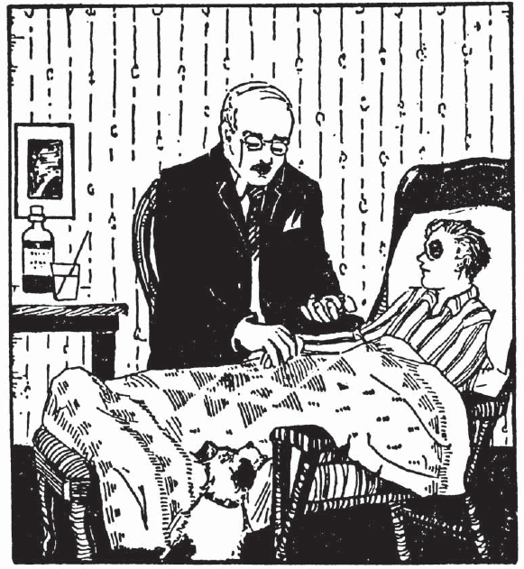

## I

Hic est puer. Hic puer est bonus. Parvus quoque est. Magnus nōn est. Altus nōn est. Pulcher nōn est. Hic puer est discipulus. Discipulus bonus quoque est. Puer est discipulus bonus. Nōn est magnus. Puer est discipulus parvus. Nōn est pulcher. Salvē, puer.

Haec est puella. Haec puella est bona. Parva quoque est. Haec puella est discipula quoque. Puella est discipula parva et pulchra. Nōn est alta et magna. Puer nōn est magnus. Puella nōn est magna. Puer nōn est pulcher. Puella est pulchra. Salvē, puella. Salvēte, puer et puella.

Haec nōn est puella. Haec est magistra. Fēmina quoque est. Magistra est magna et alta quoque. Magistra est bona et pulchra quoque. Haec fēmina nōn est magister. Magistra est fēmina. Magister nōn est fēmina. Haec est fēmina. Salvē, fēmina. Salvēte, puer et puella et magistra. Salvēte, discipulī.

Puer nōn sum. Puella nōn sum. Magistra nōn sum. Hic est puer. Haec est puella bona et pulchra quoque. Haec est fēmina bona et pulchra. Valē, puer. Valē, puella. Valē, magistra. Valēte, discipulī et magistra.

1. Quis est hic puer?
2. Quis est haec puella?
3. Quālis discipulus est hic puer?
4. Ēstne puella magna et alta?
5. Quālis fēmina est magistra?

## II

Salvēte, discipulī. Nunc hīc sunt Maria et Carolus. Hic est Carolus, discipulus bonus. Magnus nōn est. Altus nōn est. Carolus est discipulus parvus. Haec est Maria, discipula bona et pulchra et parva quoque. Maria est soror Carolī.  Carolus est frāter Mariae. Haec fēmina est māter puerī et puellae. Fēmina est Iūlia. Iūlia est fēmina, sed nōn est magistra.

Carolus Mariam amat, et Maria Carolum amat. Puer et puella Iūliam amant. Iūlia puerum et puellam amat. Carolus est fīlius Iūliae. Maria est fīlia Iūliae. Iūlia est māter bona et pulchra quoque. Fēmina magna et alta quoque est Iūlia. Iūlia nōn est magistra. Discipula nōn est. Māter est. Magistra Iūliam et puerum et puellam amat. Salvēte, Iūlia et Maria et Carole.

Iūlia nōn est māter tua. Māter Carolī et Mariae est. Estne Maria soror tua? Maria nōn est soror tua, sed est soror Carolī. Carolus nōn est frāter meus. Estne Carolus frāter tuus? Carolus nōn est frāter tuus. Nōn est fīlius tuus. Nōn est fīlius meus. Amatne magistra Iūliam? Ita, et Iūlia magistram amat. Magistra fīlium et fīliam Iūliae amat. Magister et magistra sorōrem et frātrem et mātrem amant.

Iūliam amō. Carolum amō. Carolus nōn est frāter meus. Fīlius meus nōn est, sed puerum amō. Maria nōn est soror mea, sed puellam amō. Iūlia nōn est māter mea, sed Iūliam amō.

Valēte, soror et frāter. Valē, Iūlia. Valēte, discipulī.

1. Quis est Maria?
2. Quis est Carolus?
3. Quis est Iūlia?
4. Quālis fēmina est Iūlia?
5. Amatne magistra frātrem et sorōrem et mātrem?

## III

Hīc est America, terra magna et pulchra. Carolus, frāter Mariae, Americam amat. Amatne Maria Americam? Ita. America est patria Carolī et Mariae. Frāter et māter et soror Americam amant. Fāma Americae est magna. Nunc fortūna quoque Americae est magna et bona. America nōn est īnsula. Terra longa est. Terra longa et magna et pulchra est. Cuba est īnsula. Cuba nōn est patria mea, sed Cubam amō. Britannia quoque est īnsula. Hibernia et Sicilia et Austrālia sunt īnsulae. Italia nōn est īnsula. Haec terra est longa et pulchra. Fāma Italiae est magna. Fortūna Italiae nunc est bona. Italia est antīqua, sed America nōn est antīqua. America est nova.

Americam amō. America est patria mea quoque. Estne patria tua? Amantne fīlius tuus et fīlia tua Americam? Italiam quoque amō. Terram longam amō. Hī discipulī Americam et Italiam et īnsulās amant. Viae Americae sunt bonae. Hae viae nōn sunt antīquae. Viae Americae sunt novae. Viae Italiae sunt bonae. Longae et pulchrae sunt. Viae Italiae nōn sunt novae. Antīquae viae sunt.

1. Quālis terra est America?
2. Estne America patria tua?
3. Suntne Hibernia et Sicilia īnsulae?
4. Amantne Carolus et Maria Americam?
5. Suntne viae Italiae antīquae?
6. Quālēs viās America habet?
7. Quālem fortūnam habet America?

## IV

Quis est hic? Hic est pater Carolī et Mariae. Nunc est Carolus laetus. Maria quoque est laeta. Cūr sunt puer et puella laetī nunc? Haec est causa: laetī sunt quod pater est in casā. Pater Carolī et Mariae est nauta. Agricola nōn est. In agrō nōn labōrat. Magister nōn est et in scholā nōn labōrat. In terrā nōn labōrat. Hic nauta est magnus et bonus. Fāma nōn est magna et fortūna est parva. Patria nautae nōn est īnsula, Cuba. Nōn est Britannia, Hibernia, Italia. America est patria nautae et nauta patriam amat. Pater fīlium et fīliam amat. Iūliam quoque amat, et laetus est quod nunc est in casā. Iūlia quoque est laeta quod nautam amat.

Suntne puer et puella nunc in casā? Nunc in casā nōn sunt. Ubi sunt? Hī discipulī sunt in scholā. Magistra quoque est in scholā. Schola est nova et pulchra. Fāma nōn est magna quod nōn est antīqua. Maria et Carolus in scholā esse nōn cupiunt. Haec est causa: hī discipulī in casā esse cupiunt quod pater est in casā. In scholā novā labōrāre nōn cupiunt, sed nunc labōrant. Magistra quoque labōrat.

Nunc discipulī et magistra nōn sunt in scholā. Ubi sunt? In viā longā et pulchrā sunt. Fīlius et fīlia nautae quoque sunt in viā et laetī sunt. Haec est epistula. Carolus epistulam habet. Carolus epistulam in viā portat. Epistula magistrae est. In epistulā sunt haec: “Hic puer, Carolus, in scholā nōn labōrat. In casā ubi est pater esse cupit.” Pater intellegit. Fīlius patrem cupit. Laetus est nauta quod fīlium et fīliam in casā esse cupit. Pater laetus est quod intellegit.

Nunc Iūlia labōrat. Cēnam parat. Carolus, fīlius bonus, labōrāre cupit. Māter est laeta quod fīlius labōrāre cupit. Iūlia cēnam bonam parat quod pater cēnam bonam cupit.

1. Cūr nunc sunt Carolus et Maria lactī?
2. Estne pater puerī et puellae agricola?
3. Ubi pater labōrat?
4. Quālis schola est schola Carolī et Mariae?
5. Cūr Carolus epistulam portat?
6. Intellegitne pater epistulam?

## V

Hīc est schola. Discipulī in scholā labōrant.

*Magistra:* Salvēte, discipulī.

*Discipulī:* Salvē, magistra.

*Magistra:* Quis, Carole, est pater tuus?

*Carolus:* Nauta est pater meus.

*Magistra:* Bene est. Labōratne pater tuus in Americā?

*Carolus:* Interdum, sed nōn semper in Americā labōrat.

*Magistra:* Cūr nōn semper in Americā labōrat?

*Carolus:* Haec est causa: pater nōn semper in Americā labōrat quod est nauta.

*Magistra:* Ubi, puer, habitās?

*Carolus:* In parvā casā habitō.

*Magistra:* Estne pater tuus nunc in casā?

*Carolus:* Ita, magistra, pater meus est nunc in casā, sed nōn est semper in casā. Saepe nōn est in Americā.

*Magistra:* Bene est. Videtne pater tuus multās terrās?

*Carolus:* Multās terrās et īnsulās videt. Multōs virōs et fēminās videt. Cubam et Siciliam et Hiberniam videt et laudat. Hae sunt īnsulae. Multās īnsulās videt.

*Magistra:* Estne pater tuus Americānus?

*Carolus:* Ita, Americānus est, sed nōn semper in Americā habitat.

*Magistra:* Incola Italiae, discipulī, est Italus. Incola Britanniae est Britannus; incola Hispāniae est Hispānus. Hibernus est incola Hiberniae. Intellegitisne, discipulī? Americānī sumus. Incolae Americae sumus. America est patria.
Americam amāmus. Quis, Carole, est amīcus tuus?

*Carolus:* Cassius est amīcus meus.

*Magistra:* Quis, Cassī, est pater tuus?

*Cassius:* Agricola bonus est pater meus. Agrum parat et in agrō labōrat. Interdum in agrō labōrō. Aquam portō et labōrō. Ager est magnus et longus. Pater est laetus quod fīlius in agrō labōrāre cupit. Interdum pecūniam habeō quod in agrō labōrō. Pecūniam habēre cupiō.

*Magistra:* Amīcum bonum habeō quoque. Poēta est. Italus est. Magnam pecūniam nōn habet. Fāma nōn est magna, sed bene scrībit. Amīcum meum nōn saepe videō. Epistulās scrībō et poēta epistulās scrībit. Hās epistulās laudō. Habēsne amīcās, Maria?

*Maria:* Ita, multās habeō.

*Magistra:* Estne vīta nautae perīculōsa?

*Carolus:* Nōn semper est. Interdum est. Vītam nautae laudō.

Nunc cēna in casīs est parāta et discipulī nōn labōrant. In casīs sunt.

1. Ubi nunc discipulī labōrant?
2. Cūr pater Carolī nōn semper in Americā labōrat?
3. Videtne nauta multās terrās?
4. Quī sunt incolae Americae? Britanniae? Hiberniae?
5. Quis est Cassius?
6. Ubi Cassius interdum labōrat?
7. Cūr est vīta nautae perīculōsa?

## VI

Nunc est magistra laeta. Haec est causa: Laeta est quod epistulam longam et bonam habet. Haec est epistula poētae, amīcī magistrae. Poēta in Italiā habitat. Italus est. Incolās Italīae amō. Poēta nōn est Americānus. Poēta multās epistulās bene scrībit. Magistra hās epistulās in scholā legit. Discipulī epistulās poētae laudant. Poētam vidēre cupiunt. In hāc epistulā est pictūra. Pictūra parva est. Pictūra casae poētae est. Hīc habitat hic vir. Aqua quoque est in pictūrā. Magistra pictūram spectat et discipulīs ostendit. Interdum epistulās discipulīs ostendit.

Maria quoque epistulam habet. Pater Mariae hanc epistulam scrībit. Maria est laeta ubi pater epistulās scrībit. In hāc epistulā est fābula longa. Haec fābula vītam perīculōsam nautae mōnstrat. Pater fābulās saepe nārrat. Maria epistulam legit et Carolō ostendit. Iūlia et Maria et Carolus epistulam legunt et patrem vidēre cupiunt. Fābulās dē vītā nautae semper laudant.

Carolus epistulam nōn habet. Dōnum habet. Dōnum est pecūnia et puer est laetus. Iūliae dōnum ostendit. Iūlia quoque dōnum habet. Dōnum Iūliae est pictūra magna et pulchra. Nauta Iūliae et Carolō dōna dat.

Nunc Carolus haec scrībit: “Tibi, mī pater, grātiās agō, quod mihi dōnum pulchrum dās. Ē multīs terrīs pecūniam habēre cupiō. Ego sum discipulus et multa nōn videō. Tū es nauta et multa vidēs. Britannōs, Hispānōs, Hibernōs vidēs. Fābulās tuās in epistulīs tuīs semper legō et laudō. Bene scrībis. Valē, pater.”

Ē casā Carolus dōnum portat. Nunc Maria quoque epistulam ē casā portat, et magistrae dōnum et epistulam puer et puella ostendunt.

1. Cūr nunc est magistra laeta?
2. Ubi poēta habitat?
3. Quālis pictūra est in epistulā poētae?
4. Habetne Maria epistulam?
5. Nārrā dē epistulā Mariae.
6. Quāle dōnum Carolus habet?
7. Quāle est dōnum Iūliae?
8. Quis haec dōna dat?

## VII

In silvā est casa parva et pulchra. Ibi habitat Helena, amīca Mariae. Helena est fīlia pulchra agricolae bonī. Frātrēs et sorōrēs habet. Agricola est pater benignus. Clārus nōn est quod fāma est parva, sed Helenae est benignus. Hic vir magnam pecūniam nōn habet. Helena saepe cum Mariā in silvā ambulat. Silva est alta et magna. Puellae silvam laudant quod puellīs silva est grāta. Maria Helenam amat. Maria Helenae fābulās dē Italiā nārrat et amīcae pictūrās Italiae mōnstrat. Ex fenestrā Maria silvam videt, et saepe casam Helenae spectāre cupit, sed silva est magna.

Nunc Maria fenestram aperit. Laeta est quod ibi rosās videt. Helena rosās habēre cupit. Maria in viā ambulat et rosās portat. Maria Helenae rosās ostendere cupit et Helena est laeta. Hae puellae sunt amīcae cārae. Helenae rosae sunt grātae quod rosās in casā nōn habet. Iānua Helenae est aperta. Nunc ibi est Helena.

*Maria:* Salvē, Helena.

*Helena:* Salvē, Maria.

*Maria:* Hoc est dōnum. Tibi rosās dō.

*Helena:* Tibi grātiās agō. Semper rosās cupiō. Tū es mihi benigna.

*Maria:* Tē amō, quod tū es amīca mea cāra.

*Helena:* Habēsne multās rosās? Cūrāsne tū rosās?

*Maria:* Ita, multās habeō. Ego rosās cūrō. Interdum rosās Carolus cūrat. Rosae sunt mihi grātae et hās cūrāre cupiō.

*Helena:* Cūr Carolus rosās cūrāre nōn cupit?

*Maria:* Carolus est puer et rosae nōn semper puerīs grātae sunt. Frāter meus fābulās legere cupit et in silvā cum virīs labōrat. Interdum cum amīcō, Cassiō, ambulat. Cassius Carolō est cārus quod hī sunt amīcī. Tū es mihi cāra quod tū es amīca mea. Valē, Helena.

*Helena:* Valē, Maria.

Helena iānuam claudit.

1. Quis est Helena?
2. Ubi est casa Helenae?
3. Quālis est pater Helenae?
4. Cūr est Maria laeta?
5. Cūr Helena Mariae grātiās agit?
6. Cūratne Carolus rosās saepe?
7. Cūr?

## VIII

Nunc amīcus noster, Carolus, ex fenestrā spectat. Cassium exspectat. Nunc Cassius in viā in silvā properat quod cum Carolō ad scholam ambulāre cupit. Carolus amīcum videt et iānuam aperit. Puerī ad scholam properant. Rosās portant et magistrae rosās dant. Magistra benigna amīcōs nostrōs exspectat. Hī discipulī magistrae grātī sunt et cārī quod discipulī bonī sunt et bene labōrant.

Nunc discipulī in scholā sunt et labōrant. Magistra iānuam claudit. Discipulī magnī linguam Latīnam discunt. Carolus et Cassius sunt parvī et linguam Latīnam nōn discunt. Magistra fābulās scrībit, et puerī et puellae cum magistrā legunt. Interdum discipulī fābulās nārrant. Magistra pictūrās ostendit. Hīc pictūrae īnsulae, Cubae, sunt. In hīs pictūrīs multī virī in viīs ambulant. Multa portant. Est aqua in pictūrīs. Carolō hoc est grātum quod pater est nauta et Carolus vītam nautae laudat. Ibi sunt casae parvae. Iānuae casārum sunt apertae, et in casīs fēminae et puellae cēnam parant. Virī quoque in hīs casīs habitant. Hī sunt patrēs et frātrēs puellārum.

In scholā quoque est pictūra magnae scholae Britanniae. Ibi est pictūra silvae clārae. Magistra hās pictūrās cūrat quod discipulī hās vidēre saepe cupiunt.

Nunc discipulī ē scholā properant et magistra nōn labōrat.

1. Cūr Cassius nunc in viā properat?
2. Quis puerōs exspectat?
3. Quālēs discipulī sunt ht?
4. Quī linguam Latīnam discunt?
5. Quālēs pictūrae sunt in scholā?
6. Cūr magistra hās pictūrās bene cūrat?

## IX

Carolus noster nōn est laetus. Ad scholam nōn properat. In casā sōlus est. Amīcus noster nōn labōrat. Nōn legit. Nōn scrībit. Miser est. Haec est causa: aeger est. Māter quoque est misera quod fīlius est aeger. Iūlia puerō aquam dat et Carolus mātrī grātiās agit. Carolus est sōlus in casā quod māter ē casā ambulat et rosās cūrat. Maria est in scholā et rosās nōn cūrat. Puerī magnī nunc linguam Latīnam in scholā discunt, sed Carolus cum discipulīs nōn labōrat.

Noctū puer aeger ex fenestrā spectat. Lūna est clāra et magna. Stēllae quoque sunt pulchrae. Puer lūnam et stēllās spectat. Interdum est lūna obscūra, et stēllae quoque sunt obscūrae. Nunc medicus ad casam ambulat. Puer medicum exspectat, sed medicus est tardus. Tardus nōn saepe est. Ubi in silvā magnā ambulat, lūna est obscūra et viam nōn videt. Ubi ex silvā properat, stēllae et lūna sunt clārae et bene est quod medicus properat. Medicus est vir benignus. Amīcus puerōrum est, et benignus puerīs. Nunc iānua casae nautae est aperta et medicus puerum aegrum spectat.

Interdum Maria epistulās ad frātrem portat. Hae epistulae sunt grātae. Cassius hanc epistulam scrībit. In epistulā sunt haec:

> Miser sum, amīce cāre, quod tū nōn es in scholā. Esne aeger? Estne medicus in casā tuā? In scholā discipulī sunt miserī quod tū es aeger. Fābulās legimus et nārrāmus. Puerī magnī linguam Latīnam bene discunt. Nunc ego epistulam scrībō. Valē, Carole.

1. Cūr est Carolus miser?
2. Cūr est Carolus sōlus?
3. Ubi est medicus?
4. Cūr medicus viam nōn clārē videt?
5. Quis epistulam scrībit?
6. Quis epistulam ad Carolum portat?

## X

Nox nōn est. Lūna et stēllae nōn videntur. Obscūrae sunt. Vesper est. Cum vesper est, agricolae ex agrīs ad casās properant. Fēminae in casīs cēnam parant. Discipulī; in viīs ad casās properant cum est vesper.

In casā Iūliae Carolus vidētur quod iānua est aperta. Ibi Carolus stat et discipulōs exspectat. Hodiē miser nōn est. Laetus est. Hodiē in casā est sed nōn est aeger. Herī medicus erat in casā et puerō medicīnam dabat. Herī puer erat aeger. Cum puerī sunt aegrī, nōn sunt impigrī. Hodiē Carolus nōn est aeger et miser. Impiger est. Legere et scrībere cupit, sed ad scholam nōn ambulat quod via est longa. Hodiē nōn est sōlus. Carolus cum mātre rosās cūrat. Nunc est vesper. Puer in casā stat et sorōrem et discipulōs exspectat. Maria est tarda quod cum amīcā, Helenā, ad aquam ambulat.  Maria epistulam magistrae portat et Carolus hanc epistulam exspectat.

Herī medicus puerō pecūniam dedit. Nunc puer pecūniam habet. Cūr medicus pecūniam dedit? Haec est causa: medicīna puerō nōn erat grāta, et medicīnam habēre nōn cupiēbat. Medicus puerum esse aegrum vidēbat et puerum medicīnam habēre cupiēbat. Puerō pecūniam dedit et puer erat bonus. Pecūnia nōn erat magna. Puer medicō grātiās agēbat.

Nunc Carolus in casā stat. Discipulōs exspectat et laetus est.

1. Cūr herī medicus Carolō pecūniam dedit?

## XI

Aestās est. Aestāte Carolus et Maria in scholā nōn semper labōrant. Hodiē in casā nōn manent. In silvā et agrō nōn manent. In viā ad oppidum ambulant. Laetī sunt quod est aestās. Ex viā silvam pulchram vident. Ibi tēcta magna nōn vident, sed tabernācula sunt in silvā. Aestāte puerī, amīcī Carolī, in tabernāculīs manent quod tēcta oppidōrum nōn sunt grāta. Haec tabernācula sunt parva sed puerōs tegunt. Carolus tabernācula videt et laudat.

Herī Carolus nōn erat aeger sed impiger nōn erat. Hodiē validus est quod herī medicus medicīnam ad casam portāvit. Laetī sunt puer et puella quod cum mātre ad oppidum ambulant. Diū in oppidō manent quod multa vidēre cupiunt. Viās et tēcta magna et multōs virōs et fēminās spectāre cupiunt. Cum in viā stant, Maria dōna multa et pulchra in fenestrīs magnīs videt. Maria saltat quod est laeta. Dōna habēre cupit, sed magnam pecūniam nōn habet.

Diū in oppidō māter et fīlius et fīlia manent. Cum vesper est, ad casam properant. In viā māter hoc dīcit: “Hodiē tū, Carole, puer bonus in oppidō erās. Hoc est praemium.” Carolus est laetus et saltat. Quid est praemium? Praemium est pecūnia.

Māter hoc quoque dīcit: “Hodiē tū quoque, Maria, puella bona erās. Tibi quoque praemium dō.” Quid est praemium puellae? Hoc praemium est pictūra magna et pulchra. Puella est laeta et saltat. Puer et puella “Tibi, māter, grātiās magnās agimus,” respondent.

1. Quid herī Carolus et Maria faciēbant?
2. Cūr erant tabernācula in silvā?
3. Quid puer et puella in oppidō vidēbant?
4. Quid erat praemium Mariae?
5. Quid māter Carolō dabat?
6. Cūr māter haec praemia dabat?

## XII

Interdum, ubi aestās est et agricolae in agrīs labōrant, discipulī in scholā manēre nōn cupiunt. Diū ex fenestrīs silvam spectant. Post scholam est aqua et ibi puerī et puellae esse cupiunt. Carolus et Cassius tabernāculum habent sed hoc est domī. Mox tabernāculum erit in silvā. Tabernāculum est validum et puerōs tegit. Tabernāculum est praemium quod hī puerī multās hōrās aquam ad agricolās portābant.

Herī vesperī Carolus et Cassius domum nōn iērunt. Ad aquam iērunt. Diū ibi mānsērunt. Multum dē tabernāculō, dē hōrīs grātīs aestātis dīxērunt. Post ūnam hōram magistra hoc dīxit: “Bonī puerī domum eunt, sed malī puerī post scholam in aquā manent.” Magistra sōla in oppidum iit. Nōn erat laeta; nōn saltāvit.

In tēctīs puerōrum mātrēs erant miserae. Diū puerōs exspectāvērunt, sed fīliōs suōs nōn vīdērunt.

“Ubi est fīlius meus?” dīxit māter Carolī. Maesta erat et diū lacrimābat. Hōrae erant longae quod puerum exspectābat. Mox Carolum vocāvit. Diū vocābat.

Maria, soror Carolī, sōla domum iit. “Ubi est frāter tuus?” dīxit māter.

“Cum Cassiō ad aquam iit,” respondit puella.

Māter domō iit et ubi iānua tēctī clausa erat, puerum vocāvit. “Carole! Carole!” Diū māter vocābat.

Nunc puerī sunt in silvā. Nox est et lūna est obscūra. Viam nōn vident. Maestī sunt et lacrimant. Māter quoque lacrimat quod fīlium suum nōn videt.

“Mātrem meam vidēre cupiō,” dīcit Carolus.

Māter ad silvam ambulat. Mox puerōs videt et vocat. Nunc puerī nōn sunt maestī et nōn lacrimant quod mātrem Carolī vident. Laetī sunt et saltant.

Nunc vesperī puerī post scholam nōn manent.

1. Quid cupiunt discipulī ubi aestās est?
2. Ubi est aqua?
3. Ībantne Carolus et Cassius domum cum Maris?
4. Cūr?
5. Quid post ūnam hōram magistra dīxit?
6. Cūr erant mātrēs miserae?
7. Quid māter dīxit ubi Maria domum vēnit?
8. Ubi erant puerī?
9. Vīditne māter puerōs ibi?

## XIII

Grātus est hortus Iūliae. Ibi sunt rosae et līlia alba. Hortus est post casam. In oppidō nōn sunt multī hortī. Hortus post ūnum tēctum est. Hortus medicī est. Fīliae medicī in hōc hortō nōn labōrant. Rosae et multī aliī flōrēs sunt in hortō medicī. Hieme nūllī flōrēs sunt in hortīs. Aestāte multōs flōrēs ibi vidēmus.

Claudius est vir ā quī hortum medicī cūrat. Multās hōrās ibi labōrat. Mox hiems erit, sed Claudius hiemem nōn laudat. Tum Claudius maestus erit quod nūllōs flōrēs suōs vidēbit, sed nōn lacrimābit. Claudius nōn est agricola nunc. Diū in silva habitābat at et erat agricola. Aeger erat et in silvā manēre nōn cupiēbat. Nunc in oppidō habitat et labōrat. Saepe Claudius silvam et agrōs vidēre cupit. Claudius est amīcus agricolae, patris Cassī, et saepe ad tēctum agricolae it. Tum mutta dē oppidō et dē hortō nārrat. Tum colloquium est longum. Cassius colloquium grātum audit et est laetus.

Agricola multum frūmentum in agrō habet quod duōs equōs habet. Pater Cassī Claudiō frūmentum et equōs suōs mōnstrat. Hieme in agrō nūllum frūmentum est. Aestāte ibi est multum frūmentum. Hī equī frūmentum cupiunt. Cassius equīs frūmentum dat, sed ūnus ex equīs nōn stat cum Cassius frūmentum dat. Equus malus est. Cassium audit et timet. Nūllum perīculum est, sed equus hoc nōn intellegit. Cassius hunc malum equum timet.

Nunc est nox et quiēs est in terrā. Virī et equī nōn labōrant. Equī in stabulō stant et quiētem capiunt. Agricola et Claudius cēnam edunt. Post cēnam fābulās nārrant. Ubi quiētem cupit, Claudius domō agricolae ad domum medicī it. Sōlus est et multa audit, sed nōn timet.

1. Quis est Claudius?
2. Quid facit?
3. Cūr nunc in oppidō labōrat?
4. Quid Claudius et agricola faciunt ubi in casā agricolae sunt?
5. Quid agricola Claudiō mōnstrat?
6. Nārrā dē ūnō equō agricolae.

## XIV

Herī multās hōrās nauta domī manēbat. Sōlus nōn erat. Amīcus cum patre Carolī manēbat.

Hic amīcus est mīles validus. In bellīs pugnat. Dux mīlitum est et mīlitēs hunc ducem laudant. Arma mīlitis sunt gladius et galea: Multa tēla habet sed haec in casā nautae nōn sunt. Domī sunt. Carolus et Maria mīlitem laudant. Hic dux quī multa dē bellīs Rōmānīs nārrat est mīles Italus. Arma Rōmāna antīqua erant gladī, scūta, galeae, pila. Alia arma quoque habēbant Rōmānī. Castra Rōmāna erant magna et longa et lāta. Noctū mīlitēs in castrīs manēbant quod erant dēfessī et quiētem cupiēbant.

Multī ducēs Rōmānī erant bonī. Aliī erant malī. Tum mīlitēs hōs ducēs nōn laudābant. Caesar erat dux Rōmānus bonus. Cōnsilia Caesaris erant bona et saepe grāta. Interdum, ubi Rōmānī in bellō erant, Caesar cum mīlitibus pugnābat. Gladium et scūtum portābat. Equī quoque erant in bellīs. Perīculum equīs nōn grātum erat. Carolus fābulās mīlitis audit et laudat.

Virī Americānī interdum sunt mīlitēs. Multa tēla habent. Scūta nōn habent. Rōmānī antīquī scūtīs magnīs et lātīs tegēbantur. Scūta ā ducibus et mīlitibus portābantur. Americānī scūtīs nōn teguntur.

Mīles Italus hortum Iūliae laudat. Rosās et līlia alba et aliōs flōrēs laudat. Dē flōribus Italiae nārrat sed nūllum hortum habet.

Mīles et nauta ad domum agricolae eunt. Agricola hīs amīcīs duōs equōs mōnstrat. In stabulō sunt equī. Mīles multa dē equīs intellegit et malum equum agricolae nōn timet. Nūllum perīculum est. Mīles huic equō frūmentum dat. Virī ab hōc equō nōn timentur, sed puerī nōn sunt grātī. Duo equī frūmentum cupiunt. Nunc mīles et nauta et agricola cēnam edunt. Post cēnam mīles et nauta ad domum nautae eunt.

Cum hiems est, mīles domī est. In Italiā habitat. Tum Carolus colloquium mīlitis et patris nōn audit sed epistulās mīlitis legit et laetus est. Italiam vidēre cupit.

“Vītam mīlitis laudō,” inquit puer.

1. Cūr herī pater domī manēbat?
2. Quae sunt arma mīlitis?
3. Dē quibus mīles nārrābat? (Multa nārrā.)
4. Quid mīles laudat?
5. Timetne mīles ūnum malum equum agricolae?
6. Cūr?

## XV

Hodiē Carolus et Cassius et Maria et Helena in casā nautae manent. Fābulās legunt et pictūrās spectant. In ūnā pictūrā sunt trēs puerī Rōmānī quōs Carolus et Cassius maximē laudant. Ā sinistrā est prīmus puer, Marius nōmine. Manlius est nōmen secundī puerī quī est puer medius quoque. Ā dextrā est tertius quī est parvus. Hic est Lūcius. Nunc Cassius fābulam legit. Carolus et puellae audiunt.

Hī trēs puerī mīlitēs esse cupiunt, sed nōn sunt magnī. Numquam in bellō fuērunt, sed patrēs puerōrum multīs in bellīs fuērunt. Marius quattuor frātrēs quī in bellō pugnābant habet. Lūcius est fīlius ducis bonī. Rōmānī antīquī bellum et arma et tēla laudant. Hieme nōn pugnant sed aestāte vīta mīlitum est saepe perīculōsa. Interdum mīlitēs sunt aegrī et dēfessī. Saepe domōs vidēre cupiunt.

“Quid prīmus puer, Marius, facit? Marius est dux mīlitum quī iaculum longum sed nōn lātum portat. In eius capite est galea. Scūtō tegitur: ā sinistrā est gladius eius. Manlius quoque arma et tēla portat. Scūtum et pīlum habet. Lūcius est sagittārius et sagittās capit. Animal nigrum quod post puerōs stat est equus ducis. Mox equus ducem ad hortum ubi sunt castra portābit. Mox erit bellum magnum.”

Haec fābula est grāta puerīs, Carolō et Cassiō, quī mox ad stabulum agricolae eunt. Mox cum equō et armīs et tēlīs ad hortum eunt. Ibi sunt mīlitēs sed nūllum perīculum est.

“Nunc, mīlitēs,” inquit dux, Cassius, “est perīculum magnum. Cōnsilium bonum habeō. Cōnsilium meum mōnstrāre cupiō.”

Maria et Helena eās fābulās nōn laudant. Nunc eae nōn sunt mīlitēs sed fēminae. Casam cūrant et cēnam parvam quae est nunc in mēnsā parant. Sōlae in casā cēnam edunt.

1. Quī sunt Lūcius, Marius, Manlius?
2. Ubi hī trēs puerī stant?
3. Cūr hī puerī arma portant?
4. Quae arma sunt haec?
5. Quid mox puerī facient?
6. Cūr puerī mīlitēs esse cupiunt?

## XVI

Quid hodiē faciunt Carolus et Cassius? Herī Carolus ad tēctum Cassī invītātus est. Vesperī per agrum ambulābat. Nūllum equum habēbat. Arcum, dōnum patris, et quattuor sagittās portābat quod māne cum Cassiō per silvam īre et multa animālia capere cupiēbat. Māne puerī sunt laetī. Māne omnēs rēs sunt parātae. Cassius equum nigrum et carrum habet. In carrō multae rēs portantur. Sagittae, frūmentum, arcūs, cēna puerōrum sunt in carrō. Iacula nōn portant, quod nunc sagittāriī, nōn mīlitēs, sunt.

“Valēte,” inquit māter.

“Valē,” inquiunt puerī quī nunc in carrō sunt. Equus niger, cuius nōmen est “Pulcher, ” validus est. Per agrōs in viīs lātīs properat. Ā dextrā et ā sinistrā omnēs rēs puerīs sunt grātae. Subitō equus ē viā currit.

“Pulcher aliquid videt et timet,” inquit Cassius. “Quid est?”

Tum trāns viam prīmum parvum animal currit. Carrum et equum videt et timet et per agrum properat. Mox secundum et tertium animal trāns viam ante equum currunt.

Nunc equus in viā nōn fortiter currit quod tria animālia timet. In mediā viā stat et currere nōn cupit. Puerī nōn timent et “Properā, Pulcher,” inquiunt. “Nūllum est perīculum. Es tūtus.” Ubi animālia nōn videntur, Pulcher bene currit.

Post ūnam hōram prope puerōs est aedificium. “Habitatne aliquis ibi?” inquit Carolus ubi ad aedificium venit.

“Numquam ibi virōs et fēminās vīdī,” respondet Cassius. Ubi in tēctum puerī veniunt, omnia spectant. Hīc est mēnsa. In illō locō est pictūra mīlitis quī in capite galeam habet. Scūtum et iaculum et gladium habet. Hīc aliquis habitāvit. Diū puerī in aedificiō manent. Hīc cēnam edunt. Post cēnam ex aedificiō currunt et in manibus arcūs et sagittās portant. Animālia vident sed nūllum capiunt. Mox est vesper et puerī dēfessī domum eunt. Equus nunc domum et ad stabulum, in quō frūmentum est, laetē currit.

“Ubi,” inquit māter, “sunt animālia?” Puerī nunc in tēctum veniunt et omnia nārrant.

“Multa vīdimus sed nūllum cēpimus,” respondent puerī. “Multās hōrās in aedificiō manēbāmus. Mox erat vesper et dēfessī erāmus.”

Mox Carolus domum it. In manibus sagittās sed nūllum animal portat. Ubi Carolus ad tēctum Cassī invītātur, laetus est.

1. Cūr Carolus ad casam Cassī it?
2. Quid portat?
3. Quid puerī in carrō portant?
4. Cūr equus ē viā currit?
5. Nārrā dē aedificiō.
6. Cēpēruntne puerī multa animālia?

## XVII

Herī Carolus in carrō per silvam ībat. Ubi domum cum arcū et sagittīs vēnit, laetus erat quod mīles Italus erat in casā. Multōs diēs ibi mīles manēbat. Multās rēs dē Rōmānīs antīquīs et dē Gallīs nārrābat. Pictūrās puerō et puellae ostendit quoque. Gallī erant fīnitimī Germānōrum. In Galliā prope Germānōs habitābant. Germānī erant fīnitimī Gallōrum, sed Gallī et Germānī nōn semper erant amīcī. Semper Germānī bellum cupiēbant. Sī Gallī satis magnās cōpiās nōn habēbant, saepe in perīculō erant.

Rōmānī sociōs habēbant. Sociī erant amīcī Rōmānōrum. Sī Rōmānī auxilium habēre dēbēbant, sociī auxilium dare semper parātī erant. Sī sociī in perīculō erant, auxilium Rōmānōs rogābant. Tum dux “Nunc, incolae Rōmae,” inquit, “hī sunt sociī nostrī. Auxilium sociīs dare dēbēmus.” Tum iterum cōpiae Rōmānae ad sociōs trāns agrōs properābant.

Hae fābulae grātae erant puerō quī vītam mīlitis semper laudābat. “Mīles fortis,” inquit, “esse cupiō. Ubi vir erō, mīles erō, et per tēla, per multa perīcula cum duce meō properābō. Equum habēbō, Parātum nōmine. Sī perīculum erit magnum et mīlitēs omnibus in locīs morientur, sociōs nostrōs auxilium rogābō. Sociōs dē perīculō nostrō monēbō. Ego et Parātus ad oppidum sociōrum ībimus et epistulam in manibus meīs portābō. Ante sociōs stābō et cōpiam frūmentī rogābō. Sī fortēs erimus, ego et Parātus, dux nōbīs praemium dabit. Equum bonum habēre dēbeō. Equus bonus in bellō fortiter curret et tūtus erō. Incolae nostrī post bellum mē laudābunt et fāma mea multīs in terrīs erit magna. Aliquis mē ducem magnum vocābit.”

Subitō post hās fābulās Carolus ‘“Cupisne crās hās fābulās Cassiō, amīcō meō, nārrāre?” rogābat.

“Ita,” inquit mīles. “Sī ita cupiēs, māne posterō diē ad scholam ībō et omnibus discipulīs fābulās dē patriā meā, dē aedificiīs oppidī meī, dē bellīs antīquīs nārrābō.”

Nunc est nox. Diēs in terrā nōn manet. Puer, amīcus noster, est laetus quod māne posterō diē mīles ad scholam venīre invītātur. Fābulae omnibus discipulīs erunt grātae.

1. Cūr erat Carolus laetus ubi domum vēnit?
2. Quī erant Gallī?
3. Quālēs fīnitimī erant Germānī?
4. Quid sociī faciēbant sī erant in perīculō?
5. Quid Carolus faciet ubi mīles fortis erit?
6. Quem ad locum mīles invītātur?
7. Cūr?

## XVIII

Mīles Italus scholam vīsitāvit. Posterō diē domum iit. Posteā discipulī multās rēs dē bellīs antīquīs et novīs legēbant. Saepe in silvā post scholam omnēs erant mīlitēs. Hī erant Italī, illī Americānī, hostēs Italōrum. Hī prō Italiā, illī Americā pugnābant.

Herī multī Italī vulnerātī sunt et sociōs auxilium rogābant. In magnō perīculō nūllus erat timidus. Fīnitimī auxilium dabant. Dux Italus, Cassius, sagittā hostis paene necātus est. Dē perīculō ab amīcīs monitus est, sed castra in perīculō erant et paene sōlus dux prope castra pugnābat. Multōs mīlitēs aliīs in locīs esse necesse erat.

“Cūr auxilium ab amīcīs nōn accipiō?” rogābat dux vulnerātus. “Amīcī meī parātī esse auxilium dare dēbent, quod ego sum dux, paene necātus. Neque arma habeō neque satis magnae cōpiae adsunt. Auxilium nōn adest. Sī hostēs mē sine auxiliō vidēbunt, mox mē necābunt et hīc sōlus moriar.”

Tum per agrōs ūnus ē sociīs ducem vīdit et vēnit. “Ecce!” inquit dux vulnerātus. “Nunc sine auxiliō nōn manēbō. Socius meus adest. Crās huic sociō praemium dabō.”

Prope castra Americāna ille dux, Carolus, erat vulnerātus. Oculī gladiō hostis vulnerātī sunt. “Nunc,” inquit ille dux, “maestus Sum quod caecus sum. Numquam iterum agrōs meōs vidēbō. Neque iterum patriam meam vidēbō neque tēla in manibus portābō et prō patriā pugnābō. Necesse erit semper cum amīcīs ambulāre.”

Dux caecus auxilium esse prope nōn putābat. Sē caecum esse putābat. Sē caecum semper futūrum esse putābat. Mox ē perīculō portātus est et posterō diē medicus oculōs cūrāvit Posteā ille dux nōn erat caecus.

Herī, cum Carolus epistulam accēpit, haec lēgit: “Iterum posterā aestāte in Americā aderō.” Quam laetī Carolus et Cassius illum diem exspectant.

1. Quī in hāc fābulā erant Italī et Americānī?
2. Cūr dux Italus sōlus prope castra pugnābat?
3. Quid hic dux dīxit?
4. Cūr crās dux Italus sociō praemium dabit?
5. Cūr erat dux Americānus maestus?
6. Eritne semper caecus?

## XIX

Aestās est. Quis est in scholā? Omnēs absunt, quod aestāte iānua scholae clausa est, et magistra discipulīque nōn adsunt. Ubi nunc sunt Carolus Mariaque? Ad Eurōpam cum patre mātreque eunt. Multōs diēs terram nōn vidēbunt. Neque terram neque aedificia vidēbunt. Cum pater rogābat, “Cupitisne mēcum ad Eurōpam īre?” omnēs respondērunt, “Ita, hoc est grātum. Hoc dēsīderāmus. Eurōpam vīsitāre cupimus.”

Multōs diēs domī puer puellaque multās rēs dē Eurōpā legēbant. Hās rēs legēbant: Gallia erat terra magna ubi hostēs Rōmānōrum antīquōrum habitābant. Gallī vocābantur. Rōmānī cum Gallīs ācriter pugnābant. Multī vulnerābantur et necābantur. Aliī erant caecī. Rōmānī agrōs Gallōrum vāstābant et oppida occupābant. Posteā, ubi Rōmānī auxilium dēsīderābant, hoc ā Gallīs postulābant. Aliās rēs dē Rōmā Carolus legēbat. Rōma erat oppidum antīquum. Flūmen per Rōmam fluit. Circum Rōmam antīquam erat mūrus. Rōmānī hōc mūrō ab hostibus tegēbantur. Multī hostēs ad mūrum veniēbant quod Rōmam dēsīderābant. Iacula, pīla, sagittās iaciēbant. Rōmānī erant fortēs. Mīlitēs nōn erant timidī. Auxilium ā sociīs saepe postulābant et accipiēbant. Hās rēs dē Britanniā legēbant: Rōmānī antīquī ad Britanniam vēnērunt. Britannī erant īrātī. Rōmānī agrōs Britanniae occupābant. Hoc Britannī nōn dēsīderābant. Tēla in Rōmānōs iaciēbant sed propter ducem bonum Rōmānī erant fortēs. Prō patriā ācriter pugnābant. Maria aliud flūmen in Eurōpa vidēre cupit. Hoc est flūmen pulchrum, cuius nōmen est Rhēnus. Inter Gallōs antīquōs et Germānōs fluit. Prope flūmen sunt aedificia grāta. “Illud flūmen,” inquit Maria, “mihi erit grātum.”

Carolus vītam nautae esse bonam putat et diū cum nautīs colloquium habet. Māter aegra diū fuit. Iterum terram vidēre cupit. Oculī sunt dēfessī quod māter semper aquam spectat. Māter nōn est nauta bonus. Timida quoque est.

“Paene,” inquit Maria, “terram videō, sed ibi nūllōs amīcōs vidēbō. Sine amīcīs nōn laeta erō.’ Tum Maria paene lacrimat, sed nōn lacrimat.

Carolus respondet, “Puellae semper lacrimant. Amīcōs nōn dēsīderō. Multās et novās terrās vīsitābō, et hoc est satis.”

Subitō aliquis clāmat. “Ecce! Ecce!” inquit. “Terra est! Est Britannia!” Omnēs parātī esse iubentur et mox Carolus et Maria in terrā novā stant. Quam laetī sunt omnēs!

1. Ubi nunc sunt Carolus Mariaque?
2. Dē quibus rēbus puer puellaque legēbant?
3. Cūr erat Rōma valida?
4. Cūr erant Britannī īrātī?
5. Cūr māter nōn est laeta?
6. Cūr Maria paene lacrimat?
7. Quid aliquis clāmat?

## XX

Is quī in illō locō stat est avunculus puerī puellaeque. Est frāter Iūliae. Avunculus Iūliam et nautam et Carolum et Mariam diū exspectat. Undique circumspectat et nunc eōs videt. Avunculus omnēs salūtat. Mox omnēs ad domum avunculī eunt. Puer puellaque multa rogant et avunculus nārrat. Tēctum avunculī parvum sed grātum vidētur. Inter tēctum et viam est hortus pulcher. Circum hortum est mūrus quī hortum tegit sī aliquis eum vāstāre cupit. Flūmen parvum prope tēctum fluit.

Posterō diē omnēs ā tēctō avunculī eunt. Ruīnās mūrī antīquī vident. Ōlim Rōmānī ad hanc īnsulam vēnērunt quod sociōs novōs dēsīderābant. Hic erat mūrus antīquissimus quī erat dux Rōmānōrum. Īnsulam oppugnāre et occupāre cupiēbat. Armātī erant Britannī et, ubi hostēs, Rōmānōs, vidēbant, īrātī erant. Itaque diū Rōmānī ad terram ab aquā venīre nōn audēbant. Diū in aquā manēbant. Subitō vir fortis, quī perīculum vidēbat, clāmābat. “Properāte, mīlitēs!” inquit. “Britannōs armātōs oppugnāte!” Ita mīlitēs iubēbat. Itaque mīlitēs ācriter pugnābant. Posteā Caesar mīlitēs probābat quod hoc audēbant. Rōmānī iacula et alia tēla iaciēbant et Britannōs superābant. Propter perīculum magnum huius bellī sociī ab Eurōpā vēnērunt et Caesarem iūvērunt. Populus Rōmānus multās aliās terrās occupāvit. Quamquam Caesar erat dux bonus, tamen multōs inimīcōs Rōmae habēbat. Posteā hī eum necāvērunt.

Undique pater māterque circumspectant. Flūmina et aliās rēs Britanniae laudant. “Habetne nunc Britannia hostēs quī īnsulam occupāre et vāstāre cupiunt?” rogat Carolus.

“Minimē,” respondet avunculus, “sed posteā propter hostēs ā sociīs auxilium postulābant.”

Mox Carolus et Maria ā Britanniā aberunt. In aliā terrā, Germāniā, erunt.

1. Quis Americānōs salūtat?
2. Quāle est tēctum avunculī?
3. Ubi sunt hortus et mūrus et flūmen?
4. Quī mūrum antīquissimum fēcērunt?
5. Nārrā fābulam dē duce Rōmānō quī aliōs mīlitēs properāre et oppugnāre iubēbat.
6. Quid Carolus rogat?
7. Quid avunculus respondet?

## XXI

Ubi est avunculus? Is abest. Domī in Britanniā manet. Itaque sine amīcīs quattuor Americānī per Germāniam eunt. Ibi nūllī amīcī eōs salūtant, sed omnōs Germāniam probant quod populus est benignus et Americānīs nōn est inimīcus. Quamquam agrī et silvae sunt grāta, et Americānī rūs laudant, oppida, quoque, sunt pulchra. Per terram Germānōrum flūmen Rhēnus fluit. Si Carolus undique circumspectat multōs agrōs prope flūmen videt. Ruīnās aedificī antīquī videt. Carolus fābulās dē Germāniā legit.

Ōlim Germānī erant barbarī quī cum Rōmānīs pugnābant. Trāns flūmen Gallī quī erant Germānīs)inimīcī habitābant. Illī barbarī agrōs Galliae saepe oppugnābant occupābantque et oppida eōrum dēlēre cupiēbant, nam hostēs erant. Interdum Gallī ā Rōmānīs auxilium postulābant, nam sōlī cum barbarīs sine satis magnīs cōpiīs pugnāre nōn audēbant. Posteā Caesar barbarōs superāvit et multōs in vincula iēcit. Gallī Caesarem iūvērunt. Ubi Carolus hās rēs dē Caesare et barbarīs legit eum omnēs rēs dē bellō scīre putat.

In viā oppidī in quō Carolus nunc manet vir caecus saepe stat. Ōlim erat mīles Germānus. Nunc nōn est armātus. Celeriter nōn ambulat. Tardus et caecus est. Sine amīcīs et pecūniā vīta eius nōn est semper grāta. Quamquam pecūniam nōn postulat, Carolus, tamen, eī pecūniam dat.

“Cūr es caecus?” rogat puer.

Nocte ubi mīlitēs dormiēbant, castra nostra ab hostibus expugnābantur,” respondet vir. “Paene dēlēta sunt. Sine auxiliō prope ruīnās aedificī manēbāmus. Sociī perīculum nostrum esse magnum nōn sciēbant. Diū auxilium sociōrum exspectābāmus.”

“Quis tē servāvit?” rogat Carolus.

“Socius meus quī aderat mē servāvit,” inquit vir, “et mē ab hostibus mōvit. Nōs nōn vidēbāmur quod erat nox. Quamquam oculī meī vulnerātī erant, tamen socius meus mē iuvābat et ab hostibus nōn captī sumus.”

Mīles caecus socium suum semper laudat.

1. Habentne Americānī multōs amīcōs in Germāniā?
2. Quālēs ōlim erant Germānī?
3. Quid ōlim facere cupiēbant?
4. Cūr Gallī ā Rōmānīs auxilium postulābant?
5. Cūr est hic vir caecus?
6. Quis hunc virum iuvābat?

## XXII

Nunc post multōs diēs Carolus ūnum amīcum novum in Germāniā habet. Amīcus est servus quī tēctum medicī cūrat. Servus linguam Carolī intellegit nam ōlim in Americā habitāvit. Hodiē nōn labōrat, sed cum Carolō per silvam errat. Puerī duōs equōs nigrōs habent. Fī celeriter ad silvam currunt. Carolus equum suum incitat quod īre celeriter cupit. Via est lāta et facilis et mox puerī in silvā sunt. Nūllae bēstiae perīculōsae hīc errant nam silva nōn est locus perīculōsus. Bēstiae ferae, sed parvae per tōtam silvam errant. Servus nōmina omnium bēstiārum scit. Grātum est Carolō cum amīcō novō per silvam errāre. Ubi rūrī est, laetus est.

Tōtum diem servus et Carolus in silvā manent. Cum est tempus domum īre, puerī aliā viā eunt. Servus locum quī ōlim erat domus barbarōrum mōnstrat. Ubi barbarī dormiēbant, oppidum antīquum expugnātum et dēlētum est. Multī barbarī vulnerātī et necātī sunt. Cēterī quī servātī sunt in vincula iacta sunt. Carolus hās fābulās laudat et servō aliās fābulās dē barbarīs quī ōlim in patriā suā habitābant nārrat.

Nunc equī nigrī sē nōn celeriter movent. Diēs longus fuit sed grātus. Servus ā Carolō ad Americam invītātur. Facile nōn erit ad Americam īre, nam servus magnam pecūniam nōn habet.

Nocte Carolus epistulam ad Cassium scrībit. Haec dīcit: “Mox Italiam vīsitābimus. Italia erit mihi omnium terrārum grātissima. Cēterās terrās laudō, sed Italiam amō. Amīcus meus novus est puer Germānus quem laudō. Nunc est tempus ad Italiam īre parāre. Valē, Cassī.”

1. Quis est amīcus novus Carolī?
2. Ubi Carolus et servus errant?
3. Estne silva locus perīculōsus?
4. Cūr?
5. Quid puerī vidēbant ubi domum veniēbant?
6. Cūr nōn erit facile servum ad Americam īre?
7. Quem locum mox Americānī vīsitābunt?

## XXIII

Hodiē omnēs Americānī laetī sunt quod in Italiā sunt. Hīc mīles, amīcus patris, et poēta, amīcus magistrae, habitant. Hī duo virī Rōmae tēcta habent et paucōs diēs Americānī Rōmae manent. Tēctum mīlitis est magnum et ex māteriā tactum. Tēctum multās rēs pulchrās habet. Pater mīlitis multōs servōs habet. Pater nōn est dominus dūrus. Omnēs servī, igitur, eum laudant. Nūllus servus perfidus inter servōs est. Cum dominus imperat, omnēs statim pārent.

Antīquīs temporibus Rōmānī multōs servōs habēbant. Ita mīles nārrat. Multās rēs faciēbant. Labor eōrum nōn erat semper facilis. Lignum portābant: agrōs cūrābant: cēnās parābant; paucī servī erant magistrī puerōrum puellārumque. Aliī erant servī quī in bellō captī sunt. Sī servī erant perfidī, interdum diū in vinculīs tenēbantur. Servīs perfidīs vincula nōn erant grāta. Paucī necābantur. Tum cēterī servī maestī et timidī erant. Facile nōn erat servum bonum esse, sī dominus malus dūrusque erat. Interdum ā tēctō dominī servī mittēbantur. Saepe sē in fugam dabant. Tum sine auxiliō per tōtam terram errābant. Interdum cum bēstiīs ferīs pugnāre iubēbantur. Interdum servī ā ducibus incitābantur et posteā bellum erat. Animus servī bonī prō dominō suō pugnāre semper parātus erat. Sī dominus et servus in perīculō erant, servus nōn sē, sed dominum servābat. Multī servī vītam dūram agēbant ubi dominī erant saevī.

“Servōs in Americā nōn habēmus,” inquit Maria.

“Ōlim servōs habēbātis,” respondet mīles. “Servī vestrī erant Āfricānī et dominī saepe erant saevī.

“Ita, sed ūnus vir, dux magnus, repertus est. Is servīs nōn erat inimīcus,” respondet Maria. “Bellum magnum, tamen, inter populōs terrae nostrae erat. Hodiē omnēs sunt amīcī. Incolae inter sē animō bonō sunt. Hoc bellum memoriā tenēre nōn cupiō.”

Nocte Maria omnēs rēs quās hodiē vīdit et audīvit in epistulā scrīpsit. Eam ad magistram mīsit.

1. Quī amīcī Americānōrum Rōmae habitant?
2. Quāle tēctum pater mīlitis habet?
3. Quālis dominus est hic?
4. Nārrā dē vītā servōrum Rōmānōrum quī antīquīs temporibus Rōmae habitābant.
5. Habēbantne ōlim Americānī servōs?
6. Quid erat nōmen ducis quī erat amīcus servōrum?

## XXIV

Tēctum poētae est casa parva, ex māteriā facta. Paucōs diēs Carolus et Maria hīc manēre cupiunt. Rōma est urbs pulcherrima. Urbs antīqua etiam pulchrior erat quam haec. Carolus et Maria per viās Rōmae cum poētā errant et dē amīcā, magistrā, dīcunt putantque.

In ūnō locō erant tēcta antīquōrum rēgum Rōmae. Interdum hī rēgēs erant dominī dūrī quibus populus, servī rēgis, Pārēre nōn cupiēbat. Paucī virī erant perfidī et sī perfidī esse repertī sunt, posteā nōn līberī erant. Diū in vinculīs manēbant et posteā necātī sunt. Etiam nunc Rōma rēgem habet. Hīc rēx magnum tēctum et mīlitēs quoque habet. Vīta rēgis nōn est semper facilis, nam rēx nōn est homō līber. Labor eius quoque nōn est facilis. Servus populī Rōmānī est. Servī numquam hominēs līberī sunt. Hic rēx in populum Rōmānum animō bonō est. Dūrus et saevus nōn est. Populō Rōmānō magnā cum cūrā imperat. Populus, igitur, rēgem laudat.

Interdum prope flūmen Tiberim, quod per urbem fluit, hī trēs amīcī errant. Poēta fābulās nārrat: “Ōlim trāns flūmen hostēs Rōmānōrum quibuscum Rōmānī saepe in bellīs pugnābant habitābant. Posteā Rōmānī eōs superāvērunt. Fugam eōrum memoriā tenēre semper est grātum.” Dē ānseribus quoque, quī mīlitēs convocābant et Rōmam servābant, poēta nārrat. Semper Rōmānī hōs ānserēs laudant. Nunc poēta et eius amīcī prope Tiberim stant. Ā tergō clāmor audītur.

“Aliquis clāmat,” inquit Carolus. Omnēs undique circumspectant.

“Rēx est! Rēx venit!” clāmat poēta. Undique hominēs properant. Carolus et poēta sine morā currunt, sed Maria sōla manet.

“Heu!” inquit puella. “Sōla sum et timida. Ubi sunt poēta et Carolus? Parva sum et rēgem nōn facile vidēbō.”

Equī rēgis sunt pulcherrimī. Mīlitēs prope rēgem ambulant. Gladiōs portant. Ā dextrā et ā sinistrā rēgis sunt mīlitēs. Ā tergō multī mīlitēs veniunt. Parātī sunt tēla conicere sī perīculum est. Clāmōrēs hominum sunt magnī. Puella parva lacrimat et frātrem vocat.

Carolus statim audit et mox manum sorōris tenet. Ubi Maria esse tūta reperta est, nōn lacrimat. In altō locō trēs stant et rēgem vident.

“In patriā vestrā nūllus rēx est, et populus sibi imperat. Estne hoc cōnsilium bonum?” rogat poēta.

“Ita,” respondet Carolus. “Ubi populus sibi imperat, laetior est.”

1. Cūr Maria lacrimat?

## XXV

Paucīs ante diēbus Carolus et Maria rēgem vīdērunt. Mox iterum laetī erunt quod nāviculam poētae vidēre poterunt. Haec est in flūmine parvō sed nōn est prope Rōmam. Itaque hanc urbem relinquere necesse est. Post tempus longum Americānī flūmen parvum vident. Prope rīpam flūminis est nāvicula, parva sed nōn angusta. Magna nāvis nōn est. Paucī ūnō tempore in nāviculā sedēre possunt. Sine morā omnēs viam relinquunt et ad rīpam properant.

Vesper est. Undique sunt rēs pulchrae. Ibi ānserēs natant et clāmōrēs eōrum audīrī possunt. Aliō in locō sunt nāvēs. In mediō flūmine sunt saxa in quibus paucī puerī sedent. Eī diū natāvērunt et nunc corpora eōrum sunt dēfessa. Homō quī in rīpā stat est pater ūnīus puerī. Omnēs puerōs convocat. Post tergum praemium habet. Quis hoc accipiet?

Quamquam māter est timida, cum poētā, tamen, it. Carolus prope poētam manet et Maria ante frātrem sedet. Pater māterque in locō tūtō sedent. Nāvicula quae vinculīs tenēbātur nunc est lībera. Rīpam relinquit et mox est in mediō flūmine. Clāmōrēs hominum quī animālia convocant audiuntur. In summō colle homō casam aedificat. Nunc domum it.

Poēta fābulās dē Rōmā nārrat. Dē Horātiō, duce fortī, quī etiam sōlus hostēs oppugnābat, nārrat. Is hostēs superāvit. Posteā in Tiberim sē iēcit et ad rīpam tūtō natāvit. Itaque urbs erat lībera. Puerī Rōmānī bene natāre poterant et corpora valida habēbant.

Subitō undique sunt saxa. Via, quae inter saxa est, angusta et perīculōsa est. Poēta omnia dē nāviculīs flūminibusque intellegit. Māter, tamen, perīculum timet et in rīpā esse cupit. Nunc inter saxa nāvicula nōn tam celeriter sē movet.

“Heu! Heu!” exclāmat māter. “Mox aut vulnerābimur aut necābimur, quod nōn omnēs natāmus.”

“Minimē,” inquit pater, “tūtī erimus. Saepe haec nāvicula per haec saxa tūta vēnit.”

Post tempus longum omnēs iterum ad rīpam veniunt. Poēta in terram vincula quibus nāvicula tenētur conicit. Laetissima est māter quod iterum lībera perīculō est.

Prope nāviculam est casa parva poētae. Hīc multās rēs poēta scrībit. Tōtam noctem omnēs in casā manent. Diū hanc noctem memoriā tenēbunt.

Paucīs diēbus necesse erit Rōmam relinquere. Maestī Americānī Rōmam et poētam et mīlitem relinquent.

1. Cūr necesse est Rōmam relinquere?
2. Quālis est poētae nāvicula?
3. Quid vesperī in flūmine poēta et eius amīcī vident?
4. Ubi in nāviculā sedent?
5. Quis erat Horātius et quid faciēbat?
6. Cūr subitō māter timet?
7. Estne perīculum inter saxa? Cūr?
8. Quō tempore iterum est māter laeta?

## XXVI

Prīma lūx est. Nōn iam est nox, sed lūx nōn est clāra. Avēs nōn iam quiētem capiunt. Omnēs excitantur. Iam arborēs ubi per tōtam noctem dormiēbant relinquunt. Nōn iam avēs silent. Undique audīrī possunt. Ad agrōs properant. Ibi est cōpia frūmentī et avēs cibum dēsīderant. Prīmā lūce collēs Rōmae sunt obscūrī. Nunc Carolus et Maria et pater et māter in summō colle Rōmae stant. Undique circumspectant. Urbs semper nātūrā pulchra nunc etiam pulchrior est. Flūmen nōn longē abest. Ibi paucae nāvēs nāviculaeque vidērī possunt. Caelum nunc clārius vidētur. Ibi nūllae nūbēs sunt et diēs erit pulcher. Diū Americānī silent ubi urbem spectant. Maestī sunt quod hōra appropinquat ubi necesse est Rōmam relinquere. Ubi antīquās ruīnās vident, dē temporibus antīquīs putant: ōlim Rōmānī antīquī in illō flūmine natābant et corpora valida habēbant. In illō locō rēgēs tēcta sua aedificābant. Ibi mīlitēs Rōmānī bellum parābant.

“Ubi est urbs tam pulchra quam Rōma?” rogat Iūlia. “Nūlla pulchrior est in tōtā Eurōpā.”

Subitō vir huic locō appropinquat. Quis est? Poēta amīcōs suōs salūtat. Iam lūx est clārior et urbs clārē vidētur. Omnēs in saxō sedent. Colloquium nōn est longum quod paene est tempus Rōmam relinquere. Mox poēta cum suīs amīcīs viā angustā dē summō colle properat. Prope rīpam Tiberis omnēs “Valēte” inquiunt. Posteā poēta sōlus domum it.

Nunc Americānī ab urbe properant. “Nūlla urbs erit grātior aut pulchrior quam Rōma,” inquit Maria. “Alia exempla urbium antīquārum vidēre cupiō.”

Aedificia urbis nōn iam vidērī possunt. Collēs urbis parvī videntur. Ā sinistrā et ā dextrā sunt agrī et silvae.

“Omnium terrārum,” inquit Iūlia, “Italia est mihi grātissima.”

1. Quō tempore nauta et Iūlia et Carolus et Maria in summō colle stant?
2. Cūr hīc sunt?
3. Quid dē Rōmā antīquā putant?
4. Quis appropinquat?
5. Ubi omnēs “Valēte” dīcunt?

## XXVII

Carolus et Maria in Hispāniā sunt. Ibi nūllōs amīcōs habent neque linguam Hispāniae intellegunt. Multa et nōta loca huius terrae tamen vidēre cupiunt. Iam laetitiam magnam sentiunt quod terra est tam pulchra. Ubīque in arboribus sunt avēs. Caelum est semper clārum. Multa oppida parva inter collēs cēlantur. In hīs oppidīs Americānī manēre cupiunt quod ibi quiētem capere possunt. In oppidīs magnīs hominēs semper properant. Semper excitātī sunt.

Ōlim Hispānia rēgēs habēbat. Interdum rēgēs in urbe nōn manēbant, sed rūrī habitābant. Saepe tēctum quod rūrī erat magnum erat. Circum tēctum erat mūrus altus. Hodiē Carolus et eius pater in viā prope mūrum ambulant. Portae sunt apertae, per quās pater fīliusque hortum et tēctum inter arborēs vident.

“Antīquīs temporibus,” inquit pater, “mīlitēs circum iānuam stābant.”

“Cūr hoc fēcērunt?” rogat Carolus.

“Sīc eī rēgēs ā perīculō rapiēbant,” respondet pater. “Saepe rēgēs inimīcōs quī eōs etiam necāre audēbant habēbant. Saepe pictūrās in quibus erant pīla quae paucī ex mīlitibus portābant vīdī. Galeās et gladiōs quoque portābant. Haec erant arma splendida. Signa in quibus erant figūrae avium aut animālium portābantur. Tū exempla bona hōrum signōrum antīquōrum Rōmae vīdistī. Mīlitēs Rōmānī quoque signa in proeliīs portābant. Sīc in mediō proeliō mīlitēs loca sua nōscēbant.”

Nox iam appropinquat et lūx diēī post collēs cēlātur. Ex summō colle nauta et fīlius eius nūbēs spectant. Omnēs rēs nātūrā silent, quod tempus paene est hominēs animāliaque dormīre. Hispānia est terra grāta. Collēs sunt pulchrī. Populus Hispānus est amīcus. Cibus est bonus. Ubīque laetitia incolārum vidētur. Quamquam Hispānia est terra bona et nōta, Carolus et Maria laetitiam nunc sentiunt quod crās domum ībunt. Prīmā lūce Hispāniam relinquent.

1. Cūr Americānī Hispāniam laudant?
2. Cūr Carolus et pater dē rēgibus colloquium habent?
3. Nārrā dē signīs mīlitum.

## XXVIII

Prīmā lūce Carolus excitātus est. Clāmōrēs nautārum quī multās rēs parābant Carolum excitābant. Puer nōn iam dormīre poterat. Ē fenestrā spectābat. Ibi portum magnum Americae vidēbat. Laetitiam novam sentiēbat quod iterum gentem suam vidēbat. Aedificia urbis nōn iam cēlābantur et Carolō splendida nunc vidēbantur. Etiam figūrae hominum in terrā vidēbantur. Puer nautās spectāre cōnstituit. Itaque sine morā mātrem patremque relīquit et ad locum in quō nautae labōrābant properāvit. Ubīque multa portābantur. Ūnus ex nautīs, quī aliīs imperābat et īnsignī splendidō ducis ōrnābātur, Carolum nōvit quod pater puerī erat nōtus eī. Ubi nauta puerum vīdit, “Hūc venī!” inquit. “Esne laetus quod Americae appropinquāmus?” rogāvit.

“Ita,” respondit puer. “Diū ab Americā āfuī et omnium terrārum America est mihi grātissima et cārissima. Gēns bona et magna est, et per omnēs terrās fāma eius est magna. Cīvis Americānus sum et gentem meam amō.”

“Cīvis Americānus nōn sum,” inquit nauta. “Britannus sum sed patriam tuam amō. Ōlim Britannī erant hostēs Americae et inter hās duās gentēs erat bellum longum. Sed hoc memoriā tenēre nōn bonum est.”

“Hoc sciō,” respondit Carolus. ‘“Multī et fortēs mīlitēs multīs in proeliīs pugnābant et Britannī et Americānī. Pater mihi fābulās dē duce Americānō maximō nārrāvit. Hieme ubi mīlitēs perterritī erant et dēfessī quoque et hostēs multās rēs rapiēbant, hic dux mīlitēs parvīs nāvigiīs trāns flūmen portāvit. Illīs temporibus ducēs nōn erant ignāvī. Sīc semper magnās rēs faciēbant et sīc nōtī omnibus erant.”

Nunc nāvis magna in portū stābat. Prīmum eī quī in summā nāvī stābant amīcōs quī in terrā exspectābant salūtāvērunt. Signum dabātur. Deinde dē nāvī ad terram iērunt. Ubi per portās ambulāverant, tandem cum amīcīs omnēs laetē stābant.

1. Quid Carolum excitābat?
2. Cūr Carolus laetitiam novam sentiēbat?
3. Quōcum Carolus colloquium habēbat?
4. Quid erat nōmen huius bellī?
5. Quis erat dux Americānus quī hieme mīlitēs trāns flūmen nāvigiīs parvīs dūcēbat?

## XXIX

Herī māne prīmum pater, “Hūc venīte,” inquit, “Carole et Maria. Mox necesse erit mē et mātrem iter facere. Paucōs diēs aberimus. Cupitisne vōs cum fīnitimō nostrō manēre?”

Carolus erat laetus quod fīlius fīnitimī mīles est. Hic mīles patrem mātremque nunc vīsitābat. Deinde, ubi omnēs rēs cōnstitūtae et parātae erant, omnēs domum relīquērunt.

Fīlius fīnitimī in castrīs cum aliīs mīlitibus habitat. Hīc habitat pars exercitūs Americānī. Exercitus semper parātus est sī bellum ab aliīs gentibus parātur. Facile nōn semper est sed dūrum in hīs castrīs labōrāre. Carolus fābulās fīlī fīnitimī laetē audit. Haec mīles nārrat. Ante portās castrōrum duo vigilēs stant. Ē castrīs prōspectant et sī perīculum vident mīlitēs monent. Saepe hōrae vigilibus longae videntur. Castra sunt magna. Ubīque sunt mīlitēs. In hāc parte sunt tabernācula et tēcta mīlitum et ducum. In aliā parte sunt agrī magnī quō in locō virī mīlitēs esse parant. Aliī moenia aedificant, aliī vallum parant. Ubīque sunt nūntiī, servī ducum, quī epistulās portant. In proeliō mīlitēs agmen longum faciunt et ad moenia hostium iter faciunt et inpetum magnum faciunt. Hostēs aut sē post vallum cēlant quod perterritī sunt aut agmen nostrum ā tergō oppugnant. Facile nōn semper est mīlitem in exercitū esse. Per noctēs et diēs longōs labōrant. Saepe fīnis diēī est eīs grātus. Sī mīlitēs ā duce īnsignī splendidō ōrnantur, laetē labōrant. Ignāvī nōn sunt. Prope castra nostra est aqua. In parvō portū sunt pauca nāvigia. Hūc post hōrās longās diēī mīlitēs veniunt et quiētem capiunt.

“Post paucōs diēs Carolus domī est. Nocte ubi dormit, mīlitēs videt. Ante vallum est vigil Gallicus quī undique prōspectat. Vigil hostēs videt et audit. Quamquam nox est, īnsignia hostium vidērī possunt, nam lūna est clāra. Prīmum vigil mīlitēs et cīvēs suōs excitat. Deinde eī ad moenia currunt. Proelium est dūrum, sed tandem Gallicī castra sua servant.

Posterō diē Carolus et Cassius in hortō sunt mīlitēs.

1. Cūr herī erat Carolus laetus?
2. Cūr fīlius fīnitimī nōn domī habitat?
3. Nārrā dē castrīs in quibus is habitat.
4. Ubi Carolus vigilem Gallicum videt?

## XXX

Longē ā scholā est mōns parvus. Quamquam iter est longum et necesse est in carrīs īre, hodiē tōtum diem ibi discipulī cum magistrā manent. Mōns est locus grātus et diēs est idōneus ad iter. Quamquam mōns nōn est altus, ē summō monte oppidum vidētis, sī caelum est clārum et nūllae nūbēs sunt in caelō. Prope montem est flūmen parvum in quō discipulī natant et paucae nāviculae videntur. Ā dextrā et trāns flūmen oppidum vidētis. In ulteriōre rīpā et inter oppidum et flūmen sunt agrī et collēs parvī.

Diū magistra et discipulī errant. Pars eōrum dēfessa est quod diū in flūmine natat. Itaque paucī in saxō magnō sedent. “Hic est locus ad cēnam idōneus,” inquit magistra. “Cupitisne hīc cēnam ēsse?” Omnēs ita cupiunt. Post cēnam discipulī fābulam dēsīderant. Prīmō magistra silet. Deinde haec nārrat:

“Undique circumspectāte, discipulī; prope hunc montem est flūmen quod Tiberis appellātur. In ulteriōre rīpā sunt agrī Etrūscōrum, hostēs Rōmānōrum, quī in illō locō moenia habent. Impetum in Rōmānōs facere cupiunt. Vigilēs quī ē vallō prōspectant prope portās castrōrum stant. Etrūscī quoque sunt. Ubīque nūntiī currunt.”

“Ecce! Ecce!” clāmant puerī; “Rōmānī sumus. Agmen longum hostium, quī ad urbem nostram iter faciunt, paene vidēmus.”

“Silēte,” inquit magistra, “et audīte. Illīs temporibus Rōma nōn erat magna sed moenia bona habēbat. Rōma cīvēs et mīlitēs magnae virtūtis habēbat. Exercitus erat magnae virtūtis. Etrūscī quoque erant fortēs. Rōmam occupāre cupiēbant. Ūnus collis, Iāniculum appellātus, ab Etrūscīs occupātus erat. Cīvēs perterritī erant. Ab Etrūscīs superābantur. Deōs auxilium rogābant. Ipsum patrem deōrum auxilium rogābant. Illīs temporibus deī ipsī in bellō cum virīs pugnābant. Ita Rōmānī putābant. Etrūscī domum magnam praedam portāre parātī erant, sed posteā, ubi Etrūscī superātī sunt, Rōmānī deōs sē iūvisse sciēbant.”

“Hōs Etrūscōs barbarōs nōn probō,” inquit ūnus puer parvus.

“Barbarī nōn erant,” respondet magistra. “Aedificia pulchra habēbant. Pulchrae erant pictūrae eōrum. Rēgēs et exercitum habēbant. Deī Etrūscōrum erant multī et Etrūscī cōnsilia deōrum semper sciēbant.”

Vesper est. Tempus domum īre est. Hic est fīnis fābulae.

1. Ubi sunt discipulī in hāc fābulā?
2. Cūr est fābula magistrae discipulīs tam grāta?
3. Quālēs fīnitimī erant Etrūscī? (Omnia nārrā.)

## XXXI

Aestāte Cassius domī est et cum patre in agrīs labōrat. Domō nōn saepe abest quod in agrīs multās rēs facere necesse est. Sī puer abest, pater sōlus labōrat. Aestāte, igitur, Cassius amīcōs nōn saepe videt. Herī pater hoc dīxit: “Tū, mī fīlī, bene labōrāvistī et praemium tibi dabō. Per tōtum diem nōn necesse est labōrāre. Sī ita cupis, ad oppidum ī.”

Hoc cōnsilium erat grātum puerō. Posteā eōdem diē Cassius oppidō appropinquāvit. Deinde in aedificium magnum vēnit. Ibi virī et fēminae pictūrās spectāvērunt. Ante Cassium in pictūrīs erant mīlitēs quī multās rēs faciēbant. Imperātor, Iūlius appellātus, erat vir magnae virtūtis. Multōs mīlitēs dūcēbat. Ante imperātōrem erat legiō magna quae tria mīlia mīlitum habēbat. Mīlitēs arma et signum portābant et hostēs vincere parātī erant. Dux imperābat et legiō in duās partēs dīvīsa est. Alia ad dextram iter faciēbat, alia ad sinistram.

Trāns flūmen aliī mīlitēs castra sub monte ulteriōre, locō idōneō, pōnēbant. Imperātor illīus legiōnis nōn erat īdem. Ille imperātor erat hostis. Prīmus imperātor ipse mīlitēs dē perīculō monēbat. Deinde legiōnem ad hostēs dūxit. Proelium erat dūrum et inīquum quod magna erat legiō prīmī imperātōris. Undique erat nix alta quod erat hiems. Per nivem altam iter facere nōn est facile. Hostēs legiōnem parvam habēbant. Ex duōbus mīlibus mīlitum circiter mīlle mīlitēs necātī sunt. Magna erat praeda. Reliquī hostēs, quī nōn vulnerātī sunt, per silvās collēsque properābant. Fuga eōrum erat grāta legiōnī magnae. In proeliō hostēs victī sunt. Post proelium imperātor magnae legiōnis, “Ō mīlitēs,” inquit, “auxiliō ipsōrum deōrum et virtūte vestrā vīcimus. Eādem virtūte gentem nostram per omnēs terrās nōtam faciēmus. Haec et aliās rēs imperātor dīxit et mīlitēs laetitiam sēnsērunt.

Diū Cassius spectābat. Iterum eāsdem pictūrās vīdit. Subitō erant nūllae pictūrae, et ubīque in aedificiō lūx erat clāra. Puer undique circumspectābat et ecce! nēmō vidēbātur, nam sōlus erat Cassius. Paene timidus erat. Ex aedificiō cucurrit. Iter puerī erat longum sed pater eum in viā exspectābat.

1. Quem ad locum hodiē Cassius it? Cūr?
2. Quālis imperātor est Iūlius?
3. Cūr erat proelium dūrum inīquumque?
4. Quī superātī sunt?
3. Cūr posteā Cassius paene timidus erat?

## XXXII

Carolus et Cassius erunt mīlitēs ubi erunt virī. Sīc dēsīderant. Itaque fābulās magistrae dē bellīs antīquīs laetē audiunt. Hodiē quod nix est alta et diēs nōn est grātus, in scholā discipulī manent. Magistra haec legit. Legiō Rōmāna interdum circiter tria mīlia mīlitum habēbat. Exercitus multōs ducēs habēbat. Aliī erant lēgātī, aliī erant centuriōnēs. Imperātor omnī exercituī imperābat. Centuriōnēs centum mīlitēs dūcēbant. Tōtus exercitus ācriter pugnābat ubi perīculum erat grave. Sī imperātor hostēs vincēbat, interdum corōnam ā cīvitāte excipiēbat. Haec erat praemium. Sīc Rōmānī imperātōrēs bonōs laudābant.

Omnēs discipulī hās fābulās laudant. Aestāte cī in silvā sunt et mīlitēs sunt. In duās partēs dīvīsī sunt. Ūna pars agmen facit et ad flūmen prōcēdit. Sub colle quīdam ex discipulīs castra pōnunt. Locus nōn est inīquus. Reliquī multās rēs faciunt. Aliī sunt nūntiī, aliī sunt vigilēs. Alia pars discipulōrum est exercitus hostium. Signum datur et hostēs appropinquant. Tēla iaciunt et nūntiōs in omnēs partēs mittunt. Carolus et eius comitēs vallum celeriter aedificant quod impetūs hostium timent. Post hoc vallum sē cēlant. Tēla hostium ā comitibus Carolī excipiuntur et iterum eadem ad hostēs mittuntur. Proelium graviter pugnātur. Lēgātī centuriōnēsque bene dūcunt. Tandem fuga hostium est grāta Carolō et eius comitibus. Nēmō interficitur. Subitō signum audītur. Magistra vocat. Discipulī respondent. Fīnis proelī est.

1. Quot mīlitēs legiō Rōmānā habēbat?
2. Quis omnī exercituī inperābat?
3. Quī erant centuriōnēs?
4. Cūr posterō diē discipulī in duās partēs dīvīsī sunt?
5. Quī vīcērunt?

## XXXIII

Paucīs ante diēbus Iūlia epistulam accēpit. Amīca Iūliae quae in urbe habitat eam vidēre maximē vult. Itaque māter Carolī et Mariae ad tēctum amīcae invītātur. Laeta est quod diū amīcam nōn vīdit. Quamquam via est longa et paucōs diēs aberit, iter facere cōnstituit.

Tandem omnia sunt parāta et Iūlia ā casā discēdit et ad urbem prōcēdit. Nunc nēmō est in casā. Omnēs absunt. Pater in nāvigiō est. Per noctēs Carolus cum Cassiō, Maria cum Helenā manet. Itaque nocte nēmō domī est. “Eruntne omnia tūta?” rogat Maria. “Ita,” respondet māter, “quod Claudius saepe hūc ex oppidō veniet et casam dēfendet. Nōn est necesse timēre.” Deinde iānuam casae claudit.

In urbe amīca Iūliam salūtat. Laetae sunt hae amīcae ubi dē temporibus quibus erant puellae colloquium habent. Amīca urbem suam laudat et multa loca Iūliae mōnstrāre vult. In ūnō aedificiō sunt tēla et rēs antīquae bellī. Iūlia haec laudat et dē fīliō suō putat. Tēla quibus lēgātī et centuriōnēs, quī centum mīlitēs dūcēbant, sē et cīvitātem dēfendērunt, Iūlia laudat. Corōnam, quam dux fortis excēpit, videt. Diū inter rēs antīquās Iūlia et amīca manent. Deinde iterum per viās urbis īre volunt. Iūlia dōna ad fīlium fīliamque ferre vult. Dōna erunt grāta. Quod Carolus et comitēs eius bellum saepe in hortō gerunt, Iūlia hastās et quaedam alia tēla fert. Hīs tēlīs enim puerī sē ab hostibus dēfendent. Hastae sunt longae et gravēs, sed mīlitem bene dēfendunt. Difficile est hās iacere. Difficile est hās excipere et iterum ad hostēs mittere. Dē hīs omnibus Iūlia putat et laeta est.

Tandem “Valēte” Iūlia et amīca eius dīcunt, et Iūlia domum prōcēdit. Magnā cum laetitiā puer puellaque mātrem in oppidō accipiunt. Ubi omnēs casae appropinquant, Maria, “Aliquis ante iānuam nostram stat!” inquit. Omnēs ad casam currunt.”

“Claudius sum,” inquit vir; “casam tuam, Iūlia, dēfendō. Herī nocte in viā ambulābam. Subitō lūcem in casā vīdī et aliquem ibi esse scīvī. Quod latrōnēs timēbam, fīnitimōs celeriter vocāvī. Ego et paucī fīnitimī latrōnēs ē casā expulimus. Quīdam ē latrōnibus vulnerātī sed nōn interfectī sunt. Posteā paucī captī sunt. Per reliquam noctem hīc mānsimus, quod iānua claudī nōn potest. Heu! Paucae rēs ē casā portātae sunt.”

Iūlia Claudiō grātiās agit ubi ille ā casā discēdit. Pecūnia quae erat in mēnsā reperīrī nōn potest. Latrōnēs hanc habent, sed parva est et māter nōn est maesta. Iterum omnēs sunt laetī quod nunc omnēs domī sunt.

1. Quod iter Iūlia in hāc fābulā facit?
2. Quis casam Iūliae dēfendit?
3. Quāle aedificium Iūlia et amīca vīsitant?
4. Quālia dōna Iūlia domum fert?
5. Cūr Claudius ante iānuam casae stat?
6. Quid latrōnēs rapiunt?

## XXXIV

Herī vir ad casam nautae vēnit. Ubi sonitus pedum eius audītus est, Maria ad iānuam cucurrit quod fīnitimum exspectābat. Ibi avunculus quī in Britanniā habitat stābat. Nēmō eum exspectābat quod nūllam epistulam mīserat. Omnēs, tamen, erant laetī. Trāns mare in magnā urbe in quā sunt multa perīcula avunculus habitat. Avunculus, vir fortis, urbem dēfendit. Multī latrōnēs enim hūc veniunt. Tum est nūlla pāx et cīvēs sē dēfendere et urbem mūnīre necesse est. Cīvēs latrōnēs expellere maximē volunt. Hoc saepe difficile est et cīvēs sōlī hoc facere nōn possunt. Auxilium habēre volunt. Avunculus et comitēs eius hoc auxilium ferunt. Interdum proelia cum latrōnibus geruntur. Sīc enim necesse est pācem facere. Tēla avunculī sunt bona quamquam hastae gravēs atque gladiī nōn sunt. Latrōnēs quoque tēla habent. Sī latrōnēs sē capī putant, cīvēs interdum interficiunt. Nocte ubi cīvēs somnō sē dant, latrōnēs per viās celeriter ambulant. Tēcta nōn semper mūnīta sunt. Fenestrae sunt apertae. Quod cīvēs sonitum pedum latrōnum nōn semper audiunt, nēmō latrōnēs, quī multās rēs ē tēctīs portant, videt. Latrōnēs igitur discēdunt. Māne posterō diē avunculus et comitēs eius vocantur et diū per viās errant. Sī latrōnēs capiuntur, hī virī malī diū in vinculīs tenentur aut interficiuntur.

Nunc Maria quae in grāmine sub umbrā arboris et ante pedēs avunculī iacet fābulās tantōrum perīculōrum audit. “Nōn tanta perīcula sunt, ut putō, in nostrīs urbibus,” inquit puella. Avunculus “Maiōra perīcula,” respondet, “in urbibus vestrīs quam trāns mare reperiuntur. In urbe meā paucī cīvēs ā latrōnibus interficiuntur.”

1. Quis herī ad casam nautae vēnit?
2. Cūr Iūlia eum nōn exspectābat?
3. Quid is facit ubi domī est?
4. Cūr necesse est tēla bona habēre?
5. Quid Maria dē urbibus Americae putat?

## XXXV

Fuistisne umquam Rōmae? Scītisne multās rēs dē rē pūblicā Rōmānā? Pauca dē hīs omnibus Maria in scholā discit. Nunc in grāmine iacet. Umbra arboris est grāta quod est aestās. Ex librō haec legit:

> Prīmō rēgēs Rōmam regēbant. Posteā Rōma duōs cōnsulēs habēbat. Eī rem pūblicam regēbant. Cōnsul erat prīmus magistrātus Rōmae et multa officia habēbat. Cōnsulēs haec officia numquam neglegēbant nisi perfidī erant. Multī cōnsulēs erant virī magnae virtūtis. Bella cum hostibus terrā marīque gerēbant. Aliī pācem petēbant. Hīs temporibus Rōmae sonitus armōrum atque pedum mīlitum nōn audiēbātur. Fēlīx erat rēs pūblica, ut saepe dīcitur, cuius cōnsul pācem petēbat. Sī umquam rēs pūblica ab hostibus in bellō premēbātur, cōnsulēs erant imperātōrēs exercitūs et summum imperium habēbant.

> Alius magistrātus reī pūblicae Rōmānae erat quaestor. Nōn erat prīmus
magistrātus et eius officia nōn erant tanta. Ūnum ex officiīs quaestōris erat
pecūniās pūblicās servāre.

> Ōlim, ubi urbs ā cīvibus malīs premēbātur, cōnsul urbem vigilibus atque
mīlitibus mūnīvit. Illō tempore neque somnus cīvium bonōrum neque
vītae magistrātuum erant tūtae. Sub umbrā noctis paucī quī cum necāre
volēbant ad tēctum cōnsulis prōcēdēbant. Cōnsul sē atque urbem dīligen-
ter dēfendit. Fēlīx erat Rōma quae ā tantō perīculō ā cōnsule servāta est.

Maria linguam Latīnam discere cupit quod haec est lingua huius gentis maximae. “Ipsa quae cōnsul dīxit legere poterō,” inquit puella. “Cōnsulem quī tantum perīculum ex urbe expulit semper memoriā tenēbō.”

1. In quō locō Maria nunc librum suum legit?
2. Quae officia cōnsul habēbat?
3. Quid erat ūnum officium quaestōris?
4. Nārrā dē ūnō cōnsule quī urbem ā perīculō servāvit?

## XXXVI

Quamquam fīnis diēī est, discipulī statim domum nōn eunt. Altera pars discipulōrum est exercitus quī salūtem cīvitātis dēfendit. Altera pars est exercitus latrōnum quī in silvā habitant et urbem saepe oppugnant. Numerus utriusque exercitūs est parvus, sed discipulī numerum esse magnum putant. Nunc septem mīlitēs ad silvam properant. In silvā septem aliī discipulī (latrōnēs) mīlitēs exspectant. In silvā est castellum latrōnum. Intrā castellum latrōnēs latent. Cōnsul ipse, prīmus magistrātus cīvitātis, mīlitēs dūcit. Bonus est et officium numquam neglegit. Salūtem reī pūblicae dēfendit. Cīvēs bene regit. Semper pācem petit, sed sī hostēs umquam eōs premunt, cōnsul hostēs ā fīnibus suīs repellit. Summum imperium habet. Fēlīcēs sunt mīlitēs cuius imperātor est cōnsul. Ubi mīlitēs castellō appropinquant cōnsul explōrātōrem mittit. Necesse est explōrātōrem cōnsilia latrōnum cognōscere. Hoc, autem, est difficile. Quaestor est vir magnae virtūtis. Cōnsul eum mittit.

Inter mīlitēs et castellum latrōnum est parvum flūmen. Nisi pōns ā latrōnibus dēfendētur, mox mīlitēs trāns pontem sub colle erunt. Diū signum explōrātōris exspectant. Post arborem prope castellum quaestor stat. Cōnsilia latrōnum audit. Subitō mīlitēs aliquid albī vident. Hoc est signum. Trāns pontem cōnsul mīlitēs dūcit. Ē castellō tēla iaciuntur, sed alia tēla ā mīlitibus mittuntur. Mox imperātor latrōnum ē castellō properat. Mīlitēs repellere nōn potest quod comitēs ignāvī sunt. Pācem petit. Imperātōrēs inter sē dīcunt. Alter imperat, alter pāret. Latrōnēs capiuntur et diū in vinculīs manent. Multōs annōs per tōtam terram est pāx. Rēs pūblica tandem lībera est.

Subitō sonitus audītur. Quid est? Hoc est signum ā magistrā datum. Nōn est signum ad oppugnandum. Tempus est domum īre. Utraque pars discipulōrum signō pāret. Uterque imperātor hoc dīcit: “Hic est fīnis bellī. Crās iterum mīlitēs atque latrōnēs erimus.”

1. Quī sunt latrōnēs?
2. Quālis exercitus est altera pars discipulōrum?
3. Quis mīlitēs dūcit?
4. Quālis vir est dux?
5. Cūr cōnsul explōrātōrem mittit? Quis est?
6. Quō tempore imperātor mīlitēs trāns pontem dūcit?
7. Quis prīmum pācem petit? Cūr?

## XXXVII

Paucīs ante diēbus vir ad casam nautae pervēnit. Ubi Iūlia eum nōn esse validum, sed dēfessum aegrumque cognōvit, virum in casam invītāvit. Diū vir maestus silēbat. Maria eī cibum atque aquam dedit. Post quiētem longam vir fābulam dē vītā suā nārrāvit:

“Quamquam nunc exsul sum, ōlim, tamen, laetus in patriā meā habitābam. Semper parātus eram salūtem patriae atque rēgem dēfendere. Septem annōs in exercitū rēgis eram explōrātor. Explōrātor ante exercitum it et viās cognōscit. Per explōrātōrēs imperātor locum hostium cognōscit. Nihil timēbam, nōn etiam hostēs fortissimōs. Quīdam ex cīvibus, autem, erant inimīcī rēgis. ‘Līberī esse cupimus,’ inquiunt. ‘Sine rēge regēmus. Sī sapiēns eris nōbīscum veniēs et cōpiās rēgis repellēmus. Exercitus noster victōriam habēbit. Hōc modō līberī esse poterimus. Victōria nostra per omnēs terrās erit nōta.’”

“Intrā moenia urbis vōcēs inimīcōrum īrātōrum audīrī poterant. Tandem proelium parvum gestum est. Multa tēla iēcimus. At cōpiae nostrae nōn erant satis magnae et legiō rēgis magnā vī fīnem bellī celeriter fēcit. Posteā rēx īrātus omnēs inimīcōs convocāvit et sīc dīxit: ‘Inimīcōs meōs in eādem patriā mēcum manēre nōn sinam. Cum bonīs cīvibus eōs habitāre nōn sinam. Rēx sapiēns sum. Statim exsulēs eritis. Salūs patriae meae est cāra mihi.’”

“Quō modō hūc pervēnistī?” rogāvit Maria.

“Mē in fugam dedī et multōs diēs intrā castellum antīquum prope pontem latēbam,” vir miserā vōce respondit. “Nēmō mē vīdit. Nāvem exspectāvī. In eā nāvī labōrāvī. Mare trānsīvī. Nihil nunc habeō et diū per terram errāvī et cibum pecūniamque rogāvī. Quandō iterum domum vidēbō? Hoc nōn spērō. Nihil spērō. Tantum mare patriam meam ab hāc terrā dīvidit. Fēlīx nōn sum. Sapiēns nōn eram ubi in numerō hostium eram. Sī umquam iterum patriam vidēbō, quanta erit laetitia mea! Iterum perfidus nōn erō.”

Eādem nocte agricola nautam vīsitāvit. Virum miserum vīdit et fābulam eius audīvit. “Mox,” inquit agricola, “auxilium dēsīderābō quod in agrīs necesse est multās rēs facere. Cupisne mēcum labōrāre?”

“Hoc maximē volō,” respondit vir. Nunc uterque erat laetus; alter quod auxilium habitūrus erat, alter quod labōrāre cupīvit.

1. Quandō vir ad casam nautae pervēnit?
2. Quālis vir erat?
3. Eratne hic vir semper perfidus?
4. Cūr perfidus fīēbat?
5. Cūr erat exsul?
6. Quō modō sentiēbat?
7. Quō modō agricola auxilium dabat?

## XXXVIII

Nox est et in casā m est agricola, pater Cassī. Omnēs prope focum sedent et virī fābulās nārrant. Haec est fābula agricolae.

“ōlim multīs ante annīs ad oppidum frūmentum ferēbam. Illīs temporibus oppidum longē aberat. Equī erant tardī et saepe necesse erat sērā hōrā per silvam redīre. Ubi in oppidum pervēnī, multī aliī agricolae hūc convēnerant et colloquium erat longum et omnibus grātum. Vesper appropinquābat et erat tempus domum redīre. Tandem cum pecūniā quam prō frūmentō accēperam iter facere coepī. Nihil timēbam. Nihil perīculī in cōnspectū erat. Ubīque erat pāx. Lūna erat magna et clāra. Quandō pontem trānsīre coepī, subitō ā dextrā et ā sinistrā duo virī erant in cōnspectū. Alter corpus parvum sed vōcem magnam habēbat; alter erat vir magnā vī. Carrō statim appropinquāvērunt. Vir parvus magnā vōce hōc modō clāmāvit: “Stā! Quantam pecūniam habēs? Eam nōbīs dā. Properā. Sī id nōn faciēs, tē occīdēmus.

“Prīmō nihil respondī neque fēcī. Deinde, quod illī virī magnā vī vidēbantur et impetum eōrum timuī, cōnsilium celeriter cēpī. Hōc modō mēcum dīxī: ‘Nūlla arma habeō et nūllōs sociōs. Nihil conicere possum. Sīc mē dēfendere nōn possum. Salūtem in fugā petam. Paene exsul sum. At sī ego homō sapiēns sum, pecūniam meam rapī nōn sinam. Equī sōlī mē servābunt.’”

“Nunc latrōnēs in summō carrō stābant. Subitō equōs meōs incitāvī. Latrōnēs, quī id nōn exspectābant, nōn iam in carrō stāre poterant. Subitō in grāmine iacēbant. Tergum meum vertī et ē cōnspectū eōrum properāvī. Celeriter equī meī currēbant. Diū, autem, vōcēs latrōnum audīvī. Diū clāmōrēs eōrum mē perterrēbant. Pontem tūtō trānsieram. Etiam equī perīculum impetūs sentīre vidēbantur. Usque ad iānuam stabulī magnā vī cucurrērunt. Victōria mea erat grāta. Amīcī meī mē nōbilem fortemque putābant.”

Agricola fīnem fābulae facit. Sērō ē cōnspectū nautae et casae eius agricola domum redit. Focus est locus grātus Carolō et Mariae quī agricolam mox reditūrum esse spērant. Circum focum multās hōrās laetās puer et puella agunt.

1. Ubi omnēs sedent?
2. Cūr agricola sērō per silvam veniēbat?
3. Quālēs virī erant latrōnēs?
4. Quid parvus vir dīxit?
6. Quō modō agricola sē dēfendit?

## XXXIX

Paucīs ante diēbus discipulī castellum aedificāre cōnstituērunt. Altera pars māteriam parābat, altera castellum aedificāre coepit. Quīdam puerī in silvam prōcēdēbant. Secūrēs sūmēbant quod cōpiam māteriae habēre necesse erat. Secūribus paucās arborēs parvās caedēbant. Cum arboribus ad scholam redībant. Hīc altera pars discipulōrum omnia dispōnēbat. Quandō omnia disposita erant et castellum factum erat, septem discipulī in castellum convēnērunt. Dē impetū barbarōrum monitī erant et omnēs agricolae domōs suās relīquerant et hīc salūtem petēbant.

Duo ē discipulīs, virī nōbilēs magnā vī, ducēs factī sunt. Necesse erat ducēs huius generis habēre. Trāns flūmen ē castellō tabernācula barbarōrum facile vidēbantur. (Ibi erant nūllī barbarī, sed cēterī discipulī.) Herī agricolae pontem frēgērunt. Ita enim barbarōs flūmen trānsīre nōn posse putābant. Sed barbarī nāviculās habēbant. Agricolae castellum relinquere nōlēbant neque audēbant nam barbarī ad impetum faciendum parātī erant.

Intereā usque ad flūmen agmen barbarōrum iter faciēbat. Nāviculīs flūmen trānsībat. Barbarī castellō appropinquābant. Terga nōn vertēbant et ubi ad castellum succēdēbant, impetum fēcērunt. Proelium erat longum. Agricolae intrā castellum ācriter pugnābant sed barbarōs ā castellō pellere nōn poterant. Castellum huius generis nōn erat validum. Barbarī iānuam castellī frangēbant. Usque in castellum vēnērunt et agricolās perterritōs expulērunt. Multī occīsī erant. Subitō in cōnspectū agricolārum agmen sociōrum vidēbātur. Apud agricolās laetitia erat magna. Quamquam sērī erant sociī (paene prīma vigilia erat) agricolās servābant. Agmen ad castellum succēdēbat. Statim dux sociōrum perīculum vīdit. Signa vertī iussit et barbarōs ante sē pepulit.

Post proelium discipulī castellum restituērunt. Fenestrae et iānuae frāctae restitūtae sunt. Crās aliud proelium erit.

1. Quid paucīs ante diēbus discipulī cōnstituērunt?
2. Ubi agricolae manēbant?
3. Quī erant trāns flūmen?
4. Cūr agricolae castellum relinquere nōlēbant?
5. Quī agricolās servābant?
6. Cūr post proelium castellum restituere necesse erat?

## XL

Ōlim vesperī magistra cum discipulīs ad silvam iit. Cēnam portāvērunt. Secūrēs sūmpsērunt. Puerī arborēs parvās secūribus suīs cecīdērunt frēgēruntque quod ignem facere voluērunt. Post cēnam omnēs circum ignem sē disposuērunt. Intereā discipulī fābulam postulāvērunt. Hōc modō magistra nārrāre incēpit:

“Multīs ante annīs per hās ipsās silvās prīmī incolae Americānī errābant. Barbarī ab hostibus Britannīs appellābantur. Saepe apud hōs incolās ignēs huius generis vidēbantur. Apud Britannōs cōnspectus eōrum ignium signum perīculī esse putābātur, quandō ipsī aut fugiēbant aut in castella sē recipiēbant et per vigiliās noctis sine quiēte sē dēfendēbant. Saepe Britannī secūrēs sūmēbant et arborēs caedēbant. Tum castella validiōra faciēbant.

“Multī barbarī, autem, erant benignī et aliōs incolās occīdere nōlēbant, sed saepe iniūriae hostium eōrum erant magnae. Posteā ubi barbarī ē rēgnō suō ab hostibus pellēbantur ipsī saevī et dūrī fīēbant. Semper paucī ex barbarīs cum hostibus pācem restituere volēbant. Tum hostēs eōrum ad ignem magnum invītābantur et erat pāx. At intereā hostēs erant perfidī]. Tum barbarī impetūs magnōs facere cōnstituēbant. Usque ad castella hostium succēdēbant et castella circumveniēbant. Hostēs ē castellīs exīre nōn poterant quod undique castella circumventa sunt.

“Barbarī nōn semper pugnābant. Saepe cantābant et saltābant. Interdum animālia capiēbant. Equōs validōs habēbant et bonī equitēs in summō honōre habēbantur. Nōnne vōs etiam nunc in animīs vestrīs sonitum pedum equōrum paene audītis?”

Diū omnēs siluērunt. Postrēmō ‘“Habēbanturne fēminae in summō honōre?” rogāvit Maria.

“Minimē,” respondit magistra. “Fēminae, autem, nōn erant semper miserae quamquam officia eārum erant magna difficiliaque.”

Post fīnem fābulae Maria “Utra est grātior vīta,” rogāvit, “nostra an vīta barbarōrum?”

“Nostra,” clāmāvērunt puellae. At puerī ita nōn putāvērunt.

1. Quō modō discipulī ignem faciēbant?
2. Quid Britannī fēcērunt quandō ignēs barbarōrum vidēbantur?
3. Erantne omnēs barbarī saevī?
4. Quō modō pāx cum hostibus eōrum restitūta est?
5. Quālis erat vīta barbarōrum quandō nōn pugnābant?
6. Nārrā dē fēminīs eōrum.
