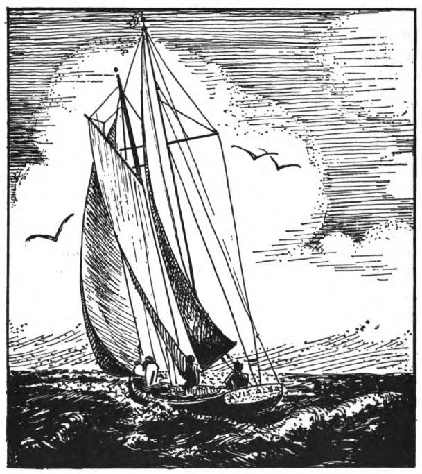

## Lesson I

Salvē, discipula. Salvē, magistra. Salvē, discipule. Salvē, magister. Salvēte, discipulī. Valē, discipula. Valē, magistra. Valēte, discipulī.

Hic est discipulīs.

Haec est discipula.

Hic est puer.

Haec est puella.

Hae sunt puellae.

Hī sunt puerī.

Haec est magistra.

“Salvēte, discipulī, puerī et puellae.

Puer est discipulus.

Puella est discipula.

Hae sunt discipulae.

Hī sunt discipulī.

Haec est puella.

Magistra nōn est puella.

Magistra est fēmina.

Haec est magistra. Haec est fēmina. Haec est puella. Haec puella est discipula. Haec puella nōn est magistra.

Haec puella est parva.

Haec puella nōn est parva; haec puella est magna.

Haec puella nōn est parva; haec puella est alta.

Haec puella est bona.

Fēmina quoque est bona.

Haec puella nōn est bona.

Haec puella est magna. Magistra quoque est magna.

Haec puella est parva. Puella est pulchra quoque.

## Lesson II

Hīc sunt fēmina et puer et puella. (Sunt hīc ↑; hīc nōn sunt →□.) Haec fēmina est māter; hic puer est fīlius et haec puella est fīlia fēminae. Māter est magna, sed fīlius et fīlia sunt parvī. Haec māter est bona māter. Haec māter nōn est mea māter; nōn est tua māter; est māter puerī et puellae. Haec puella est soror puerī. Hic puer est frāter puellae. Hic puer puellam amat. Haec māter fīliam amat. Haec puella magistram amat et magistra puellam amat.

Fīlium et fīliam fēminae amō. Mātrem puerī et puellae amō. Mātrem meam quoque amō. Sorōrem et frātrem et mātrem amō. Magistram amō. Estne fēmina, puella, māter tua?

Ita. Māter mea est.

Haec puella nōn est soror mea. Soror puerī est. Hic frāter est frāter puellae; nōn est frāter meus. Haec fēmina nōn est māter mea, sed fēminam amō. Estne haec magistra māter tua?

Māter mea nōn est.

Fīlius fēminae est discipulus bonus, et magistra puerum amat. Nunc discipula nōn est bona. Nunc magistra discipulam nōn amat.

*Magistra:* Puellam parvam amō.

*Puella:* Et magistram amō.

*Magistra:* Māter quoque puellam amat. Amāsne puellam?

*Discipula:* Ita. Puellam amō.

Valēte, discipulī.

Valē, magistra.

Salvē, puella. Haec est magistra; nōn est magister. Estne magistra tua bona?

Ita. Bona est.

Estne frāter tuus discipulus bonus?

Frāter meus est bonus et magnus et altus, sed nōn est pulcher. Soror mea et frāter meus sunt discipulī magistrae bonae.

Valēte, discipulī.

## Lesson III

Fēmina: Salvēte, puer et puella. Hic est fīlius meus; haec
est fīlia mea.

*Puer:* Haec est māter mea; haec est soror mea.

*Puella:* Haec est māter mea et hic est frāter meus.

*Fēmina:* Amāsne magistram, puer?

*Puer:* Ita. Magistram meam amō.

*Fēmina:* Estne magistra tua hīc?

*Puer:* Nunc hīc nōn est.

*Fēmina:* Amāsne magistram tuam, puella?

*Puella:* Ita. Magistra est bona et magistram bonam amō.

America est patria mea. Americam amō. America est terra magna. America nōn est īnsula. Britannia est īnsula, Hibernia est īnsula, Sicilia est īnsula, Cuba est īnsula. Italia quoque nōn est īnsula. Italia nōn est patria mea sed Italiam
amō. Amāsne Italiam? Amāsne Britanniam?

America nōn est īnsula; est terra magna. Italia et Hispānia nōn sunt terrae magnae sed nōn sunt īnsulae. America est patria mea, sed Italia nōn est patria mea et Britannia nōn est patria mea. America est patria mea et fāma Americae est magna et fortūna Americae est bona. Americam et fāmam Americae et fortūnam Americae amō.

Haec via est longa. Haec via est via bona et pulchra. Nova quoque est haec via. Haec via nōn est via antīqua. Hīc viae nōn sunt antīquae. Viae sunt novae. Viam longam amō. Amatne soror tua viam longam? Amatne frāter viam longam? Amāsne viam longam?

## Lesson IV

Haec via est via antīqua; nōn est via nova. Italia est terra magna; nōn est īnsula. Sunt longae viae in Italiā. Hae viae sunt antīquae quoque. Sed nunc viae bonae sunt. Fāma Italiae est magna. Fortūna Italiae nōn est bona. Italia nōn est patria mea. America est patria mea. Estne America patria tua?

Ita. America est patria mea.

Quis est haec? Puella est haec; magistra haec nōn est.

Quis est haec puella? Iūlia est haec puella.

Ubi est Iūlia? In viā est Iūlia.

Quid habet Iūlia? Epistulam habet Iūlia.

Cūr habet Iūlia epistulam? Iūlia epistulam habet quod māter Iūliae hīc nōn est. Māter est in Britanniā. Nunc Iūlia epistulam portat et laeta est. Nunc Iūlia in viā epistulam portat..... Nunc Iūlia in casā est. Epistula est longa. Cūr Iūlia nōn est in scholā? Nōn intellegō.

Puer: Salvē, soror.

Puella: Salvē, frāter.

Puer: Estne māter hīc?

Puella: Nunc hīc māter nōn est. Quid cupis?

Puer: Mātrem cupiō. Valē.

Puella: Valē.

Quis est hic? Agricola est hic. Agricola fīliam pulchram habet et fīliam amat. Fīlium quoque habet. Fīlius agricolae est magnus et labōrat. Sed fīlia nōn est magna; est parva. Fīlia in casā labōrat; fīlius in agrō labōrat. Agricola quoque in agrō labōrat. Fīlia in agrō nōn labōrat et haec est causa: quod est puella et puella parva. Fortūna agricolae nōn est magna sed fīlia parva in agrō nōn labōrat. In casā labōrat et cēnam parat. Agricola est laetus quod fīlia cēnam parat. Cēnam cupit. Ubi est agricola nunc? In viā est. Quid portat?  Nōn intellegō.

## Lesson V

Quis est hic vir? Hic vir est nauta. Nauta est amīcus agricolae. Vir altus et magnus est. Nauta agricolam amat et agricola nautam amat. Nauta labōrat sed nōn in agrō. In terrā nōn labōrat. Estne nauta Americānus? Ita. Hic vir saepe in terrā est. Nōn semper in terrā est. Interdum in casā agricolae est. Intellegisne? Ita. Agricola hunc amīcum amat et saepe nautam laudat quod nauta bonus est. Fīlius et fīlia agricolae quoque nautam vidēre cupiunt, quod vīta nautae est perīculōsa. Hic nauta multās terrās videt quod nōn est semper in Americā. Aquam saepe videt quod est nauta. Aqua saepe est perīculōsa. Interdum nauta aquam vidēre nōn cupit. Italiam et Hispāniam et Britanniam videt sed nōn est Italus; nōn est Hispānus; nōn est Britannus. Nauta est incola Americae et laetus est. Incola Americae sum quoque, sed nōn semper in hāc terrā habitō.

Ubi habitās? Esne Hispānus? Esne Hibernus? Esne Italus? Habitāsne in Italiā? Esne incola Italiae? Poēta, amīcus nautae, in Italiā habitat; incola Italiae est. Italia est patria poētae. Hic poēta multa scrībit. Bene quoque scrībit. Saepe epistulās longās scrībit. Poēta magnam pecūniam nōn habet. Fortūna nōn est magna sed fāma est magna. Casam parvam habet. In casā cēnam parat. Poēta Americam vidēre cupit. Cūr Americam nōn videt? Haec est causa: pecūniam nōn habet. Vīta poētae nōn est saepe perīculōsa. In terrā habitat.

Fīlius agricolae nauta esse cupit, quod vītam perīculōsam cupit. Puer est parvus. Puerī parvī nōn sunt nautae. Nautae sunt virī. Puer in scholā labōrat. Puella scrībere cupit. Epistulās bonās scrībit. Magistra puellam laudat quod epistulae sunt bonae. Interdum puella epistulās portat quod mātrem epistulās vidēre cupit.

## Lesson VI

Ego sum magistra. Tū es discipulus. Ego in Americā habitō. Habitāsne tū in Americā? Haec est pictūra scholae meae. In pictūrā est puer, discipulus bonus. Pater huius puerī est nauta. Incola Americae est. Vir bonus et magnus est. Nauta epistulās scrībit et puer saepe mihi epistulās ostendit. Interdum nauta est in scholā. Discipulīs fābulās dē multīs terrīs nārrat et pictūrās ostendit. Nauta multās terrās videt et virōs et fēminās videt. Discipulī pictūrās nautae spectant et fābulās laudant. Interdum ego epistulās nautae legō. Discipulī nautae grātiās agunt quod pictūrās ostendit et fābulās nārrat et epistulās bene scrībit.

Fīlius nautae est saepe laetus quod pater dōna dat. Saepe fīliō dōna dat. Puer patrī grātiās agit. Pater puerō fābulās dē dōnīs nārrat. Hae fābulae vītam nautārum mōnstrant. Interdum pater pecūniam ē multīs terrīs portat. Puer est laetus quod pecūniam Italiae et Hispāniae et Hiberniae cupit. Puer dōnum spectat et patrī grātiās agit.

Estne fīlius nautae in scholā tuā? Estne fīlius agricolae in scholā tuā? Legisne fābulās in scholā tuā? Scrībisne fābulās in scholā tuā? In scholā meā sunt multae pictūrae. Discipulī pictūrās spectant et laudant. In pictūrīs sunt viae. In viīs sunt virī et fēminae. Haec fēmina aquam portat. Hic puer epistulam portat. Pictūrae sunt pulchrae. Hae pictūrae sunt dōna. Nauta pictūrās ē Britanniā, ē Siciliā, ē multīs terrīs et īnsulīs portat.

Poēta magistrae epistulam scrībit et nauta hanc epistulam portat et discipulīs ostendit. Poēta est amīcus magistrae. Magistra epistulās poētae semper laudat. In epistulā poētae est pictūra aquae. Pulchra est, sed parva. Poēta aquam saepe videt quod interdum in īnsulā habitat. Nōn est nauta et vīta nōn est perīculōsa. Poēta est Italus. Nauta est Americānus. Amīcus meus est Hibernus. Hic agricola est Britannus. In hāc pictūrā est nauta Hispānus.

## Lesson VII

Epistulam habeō. Epistulam nautae ostendō. Nauta epistulam videt. Epistulam spectat. Est epistula nautae. Nauta epistulam cupit. Nautae epistulam dō. Nunc epistulam habet et laetus est. Mihi grātiās agit. Epistulam legit. In epistulā est pictūra. Nunc mihi pictūram mōnstrat.

Haec est casa Americāna. Haec casa iānuam habet. Iānua est clausa. Multās fenestrās quoque habet. Fenestrae sunt magnae. Fenestra Americāna mihi grāta est. Estne tibi grāta?

Haec est casa Rōmāna. Casa nōn est magna; est parva. Iānuam habet. Iānua est aperta. Fenestrās habet sed,nōn multās fenestrās. Fenestrae Rōmānae nōn sunt magnae; sunt parvae. Fenestrae Rōmānae sunt altae. Nōn sunt clārae. Fenestrās Rōmānās nōn amō. Fenestrās Americānās laudō. Americānī fenestrās apertās saepe habent. Fenestrae Rōmānae nōn sunt apertae; sunt clausae. Fenestrās apertās laudō.

Hīc nōn habitat vir. Ibi habitat vir. Hic vir est poēta clārus et benignus. Casam habet et cūrat. Nunc fēminae in silvā ambulant. Nunc poēta iānuam aperit et fēminās videt. Fēminae rosās portant. Poētae rosās ostendunt et poēta est laetus quod rosae sunt grātae et rosās nōn habet. Fēminae poētae rosās dant. Poēta fēminīs grātiās agit. Hoc dōnum est poētae grātum. Nunc iānuam claudit. Rosās cūrat et laudat.

Interdum poēta est in scholā quod amīcus magistrae est. Saepe fābulās nārrat. In silvā cum discipulīs ambulat quoque. Saepe discipulī cum poētā ambulāre cupiunt. Poēta est discipulīs cārus. Est benignus quoque. Suntne poētae tibi benignī? Poētae sunt mihi benignī, sed ego sum magistra. Esne tū poēta? Pater meus est poēta et in Britanniā habitat. Epistulās patris meī legere cupiō. Interdum in epistulīs patris sunt dōna. Bene est. Patrī grātiās agō, quod dōna sunt pecūnia et pictūrae. Ē multīs terrīs pater pictūrās portat. Pater meus est poēta clārus. Fāma est magna.

## Lesson VIII

In viā ambulō. Hīc est casa pulchra. Fenestra casae est aperta et in fenestrā est rosa pulchra. Iānua casae nōn est clausa. Iānua quoque est aperta et hīc est fēmina benigna. Cum fēminā vir rosās spectat. Vir in casā nōn habitat sed casam et rosās cūrat. Vir rosās ostendit. Fēmina benigna est et virō grātiās agit. Rosae sunt grātae fēminae et rosās laudat. Vir in casā parvā in silvā habitat et vir quoque rosās habet. Vir rosās amat. Ibi est casa virī. Ibi sunt rosae virī. Bene rosās cūrat et clārae sunt rosae virī.

Haec est schola nostra. Schola nostra est clāra et fāma est magna. Interdum iānua est aperta. Rosās vidēmus. Agrōs quoque vidēmus. Silvam ex fenestrīs vidēmus. Ibi est via longa. Ex fenestrīs viam quoque vidēmus.

Nunc magistra nostra discipulōs exspectat. In scholā nōn labōrāmus. In viīs ambulāmus. Ad scholam properāmus. Hī puerī linguam Latīnam discunt, sed hae puellae sunt parvae et linguam Latīnam nōn discunt. Magistra nostra est benigna et puerīs et puellīs cāra. Linguam Latīnam discere cupimus. Interdum mātrēs nostrae ad scholam properant. Mātrēs nostrae magistram vident et laudant. Nōs quoque magistram laudāmus.

Nunc fenestrās claudimus. Iānua scholae est clausa et ibi nōn labōrāmus. Ex scholā ad casās nostrās properāmus. In agrīs sunt agricolae. Ibi labōrant. Mātrēs nostrae nōs exspectant. Cēnam parant. Aquam portāmus et mātrēs sunt laetae. Rosās cūrāmus et spectāmus. Frātrēs parvōs cūrāmus. Hoc est grātum frātribus nostrīs.

Nunc agricolae ex agrīs properant. Cēna est parāta et cēna est grāta agricolīs. Fīliī agricolārum ex agrīs cum patribus properant quod hī quoque cum agricolīs in agrīs labōrant.

## Lesson IX

Nox est et noctū agricolae agrōs nōn cūrant. Noctū mātrēs cēnam nōn parant. Noctū discipulī in scholā nōn labōrant et linguam Latīnam nōn discunt. Sed noctū nautae saepe labōrant.

Nox est et ibi medicus ambulat. Medicus noster nōn est, sed medicus puerī. Nunc medicus properat sed est tardus. In silvā properat. Puer, fīlius agricolae, in casā est aeger. Medicus, vir clārus et benignus, ad casam agricolae properat quod puer est aeger. Nox est et medicus sōlus ambulat. Amīcī cum medicō nōn ambulant. Sōlus properat. Tardus est quod lūna est obscūra. Medicus lūnam clāram vidēre cupit. Stēllae quoque sunt obscūrae et medicus nōn clārē videt.

Puer laetus nōn est. Aeger et miser est. Ubi nōs aegrī sumus, miserī sumus nōs quoque. Puer sōlus est, sed sōlus esse nōn cupit. Amīcōs vidēre cupit. Lūnam et stēllās nōn videt quod obscūrae sunt. Puer aeger medicum exspectat sed medicus est tardus.

Nunc medicus iānuam agricolae aperit et puerum spectat. Medicus est puerō benignus. Puerō fābulās longās et bonās nārrat. Ex fenestrīs puer et medicus silvam spectant sed stēllās et lūnam nōn vident. Nunc medicus iānuam claudit. Ex casā agricolae properat et ad silvam ambulat.

Esne aegra, puella?

Minimē. Nōn sum aegra.

Laeta sum quod nōn es aegra. Misera sum quod Cornēlia est aegra. Haec puella nōn est aegra; haec puella nōn est aegra. Nōn sunt aegrae. Estisne aegrae, puellae?

Nōn sumus aegrae.

Esne aeger, puer?

Nōn sum aeger.

Laeta sum quod nōn es aeger. Esne aeger, discipule?

Nōn sum aeger.

Estisne, puerī, aegrī?

Minimē. Nōn sumus aegrī.

Laeta sum.

## Lesson X

Nunc nōn est nox, sed vesper est. Amīcus noster, puer aeger, in casā stat. Ex fenestrā viam spectat. Discipulōs exspectat. Stēllās nōn videt quod nōn est nox. Lūna nōn est obscūra. Vesper est. Vesperī agricolae ex agrīs properant et discipulī ex scholā ambulant. Puer nōn est miser sed laetus. Haec est causa: nunc nōn est aeger. Herī puer erat aeger et in scholā nōn labōrat. Miser erat et sōlus, sed medicus puerō medicīnam dedit et hodiē puer est laetus. Herī puer nōn labōrābat. Impiger nōn erat. Tardus erat. Hodiē est impiger. Scrībit, legit, aquam in casā portat. Herī cum puer medicum vīdit, medicīnam nōn cupiēbat. Medicus, vir benignus, puerō pecūniam dedit, et puer medicīnam cupīvit. Herī puer amīcōs nōn vīdit. Hodiē ex fenestrīs discipulōs in viā videt. Discipulī puerum ex viā vident et ad fenestram properant. Discipulī puerō epistulam dant. Magistra epistulam scrīpsit. Puer epistulam legit et laetus est quod epistula
est grāta.

Labōrāsne in casā, puella?

Ita. In casā labōrō.

Labōrāsne in casā, puer?

Minimē. Nōn in casā, sed in scholā labōrō.

Labōrātisne in scholā, puerī?

Ita. In scholā labōrāmus, sed nōn in casā. Puellae quoque in scholā labōrant.

Spectāsne lūnam vesperī, puella? Spectāsne stēllās noctū, puer?

Noctū stēllās spectāmus quod stēllās amāmus. Cum lūna est obscūra, stēllās vidēmus.

Estne lūna grāta tibi? Suntne stēllae tibi grātae?

Ita. Lūnam et stēllās amō.

Ubi stās cum stēllās spectās?

In casā nōn stō cum stēllās spectō. Cum in viā stāmus, stēllās et lūnam vidēmus.

## Lesson XI

Haec puella parva cum mātre in casā stat. Est aestās et iānua et fenestrae sunt apertae. Vesper est pulcher. Hīc est silva et in silvā tabernāculum vident. In tabernāculō in silvā habitat fēmina. Aestāte fēmina in tabernāculō habitat. Aestāte sōla in tabernāculō manet. Hodiē est in tabernāculō. Herī nōn erat in tabernāculō. Herī erat in oppidō. Saepe ad oppidum ambulat. Ex oppidō multa ad tabernāculum portat. Hodiē erat in silvā. Ex silvā quoque multa portat. Nunc in tabernāculō est et est impigra. Quid nunc habet fēmina? Medicīnam habet. Diū labōrat in tabernāculō et nunc medicīnam habet. Medicīnam ad oppidum portat et pecūniam ad tabernāculum portat. Nōn est medicus sed medicō medicīnam dat. Nōn est aegra fēmina; est valida. Pecūnia nōn est dōnum, nōn est praemium quod fēmina labōrat. Fēmina pecūniam habet quod medicīnam dat.

Puella parva cum mātre fēminam et medicīnam spectat. Puella saltat et hoc dīcit: “Laeta sum quod nōn sum aegra. Medicus mihi medicīnam fēminae nōn dat.” Māter respondet: “Ego quoque sum laeta quod es valida et medicīnam nōn cupis. Laeta sum quoque quod in tabernāculō nōn habitāmus. Tēctum magnum nōn habēmus sed cāra mihi est casa nostra.”

## Lesson XII

Interdum hic discipulus nōn est bonus. Malus est et in scholā nōn bene labōrat. Hodiē magistra nōn est laeta. Maesta est. Puerum nōn laudat. Ubi discipulī ē scholā domum eunt, magistra ad sē puerum malum vocat et hoc dīcit: “Tū, puer, nōn bene labōrās. Nunc tē sōlum labōrāre cupiō. Aquam in scholam portā.” Puer aquam portāre nōn cupit et sēcum, “Domum īre cupiō,” inquit. “Hanc magistram nōn amō.” Diū lacrimat. Ūnam hōram puer sōlus cum magistrā manet. Linguam Latīnam discit. Aquam portat. Fenestrās et iānuās claudit. Sed hōra longa nōn est puerō maestō grāta.

Māter puerī domī puerum exspectat et ē fenestrā vocat. “Puer! Puer!” dīcit māter. Puer nōn respondet. Post ūnam hōram māter maesta ē tēctō ad scholam it quod vesper est et puer nōn est domī. Ibi puer stat et lacrimat.

“Cupisne mox bonus esse?” dīcit magistra. “Cupisne bene labōrāre? Ubi bene labōrās tē laudō.”

Puer magistram et mātrem maestam spectat. “Ita,” respondet puer sed sēcum, ‘“Nunc domum īre cupiō,” dīcit.

Mox māter et fīlius domum eunt. Properant quod nox est et stēllae et lūna sunt clārae.

Pater puerī domī nōn est. Ex oppidō properat. Praemium habet. Puerō praemium dare cupit. Praemium est tabernāculum. Aestāte puerī in tabernāculīs habitāre cupiunt. Validī et impigrī sunt ubi in tabernāculīs habitant. Puer est bonus et pater praemium laetē spectat. Sed ubi in tēctum it et fīlium videt et māter fābulam dē puerō malō nārrat, maestus est pater.

Post cēnam pater puerum ad sē vocat. Hoc dīcit: “Nunc hoc praemium tibi dare nōn cupiō. Hodiē nōn bene labōrābās et ūnam hōram sōlus cum magistrā manēbās. Maestus sum, sed tū es fīlius meus et mihi cārus. Ubi magistra ad mē epistulam bonam dē tē scrībit, praemium tibi est.

Diū puer lacrimat. Mox in scholā bene labōrat. Magistrae semper grātus esse cupit. Mox pater nōn est miser quod magistra puerum laudat. Mox tabernāculum habēbit.

## Lesson XIII

Haec casa est domus fēminae benignae. Casa est casa alba. Post casam est hortus. Post hortum est silva. In hortō sunt multī et pulchrī flōrēs. Sunt rosae albae et līlia alba quoque. Alta sunt līlia et pulchrae sunt rosae. Sunt aliī flōrēs quoque in hortō. Grātī fēminae benignae sunt flōrēs. Fēmina hortum nōn cūrat. Vir quī in aliā casā habitat hortum cūrat. Aestāte hortum cūrat; hieme nōn cūrat quod hieme sunt nūllī flōrēs in hortō. Bene vir labōrat. Cārus virō est hortus.

Hodiē vir nōn est in hortō. Herī hīc erat. Hodiē hīc nōn est. Est aestās et in hortō est quiēs. Fēmina quiētem amat. Mox fēmina puerum lacrimantem audit. Ad iānuam it. Nūllus puer est in viā. Mox puerum quī in hortō labōrat videt. Est fīlius virī quī hortum cūrat. Hodiē puer hortum cūrat et lacrimat. Puer nōn est in perīculō; nōn timet. Cūr lacrimat? Fēmina puerum ad sē vocat. Fēmina hoc dīcit: “Cūr lacrimās, puer?” Tum puer respondet: “Pater meus ad oppidum it et ego labōrō. Ego quoque ad oppidum īre cupiō. Duōs equōs habet et ego equōs amō. In stabulō frūmentum equīs dō. Aquam quoque dō. Ūnum equum semper cūrō. Ego quoque cum patre et equīs īre cupiō.”

Fēmina quae est fēmina benigna est maesta. Miserum puerum! Fēmina et puer cēnam edunt. Tum fēmina flōrēs ex hortō capit et ad oppidum it. Cum fēminā it puer parvus quī nunc nōn lacrimat. Mox virum quī hortum cūrat fēmina videt et dē puerō parvō quī nōn est puer malus nārrat. Fēmina et vir et puer colloquium habent. Multās hōrās ibi manent. Vesperī domum eunt.

## Lesson XIV

Nox est et quiēs est in terrā. Hiems est. Mārcus, puer Americānus, sōlus est in casā quod māter et pater ad oppidum iērunt. Diū legit. Dē multīs terrīs legit. Hanc fābulam, quae dē Rōmānīs antīquīs nārrātur, saepe Mārcus in scholā audīvit. In pictūrā est vir quī mīles Rōmānus est. Ad bellum properat. Est mīles validus et magnus quī arma Rōmāna portat. Sōlus est. Multī aliī mīlitēs quī in pictūrā nōn videntur ad bellum ambulant quod bellum est magnum. Ibi sunt castra Rōmāna ubi noctū mīlitēs manent. Hīc quoque manent ubi in bellō nōn pugnant. Mīlitēs interdum ā castrīs properant et ad bellum eunt.

Hic mīles Rōmānus quī est dux mīlitum arma bona portat. Quae sunt haec arma? Hic est gladius validus. Gladius nōn est longus. Nōn est lātus. Scūtum quoque capit. Scūtum ducem tegit ubi bellum est perīculōsum. Pīlum habet. Hoc pīlum est longum et validum sed nōn est lātum. Galea quoque ducem tegit. Galeam et scūtum et gladium et pīlum Mārcus videt et laudat. Haec arma mīlitēs bene tegunt. Quod hic mīles est dux, bellum nōn timet. Perīculum nōn timet.

Post mīlitēs castra vidēmus. Equōs et frūmentum vidēmus. Hī equī aliōs mīlitēs portant. Alia tēla portant. Nunc est nūllum perīculum. Mox mīlitēs pugnant et tum est magnum perīculum. Post bellum multī mīlitēs sunt dēfessī et domī esse cupiunt. Dux quoque est dēfessus. Dux bonus semper cōnsilia bona habet. Mīlitēs cōnsilia bona ducis semper laudant, sed cōnsilia mala nōn laudant. Dux impiger cōnsilia mala nōn laudat. Dux impiger cōnsilia bona semper habet. Bellum est perīculōsum ubi cōnsilia ducis sunt mala.

Nunc nōn est nox. Nūlla quiēs est in terrā. Virī et fēminae labōrant. Mārcus nōn legit sed ad stabulum ubi equus stat ambulat. In stabulō Mārcus equō albō frūmentum dat. Tum in hortum puer et equus properant. Equus puerum ad flōrēs, rosās et līlia, portat. “Ego sum dux Rōmānus,” inquit puer, “et arma capiō. Gladium et ūnum scūtum portō. Galeam habeō et in tabernāculō sunt duo pīla quae nunc nōn portō. Mīlitēs meī mē laudant quod cōnsilia bona habeō.”

Māter vocat. Puer et equus domum properant. Post cēnam colloquium, quod dē armīs et bellō est, longum et grātum est.

## Lesson XV

*Colloquium*

Quae arma, mīles Rōmāne, habēs?

Galeam et scūtum habeō. Haec est galea mea; hoc est scūtum meum.

Quid facit scūtum?

Scūtum mē tegit.

Quid facit galea?

Galea caput meum tegit.

Quae tēla, mīles Rōmāne, habēs?

Tēla mea sunt gladius et pīlum. Multī mīlitēs sagittās habent sed ego sagittās nōn habeō quod nōn sum sagittārius.

Ubi habitās, mīles Rōmāne?

In castrīs habitō cum est bellum. Castra amō. Castra sunt lāta et longa et multī mīlitēs Rōmānī in castrīs sunt. Longē ā casā patris meī sunt castra. Patrem et mātrem nōn videō. Interdum sum dēfessus et patrem et mātrem vidēre cupiō, sed ad casam nōn eō quod dux hoc dīcit: “Bonus mīles pugnat. Mīles malus domum it.”

Cūr cōnsilium nōn capis et domum īs?

Dux meus est benignus dux sed cōnsilium intellegit. Nōn cupit mīlitēs domum īre. “Cōnsilium nōn est bonum,” inquit dux. “Est malum. In castrīs manē.” Tum numquam īre cupiō.

Labōrāsne semper in castrīs?

Minimē. Ego et trēs amīcī interdum ad silvam īmus. Cum in silvā sumus, iacula habēmus. (Iaculum est pīlum sed nōn longum pīlum.) Sagittās quoque habēmus. Interdum ad castra animālia portāmus. Animālia ad ducem portantur. Cum cēna bona in mēnsā parāta est, laetī sumus.

Quī sunt hī quattuor puerī quī in viā lātā ambulant? Amīcī sunt et fīliī agricolārum. Quid faciunt? Sagittās portant. Scūta et pīla nōn portantur quod puerī mīlitēs nōn sunt et nōn pugnant. Iacula nōn habent. Nōmen huius puerī altī est Mārcus. Medius puer est. Ā dextrā Mārcī est frāter, Lūcius, puer secundus, quī trēs sagittās portat. Ā sinistrā Mārcī est puer tertius, Carolus, nōmine. In capite Carolī est galea, sed mīles nōn est. Hic parvus puer, cuius nōmen est Claudius, post hōs trēs puerōs manet. Parvus est, sed cum puerīs magnīs ambulāre cupit. Dēfessus est quod puerī magnī properant.

Hodiē puerī equōs nōn habent. Quid puerī nunc faciunt? Hī quattuor puerī ā casīs ad silvam properant quod ibi sunt animālia. In stabulō sunt equī nigrī, et nunc ibi manent. Puerī animālia capere cupiunt. Interdum animālia puerōs timent. Sagittās quoque timent. Diū puerī in silvā manent, sed diū animālia nōn videntur. “Ibi,” inquit Mārcus, “caput parvī animālis nigrī videō.” Tum Mārcus prīmam sagittam capit, tum secundam et tertiam. Animal stat et puerum spectat. Nūllum perīculum est quod puerī nōn sunt virī magnī et validī. Puerī domum eunt ubi cēna in mēnsā parāta est. Cēnam laetī edunt.

## Lesson XVI

Haec est agricolae fīlia cuius nōmen est Anna. In casā est. Quid facit? Ā casā īre parat. Herī aliquis ad iānuam casae vēnit et epistulam portāvit. Anna iānuam aperuit. Tum epistulam manibus ad mātrem quae epistulam lēgit portāvit. Nunc Anna ad oppidum īre parat. Hīc habitat amīca Annae, Iūlia nōmine. Anna ā Iūliā ad oppidum invītātur. Anna est laeta et saltat. Māter nōn invītātur et Anna cum mātre nōn it. Oppidum est magnum sed puella perīculum nōn timet quod hoc oppidum est locus tūtus et puella est tūta.

Vesperī puella nōn it. Māne it. Pater cum puellā it. Māne in carrō pater et fīlia per agrōs et silvam properant. Equum habent. Equus bene currit quod est validus. Puella est laeta. Ā dextrā et ā sinistrā multa videt. Omnēs rēs sunt grātae. Subitō in agrō quattuor animālia videntur. Pater, sagittārius bonus, arcum et sagittās habēre cupit, sed puella est laeta quod nūlla tēla sunt in carrō quod animālia sunt amīcī Annae.

Vesperī pater et fīlia in magnō oppidō sunt. Iūlia Annam exspectat et prope fenestram stat. Subitō equum et carrum videt. Ē tēctō currit et “Salvēte” inquit. Tēctum Iūliae est magnum aedificium. Multās fenestrās et quattuor iānuās habet. Ante tēctum est hortus. Per hortum puellae ad iānuam ambulant. Pater, “Valēte,” inquit, “puellae,” et domum it. In tēctum nōn it.

Diū Anna cum Iūliā manet. Puellae per oppidum ambulant quod Anna magna aedificia vidēre cupit. Per viās longās ambulant. Oppidum est Annae grātum. Ubi trāns viās puellae īre cupiunt, interdum est perīculum, sed Anna et Iūlia sunt tūtae quod vir magnus, “Properāte, puellae,” inquit; “tūtae estis quod hīc ego sum.” Tum manūs puellārum capit et puellae cum virō benignō trāns viam fortiter currunt.

Iūlia trēs amīcās habet. Prīma est fīlia medicī. Secunda est fīlia poētae. Tertia est fīlia mīlitis quī iacula et alia tēla domī habet. In mēnsā stat pictūra virī quī in capite galeam habet. Hic vir fortiter pugnat. Hunc mīlitem Anna laudat quod est pater amīcae.

## Lesson XVII

“Audī. Aliquid audiō. Audīsne aliquid? Multī virī per viās currunt; multī equī veniunt. Sunt carrī quoque et in carrīs multae rēs portantur. Sunt mīlitēs quoque et in manibus mīlitum sunt tēla. Quī sunt hī mīlitēs? Ad quem locum eunt? Vidē. Ibi prope nostram domum veniunt.”

Spectāmus et subitō multōs mīlitēs vidēmus. Multī aliī virī trāns viās et ante aedificia currunt quod hōs mīlitēs vidēre cupiunt. Mīlitēs arma et tēla habent. Galeās, gladiōs habent; scūta, pīla, arcūs, sagittās nōn habent. Patria nostra in bellō nōn pugnat, sed fīnitimī nostrī pugnant et nōs sumus sociī. Cum fīnitimī auxilium rogant necesse est īre. Mīlitēs nostrī īre dēbent quod sunt sociī fīnitimōrum. Omnēs mīlitēs nostrī fortiter pugnant et sunt parātī morīrī sī necesse est. Dux noster ducī sociōrum cōnsilium dat. Ducem sociōrum monet. Mīlitēs nostrī auxilium fīnitimīs dant quod fīnitimī nōn satis magnās cōpiās habent. Sī satis magnās cōpiās habent, nostrōs mīlitēs nōn vocant. Nōs nostrōs mīlitēs tūtōs esse cupimus, sed mīlitēs sociōs nostrōs tūtōs esse cupiunt. Māne hodiē ad sociōs eunt. Crās nōn domum venient, posterō diē nōn domum venient; mox venient sed nōn omnēs. Multī numquam iterum venient. Multī vītās dabunt, multī morientur.

## Lesson XVIII

*Magistra:* Quis est ille vir?

*Puer:* Ille vir est caecus. Ille vir oculōs habet, sed nūllās rēs videt.

*Magistra:* Cūr adest? Cūr hīc est?

*Puer:* Ille vir fīlium habet quī prope hunc locum habitat. Vir fīlium vīsitat et nunc fīlium exspectat.

*Magistra:* Herī ille caecus vir aderat. Nunc iterum adest.

*Puer:* Ita. Tum fīlium exspectābat et nunc iterum fīlium exspectat. Numquam longē sine fīliō it quod est timidus. Ubi cum fīliō ambulat, tūtus est.

*Magistra:* Omnēs virī et puerī quoque illī virō auxilium dare dēbent. Sī omnēs auxilium dant, virī caecī sunt laetī neque timent.

*Puer:* Ecce! Vidē! Fīlius caecī virī adest. Quam laetus est ille vir!

*Magistra:* Ad quem locum eunt vir et fīlius?

*Puer:* Necesse est ad aedificium magnum īre quod ibi vir caecus pecūniam accipit.

*Magistra:* Cūr pecūniam accipit?

*Puer:* Vir erat mīles et cum sociīs et fīnitimīs prō patriā pugnābat. Prō patriā parātus erat morīrī sī necesse erat. Cōpiae hostium erant magnae sed cōpiae nostrae nōn satis magnae erant. Dux mīlitēs monēbat sed fortēs erant et fortiter pugnābant. Multī vulnerābantur; multī necābantur. Posterō diē aliī mīlitēs illum mīlitem vident, sed numquam posteā ille videt. Hodiē est caecus! “Putābam mē tūtum,” inquit. “Eram paene tūtus. Tum tēlum veniēbat et hīc sum.” Nunc ab illō mīlite ex aedificiō magnō pecūnia accipitur.

## Lesson XIX

Herī vir caecus mihi fābulam dē bellō in quō prō patriā pugnāvit nārrāvit. Haec est fābula:

Hīc sunt castra nostra. Ibi est flūmen. Illud flūmen nōn est Rhēnus. Gallī multa flūmina habent sed illud flūmen nōn est in Galliā. In Eurōpā nōn est. Trāns flūmen sunt castra hostium. Inter castra hostium et castra nostra illud flūmen fluit. Hodiē hostēs in castrīs manent quod herī multī vulnerātī et necātī sunt. Agrī occupātī et vāstātī sunt. Ducēs hostium sunt īrātī et mīlitēs noctū castra nostra capere cupiunt. Ducēs hoc iubent. Hoc dēsīderant. Ubi ducēs hoc iubent, necesse est mīlitēs hoc facere. Omnēs castra nostra vāstāre cupiunt, sed inter hostēs et mīlitēs nostrōs est illud flūmen. Circum castra nostra est mūrus altus. Sine hōc mūrō perīculum est magnum. Propter hunc mūrum hostēs castra nostra neque capient neque nostrōs vulnerābunt. Timidī nōn sumus. Herī nocte dux noster trāns flūmen properāvit et cōnsilia hostium audīvit.

Hodiē dux noster adest. Magnās cōpiās postulat. Auxilium postulat accipitque. Mox omnēs rēs erunt parātae quod nocte perīculum erit magnum. Quam prope hostēs videntur! Necesse est illud flūmen trānsīre. Hoc est cōnsilium hostium. Flūmen non est tardum. Per agrōs fluit et semper properat. Sī hostēs trāns flūmen venient in mūrō stābimus. Ubi hostēs ex aquā properant, multōs capiēmus et vulnerābimus. Multōs iterum in aquam iaciēmus. Ācriter pugnābimus. Hostēs clāmābunt et auxilium postulābunt, sed nūllī erunt tūtī. Dux noster mīlitēs hostēs exspectāre iubet. Paene in mediō perīculō sumus.

Media nox est. Hostēs exspectāmus. Lūna nōn est clāra.

“Quis oculōs bonōs habet?” rogat dux.

“Ego,” respondet mīles quī prope stābat.

“Ad mūrum ī,” inquit dux, “et sī hostēs venientēs vidēs, omnēs mīlitēs monē.”

“Nunc,” clāmat ille mīles, “hostēs in flūmine sunt.”

Tum, “Pīla aliaque tēla iacite,” dux iubet.

Hostēs cōnsilia esse audīta nōn putābant. Tēla vīdērunt. Posteā ad castra trāns flūmen iērunt.

Posterō diē dux, “Cūr,” inquit, “Mārcus, mīles fortis, abest? Herī aderat, sed nunc abest.”

Tum omnēs mīlitēs ad flūmen properāvērunt. Ecce! Ibi inter mūrum et flūmen erat Mārcus mortuus. Per caput inter oculōs erat gladius hostis. Bene Mārcus prō patriā pugnāverat.

## Lesson XX

Is quī inter mūrum aedificiumque stat est avunculus meus. Māne in hortō est et flōrēs spectat. Nōn est īrātus, sed maestus. Quae est causa? Ubi avunculus circumspectat, pulchrās rosās et aliōs flōrēs nōn videt. Undique flōrēs sunt in ruīnīs. Ōlim flōrēs erant pulchrī et ubi avunculus hortum spectābat omnēs probābat. Nunc omnēs flōrēs vāstātī sunt. Flōrēs quoque paene maestī videntur. Itaque nōn diū in hortō propter flōrēs vāstātōs manēre cupit. Quae est causa? Avunculus nūllōs inimīcōs habet. Itaque nūllī inimīcī hortum vāstābant. Prope hortum flūmen fluit. Interdum est altum. Circum hortum, tamen, est mūrus altus. Itaque aqua flūminis per mūrum nōn venit. Neque inimīcus neque flūmen hortum vāstābat. Estne populus fīnitimus inimīcus? Audēbatne hostis tēla iacere et rosās līliaque vāstāre? Occupābatne hostis hortum? Postulābatne omnēs flōrēs? Quis hortum vāstābat? Vēnitne aliquis armātus nocte ubi avunculus aberat? Quis hortum grātum oppugnāre audēbat? Cūr aliquis illum inimīcum nōn audiēbat ubi per hortum vēnit? Cūr aliquis nōn clāmābat et avunculum meum nōn monēbat? Hoc nōn intellegō.

Quis est is quī ad hortum ex aedificiō properat? Ēst vir quī avunculum in hortō iuvat. Avunculum magnā cum cūrā iuvat. Sine illō auxiliō avunculus hortum nōn bene cūrat quod hortus est magnus. Ubi is vir diū abest, flōrēs nōn sunt pulchrī. Vir avunculum salūtat.

“Salvē,” inquit.

“Salvē,” respondet avunculus.

Tum vir quoque circumspectat. Is quoque undique flōrēs in ruīnīs videt.

“Herī,” inquit, “prīmus diēs hiemis vēnit et omnia oppugnābat. Quamquam flōrēs pulchrī nōn videntur et eōs nōn probāmus, aestāte, tamen, nūllī erunt in ruīnīs. Hiems est inimīca hortōrum. Hiems bene armāta flōrēs flūminaque oppugnat et semper superat. Interdum validior est quam aestās. Hiems tēla valida habet.”

“Ita,” respondet avunculus. “Aestās, tamen, est mihi grātior quam hiems.”

## Lesson XXI

Nōs sumus mīlitēs Rōmānī. Sumus mīlitēs populī Rōmānī. Illī mīlitēs quōs in illīs castrīs vidētis sunt barbarī. Mox barbarī castra nostra oppugnābunt. Sī nōn hodiē sed crās castra nostra oppugnābunt, nōs tūtī erimus quod sociī nōs iuvābunt et crās sociī aderunt. Sī hodiē oppugnābunt, quamquam multōs mīlitēs nōn habēmus, tamen fortiter et ācriter pugnābimus et barbarī castra nōn expugnābunt. Quamquam ea oppugnābunt, tamen castra nōn expugnābunt. Castra expugnāre et dēlēre cupiunt sed neque ea expugnābuntur neque dēlēbuntur. Nōs nōn superābimur. Nōs fortēs mīlitēs probābimus. Illī barbarī, cum sociōs vidēbunt, ā castrīs nostrīs ībunt, et castra sua movēbunt, nam quamquam sunt multī, nōn multum audent et undique celeriter current. Nōs et sociī nostrī sunt armātī neque eī tūtī erunt. Eī nōn servābuntur, nam sociōs nōn habent. Multī vulnerābuntur et necābuntur. Numquam iterum illī barbarī nōs oppugnāre et castra nostra expugnāre cupient. Nunc castra dēsīderant.

Mīles putat: “Sī in castrīs manēbō, mox hostēs aderunt. Multī vulnerābuntur; multī necābuntur; multī erunt caecī. Itaque manēre nōn cupiō. Domum īre cupiō. Rūrī habitō. Rūs īre cupiō. Īre nōn dēbeō. Dux est fortis vir. Mīlitēs monet et mē quoque monet. Sī domum ībō, numquam iterum mīles erō. Prō patriā numquam pugnābō, neque posteā laudābor. Sī virī mē capient, ad ducem mē portābunt. Sine armīs erō. Sociī mē nōn accipient, neque amīcī mē accipient. Quam maestus sum! Sum timidus; hostēs timeō; multa timeō. Oculōs habeō sed nōn clārē videō. Mē miserum putō. Ecce! Ille vir ā castrīs et ā sociīs it. Ego quoque ībō. Crās, māne, ubi omnēs dormient, ex castrīs ībō. Mox domī erō. Quid tum erit? Nōn sciō. Mē miserum!”

Mīles est in vinculīs. Mīles putat: “X castrīs īre nōn dēbēbam. Ōlim putābam mē īre cupere. Sī hostēs venient, hīc mē capient. Nōn pugnābō quod sum sine armīs et in vinculīs quoque. Ecce! Aliquid audiō. Hostēs adsunt. Nūllum auxilium habet dux. Iterum prō patriā et prō duce et prō sociīs pugnāre cupiō. Sum parātus morīrī posteā sī necesse est. Nunc nōn sum timidus, hostēs nōn timeō, nūllam rem timeō. Sī dux mē accipiet, quam laetus erō! Sed ille fortis dux hīc nōn manet. Fortiter pugnat et mīlitēs monet. Mē nōn audit. Multī sociī vulnerantur, multī amīcī necantur, sed hī hostēs fortiter accipiunt. Dā mihi tēla et arma. Nūllus audit. Sōlus sum. Mē miserum!”

## Lesson XXII

Ōlim vir et servus per silvam errāvērunt. Servus erat magnus et quod tēla portāvit virum bene iūvit. Laetī erant quod rūs erat grātum eīs et bēstiās ferās capere cupīvērunt. Herī hī duo virī bēstiās ferās esse in silvā audīvērunt. Diū in silvā fuerant et per tōtam silvam errāverant, nam nūllās bēstiās vīderant, et domum sine bēstiīs ferīs īre nōn cupīvērunt.

Māne servus, cuius nōmen erat Carolus, “Sī domum duās bēstiās magnās portābimus,” inquit, “magna erit cēna et amīcōs tuōs invītābimus.”

“Ita,” respondit vir, cuius nōmen erat Mārcus, “facile erit bēstiās oppugnāre et superāre, nam multās esse in silvā scīmus.”

Sed ubi erat nox et paene tempus domum īre, eī, tamen, sine bēstiīs manēbant. Quamquam lūna stēllaeque nunc vidēbantur, nōn erat facile, tamen, viam vidēre.

Subitō duo oculī, mox aliī prope virōs videntur. Virī timent. Celeriter bēstiae (nam ita virī putant) ad virōs sē movent. Servus sagittās capit sed timidus est et bēstiae ferae nōn vulnerantur.

Tum Mārcus, “Ego,” inquit, “vītās nostrās servābō. Celeriter curram et bēstiae post mē venient. Subitō prope flūmen stābō et bēstiae in flūmen current et omnēs morientur. Tūtī erimus.”

“Hae bēstiae,” inquit Carolus, “vītās nostrās dēlēre cupiunt. Interdum tōtum oppidum expugnant et incolās superant. Bēstiae sunt perīculōsiōrēs quam barbarī.”

Propius bēstiae ferae veniēbant.

“Ecce!” inquit Mārcus. “Bēstiae ferae nōn sunt. Eī sunt equī nostrī quī ē stabulō cucurrērunt. Iānua est aperta. Itaque hīc sunt.”

Tum Mārcus ūnum equum cēpit. Carolus ūnum equum cēpit et ubi duo virī eōs incitāvērunt, domum in equīs portātī sunt. Cēterī equī post eōs properāvērunt.

## Lesson XXIII

Ōlim dominus bonus malum servum habēbat. In multīs locīs dominus servum suum probābat. Prīmum in tēctō suō labōrem dabat, sed servus tēctum eius nōn bene cūrābat neque erat benignus puerīs et puellīs eius. Tum in hortō eius labōrābat sed flōrēs eius nōn amābat neque eōs cūrābat. Tum rūrī in agrīs eius labōrābat sed ibi quoque nōn bene labōrābat. Mox dominus eius eum ad silvam mīsit. Ā silvīs ad tēctum necesse erat lignum portāre. Nōn erat facile lignum portāre. Servus malus ad silvam īvit sed lignum nōn portāvit. Quamquam dominus imperat, servus nōn pāret. Quod servus est malus et labōrem bonum nōn bene facit, dominus igitur ad labōrem dūrum mittit. Tamen servus nōn pāret. Per tōtum tempus sēcum putat. Cēterōs servōs nōn incitat sed mox sōlus sē in fugam dat. Celeriter currit sed semper timet. Per diēs servus perfidus in agrīs dormit; per noctēs iterum currit.

Mox tamen dominus cum servīs armātīs eum reperit et servus perfidus statim domum in vinculīs it. Ibi dominus eius hoc dīcit: “Tū in tēctō nōn bene labōrās, in hortō nōn bene labōrās, in agrīs nōn bene labōrās. Paucī servī ita sunt malī. Ad silvam igitur tē mittō. Ibi quoque nōn bene labōrās sed in fugam tē dās. Imperō; nōn pārēs. Tū es servus. Hoc memoriā tenē. Quid cupis? Quid in animō habēs?” “Vōs omnēs necābō,” servus perfidus inquit. “Rēs omnēs vestrās dēlēbō.” Dominus igitur multum movētur nam servum saevum esse scit. Dominus servum inter aliōs errāre nōn dēsīderat et statim imperat, “Hunc servum in vincula conicite, servī meī. In locīs obscūrīs post mūrōs validōs semper eum tenēte.”

## Lesson XXIV

Virī quī Rōmae habitābant Rōmānī vocābantur. Virī quī in Germāniā, in Galliā, in Britanniā habitābant barbarī vocābantur. Quī sunt eī barbarī? Eī barbarī sunt Gallī quī Rōmam sē movent. Rōmānōs nōn amant nam līberī esse cupiunt, sed Rōmānī dominī esse cupiunt et illōs servōs facere cupiunt. Nunc igitur ad urbem sē movent. Crās urbem oppugnābunt. Dēlēbuntne urbem? Sunt barbarī saevī. Barbarī sunt perfidī et saepe urbēs dēlent et incolās in fugam dant. Facile urbem expugnābunt nam multōs mīlitēs mittunt et validī sunt et Rōmānī sunt paucī. Quod cōnsilium in animō habent? Quō modō hoc facient? Nūllum cōnsilium habent sed dux barbarōrum celeriter videt, statim imperat et omnēs barbarī pārent. Dux cōnsilium reperiet. Quī Rōmānōs iuvābunt? Quī urbem servābunt? Heu! Urbs nōn servābitur. Expugnābitur et dēlēbitur.

Ānserēs cōnsilium cēpērunt. Dux ānserum cēterōs ānserēs convocāvit. Tum circumspectāvit et dīxit hoc: “Rēx ānserum sum. Celeriter venīte et audīte. Nōn est tempus morae. Vōbīs rem malam dīcō. Hostēs ad urbem nostram sē movent. Nōn sōlum hostēs sunt sed etiam barbarī sunt. Nox est. Nocte oppugnābunt. Ā tergō urbem oppugnābunt. Tōtam urbem dēlēbunt. Neque virōs līberōs neque servōs servābunt, neque hominēs neque bēstiās servābunt. Omnēs necābunt. Tōtōs agrōs vāstābunt. Undique errābunt. Omnia vāstābunt. Dūrus erit labor amīcōrum vestrōrum. Hoc memoriā tenēte. Nunc virī Rōmānī sunt dēfessī et dormiunt. Neque vir līber neque servus neque bēstia hostēs videt. Nōs sōlī hanc rem scīmus. Tempus est virōs incitāre. Vōs ānserēs statim clāmōrem facite et virōs incitāte. Rōmam servāte.”

Expugnāvēruntne barbarī Rōmam? Minimē, nam ānserēs Rōmam servāvērunt.

## Lesson XXV

In silvīs ad quās aestāte īmus est flūmen parvum. Hoc flūmen in flūmen magnum fluit. In flūmine magnō sunt multae et magnae nāvēs quae hominēs et rēs portant. Semper nāve ad urbem quae est prope casam nostram īmus. Haec nāvis est longa et angusta et alba. Nāvem amō quod est tam pulchra et tam celeriter it. Ōlim ego et pater ex urbe ad casam per flūmen parvum in nāviculā īvimus. Id ego amāvī, sed frāter meus nōn amāvit quod eum cum mātre et sorōribus īre necesse erat.

Cum in silvā sumus, nōs omnēs in aquam sine morā īmus. Per tōtum diem in flūmine sumus et magnī clāmōrēs ibi audīrī possunt. In flūmine est saxum magnum, paene īnsula. Ad hoc saxum ego per aquam ambulāre possum. Ubi prope rīpam sum, tōtum corpus meum vidēre potes. Mox tergum, nōn corpus vidēs. Ubi prope saxum sum, caput meum sōlum vidērī potest. Aqua igitur nōn est alta, sed in flūmine natāre possum. Interdum per tōtum diem aut natō aut in saxō sedeō aut in rīpā legō. Nāviculam quoque habeō. Nōmen nāviculae est “ānser.”

Sorōrēs meae et frāter meus quoque natant. Sorōrēs sunt puellae magnae et sē servāre possunt, sed frāter meus est parvus. Bene natat. Paucī puerī tam bene natant, sed sī etiam prope rīpam ambulat, caput nōn vidēs. Frāter autem nōn est validus, itaque, sī est in flūmine, numquam eum relinquō. Sī nōn natāre cupiō, in saxō sedeō et puer in aquā natat aut tēcta in rīpā aedificat.

Hanc vītam amō quod sum tam līber. “Ego sum rēx hominum,” interdum inquam. “Haec vīta sōla est bona.” Heu!  Ubi hiems venit miser sum quod flūmen relinquō et nōn semper manēre possum. Semper hunc locum memoriā teneō.

## Lesson XXVI

Herī sōlus in nāviculā meā in flūmine eram. Māne ubi lūx nōn iam erat obscūra domum relīquī et ad rīpam flūminis properāvī. Hīc nāviculam parvam angustamque vīdī. Diēs erat pulcher. Nūllae nūbēs erant in caelō. Avēs laetae ē somnō excitātae in arboribus sedēbant. Undique erant collēs. In summīs collibus erant agricolae. Iam labōrābant. Diū silēbam. Dē nātūrā locī putābam. Collēs, arborēs, caelum quoque silēbant, sed avēs nōn silēbant. In arboribus avēs audiēbam. Itaque laetus eram. Aliae tēcta sua aedificābant, aliae cibum dēsīderābant, aliae ubi appropinquāvī per caelum properābant.

Inter collēs, per silvās in nāviculā īvī. Posteā corpus meum erat dēfessum et cibum cupīvī. Prope rīpam saxum magnum vīdī. Ibi sēdī et diū quiētem cēpī. Tum in flūmine natāvī. Ubi natāre nōn iam cupīvī, in nāviculā meā sēdī. Subitō post lignum tergum hominis vīdī. Sine morā rīpae appropinquāvī et ibi agricolam vīdī. Dēfessus erat et quiētem capere cupīvit.

“Salvē,” dīxī.

“Salvē,” respondit agricola.

“Cuius ager est hic?” rogāvī.

“Meus ager est,” respondit vir. Tum dē agrīs, dē nātūrā eius locī, dē collibus cārīs suīs nārrāvit. Haec erat eius fābula:

“Ubi parvus puer eram, pater meus māterque in carrō per agrōs ībant. Illīs temporibus nōn erat facile trāns terram, Americam, īre quod multa erant perīcula. Equī erant tardī et saepe necesse erat diū in ūnō locō manēre, ubi aut virī dēfessī aut fēminae aegrae erant. Interdum paucōs diēs nūllum cibum habēbant. Tum vīta eōrum nōn erat grāta incolīs. Sī flūmina erant magna, necesse erat diū in rīpā manēre. Tum virī nāvēs aedificābant aut sī nāvēs aedificāre nōn poterant, equōs cum carrīs per flūmen dūcēbant.

“Tum vīta agricolae nōn erat tam facilis. Ōlim barbarī appropinquāvērunt. Māter paterque perīculum esse magnum sciēbant et diū post collem, inter arborēs manēbant. Diū silēbant et sine cibō manēbant quod barbarī per noctem in castrīs prope collem manēbant. Māne, prīmā lūce, pater et māter ā collibus properāvērunt. Ex summō colle diēs tardē appropinquābat, sed pater et māter iam in viā ad novam domum sē movēbant.”

Cum hanc fābulam audieram, hoc dīxī: “Pater tuus est exemplum virī fortis. Hodiē nōn sunt tam multa exempla virōrum fortium.”

“Ita,” respondit vir. “Etiam nunc in Americā sunt multī et fortēs virī. Semper erunt.”

## Lesson XXVII

Herī in summō saxō stetī et terram undique spectāvī. Caelum erat clārum pulchrumque. Nūllae nūbēs erant. Ubīque collēs arborēsque vīdī. Avēs erant laetae. Ubīque signa laetitiae vidēbantur. Flūmen erat prope et paucās nāviculās vīdī. Subitō figūrās duōrum virōrum vīdī. Virī cibum tēlaque portābant. Splendida erant tēla. Virī in saxō sedēbant sed mē hīc esse nōn sentiēbant. Ego, igitur, post arborem mē cēlāvī et audīvī. Diū silēbam.

Vir altior hoc dīxit: “Ōlim in hōc saxō erat proelium magnum et multī barbarī moriēbantur. Per tōtam terram hoc proelium est nōtum.”

Dē nātūrā huius proelī audīre maximē cupīvī.

“Cūr barbarī hostēs nōn superāvērunt? Habēbantne nūlla tēla?” rogāvit amīcus eius. “Cūr tēla nōn rapuērunt et hostēs
oppugnāvērunt?”

“Hostēs circum tōtum saxum mittēbantur,” inquit vir altior, “et barbarī ā saxō ad tēcta sua īre nōn poterant. Multōs diēs in summō saxō barbarī sine cibō manēbant. Iam multī erant aegrī. Mox undique erant corpora mortua. Posteā omnēs barbarī superātī sunt. Sīc nōmen huius locī nōtum erat. Hoc proelium est exemplum multōrum et dūrōrum proeliōrum quae inter barbarōs et Americānōs facta sunt.”

Nunc, excitātus, mē nōn iam cēlāvī, sed virīs appropinquāvī.

“Tōtam fābulam,” inquam, ‘“audīvī et est mihi grāta. Aliās nārrā.”

Vir altior ita respondit: “Lūx est obscūra et tempus est domum īre.”

Tum vir et amīcus eius tēla splendida capiēbant et dē summō saxō properābant. Diū figūrās eōrum spectābam. Diū ibi manēbam. Nunc hīc erat nūllum proelium. Omnēs rēs silēbant. Laetitiam sentiēbam, sed miser quoque eram. Etiam nunc fābulam dē nātūrā huius proelī in animō meō teneō.

## Lesson XXVIII (I)

*To the Pupil: If you live in or near Chicago, omit this story and read the next instead.*

Hic est vir cuius fāma nōn cēlātur. Cīvis oppidī nostrī est. Ubīque nōtus est. Ā multīs cīvibus laudātur. Nāvigium pulchrum quod nunc in portū est habet. Hūc multī cīvēs veniunt et nāvigium laudant. Nāvigium nōn est angustum sed lātum et longum. In summō corpore est figūra avis albae. Prope figūram AVIS ALBA scrīptum est. Hoc est īnsigne nāvigī. Sīc nōtum est inter alia nāvigia. Alia nāvigia quoque īnsignia habent et bene ōrnantur. Numquam hoc nāvigium in proeliō esse poterit quod nōn est nāvis longa et nūlla arma splendida habet. Cīvis aut ad multās īnsulās in nāvigiō it aut praemia accipit ubi eius nāvigium celerius aliō it. Laetitia cīvis est magna cum praemium accipit. Sīc fāma eius nōn cēlātur.

Prīmā lūce, hodiē, multī cīvēs ad portum vēnērunt. Nunc omnēs laetitiam sentiunt. Caelum est clārum. Nūllae nūbēs vidērī possunt. Ubīque sunt nāvigia splendida. Hūc illūc nautae currunt et omnia parant. Prīmō signum datur et omnia nāvigia portum relinquunt; deinde per aquam celeriter eunt. Nunc nāvigium cīvis nostrī est secundum. Nautae, tamen, nōn sunt ignāvī. Perterritī nōn sunt. Nūllam rem timent. Animī eōrum excitantur quod nāvigium est secundum. Nunc alia nāvigia superāre cōnstituunt. Nāvigium cīvis nostrī celerius it. In summā nāvī cīvis stat et alia nāvigia spectat. Prīmō nautās laudat; deinde nautīs celeriōrem viam mōnstrat et sīc nautīs imperat: “Heu! Etiam nunc aliud nāvigium ante nōs it. Properāte, nautae!”

Nunc iterum nautae excitantur et perīculum sentiunt. Ecce! Prīmum nāvigium tardius it. Saxum nōn videt et nunc īre nōn potest. Tandem AVIS ALBA est prīma. Cīvēs quī prope portum stant inter sē hās rēs dīcunt: “Cīvis noster praemium accipit. Mox ad aliās gentēs ībit et alia praemia accipiet. Aliae gentēs cīvem nostrum laudābunt. Aliae gentēs gentem nostram quae celeria nāvigia habet laudābunt.”

## Lesson XXVIII (II)

*Urbs Mea*

Ōlim locus ubi urbs mea stat erat silva. Bēstiae et barbarī errābant per silvās et trāns flūmina. Tum virī Gallicī hūc vēnērunt. Signa pulchra portābant; splendida īnsignia galeās et scūta ōrnābant. Barbarī non erant ignāvī sed virī Gallicī novīs armīs armātī erant. Animī barbarōrum erant fortēs sed barbarī timēbant. Erant multa proelia, tamen. Diū pugnātum est. Tandem barbarī castra virōrum oppugnāvērunt et multōs diēs ibi sēdērunt. Cōpia cibī nōn erat satis magna et virī perterritī erant. Saepe colloquia habēbant et tandem cōnstituērunt barbarōs oppugnāre. Hoc fēcērunt et sīc in fugam barbarōs dedērunt. Virī Gallicī tamen nōn mānsērunt. Castra mōvērunt et ad flūmen magnum īvērunt.

Deinde virī Britannicī vēnērunt et aedificāvērunt castra quae mānsērunt. Prīmō erat oppidum parvum quō virī vēnērunt sī cibum cupiēbant. In portū tamen erant multa nāvigia et multī hīc labōrābant. Multī virī ad hoc oppidum īvērunt et mox erat urbs. Nunc est urbs magna et etiam nunc virī hūc veniunt et manent.

Hī virī quī vēnērunt erant validī et multa intellegēbant. Viās longās et lātās fēcērunt, sed hodiē nōn sunt satis multae neque satis lātae. Terram facimus et in terrā novā viās novās facimus. Illī virī tēcta magna et pulchra aedificāvērunt. Nōs ubīque haec tēcta rapimus et dēlēmus et aedificia magna aedificāmus. Etiam nunc barbarī cēlantur in urbe nostrā et cīvēs miserī sunt. Nōs tamen eōs nōn oppugnāmus neque illī castra quae expugnāre possumus habent. Cīvēs bonōs tamen habēmus et tandem hī cīvēs bonī excitābuntur et nōs illam gentem malam ex urbe nostrā magnā cum laetitiā mittēmus.

## Lesson XXIX

Exercitus noster erat in castrīs. Māne erat. Vigilēs erant in moenibus. Undique prōspectābant. Mox vigil mīlitem in equō portātum vidēbat. Mīles celeriter veniēbat. Deinde clāmor factus est. Mīlitēs properāvērunt. Mox galeae erant in capitibus, scūta et gladiī erant parāta, pīla erant in manibus. Dux est prope portam. Tandem mīles appropinquat. Īnsignia quae galeam ōrnant mōnstrant eum amīcum esse. Īnsignia nōn cēlat. Hic est nūntius quī ex fīnitimā gente venit. Hūc venit quod gēns est perterrita. Cīvēs eius gentis nōn sunt ignāvī sed barbarī veniunt et cīvēs sine sociīs nōn pugnāre audent. Est flūmen prope urbem et barbarī nāvigia nōn habent. Haec est causa morae parvae. Sed mox ad urbem venient.

Dux noster excitātur. Paucōs mīlitēs vocat. Mīlitēs vocātī veniunt et colloquium habent. Tandem cōnstituunt exercitum mittere. Dux partem exercitūs nostrī sēcum dūcere cōnstituit. Partem in castrīs relinquit. Circum moenia castrōrum mīlitēs vallum aedificābunt. Vallum aedificātum castra validiōra faciet. Exercitus et dux arma rapiunt. Mox sunt parātī. Agmen faciunt. In prīmō agmine sunt dux et nūntius. Deinde agmen sē movet. Iter nōn longum dux et exercitus facient et mox in fīnibus fīnitimae gentis erunt. Ibi magnum impetum facient et auxilium dabunt. Barbarī urbem nōn expugnābunt. Nōs hīc relictī labōrābimus et castra tūta faciēmus.

## Lesson XXX

Herī ego et Mārcus erāmus nūntiī. Epistulam ā patre meō ad fīnitimum portāvimus. Iter erat longum. Per agrōs, trāns flūmen, ad montēs ubi fīnitimus habitābat īvimus. Pars itineris erat grāta. Ubi, autem, dēfessī erāmus iter nōn facere cōnstituimus. Diū prope montem parvum sēdimus. Tum quiētem in hōc locō idōneō cēpimus. Subitō agmen exercitūs magnī vīdī. Ex portīs moenium veniēbat. Agmen erat longum et ad hunc montem veniēbat. Auxilium vocāre nōn poteram quod nōn validus eram, et clāmōrēs facere nōn poteram. Dux exercitūs hoc dīxit: “Hic locus est idōneus castrīs. Hīc manēbimus. Vallum facite et, vigilēs, prōspectāte. Undique sunt hostēs.”

Perterritus nunc eram et mēcum hoc dīxī: “Dux mē nōn videt. Arbor mē cēlat. Silēbō et ille mē nōn vidēbit. Nocte montem relinquam et mox tūtus domī erō.”

Subitō dux appropinquāvit et mē vīdit.

“Ecce! Hic, mīlitēs, nōn est cīvis noster. Nōn est Etrūscus. Rōmānus est. In illā urbe habitat. Urbs appellātur Rōma. Illam urbem occupāre cupimus. In illam impetum faciēmus. Vītam huius puerī nōn servābimus. Illum ad summum montem portāte et ibi corpus eius relinquite. Mox urbem vāstābimus et magnam praedam domum portābimus. Aliōs cīvēs necābimus. Properāte.” Ita dux dīxit.

Dux ipse gladium rapuit. Subitō ex ulteriōre monte clāmōrēs audītī sunt. Signa exercitūs Rōmānī vidēbantur. Magnam laetitiam sēnsī.

“Deī mē servābunt,” dīxī, “quī ōlim Rōmam ab hostibus servābant.”

Etrūscī perterritī mē relīquērunt et arma parāvērunt.

Clāmōrēs eōrum mē excitāvērunt. Undique circumspectāvī sed nūlla signa vīdī. Nūlla castra, nūllī hostēs, nūllus dux erat prope.

“Ubi sumus?” rogāvī.

Mārcus quoque excitātus est. Eī omnia nārrāvī. Tum epistulam vīdimus. Tempus erat currere quod necesse erat epistulam fīnitimō ante noctem dare.

“Vīdistīne fortem Horātium?” rogāvit Mārcus. “Ōlim Rōma virtūte Horātī servāta est. Deī auxilium suum dedērunt. Virtūs huius Rōmānī per multās terrās nōta est.”

“Hoc sciō,” respondī, “quod herī fābulam dē proeliīs quae inter Etrūscōs Rōmānōsque pugnāta sunt lēgī.”

Mox erat fīnis itineris et ubi epistulam fīnitimus accēperat, domum īvimus.

## Lesson XXXI

Exercitus imperātōrem ūnum habet. Sunt multī ducēs. Imperātor imperat; ducēs pārent. Deinde ducēs imperant et reliquī mīlitēs pārent. In exercitū sunt multae legiōnēs. Circiter tria mīlia mīlitum “legiō” appellantur. Īdem imperātor omnēs legiōnēs quae in exercitū sunt dūcit, sed ūna legiō ūnum ducem habet; itaque in exercitū sunt multī ducēs. Imperātor bonus semper hostēs vincit quod mīlitēs eum amant et laetī eunt ubi dūcit. Semper bonus imperātor castra in locō idōneō pōnit et numquam mīlitēs in locum inīquum dūcit. Ubi pugnat, proelium numquam est in locō inīquō. Imperātor ipse nōn est deus, sed est vir quī virtūtem multam habet et multa scit et multa putat. Sī perīculum est magnum, imperātor ipse mīlitēs dūcit. Tum mīlitēs fortiter pugnant et vincunt.

Ōlim erat malus imperātor. Nēmō eum nōn bonum esse putāvit, sed bona cōnsilia nōn cēpit. Castra nōn in summō monte posuit sed sub monte. Trāns flūmen quod prope castra erat in ulteriōre rīpā erant hostēs fortēs. Bonus imperātor hōs hostēs dūxit. Cōpiās suās dīvīsit. Aliae legiōnēs in castrīs mānsērunt. Aliās legiōnēs trāns flūmen circum montem ad summum montem dūxit et hae subitō dē monte cucurrērunt. Per nivem cucurrērunt. Exercitum hostium vīcērunt et castra expugnāvērunt. Multa mīlia mīlitum necāta sunt et reliquī sē in fugam dedērunt. Magna erat praeda quam hostēs cēpērunt. Ab eōdem imperātōre numquam iterum ille exercitus ductus est quod imperātor bonus nōn erat.

## Lesson XXXII

Legiō est pars exercitūs sed legiō ipsa in multās partēs dīvīsa est. Imperātor tōtum exercitum dūcit; lēgātus legiōnem dūcit. Vir quī ūnam ex partibus legiōnis dūcit est centuriō. Temporibus antīquīs illa pars quam centuriō dūxit circiter centum mīlitēs habēbat. Posteā eadem pars nōn tam multōs mīlitēs habēbat.

Ōlim lēgātus et centuriō in eōdem proeliō pugnābant. Proelium erat grave quod locus ubi legiō stābat erat inīquus et legiō sine perīculō ad hostēs prōcēdere nōn poterat. Hostēs quī erant in locō idōneō, in summīs montibus, exspectābant. Post legiōnem et ante legiōnem erant hostēs. In locō inīquō inter montēs manēbat lēgātus et cum mīlitibus exspectābat. Mediā nocte hostēs ā tergō castra oppugnābant. Ante castra hostēs stābant. Lēgātus prōcēdere nōn audēbat. Tandem lēgātus graviter vulnerātus est et ab hostibus captus est. Nōn iam in castrīs suīs lēgātus manēbat, sed cum hostibus in castrīs labōrābat.

Sed comes lēgātī, centuriō bonus, legiōnem ad proelium novum excitāvit.

“Necesse est lēgātum nostrum ab hostibus servāre,” inquit centuriō. “Ego nocte ad castra hostium modō agricolae ībō. Modō sociī hostium ībō et auxilium rogābō. Nēmō mē esse hostem sciet. Ita dīcam: ‘Agrī meī ab legiōne vāstantur. Tēctum meum paene dēlētum est. Auxilium postulō. Legiō nōn est parāta et vōs nōn exspectat. Ego et cīvēs reliquī vōbīscum eam oppugnābimus.’ Tum hostēs ad castra nostra prōcēdent et vōs eritis parātī. Celeriter oppugnāte et omnēs hostēs aut graviter vulnerābuntur aut interficientur.” Ita centuriō dīxit. Ita cōnsilia sua cēpit.

Sōlus agricolae modō centuriō ad castra inimīca prōcessit. Quīdam vigil hostium quī in moenibus stābat centuriōnem in castra dūxit. Imperātor fābulam centuriōnis audīvit, et ubi cōnsilium scīvit cum circiter mīlle mīlitibus ē castrīs ad legiōnem iter fēcit. Lēgātus et comes eius ab hostibus nōn vīsī aliā viā properāvērunt. Fuga eōrum ab imperātōre nōn nōta erat. Iam legiō omnia parāverat et ad hostēs prōcessit. Subitō legiō sub monte oppugnāvit et hostēs nōn parātī victī sunt. Fuga hostium erat grāta legiōnī.

Posterō diē lēgātus centuriōnem ad sē vocāvit. Tum eī praemium dedit. Posteā cīvēs centuriōnem magnā cum laetitiā excēpērunt. Praemium erat corōna centuriōnī grāta. In caput eius posita est. Hōc modō cīvitās laetitiam suam mōnstrāvit.

## Lesson XXXIII

Ōlim ad tēctum magnum prope Rōmam vēnērunt latrōnēs. Hī latrōnēs erant saevī et praedam, maximē pecūniam, cupīvērunt. Omnēs quī sē dēfendērunt interficere voluērunt. Hastās tulērunt quās iēcērunt. Hīs multōs graviter vulnerāvērunt et omnēs eōs timuērunt. Hī latrōnēs centuriōnem habuērunt, fuērunt enim circiter centum latrōnēs, sed nōn omnēs ūnum tēctum oppugnāvērunt. In partēs dīvīsī sunt.

Ubi ad hoc tēctum vēnērunt, dominus servōs ad sē vocāvit et gladiīs et pīlīs et hastīs et saxīs latrōnēs excēpērunt. Fortiter omnēs tēctum dēfendērunt. Paene bellum gessērunt. Dominus erat imperātor, nam lēgātus in exercitū Rōmānō fuerat et bellum bene scīvit. Cum paucīs comitibus inter latrōnēs prōcessit et gladiō suō multōs interfēcit. Comitēs eius erant fortēs quod ipse fortis erat. Ubi hoc bellum cum latrōnibus diū gestum est et servī quoque saxīs et tēlīs multōs vulnerāvērunt, latrōnēs ex suīs fīnibus expulērunt.

“Is servus quī centuriōnem latrōnum interficiet,” inquit dominus, “corōnam habēbit et eum līberum faciam. Sī cīvitās latrōnēs nōn vincere potest, nōs ipsī eōs expellēmus.”

Multī servī sē fortēs probāvērunt et quīdam centuriōnem vulnerāvit sed nēmō eum interfēcit. Ubi expulsus est, latrōnēs convocāvit et omnēs discessērunt. Sī vir scūtō sē dēfendit et bona tēla fert et ā comitibus suīs quoque dēfenditur, difficile est eum interficere.

Ubi latrōnēs discessērunt, dominus servōs convocāvit. Multī ā latrōnibus vulnerātī erant sed nēmō graviter vulnerātus est, et nēmō interfectus est.

"Vōs laudāre volō,” inquit dominus, “bene enim hoc bellum gessistis. Celeriter latrōnēs expulistis. Malīs tēlīs bene tēctum dēfendistis. Bonī servī estis. Crās cēnam magnam habēbitis.”

## Lesson XXXIV

Herī prope mare iacēbāmus, ego et Cornēlius, comes meus. In grāmine iacēbāmus. Pulchrum erat grāmen. Nūllum sonitum hominum audiēbāmus. Sonitum sōlum maris audiēbāmus. Umbra arboris erat nōbīs grāta quod aestās erat et post iter longum dēfessī erāmus. Ubīque in terrā erat pāx. Sed pāx numquam est in marī. Mare semper sē movet. Mare spectābāmus. Nēminem vidēbāmus, quamquam nāvēs vidēre poterāmus.

Mox nōs somnō gravī dabāmus. Hoc nōn erat difficile. Subitō sonitum pedum audīvī. Undique per grāmen circumspectāvī. Ut animālia hostēs suōs spectant, sīc ego per grāmen hostēs meōs spectāvī. Sub umbrā saxī latrōnem vīdī et mox prope saxum aliī, comitēs eius, vidēbantur. Hastās ferēbant. Mē armīs dēfendere nōn poteram quod nūlla arma tuleram. Ā saxō latrōnēs expellere volēbam sed nōn sōlus hoc facere poteram.

Comitem meum vocāvī sed Cornēlius ipse discesserat. Auxilium maximē volēbam. Latrōnēs ab hōc locō expellere volēbam.

“Sī cum latrōnibus bellum geram,” ut putābam, “bellum sine hastā atque gladiō gerētur. In tantō perīculō esse nōn
cupiō.”

Latrōnēs bene mūnītī sunt. Ante saxum erat mare. Post saxum rīpa altissima illum locum mūniēbat. Difficile atque perīculōsum erat latrōnibus appropinquāre. Diū exspectāvī. Nocte saxō appropinquāvī et latrōnēs praedam spectantēs vīdī. Nēminem sonitum pedum meōrum audīre volēbam. In grāmine in rīpā post saxum iacēbam. Ita enim vidērī nōn poteram. Verba virōrum audīvī. Cōnsilium eōrum audīvī. Tēctum patris meī oppugnāre cōnstituēbant. Tum maximē timēbam. Tantum erat perīculum.

“Necesse est,” inquam, “patrem monēre. Nūntius erō.” Sed pedēs meī movērī nōn poterant. Subitō oculī meī apertī erant. In somnum mē dederam. Ubīque erat pāx. Hīc Cornēlius quoque iacēbat. Oculī eius quoque apertī erant.

“Cūr, amīce,” inquit, “tantam cūram in oculīs tuīs videō?”

Tōtam fābulam nārrāvī.

Posteā ad saxum errāvimus sed ibi nēmō erat. Mox tempus erat domum īre. Celeriter properāvimus.

## Lesson XXXV

Diū Rōmae rēgēs erant. Rēx omnia fēcit. Erat imperātor exercituum et omnēs rēxit. Imperium summum habēbat. Mox tamen rēx nōn bene imperium gessit et officium neglēxit et populum pressit. Populus erat īrātus et statim rēgem expulit. Deinde cīvitās rēs pūblica facta est et duo cōnsulēs imperium habēbant. Erant aliī magistrātūs quoque. Quaestor pecūniam gessit. Sī umquam magistrātus officium bene gessit, populus huic magistrātuī aliud et altius officium dedit. Sī erat malus magistrātus et populum pressit, numquam iterum officium habuit. Mox nōn iam populus magistrātūs petīvit sed magistrātūs officia petīvērunt. Tum nōn tam bonī erant magistrātūs. Fēlīx est ea cīvitās quae nūllōs nisi bonōs magistrātūs habet! Ut Rōma erat tanta cīvitās, sciō Rōmam multōs et bonōs magistrātūs habuisse.

Hic cōnsul est vir saevus. Officium neglegit, urbem neglegit. In urbe est neque grāmen neque flōrēs neque arborēs quae umbram dant. Nova et pulchra aedificia nōn aedificat. Nēminem nisi sē amat. Urbem nōn mūnit; sī hostēs venient, facile erit urbem expugnāre. Rēs quās cōnsul facit sunt malae. Imperium sōlum sibi vult. Populum sub pedibus suīs premit. Cūr populus nōn hunc cōnsulem expellit? Populus sē in somnum dedit. Ut virī quī dormiunt, nihil faciunt. Hic cōnsul est hostis pūblicus. Auxilium date, cīvēs. Hunc cōnsulem malum ex urbe expellite.

# Lesson XXXVI

Ōlim quīdam mīlitēs castellum tenuērunt quod erat prope pontem quī erat in flūmine magnō. In castellō erat neque ūllus magistrātus reī pūblicae neque dux quī magnum imperium habuit. Erat nūllus dux nisi centuriō. Centuriō tamen erat fortis mīles et sī umquam perīculum aderat, centuriō officium suum nōn neglēxit. Hōc tempore centuriō scīvit hostēs appropinquāre. Hoc autem per explōrātōrēs quōs mīserat cognōvit.

Explōrātōrēs celeriter centuriōnem petīvērunt. “Magnī numerī hostium veniunt,” inquiunt. “Mox aderunt et nōs graviter prement. Hī hostēs nōs premere possunt quod tam multī veniunt. Semper fēlīcēs sunt; itaque semper per multōs annōs in proeliīs vīcērunt et nōs sumus paucī.”

Centuriō paucōs mīlitēs habuit. Virtūtem autem hostium cognōvit sed, quod fortūna fortēs iuvat, pugnāre fortiter cōnstituit. Suās cōpiās in duās partēs dīvīsit quamquam paucae erant. Alteram partem intrā moenia manēre iussit. Alteram partem autem post arborēs longē ā castellō latēre iussit. Ubi hostēs, circiter septem mīlia mīlitum, vēnērunt, cum comitibus quī intrā castellum erant centuriō celeriter ex castellō cucurrit, hostēs statim oppugnāvit, eōs reppulit. Hostēs erant fortēs et discēdere nōn voluērunt sed, quod tam celeriter centuriō vēnit, repulsī sunt. Ut hī hostēs discēdēbant, mīlitēs quī latēbant subitō eōs oppugnāvērunt. Necesse erat igitur hostēs pugnāre cum eīs quī ā tergō vēnērunt et cum eīs quoque quī erant ante ipsōs. Eōdem tempore ex utrīsque partibus oppugnātī sunt. Multī mīlitēs centuriōnis reppulērunt, deinde per fugam salūtem repperērunt, sed multī interfectī sunt.

Ubi hostēs discessērunt, utraque pars mīlitum ad castellum īvit. Centuriō omnēs laudāvit et quod omnibus salūtem tulit omnēs sēnsērunt centuriōnem bene regere.

## Lesson XXXVII

Haec est īnsula ubi exsul paene sōlus habitat. Amīcōs suōs nōn videt. Quandō est hostis, exsul est et hic exsul numquam iterum patriam vidēbit. Septem annīs anteā in hunc locum pervēnit. Magistrātūs patriae, virī magnā vī, exsulem domum venīre nōn sinunt quod ōlim ipse hostem patriam intrāre sinēbat. Tum erat victōria hostium quī diū intrā fīnēs patriae manēbant. Hic vir erat nōn sapiēns at perfidus. Cīvēs sapientēs salūtem patriae cupiunt. Nunc exsul nihil habet. Patriam, amīcōs, domum, patrem, mātrem nōn videt. Semper, autem, sē iterum domum itūrum esse spērat. In numerō hostium cīvitāte habētur.

Hōc modō vir exsul factus est: Ōlim patria diū cum hostibus pugnāverat. Uterque exercitus, bellō dēfessus, pācem cupiēbat. Mīlitēs officia neglegere et domum īre paene parātī erant, sed uterque exercitus victōriam cupiēbat.

“Quō modō pāx esse potest sine victōriā?” rogāvit magistrātus maximus.

Mīlitēs vōcem magistrātūs audiēbant et diūtius in bellō manēbant. Paucī mīlitēs, autem, magistrātūs patriae nōn laudābant. Apud eōs erat exsul, explōrātor bonus, quī interdum cōnsilia hostium cognōscēbat.

“Quō tempore erit fīnis bellī?” explōrātor cum aliīs mīlitibus inquit. “Nisi mox fīnis erit, salūtem fugā petam.”

Paucīs diēbus posteā explōrātor ē castrīs iit. Flūmen exercitum explōrātōris ab alterō exercitū dīvīsit. Trāns pontem properāvit et noctū in castellum hostium pervēnit. Scūtum et galeam et alia tēla hostium portāvit et nōn cognōscēbātur. Mox ille et ūnus ex hostium explōrātōribus erant amīcī. Uterque bellō dēfessus pācem petīvit. Mox cōnsilium cēperant.

“Pecūniam tibi dabō,” inquit hostis, “sī cōnsilia exercitūs tuī nārrābis. Quantam pecūniam postulās?”

Posterā nocte duo explōrātōrēs diū prope pontem latēbant. Exercitus hostium oppugnāre erat parātus. Cōnsilia exercitūs patriae cognita erant. Mox tēla coniciēbantur et prīmō mīlitēs patriae repellēbantur, sed victōria hostium nōn erat longa. Ducēs mīlitum patriae dē explōrātōre perfidō iam cognōvit et cōnsilia nova cēpērunt. Multās hōrās erat pāx inter duōs exercitūs. Exercitus patriae tandem iterum multa tēla coniciēbat et hōc modō hostēs quī nihil hōrum cōnsiliōrum cognōverat superātī sunt.

4Quandō hic explōrātor perfidus fuit, eum capiēmus et ad īnsulam mittēmus,” inquiunt cīvēs post victōriam. “Eum in patriā manēre sinere nōn possumus. Vōcem eius iterum audīre in animō nōn habēmus. Exsul erit et longē ā patriā habitābit. Nisi exsul erit, hīc vīta eius in perīculō erit.”

Itaque hic vir sōlus in īnsulā manet et in numerō hostium habētur.

## Lesson XXXVIII

Ōlim erant duo frātrēs. Alter erat vir magnā vī. Sapiēns erat et amīcus fīdus nōbilisque, at ā frātre nōn amābātur. Agricola erat. Diū dīligenterque labōrāverat et ā fīnitimīs maximē amābātur. At alter frāter, vir perfidus et inīquus, neque tēctum habēbat neque ab amīcīs amābātur. Frātrem quī agrōs et multōs equōs et tēctum et fīliōs fīliāsque habēbat is vir numquam laudābat. Omnēs hās rēs frāter perfidus dēsīderābat et ipse nōn habēbat. Vir perfidus erat servus. Rēs dominī, autem, nōn dīligenter cūrābat.

Nōn saepe alter frāter alterum vidēbat quod erant tantī inimīcī. Ōlim autem, ubi multī agricolae servīque in oppidō conveniēbant, hī duo frātrēs quoque ibi erant. Alter, vir sapiēns, alterum salūtāvit. At servus nōn respondit et īrātus vidēbātur. Posteā, ubi frāter sapiēns sērō ab oppidō redībat, sōlus per silvam ambulāre coepit. Subitō vōcem audīvit. Sē vertit at nihil vīdit. Iterum ambulāre coepit. Usque ad pontem pervēnerat. Breve tempus hīc manēbat. Subitō in cōnspectū erat figūra frātris eius, servī. Usque ad pontem servus vēnit et, “Sī flūmen trānsīre audēbis,” inquit, “tē occīdam. Mihi pecūniam dā. Quantam tēcum habēs?”

Cōnspectus frātris eius nōn erat grātus agricolae, cuius tēla domī erant. Sēcum hoc dīxit: “Quō modō mē dēfendam? Quantum est perīculum! Quandō iterum in locō tūtō erō?”

Tum vir sapiēns frātrī tōtam pecūniam dedit et, “Pecūniam tibi dō,” inquit. “Nōlī mē occīdere. Mē domum redīre sine. Es frāter meus et tibi auxilium dabō.” Sed hae rēs nōn erant grātae servō quī tēlum subitō cēpit et impetum facere coepit. Agricola, autem, sē vertit et ubi saxum reppererat hoc in caput frātris coniēcit. Servus vulnerātus at nōn occīsus est. Victōria erat agricolae. Sērō domum redībat frātrem vulnerātum portāns.

Post multōs diēs servus iam validus, “Ad dominum meum,” inquit “redīre nōn cupiō, at tēcum manēre. Mihi vītam bonam mōnstrāvistī. Tū es amīcus meus. Numquam iterum mē tibi perfidum futūrum esse spērō.”

Agricola tandem frātrem manēre sinēbat. Nōn iam erat servus exsul ā tēctō frātris suī et usque ad fīnem vītae servus
bonus erat.

## Lesson XXXIX

“Per multōs annōs centuriō fuī. Anteā fuī mīles quī cum aliīs mīlitibus pugnābam. Saepe eīs diēbus eram vigil. Vigilēs vesperī in moenibus dispōnēbantur. Nihil in bellō tam necesse est quam vigilēs bonī. Nox in quattuor partēs ‘vigiliās’ vocātās dīviditur. Per omnēs vigiliās vigilēs prōspectant. Sī hostēs vīsī sunt, vigilēs clāmōribus magnīs comitēs incitant. Omnēs tum tēla omnī genere sūmunt et hostēs repellunt. Multās noctēs prīmī vigilēs prīmā vigiliā conveniunt, per tōta moenia dispōnuntur, usque ad vigiliam secundam manent; tum aliī hōs succēdunt, hīs deinde ab aliīs tertiā vigiliā succēditur et sīc nox it, sed hostis nūllus vidētur.

Sī nocte hostēs castra oppugnant, semper magnā vī impetum faciunt. Sī possunt, mīlitēs ā moenibus pellunt, ad moenia currunt, portās frangunt. Secūrēs sēcum portant et nōn gladiīs sed secūribus portās caedunt. Deinde gladiīs et tēlīs omnī genere pugnant. Intereā etiam omnēs quī sunt in cōnspectū secūribus occīdunt. Numquam terga vertunt sī homō aut praeda ūllō genere est relicta.

Ubi omnēs occīsī sunt aut captī sunt et praeda in ūnum locum portāta est, praedam sēcum portant et ad castra sua trānseunt. Saepe redeunt et tandem omnem praedam sēcum ferunt.

Ad tēctum meum mēcum venī. Nōlī hīc manēre. Apud mē est secūris quam in quōdam proeliō cēpī. Apud nūllum alium hominem est secūris tam antīqua. Hanc secūrim ex locō sūmam et eam tibi ostendam, deinde iterum ad locum restituam. Mēcum venī.”

Laetus ego, puer parvus, cum nōbilī virō iī. Laetus secūrim spectāvī. Diū mānsī et fābulās audīvī. Bella antīqua intellegere coepī. Sērō tēctum relīquī et domum meam rediī.

## Lesson XL

Prō comitibus suīs fortis eques stetit et hoc dīxit: “Nōs sumus cīvēs quī in rēgnō habitāmus. Rēx quī nōn hīc habitat imperium in hōc rēgnō habet. Nōs rēgī omnia quae petit damus et multōs annōs dedimus. Omnia imperāta rēgis facimus. Intereā quid rēx nōbīs dat? Quid recipimus ex rēge? Honōremne an iniūriam recipimus? Utrum vult rēx? Pācem? An bellum? Quid nōs facere dēbēmus? Quid facere possumus? Apud mē sunt tēla. Haec tēla sūmam. Vōs quoque tēla capite. Nōlīte ad loca eōrum ea restituere. Prō cīvibus usque ad fīnem vītae pugnābimus!”

Ex illō locō exiērunt illī cīvēs et magnā vī pugnāre coepērunt. Tum bellum grave inceptum est. Castella et castra rēgis cīvēs circumvēnērunt et ignibus dēlēvērunt. Numquam cīvēs sē recēpērunt at semper mīlitēs rēgis fūgērunt. Vigilēs dispositī sunt; alter vigil alterum successit (vigiliās nōn habuērunt quod nōn erant Rōmānī); pontēs frāctī sunt et secūribus caesī sunt. Omnia genera tēlōrum cīvēs habuērunt quod paucī cīvēs mīlitēs fuerant ubi bellum inceptum est. Cīvēs urbis huius pācem amāverant. Tamen quamquam mīlitēs nōn fuerant, cīvēs validī fuerant et mox mīlitēs bonī factī sunt. Diū pugnātum est. Tandem cīvēs vīcērunt et hodiē nōs sumus līberī quod eques fortis hoc dīxit: “Rēx nōbīs nōn benignus est. Līber erō aut moriar.”

## Sāturnālia

Rōmae, temporibus antīquīs, septimus diēs nōn erat diēs quiētis. Semper virī et fēminae labōrābant. Sed saepe fēriae erant. Tum virī nōn labōrābant sed multum edēbant et multum bibēbant et ad lūdōs ībant. Puerī et puellae ad scholam nōn ībant.

Magnae fēriae erant mēnse Decembrī et “Sāturnālia” appellābantur. Per hās fēriās nūllus labōrābat. Servī nōn labōrābant et togās habēbant et per viās ambulābant. Omnēs erant laetī et per viās “Iō Sāturnālia! Iō Sāturnālia!” exclāmābant. Omnēs amīcīs dōna dabant. Dōna erant cēreī. Multī cēreī in tēctīs clārās flammās dabant. Prīmō hae fēriae per trēs diēs manēbant. Diēs erant ante diem XVI Kalendās Iānuāriās, ante diem XV Kal. Iān., a.d. XIV Kal. Iān. Posteā hae fēriae septem diēs manēbant.

Puerī et puellae erant laetī per fēriās. Puerīs et puellīs quoque dōna dabantur. Dōna erant sigilla. (Sigillum est parvum. Factum est ex terrā. Parvī puerī et puellae sigilla amant.) Diēs cum sigilla dabantur “Sigillāria” appellābantur.

Per Sāturnālia omnēs aliōs amābant, omnēs erant amīcī. Omnēs cēnās magnās parābant ubi servī edēbant et dominī cēnam dabant. Omnēs erant benignī, omnēs erant laetī.

Nunc nōs quoque mēnse Decembrī fēriās habēmus. Diēs paene habēmus quae erant fēriae Rōmānōrum antīquōrum. Multa facimus quae Rōmānī faciēbant. Dōna damus et sumus benignī et laetī. Nōs fēriās habēmus quod Chrīstus nātus est.
