## Part I. The story of Perseus

### 1. The ark

Haec fābula ā poētīs dē Perseō nārrātur. Perseus erat Iovis, maximī deōrum, fīlius: avus eius Ācrisius appellābātur. Ācrisius Perseum, nepōtem suum, interficere volēbat; nam propter ōrāculum puerum timēbat. Itaque Perseum etiamtum īnfantem comprehendit, et cum mātre in arcā ligneā inclūsit. Tum arcam ipsam in mare coniēcit. Danaē, Perseī māter, magnō opere territa est: tempestās enim magna mare turbābat. Perseus autem in mātris sinū placidē dormiēbat.

### 2. Cast on an island

Iuppiter tamen haec omnia vīderat, et fīlium suum servāre cōnstituit. Itaque mare tranquillum fēcit, et arcam ad īnsulam Serīphum perdūxit. Huius īnsulae tum rēx erat Polydectēs. Postquam arca ad lītus appulsa est, Danaē quiētem in harēnā capiēbat. Paulō post ā piscātōre quōdam reperta est, et ad rēgis Polydectis domum adducta est. Ille mātrem et puerum benignē excēpit, et iīs sēdem tūtam in fīnibus suīs dedit. Danaē autem hoc dōnum maximā alacritāte accēpit, et rēgī grātiās prō tantō beneficiō ēgit.

### 3. Perseus sent on his travels

Itaque Perseus multōs annōs ibi habitābat, et cum mātre suā vītam agēbat beātam. At Polydectēs Danaēn magnō opere amābat, atque eam in mātrimōnium dūcere volēbat. Hoc tamen cōnsilium Perseō minimē erat grātum. Itaque Polydectēs Perseum dīmittere cōnstituit. Tum iuvenem ad sē vocāvit et haec dīxit: ‘Turpe est vītam hanc ignāvam agere; iamdūdum tū es adulēscēns; quousque hīc manēbis?  Iam tempus est arma capere et virtūtem tuam praestāre. Hinc abī, et caput Medūsae ad mē refer.’

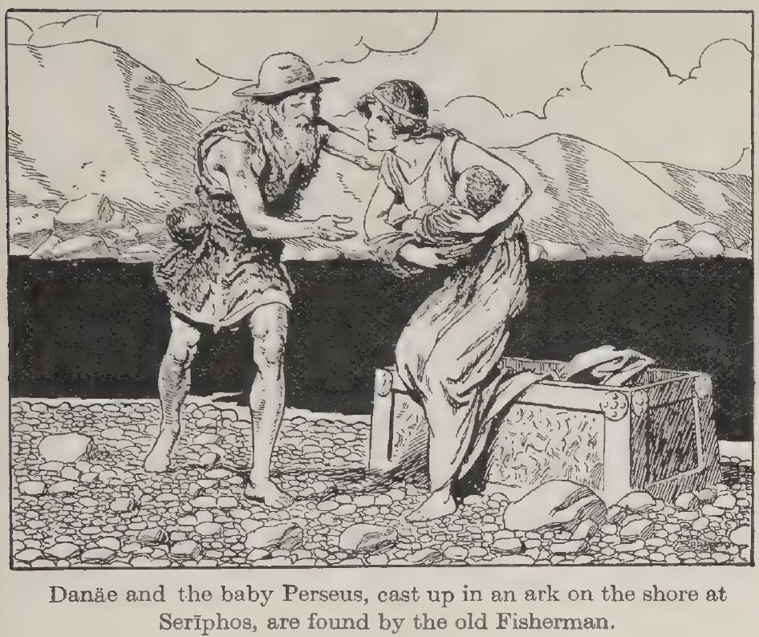

### 4. Perseus gets his outfit

Perseus, ubi haec audīvit, ex īnsulā discessit, et postquam ad continentem vēnit, Medūsam quaesīvit. Diū frūstrā quaerēbat; namque nātūram locī ignōrābat. Tandem Apollō et Minerva eī viam dēmōnstrāvērunt. Prīmum ad Graeās, Medūsae sorōrēs, pervēnit. Ab hīs tālāria et galeam magicam accēpit. Apollō autem et Minerva eī falcem et speculum dedērunt. Tum, postquam tālāria pedibus induit, in āera escendit. Diū per āera volābat: tandem tamen ad eum locum, ubi Medūsa cum cēterīs Gorgonibus habitābat, vēnit. Gorgonēs autem mōnstra erant speciē horribilī: capita enim eārum anguibus omnīnō contēcta erant; manūs etiam ex aere factae erant.

### 5. The Gorgon’s head

Rēs erat difficillima caput Gorgonis abscīdere. Eius enim cōnspectū hominēs lapideī fīēbant. Propter hanc causam Minerva Perseō speculum dederat. Ille igitur tergum vertit, et in speculum īnspiciēbat. Hōc modō ad locum, ubi Medūsa dormiēbat, vēnit. Tum falce suā eius caput ūnō ictū abscīdit. Cēterae Gorgonēs statim ē somnō excitātae sunt, et ubi rem vīdērunt, īrā commōtae sunt. Arma rapuērunt; nam Perseum occīdere volēbant. Ille autem, dum fugit, galeam magicam induit, et, ubi hoc fēcit, statim ē cōnspectū eārum ēvāsit.

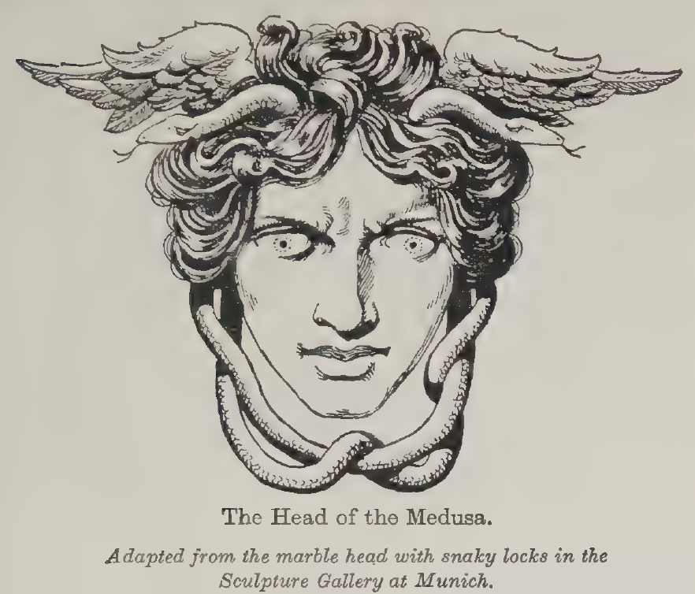

### 6. The sea serpent

Deinde Perseus in Aethiopum fīnēs vēnit. Ibi Cēpheus quīdam illō tempore rēgnābat. Hic Neptūnum, maris deum, quondam offenderat. Neptūnus autem mōnstrum saevissimum mīserat. Bēlua illa cottīdiē ē marī veniēbat, et hominēs dēvorābat. Ob hanc causam pavor animōs omnium occupāverat. Itaque Cēpheus deī Hammōnis ōrāculum cōnsuluit, atque ā deō fīliam mōnstrō trādere iussus est. Eius autem fīlia, nōmine Andromeda, virgō erat fōrmōsissima. Cēpheus, ubi haec audīvit, magnum dolōrem percēpit. Cīvēs tamen suōs ē tantō perīculō extrahere volēbat, atque ob eam causam Hammōnis iussa facere cōnstituit.

### 7. A human sacrifice

Tum rēx diem certam dīxit, et omnia parāvit. Ubi ea diēs vēnit, Andromeda ad lītus dēducta, et in omnium cōnspectū ad rūpem alligāta est. Omnēs eius fātum dēplōrābant, nec lacrimās tenēbant. At subitō, dum mōnstrum exspectant, Perseus accurrit; et, ubi lacrimās vīdit, dolēris causam quaesīvit. Illī rem tōtam expōnunt, et puellam dēmōnstrant. Dum haec geruntur, fremitus terribilis audītur; simul mōnstrum speciē horribilī procul cōnspicitur. Ēius cōnspectus timōrem maximum omnibus iniēcit. Deinde mōnstrum magnā celeritāte ad lītus contendit, iamque ad locum, ubi puella stābat, appropinquābat.

### 8. The rescue

At Perseus, ubi haec vīdit, gladium suum dēstrīnxit: et, postquam tālāria induit, in āera sublātus est. Tum dēsuper in mōnstrum impetum subitō fēcit: et eius collum graviter gladiō suō vulnerāvit. Mōnstrum, ubi vulnus sēnsit, fremitum horribilem ēdidit, et sine morā tōtum corpus in aquam mersit. Perseus, dum circum lītus volat, reditum eius exspectābat. Mare autem intereā undique sanguine īnficitur. Brevī tempore, bēlua rūrsus caput sustulit; statim tamen ā Perseō ictū graviōre vulnerāta est. Tum sē in undās iterum mersit, neque posteā vīsa est.

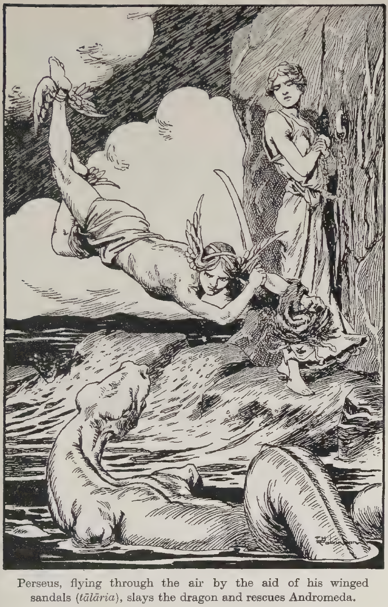

### 9. The reward of valour

Perseus, postquam in lītus dēscendit, prīmum tālāria exuit, tum ad rūpem, ad quam Andromeda alligāta erat, vēnit. Ea autem omnem salūtis spem iam dēposuerat, et, ubi Perseus adiit, terrōre paene exanimāta erat. Ille vincula eius statim solvit, et puellam patrī reddidit. Cēpheus ob hanc rem maximō gaudiō affectus est et meritās Perseō grātiās prō tantō beneficiō ēgit. Andromedam quoque ipsam eī in mātrimōnium dedit. Ille hoc dōnum laetitiā ēlātus accēpit, et puellam uxōrem dūxit. Paucōs annōs cum uxōre suā in eā regiōne habitābat, et apud omnēs Aethiopēs magnō erat in honōre. Magnō opere tamen mātrem suam rūrsus vidēre cupiēbat. Paulō post cum uxōre ē Cēpheī rēgnō discessit.

### 10. Turned to stone

Perseus, postquam ad īnsulam nāvem appulit, ad locum, ubi māter quondam habitāverat, sē contulit; at domum vacuam et omnīnō dēsertam invēnit. Trēs diēs per tōtam īnsulam mātrem quaerēbat; tandem quārtō diē ad Diānae templum pervēnit. Hūc Danaē, quod Polydectem timēbat, refūgerat. Perseus, ubi haec cognōvit, īrā magnā commōtus ad Polydectis rēgiam sine morā contendit, et, ubi eō vēnit, statim in ātrium irrūpit. Polydectēs magnō timōre affectus est, et fugere volēbat. Dum tamen ille fugit, Perseus eī caput Medūsae ostendit; ille autem, simul atque hoc vīdit, lapideus factus est.

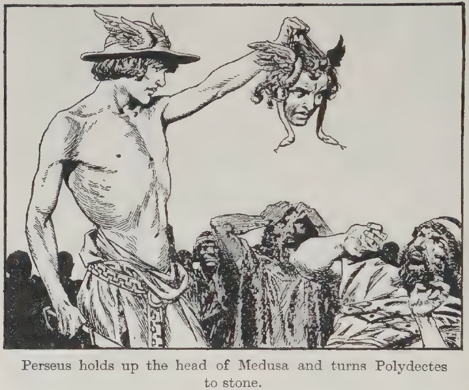

### 11. The oracle fulfilled

Posteā Perseus cum uxōre suā ad Acrisī urbem rediit. Ille autem, ubi Perseum vīdit, magnō terrōre affectus est: nam propter ōrāculum illud nepōtem suum etiamtum timēbat. Itaque in Thessaliam ad urbem Lārissam statim refūgit. Nēquīquam; neque enim fātum suum vītāvit. Post paucōs annōs rēx lūdōs magnōs Lārissae fēcit: nūntiōs in omnēs partēs dīmīserat, et diem dīxerat. Multī ex omnibus Graeciae urbibus ad lūdōs convēnērunt. Eōrum in numerō Perseus quoque ipse vēnit atque certāmen discōrum iniit. At, dum discum conicit, avum suum cāsū occīdit; Ācrisius enim inter eius certāminis spectātōrēs forte stābat.

## The story of Hercules

### 12. The infant prodigy

Herculēs, Alemēnae fīlius, ōlim in Graeciā habitābat. Hic omnium hominum validissimus fuisse dīcitur. At Iūnō, deōrum rēgīna, Alemēnam ōderat, et Herculem etiamtum īnfantem interficere voluit. Itaque duo serpentēs saevissimās mīsit. Hae, mediā nocte, in Alemēnae cubiculum, ubi Herculēs cum frātre suō dormiēbat, serpsērunt. Nec tamen in cūnīs, sed in magnō scūtō cubābant. Serpentēs illae appropinquāverant et scūtum iam movēbant. Tum mōtū subitō puerī ē somnō excitātī sunt.

### 13. Hercules and the serpents

Īphiclēs, Herculis frāter, magnā vōce exclāmāvit; at Herculēs ipse, puer fortissimus, nēquāquam territus est. Parvīs manibus serpentēs statim comprehendit, et eārum colla magnā vī compressit. Talī modō serpentēs ā puerō interfectae sunt. Alemēna autem, puerōrum māter, clāmōrem audīverat, et marītum suum ē somnō excitāverat. Ille lūmen accendit, et gladium suum arripuit. Tum ad puerōs properāvit, sed, ubi ad locum vēnit, rem mīram vīdit. Herculēs rīdēbat et serpentēs mortuās dēmōnstrābat.

### 14. The music lesson

Herculēs corpus suum ā puerō dīligenter exercēbat: magnam diēī partem in palaestrā cōnsūmēbat. Arcum quoque intendere et tēla conicere didicit. Hīs exercitātiōnibus vīrēs eius cōnfirmātae sunt. In mūsicā quoque ā Linō, Apollinis fīliō, ērudiēbātur. Huic tamen artī parum dīligenter studēbat. Hic Linus Herculem quondam, quod parum erat studiōsus, increpuit. Tum puer īrātus citharam subitō arripuit, et magistrī īnfēlīcis caput omnibus vīribus percussit. Ille ictū prōstrātus est, et paulō post ē vītā excessit, neque quisquam posteā id officium suscipere volēbat.

### 18. Hercules escapes from being sacrificed

Illa quoque, inter alia, dē Hercule nārrantur. Quondam, dum iter facit, in Aegyptiōrum fīnēs vēnit. Ibi rēx quīdam, nōmine Būsīris, illō tempore rēgnābat; hic autem, homō crūdēlissimus, hominēs immolāre cōnsuēverat. Herculem igitur corripuit, et in vincula coniēcit. Tum nūntiōs dīmīsit, et diem sacrificiō dīxit. Brevī tempore ea diēs appetīvit, et omnia rīte parāta sunt. Manūs Herculis catēnīs ferreīs vīnctae sunt. Iam caput eius sacerdōs molā salsā sparserat. Mōs enim apud antīquōs erat salem et far victimārum capitibus impōnere. Iam victima ad āram stābat; iam sacerdōs cultrum in manūs sūmpserat. Subitō tamen Herculēs vincula magnō cōnātū perrūpit. Tum sacerdōtem prīmō ictū prōstrāvit, alterō rēgem ipsum occīdit.

### 16. Ear-cropping

Herculēs, iam adulēscēns, Thēbīs habitābat. Thēbārum rēx, homō ignāvus, Creōn appellābātur. Minyae, gēns bellicōsissima, Thēbānīs erant fīnitimī. Lēgātī autem ā Minyīs ad Thēbānōs quotannīs mittēbantur: hī Thēbās veniēbant, et centum bovēs postulābant. Thēbānī enim ōlim ā Minyīs superātī erant atque tribūta rēgī Minyārum quotannīs pendēbant. At Herculēs cīvēs suōs hōc tribūtō līberāre cōnstituit. Itaque lēgātōs comprehendit, atque eōrum aurēs abscīdit. Lēgātī autem apud omnēs gentēs sacrōsānctī habentur.

### 17. Defeat of the Minyae

Ergīnus, rēx Minyārum, ob hanc causam vehementer īrātus cum omnibus cōpiīs in Thēbānōrum fīnēs contendit. Creōn eius adventum per explōrātōrēs cognōvit; ipse tamen pugnāre nōlēbat, nam magnō terrōre affectus erat. Itaque Thēbānī Herculem imperātōrem creāvērunt. Ille nūntiōs in omnēs partēs dīmīsit et cōpiās coēgit: tum proximō diē cum magnō exercitū profectus est. Locum idōneum dēlēgit, et aciem īnstrūxit. Tum Thēbānī ē superiōre locō impetum in hostēs fēcērunt. Illī autem impetum sustinēre nōn potuērunt: itaque hostium aciēs celeriter pulsa atque in fugam conversa est.

### 18. Madness and murder

Post hoc proelium Herculēs cōpiās suās ad urbem redūxit. Omnēs Thēbānī hāc victōriā maximē gaudēbant: Creōn autem Herculem magnīs honōribus decorāvit, atque eī fīliam suam in mātrimōnium dedit. Herculēs cum uxōre suā vītam beātam agēbat. Sed post paucōs annōs subitō in furōrem incidit, atque līberōs suōs suā ipse manū occīdit. Brevī posteā ad sānitātem reductus, propter hoc facinus magnō dolōre affectus est. Paulō post ex urbe effūgit, et in silvās sē recēpit. Cīvēs enim sermōnem cum eō habēre nōlēbant.

### 19. Hercules consults the oracle

Herculēs tantum scelus expiāre magnō opere cupiēbat. Itaque ad ōrāculum Delphicum īre cōnstituit: hoc enim ōrāculum omnium erat celeberrimum. Ibi templum erat Apollinis, plūrimīs dōnīs ōrnātum. Hōc in templō fēmina quaedam, nōmine Pyȳthia, sedēbat, et cōnsilium iīs, quī ad ōrāculum vēnerant, dabat. Haec autem fēmina ab ipsō Apolline docēbātur, atque hominibus deī voluntātem ēnūntiābat. Itaque Herculēs, quī Apollinem praecipuē colēbat, hūc vēnit. Tum rem tōtam exposuit, neque scelus, quod fēcerat, cēlāvit.

### 20. The oracle’s reply

Ubi Herculēs loquendī fīnem fēcit, Pȳthia diū tacēbat. Tandem tamen eum ad urbem Tīryntha īre, et Eurystheī rēgis omnia imperāta facere iussit. Herculēs, ubi hoc respōnsum audīvit, ad urbem illam contendit, et Eurystheō rēgī sē in servitūtem trādidit. Duodecim annōs apud Eurystheum iugum servīle patiēbātur et duodecim labōrēs, quōs ille imperāverat, cōnfēcit: hōc enim ūnō modō tantum scelus expiārī potuit. Dē hīs labōribus plūrima ā poētīs scrīpta sunt. Multa tamen, quae poētae nārrant, vix sunt crēdibilia.

### 21. First labour — Slaying the Nemean lion

Tum Herculēs prīmō leōnem, quī vallem Nemeaeam illō tempore īnfestam reddēbat, interficere ab Eurystheō iussus est. Itaque in silvās, in quibus leō habitābat, statim sē contulit. Simul ac feram vīdit, arcum, quem sēcum attulerat, intendit. Eius tamen pellem, quae erat dēnsissima, trāicere nōn potuit. Tum magnā clāvā, quam semper gerēbat, leōnem percussit. Nēquīquam! Nam nē hōc quidem modō eum interficere potuit. Tum dēmum mōnstrī collum bracchiīs suīs complexus eius faucēs omnibus vīribus compressit. Hōc modō leō brevī tempore exanimātus est; nūlla enim respīrandī facultās eī dabātur. Tum Herculēs cadāver ad oppidum umerīs rettulit; et pellem, quam dētrāxerat, posteā prō veste gerēbat. Omnēs autem, quī eam regiōnem incolēbant, ubi fāmam dē morte leōnis audīvērunt, vehementer gaudēbant, et Herculem magnō in honōre habēbant.

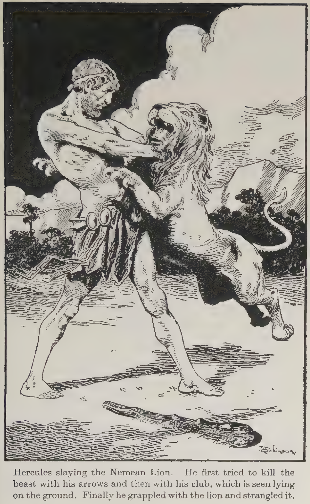

### 22. Second labour — Slaying the Lernaean hydra

Deinde ab Eurystheō Hydram interficere iussus est. Hydra autem serpēns erat immānis, cui novem erant capita. Herculēs igitur cum Iolāō, amīcō suō, ad palūdem Lernaeam, ubi Hydra habitābat, profectus est. Brevī posteā mōnstrum invēnit, et, quamquam rēs erat magnī perīculī, Hydrae corpus sinistrā comprehendit. Tum dextrā novem capita abscīdere coepit: quotiēns tamen hoc fēcerat, nova capita exoriēbantur. Diū frūstrā labōrābat; tandem hōc cōnātū dēstitit. Deinde arborēs succīdere et ignem accendere cōnstituit. Hoc celeriter fēcit, et, postquam ligna ignem comprehendērunt, face ardente colla, unde capita exoriēbantur, adussit. Nec tamen sine magnō labōre haec fēcit: cancer enim ingēns, quī, dum Herculēs capita abscīdit, crūra eius mordēbat, Hydrae erat auxiliō. Postquam mōnstrum tālī modō interfēcit, sagittās suās sanguine eius imbuit, itaque mortiferās eās reddidit.

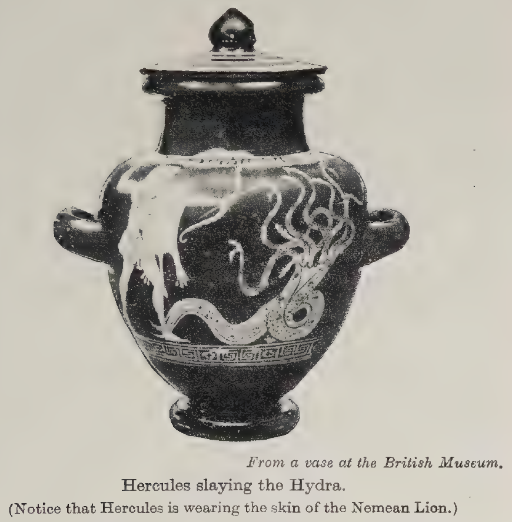

### 23. Third labour — Capture of the Cerynian stag

Postquam Hydram occīsam esse Eurystheō nūntiātum est, magnus timor eius animum occupāvit. Itaque Herculem cervum quendam vīvum ad sē referre iussit; virum enim tantae audāciae in urbe retinēre nōlēbat. Hic autem cervus, cuius cornua aurea fuisse trāduntur, incrēdibilī fuit celeritāte. Herculēs prīmum vestīgia eius in silvīs persequēbātur; deinde, ubi cervum ipsum vīdit, omnibus vīribus atque opibus currere coepit. Ūsque ad vesperum currēbat, neque nocturnum tempus sibi ad quiētem relinquēbat. Nēquīquam! Nam nūllō modō praedam cōnsequī poterat. Tandem, postquam tōtum annum (ut trāditur) cucurrit, cervum cursū exanimātum cēpit, et vīvum ad Eurystheum rettulit.

### 24. Fourth labour - The Erymanthian boar

Posteā Herculēs aprum quendam, quī agrōs Frymanthiōs illō tempore vāstābat, et incolās huius regiōnis magnō opere terrēbat, vīvum capere iussus est. Herculēs rem suscēpit, et in Arcadiam profectus est. Postquam in silvam paulum prōgressus est, aprō occurrit. Ille autem, simul atque Herculem cōnspexit, statim refūgit: et, timōre perterritus, in altam fossam sē prōiēcit. Itaque Herculēs laqueum, quem attulerat, aprō iniēcit; et summā cum difficultāte eum ē fossā extrāxit. Ille, etsī multum repugnābat, nūllō modō sē Hīberāre potuit. Hōc modō aper Erymanthius ab Hercule ad Eurystheum vīvus relātus est.

### 25. Hercules at the Centaur’s cave

Dē quārtō labōre, quem suprā nārrāvimus, illa quoque trāduntur. Herculēs, dum iter in Arcadiam facit, ad eam regiōnem, quam Centaurī incolēbant, vēnit. Centaurī autem equī erant, quī caput hūmānum habēbant. Appetēbat iam nox; itaque sine morā ad spēluncam, in quā centaurus quīdam, nōmine Pholus, habitābat, dēvertit.

Ille Herculem benignē excēpit et cēnam parāvit. At Herculēs, postquam cēnāvit, vīnum ā Pholō postulāvit. Erat autem in spēluncā magna amphora, vīnī optimī plēna, quam Centaurī ibi dēposuerant. Pholus autem hoc vīnum, quod reliquōs Centaurōs timēbat, dare nōlēbat; nūllum tamen vīnum praeter hoc in spēluncā habēbat. ‘Hoc vīnum,’ inquit, ‘mihi commissum est. Sī tibi id dabō, Centaurī mē interficient.’ Herculēs tamen eum irrīsit, et ipse vīnī pōculum ex amphorā hausit.

### 26. The fight with the Centaurs

Simulatque amphora aperta est, odor iūcundissimus undique diffūsus est: vīnum enim erat suāvissimum. Centaurī, ubi nōtum odōrem sēnsērunt, omnēs ad locum convēnērunt.

Centaurī autem illī, ubi ad spēluncam pervēnērunt, magnō opere, quod Herculem bibentem vīdērunt, erant īrātī. Tum arma cēpērunt, et Pholum interficere volēbant. Herculēs tamen in spēluncae aditū cōnstitit, et eōrum impetum fortissimē sustinēbat. Facēs ardentēs in eōs coniēcit: multōs quoque sagittīs suīs vulnerāvit. Hae autem sagittae eaedem erant, quae sanguine Hydrae quondam imbūtae erant. Omnēs igitur, quōs ille sagittīs suīs vulnerāverat, venēnō statim absūmptī sunt: reliquī autem, ubi hoc vīdērunt, terga vertērunt et salūtem fugā petiērunt.

### 27. The fate of Pholus

Postquam reliquī fūgērunt, Pholus ē spēluncā ēgressus corpora eōrum, quī sagittīs interfectī erant, spectābat. Magnō opere autem, quod tam levī vulnere exanimātī essent, mīrābātur, et causam eius reī quaerēbat. Adiit igitur locum, ubi Centaurī cuiusdam cadāver iacēbat, et sagittam ē vulnere extrāxit. Haec tamen, sīve cāsū sīve deōrum cōnsiliō, ē manibus eius ēlāpsa est, et pedem leviter vulnerāvit. Ille ē vestīgiō dolōrem gravem omnibus membrīs sēnsit, et paulō post vī venēnī exanimātus est. Brevī posteā Herculēs, quī reliquōs Centaurōs secūtus erat, ad spēluncam rediit, et magnō cum dolōre Pholum mortuum vīdit. Multīs cum lacrimīs amīcī suī corpus sepelīvit; tum, postquam alterum vīnī pōculum exhausit, somnō sē dedit.

### 28. Fifth labour — Cleansing the Augean stables

Deinde Eurystheus Herculī labōrem graviōrem imposuit. Augeās quīdam, quī rēgnum illō tempore in Ēlide obtinēbat, tria mīlia boum habēbat. Hī in stabulō ingentis magnitūdinis inclūsī erant. Sed stabulum illud illuviē ac squālōre obsitum erat: neque enim ūsque ad id tempus umquam pūrgātum erat. Locum illum Herculēs ūnō diē pūrgāre iussus est. Ille, etsī rēs erat multae operae, negōtium suscēpit. Prīmum, fossam duodēvīgintī pedum, per quam flūminis aquam dē montibus ad mūrum stabulī dūxit, magnō labōre fōdit. Tum, postquam mūrum perrūpit, aquam in stabulum immīsit. Talī modō, contrā opīniōnem omnium, opus cōnfēcit.

### 29. Sixth labour — The birds of Stymphalus

Paucīs post diēbus Herculēs ad oppidum Stymphālum iter fēcit; Eurystheus enim eī, ut avēs Stymphālidas interficeret, imperāverat. Hae avēs rōstra aēnea habēbant, et carne hūmānā vēscēbantur. Ille, postquam ad locum pervēnit, lacum vīdit: in hōc autem lacū, quī nōn procul erat ab oppidō, avēs illae habitābant. Nūlla tamen appropinquandī facultās dabātur; lacus enim nōn ex aquā sed ē līmō cōnstitit. Herculēs igitur neque pedibus neque lintre prōgredī potuit.

Itaque ille, cum magnam diēī partem frūstrā iam cōnsūmpsisset, hōc cōnātū dēstitit. Deinde ad Minervam, ut auxilium ab eā peteret, sē contulit. Illa eī crotalum, quod Vulcānus, quī ā fabrīs maximē colēbātur, ex aere fabricātus erat, dedit. Tum Herculēs crotalō suō tam terribilem crepitum fēcit, ut avēs perterritae āvolārent. Ille autem, dum āvolant, magnum numerum eārum sagittīs trānsfīxit.

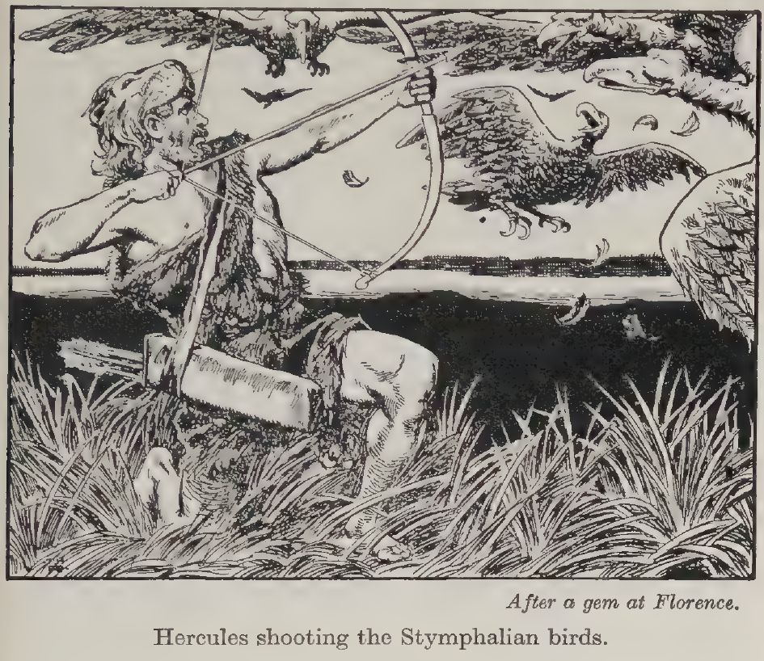

### 30. Seventh labour — The Cretan bull

Tum Eurystheus Herculī, ut taurum quendam indomitum ex īnsulā Crētā vīvum ad sē referret, imperāvit. Itaque ille nāvem cōnscendit, et, cum ventus secundus esset, statim solvit. Cum tamen īnsulae iam appropinquāret, tanta tempestās subitō coorta est, ut nāvis cursum tenēre nōn posset. Tantus timor animōs nautārum occupāvit, ut paene omnem salūtis spem dēpōnerent. Herculēs tamen, etsī nāvigandī erat imperītus, haudquāquam territus est.

Brevī posteā summa tranquillitās cōnsecūta est, et nautae, quī sē ex timōre iam recēperant, nāvem incolumem ad terram appulērunt. Herculēs ē nāvī ēgressus est, et, cum ad rēgem Crētae vēnisset, veniendī causam docuit. Deinde, postquam omnia parāta sunt, ad eam regiōnem, quam taurus vāstābat, contendit. Paulō post taurum vīdit, et, quanquam rēs erat magnī perīculī, cornua eius comprehendit. Tum, cum mōnstrum ingentī labōre ad nāvem trāxisset cum praedā in Graeciam rediit.

### 31. Eighth labour — Capture of the horses of Diomede

Herculēs, postquam ex īnsulā Crētā rediit, ab Eurystheō in Thrāciam, ut equōs Diomēdis redūceret, missus est. Hī equī carne hūmānā vēscēbantur. Diomēdēs autem homō crūdēlissimus, peregrīnōs omnēs, quī in eam regiōnem vēnerant, iīs obiciēbat. Itaque Herculēs in Thrāciam magnā celeritāte contendit, et ab Diomēde, ut equī sibi trāderentur, postulāvit. Cum tamen ille hoc facere nōllet, Herculēs, īrā commōtus, rēgem interfēcit, et eius cadāver equīs obicī iussit.

Ita mīra rērum commūtātiō facta est. Is enim, quī anteā multōs cum cruciātū necāverat, ipse eōdem suppliciō necātus est. Cum haec nūntiāta essent, omnēs, quī eam regiōnem incolēbant, maximā laetitiā affectī sunt, et Herculī meritam grātiam referēbant. Nōn modo eum maximīs honōribus et praemiīs decorāvērunt; sed etiam, ut rēgnum ipse susciperet, ōrābant. Ille tamen hoc facere nōlēbat, et, cum ad mare redīsset, nāvem cōnscendit. Ubi omnia ad nāvigandum parāta sunt, equōs in nāvem imposuit. Deinde, cum tempestātem idōneam nactus esset, sine morā ē portū solvit; et paulō post equōs in lītus Argolicum exposuit.

### 32. Ninth labour — The girdle of Hippolyte

Amāzonum gēns omnīnō ex mulieribus cōnstitisse dīcitur. Hae summam reī mīlitāris scientiam habēbant, et tantum cēterīs mulieribus virtūte praestābant, ut cum virīs proelium committere audērent. Hippolytē, Amāzonum rēgīna, balteum praeclārum, quem Mārs eī dederat; possidēbat. Fāma autem dē hōc balteō ad Admētēn, Eurystheī fīliam, allāta erat. Vehementer illa eum habēre cupiēbat. Itaque Eurystheus Herculī, ut cōpiās cōgeret, et bellum Amāzonibus īnferret, mandāvit. Ille nūntiōs in omnēs partēs dīmīsit, et, cum magna multitūdō convēnisset, eōs, quī maximum ūsum in rē mīlitārī habēbant, dēlēgit.

### 33. The girdle refused

Herculēs, postquam itineris causam exposuit, hīs virīs ut sēcum iter facerent, persuāsit. Tum, cum iīs, quibus persuāserat, nāvem cōnscendit, et, cum ventus secundus esset, paucīs post diēbus ad ōstium flūminis Thermōdontis appulit. Postquam in Amāzonum fīnēs vēnit, nūntium, quī veniendī causam docēret, et balteum posceret, ad Hippolytam mīsit. Ipsa Hippolytē balteum, quod ad eam fāma de Herculis virtūte allāta erat, trādere volēbat. Reliquae tamen Amāzones eī, ut negāret, persuāsērunt. At Herculēs, cum haec nūntiāta essent, bellī fortūnam tentāre cōnstituit.

Itaque proximō diē, cum cōpiās ēdūxisset, locum idōneum dēlēgit, et hostēs ad pugnam ēvocāvit. Amāzones quoque cōpiās suās ē castrīs ēdūxērunt, et aciem nōn magnō intervallō īnstrūxērunt.

### 34. The battle

Erat palūs nōn magna inter duo exercitūs: neutrī tamen trānseundī initium facere volēbant. Tandem Herculēs signum dedit et, ubi palūdem trānsiit, proelium commīsit.

Amāzones impetum virōrum fortissimē sustinuērunt et contrā opīniōnem omnium tantam virtūtem praestitērunt, ut multōs eōrum occīderent, multōs etiam in fugam conicerent. Virī enim novō pugnae genere perturbābantur, nec solitam virtūtem praestābant. Herculēs autem, cum haec vidēret, dē suīs fortūnīs dēspērāre coepit. Itaque mīlitēs vehementer, ut prīstinae virtūtis memoriam retinērent, neu tantum dēdecus admitterent, hostiumque impetum fortiter sustinērent, cohortātus est. Quibus verbīs animōs omnium ita ērēxit, ut multī eōrum, quī vulneribus cōnfectī essent, proelium sine morā redintegrārent.

### 38. Defeat of the Amazons

Diū et ācriter pugnātum est. Tandem tamen ad sōlis occāsum tanta rērum commūtātiō facta est, ut mulierēs terga verterent et salūtem fugā peterent. Multae autem vulneribus dēfessae, dum fugiunt, captae sunt; quārum in numerō ipsa erat Hippolytē. Herculēs summam clēmentiam praestitit, et, postquam balteum accēpit, lībertātem omnibus captīvīs reddidit. Posteā sociōs suōs ad mare redūxit, et, quod nōn multum aestātis supererat, in Graeciam proficīscī mātūrāvit. Itaque nāvem cōnscendit, et, tempestātem idōneam nactus, statim solvit. Antequam tamen in Graeciam pervēnit, ad urbem Trōiam nāvem appellere cōnstituit: frūmentum enim, quod sēcum habēbat, iam dēficere coeperat.

### 36. Laomedon and the sea monster

Lāomedōn quīdam rēgnum illō tempore Trōiae obtinēbat. Ad hunc Neptūnus et Apollō annō superiōre vēnerant, et, cum Trōia nōndum moenia habēret, ad hoc opus cōnficiendum auxilium suum obtulerant. Postquam tamen eōrum auxiliō moenia cōnfecta sunt, Lāomedōn praemium, quod prōposuerat, persolvere nōlēbat.

Itaque Neptūnus et Apollō, ob hanc causam īrātī, mōnstrum quoddam speciē horribilī, quod cottīdiē ē marī veniēbat, et hominēs pecudēsque vorābat, mīsērunt. Sed Trōiānī, timōre perterritī, in urbe continēbantur, et pecora omnia ex agrīs intrā mūrōs compulerant. Lāomedōn, hīs rēbus commōtus, ōrāculum cōnsuluit: deus autem eī, ut Hēsionēn, fīliam suam, mōnstrō obiceret, praecēpit.

### 37. The rescue of Hesione

Lāomedōn, cum hoc respōnsum renūntiātum esset, magnum dolōrem percēpit; sed tamen, ut cīvēs suōs tantō perīculō līberāret, ōrāculō pārēre cōnstituit, et diem sacrificiō dīxit. Herculēs autem Trōiam, sīve cāsū sīve deōrum cōnsiliō, tempore opportūnissimō attigit. Ipsō enim temporis pūnctō, quō puella catēnīs vīncta ad lītus dēdūcēbātur, vir ille validissimus nāvem ibi appulit. Herculēs, ē nāvī ēgressus, dē rēbus, quae gerēbantur, certior factus est. Tum, īrā incēnsus, ad rēgem sē contulit, atque auxilium suum obtulit. Cum rēx libenter eī, ut, sī posset, puellam līberāret, concessisset, Herculēs mōnstrum interfēcit, et puellam, quae iam omnem salūtis spem dēposuerat, incolumem ad patrem redūxit. Lāomedōn fīliam suam magnō cum gaudiō accēpit, et Herculī prō tantō beneficiō meritās grātiās ēgit.

### 38. Tenth labour — The oxen of Geryon

Deinde Herculēs ad īnsulam Erythēam, ut bovēs Gēryonis arcesseret, missus est. Rēs erat summae difficultātis, quod bovēs ab Eurytiōne, virō ingentis statūrae et ā cane bicipete custōdiēbantur. Ipse autem Gēryōn speciem horribilem praebēbat: tria enim eī erant corpora inter sē coniūncta. Herculēs, etsī intellegēbat, quantum esset perīculum, tamen negōtium suscēpit: et postquam per multās terrās iter fēcit, ad eam partem Āfricae, quae Eurōpae adiacet, pervēnit. Ibi in utrōque fretī lītore, quod Eurōpam ab Āfricā dīvidit, columnās, quae posteā Herculis Columnae appellābantur, cōnstituit.

### 39. The golden ship

Herculēs, dum hīc morātur, magnum incommodum ā nimiō sōlis calōre accipiēbat. Tandem, īrā commōtus, arcum suum intendit, et sōlem sagittīs petiit. Sōl tamen audāciam virī tantum admīrātus est, ut eī lintrem auream dederit. Herculēs hoc dōnum libentissimē accēpit; nūllam enim nāvem in hīs regiōnibus invenīre potuerat. Tum lintrem dēdūxit, et, ventum nactus idōneum, brevī tempore ad īnsulam pervēnit. Ubi ex incolīs, quō in locō bovēs essent, cognōvit, in eam partem statim profectus est, et ā rēge Gēryone, ut bovēs sibi trāderentur, postulāvit. Cum tamen ille hoc facere nōllet, Herculēs et rēgem ipsum et Eurytiōnem ingentem interfēcit.

### 40. A miraculous hail-storm

Tum Herculēs bovēs per Hispāniam et Liguriam compellere cōnstituit. Itaque, postquam omnia parāta sunt, bovēs ex īnsulā ad continentem trānsportāvit. Ligurēs autem, gēns bellicōsissima, dum ille per eōrum fīnēs iter facit, magnās cōpiās collēgērunt, atque eum longius prōgredī prohibēbant. Quae rēs Herculī magnum attulit incommodum. Barbarī enim in locīs superiōribus cōnstiterant, et saxa tēlaque in eum coniciēbant. Ille quidem paene omnem salūtis spem dēposuerat. Sed Iuppiter imbrem lapidum ingentium ē caelō tempore opportūnissimō dēmīsit. Hī tantā vī cecidērunt, ut magnum Ligurum numerum interficerent; ipse tamen Herculēs (mīrābile dictū) nihil incommodī cēpit.

### 41. Passage of the Alps

Herculēs, postquam Ligurēs hōc modō superātī sunt, quam celerrimē prōgressus est, et paucīs post diēbus ad Alpēs pervēnit. Hōs autem montēs eī, ut bovēs eōs in Ītaliam agere posset, trānsīre necesse erat. Rēs tamen summae erat difficultātis. Alpēs enim, quae Galliam ulteriōrem ab Ītaliā dīvidunt, nive perennī tēctae sunt; quam ob causam neque frūmentum neque pābulum in hīs regiōnibus invenīrī poterat. Herculēs igitur, antequam ascendere coepit, magnam frūmentī pābulque cōpiam comparāvit, et bovēs hīs rēbus onerāvit. Postquam trēs diēs hōc modō cōnsūmpsit, quārtō diē profectus est, et contrā omnium opīniōnem, bovēs incolumēs in Ītaliam trādūxit.

### 42. Cacus steals the oxen

Brevī posteā, ad flūmen Tiberim vēnit. Illō tamen tempore nūlla erat in eō locō urbs. Rōma enim nōndum condita erat. Herculēs, itinere fessus, ibi paucōs diēs, ut sē ex labōribus suīs recreāret, morārī cōnstituit. Haud procul ā valle, ubi bovēs pāscēbat, spēlunca erat, in quā pāstor quīdam ingēns, nōmine Cācus, id temporis habitābat. Hic speciem terribilem, nōn modo quod ingentī corporis magnitūdine erat, sed etiam quod ignem ex ōre efflābat, praebēbat. Ad Cācum autem dē adventū Herculis fāma allāta erat. Itaque noctū vēnit, et, dum Herculēs dormit, quattuor bovēs eximiōs pulchritūdine abripuit. Hōs bovēs āversōs, nē ipsa vestīgia quaerentem Herculem eō dēductūra essent, ubi ille eōs abdidisset, caudīs in spēluncam trāxit.

### 43. Hercules discovers the theft

Posterō diē, simul atque ē somnō excitātus est, Herculēs fūrtum animadvertit, et quō in locō bovēs āmissī abditī essent, quaerēbat. Eōs tamen, nōn modo quod locī nātūram omnīnō ignōrābat, sed etiam quod vestīgiīs falsīs dēceptus est, nusquam reperīre poterat.  Tandem, cum magnam diēī partem frūstrā cōnsūmpsisset, cum reliquīs bōbus prōgredī cōnstituit. At, dum proficīscī parat, ūnus ē bōbus, quōs sēcum habuit, mūgīre coepit. Sed illō ipsō temporis pūnctō iī, quī in spēluncā inclūsī erant, mūgītum repente reddidērunt. Vōx autem illa inclūsōrum in spēluncā boum Herculem statim convertit atque hōc modō eum, quō in locō abditī essent, certiōrem fēcit. Ille īrā incēnsus ad spēluncam quam celerrimē, ut praedam reciperet, sē contulit. At Cācus saxum ingēns ita dēiēcerat, ut aditus spēluncae omnīnō obstruerētur.

### 44. Recovery of the oxen

Herculēs, cum nūllum alium introitum reperīre posset, hoc saxum āmovēre cōnātus est: sed propter eius magnitūdinem rēs erat difficillima. Diū frūstrā labōrābat, neque quidquam efficere poterat: tandem tamen saxum magnō cōnātū āmōvit, et spēluncam patefēcit. Ibi āmissōs bovēs magnō cum gaudiō cōnspexit: sed Cācum ipsum, quod spēlunca plēna erat fūmī, quem ille mōre suō efflābat, vix cernere potuit. Herculēs, inūsitātā speciē turbātus, parumper haesitābat; paululum tamen cūnctātus in spēluncam irrūpit, et mōnstrī collum bracchiīs complexus est. Ille, etsī multum repugnābat, nūllō modō sē līberāre potuit; et, cum nūlla respīrandī facultās darētur, sine morā exanimātus est.

### 45. Eleventh labour — The golden apples of the Hesperides

Eurystheus, postquam Gēryonis bovēs accēpit, labōrem ūndecimum, graviōrem iīs, quōs suprā nārrāvimus, Herculī imposuit. Eī enim, ut aurea māla ex Hesperidum hortō auferret, mandāvit. Hesperides autem nymphae erant quaedam fōrmā praestantissimā, quae in terrā longinquā habitābant, et quibus aurea quaedam māla ā Iūnōne commissa erant. Multī hominēs, aurī cupiditāte inductī, haec māla auferre iam anteā cōnātī erant. Rēs tamen erat difficillima: namque hortus, in quō māla erant, mūrō ingentī undique circumdatus erat: praetereā dracō quīdam, cui centum erant capita, introitum hortī dīligenter custōdiēbat. Opus igitur, quod Eurystheus Herculī imperāverat, nōn modo ob eās causās, quās commemorāvimus, sed etiam quod Herculēs, quō in locō hortus ille situs esset, omnīnō ignōrābat, summae erat difficultātis.

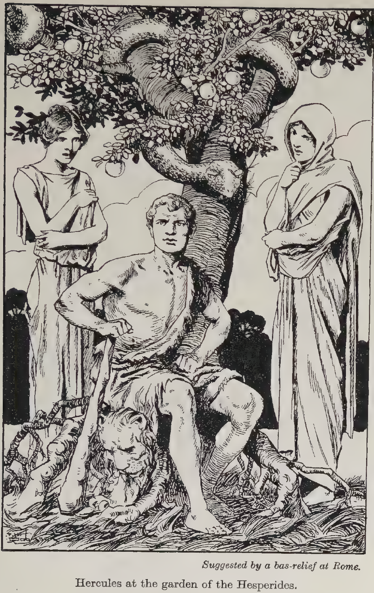

### 46. Atlas, who upheld the heavens

Herculēs, quamquam quiētī sē trādere vehementer cupiēbat, tamen Eurystheō pārēre cōnstituit; et simul ac iussa eius accēpit, proficīscī mātūrāvit. Ā multīs mercātōribus, quō in locō Hesperides habitārent, quaesīverat; nihil tamen certī reperīre potuerat. Frūstrā per multās terrās iter fēcit, et multa perīcula subiit: tandem, cum tōtum annum in hīs itineribus cōnsūmpsisset, ad extrēmam orbis terrārum partem, quae Ōceanō adiacet, pervēnit. Hīc stābat vir quīdam, nōmine Atlās, ingentī corporis magnitūdine, quī caelum (ut trāditum est), nē in terram dēcideret, umerīs suīs sustinēbat. Herculēs tantās vīrēs magnō opere mīrātus, paulō post cum Atlante colloquēbātur, et, cum itineris causam docuisset, auxilium ab eō petiit.

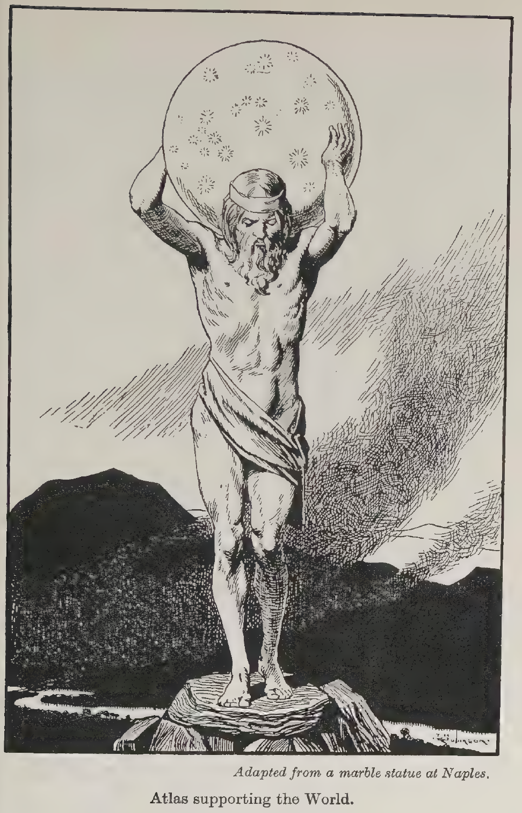

### 47. A substitute

Atlās autem Herculī maximē prōdesse potuit. Ille enim, quippe quī ipse Hesperidum pater esset, quō in locō hortus situs esset, certō sciēbat. Postquam igitur audīvit, quam ob causam Herculēs vēnisset, ‘Ipse,’ inquit, ‘ad hortum ībō, et fīliābus meīs, ut māla suā sponte trādant, persuādēbō.’ Herculēs, cum haec audīret, magnō opere gāvīsus est: vim enim adhibēre, dummodo rēs aliter fierī posset, nōlēbat. Oblātum igitur auxilium accipere cōnstituit. Atlās tamen, ut, dum ipse abest, Herculēs caelum umerīs sustinēret, postulāvit. Hoc negōtium Herculēs libenter suscēpit: et, quamquam rēs erat summī labōris, tōtum pondus caelī complūrēs diēs continuōs sōlus sustinēbat.

### 48. Return of Atlas

Atlās intereā abierat, et ad Hesperidum hortum, quī pauca mīlia passuum aberat, sē quam celerrimē contulerat. Eō cum vēnisset, veniendī causam exposuit, et fīliās suās vehementer, ut māla trāderent, hortātus est. Illae diū haerēbant: hoc enim facere, quod ab ipsā Iūnōne (sīcut ante dictum est) hoc mūnus accēperant, nōlēbant. Atlās tamen, nōn sine difficultāte, iīs, ut sibi pārērent, persuāsit atque māla ad Herculem rettulit. Herculēs intereā, cum plūrēs diēs exspectāvisset, neque ūlla fāma ad sē dē Atlantis reditū allāta esset, hāc morā graviter commōtus est. Tandem quīntō diē Atlantem vīdit redeuntem, et brevī posteā māla magne cum gaudiō accēpit. Tum, postquam grātiam prō tantō beneficiō rettulit, ad Graeciam proficīscī mātūrāvit.

### 49. Twelfth labour — Cerberus, the three-headed dog

Postquam aurea māla ad Eurystheum relāta sunt, ūnus modo ē duodecim labōribus, quōs Pȳthia Herculī praecēperat, relictus est. Eurystheus autem, cum Herculem magnō opere timēret, eum in aliquem locum, unde numquam reditūrus esset, mittere cōnstituit. Itaque eī, ut canem Cerberum ex Orcō in lūcem traheret, negōtium dedit. Hoc opus omnium erat difficillimum, nēmō enim umquam ex Orcō redierat. Praetereā Cerberus ille mōnstrum erat horribilī speciē, cui tria erant capita anguibus saevissimīs contēcta. Antequam tamen dē hōc labōre nārrāmus, nōn aliēnum, quoniam dē Orcō mentiōnem fēcimus, pauca dē illā regiōne prōpōnere esse vidētur.

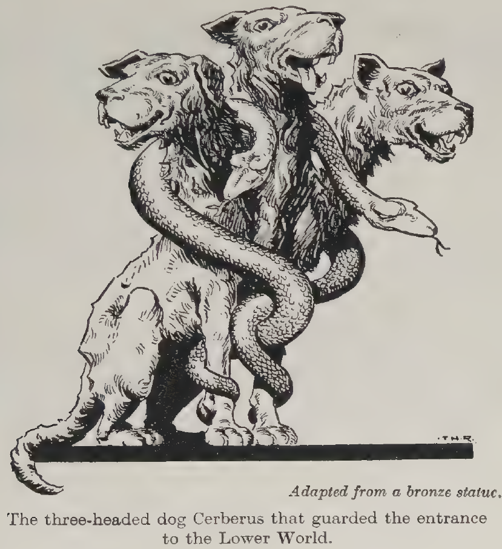

### 50. Orcus or Hades, the abode of the dead

Dē Orcō, quī īdem īnferī appellābātur, illa trāduntur. Ut quisque ē vītā excesserat, mānēs eius ad Orcum, mortuōrum sēdem, ā deō Mercuriō dēdūcēbantur. Huius regiōnis, quae sub terrā fuisse dīcitur, rēx erat Plūtō, cui uxor erat Prōserpina, Iovis et Cereris fīlia. Mānēs ā Mercuriō dēductī prīmum ad rīpam Stygis flūminis, quō Plūtōnis rēgnum continēbātur, veniēbant. Hoc flūmen, antequam in Orcum venīre possent, trānsīre necesse erat. Cum tamen in Styge nūllus pōns factus esset, mānēs ā Charonte quōdam, quī cum parvā cymbā ad rīpam exspectābat, trānsvehēbantur. Charōn mercēdem prō hōc officiō postulābat, neque quemquam, nisi quī hoc praemium prius dedisset, trānsvehere volēbat. Quam ob causam mōs, ut nummum in mortuī ōre eō cōnsiliō pōnerent, ut, cum ille ad Styga vēnisset, pretium trāiectūs solvere posset, apud antīquōs fuisse trāditur. Iī autem, quī post mortem in terrā nōn sepultī erant, Styga trānsīre nōn poterant, sed in rīpā per centum annōs errāre cōgēbantur; tum dēmum Orcum intrāre licēbat.

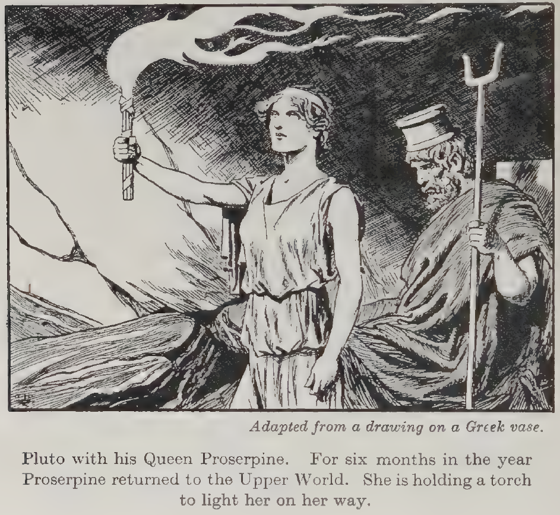

### 51. The realm of Pluto

Postquam mānēs Styga hōc modō trānsiērunt, ad aliud flūmen, quod Lēthē appellābātur, veniēbant. Ex hōc flūmine aquam bibere cōgēbantur: quod cum fēcissent, rēs omnēs in vītā gestās ē memoriā dēpōnēbant. Dēnique ad sēdem ipsam Plūtōnis, cuius introitus ā cane Cerberō custōdiēbātur, veniēbant. Ibi Plūtō, nigrum vestītum indūtus, cum uxōre Prōserpinā in soliō sedēbat. Stābant etiam nōn procul ab eō locō tria alia solia, in quibus Mīnōs, Rhadamanthus, Aeacus, quī iūdicēs erant apud īnferōs, sedēbant. Hī mortuīs iūs dīcēbant, et praemia poenāsque cōnstituēbant. Bonī enim in Campōs Ēlysiōs, beātōrum sēdem, veniēbant: improbī autem in Tartarum, ubi multīs variīsque suppliciīs excruciābantur, mittēbantur.

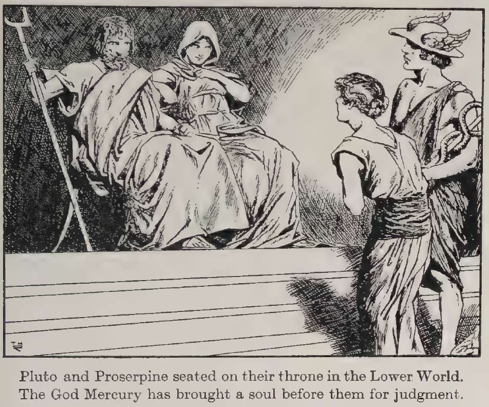

### 52. Charon’s ferry

Herculēs, postquam Eurystheī imperia accēpit, in Lacōniam ad Taenarum statim sē contulit: ibi enim spēlunca, per quam, ut trāditum est, hominēs ad Orcum dēscendēbant, hiātū vāstō patēbat. Eō cum vēnisset, ex incolīs, quō in locō spēlunca illa sita esset, quaesīvit: quod cum cognōvisset, sine morā dēscendere cōnstituit. Nec tamen sōlus hoc iter fēcit: Mercurius enim et Minerva eī sē sociōs adiūnxerant. Ubi ad rīpam Stygis vēnit, Herculēs Charontis cymbam, ut ad rīpam ulteriōrem trānsīret, cōnscendit. Cum tamen Herculēs vir esset ingentī corporis magnitūdine, Charōn solvere nōlēbat; magnō opere enim, nē cymba sua, tantō pondere onerāta, in mediō flūmine mergerētur, verēbātur. Tandem tamen minīs Herculis territus, Charōn cymbam solvit, et eum incolumem ad ulteriōrem rīpam trānsportāvit.

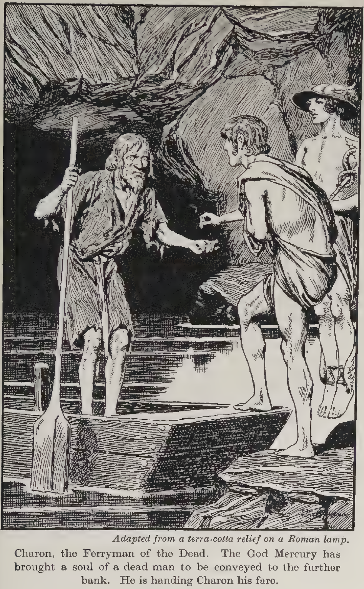

### 53. The twelve labours accomplished

Herculēs, postquam flūmen Styga ad hunc modum trānsiit, in ipsam Plūtōnis sēdem pervenit; et, postquam veniendī causam docuit, ab eō, ut Cerberum auferre sibi licēret, petīvit. Plūtō, ad quem fāma dē Hercule iam allāta erat, eum benignē excēpit, et facultātem, quam ille petēbat, libenter dedit. Herculem tamen, ut, cum Eurystheī imperāta fēcisset, Cerberum in Orcum rūrsus redūceret, postulāvit. Herculēs sē hoc factūrum pollicitus, Cerberum, quem nōn sine magnō perīculō manibus prehenderat, summō cum labōre ex Orcō in lūcem atque ad urbem Eurystheī trāxit. Eō cum vēnisset, tantus terror animum Eurystheī occupāvit, ut ex ātriō statim refugeret. Cum autem paulum sē ex terrōre recēpisset, multīs cum lacrimīs Herculem, ut mōnstrum sine morā in Orcum redūceret, obsecrāvit. Sīc, contrā omnium opīniōnem, duodecim illī labōrēs, quōs Pȳthia eī praecēperat, duodecim annīs cōnfectī sunt. Quae cum ita essent, Herculēs, servitūte tandem līberātus magnō cum gaudiō Thēbās rediit.

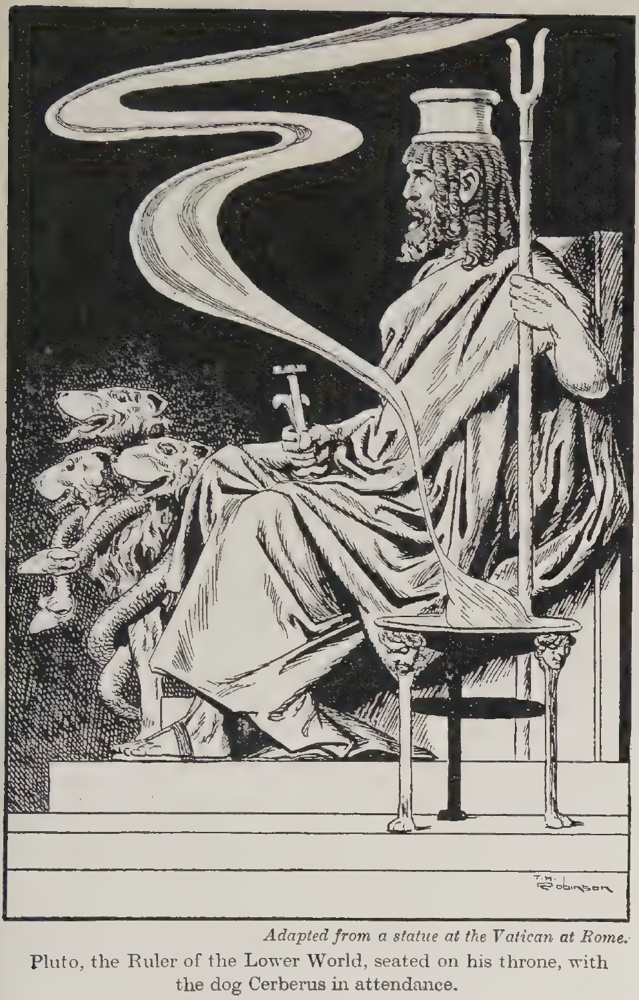

### 54. Nessus, the centaur

Posteā Herculēs multās aliās et praeclārās rēs, quās nunc perscrībere longum est, gessit. Tandem, iam aetāte prōvectus, Dēianīram, Oeneī fīliam, in mātrimōnium dūxit. Tribus post annīs tamen puerum quendam, nōmine Eunomum, cāsū occīdit. Cum autem mōs esset ut, sī quis hominem cāsū occīdisset, in exsilium īret, Herculēs cum uxōre suā ē fīnibus eius cīvitātis exīre mātūrāvit. Dum iter faciunt, ad flūmen quoddam pervēnērunt, in quō nūllus pōns factus erat. Quaerentibus, quō modō flūmen trānsvehī possent, Centaurus quīdam, nōmine Nessus, quī viātōribus auxilium obtulit, occurrit. Itaque Herculēs uxōrem suam in tergum Nessī imposuit: tum ipse flūmen trānāvit. At Nessus, paulum in aquam prōgressus, ad rīpam subitō revertit, et Dēianīram auferre cōnātus est. Quod cum animadvertisset Herculēs, īrā incēnsus, arcum intendit, et pectus Nessī sagittā trānsfīxit.

### 58. The poisoned robe

Itaque Nessus, sagittā Herculis trānsfīxus, moriēns humī iacēbat; at, nē suī ulcīscendī occāsiōnem dīmitteret, ita locūtus est. ‘Tū, Deīanīra, verba morientis audī. Sī amōrem marītī tuī cōnservāre vīs, aliquid sanguinis huius, quī ē pectore meō effunditur, sūme ac repōne; tum, sī tibi umquam suspīciō in mentem inciderit, vestem marītī hōc sanguine īnficiēs. Haec locūtus Nessus animam efflāvit; Dēianīra autem nihil malī suspicāta, imperāta eius fēcit. Brevī posteā Herculēs bellum contrā Eurytum, rēgem Oechaliae, suscēpit, et, cum rēgem ipsum cum fīliīs interfēcisset, Iolēn, fīliam Eurytī, captīvam domum redūcēbat. Antequam tamen domum vēnit, nāvem ad Cēnaeum prōmunturium appulit, et, in terram ēgressus, āram, ut Iovī sacrificium faceret, cōnstituit. Dum tamen sacrificium parat, Licham, comitem suum, quī vestem albam referret, domum mīsit. Mōs enim erat apud antīquōs, ut, dum sacrificia faciunt, vestem albam gererent. At Dēianīra verita, nē Herculēs amōrem ergā Iolēn habēret, vestem, priusquam Lichae eam dedit, sanguine Nessī īnfēcit.

### 56. The death of Hercules

Herculēs, nihil malī suspicātus, vestem, quam Lichās attulerat, statim induit: brevī autem tempore dolōrem gravem omnibus membrīs sēnsit, et, quae causa esset eius reī, magnō opere mīrābātur. Dolōre paene exanimātus, vestem dētrahere cōnātus est: illa tamen in corpore haesit, neque ūllō modō dīvellī potuit. Tum dēmum Herculēs quasi furōre impulsus, in montem Oetam sē contulit, et in rogum, quem summā celeritāte exstrūxit, sē imposuit. Hoc cum fēcisset, eōs, quī circumstābant, ut rogum quam celerrimē incenderent, ōrāvit. Omnēs diū recūsābant: tandem tamen, pāstor quīdam, misericordiā commōtus, ignem subdidit. Tum, dum omnia fūmō obscūrantur, Herculēs, dēnsā nūbe contēctus, ā Iove in Olympum abreptus est.

## The story of the Argonauts

### 57. The wicked uncle

Erant ōlim in Thessaliā duo frātrēs, quōrum alter Aesōn, alter Peliās appellābātur. Eōrum Aesōn prior rēgnum obtinuerat. Sed paucīs annīs posteā Peliās, rēgnī cupiditāte adductus, nōn modo frātrem suum expulit, sed etiam, Iāsonem, Aesonis fīlium, interficere in animō habēbat. Quīdam tamen ex amīcīs Aesonis, ubi sententiam Peliae cognōvērunt, puerum ē tantō perīculō ēripere cōnstituērunt. Itaque noctū Iāsonem ex urbe abstulērunt, et, cum posterō diē ad rēgem redīssent, eī puerum mortuum esse renūntiāvērunt. Peliās, cum haec verba audīvisset, etsī magnum gaudium rē vērā percipiēbat, speciem tamen dolōris praebuit, et, quae mortis causa fuisset, quaesīvit. Illī tamen, etsī eīs persuāsum erat dolōrem eius fīctum esse, nesciō quam fābulam dē puerī morte fīnxērunt.

### 58. A careless shoe-string

Brevī tempore posteā Peliās, veritus, nē rēgnum suum tantā vī et fraude occupātum āmitteret, amīcum quendam, quī ōrāculum cōnsuleret, Delphōs mīsit. Ille quam celerrimē Delphōs sē contulit, et, quam ob causam vēnisset, dēmōnstrāvit. Respondit Pȳthia nūllum esse in praesentia perīculum: monuit tamen Peliam, ut, sī quis venīret calceum ūnum gerēns, eum cavēret. Paucīs post annīs accidit, ut Peliās magnum sacrificium factūrus esset: nūntiōs in omnēs partēs dīmīserat, et certam conveniendī diem dīxerat. Diē cōnstitūtā magnus hominum numerus undique ex agrīs convēnit, quōrum in numerō Iāsōn quoque, quī apud Centaurum quendam ā puerō vītam dēgerat, advectus est. Dum tamen iter facit, calceum alterum in trānseundō nesciō quō flūmine āmīserat.

### 59. The golden fleece

Itaque Iāsōn, cum calceum āmissum nūllō modō reciperāre posset, alterō pede nūdō in rēgiam pervēnit. Quem cum vīdisset, Peliās subitō timōre affectus est. Hunc enim esse hominem, quem ōrāculum dēmōnstrāvisset, intellēxit. Itaque illud iniit cōnsilium. Rēx erat quīdam, nōmine Aeētēs, quī rēgnum Colchidis illō tempore obtinēbat. Huic vellus illud aureum, quod Phrixus ōlim ibi relīquerat, commissum erat. Peliās igitur Iāsonī negōtium, ut hōc vellere potīrētur, dare cōnstituit. Cum enim rēs esset magnī perīculī, Iāsonem in itinere peritūrum esse spērābat. Itaque eum ad sē arcessīvit, et, quid fierī vellet, exposuit. Iāsōn autem, etsī intellegēbat rem esse difficillimam, negōtium tamen libenter suscēpit.

### 60. The building of the good ship Argo

Cum tamen Colchis multōrum diērum iter ab eō locō abesset, Iāsōn sōlus proficīscī nōluit. Itaque nūntiēs, quī itineris causam docērent, et certam conveniendī diem dīcerent, in omnēs partēs dīmīsit. Intereā, postquam omnia, quae ad nāvēs armandās ūsuī sunt, comportārī iussit, Argō cuidam, quī summam rērum nauticārum scientiam habēbat, ut nāvem aedificāret, negōtium dedit. In hīs rēbus cōnficiendīs circiter decem diēs cōnsūmptī sunt: Argus enim, quī operī praeerat, sē tam industrium praebēbat, ut nūlla pars nocturnī temporis ad labōrem cōnficiendum intermitterētur. Ad multitūdinem hominum trānsportandam nāvis paulō lātior erat iīs, quibus in nostrō marī ūtī cōnsuēvimus, et ad vim tempestātum perferendam tōta ē rōbore facta est.

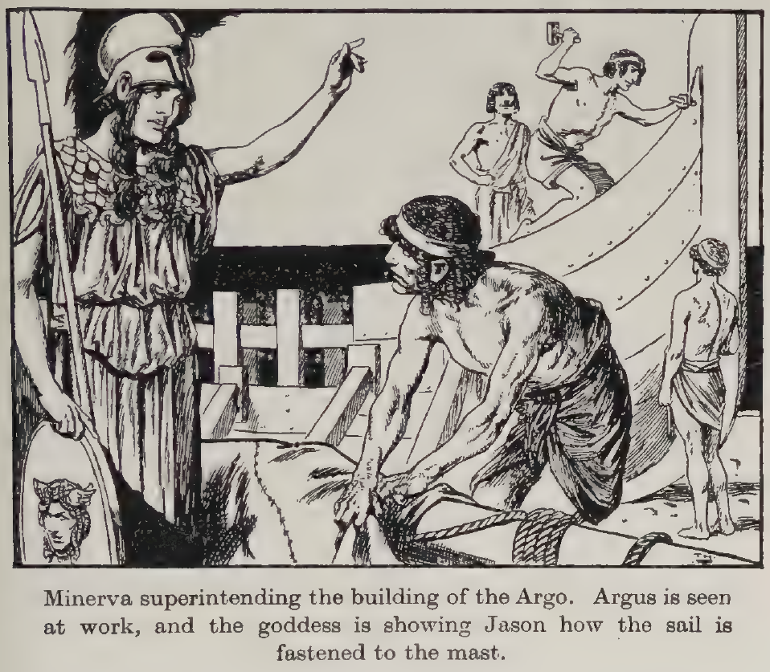

### 61. The anchor is weighed

Intereā ea diēs, quam Iāsōn per nūntiōs dīxerat appetēbat. Itaque ex omnibus Graeciae regiōnibus multī, quōs aut reī novitās aut spēs glōriae movēbat, undique conveniēbant. Trāditum est autem in hōc numerō fuisse Herculem (dē quō suprā multa nārrāvimus), Orpheum, citharoedum praeclārissimum, Thēseum, Castorem et multōs aliōs, quōrum nōmina sunt nōtissima. Ex hīs Iāsōn, quōs ad omnia perīcula subeunda parātissimōs esse arbitrātus est, eōs numerō ad quīnquāgintā dēlēgit, et sociōs sibi adiūnxit. Tum, paucōs diēs commorātus, ut ad omnēs cāsūs subsidia comparāret, nāvem dēdūxit, et, tempestātem ad nāvigandum idōneam nactus, magnō cum plausū omnium solvit.

### 62. A fatal mistake

Paulō post Argonautae (ut iī, quī in illā nāvī vehēbantur, appellābantur), īnsulam quandam, nōmine Cȳzicum, attigērunt, et, ē nāvī ēgressī, ā rēge illīus regiōnis hospitiō acceptī sunt. Paucās hōrās ibi commorātī, ad sōlis occāsum rūrsus solvērunt. At, postquam pauca mīlia passuum prōgressī sunt, tanta tempestās subitō coorta est, ut cursum tenēre nōn possent, et ad eandem īnsulae partem, unde nūper profectī erant, magnō cum perīculō dēicerentur. Incolae tamen, cum nox esset obscūra, Argonautās nōn agnōscēbant, sed, nāvem hostīlem vēnisse arbitrātī, arma rapuērunt, et eōs ēgredī prohibēre cōnābantur. Ācriter in lītore pugnātum est, et rēx ipse, quī cum aliīs dēcucurrerat, ab Argonautīs occīsus est. Posteā tamen, cum diēs illūxisset, sēnsērunt incolae sē errāre, atque arma abiēcērunt: Argonautae autem, cum vidērent rēgem occīsum esse, magnum dolōrem percēpērunt.

### 63. The loss of Hylas

Postrīdiē eius diēī Iāsōn, tempestātem satis idōneam esse arbitrātus (summa enim tranquillitās iam cōnsecūta erat), ancorās sustulit, et pauca mīlia passuum prōgressus, ante noctem Mȳsiam attigit. Ibi paucās hōrās in ancorīs exspectāvit; ā nautīs enim aquae cōpiam, quam sēcum habērent, iam dēficere cognōverat. Quam ob causam quīdam ex Argonautīs, in terram ēgressī, aquam quaerēbant. Quō in numerō erat Hylās quīdam, puer fōrmā praestantissimā, quī, dum fontem quaerit, ā comitibus suīs paulum dīgressus erat. Nymphae autem, quae fontem colēbant, cum iuvenem vīdissent, eī persuādēre, ut apud sē manēret, cōnābantur. Cum ille sē hoc factūrum esse negāret, puerum vī abstulērunt.

Comitēs eius postquam Hylam āmissum esse sēnsērunt, magnō dolōre affectī, diū frūstrā quaerēbant. Herculēs autem et Polyphēmus, quī vestīgia puerī longius secūtī erant, ubi tandem ad lītus rediērunt, Iāsonem iam solvisse cognōvērunt.

### 64. Dining made difficult

Inde Argonautae ad Thrāciam cursum tenuērunt, et, postquam ad oppidum Salmydēssum nāvem appulērunt, in terram ēgressī sunt. Ibi, cum ab incolīs quaesīssent, quis rēgnum eius regiōnis obtinēret, Phīneum quendam tum esse rēgem certiōrēs factī sunt. Cognōvērunt etiam hunc caecum esse et gravissimō suppliciō afficī, quod sē crūdēlissimum in fīliōs suōs quondam praebuisset. Cuius supplicī illud erat genus. Missa erant ā Iove mōnstra quaedam, speciē horribilī, quae capita virginum, volucrum corpora habēbant. Hae volucrēs, quae Harpȳiae appellābantur, Phīneum summā molestiā afficiēbant; quotiēns enim ille accubuerat, veniēbant et cibum appositum statim auferēbant. Quae cum ita essent, haud multum āfuit quīn Phīneus famē morerētur.

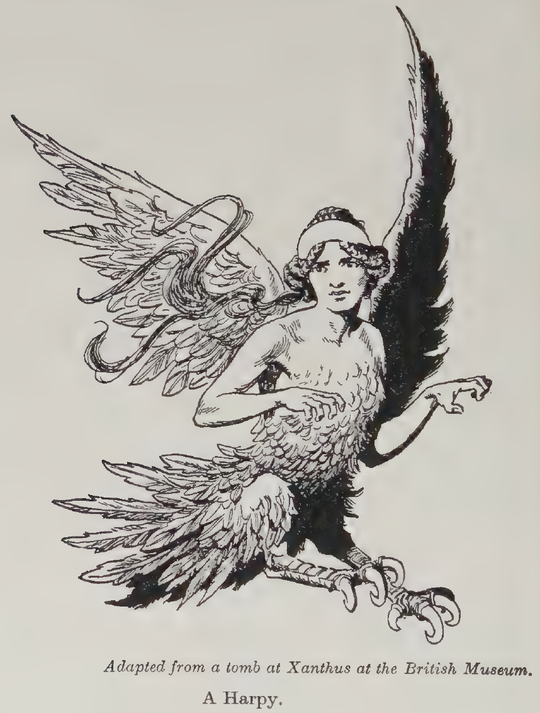

### 65. The harpies beaten

Rēs ita sē habēbat, cum Argonautae nāvem appulērunt. Phīneus autem, simul atque eōs in suōs fīnēs ēgressōs esse audīvit, magnō opere gāvīsus est. Sciēbat enim, quantam virtūtis opīniōnem Argonautae habērent, nec dubitābat quīn sibi auxilium lātūrī essent. Itaque nūntium, quī Iāsonem sociōsque ad rēgiam vocāret, ad nāvem mīsit. Eō cum vēnissent, Phīneus, quantō in perīculō suae rēs essent, dēmōnstrāvit, et sē magna praemia, sī illī remedium repperissent, datūrum esse pollicitus est. Argonautae negōtium libenter suscēpērunt, et, ubi hōra vēnit, cum rēge accubuērunt. At simul ac cēna apposita est, Harpȳiae conclāve intrāvērunt, et cibum auferre cōnābantur. Argonautae prīmum volucrēs gladiīs petiērunt; cum tamen hoc nihil prōdesse vidērent, Zētēs et Calais, quī ālīs īnstrūctī erant, in āera, ut dēsuper impetum facerent, sē sustulērunt. Quod cum sēnsissent Harpȳiae, reī novitāte perterritae, statim diffūgērunt, neque posteā umquam rediērunt.

### 66. The Symplegades

Hōc factō, Phīneus, ut prō tantō beneficiō meritam grātiam referret, Iāsonī, quā ratiōne Symplēgadas effugere posset, dēmōnstrāvit. Symplēgades autem duae erant rūpēs ingentī magnitūdine, quae ā Iove in introitū Pontī Euxīnī eō cōnsiliō, nē quis ad Colchida pervenīret, positae erant. Hae parvō dirimente intervallō in marī natābant et, sī quid in medium spatium vēnerat, incrēdibilī celeritāte concurrēbant. Iāsōn igitur, postquam ā Phīneō, quid faciendum esset, doctus est, ancorīs sublātīs, nāvem solvit, et lēnī ventō prōvectus, paulō post ad Symplēgadas appropinquāvit. Tum in prōrā stāns columbam, quam in manū tenēbat, ēmīsit. Illa rēctā per medium spatium volāvit, et, priusquam rūpēs cōnflīxērunt, incolumis, caudā sōlā āmissā, ēvāsit. Tum rūpēs utrimque discessērunt; antequam tamen rūrsus concurrerent, Argonautae, intellegentēs omnem salūtis spem in celeritāte positam esse, summā vī rēmīs contendērunt, et nāvem incolumem perdūxērunt. Hōc factō, dīs, quōrum auxiliō ē tantō perīculō ēreptī essent, grātiās dēbitās ēgērunt: certō enim nōn sine deōrum auxiliō rem ita fēlīciter ēvēnisse sciēbant.

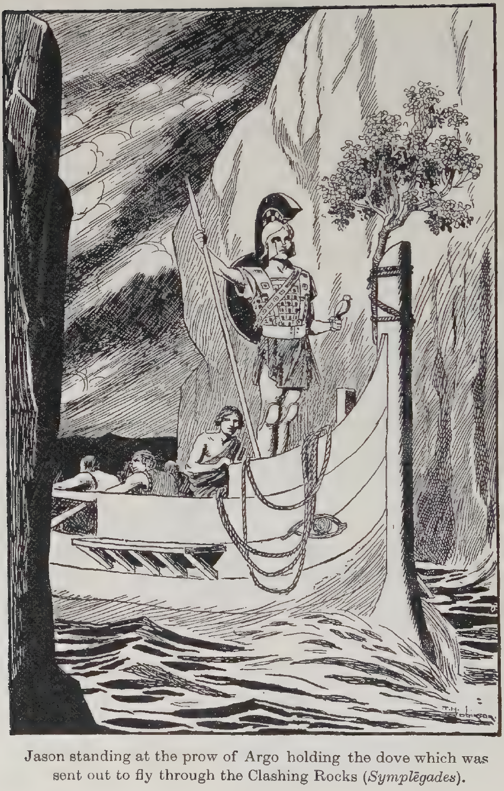

### 67. A heavy task

Brevī intermissō spatiō, Argonautae ad flūmen Phāsim, quod in fīnibus erat Colchōrum, pervēnērunt. Cum nāvem appulissent et in terram ēgressī essent, statim ad rēgem Aeētem sē contulērunt, et ab eō, ut vellus aureum sibi trāderētur, postulāvērunt. Ille, cum audīvisset, quam ob causam Argonautae vēnissent, īrā commōtus diū sē vellus trāditūrum esse negābat. Tandem tamen, quod Iāsonem nōn sine deōrum auxiliō hoc negōtium suscēpisse sciēbat, mūtātā sententiā, sē vellus, sī Iāsōn labōrēs duōs difficillimōs prius perfēcisset, trāditūrum esse pollicitus est; et, cum Iāsōn sē ad omnia perīcula subeunda parātum esse dīxisset, quid fierī vellet, ostendit. Prīmum iungendī erant duo taurī speciē horribilī, quī flammās ex ōre efflābant, deinde, hīs iūnctīs, ager quīdam arandus erat, et dentēs dracōnis serendī. Hīs rēbus audītīs, Iāsōn, etsī rem esse summī perīculī intellegēbat, tamen, nē hanc reī bene gerendae occāsiōnem āmitteret, negōtium suscēpit.

### 68. The magic ointment

At Mēdēa, rēgis fīlia, Iāsonem adamāverat, et, ubi eum tantum perīculum subitūrum esse audīvit, rem aegrē ferēbat. Patrem enim suum hunc labōrem eō ipsō cōnsiliō prōposuisse, ut Iāsōn morerētur, bene intellegēbat. Quae cum ita essent, Mēdēa, quae summam venēficiōrum scientiam habēbat, illud cōnsilium iniit. Mediā nocte, patre īnsciō, ex urbe ēvāsit. Postquam in montēs fīnitimōs vēnit, herbās quāsdam carpsit; tum, sūcō expressō, unguentum, quod vī suā corpus aleret nervōsque cōnfirmāret, parāvit. Hōc factō, Iāsonī unguentum dedit, atque eī, ut eā diē, quā illī labōrēs cōnficiendī essent, corpus suum et arma māne oblineret, praecēpit. Iāsōn, etsī paene omnēs hominēs corporis magnitūdine et vīribus superābat (vīta enim eius tōta in vēnātiōnibus atque in reī mīlitāris studiīs cōnstiterat), hoc tamen cōnsilium nōn neglegendum esse arbitrābātur.

### 69. Sowing the dragon’s teeth

Ubi ea diēs vēnit, quam rēx ad agrum arandum dīxerat, Iāsōn, ortā lūce, cum sociīs suīs ad locum cōnstitūtum sē contulit. Ibi stabulum ingēns repperit, in quō taurī inclūsī erant: tum, apertō stabulī ōstiō, taurōs in lūcem trāxit, et summā cum difficultāte iīs iugum imposuit. At Aeētēs, cum taurōs nihil contrā Iāsonem valēre vidēret, magnō opere mīrātus est; nesciēbat enim fīliam suam eī auxilium tulisse. Tum Iāsōn, omnibus spectantibus, agrum arāre coepit; quam ad rem tantam dīligentiam adhibuit, ut ante merīdiem tōtum opus cōnficeret. Hōc factō, ad locum, ubi rēx sedēbat, adiit, et dentēs dracōnis postulāvit: quōs, ubi accēpit, in agrum, quem arāverat, magnā cum dīligentiā sparsit. Quōrum dentium tālis erat nātūra, ut in eō locō, ubi satī essent, virī armātī mīrō quōdam modō gignerentur.

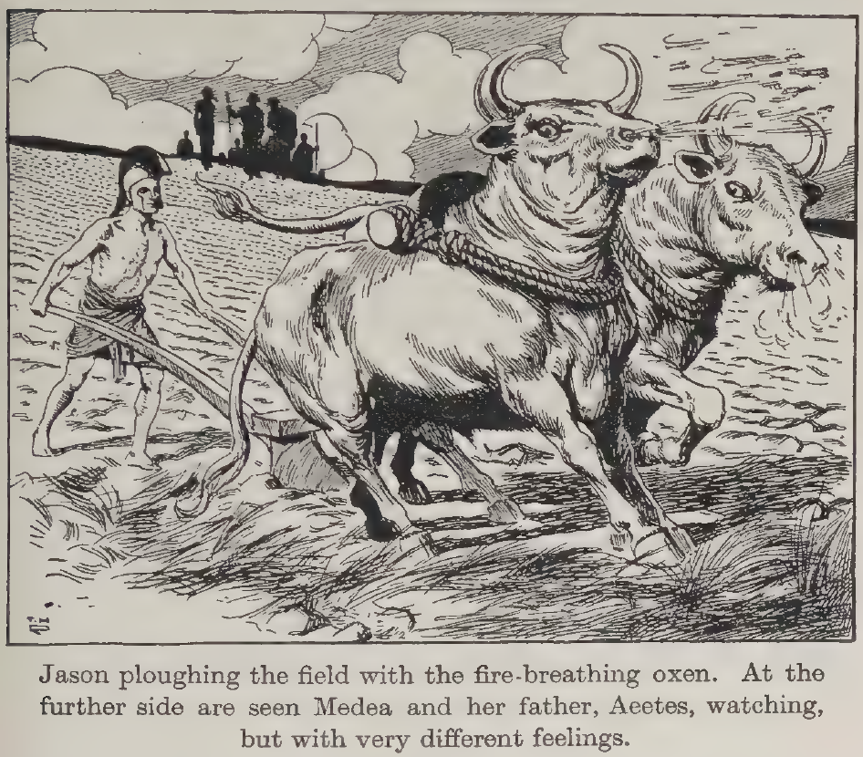

### 70. A strange crop

Nōndum tamen Iāsōn tōtum opus cōnfēcerat. Imperāverat enim eī Aeētēs, ut armātōs virōs, quī ē dentibus gignerentur, sōlus interficeret. Itaque Iāsōn, postquam omnēs dentēs in agrum sparsit, lassitūdine exanimātus, dum virī illī gignerentur, quiētī sē trādidit. Paucās hōrās dormiēbat; sed sub vesperum, ē somnō subitō excitātus, rem ita ēvēnisse, ut praedictum esset, cognōvit. Nam in omnibus agrī partibus virī ingentī corporis magnitūdine, gladiīs galeīsque armātī, mīrum in modum ē terrā exoriēbantur. Hōc cognitō, Iāsōn cōnsilium, quod dederat Mēdēa, nōn omittendum esse putābat. Saxum igitur ingēns (ut eī praecēperat Mēdēa) in mediōs virōs coniēcit. Illī undique ad locum concurrērunt, et cum sibi quisque id saxum habēre vellet, magna contrōversia orta est. Paulō post, gladiīs dēstrictīs, inter sē pugnāre coepērunt, et, cum hōc modō plūrimī occīsī essent, reliquī vulneribus cōnfectī ab Iāsone nūllō negōtiō interfectī sunt.

### 71. Flight of Medea

At rēx Aeētēs, ubi Iāsonem labōrem prōpositum cōnfēcisse cognōvit, aegerrimē id tulit. Intellegēbat enim id per dolum factum esse, nec dubitābat quīn Mēdēa eī auxilium tulisset. Mēdēa autem, cum intellegeret sē in magnō fore perīculō, si in rēgiā manēret, fugā salūtem petere cōnstituit. Itaque, omnibus rēbus ad fugam parātīs, mediā nocte, īnsciō patre, cum frātre Absyrtō ēvāsit, et quam celerrimē ad locum, ubi Argō subducta erat, sē contulit. Eō cum vēnisset, sē Iāsonī ad pedēs prōiēcit, et multīs cum lacrimīs eum, nē in tantō discrīmine mulierem dēsereret, quae eī tantum prōfuisset, obsecrāvit. Ille, quod memoriā tenēbat sē ope eius ē magnō perīculō ēvāsisse, libenter eam excēpit, et, postquam veniendī causam audīvit, nē patris īram timēret, hortātus est. Quam prīmum enim sē eam nāvī suā ē patris manibus ēreptūrum esse pollicitus est.

### 72. Seizure of the fleece

Postrīdiē eius diēī, Iāsōn cum sociīs suīs, ortā lūce, nāvem dēdūxit, et tempestātem idōneam nactus, ad eum locum, ubi Mēdēa vellus abditum esse dēmōnstrāverat, rēmīs contendit. Eō cum vēnissent, Iāsōn in terram ēgressus, sociīs ad mare relictīs, quī praesidiō nāvī essent, ipse cum Mēdēā in silvās īre mātūrāvit. Pauca mīlia passuum per silvās prōgressus, vellus, quod quaerēbat, ex arbore suspēnsum vīdit. Id tamen auferre rēs erat summae difficultātis: nōn modo enim locus ipse ēgregiē et nātūrā et arte mūnītus erat, sed etiam dracō quīdam speciē terribilī arborem custōdiēbat. At Mēdēa, quae, ut suprā dēmōnstrāvimus, summam artis magicae scientiam habēbat, rāmum, quem ex arbore proximā āvulserat, venēnō īnfēcit. Hōc factō, ad locum appropinquāvit, et dracōnem, quī faucibus apertīs eius adventum exspectābat, venēnō cōnspersit: deinde, dum dracō somnō oppressus dormit, Iāsōn vellus aureum ex arbore āvulsit, et cum Mēdēā quam celerrimē pedem rettulit.

### 73. Back to the Argo

Dum tamen ea geruntur, Argonautae, quī ad mare relictī erant, Iāsonis reditum animō anxiō exspectābant: id enim negōtium summī esse perīculī satis intellegēbant. Postquam ad sōlis occāsum frūstrā exspectāvērunt, dē eius salūte dēspērāre coepērunt, nec dubitābant quīn aliquī cāsūs accidisset. Quae cum ita essent, mātūrandum sibi, ut ducī auxilium ferrent, iūdicābant. At, dum proficīscī parant, lūmen quoddam subitō mīrum in modum inter arborēs micāns cōnspiciunt. Magnō opere mīrātī, quae causa esset eius reī, ad locum concurrunt. Quō cum vēnissent, Iāsonī et Mēdēae advenientibus occurrērunt, et vellus aureum lūminis eius causam esse cognōvērunt. Omnī timōre sublātō, ducem suum magnō cum gaudiō excēpērunt, et dīs dēbitam, quod rēs tam bene atque fēlīciter ēvēnisset, grātiam rettulērunt.

### 74. Pursued by the angry father

Hīs rēbus gestīs, omnēs sine morā nāvem rūrsus cōnscendērunt, et, ancorīs sublātīs, prīmā vigiliā solvērunt: neque enim satis tūtum esse in eō locō manēre arbitrābantur. At rēx Aeētēs, quī iam ante inimīcō in eōs fuerat animō, ubi fīliam suam nōn modo sē ad Argonautās recēpisse, sed etiam ad vellus auferendum iīs auxilium tulisse cognōvit, hōc dolōre gravius exarsit. Nāvem longam quam celerrimē dēdūcī iussit, et, mīlitibus impositīs, fugientēs īnsecūtus est. Sed Argonautae, quī rem in discrīmine esse certō sciēbant, omnibus vīribus atque opibus rēmīs contendēbant. Cum tamen nāvis, in quā vehēbantur, ingentī esset magnitūdine, nōn eādem celeritāte, quā Colchī, prōgredī poterant. Quae cum ita essent, minimum āfuit quīn ā Colchīs sequentibus caperentur, neque enim maiōre intervallō, quam ut ad coniectum tēlī venīrētur, iam īnsequēbantur. At Mēdēa, cum vīdisset, quō in locō rēs esset, paene omnī spē dēpositā, īnfandum illud cōnsilium cēpit.

### 75. A fearful expedient

Erat in nāvī Argonautārum fīlius quīdam rēgis Aeētae, nōmine Absyrtus, quem, ut suprā nārrāvimus, Mēdēa, ex urbe fugiēns, sēcum abdūxerat. Hunc puerum Mēdēa eō cōnsiliō, ut, membrīs eius in mare coniectīs, cursum Colchōrum impedīret, interficere cōnstituit. Aeētem enim nōn longius prōsecūtūrum esse, cum membra fīlī vīdisset, prō certō habēbat. Neque haec opīniō eam fefellit: omnia enim ita ēvēnērunt, ut Mēdēa spērāverat. Aeētēs, ubi prīmum membra vīdit, ad ea colligenda cursum nāvis intermittī iussit. Dum tamen ea geruntur, Argonautae, nōn intermissō rēmigandī labōre, brevī tempore ē cōnspectū hostium remōtī sunt, neque prius fugere dēstitērunt quam ad flūmen Ēridanum pervēnērunt. At Aeētēs, nihil sibi prōfutūrum esse arbitrātus longius prōgredī, animō dēmissō domum, ut fīlī corpus sepelīret, revertit.

### 76. The bargain with Pelias

Tandem ē plūrimīs perīculīs ēlāpsus, Iāsōn ad eundem locum, unde profectus erat, pervēnit. Tum ē nāvī ēgressus ad rēgem Peliam, quī rēgnum etiamtum obtinēbat, statim sē contulit, et, vellere aureō ostentō, ab eō, ut rēgnum sibi trāderētur, postulāvit. Peliās enim, sē rēgnum, sī Iāsōn vellus rettulisset, eī trāditūrum pollicitus erat. Postquam Iāsōn, quid fierī vellet, ostendit, Peliās prīmum nihil respondit, sed diū in eādem trīstitiā tacitus permanēbat. Tandem ita locūtus est. ‘Vidēs mē aetāte iam esse cōnfectum, neque dubium est quīn diēs suprēmus mihi appropinquet. Liceat igitur mihi, dum vīvam, hoc rēgnum obtinēre; tum, postquam ego ē vītā excesserō, tū mē sequēris.’ Hāc ōrātiōne adductus, Iāsōn sē id, quod ille rogāsset, factūrum esse respondit.

### 77. Boiled mutton

Hīs rēbus cognitīs, Mēdēa rem aegrē tulit et rēgnī cupiditāte adducta, mortem rēgī per dolum īnferre cōnstituit. Hōc cōnstitūtō, ad rēgis fīliās vēnit atque ita locūta est: ‘Vidētis patrem vestrum aetāte iam esse cōnfectum neque ad rēgnandī labōrem perferendum satis valēre. Nōnne vultis eum rūrsus iuvenem fierī?’ Hīs verbīs audītīs, rēgis fīliae respondērunt: ‘Num hoc fierī potest? Num quis umquam ē sene iuvenis iterum factus est?’ At Mēdēa respondit, ‘Scītis mē summam artis magicae habēre scientiam. Nunc igitur vōbīs, quōmodo haec rēs fierī possit, dēmōnstrābō.’

Hīs dictīs, cum arietem aetāte iam cōnfectum interfēcisset, membra eius in vās aēneum posuit, et, ignī subiectō, in aquam herbās quāsdam iēcit. Tum, dum aqua effervēsceret, carmen magicum cantābat. Brevī tempore ariēs ē vāse exsiluit et, vīribus refectīs, per agrōs currēbat.

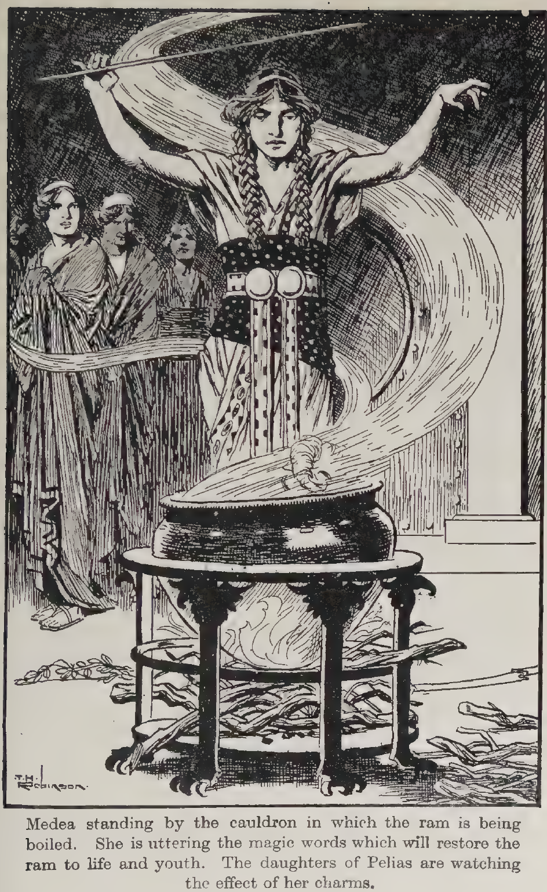

### 78. A dangerous experiment

Dum rēgis fīliae hoc mīrāculum stupentēs intuentur, Mēdēa ita locūta est. ‘Vidētis, quantum valeat ars magica. Vōs igitur, sī vultis patris vestrī adulēscentiam redintegrāre, id, quod ego fēcī, ipsae faciētis. Vōs patris membra in vās conicite; ego herbās magicās praebēbō. Hīs audītīs, rēgis fīliae cōnsilium, quod dederat Mēdēa, nōn omittendum putāvērunt. Itaque patrem Peliam necāvērunt, et membra eius in vās aēneum coniēcērunt; nihil enim dubitābant quīn hoc maximē eī prōfutūrum esset. At rēs omnīnō aliter ēvēnit ac spērāverant: Mēdēa enim nōn eāsdem, quibus ipsa ūsa erat, herbās dedit. Postquam diū frūstrā exspectāvērunt, patrem suum rē vērā mortuum esse intellēxērunt. Hīs rēbus gestīs, Mēdēa, sē cum coniuge suō rēgnum acceptūram esse spērābat; at cīvēs, cum intellegerent, quōmodo Peliās perīsset, tantum scelus aegrē tulērunt. Itaque, Iāsone et Mēdēā ē rēgnō ex- pulsīs, Acastum rēgem creāvērunt.

### 79. A fatal gift

Posteā Iāsōn et Mēdēa, cum Thessaliā expulsī essent, ad urbem Corinthum vēnērunt, cuius urbis Creōn quīdam rēgnum tum obtinēbat. Erat autem Creontī fīlia ūna, nōmine Glaucē; quam cum vīdisset, Iāsōn, homō perfidiōsissimus. Mēdēam, uxōrem suam, eō ipsō cōnsiliō, ut Glaucēn in mātrimōnium dūceret, dēserere cōnstituit. At Mēdēa, ubi intellēxit, quae ille in animō habēret, īrā graviter commōta, iūreiūrandō sē tantam iniūriam ultūram cōnfirmāvit. Itaque illud cōnsilium cēpit. Vestem summā arte textam et variīs colōribus tīnctam parāvit. Hanc vestem mortiferō quōdam venēnō īnfēcit, cuius vīs tanta erat, ut, sī quis eam induisset, corpus eius quasi ignī ūrerētur. Hōc factō, vestem ad Glaucēn mīsit. Illa autem, nihil malī suspicāta, dōnum libenter accēpit, et vestem novam mōre fēminārum statim induit.

### 80. Flight of Medea, and death of Jason

Glaucē autem, cum prīmum vestem induit, statim dolōrem gravem omnibus membrīs sēnsit, et paulō post gravī cruciātū affecta ē vītā excessit. Hīs rēbus gestīs, Mēdēa, furōre atque āmentiā impulsa, fīliōs suōs trucīdāvit: tum magnum sibi fore perīculum arbitrāta, sī Corinthī manēret, ex eā regiōne fugere cōnstituit.  Hōc cōnstitūtō, avum suum, Sōlem, ut in tantō perīculō sibi auxilium ferret, ōrāvit. Sōl autem, eius precibus commōtus, currum dracōnibus iūnctum volucribus ad eam ēripiendam mīsit. Mēdēa nōn praetermittendam tantam occāsiōnem arbitrāta, currum cōnscendit, itaque per āera vecta, incolumis ad urbem Athēnās pervēnit. Iāsōn autem mīrum in modum interfectus est. Ille enim (sīve cāsū sīve deōrum cōnsiliō) in umbrā nāvis suae, quae in lītus subducta erat, quondam dormiēbat. At nāvis, quae tam diū ērēcta steterat, in eam partem, ubi Iāsōn iacēbat, subitō dēlāpsa virum īnfēlīcem oppressit.

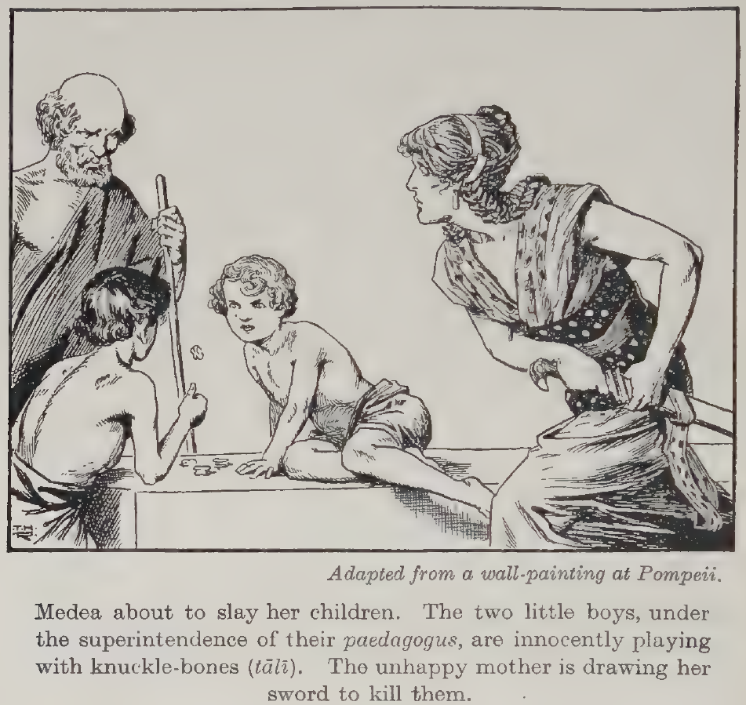

## The story of Ulysses

### 81. Homeward bound

Urbem Trōiam ā Graecīs decem annōs obsessam esse, satis cōnstat. Dē hōc enim bellō Homērus, maximus poētārum Graecōrum, īliadem, opus nōtissimum, scrīpsit. Trōiā tandem per īnsidiās captā, Graecī, longō bellō fessī, domum redīre mātūrāvērunt. Omnibus rēbus ad profectiōnem parātīs, nāvēs dēdūxērunt, et, tempestātem idōneam nactī, magnō cum gaudiō solvērunt. Erat inter Graecōrum ducēs Ulixēs quīdam, vir summae virtūtis ac prūdentiae, quī in nōnnūllōrum opīniōne dolum illum, quō Trōia capta erat, excōgitāverat. Hic rēgnum īnsulae Ithacae obtinuerat et, paulō antequam cum reliquīs Graecīs ad bellum profectus est, puellam fōrmōsissimam, nōmine Pēnelopēn, in mātrimōnium dūxerat. Nunc igitur, cum iam decem annōs quasi in exsiliō cōnsūmpsisset, magnō dēsīderiō patriae atque uxōris suae ardēbat.

### 82. The lotus eaters

Postquam tamen Graecī pauca mīlia passuum ā lītore Trōiae prōgressī sunt, tanta tempestās subitō coorta est, ut nāvēs cursum tenēre nōn possent, sed alia aliam in partem disicerentur. Nāvis autem, in quā ipse Ulixēs vehēbātur, vī tempestātis ad merīdiem dēlāta, decimō diē ad lītus Āfricae appulsa est. Ancorīs iactīs, Ulixēs nōnnūllōs ē sociīs, quī aquam ad nāvem referrent, et, quālis esset nātūra eius regiōnis, cognōscerent, in terram expōnere cōnstituit. Illī ē nāvī ēgressī imperāta eius facere parābant. Dum autem fontem quaerunt, quibusdam ex incolīs obviam factī ab iīs hospitiō acceptī sunt. Accidit autem ut maior pars vīctūs eōrum hominum in mīrō quōdam frūctū, quem lōtum appellābant, cōnsisteret. Quem cum Graecī gustāssent, patriae et sociōrum statim oblītī, iūreiūrandō sē semper in eā terrā, ut dulcī illō cibō in perpetuum vēscerentur, mānsūrōs cōnfirmāvērunt.

### 83. The lotus eaters (continued)

At Ulixēs, cum ab hōrā septimā usque ad vesperum exspectāsset, veritus, nē sociī suī in perīculō versārentur, nōnnūllōs ē reliquīs, ut, quae causa esset morae, cognōscerent, mīsit. Itaque hī nautae in terram expositī ad vīcum, quī nōn longē āfuit, sē contulērunt: quō cum vēnissent, sociōs suōs quasi ēbriōs repperērunt. Tum, ubi veniendī causam docuērunt; iīs, ut sēcum ad nāvem redīrent, persuādēre cōnābantur. Illī tamen resistere ac, saepe clāmitantēs sē numquam ex eō locō abitūrōs, sē manū dēfendere coepērunt. Quae cum ita essent, nūntiī, rē īnfectā, ad Ulixem rediērunt. Hīs rēbus cognitīs, Clixēs ipse cum omnibus, quī in nāvī relictī erant, ad eum locum vēnit; et sociōs suōs frūstrā hortātus, ut suā sponte redīrent, manibus eōrum post terga vīnctīs, invītōs ad nāvem retrāxit. Tum, ancorīs sublātīs, quam celerrimē ē portū solvit.

### 84. The one-eyed giant

Postrīdiē eius diēī, postquam tōtam noctem rēmīs contendērunt, ad terram ignōtam nāvem appulērunt. Tum Ulixēs, quod nātūram eius regiōnis ignōrābat, ipse cum duodecim sociīs in terram ēgressus, locum explōrāre cōnstituit. Paulum ā lītore prōgressī, ad spēluncam ingentem, quam incolī sēnsērunt, pervēnērunt. Eius enim introitum arte et manibus mūnītum esse animadvertērunt. Deinde, etsī intellegēbant sē nōn sine perīculō id factūrōs, tamen spēluncam intrāvērunt: quod cum fēcissent, magnam lactis cōpiam in vāsīs ingentibus conditam invēnērunt. Dum mīrantur, quis in eā sēde habitāret, sonitum terribilem audīvērunt, et, oculīs omnium ad introitum conversīs, mōnstrum horribile, hūmānā quidem speciē et figūrā, sed ingentī corporis magnitūdine, vīdērunt. Cum autem eum ūnum modo oculum in mediā fronte positum habēre animadvertissent, hunc esse ūnum ē Cȳclōpibus, dē quibus iam audīverant, intellēxērunt.

### 85. The giant’s supper

Cȳclōpes autem pāstōrēs erant quīdam, quī īnsulam Siciliam et praecipuē montem Aetnam incolēbant: ibi enim Vulcānus, praeses fabrōrum et ignis inventor, cuius servī Cȳclōpes erant, officīnam suam habēbat.

Itaque Graecī, simul ac mōnstrum vīdērunt, terrōre paene exanimātī in interiōrem spēluncae partem refūgērunt, et sē abdere cōnābantur. Polvphēmus autem (ut pāstor ille appellābātur) pecus suum in spēluncam compulit; deinde, cum saxō ingentī introitum obstrūxisset, ignem in mediā spēluncā fēcit. Hōc factō, omnia oculō perlūstrābat. Cum sēnsisset hominēs in interiōre spēluncae parte latēre, magnā vōce exclāmāvit: ‘Quī estis hominēs? Mercātōrēs an latrōnēs? Tum Ulixēs respondit, sē neque mercātōrēs esse neque praedandī causā vēnisse: sed, ā Trōiā domum redeuntēs, vī tempestātum ā rēctō cursū dēlātōs esse. Eum igitur, ut sibi sine iniūriā abīre licēret, ōrāvit. Tum Polyphēmus, ubi esset nāvis, in quā vectī essent, quaesīvit. Ulixēs autem, cum nōn dubitāret quīn sibi magnō opere praecavendum esset, nāvem suam in rūpēs coniectam et omnīnō perfrāctam esse respondit. Polyphēmus autem, nūllō datō respōnsō, duo ē sociīs eius manū corripuit, et, membrīs eōrum dīvulsīs, carne eōrum vēscī coepit.

### 86. No way of escape

Dum haec geruntur, Graecōrum animōs tantus terror occupāvit, ut nē vōcem quidem ēdere possent, sed, omnī salūtis spē dēpositā, mortem praesentem exspectārent. At Polyphemus, postquam famēs hāc tam horribilī cēnā dēpulsa est, humī prōstrātus somnō sē dedit. Quod cum vīdisset Ulixēs, tantam reī bene gerendae occāsiōnem nōn praetermittendam arbitrātus, mōnstrī pectus gladiō statim trānsfīgere in animō habēbat. Cum tamen nihil temere agendum exīstimāret, antequam hoc faceret, quā ratiōne ē spēluncā ēvādere possent, explōrāre cōnstituit. At cum saxum animadvertisset, quō introitus obstrūctus erat, nihil sibi prōfutūrum Polyphēmunm interficere intellēxit. Tanta enim erat eius saxī magnitūdō, ut nē ā decem quidem hominibus āmovērī posset. Quae cum ita essent, Ulixēs hōc cōnātū dēstitit, et ad sociōs rediit; quī, cum intellēxissent, quō in locō rēs esset, nūllā salūtis spē oblātā, dē fortūnīs suīs dēspērāre coepērunt.  Ille tamen, nē animōs dēmitterent, eōs vehementer hortātus, dēmōnstrāvit sē iam anteā ē multīs et magnīs perīculīs ēvāsisse, neque dubium esse quīn in tantō discrīmine dī auxilium lātūrī essent.

### 87. A plan for vengeance

Ortā lūce, Polyphēmus iam ē somnō excitātus idem, quod prīdiē, fēcit; correptīs enim duōbus ē reliquīs virīs, carne eōrum sine morā vēscī coepit. Deinde, cum saxum āmōvisset, ipse cum pecore suō ē spēluncā prōgressus est: quod cum Graecī vidērent, magnam in spem ē spēluncā tandem effugiendī vēnērunt. Ab hāc tamen spē sine morā repulsī sunt: nam Polyphēmus, postquam omnēs ovēs exiērunt, saxum in locum suum reposuit. Reliquī, omnī spē salūtis dēpositā, sē lāmentīs lacrimīsque dēdidērunt. Ulixēs vērō quī, ut suprā dēmōnstrāvimus, vir magnī fuit cōnsilī, etsī nōn dubitābat quīn rēs in discrīmine esset, nōndum tamen omnīnō dēspērābat. Tandem, postquam diū tōtō animō, quōmodo ē tantīs perīculīs ēvādere possent, cōgitāvit, illud cōnsilium cēpit. Ē lignīs, quae in spēluncā reposita erant, pālum magnum dēlēgit: hunc summā cum dīligentiā praeacūtum fēcit; tum, postquam sociīs, quid fierī vellet, ostendit, Polyphēmī reditum exspectābat.

### 88. A glass too much

Sub vesperum Polyphēmus ad spēluncam rediit, et eōdem modō, quō anteā, cēnāvit. Tum Ulixēs utrem vīnī, quem opportūnissimē sēcum attulerat, prōmpsit et, postquam magnum pōculum vīnō complēvit, Cȳclōpa ad bibendum prōvocāvit. Polyphēmus, quī numquam anteā vīnum gustāverat, pōculum statim exhausit; quod cum fēcisset, tantam voluptātem percēpit, ut iterum atque tertium pōculum complērī iubēret. Tum, cum quaesīvisset, quō nōmine Ulixēs appellārētur, ille sē Nēminem appellārī respondit: quod cum audīvisset, Polyphēmus ita locūtus est, ‘Hanc tibi grātiam prō tantō beneficiō referam; tē ultimum omnium edam.’ Hīs dictīs, cibī vīnīque plēnus humī recubuit et paulō post somnō oppressus est. Tum Ulixēs, sociīs convocātīs, Habēmus,’ inquit, ‘quam petiimus facultātem: nē tantam reī bene gerendae occāsiōnem praetermittāmus.’

### 89. Mister nobody

Haec locūtus, postquam extrēmum pālum ignī calefēcit, oculum Polyphēmī, dum dormit, flagrante lignō trānsfōdit: quō factō, omnēs in dīversās spēluncae partēs sē abdidērunt. At ille, subitō dolōre ē somnō excitātus, clāmōrem terribilem sustulit, et, dum per omnēs spēluncae partēs hūc atque illūc errat, Ulixī manum inicere cōnābātur. Cum tamen iam omnīnō caecus esset, nūllō modō id efficere potuit. Intereā cēterī Cȳclōpes, clāmōre audītō, undique ad spēluncam convēnērunt, et, ad introitum adstantēs, quid Polyphēmus ageret, et quam ob causam tantum clāmōrem sustulisset, quaesīvērunt. Ille sē graviter vulnerātum esse, et magnō dolōre afficī, respondit. Cum tamen illī quaesīvissent, quis eī vim intulisset, Nēminem id fēcisse respondit. Quō respōnsō datō, ūnus ē Cȳclōpibus, ‘At sī nēmō,’ inquit, ‘tē vulnerāvit, nōn dubium est quīn deōrum cōnsiliō, quibus resistere nec possumus nec volumus, hōc suppliciō afficiāris.’ Hīs dictīs, abiērunt Cȳclōpes, eum in īnsāniam incidisse arbitrātī.

### 90. Escape

At Polyphēmus, ubi sociōs suōs abiisse sēnsit, furōre atque āmentiā impulsus, Ulixem iterum quaerere coepit: tandem, cum introitum invēnisset, saxum, quō obstrūctus erat, ut pecus in agrōs exīre posset, āmōvit. Tum ipse in introitū cōnsēdit, et, ut quaeque ovis ad illum locum vēnerat, tergum eius, nē hominēs inter ovēs ēvādere possent, manibus tractābat. Quod cum animadvertisset Ulixēs, eī persuāsum est omnem salūtis spem in dolō magis quam in virtūte pōnī. Illud igitur cōnsilium cēpit. Prīmum trēs pinguissimās ex ovibus dēlēgit: quās cum inter sē vīminibus coniūnxisset, ūnum ex sociīs suīs eārum ventribus ita subiēcit, ut omnīnō latēret: deinde ovēs hominem sēcum ferentēs ad introitum ēgit. Id accidit, quod fore exspectāverat. Polyphēmus enim, postquam manūs tergīs ovium imposuit, eās praeterīre passus est. Ulixēs, ubi rem ita fēlīciter ēvēnisse vīdit, omnēs sociōs suōs ex ōrdine eōdem modō ēmīsit; quō factō, ipse ultimus ēvāsit.

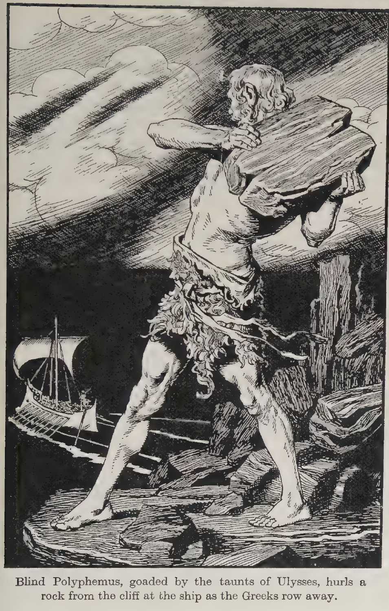

### 91. Out of danger

Hīs rēbus ita cōnfectīs, Ulixēs veritus, nē Polyphēmus fraudem cognōsceret, cum sociīs ad lītus quam celerrimē contendit: quō cum vēnissent, ab iīs, quī nāvī praesidiō relictī erant, magnā cum laetitiā acceptī sunt. Hī enim, cum iam trēs diēs reditum eōrum in hōrās animīs ānxiīs exspectāvissent, eōs in perīculum grave incidisse suspicātī, ipsī auxiliandī causā ēgredī parābant. Tum Ulixēs, nōn satis tūtum esse arbitrātus in eō locō manēre, quam celerrimē proficīscī cōnstituit. Iussit igitur omnēs nāvem cōnscendere, et, ancorīs sublātīs, paulum ā lītore in altum prōvectus est. Tum magnā vōce exclāmāvit, ‘Tū, Polyphēme, quī iūra hospitiī irrīdēs, iūstam et dēbitam immānitātis tuae poenam solvistī.’ Hāc vōce audītā, Polyphēmus, īrā vehementer commōtus, ad mare sē contulit, et, ubi nāvem paulum ā lītore remōtam esse intellēxit, saxum ingēns in manūs sūmpsit atque in eam partem, unde vōcem venīre sēnsit, coniēcit. Graecī autem, etsī minimum āfuit quīn submergerentur, nūllō acceptō damnō, cursum tenuērunt.

### 92. The country of the winds

Pauca mīlia passuum ab eō locō prōgressus, Ulixēs ad īnsulam Aeoliam nāvem appulit. Haec patria erat Ventōrum.

“Hīc vāstō rēx Aeolus antrō  
Luctantēs ventōs tempestātēsque sonōrās  
Imperiō premit ac vinclīs et carcere frēnat.’  

Ibi rēx ipse Graecōs hospitiō accēpit, atque iīs, ut ad recreandās vīrēs paucōs diēs in eā regiōne commorārentur, persuāsit. Septimō diē, cum sociī sē ē labōribus suīs recreāvissent, Ulixēs, nē annī tempore ā nāvigātiōne exclūderētur, sibi iam proficīscendum cōnstituit. Tum Aeolus, quī Ulixem patriae videndae cupidissimum esse sciēbat, eī iam profectūrō magnum dedit ūtrem, in quō ventōs omnēs praeter ūnum inclūserat. Sōlum enim Favōnium, quod illum ventum Ithacam nāvigantī secundum esse sciēbat, solūtum relīquerat. Ulixēs hoc dōnum libenter accēpit, et, grātiīs prō tantō beneficiō āctīs, utrem ad mālum alligāvit. Tum, omnibus rēbus ad profectiōnem parātīs, merīdiānō ferē tempore ē portū solvit.

### 98. The wind-bag

Novem diēs Graecī ventō secundissimō cursum tenuērunt: iamque in cōnspectum patriae suae vēnerant, cum Ulixēs lassitūdine cōnfectus (ipse enim manū suā gubernābat) ad quiētem capiendam recubuit.  At sociī, quī iamdūdum, quid in illō utre inclūsum esset, mīrābantur, cum ducem somnō oppressum iacēre vidērent, tantam occāsiōnem nōn praetermittendam arbitrāti sunt: crēdēbant enim aurum et argentum ibi abdī. Itaque, spē lucrī adductī, utrem sine morā solvērunt: quō factō, ventī,

‘velut agmine factō  
Quā data porta ruunt et terrās turbine perflant.’  

Deinde tanta tempestās subitō coorta est, ut illī cursum tenēre nōn possent, sed in eandem partem, unde erant profectī, referrentur. Ulixēs ē somnō excitātus, quō in locō rēs esset, statim intellēxit: utrem solūtum, Ithacam post tergum relictam vīdit. Tum vērō maximā indignātiōne exarsit, sociōsque, quod, cupiditāte pecūniae adductī, spem patriae videndae abiēcissent, vehementissimē obiūrgābat.

### 94. Drawing lots

Brevī intermissō spatiō, Graecī īnsulae cuidam, in quā Circē, fīlia Sōlis, habitābat, appropinquāvērunt. Quō cum nāvem appulisset, Ulixēs in terram frūmentandī causā ēgredī cōnstituit; frūmentum enim, quod in nāvī habērent, iam dēficere cognōverat. Itaque sociīs ad sē convocātīs, quō in locō rēs esset et quid fierī vellet, ostendit. Cum tamen omnēs memoriā tenērent, quam crūdēlī morte perīssent iī, quī nūper in patriam Cȳclōpum ēgressī essent, nēmō, quī hoc negōtium suscipere vellet, repertus est. Quae cum ita essent, rēs ad contrōversiam dēducta est. Tandem Ulixēs, omnium cōnsēnsū, sociōs in duās partēs, quārum alterī Eurylochus, vir summae virtūtis, alterī ipse praeesset, dīvīsit. Tum hī duo inter sē, uter in terram ēgrederētur, sortītī sunt. Hōc factō, Eurylochō, ut cum duōbus et vīgintī sociīs rem susciperet, sorte ēvēnit.

### 95. The house of the enchantress

Hīs rēbus ita cōnstitūtīs, iī, qui sorte ductī erant, in interiōrem īnsulae partem profectī sunt. Tantus tamen timor animōs eōrum occupāverat, ut nihil dubitārent quīn ad mortem īrent: vix quidem poterant iī, quī in nāvī relictī erant, lacrimās tenēre: crēdēbant enim sē sociōs suōs numquam rūrsus vīsūrōs. Illī autem aliquantum itineris prōgressī, ad vīllam quandam, summā magnificentiā aedificātam, pervēnērunt. Cuius ad ōstium cum adīssent, cantum dulcissimum audīvērunt. Tanta autem fuit eius vōcis dulcēdō, ut nūllō modō retinērī possent quīn iānuam pulsārent. Quō factō, ipsa Circē forās exiit, et summā cum benignitāte omnēs in hospitium invītāvit. Eurylochus quidem īnsidiās comparārī suspicātus, forīs exspectāre cōnstituit. At cēterī, reī novitāte adductī, intrāvērunt. Convīvium magnificē splendidēque ōrnātum invēnērunt, et dominae iussū libentissimē accubuērunt. At Circē vīnum, quod servī apposuērunt, medicāmentō quōdam miscuerat: quod cum Graecī bibissent, gravī somnō subitō oppressī sunt.

### 96. Men to pigs

Tum Circē, quae summam artis magicae scientiam habēbat, virgā aureā, quam manū ferēbat, capita eōrum tetigit: quō factō, omnēs in porcōs subitō conversī sunt. Intereā Eurylochus, quid in aedibus agerētur, ignārus, ad ōstium sedēbat. Postquam ad sōlis occāsum anxiō animō et sollicitō exspectāvit, sōlus ad nāvem regredī cōnstituit. Eō cum vēnisset, prae sollicitūdine ac timōre diū vōcem nōn mīsit. Tandem tamen Ulixēs sociōs suōs in perīculō versārī intellēxit atque, gladiō arreptō, Eurylochō ut sine morā viam ad illam domum dēmōnstrāret, imperāvit. Ille tamen multīs cum lacrimīs Ulixem complexus, nē in tantum perīculum sē committeret, obsecrāre coepit. Sī quid gravius eī accidisset, omnium salūtem in summō discrīmine futūram. Ulixēs autem respondit, sē nēminem invītum sēcum adductūrum: illī licēre, sī māllet, in nāvī manēre: sē ipsum sine comitibus rem susceptūram. Hoc cum magnā vōce dīxisset, ē nāvī dēsiluit, et, nūllō sequente, sōlus in viam sē dedit.

### 97. The counter charm

Aliquantum itineris prōgressus, ad domum magnificam pervēnit, quam, cum oculīs perlūstrāsset, statim intrāre voluit: hanc enim eandem esse vīllam, dē quā Eurylochus mentiōnem fēcisset, intellēxit. At, cum ad ipsum līmen iam adesset, iuxtā eum adulēscēns fōrmā pulcherrimā, quī auream virgam manū ferēbat, subitō stetit. Hic Ulixem iam domum intrantem manū retinuit, ‘Quō ruis?’ inquit, ‘Nōnne scīs hanc esse Circēs domum? Hīc inclūsī sunt amīcī tuī, ex speciē hūmānā in porcōs conversī. Num vīs ipse in eandem calamitātem incidere?’ Ulixēs simul ac vōcem audīvit, deum Mercurium agnōvit: nūllīs tamen precibus ab initō cōnsiliō dēterrērī potuit. Quod cum Mercurius sēnsisset, herbam quandam, quam contrā carmina maximē valēre dīcēbat, eī dedit. ‘Hanc cape,’ inquit, ‘et ubi Circē tē virgā tetigerit, tū, gladiō dēstrictō, impetum in eam cūrā faciās.’ Hīs dictīs Mercurius

“Mortālēs mediō aspectūs sermōne relīquit,  
Et procul in tenuem ex oculīs ēvānuit auram.’  

### 98. The enchantress foiled

Brevī intermissō spatiō, Ulixēs, ad omnia perīcula subeunda parātus, ōstium pulsāvit, et, foribus patefactīs, ab ipsā Circē benignē exceptus est. Omnia eōdem modō atque anteā facta sunt. Cēnam magnificē īnstrūctam vīdit, et accumbere iussus est. Paulō post, ubi famēs cibō dēpulsa est, Circē pōculum aureum vīnī plēnum Ulixī dedit. Ille, etsī venēnum sibi parātum esse suspicātus est, pōculum tamen exhausit. Quō factō, Circē verba eadem locūta, quibus sociōs eius anteā in porcōs converterat, caput eius virgā suā tetigit. Rēs tamen omnīnō aliter ēvēnit atque illa spērāverat. Tanta enim vīs erat eius herbae, quam Ulixī dederat Mercurius, ut neque venēnum neque verba ea quidquam efficere possent. Ulixēs autem, sīcut iusserat Mercurius, gladiō dēstrictō, impetum in eam fēcit, et mortem minitābātur. Tum Circē, cum artem suam nihil valēre sēnsisset, multīs cum lacrimīs eum, nē sibi vītam adimeret, obsecrāre coepit.

### 99. Pigs to men

Ulixēs autem, ubi Circēn timōre perterritam esse sēnsit, ab eā, ut sociōs suōs sine morā in speciem hūmānam restitueret, postulāvit. Certior enim ā deō Mercuriō eōs in porcōs conversōs esse factus erat. Nisi id factum esset, sē dēbitum supplicium sūmptūrum esse ostendit. At Circē, hīs minīs graviter commōta, sēsē eī ad pedēs prōiēcit, et multīs cum lacrimīs iūreiūrandō sē, quae ille imperāsset, omnia factūram cōnfirmāvit.  Tum porcōs in ātrium immittī iussit. Illī, datō signō, irruērunt. Cum ducem suum agnōvissent, magnō dolōre, quod nūllō modō eum dē cāsibus suīs certiōrem facere poterant, affectī sunt. Circē tamen unguentō quōdam corpora eōrum ūnxit; quō factō, omnēs sine ūllā morā in speciem hūmānam restitūtī sunt. Magnō cum gaudiō Ulixēs amīcōs suōs agnōvit, et nūntium, quī reliquīs Graecīs sociōs receptōs esse dīceret, ad lītus mīsit. Illī autem, hīs rēbus cognitīs, statim ad domum Circēs sē contulērunt; quō cum vēnissent, ūniversī laetitiae sē dēdidērunt.

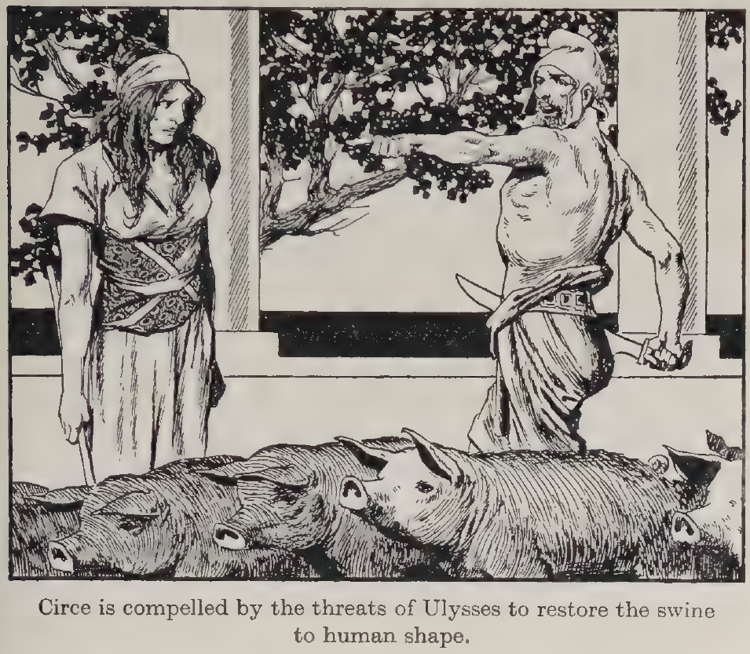

### 100. Afloat again

Postrīdiē eius diēī, Ulixēs ex īnsulā quam celerrimē discēdere in animō habēbat. Circē tamen, cum eius cōnsilium cognōvisset, ex odiō in amōrem conversa, omnibus precibus eum, ut paucōs diēs apud sē morārētur, ōrāre atque obtestārī coepit. Quā rē impetrātā tanta beneficia in eum contulit, ut facile eī, ut diūtius manēret, persuāsum sit. Ulixēs tamen, postquam tōtum annum apud Circēn cōnsūmpsit, magnā patriae suae videndae cupiditāte mōtus est. Itaque, sociīs ad sē convocātīs, quid in animō habēret, ostendit. Sed ubi ad lītus dēscendit, nāvem suam tempestātibus ita afflīctam invēnit, ut ad nāvigandum paene inūtilis esset. Quō cognitō, omnia, quae ad nāvēs reficiendās ūsuī erant, comparārī iussit: quā in rē tantam dīligentiam omnēs adhibēbant, ut ante diem tertium opus cōnficerent. At Circē, ubi vīdit omnia ad profectiōnem parāta esse, rem aegrē ferēbat, atque Ulixem vehementer, ut eō cōnsiliō dēsisteret, obsecrābat. Ille tamen, nē annī tempore ā nāvigātiōne exclūderētur, mātūrandum sibi exīstimāvit, et, tempestātem idōneam nactus, nāvem solvit. Multa quidem perīcula Ulixī, antequam in patriam suam pervenīret, subeunda erant. Quae tamen hōc locō perscrībere longum est.
