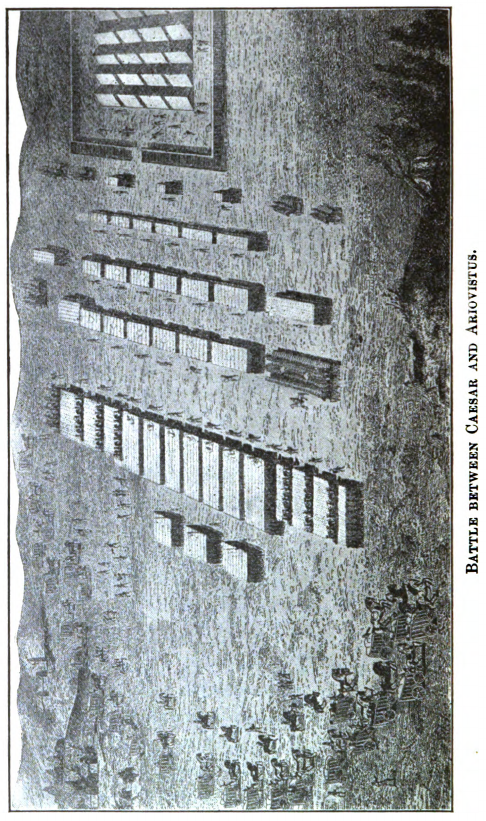
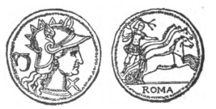
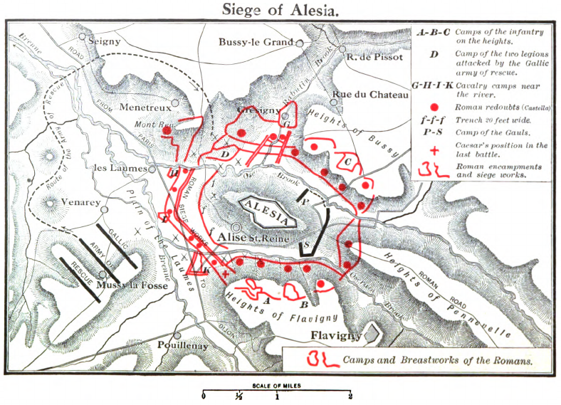

# Book I

## I. The War with the Helvetians, 58 B.C.

*The Divisions and Peoples of Gaul. Superiority of the Belgae and the Helvetii.*

*1.* Gallia est omnis dīvīsa in partēs trēs, quārum ūnam incolunt Belgae, aliam Aquītānī, tertiam, quī ipsōrum linguā Celtae, nostrā Gallī appellantur. Hī omnēs linguā, īnstitūtīs, lēgibus inter sē differunt. Gallōs ab Aquītānīs Garumna flūmen, ā Belgīs Matrona et Sēquana dīvidit.

Hōrum omnium fortissimī sunt Belgae, proptereā quod ā cultū atque hūmānitāte prōvinciae longissimē absunt, minimēque ad eōs mercātōrēs saepe commeant atque ea quae ad effēminandōs animōs pertinent important, proximīque sunt Germānīs, quī trāns Rhēnum incolunt, quibuscum continenter bellum gerunt. Quā dē causā Helvētiī quoque reliquōs Gallōs virtūte praecēdunt, quod ferē cotīdiānīs proeliīs cum Germānīs contendunt, cum aut suīs fīnibus eōs prohibent aut ipsī in eōrum fīnibus bellum gerunt.

Eōrum ūna pars, quam Gallōs obtinēre dictum est, initium capit ā flūmine Rhodanō; continētur Garumnā flūmine, Ōceanō, fīnibus Belgārum; attingit etiam ā Sēquanīs et Helvētiīs flūmen Rhēnum; vergit ad septentriōnēs. Belgae ab extrēmīs Galliae fīnibus oriuntur, pertinent ad īnferiōrem partem flūminis Rhēnī; spectant in septentriōnem et orientem sōlem. Aquītānia ā Garumnā flūmine ad Pȳrēnaeōs montēs et eam partem Ōceanī, quae est ad Hispāniam, pertinet; spectat inter occāsum sōlis et septentriōnēs.

*The Helvetians, dissatisfied with the extent of their territories, are persuaded by Orgetorix to migrate.*

*2.* Apud Helvētiōs longē nōbilissimus fuit et dītissimus Orgetorīx. Is, M. Messālā M. Pīsōne cōnsulibus, rēgnī cupiditāte inductus, coniūrātiōnem nōbilitātis fēcit et cīvitātī persuāsit ut dē fīnibus suīs cum omnibus cōpiīs exīrent: perfacile esse, cum virtūte omnibus praestārent, tōtīus Galliae imperiō potīrī.

Id hōc facilius eīs persuāsit, quod undique locī nātūrā Helvētiī continentur: ūnā ex parte flūmine Rhēnō, lātissimō atque altissimō, quī agrum Helvētium ā Germānīs dīvidit; alterā ex parte monte Iūrā altissimō, quī est inter Sēquanōs et Helvētiōs; tertiā, lacū Lemannō et flūmine Rhodanō, quī prōvinciam nostram ab Helvētiīs dīvidit.

Hīs rēbus fīēbat, ut et minus lātē vagārentur et minus facile fīnitimīs bellum īnferre possent; quā ex parte hominēs bellandī cupidī magnō dolōre afficiēbantur. Prō multitūdine autem hominum et prō glōriā bellī atque fortitūdinis angustōs sē fīnēs habēre arbitrābantur, quī in longitūdinem mīlia passuum CCXL, in lātitūdinem CLXXX patēbant.

*They make their preparations. Orqgetorix plans to make himself their king.*

*3.* Hīs rēbus adductī et auctōritāte Orgetorīgis permōtī cōnstituērunt ea quae ad proficīscendum pertinērent comparāre, iūmentōrum et carrōrum quam maximum numerum coemere, sēmentēs quam maximās facere, ut in itinere cōpia frūmentī suppeteret, cum proximīs cīvitātibus pācem et amīcitiam cōnfirmāre.

Ad eās rēs cōnficiendās biennium sibi satis esse dūxērunt; in tertium annum profectiōnem lēge cōnfirmant. Ad eās rēs cōnficiendās Orgetorīx dēligitur. Is sibi lēgātiōnem ad cīvitātēs suscēpit. In eō itinere persuādet Casticō, Catamantāloedis fīliō, Sēquanō, cuius pater rēgnum in Sēquanīs multōs annōs obtinuerat et ā senātū populī Rōmānī amīcus appellātus erat, ut rēgnum in cīvitāte suā occupāret, quod pater ante habuerat; itemque Dumnorīgī Aeduō, frātrī Diviciācī, quī eō tempore prīncipātum in cīvitāte obtinēbat ac maximē plēbī acceptus erat, ut idem cōnārētur persuādet eīque fīliam suam in mātrimōnium dat.

Perfacile factū esse illīs probat cōnāta perficere, proptereā quod ipse suae cīvitātis imperium obtentūrus esset: nōn esse dubium, quīn tōtīus Galliae plūrimum Helvētiī possent; sē suīs cōpiīs suōque exercitū illīs rēgna conciliātūrum cōnfirmat.

Hāc ōrātiōne adductī inter sē fidem et iūs iūrandum dant, et rēgnō occupātō, per trēs potentissimōs ac firmissimōs populōs tōtīus Galliae imperiō sēsē potīrī posse spērant.

*The plot is detected. Orqetorix escapes trial, but is found dead, probably by his own hand.*

*4.* Ea rēs est Helvētiīs per indicium ēnūntiāta. Mōribus suīs Orgetorīgem ex vinculīs causam dīcere coēgērunt; damnātum poenam sequī oportēbat, ut ignī cremārētur.

Diē cōnstitūtā causae dictiōnis Orgetorīx ad iūdicium omnem suam familiam, ad hominum mīlia decem, undique coēgit et omnēs clientēs obaerātōsque suōs, quōrum magnum numerum habēbat, eōdem condūxit; per eōs, nē causam dīceret, sē ēripuit.

Cum cīvitās, ob eam rem incitāta, armīs iūs suum exsequī cōnārētur, multitūdinemque hominum ex agrīs magistrātūs cōgerent, Orgetorīx mortuus est; neque abest suspīciō, ut Helvētiī arbitrantur, quīn ipse sibi mortem cōnscīverit.

*The Helvetians continue their preparations. They persuade some of their neighbors to join them.*

*5.* Post eius mortem nihilō minus Helvētiī id, quod cōnstituerant, facere cōnantur, ut ē fīnibus suīs exeant. Ubi iam sē ad eam rem parātōs esse arbitrātī sunt, oppida sua omnia, numerō ad duodecim, vīcōs ad quadringentōs, reliqua prīvāta aedificia incendunt; frūmentum omne, praeter quod sēcum portātūrī erant, combūrunt, ut domum reditiōnis spē sublātā, parātiōrēs ad omnia perīcula subeunda essent; trium mēnsium molita cibāria sibi quemque domō efferre iubent.

Persuādent Rauracīs et Tulingīs et Latobrīgīs fīnitimīs suīs, utī eōdem ūsī cōnsiliō, oppidīs suīs vīcīsque exustīs, ūnā cum eīs proficīscantur; Boiōsque, quī trāns Rhēnum incoluerant et in agrum Nōricum trānsierant Nōreiamque oppugnārant, receptōs ad sē sociōs sibi adscīscunt.

*Halving a choice of two routes, they decide to go by way of the Allobroges and the Roman Province.*

*6.* Erant omnīnō itinera duo, quibus itineribus domō exīre possent: ūnum per Sēquanōs, angustum et difficile, inter montem Iūram et flūmen Rhodanum, vix quā singulī carrī dūcerentur; mōns autem altissimus impendēbat, ut facile perpaucī prohibēre possent; alterum per prōvinciam nostram, multō facilius atque expedītius, proptereā quod inter fīnēs Helvētiōrum et Allobrogum, quī nūper pācātī erant, Rhodanus fluit isque nōnnūllīs locīs vadō trānsītur.

Extrēmum oppidum Allobrogum est, proximumque Helvētiōrum fīnibus, Genava. Ex eō oppidō pōns ad Helvētiōs pertinet. Allobrogibus sēsē vel persuāsūrōs, quod nōndum bonō animō in populum Rōmānum vidērentur, exīstimābant, vel vī coāctūrōs, ut per suōs fīnēs eōs īre paterentur. Omnibus rēbus ad profectiōnem comparātīs, diem dīcunt, quā diē ad rīpam Rhodanī omnēs conveniant. Is diēs erat a. d. V. Kal. Aprīl., L. Pīsōne A. Gabīniō cōnsulibus.

*Caesar hastens to Geneva, to oppose them. They send envoys to him, but he puts them off.*

*7.* Caesarī cum id nūntiātum esset, eōs per prōvinciam nostram iter facere cōnārī, mātūrat ab urbe proficīscī et quam maximīs potest itineribus in Galliam ulteriōrem contendit et ad Genavam pervenit. Prōvinciae tōtī quam maximum potest mīlitum numerum imperat (erat omnīnō in Galliā ulteriōre legiō ūna), pontem, quī erat ad Genavam, iubet rescindī.

Ubi dē eius adventū Helvētiī certiōrēs factī sunt, lēgātōs ad eum mittunt nōbilissimōs cīvitātis, cuius lēgātiōnis Nammeius et Verucloetius prīncipem locum obtinēbant, quī dīcerent sibi esse in animō sine ūllō maleficiō iter per prōvinciam facere, proptereā quod aliud iter habērent nūllum:; rogāre, ut eius voluntāte id sibi facere liceat.

Caesar, quod memoriā tenēbat L. Cassium cōnsulem occīsum exercitumque eius ab Helvētiīs pulsum et sub iugum missum, concēdendum nōn putābat; neque hominēs inimīcō animō, datā facultāte per prōvinciam itineris faciendī, temperātūrōs ab iniūriā et maleficiō exīstimābat. Tamen, ut spatium intercēdere posset, dum mīlitēs, quōs imperāverat, convenīrent, lēgātīs respondit diem sē ad dēlīberandum sūmptūrum; sī quid vellent, ad Id. Aprīl reverterentur.

*Caesar at last denies the request of the Helvetians. They try in vain to cross the Rhine against his will.*

*8.* Intereā eā legiōne, quam sēcum habēbat, mīlitibusque, quī ex prōvinciā convēnerant, ā lacū Lemannō, quī in flūmen Rhodanum īnfluit, ad montem Iūram, quī fīnēs Sēquanōrum ab Helvētiīs dīvidit, mīlia passuum decem novem mūrum in altitūdinem pedum sēdecim fossamque perdūcit. Eō opere perfectō, praesidia dispōnit, castella commūnit, quō facilius, sī sē invītō trānsīre cōnārentur, prohibēre possit.

Ubi ea diēs, quam cōnstituerat cum lēgātīs, vēnit et lēgātī ad eum revertērunt, negat sē mōre et exemplō populī Rōmānī posse iter ūllī per prōvinciam dare, et sī vim facere cōnentur, prohibitūrum ostendit. Helvētiī eā spē dēiectī, nāvibus iūnctīs ratibusque complūribus factīs, aliī vadīs Rhodanī, quā minima altitūdō flūminis erat, nōnnumquam interdiū, saepius noctū, sī perrumpere possent cōnātī, operis mūnītiōne et mīlitum concursū et tēlīs repulsī hōc cōnātū dēstitērunt.

*Through Dumnorix they get permission to march through the country of the Sequani.*

*9.* Relinquēbātur ūna per Sēquanōs via, quā Sēquanīs invītīs propter angustiās īre nōn poterant. Hīs cum suā sponte persuādēre nōn possent, lēgātōs ad Dumnorīgem Aeduum mittunt, ut eō dēprecātōre ā Sēquanīs impetrārent. Dumnorīx grātiā et largītiōne apud Sēquanōs plūrimum poterat et Helvētiīs erat amīcus, quod ex eā cīvitāte Orgetorīgis fīliam in mātrimōnium dūxerat; et cupiditāte rēgnī adductus novīs rēbus studēbat et quam plūrimās cīvitātēs suō beneficiō habēre obstrictās volēbat. Itaque rem suscipit et ā Sēquanīs impetrat, ut per fīnēs suōs Helvētiōs īre patiantur, obsidēsque utī inter sēsē dent, perficit: Sēquanī, nē itinere Helvētiōs prohibeant, Helvētiī, ut sine maleficiō et iniūriā trānseant.

*Foreseeing danger to the province, Caesar marches against the Helvetians.*

*10.* Caesarī renūntiātur Helvētiīs esse in animō per agrum Sēquanōrum et Aeduōrum iter in Santonum fīnēs facere, quī nōn longē ā Tolōsātium fīnibus absunt, quae cīvitās est in prōvinciā. Id sī fieret, intellegēbat magnō cum perīculō prōvinciae futūrum, ut hominēs bellicōsōs, populī Rōmānī inimīcōs, locīs patentibus maximēque frūmentāriīs fīnitimōs habēret.

Ob eās causās eī mūnītiōnī quam fēcerat T. Labiēnum lēgātum praefēcit; ipse in Italiam magnīs itineribus contendit duāsque ibi legiōnēs cōnscrībit et trēs, quae circum Aquileiam hiemābant, ex hībernīs ēdūcit et, quā proximum iter in ulteriōrem Galliam per Alpēs erat, cum hīs quīnque legiōnibus īre contendit.

Ibi Ceutronēs et Graiocelī et Caturīgēs, locīs superiōribus occupātīs, itinere exercitum prohibēre cōnantur. Complūribus hīs proeliīs pulsīs, ab Ocelō, quod est oppidum citeriōris prōvinciae extrēmum, in fīnēs Vocontiōrum ulteriōris prōvinciae diē septimō pervēnit; inde in Allobrogum fīnēs, ab Allobrogibus in Segūsiāvōs exercitum dūcit. Hī sunt extrā prōvinciam trāns Rhodanum prīmī.

*The Helvetians devastate the territories of the Aeduans and their neighons, who appsal to Caesar for help.*

*11.* Helvētiī iam per angustiās et fīnēs Sēquanōrum suās cōpiās trādūxerant et in Aeduōrum fīnēs pervēnerant eōrumque agrōs populābantur. Aeduī cum sē suaque ab eīs dēfendere nōn possent, lēgātōs ad Caesarem mittunt rogātum auxilium: ita sē omnī tempore dē populō Rōmānō meritōs esse, ut paene in cōnspectū exercitūs nostrī agrī vāstārī, līberī eōrum in servitūtem abdūcī, oppida expugnārī nōn dēbuerint. Eōdem tempore quō Aeduī, Ambarrī, necessāriī et cōnsanguineī Aeduōrum, Caesarem certiōrem faciunt sēsē dēpopulātīs agrīs nōn facile ab oppidīs vim hostium prohibēre. Item Allobrogēs, quī trāns Rhodanum vīcōs possessiōnēsque habēbant, fugā sē ad Caesarem recipiunt et dēmōnstrant sibi praeter agrī solum nihil esse reliquī Quibus rēbus adductus Caesar nōn exspectandum,sibi statuit, dum omnibus fortūnīs sociōrum cōnsūmptīs Santonōs Helvētiī pervenīrent.

*The Helvetians try to cross the Arar. Caesar surprises them, and destroys one division of their army.*

*13.* Flūmen est Arar, quod per fīnēs Aeduōrum et Sēquanōrum in Rhodanum īnfluit incrēdibilī lēnitāte, ita ut oculīs, in utram partem fluat, iūdicārī nōn possit. Id Helvētiī ratibus ac lintribus iūnctīs trānsībant.

Ubi per explōrātōrēs Caesar certior factus est trēs iam partēs cōpiārum Helvētiōs id flūmen trādūxisse, quārtam ferē partem citrā flūmen Ararim reliquam esse, dē tertiā vigiliā cum legiōnibus tribus ē castrīs profectus ad eam partem pervēnit, quae nōndum flūmen trānsierat. Eōs impedītōs et inopīnantēs aggressus magnam partem eōrum concīdit; reliquī sēsē fugae mandārunt atque in proximās silvās abdidērunt.

Is pāgus appellābātur Tigurīnus; nam omnis cīvitās Helvētia in quattuor pāgōs dīvīsa est. Hīc pāgus ūnus, cum domō exīsset patrum nostrōrum memoriā, L. Cassium cōnsulem interfēcerat et eius exercitum sub iugum mīserat. Ita sīve cāsū sīve cōnsiliō deōrum immortālium, quae pars cīvitātis Helvētiae īnsignem calamitātem populō Rōmānō intulerat, ea prīnceps poenās persolvit. Quā in rē Caesar nōn sōlum pūblicās, sed etiam prīvātās iniūriās ultus est, quod eius socerī L. Pīsōnis avum, L. Pīsōnem lēgātum, Tigurīnī eōdem proeliō, quō Cassium, interfēcerant.

*Caesar bridges the Arar and pursues the enemy. They send envoys who speak threateningly and boastfully.*

*13.* Hōc proeliō factō, reliquās cōpiās Helvētiōrum ut cōnsequī posset, pontem in Ararī faciendum cūrat atque ita exercitum trādūcit. Helvētiī repentīnō eius adventū commōtī, cum id quod ipsī diēbus XX aegerrimē cōnfēcerant, ut flūmen trānsīrent, illum ūnō diē fēcisse intellegerent, lēgātōs ad eum mittunt; cuius lēgātiōnis Dīvicō prīnceps fuit, quī bellō Cassiānō dux Helvētiōrum fuerat.

Is ita cum Caesare ēgit: sī pācem populus Rōmānus cum Helvētiīs faceret, in eam partem itūrōs atque ibi futūrōs Helvētiōs, ubi eōs Caesar cōnstituisset atque esse voluisset; sīn bellō persequī persevērāret, reminīscerētur et veteris incommodī populī Rōmānī et prīstinae virtūtis Helvētiōrum.

Quod imprōvīsō ūnum pāgum adortus esset, cum iī quī flūmen trānsīssent suīs auxilium ferre nōn possent, nē ob eam rem aut suae magnopere virtūtī tribueret aut ipsōs dēspiceret. Sē ita ā patribus maiōribusque suīs didicisse, ut magis virtūte contenderent, quam dolō aut īnsidiīs nīterentur. Quārē nē committeret, ut is locus, ubi cōnstitissent, ex calamitāte populī Rōmānī et interneciōne exercitūs nōmen caperet aut memoriam prōderet.

*Caesar rebukes them for their presumption, anū foretells their destruction. He offers terms of peace, which are rejected.*

Hīs Caesar ita respondit: eō sibi minus dubitātiōnis darī(quod eās rēs quās lēgātī Helvētiī commemorāssent memoriā tenēret atque eō gravius ferre, quō minus meritō populī Rōmānī accidissent; quī sī alicuius iniūriae sibi cōnscius fuisset, nōn fuisse difficile cavēre; sed eō dēceptum, quod neque]commissum ā sē intellegeret quārē timēret, neque sine causā timendum putāret.

Quod sī veteris contumēliae oblīvīscī vellet,num etiam recentium iniūriārum, quod eō invītō iter per prōvinciam per vim temptāssent, quod Aeduōs, quod Ambarrōs, quod Allobrogēs vexāssent, memoriam dēpōnere posse? Quod suā victōriā tam īnsolenter glōriārentur quodque tam diū sē impūne iniūriās intulisse admīrārentur, eōdem pertinēre. Cōnsuēsse enim deōs immortālēs quō gravius hominēs ex commūtātiōne rērum doleant, quōs prō scelere eōrum ulcīscī velint, hīs secundiōrēs interdum rēs et diūturniōrem impūnitātem concēdere.

Cum ea ita sint, tamen, sī obsidēs ab eīs sibi dentur, utī ea, quae polliceantur, factūrōs intellegat, et sī Aeduīs dē iniūriīs, quās ipsīs sociīsque eōrum intulerint, item sī Allobrogibus satisfaciant, sēsē cum eīs pācem esse factūrum.

Dīvicō respondit: ita Helvētiōs ā maiōribus suīs īnstitūtōs esse, utī obsidēs accipere, nōn dare cōnsuerint; eius reī populum Rōmānum esse testem. Hōc respōnsō datō discessit.

*The Helvetians continue their march, closely followed by Caesar. They harass the Romans.*

*15.* Posterō diē castra ex eō locō movent. Idem facit Caesar equitātumque omnem, ad numerum quattuor mīlium, quem ex omnī prōvinciā et Aeduīs atque eōrum sociīs coāctum habēbat, praemittit, quī videant, quās in partēs hostēs iter faciant. Quī cupidius novissimum agmen īnsecūtī aliēnō locō cum equitātū Helvētiōrum proelium committunt; et paucī dē nostrīs cadunt.

Quō proeliō sublātī Helvētiī, quod quīngentīs equitibus tantam multitūdinem equitum prōpulerant, audācius subsistere nōnnumquam et novissimō agmine proeliō nostrōs lacessere coepērunt. Caesar suōs ā proeliō continēbat ac satis habēbat in praesentiā hostem rapīnīs, pābulātiōnibus populātiōnibusque prohibēre. Ita diēs circiter quīndecim iter fēcērunt, ut inter novissimum hostium agmen et nostrum prīmum nōn amplius quīnīs aut sēnīs mīlibus passuum interesset.

*The Aeduans fail to supply the grain whnich they had promised. Caesar rebukes them.*

*16.* Interim cotīdiē Caesar Aeduōs frūmentum, quod essent pūblicē pollicitī, flāgitāre. Nam propter frīgora, quod Gallia sub septentriōnibus, ut ante dictum est, posita est, nōn modo frūmenta in agrīs mātūra nōn erant, sed nē pābulī quidem satis magna cōpia suppetēbat; eō autem frūmentō, quod flūmine Ararī nāvibus subvexerat, proptereā minus ūtī poterat, quod iter ab Ararī Helvētiī āverterant, ā quibus discēdere nōlēbat. Diem ex diē dūcere Aeduī: cōnferrī, comportārī, adesse dīcere.

Ubi sē diūtius dūcī intellēxit et diem īnstāre, quō diē frūmentum mīlitibus mētīrī oportēret, convocātīs eōrum prīncipibus, quōrum magnam cōpiam in castrīs habēbat, in hīs Dīviciācō et Liscō, quī summō magistrātuī praeerat, quem vergobretum appellant Aeduī, quī creātur annuus et vītae necisque in suōs habet potestātem, graviter eōs accūsat, quod, cum neque emī neque ex agrīs sūmī posset, tam necessāriō tempore, tam propinquīs hostibus, ab eīs nōn sublevētur; praesertim cum magnā ex parte eōrum precibus adductus bellum suscēperit, multō etiam gravius, quod sit dēstitūtus, queritur.

*Liscus tells him of a faction of the nobles which is opposed to the Romans.*

*17.* Tum dēmum Liscus, ōrātiōne Caesaris adductus, quod anteā tacuerat prōpōnit: esse nōnnūllōs, quōrum auctōritās apud plēbem plūrimum valeat, quī prīvātim plūs possint quam ipsī magistrātūs. Hōs sēditiōsā atque improbā ōrātiōne multitūdinem dēterrēre nē frūmentum cōnferant, quod dēbeant: praestāre, sī iam prīncipātum Galliae obtinēre nōn possint, Gallōrum quam Rōmānōrum imperia perferre; neque dubitāre quīn, sī Helvētiōs superāverint Rōmānī, ūnā cum reliquā Galliā Aeduīs lībertātem sint ēreptūrī. Ab eīsdem nostra cōnsilia, quaeque in castrīs gerantur, hostibus ēnūntiārī; hōs ā sē coercērī nōn posse. Quīn etiam, quod necessāriam rem coāctus Caesarī ēnuntiārit, intellegere sēsē quantō id cum perīculō fēcerit, et ob eam causam, quamdiū potuerit, tacuisse.

*Caesar suspects that Dumnorix is the chief of this faction. Liscus admits that he is.*

*18.* Caesar hāc ōrātiōne Liscī Dumnorīgem, Dīviciācī frātrem, dēsignārī sentiēbat; sed, quod plūribus praesentibus eās rēs iactārī nōlēbat, celeriter concilium dīmittit, Liscum retinet. Quaerit ex sōlō ea, quae in conventū dīxerat. Dīcit līberius atque audācius.

Eadem sēcrētō ab aliīs quaerit; reperit esse vērā: ipsum esse Dumnorīgem, summā audāciā, magnā apud plēbem propter līberālitātem grātiā, cupidum rērum novārum. Complūrēs annōs portōria reliquaque omnia Aeduōrum vectīgālia parvō pretiō redēmpta habēre, proptereā quod illō licente contrā licērī audeat nēmō. Hīs rēbus et suam rem familiārem auxisse et facultātēs ad largiendum magnās comparāsse; magnum numerum equitātūs suō sūmptū semper alere et circum sē habēre neque sōlum domī, sed etiam apud fīnitimās cīvitātēs largiter posse; atque huius potentiae causā mātrem in Biturīgibus hominī illic nōbilissimō ac potentissimō collocāsse, ipsum ex Helvētiīs uxōrem habēre, sorōrem ex mātre et propinquās suās nūptum in aliās cīvitātēs collocāsse.

Favēre et cupere Helvētiīs propter eam affīnitātem, ōdisse etiam suō nōmine Caesarem et Rōmānōs, quod eōrum adventū potentia eius dēminūta et Dīviciācus frāter in antīquum locum grātiae atque honōris sit restitūtus. Sī quid accidat Rōmānīs, summam in spem per Helvētiōs rēgnī obtinendī venīre; imperiō populī Rōmānī nōn modo dē rēgnō, sed etiam dē eā, quam habeat, grātiā dēspērāre.

Reperiēbat etiam in quaerendō Caesar, quod proelium equestre adversum paucīs ante diēbus esset factum, initium eius fugae factum ā Dumnorīge atque eius equitibus (nam equitātuī, quem auxiliō Caesarī Aeduī mīserant, Dumnorīx praeerat); eōrum fugā reliquum esse equitātum perterritum.

*Caesar wishes to punish Dumnorix, but first consults his brother, whom he does not wish to offend.*

*19.* Quibus rēbus cognitīs, cum ad hās suspīciōnēs certissimae rēs accēderent, quod per fīnēs Sēquanōrum Helvētiōs trādūxisset, quod obsidēs inter eōs dandōs cūrāsset, quod ea omnia nōn modo iniussū suō et cīvitātis, sed etiam īnscientibus ipsīs fēcisset, quod ā magistrātū Aeduōrum accūsārētur, satis esse causae arbitrābātur, quārē in eum aut ipse animadverteret aut cīvitātem animadvertere iubēret.

Hīs omnibus rēbus ūnum repugnābat, quod Dīviciācī frātris summum in populum Rōmānum studium, summam in sē voluntātem, ēgregiam fidem, iūstitiam, temperantiam cognōverat; nam nē eius suppliciō Dīviciācī animum offenderet, 'verēbātur. Itaque priusquam quicquam cōnārētur, Dīviciācum ad sē vocārī iubet et, cotīdiānīs interpretibus remōtīs, per C. Valerium Troucillum, prīncipem Galliae prōvinciae, familiārem suum, cui summam omnium rērum fidem habēbat, cum eō colloquitur; simul commonefacit quae ipsō praesente in conciliō Gallōrum dē Dumnorīge sint dicta, et ostendit quae sēparātim quisque dē eō apud sē dīxerit; petit atque hortātur ut sine offēnsiōne animī vel ipse dē eō causā cognitā statuat vel cīvitātem statuere iubeat.

*Induced by Diviciacus, Caesar contents himself with warning Dumnorix, but sets spies over him.*

*20.* Dīviciācus multīs cum lacrimīs Caesarem complexus obsecrāre coepit, nē quid gravius in frātrem statueret: scīre sē illa esse vēra, nec quemquam ex eō plūs quam sē dolōris capere, proptereā quod, cum ipse grātiā plurimum domī atque in reliquā Galliā, ille minimum propter adulēscentiam posset, per sē crēvisset; quibus opibus ac nervīs nōn sōlum ad minuendam grātiam, sed paene ad perniciem suam ūterētur. Sēsē tamen et amōre frāternō et exīstimātiōne vulgī commovērī. Quod sī quid eī ā Caesare gravius accidisset, cum ipse eum locum amīcitiae apud eum tenēret, nēminem exīstimātūrum nōn suā voluntāte factum; quā ex rē futūrum utī tōtīus Galliae animī ā sē āverterentur.

Haec cum plūribus verbīs flēns ā Caesare peteret, Caesar eius dextram prēndit; cōnsōlātus rogat, fīnem ōrandī faciat; tantī eius apud sē grātiam esse ostendit, utī et reī pūblicae iniūriam et suum dolōrem eius voluntātī ac precibus condōnet. Dumnorīgem ad sē vocat, frātrem adhibet; quae in eō reprehendat ostendit; quae ipse intellegat, quae cīvitās querātur, prōpōnit; monet ut in reliquum tempus omnēs suspīciōnēs vītet; praeterita sē Dīviciācō frātrī condōnāre dīcit. Dumnorīgī custōdēs pōnit, ut quae agat, quibuscum loquātur, scīre possit.

*Caesar plans an attack on the enemy from two sides at once.*

*21.* Eōdem diē ab explōrātōribus certior factus hostēs sub monte cōnsēdisse mīlia passuum ab ipsīus castrīs octō, quālis esset nātūra montis et quālis in circuitū ascēnsus, quī cognōscerent mīsit. Renūntiātum est facilem esse. Dē tertiā vigiliā T. Labiēnum, lēgātum prō praetōre, cum duābus legiōnibus et eīs ducibus quī iter cognōverant summum iugum montis ascendere iubet; quid suī cōnsilī sit, ostendit.

Ipse dē quārtā vigiliā eōdem itinere quō hostēs ierant ad eōs contendit equitātumque omnem ante sē mittit. P. Cōnsidius, quī reī mīlitāris perītissimus habēbātur et in exercitū L. Sullae et posteā in M. Crassī fuerat, cum explōrātōribus praemittitur.

*The blunder of a scout makes it necessary to give up the plan. The march continues.*

*22.* Prīmā lūce, cum summus mōns ā Labiēnō tenērētur, ipse ab hostium castrīs nōn longius mīlle et quīngentīs passibus abesset neque, ut posteā ex captīvīs comperit, aut ipsīus adventus aut Labiēnī cognitus esset, Cōnsidius equō admissō ad eum accurrit, dīcit montem quem ā Labiēnō occupārī voluerit ab hostibus tenērī; id sē ā Gallicīs armīs atque īnsignibus cognōvisse. Caesar suās cōpiās in proximum collem subdūcit, aciem īnstruit.

Labiēnus, ut erat eī praeceptum ā Caesare nē proelium committeret, nisi ipsīus cōpiae prope hostium castra vīsae essent, ut undique ūnō tempore in hostēs impetus fieret, monte occupātō nostrōs exspectābat proeliōque abstinēbat. Multō dēnique diē per explōrātōrēs Caesar cognōvit et montem ā suīs tenērī et Helvētiōs castra mōvisse et Cōnsidium, timōre perterritum, quod nōn vīdisset prō vīsō sibi renūntiāsse. Eō diē quō cōnsuerat intervāllō hostēs sequitur et mīlia passuum tria ab eōrum castrīs castra pōnit.

*Caesar turns aside to Bibracte on account of the scarcity of provisions. The Helvetians follow him.*

*23.* Postrīdiē eius diēī, quod omnīnō bīduum supererat, cum exercituī frūmentum mētīrī oportēret, et quod ā Bibracte, oppidō Aeduōrum longē maximō et cōpiōsissimō, nōn amplius mīlibus passuum XVIII aberat, reī frūmentāriae prōspiciendum exīstimāvit; iter ab Helvētiīs āvertit ac Bibracte īre contendit. Ea rēs per fugitīvōs L. Aemilī, decuriōnis equitum Gallōrum, hostibus nūntiātur. Helvētiī seu quod timōre perterritōs Rōmānōs discēdere ā sē exīstimārent, eō magis quod prīdiē superiōribus locīs occupātīs proelium nōn commīsissent, sīve eō, quod rē frūmentāriā interclūdī posse cōnfīderent, commūtātō cōnsiliō atque itinere conversō nostrōs ā novissimō agmine īnsequī ac lacessere coepērunt.

*Caesar occupies a hill. The Helvetians defeat his cavalry and prepare to storm his position.*

*24.* Postquam id animadvertit, cōpiās suās Caesar in proximum collem subdūcit equitātumque, quī sustinēret hostium impetum, mīsit. Ipse interim in colle mediō triplicem aciem īnstrūxit legiōnum quattuor veterānārum; sed in summō iugō duās legiōnēs, quās in Galliā citeriōre proximē cōnscrīpserat, et omnia auxilia collocārī ac tōtum montem hominibus complērī, et intereā sarcinās in ūnum locum cōnferrī et eum ab hīs quī in superiōre aciē cōnstiterant mūnīrī iussit.

Helvētiī cum omnibus suīs carrīs secūtī impedīmenta in ūnum locum contulērunt; ipsī cōnfertissimā aciē, reiectō nostrō equitātū, phalange factā sub prīmam nostram aciem successērunt.

*The Romans repulse the enemy, but the Boii and Tulingi attack Caesars flfank. The Helvetians return, and the Romans are assailed on both sides.*

*25.* Caesar prīmum suō, deinde omnium ex cōnspectū remōtīs equīs, ut aequātō omnium perīculō spem fugae tolleret, cohortātus suōs proelium commīsit. Mīlitēs ē locō superiōre pīlīs missīs facile hostium phalangem perfrēgērunt. Eā disiectā, gladiīs dēstrictīs in eōs impetum fēcērunt. Gallīs magnō ad pugnam erat impedīmentō, quod plūribus eōrum scūtīs ūnō ictū pīlōrum trānsfīxīs et colligātīs, cum ferrum sē īnflexisset, neque ēvellere neque sinistrā impedītā satis commodē pugnāre poterant, multī ut diū iactātō bracchiō praeoptārent scūtum manū ēmittere et nūdō corpore pugnāre.

Tandem vulneribus dēfessī et pedem referre et, quod mōns suberat circiter mīlle passuum, eō sē recipere coepērunt. Captō monte et succēdentibus nostrīs, Boiī et Tulingī, quī hominum mīlibus circiter quīndecim agmen hostium claudēbant et novissimīs praesidiō erant, ex itinere nostrōs ā latere apertō aggressī circumvenīre, et id cōnspicātī Helvētiī, quī in montem sēsē recēperant, rūrsus īnstāre et proelium redintegrāre coepērunt. Rōmānī conversa signa bipertītō intulērunt: prīma et secunda aciēs, ut victīs ac summōtīs resisteret; tertia, ut venientēs sustinēret

*After a sharp fight the Romans are victorious and capture the camp. Caesar sets out in pursuit of the enemy.*

*26.* Ita ancipitī proeliō diū atque ācriter pugnātum est. Diūtius cum sustinēre nostrōrum impetūs nōn possent, alterī sē, ut coeperant, in montem recēpērunt, alterī ad impedīmenta et carrōs suōs sē contulērunt. Nam hōc tōtō proeliō, cum ab hōrā septimā ad vesperum pugnātum sit, āversum hostem vidēre nēmō potuit. Ad multam noctem etiam ad impedīmenta pugnātum est, proptereā quod prō vallō carrōs obiēcerant et ē locō superiōre in nostrōs venientēs tēla coniciēbant, et nōnnūllī inter carrōs rotāsque matarās ac trāgulās subiciēbant nostrōsque vulnerābant.

Diū cum esset pugnātum, impedīmentīs castrīsque nostrī potītī sunt. Ibi Orgetorīgis fīlia atque ūnus ē fīliīs captus est. Ex eō proeliō circiter hominum mīlia centum et trīgintā superfuērunt eāque tōtā nocte continenter iērunt; nūllam partem noctis itinere intermissō, in fīnēs Lingonum diē quārtō pervēnērunt, cum et propter vulnera mīlitum et propter sepultūram occīsōrum nostrī trīduum morātī eōs sequī nōn potuissent. Caesar ad Lingonas litterās nūntiōsque mīsit, nē eōs frūmentō nēve aliā rē iuvārent; quī sī iūvissent, sē eōdem locō quō Helvētiōs habitūrum. Ipse trīduō intermissō cum omnibus cōpiīs eōs sequī coepit.

*The Helvetians surrender. Six thousand men of one canton try to escape.*

*27.* Helvētiī omnium rērum inopiā adductī lēgātōs dē dēditiōne ad eum mīsērunt. Quī cum eum in itinere convēnissent sēque ad pedēs prōiēcissent suppliciterque locūtī flentēs pācem petīssent, atque eōs in eō locō quō tum essent suum adventum exspectāre iussisset, pāruērunt. Eō postquam Caesar pervēnit, obsidēs, arma, servōs quī ad eōs perfūgissent, poposcit.

Dum ea conquīruntur et cōnferuntur nocte intermissā, circiter hominum mīlia sex eius pāgī, quī Verbigenus appellātur, sīve timōre perterritī, nē armīs trāditīs suppliciō afficerentur, sīve spē salūtis inductī, quod in tantā multitūdine dēditīciōrum suam fugam aut occultārī aut omnīnō ignōrārī posse exīstimārent, prīmā nocte ē castrīs Helvētiōrum ēgressī ad Rhēnum fīnēsque Germānōrum contendērunt.

*Caesar punishes the fugitives. He orders the Gauls to return home, but allows the Aeduans to receive the Boii.*

*28.* Quod ubi Caesar resciit, quōrum per fīnēs ierant, hīs, utī conquīrerent et redūcerent, sī sibi pūrgātī esse vellent, imperāvit; reductōs in hostium numerō habuit; reliquōs omnēs, obsidibus, armīs, perfugīs trāditīs, in dēditiōnem accēpit. Helvētiōs, Tulingōs, Latobrīgōs in fīnēs suōs, unde erant profectī, revertī iussit; et quod omnibus frūgibus āmissīs domī nihil erat quō famem tolerārent, Allobrogibus imperāvit ut eīs frūmentī cōpiam facerent; ipsōs oppida vīcōsque, quōs incenderant, restituere iussit.

Id eā maximē ratiōne fēcit, quod nōluit eum locum unde Helvētiī discesserant vacāre, nē propter bonitātem agrōrum Germānī, quī trāns Rhēnum incolunt, ē suīs fīnibus in Helvētiōrum fīnēs trānsīrent et fīnitimī Galliae prōvinciae Allobrogibusque essent. Boiōs petentibus Aeduīs, quod ēgregiā virtūte erant cognitī, ut in fīnibus suīs collocārent, concessit; quibus illī agrōs dedērunt, quōsque posteā in parem iūris lībertātisque condiciōnem atque ipsī erant recēpērunt.

*The numbers of the enemy before and after the battle.*

*29.* In castrīs Helvētiōrum tabulae repertae sunt litterīs Graecīs cōnfectae et ad Caesarem relātae, quibus in tabulīs nōminātim ratiō cōnfecta erat, quī numerus domō exīsset eōrum quī arma ferre possent et item sēparātim puerī, senēs mulierēsque.

Quārum omnium rērum summa erat capitum Helvētiōrum mīlia CCLXIII, Tulingōrum mīlia XXXVI, Latobrīgōrum XIIII, Rauracōrum XIII, Boiōrum XXXII; ex hīs quī arma ferre possent, ad mīlia nōnāgintā duo. Summa omnium fuērunt ad mīlia trecenta sexāgintā octō. Eōrum quī domum rediērunt, cēnsū habitō, ut Caesar imperāverat, repertus est numerus mīlium centum
et decem.

## II. The Campaign against Ariovistus, 58 B.C.

*Caesar receives congratulations from the Gauls. They ask for a conference with him.*

*30.* Bellō Helvētiōrum cōnfectō, tōtīus ferē Galliae lēgātī, prīncipēs cīvitātum, ad Caesarem grātulātum convēnērunt: intellegere sēsē, tametsī prō veteribus Helvētiōrum iniūriīs populī Rōmānī ab hīs poenās bellō repetīsset, tamen eam rem nōn minus ex ūsū terrae Galliae quam populī Rōmānī accidisse, proptereā quod eō cōnsiliō flōrentissimīs rēbus domōs suās Helvētiī relīquissent, utī tōtī Galliae bellum īnferrent imperiōque potīrentur locumque domiciliō ex magnā cōpiā dēligerent, quem ex omnī Galliā opportūnissimum ac frūctuōsissimum iūdicāssent, reliquāsque cīvitātēs stipendiāriās habērent.

Petiērunt utī sibi concilium tōtīus Galliae in diem certam indīcere idque Caesaris voluntāte facere licēret; sēsē habēre quāsdam rēs, quās ex commūnī cōnsēnsū ab eō petere vellent. Eā rē permissā, diem conciliō cōnstituērunt et iūre iūrandō, nē quis ēnūntiāret, nisi quibus commūnī cōnsiliō mandātum esset, inter sē sānxērunt.

*The Gauls complain of the oppression of Ariovistus, and ask for Caesar’s help against him.*

*31.* Eō conciliō dīmissō, īdem prīncipēs cīvitātum quī ante fuerant, ad Caesarem revertērunt petiēruntque utī sibi sēcrētō dē suā omniumque salūte cum eō agere licēret. Eā rē impetrātā, sēsē omnēs flentēs Caesarī ad pedēs prōiēcērunt: nōn minus sē id contendere et labōrāre, nē ea quae dīxissent ēnūntiārentur, quam utī ea quae vellent impetrārent; proptereā quod, sī ēnūntiātum esset, summum in cruciātum sē ventūrōs vidērent.

Locūtus est prō hīs Dīviciācus Aeduus: Galliae tōtīus factiōnēs esse duās; hārum alterius prīncipātum tenēre Aeduōs, alterius Arvernōs. Hī cum tantopere dē potentātū inter sē multōs annōs contenderent, factum esse utī ab Arvernīs Sēquanīsque Germānī mercēde arcesserentur. Hōrum prīmō circiter mīlia XV Rhēnum trānsīsse; posteāquam agrōs et cultum et cōpiās Gallōrum hominēs ferī ac barbarī adamāssent, trāductōs plūrēs; nunc esse in Galliā ad centum et vīgintī mīlium numerum.

Cum hīs Aeduōs eōrumque clientēs semel atque iterum armīs contendisse; magnam calamitātem pulsōs accēpisse, omnem nōbilitātem, omnem senātum, omnem equitātum āmīsisse. Quibus proeliīs calamitātibusque frāctōs, quī et suā virtūte et populī Rōmānī hospitiō atque amīcitiā plūrimum ante in Galliā potuissent, coāctōs esse Sēquanīs obsidēs dare nōbilissimōs cīvitātis, et iūre iūrandō cīvitātem obstringere sēsē neque obsidēs repetītūrōs, neque auxilium ā populō Rōmānō implōrātūrōs, neque recūsātūrōs quō minus perpetuō sub illōrum diciōne atque imperiō essent. Ūnum sē esse ex omnī cīvitāte Aeduōrum quī addūcī nōn potuerit ut iūrāret aut līberōs suōs obsidēs daret. Ob eam rem sē ex cīvitāte profūgisse et Rōmam ad senātum vēnisse auxilium postulātum, quod sōlus neque iūre iūrandō neque obsidibus tenērētur.

Sed peius victōribus Sēquanīs quam Aeduīs victīs accidisse, proptereā quod Ariovistus, rēx Germānōrum, in eōrum fīnibus cōnsēdisset tertiamque partem agrī Sēquanī, quī esset optimus tōtīus Galliae, occupāvisset et nunc dē alterā parte tertiā Sēquanōs dēcēdere iubēret, proptereā quod paucīs mēnsibus ante Harūdum mīlia hominum vīgintī quattuor ad eum vēnissent, quibus locus ac sēdēs parārentur. Futūrum esse paucīs annīs utī omnēs ex Galliae fīnibus pellerentur atque omnēs Germānī Rhēnum trānsīrent; neque enim cōnferendum esse Gallicum cum Germānōrum agrō, neque hanc cōnsuētūdinem vīctūs cum illā comparandam.

Ariovistum autem, ut semel Gallōrum cōpiās proeliō vīcerit, quod .proelium factum sit Admagetobrigae, superbē et crūdēliter imperāre, obsidēs nōbilissimī cuiusque līberōs poscere et in eōs omnia exempla cruciātūsque ēdere, sī qua rēs nōn ad nūtum aut ad voluntātem eius facta sit. Hominem esse barbarum, īrācundum, temerārium; nōn posse sē eius imperia diūtius sustinēre. Nisi quid in Caesare populōque Rōmānō sit auxilī, omnibus Gallīs idem esse faciendum quod Helvētiī fēcerint, ut domō ēmigrent, aliud domicilium, aliās sēdēs remōtās ā Germānīs petant fortūnamque, quaecumque accidat, experiantur.

Haec sī ēnūntiāta Ariovistō sint, nōn dubitāre quīn dē omnibus obsidibus quī apud eum sint gravissimum supplicium sūmat. Caesarem vel auctōritāte suā atque exercitūs vel recentī victōriā vel nōmine populī Rōmānī dēterrēre posse nē maior multitūdō Germānōrum Rhēnum trādūcātur, Galliamque omnem ab Ariovistī iniūriā posse dēfendere.

*The unhappy lot of the Sequani, who had received Ariovistus into their territories.*

*32.* Hāc ōrātiōne ab Dīviciācō habitā, omnēs quī aderant magnō flētū auxilium ā Caesare petere coepērunt. Animadvertit Caesar ūnōs ex omnibus Sēquanōs nihil eārum rērum facere quās cēterī facerent, sed trīstēs capite dēmissō terram intuērī. Eius reī quae causa esset mīrātus, ex ipsīs quaesiit. Nihil Sēquanī respondēre, sed in eādem trīstitiā tacitī permanēre.

Cum ab hīs saepius quaereret neque ūllam omnīnō vōcem exprimere posset, īdem Dīviciācus Aeduus respondit: hōc esse miseriōrem et graviōrem fortūnam Sēquanōrum quam reliquōrum, quod sōlī nē in occultō quidem querī neque auxilium implōrāre audērent; absentisque Ariovistī crūdēlitātem, velut sī cōram adesset, horrērent, proptereā quod reliquīs tamen fugae facultās darētur, Sēquanīs vērō, quī intrā fīnēs suōs Ariovistum recēpissent, quōrum oppida omnia in potestāte eius essent, omnēs cruciātūs essent perferendī.

*Caesar promises to intercede with Ariovistus. He thinks his power dangerous to the Roman interests in Gaul.*

*33.* Hīs rēbus cognitīs, Caesar Gallōrum animōs verbīs cōnfirmāvit pollicitusque est sibi eam rem cūrae futūram: magnam sē habēre spem et beneficiō suō et auctōritāte adductum Ariovistum fīnem iniūriīs factūrum. Hāc ōrātiōne habitā concilium dīmīsit. Et secundum ea multae rēs eum hortābantur quārē sibi eam rem cōgitandam et suscipiendam putāret; in prīmīs quod Aeduōs, frātrēs cōnsanguineōsque saepenumerō ā senātū appellātōs, in servitūte atque in diciōne vidēbat Germānōrum tenērī eōrumque obsidēs esse apud Ariovistum ac Sēquanōs intellegēbat; quod in tantō imperiō populī Rōmānī turpissimum sibi et reī pūblicae esse arbitrābātur.

Paulātim autem Germānōs cōnsuēscere Rhēnum trānsīre et in Galliam magnam eōrum multitūdinem venīre, populō Rōmānō perīculōsum vidēbat; neque sibi hominēs ferōs ac barbarōs temperātūrōs exīstimābat quīn, cum omnem Galliam occupāvissent, ut ante Cimbrī Teutonīque fēcissent, in prōvinciam exīrent atque inde in Italiam contenderent, praesertim cum Sēquanōs ā prōvinciā nostrā Rhodanus dīvideret; quibus rēbus quam mātūrrime occurrendum putābat. Ipse autem Ariovistus tantōs sibi spīritūs, tantam arrogantiam sūmpserat, ut ferendus nōn vidērētur.

*Caesar proposes a conference. Ariovistus declines in insolent language.*

*34.* Quam ob rem placuit eī ut ad Ariovistum lēgātōs mitteret, quī ab eō postulārent utī aliquem locum medium utrīusque colloquiō dēligeret: velle sēsē dē rē pūblicā et summīs utrīusque rēbus cum eō agere.

Eī lēgātiōnī Ariovistus respondit: Sī quid ipsī ā Caesare opus esset, sēsē ad eum ventūrum fuisse; sī quid ille sē velit, illum ad sē venīre oportēre. Praetereā sē neque sine exercitū in eās partēs Galliae venīre audēre quās Caesar possidēret, neque exercitum sine magnō commeātū atque mōlīmentō in ūnum locum contrahere posse. Sibi autem mīrum vidērī quid in suā Galliā, quam bellō vīcisset, aut Caesarī aut omnīnō populō Rōmānō negōtī esset.

*Caesar thereupon makes demands, offering friendship if they are accepted, and threatening war in case they are refused.*

*35.* Hīs respōnsīs ad Caesarem relātīs, iterum ad eum Caesar lēgātōs cum hīs mandātīs mittit: Quoniam tantō suō populīque Rōmānī beneficiō affectus, cum in cōnsulātū suō rēx atque amīcus ā senātū appellātus esset, hanc sibi populōque Rōmānō grātiam referret, ut in colloquium venīre invītātus gravārētur neque dē commūnī rē dīcendum sibi et cognōscendum putāret, haec esse quae ab eō postulāret: prīmum, nē quam multitūdinem hominum amplius trāns Rhēnum in Galliam trādūceret; deinde obsidēs quōs habēret ab Aeduīs redderet, Sēquanīsque permitteret ut quōs illī habērent voluntāte eius reddere illīs licēret; nēve Aeduōs iniūriā lacesseret, nēve hīs sociīsque eōrum bellum īnferret.

Sī id ita fēcisset, sibi populōque Rōmānō perpetuam grātiam atque amīcitiam cum eō futūram; sī nōn impetrāret, sēsē, quoniam M. Messālā M. Pīsōne cōnsulibus senātus cēnsuisset utī, quīcumque Galliam prōvinciam obtinēret, quod commodō reī pūblicae facere posset, Aeduōs cēterōsque amīcōs populī Rōmānī dēfenderet, sē Aeduōrum iniūriās nōn neglēctūrum.

*Ariovistus rejects Caesar’s proposals and defies him.*

*36.* Ad haec Ariovistus respondit: Iūs esse bellī ut quī vīcissent, eīs quōs vīcissent, quem ad modum vellent, imperārent; item populum Rōmānum victīs nōn ad alterius praescrīptum, sed ad suum arbitrium imperāre cōnsuēsse. Sī ipse populō Rōmānō nōn praescrīberet quem ad modum suō iūre ūterētur, nōn oportēre sē ā populō Rōmānō in: suō iūre impedīrī. Aeduōs sibi, quoniam bellī fortūnam temptāssent et armīs congressī ac superātī essent, stipendiāriōs esse factōs. Magnam Caesarem iniūriam facere, quī suō adventū vectīgālia sibi dēteriōra faceret. Aeduīs sē obsidēs redditūrum nōn esse neque hīs neque eōrum sociīs iniūriā bellum illātūrum, sī in eō manērent quod convēnisset, stīpendiumque quotannīs penderent; sī id nōn fēcissent, longē eīs frāternum nōmen populī Rōmānī āfutūrum.

Quod sibi Caesar dēnūntiāret sē Aeduōrum iniūriās nōn neglēctūrum, nēminem sēcum sine suā perniciē contendisse. Cum vellet, congrederētur; intellēctūrum quid invictī Germānī, exercitātissimī in armīs, quī inter annōs quattuordecim tēctum nōn subīssent, virtūte possent.

*The Aeduans and the Treveri also complain of the aggressions of the Germans. Caesar sets out against Ariovistus.*

*37.* Haec eōdem tempore Caesarī mandāta referēbantur, et lēgātī ab Aeduīs et ā Trēverīs veniēbant: Aeduī questum, quod Harūdēs, quī nūper in Galliam trānsportātī essent, fīnēs eōrum populārentur: sēsē nē obsidibus quidem datīs pācem Ariovistī redimere potuisse; Trēverī autem, pāgōs centum Suēbōrum ad rīpās Rhēnī cōnsēdisse, quī Rhēnum trānsīre cōnārentur; hīs praeesse Nasuam et Cimberium frātrēs.

Quibus rēbus Caesar vehementer commōtus mātūrandum sibi exīstimāvit, nē, sī nova manus Suēbōrum cum veteribus cōpiīs Ariovistī sēsē coniūnxisset, minus facile resistī posset. Itaque rē frūmentāriā quam celerrimē potuit comparātā, magnīs itineribus ad Ariovistum contendit.

*The importance of the town of Vesontio for both parties. Caesar gets possession of it.*

*38.* Cum trīduī viam prōcessisset, nūntiātum est eī Ariovistum cum suīs omnibus cōpiīs ad occupandum Vesontiōnem, quod est oppidum maximum Sēquanōrum, contendere trīduīque viam ā suīs fīnibus prōcessisse.

Id nē accideret, magnopere sibi praecavendum Caesar exīstimābat. Namque omnium rērum, quae ad bellum ūsuī erant, summa erat in eō oppidō facultās, idque nātūrā locī sīc mūniēbātur, ut magnam ad dūcendum bellum daret facultātem, proptereā quod flūmen Dubis, ut circinō circumductum, paene tōtum oppidum cingit; reliquum spatium, quod est nōn amplius pedum MDC, quā flūmen intermittit, mōns continet magnā altitūdine, ita ut rādīcēs eius montis ex utrāque parte rīpae flūminis contingant. Hunc mūrus circumdatus arcem efficit et cum oppidō coniungit.

Hūc Caesar magnīs nocturnīs diurnīsque itineribus contendit, occupātōque oppidō ibi praesidium collocat.

*The reports about the size and valor of the Germans create a panic in Caesar’s army.*

*39.* Dum paucōs diēs ad Vesontiōnem reī frūmentāriae commeātūsque causā morātur, ex percontātiōne nostrōrum vōcibusque Gallōrum ac mercātōrum, quī ingentī magnitūdine corporum Germānōs, incrēdibilī virtūte atque exercitātiōne in armīs esse praedicābant (saepenumerō sēsē cum hīs congressōs nē vultum quidem atque aciem oculōrum dīcēbant ferre potuisse), tantus subitō timor omnem exercitum occupāvit, ut nōn mediocriter omnium mentēs animōsque perturbāret.

Hīc prīmum ortus est ā tribūnīs mīlitum, praefectīs reliquīsque, quī ex urbe amīcitiae causā Caesarem secūtī nōn magnum in rē mīlitārī ūsum habēbant; quōrum alius aliā causā illātā, quam sibi ad proficīscendum necessāriam esse dīceret, petēbat ut eius voluntāte discēdere licēret; nōnnūllī pudōre adductī, ut timōris suspīciōnem vītārent, remanēbant. Hī neque vultum fingere neque interdum lacrimās tenēre poterant; abditī in tabernāculīs aut suum fātum querēbantur aut cum familiāribus suīs commūne perīculum miserābantur. Vulgō tōtīs castrīs testāmenta obsignābantur.

Hōrum vōcibus ac timōre paulātim etiam iī quī magnum in castrīs ūsum habēbant, mīlitēs centuriōnēsque, quīque equitātuī praeerant, perturbābantur. Quī sē ex hīs minus timidōs exīstimārī volēbant, nōn sē hostem verērī, sed angustiās itineris et magnitūdinem silvārum quae intercēderent inter ipsōs atque Ariovistum, aut rem frūmentāriam, ut satis commodē supportārī posset, timēre dīcēbant. Nōnnūllī etiam Caesarī nūntiābant, cum castra movērī ac signa ferrī iussisset, nōn fore dictō audientēs mīlitēs neque propter timōrem signa lātūrōs.

*Caesar upbraids his officers for their lack of confidence. He ridicules their fears, and declares that he will go on.*

*40.* Haec cum animadvertisset, convocātō cōnsiliō omniumque ōrdinum ad id cōnsilium adhibitīs centuriōnibus, vehementer eōs incūsāvit: prīmum quod, aut quam in partem aut quō cōnsiliō dūcerentur, sibi quaerendum aut cōgitandum putārent. Ariovistum sē cōnsule cupidissimē populī Rōmānī amīcitiam appetīsse; cūr hunc tam temere quisquam ab officiō discessūrum iūdicāret? Sibi quidem persuādērī, cognitīs suīs postulātīs atque aequitāte condiciōnum perspectā, eum neques suam neque populī Rōmānī grātiam repudiātūrum.

Quod sī furōre atque āmentiā impulsus bellum intulisset, quid tandem verērentur? aut cūr dē suā virtūte aut dē ipsīus dīligentiā dēspērārent? Factum eius hostis perīculum patrum nostrōrum memoriā, cum Cimbrīs et Teutonīs ā C. Mariō pulsīs nōn minōrem laudem exercitus quam ipse imperātor meritus vidēbātur; factum etiam nūper in Italiā servīlī tumultū, quōs tamen aliquid ūsus ac disciplīna quae ā nōbīs accēpissent sublevārent. Ex quō iūdicārī posse quantum habēret in sē bonī cōnstantia, proptereā quod, quōs aliquamdiū inermēs sine causā timuissent, hōs posteā armātōs ac victōrēs superāssent.

Dēnique hōs esse eōsdem Germānōs, quibuscum saepenumerō Helvētiī congressī nōn sōlum in suīs sed etiam in illōrum fīnibus, plērumque superāssent; quī tamen parēs esse nostrō exercituī nōn potuerint. Sī quōs adversum proelium et fuga Gallōrum commovēret, hōs, sī quaererent, reperīre posse, diūturnitāte bellī dēfatīgātīs Gallīs Ariovistaum, cum multōs mēnsēs castrīs sē ac palūdibus tenuisset neque suī potestātem fēcisset, dēspērantēs iam dē pugnā et dispersōs subitō adortum magis ratiōne et cōnsiliō quam virtūte vīcisse. Cui ratiōnī contrā hominēs barbarōs atque imperītōs locus fuisset, hāc nē ipsum quidem spērāre nostrōs exercitūs capī posse.

Quī suum timōrem in reī frūmentāriae simulātiōnem angustiāsque itineris cōnferrent, facere arroganter, cum aut dē officiō imperātōris dēspērāre aut praescrībere vidērentur. Haec sibi esse cūrae; frūmentum Sēquanōs, Leucōs, Lingonēs sumministrāre, iamque esse in agrīs frūmenta mātūra; dē itinere ipsōs brevī tempore iūdicātūrōs. Quod nōn fore dictō audientēs neque signa lātūrī dīcantur, nihil sē eā rē commovērī: scīre enim, quibuscumque exercitus dictō audiēns nōn fuerit, aut male rē gestā fortūnam dēfuisse aut aliquō facinore compertō avāritiam esse convictam; suam innocentiam perpetuā vītā, fēlīcitātem Helvētiōrum bellō esse perspectam.

Itaque sē, quod in longiōrem diem collātūrus fuisset, repraesentātūrum et proximā nocte dē quārtā vigiliā castra mōtūrum, ut quam prīmum intellegere posset utrum apud eōs pudor atque officium an timor plūs valēret. Quod sī praetereā nēmō sequātur, tamen sē cum sōlā decimā legiōne itūrum, dē quā nōn dubitāret, sibique eam praetōriam cohortem futūram. Huic legiōnī Caesar et indulserat praecipuē et propter virtūtem cōnfīdēbat maximē.

*The soldiers apologize to Caesar. He continues his march against Ariovistus.*

*41.* Hāc ōrātiōne habitā mīrum in modum conversae sunt omnium mentēs, summaque alacritās et cupiditās bellī gerendī innāta est; prīncepsque decima legiō per tribūnōs mīlitum eī grātiās ēgit, quod dē sē optimum iūdicium fēcisset, sēque esse ad bellum gerendum parātissimam cōnfirmāvit. Deinde reliquae legiōnēs cum tribūnīs mīlitum et prīmōrum ōrdinum centuriōnibus ēgērunt utī Caesarī satisfacerent: sē neque umquam dubitāsse neque timuisse neque dē summā bellī suum iūdicium, sed imperātōris esse exīstimāvisse.

Eōrum satisfactiōne acceptā et itinere exquīsītō per
Dīviciācum, quod ex Gallīs eī maximam fidem habēbat,
ut mīlium amplius quīnquāgintā circuitū locīs apertīs
exercitum dūceret, dē quārtā vigiliā, ut dīxerat, pro-
fectus est. Septimō diē, cum iter nōn intermitteret,
ab explōrātōribus certior factus est Ariovistī cōpiās ā
nostrīs mīlia passuum quattuor et vīginti abesse.

*Ariovistus proposes a conference, stipulating that he and Caesar be attended only by horsemen. Caesar agrees, but substitutes the tenth legion for his Gallic cavalry.*

*42.* Cognitō Caesaris adventū Ariovistus lēgātōs ad eum mittit: quod anteā dē colloquiō postulāsset, id per sē fierī licēre, quoniam propius accessisset sēque id sine perīculō facere posse exīstimāret. Nōn respuit condiciōnem Caesar iamque eum ad sānitātem revertī arbitrābātur, cum id quod anteā petentī dēnegāsset ultrō pollicērētur; magnamque in spem veniēbat prō suīs tantīs populīque Rōmānī in eum beneficiīs, cognitīs suīs postulātīs fore utī pertināciā dēsisteret.

Diēs colloquiō dictus est ex eō diē quīntus. Interim saepe ultrō citrōque cum lēgātī inter eōs mitterentur, Ariovistus postulāvit nē quem peditem ad colloquium Caesar addūceret: verērī sē, nē per īnsidiās ab eō circumvenīrētur; uterque cum equitātū venīret; aliā ratiōne sēsē nōn esse ventūrum. Caesar, quod neque colloquium interpositā causā tollī volēbat neque salūtem suam Gallōrum equitātuī committere audēbat, commodissimum esse statuit, omnibus equīs Gallīs equitibus dētractīs, eō legiōnāriōs mīlitēs legiōnis decimae, cui maximē cōnfīdēbat, impōnere, ut praesidium quam amīcissimum, sī quid opus factō esset, habēret.

Quod cum feret, nōn irrīdiculē quīdam ex mīlitibus decimae legiōnis dīxit: plūs quam pollicitus esset Caesarem facere; pollicitum sē in cohortis praetōriae locō decimam legiōnem habitūrum, ad equum rescrībere.

*Caesar accuses Ariovistus of ingratitude to the Romans. He shows his own obligation to protect the Aeduans.*

*43.* Plānitiēs erat magna et in eā tumulus terrēnus satis grandis. Hīc locus aequō ferē spatiō ā castrīs utrīusque aberat. Eō, ut erat dictum, ad colloquium vēnērunt. Legiōnem Caesar, quam equīs dēvexerat, passibus ducentīs ab eō tumulō cōnstituit; item equitēs Ariovistī parī intervāllō cōnstitērunt. Ariovistus, ex equīs ut colloquerentur et praeter sē dēnōs ut ad colloquium addūcerent, postulāvit.

Ubi eō ventum est, Caesar initiō ōrātiōnis sua senātūsque in eum beneficia commemorāvit, quod rēx appellātus esset ā senātū, quod amīcus, quod mūnera amplissimē missa; quam rem et paucīs contigisse et ā Rōmānīs prō magnīs hominum officiīs cōnsuēsse tribuī docēbat; illum, cum neque aditum neque causam postulandī iūstam habēret, beneficiō ac līberālitāte suā ac senātūs ea praemia cōnsecūtum.

Docēbat etiam, quam veterēs quamque iūstae causae necessitūdinis ipsīs cum Aeduīs intercēderent, quae senātūs cōnsulta quotiēns quamque honōrifica in eōs facta essent, ut omnī tempore tōtīus Galliae prīncipātum Aeduī tenuissent, prius etiam quam nostram amīcitiam appetissent. Populī Rōmānī hanc esse cōnsuētūdinem, ut sociōs atque amīcōs nōn modo suī nihil dēperdere, sed grātiā, dignitāte, honōre auctiōrēs velit esse; quod vērō ad amīcitiam populī Rōmānī attulissent, id eīs ēripī quis patī posset?

Postulāvit deinde eadem quae lēgātīs in mandātīs dederat: nē aut Aeduīs aut eōrum sociīs bellum īnferret; obsidēs redderet; sī nūllam partem Germānōrum domum remittere posset, at nē quōs amplius Rhēnum trānsīre paterētur.

*Ariovistus claims priority in Gaul. He demands that Caesar leave, threatening him and appealing to his private interests.*

*4.* Ariovistus ad postulāta Caesaris pauca respondit, dē suīs virtūtibus multa praedicāvit: trānsīsse Rhēnum sēsē nōn suā sponte, sed rogātum et arcessītum ā Gallīs; nōn sine magnā spē magnīsque praemiīs domum propinquōsque relīquisse; sēdēs habēre in Galliā ab ipsīs concessās, obsidēs ipsōrum voluntāte datōs; stīpendium capere iūre bellī, quod victōrēs victīs impōnere cōnsuerint.

Nōn sēsē Gallīs, sed Gallōs sibi bellum intulisse; omnēs Galliae cīvitātēs ad sē oppugnandum vēnisse ac contrā sē castra habuisse; eās omnēs cōpiās ā sē ūnō proeliō pulsās ac superātās esse. Sī iterum experīrī velint, sē iterum parātum esse dēcertāre; sī pāce ūtī velint, inīquum esse dē stīpendiō recūsāre, quod suā voluntāte ad id tempus pependerint.

Amīcitiam populī Rōmānī sibi ōrnāmentō et praesidiō, nōn dētrīmentō esse oportēre, atque sē hāc spē petīsse. Sī per populum Rōmānum stīpendium remittātur et dēditīciī subtrahantur, nōn minus libenter sēsē recūsātūrum populī Rōmānī amīcitiam quam appetierit.

Quod multitūdinem Germānōrum in Galliam trādūcat, id sē suī mūniendī, nōn Galliae impugnandae causā facere; eius reī testimōniō esse quod nisi rogātus nōn vēnerit, et quod bellum nōn intulerit sed dēfenderit. Sē prius in Galliam vēnisse quam populum Rōmānum. Numquam ante hōc tempus exercitum populī Rōmānī Galliae prōvinciae fīnibus ēgressum. Quid sibi vellet? Cūr in suās possessiōnēs vēnerit? Prōvinciam suam hanc esse Galliam, sīcut illam nostram. Ut ipsī concēdī nōn oportēret, sī in nostrōs fīnēs impetum faceret, sīc item nōs esse inīquōs, quod in suō iūre sē interpellārēmus.

Quod frātrēs ā senātū Aeduōs appellātōs dīceret, nōn sē tam barbarum neque tam imperītum esse rērum, ut nōn scīret neque bellō Allobrogum proximō Aeduōs Rōmānīs auxilium tulisse, neque ipsōs in hīs contentiōnibus quās Aeduī sēcum et cum Sēquanīs habuissent, auxiliō populī Rōmānī ūsōs esse. Dēbēre sē suspicārī simulātā Caesarem amīcitiā, quod exercitum in Galliā habeat, suī opprimendī causā habēre. Quī nisi dēcēdat atque exercitum dēdūcat ex hīs regiōnibus, sēsē illum nōn prō amīcō, sed prō hoste habitūrum.

Quod sī eum interfēcerit, multīs sēsē nōbilibus prīncipibusque populī Rōmānī grātum esse factūrum; id sē ab ipsīs per eōrum nūntiōs compertum habēre, quōrum omnium grātiam atque amīcitiam eius morte redimere posset. Quod sī discessisset et līberam possessiōnem Galliae sibi trādidisset, magnō sē illum praemiō remūnerātūrum et, quaecumque bella gerī vellet, sine ūllō eius labōre et perīculō cōnfectūrum.

*Caesar repeats that the Romans must defend their allies. He claims prior rights in Gaul.*

*45.* Multa ā Caesare in eam sententiam dicta sunt, quārē negōtiō dēsistere nōn posset: neque suam neque populī Rōmānī cōnsuētūdinem patī utī optimē merentēs sociōs dēsereret, neque sē iūdicāre Galliam potius esse Ariovistī quam populī Rōmānī. Bellō superātōs esse Arvernōs et Rutēnōs ā Q. Fabiō Maximō, quibus populus Rōmānus ignōvisset neque in prōvinciam redēgisset neque stīpendium imposuisset.

Quod sī antīquissimum quodque tempus spectārī oportēret, populī Rōmānī iūstissimum esse in Galliās imperium; sī iūdicium senātūs observārī oportēret, līberam dēbēre esse Galliam, quam bellō victam suīs lēgibus ūtī voluisset.

*The German cavalry make a treacherous attack. Caesar withdraws without retaliating.*

*46.* Dum haec in colloquiō geruntur, Caesarī nūntiātum est equitēs Ariovistī propius tumulum accēdere et ad nostrōs adequitāre, lapidēs tēlaque in nostrōs conicere. Caesar loquendī fīnem fēcit sēque ad suōs recēpit suīsque imperāvit nē quod omnīnō tēlum in hostēs reicerent. Nam etsī sine ūllō perīculō legiōnis dēlēctae cum equitātū proelium fore vidēbat, tamen committendum nōn putābat ut pulsīs hostibus dīcī posset eōs ā sē per fidem in colloquiō circumventōs.

Posteāquam in vulgus mīlitum ēlātum est, quā arrogantiā in colloquiō Ariovistus ūsus omnī Galliā Rōmānīs interdīxisset impetumque in nostrōs eius equitēs fēcissent, eaque rēs colloquium ut dirēmisset, multō maior alacritās studiumque pugnandī maius exercituī iniectum est.

*Caesar declines another conference. He sends envoys to Ariovistus, who throws them into chains.*

*47.* Bīduō post Ariovistus ad Caesarem lēgātōs mīsit: Velle sē dē hīs rēbus quae inter eōs agī coeptae neque perfectae essent agere cum eō; utī aut iterum colloquiō diem cōnstitueret aut, sī id minus vellet, ex suīs lēgātīs aliquem ad sē mitteret. Colloquendī Caesarī causa vīsa nōn est, et eō magis quod prīdiē eius diēī Germānī retinērī nōn potuerant quīn in nostrōs tēla conicerent. Lēgātum ex suīs sēsē magnō cum perīculō ad eum missūrum et hominibus ferīs obiectūrum exīstimābat.

Commodissimum vīsum est C. Valerium Procillum, C. Valerī Cabūrī fīlium, summā virtūte et hūmānitāte adulēscentem, cuius pater ā C. Valeriō Flaccō cīvitāte dōnātus erat, et propter fidem et propter linguae Gallicae scientiam, quā multā iam Ariovistus longinquā cōnsuētūdine ūtēbātur, et quod in eō peccandī Germānīs causa nōn esset, ad eum mittere, et ūnā M. Metium, quī hospitiō Ariovistī ūtēbātur. Hīs mandāvit ut quae dīceret Ariovistus cognōscerent et ad sē referrent. Quōs cum apud sē in castrīs Ariovistus cōnspexisset, exercitū suō praesente conclāmāvit: Quid ad sē venīrent? an speculandī causā? Cōnantēs dīcere prohibuit et in catēnās coniēcit.

*Ariovistus declines a general engagement and tries to cut off Caesar’s supplies. His cavalry and their tactics.*

*48.* Eōdem diē castra prōmōvit et mīlibus passuum sex ā Caesaris castrīs sub monte cōnsēdit. Postrīdiē eius diēī praeter castra Caesaris suās cōpiās trādūxit et mīlibus passuum duōbus ultrā eum castra fēcit eō cōnsiliō, utī frūmentō commeātūque quī ex Sēquanīs et Aeduīs supportārētur Caesarem interclūderet. Ex eō diē diēs continuōs quīnque Caesar prō castrīs suās cōpiās prōdūxit et aciem īnstrūctam habuit, ut, sī vellet Ariovistus proeliō contendere, eī potestās nōn dēesset.

Ariovistus hīs omnibus diēbus exercitum castrīs continuit, equestrī proeliō cotīdiē contendit. Genus hōc erat pugnae quō sē Germānī exercuerant. Equitum mīlia erant sex, totidem numerō peditēs vēlocissimī ac fortissimī, quōs ex omnī cōpiā singulī singulōs suae salūtis causā dēlēgerant; cum hīs in proeliīs versābantur. Ad cōs sē equitēs recipiēbant; hī, sī quid erat dūrius, concurrēbant; sī quī, graviōre vulnere acceptō, equō dēciderat, circumsistēbant; sī quō erat longius prōdeundum aut celerius recipiendum, tanta erat hōrum exercitātiōne celeritās, ut iubīs sublevātī equōrum cursum adaequārent.

*Caesar fortifies and garrisons a second camp beyond that of the Germans.*

*49.* Ubi eum castrīs sē tenēre Caesar intellēxit, nē diūtius commeātū prohibērētur, ultrā eum locum, quō in locō Germānī cōnsēderant, circiter passūs sexcentōs ab hīs castrīs idōneum locum dēlēgit aciēque triplicī īnstrūctā ad eum locum vēnit. Prīmam et secundam aciem in armīs esse, tertiam castra mūnīre iussit.

Hīc locus ab hoste circiter passūs sexcentōs, utī dictum est, aberat. Eō circiter hominum sēdecim mīlia expedīta cum omnī equitātū Ariovistus mīsit, quae cōpiae nostrōs perterrērent et mūnītiōne prohibērent. Nihilō sētius Caesar, ut ante cōnstituerat, duās aciēs hostem prōpulsāre, tertiam opus perficere iussit. Mūnītīs castrīs, duās ibi legiōnēs relīquit et partem auxiliōrum, quattuor reliquās legiōnēs in castra maiōra redūxit.

*Ariovistus fights with a part of his forces, but puts off a decisive battle until the new moon.*

*50.* Proximō diē īnstitūtō suō Caesar ex castrīs utrīsque cōpiās suās ēdūxit, paulumque ā maiōribus castrīs prōgressus, aciem īnstrūxit hostibusque pugnandī potestātem fēcit. Ubi nē tum quidem eōs prōdīre intellēxit, circiter merīdiem exercitum in castra redūxit. Tum dēmum Ariovistus partem suārum cōpiārum, quae castra minōra oppugnāret, mīsit. Ācriter utrimque ūsque ad vesperum pugnātum est. Sōlis occāsū suās cōpiās Ariovistus, multīs et illātīs et acceptīs vulneribus, in castra redūxit.

Cum ex captīvīs quaereret Caesar quam ob rem Ariovistus proeliō nōn dēcertāret, hanc reperiēbat causam, quod apud Germānōs ea cōnsuētūdō esset, ut mātrēs familiae eōrum sortibus et vāticinātiōnibus dēclārārent utrum proelium committī ex ūsū esset necne; eās ita dīcere: nōn esse fās Germānōs superāre, sī ante novam lūnam proeliō contendissent.

*At last the Germans are compelled to fight. Their preparations.*

*51.* Postrīdiē eius diēī Caesar praesidiō utrīsque castrīs quod satis esse vīsum est relīquit, omnēs ālāriōs in cōnspectū hostium prō castrīs minōribus cōnstituit, quod minus multitūdine mīlitum legiōnāriōrum prō hostium numerō valēbat, ut ad speciem ālāriīs ūterētur; ipse triplicī īnstrūctā aciē ūsque ad castra hostium accessit.

Tum dēmum necessāriō Germānī suās cōpiās castrīs ēdūxērunt generātimque cōnstituērunt paribus intervāllīs, Harūdēs, Marcomannōs, Tribocēs, Vangionēs, Nemetēs, Sedusiōs, Suēbōs, omnemque aciem suam raedīs et carrīs circumdedērunt, nē qua spēs in fugā relinquerētur. Eō mulierēs imposuērunt, quae in proelium proficīscentēs passīs manibus flentēs implōrābant nē sē in servitūtem Rōmānīs trāderent.

*Valor of the Roman soldiers. The prompt action of P. Crassus saves the right wing from disaster.*

*52.* Caesar singulīs legiōnibus singulōs lēgātōs et quaestōrem praefēcit, utī eōs testēs suae quisque virtūtis habēret; ipse ā dextrō cornū, quod eam partem minimē firmam hostium esse animadverterat, proelium commīsit. Ita nostrī ācriter in hostēs signō datō impetum fēcērunt, itaque hostēs repente celeriterque prōcurrērunt, ut spatium pīla in hostēs coniciendī nōn darētur. Reiectīs pīlīs comminus gladiīs pugnātum est. At Germānī celeriter ex cōnsuētūdine suā phalange factā impetūs gladiōrum excēpērunt. Repertī sunt complūrēs nostrī, quī in phalangem īnsilīrent et scūta manibus revellerent et dēsuper vulnerārent.

Cum hostium aciēs ā sinistrō cornū pulsa atque in fugam coniecta esset, ā dextrō cornū vehementer multitūdine suōrum nostram aciem premēbant. Id cum animadvertisset P. Crassus adulēscēns, quī equitātuī praeerat, quod expedītior erat quam iī quī inter aciem versābantur tertiam aciem labōrantibus nostrīs subsidiō mīsit.

*The Germans are utterly defeated, and suffer great loss. Caesar recovers his envoys.*

*53.* Ita proelium restitūtum est, atque omnēs hostēs terga vertērunt neque prius fugere dēstitērunt quam ad flūmen Rhēnum, mīlia passuum ex eō locō circiter quīnque, pervēnērunt. Ibi perpaucī aut vīribus cōnfīsī trānāre contendērunt aut lintribus inventīs sibi salūtem repperērunt. In hīs fuit Ariovistus, quī nāviculam dēligātam ad rīpam nactus eā profūgit; reliquōs omnēs cōnsecūtī equitēs nostrī interfēcērunt.

Duae fuērunt Ariovistī uxōrēs, ūna Suēba nātiōne, quam domō sēcum ēdūxerat, altera Nōrica, rēgis Vocciōnis soror, quam in Galliā dūxerat ā frātre missam; utraque in eā fugā periit; duae fīliae hārum altera occīsa, altera capta est.

C. Valerius Procillus cum ā custōdibus in fugā trīnīs catēnīs vīnctus traherētur, in ipsum Caesarem hostēs equitātū persequentem incidit. Quae quidem rēs Caesarī nōn minōrem quam ipsa victōria voluptātem attulit, quod hominem honestissimum prōvinciae Galliae, suum familiārem et hospitem, ēreptum ē manibus hostium sibi restitūtum vidēbat, neque eius calamitāte dē tantā voluptāte et grātulātiōne quicquam fortūna dēminuerat. Hīc sē praesente dē sē ter sortibus cōnsultum dīcēbat, utrum ignī statim necārētur an in aliud tempus reservārētur; sortium beneficiō sē esse incolumem. Item M. Metius repertus et ad eum reductus est.

*On their way home many of the Suedbi are slain by the Ubii. Caesar returns to Hither Gaul.*

*54.* Hōc proeliō trāns Rhēnum nūntiātō, Suēbī, quī ad rīpās Rhēnī vēnerant, domum revertī coepērunt; quōs Ubiī, quī proximī Rhēnum incolunt, perterritōs īnsecūtī magnum ex hīs numerum occīdērunt.

Caesar, ūnā aestāte duōbus maximīs bellīs cōnfectīs, mātūrius paulō quam tempus annī postulābat in hīberna in Sēquanōs exercitum dēdūxit; hībernīs Labiēnum praeposuit; ipse in citeriōrem Galliam ad conventūs agendōs profectus est.

# Book II

## I. The Campaign against the Belgians, 57 B.C.

*The Belgians, fearing the Romans and instigated by the Gauls, form a league against Caesar.*

*1.* Cum esset Caesar in citeriōre Galliā, ita utī suprā dēmōnstrāvimus, crēbrī ad eum rūmōrēs afferēbantur, litterīsque item Labiēnī certior fīēbat omnēs Belgās, quam tertiam esse Galliae partem dīxerāmus, contrā populum Rōmānum coniūrāre obsidēsque inter sē dare.

Coniūrandī hās esse causās: prīmum quod verērentur nē omnī pācātā Galliā ad eōs exercitus noster addūcerētur; deinde quod ā nōnnūllīs Gallīs sollicitārentur, partim quī, ut Germānōs diūtius in Galliā versārī nōluerant, ita populī Rōmānī exercitum hiemāre atque inveterāscere in Galliā moleste ferēbant, partim quī mōbilitāte et levitāte animī novīs imperiīs studēbant; ā nōnnūllīs etiam, quod in Galliā ā potentiōribus atque eīs quī ad condūcendōs hominēs facultātēs habēbant vulgō rēgna occupābantur, quī minus facile eam rem imperiō nostrō cōnsequī poterant.

*Caesar enrolls new legions dnd sets out at once against the Belgians.*

*2.* Hīs nūntiīs litterīsque commōtus, Caesar duās legiōnēs in citeriōre Galliā novās cōnscrīpsit et initā aestāte, in ulteriōrem Galliam quī dēdūceret, Q. Pedium lēgātum mīsit. Ipse, cum prīmum pābulī cōpia esse inciperet, ad exercitum vēnit. Dat negōtium Senonibus reliquīsque Gallīs, quī fīnitimī Belgīs erant, utī ea quae apud eōs gerantur cognōscant sēque dē hīs rēbus certiōrem faciant. Hī cōnstanter omnēs nūntiāvērunt manūs cōgī, exercitum in ūnum locum condūcī. Tum vērō dubitandum nōn exīstimāvit quīn ad eōs proficīscerētur. Rē frūmentāriā comparātā castra movet diēbusque circiter quīndecim ad fīnēs Belgārum pervēnit.

*The Remi join the Romans; they report an alliance between the Germans and the Belgians.*

*3.* Eō cum dē imprōvīsō celeriusque omnī opīniōne vēnisset, Rēmī, quī proximī Galliae ex Belgīs sunt, ad eum lēgātōs Iccium et Andecomborium, prīmōs cīvitātis suae, mīsērunt, quī dīcerent sē suaque omnia in fidem atque in potestātem populī Rōmānī permittere, neque sē cum Belgīs reliquīs cōnsēnsisse neque contrā populum Rōmānum omnīnō coniūrāsse, parātōsque esse et obsidēs dare et imperāta facere et oppidīs recipere et frūmentō cēterīsque rēbus iuvāre; reliquōs omnēs Belgās in armīs esse, Germānōsque quī cis Rhēnum incolant sēsē cum hīs coniūnxisse, tantumque esse eōrum omnium furōrem, ut nē Suessiōnēs quidem, frātrēs cōnsanguineōsque suōs, quī eōdem iūre et īsdem lēgibus ūtantur, ūnum imperium ūnumque magistrātum cum ipsīs habeant, dēterrēre potuerint quīn cum hīs cōnsentīrent.

*The history of the Belgians. The number of troops furnished by the different tribes.*

*4.* Cum ab hīs quaereret quae cīvitātēs quantaeque in armīs essent et quid in bellō possent, sīc reperiēbat: plērōsque Belgās esse ortōs ā Germānīs Rhēnumque antīquitus trāductōs propter locī fertilitātem ibi cōnsēdisse, Gallōsque quī ea loca incolerent expulisse, sōlōsque esse quī patrum nostrōrum memoriā omnī Galliā vexātā Teutonōs Cimbrōsque intrā fīnēs suōs ingredī prohibuerint; quā ex rē fierī utī eārum rērum memoriā magnam sibi auctōritātem magnōsque spīritūs in rē mīlitārī sūmerent.

Dē numerō eōrum omnia sē habēre explōrāta Rēmī dīcēbant, proptereā quod propinquitātibus affīnitātibusque coniūnctī, quantam quisque multitūdinem in commūnī Belgārum conciliō ad id bellum pollicitus sit, cognōverint. Plūrimum inter eōs Bellovacōs et virtūte et auctōritāte et hominum numerō valēre; hōs posse cōnficere armāta mīlia centum; pollicitōs ex eō numerō ēlēcta mīlia sexāgintā tōtīusque bellī imperium sibi postulāre. Suessiōnēs suōs esse fīnitimōs; fīnēs lātissimōs feracissimōsque agrōs possidēre. Apud eōs fuisse rēgem nostrā etiam memoriā Dīviciācum, tōtīus Galliae potentissimum, quī cum magnae partis hārum regiōnum, tum etiam Britanniae imperium obtinuerit; nunc esse rēgem Galbam; ad hunc propter iūstitiam prūdentiamque summam tōtīus bellī omnium voluntāte dēferrī; oppida habēre numerō XII, pollicērī mīlia armāta quīnquāgintā; totidem Nerviōs, quī maximē ferī inter ipsōs habeantur longissimēque absint; quīndecim mīlia Atrebātēs, Ambiānōs decem mīlia, Morinōs XXV mīlia, Menapiōs VII mīlia, Caletōs X mīlia, Veliocassēs et Viromanduōs totidem, Aduatucōs decem et novem mīlia; Condrūsōs, Eburōnēs, Caeroesōs, Paemanōs, quī ūnō nōmine Germānī appellantur, arbitrārī ad XL mīlia.

*Caesar sends Diviciacus to lay waste the land of the Bellovaci. He himself encamps across the river Arona.*

*5.* Caesar Rēmōs cohortātus līberāliterque ōrātiōne prōsecūtus omnem senātum ad sē convenīre prīncipumque līberōs obsidēs ad sē addūcī iussit. Quae omnia ab hīs dīligenter ad diem facta sunt. Ipse Dīviciācum Aeduum magnopere cohortātus docet, quantopere reī pūblicae commūnisque salūtis intersit manūs hostium distinērī, nē cum tantā multitūdine ūnō tempore cōnflīgendum sit. Id fierī posse, sī suās cōpiās Aeduī in fīnēs Bellovacōrum intrōdūxerint et eōrum agrōs populārī coeperint. Hīs mandātīs eum ā sē dīmittit.

Postquam omnēs Belgārum cōpiās in ūnum locum coāctās ad sē venīre vīdit neque iam longē abesse ab eīs quōs mīserat explōrātōribus et ā Rēmīs cognōvit, flūmen Axonam, quod est in extrēmīs Rēmōrum fīnibus, exercitum trādūcere mātūrāvit atque ibi castra posuit. Quae rēs et latus ūnum castrōrum rīpīs flūminis mūniēbat, et post eum quae erant tūta ab hostibus reddēbat, et commeātūs ā Rēmīs reliquīsque cīvitātibus ut sine perīculō ad eum portārī possent efficiēbat.

In eō flūmine pōns erat. Ibi praesidium pōnit et in alterā parte flūminis Q. Titūrium Sabīnum lēgātum cum sex cohortibus relinquit; castra in altitūdinem pedum duodecim vallō fossāque duodēvīgintī pedum mūnīre iubet.

*The Belgians attack Bibrax, a town of the Remi, who appeal to Caesar.*

*6.* Ab hīs castrīs oppidum Rēmōrum nōmine Bibrax aberat mīlia passuum octō. Id ex itinere magnō impetū Belgae oppugnāre coepērunt. Aegrē eō diē sustentātum est. Gallōrum eadem atque Belgārum oppugnātiō est haec: ubi, circumiectā multitūdine hominum tōtīs moenibus, undique in mūrum lapidēs iacī coeptī sunt mūrusque dēfēnsōribus nūdātus est, testūdine factā portās succendunt mūrumque subruunt. Quod tum facile fīēbat. Nam cum tanta multitūdō lapidēs ac tēla conicerent, in mūrō cōnsistendī potestās erat nūllī.

Cum fīnem oppugnandī nox fēcisset, Iccius Rēmus, summā nōbilitāte et grātiā inter suōs, quī tum oppidō praefuerat, ūnus ex eīs, quī lēgātī dē pāce ad Caesarem vēnerant, nūntium ad eum mittit: nisi subsidium sibi summittātur, sēsē diūtius sustinēre nōn posse.

*Caesar sends help. The Belgians raise the siege and encamp near Caesar.*

*7.* Eō dē mediā nocte Caesar, īsdem ducibus ūsus quī nūntiī ab Icciō vēnerant, Numidās et Crētas sagittāriōs et funditōrēs Baleārēs subsidiō oppidānīs mittit. Quōrum adventū et Rēmīs cum spē dēfēnsiōnis studium prōpugnandī accessit, et hostibus eādem dē causā spēs potiundī oppidī discessit. Itaque paulīsper apud oppidum morātī agrōsque Rēmōrum dēpopulātī, omnibus vīcīs aedificiīsque quō adīre poterant incēnsīs, ad castra Caesaris omnibus cōpiīs contendērunt et ā mīlibus passuum minus duōbus castra posuērunt; quae castra, ut fūmō atque ignibus significābātur, amplius mīlibus passuum octō in lātitūdinem patēbant.

*Caesar, after testing the enemy’s strength, prepares for battle.*

*8.* Caesar prīmō et propter multitūdinem hostium et propter eximiam opīniōnem virtūtis proeliō supersedēre statuit; cotīdiē tamen equestribus proeliīs, quid hostis virtūte posset et quid nostrī audērent, perīclitābātur.

Ubi nostrōs nōn esse īnferiōrēs intellēxit, locō prō castrīs ad aciem īnstruendam nātūrā opportūnō atque idōneō, quod is collis ubi castra posita erant paululum ex plānitiē ēditus tantum adversus in lātitūdinem patēbat, quantum locī aciēs īnstrūcta occupāre poterat, atque ex utrāque parte lateris dēiectūs habēbat et in frontem lēniter fastīgātus paulātim ad plānitiem redībat, ab utrōque latere eius collis trānsversam fossam obdūxit circiter passuum quadringentōrum et ad extrēmās fossās castella cōnstituit ibique tormenta collocāvit, nē, cum aciem īnstrūxisset, hostēs, quod tantum multitūdine poterant, ā lateribus pugnantēs suōs circumvenīre possent.

Hōc factō, duābus legiōnibus quās proximē cōnscrīpserat in castrīs relictīs, ut, sī quō opus esset, subsidiō dūcī possent, reliquās sex legiōnēs prō castrīs in aciē cōnstituit. Hostēs item suās cōpiās ex castrīs ēductās īnstrūxerant.

*The battle is put off. The Belgians try to cross the Axona.*

*9.* Palūs erat nōn magna inter nostrum atque hostium exercitum. Hanc sī nostrī trānsīrent hostēs exspectābant; nostrī autem, sī ab illīs initium trānseundī fieret, ut impedītōs aggrederentur parātī in armīs erant. Interim proeliō equestrī inter duās aciēs contendēbātur.  Ubi neutrī trānseundī initium faciunt, secundiōre equitum proeliō nostrīs, Caesar suōs in castra redūxit.

Hostēs prōtinus ex eō locō ad flūmen Axonam contendērunt, quod esse post nostra castra dēmōnstrātum est. Ibi vadīs repertīs partem suārum cōpiārum trādūcere cōnātī sunt eō cōnsiliō, ut, sī possent, castellum cui praeerat Q. Titūrius lēgātus expugnārent pontemque interscinderent; sī minus potuissent, agrōs Rēmōrum populārentur, quī magnō nōbīs ūsuī ad bellum gerendum erant, commeātūque nostrōs prohibērent.

*Caesar prevents the enemy from crossing the river. They decide to return home.*

*10.* Caesar certior factus ā Titūriō omnem equitātum et levis armātūrae Numidās, funditōrēs sagittāriōsque ponte trādūcit atque ad eōs contendit. Ācriter in eō locō pugnātum est. Hostēs impedītōs nostrī in flūmine aggressī magnum eōrum numerum occīdērunt; per eōrum corpora reliquōs audācissimē trānsīre cōnantēs multitūdine tēlōrum reppulērunt; prīmōs quī trānsierant equitātū circumventōs interfēcērunt.

Hostēs ubi et dē expugnandō oppidō et dē flūmine trānseundō spem sē fefellisse intellēxērunt neque nostrōs in locum inīquiōrem prōgredī pugnandī causā vīdērunt atque ipsōs rēs frūmentāria dēficere coepit, cōnsiliō convocātō cōnstituērunt optimum esse domum suam quemque revertī, et quōrum in fīnēs prīmum Rōmānī exercitum intrōdūxissent, ad eōs dēfendendōs undique convenīrent, ut potius in suīs quam in aliēnīs fīnibus dēcertārent et domesticīs cōpiīs reī frūmentāriae ūterentur. Ad eam sententiam cum reliquīs causīs haec quoque ratiō eōs dēdūxit, quod Dīviciācum atque Aeduōs fīnibus Bellovacōrum appropinquāre cognōverant. Hīs persuādērī ut diūtius morārentur neque suīs auxilium ferrent nōn poterat.

*The Romans inflict heavy losses on the retreating Belgians.*

*11.* Eā rē cōnstitūtā, secundā vigiliā magnō cum strepitū ac tumultū castrīs ēgressī nūllō certō ōrdine neque imperiō, cum sibi quisque prīmum itineris locum peteret et domum pervenīre properāret, fēcērunt ut cōnsimilis fugae profectiō vidērētur. Hāc rē statim Caesar per speculātōrēs cognitā, īnsidiās veritus, quod quā dē causā discēderent nōndum perspexerat, exercitum equitātumque castrīs continuit. Prīmā lūce cōnfirmātā rē ab explōrātōribus, omnem equitātum quī novissimum agmen morārētur praemīsit. Hīs Q. Pedium et L. Aurunculeium Cottam lēgātōs praefēcit; T. Labiēnum lēgātum cum legiōnibus tribus subsequī iussit.

Hī novissimōs adortī et multa mīlia passuum prōsecūtī, magnam multitūdinem eōrum fugientium concīdērunt, cum ab extrēmō agmine ad quōs ventum erat cōnsisterent fortiterque impetum nostrōrum mīlitum sustinērent, priōrēs, quod abesse ā perīculō vidērentur neque ūllā necessitāte neque imperiō continērentur, exaudītō clāmōre perturbātīs ōrdinibus, omnēs in fugā sibi praesidium pōnerent. Ita sine ūllō perīculō tantam eōrum multitūdinem nostrī interfēcērunt quantum fuit diēī spatium; sub occāsumque sōlis sequī dēstitērunt sēque in castra, ut erat imperātum, recēpērunt.

*Caesar captures Noviodunum. The Suessiones surrender to him.*

*12.* Postrīdiē eius diēī Caesar, priusquam sē hostēs ex terrōre ac fugā reciperent, in fīnēs Suessiōnum, quī proximī Rēmīs erant, exercitum dūxit et magnō itinere cōnfectō ad oppidum Noviodūnum contendit. Id ex itinere oppugnāre cōnātus, quod vacuum ā dēfēnsōribus esse audiēbat, propter lātitūdinem fossae mūrīque altitūdinem, paucīs dēfendentibus, expugnāre nōn potuit. Castrīs mūnītīs vīneās agere, quaeque ad oppugnandum ūsuī erant, comparāre coepit.

Interim omnis ex fugā Suessiōnum multitūdō in oppidum proximā nocte convēnit. Celeriter vīneīs ad oppidum āctīs, aggere iactō turribusque cōnstitūtīs, magnitūdine operum, quae neque vīderant ante Gallī neque audierant, et celeritāte Rōmānōrum permōtī lēgātōs ad Caesarem dē dēditiōne mittunt et, petentibus Rēmīs ut cōnservārentur, impetrant.

*13.* Caesar, obsidibus acceptīs prīmīs cīvitātis, atque ipsīus Galbae rēgis duōbus fīliīs, armīsque omnibus ex oppidō trāditīs, in dēditiōnem Suessiōnēs accēpit exercitumque in Bellovacōs dūcit. Quī cum sē suaque omnia in oppidum Brātuspantium contulissent atque ab eō oppidō Caesar cum exercitū circiter mīlia passuum quīnque abesset, omnēs maiōrēs nātū ex oppidō ēgressī manūs ad Caesarem tendere et vōce significāre coepērunt sēsē in eius fidem ac potestātem venīre nec contrā populum Rōmānum armīs contendere. Item, cum ad oppidum accessisset castraque ibi pōneret, puerī mulierēsque ex mūrō passīs manibus suō mōre pācem ā Rōmānīs petiērunt.

*Diviciacus intercedes with Caesar in behalf of the Bellovaci.*

*14.* Prō hīs Dīviciācus (nam post discessum Belgārum dīmissīs Aeduōrum cōpiīs ad eum reverterat) facit verba: Bellovacōs omnī tempore in fidē atque amīcitiā cīvitātis Aeduae fuisse; impulsōs ā suīs prīncipibus, quī dīcerent Aeduōs ā Caesare in servitūtem redāctōs omnēs indignitātēs contumēliāsque perferre, et ab Aeduīs dēfēcisse et populō Rōmānō bellum intulisse. Quī eius cōnsilī prīncipēs fuissent, quod intellegerent quantam calamitātem cīvitātī intulissent, in Britanniam profūgisse. Petere nōn sōlum Bellovacōs, sed etiam prō hīs Aeduōs, ut suā clēmentiā ac mānsuētūdine in eōs ūtātur. Quod sī fēcerit, Aeduōrum auctōritātem apud omnēs Belgās amplificātūrum, quōrum auxiliīs atque opibus, sī qua bella inciderint, sustentāre cōnsuerint.

*Caesar spares the Bellovaci and the Ambiani. The Nervii defy him; their characteristics.*

*18.* Caesar honōris Dīviciācī atque Aeduōrum causā sēsē eōs in fidem receptūrum et cōnservātūrum dīxit, et quod erat cīvitās magnā inter Belgās auctōritāte atque hominum multitūdine praestābat, sescentōs obsidēs poposcit. Hīs trāditīs omnibusque armīs ex oppidō collātīs, ab eō locō in fīnēs Ambiānōrum pervēnit, quī sē suaque omnia sine morā dēdidērunt.

Eōrum fīnēs Nerviī attingēbant; quōrum dē nātūrā mōribusque Caesar cum quaereret, sīc reperiēbat: nūllum aditum esse ad eōs mercātōribus; nihil patī vīnī reliquārumque rērum ad lūxuriam pertinentium īnferrī, quod eīs rēbus relanguēscere animōs eōrum et remittī virtūtem exīstimārent; esse hominēs ferōs magnaeque virtūtis, increpitāre atque incūsāre reliquōs Belgās, quī sē populō Rōmānō dēdidissent patriamque virtūtem prōiēcissent; cōnfirmāre sēsē neque lēgātōs missūrōs neque ūllam condiciōnem pācis acceptūrōs.

*Caesar learns that the Nervii and their allies are awaiting his arrival across the Sabis.*

*16.* Cum per eōrum fīnēs trīduum iter fēcisset, inveniēbat ex captīvīs Sabim flūmen ā castrīs suīs nōn amplius mīlia passuum decem abesse; trāns id flūmen omnēs Nerviōs cōnsēdisse adventumque ibi Rōmānōrum exspectāre ūnā cum Atrebātibus et Viromanduīs, fīnitimīs suīs (nam hīs utrīsque persuāserant, utī eandem bellī fortūnam experīrentur); exspectārī etiam ab hīs Aduatucōrum cōpiās atque esse in itinere; mulierēs, quīque per aetātem ad pugnam inūtilēs vidērentur, in eum locum coniēcisse quō propter palūdēs exercituī aditus nōn esset.

*The Nervii learn about Caesar’s marching order from spies. They plan to attack him.*

*17.* Hīs rēbus cognitīs, explōrātōrēs centuriōnēsque praemittit quī locum idōneum castrīs dēligant. Cum ex dēditīciīs Belgīs reliquīsque Gallīs complūrēs Caesarem secūtī ūnā iter facerent, quīdam ex hīs, ut posteā ex captīvīs cognitum est, eōrum diērum cōnsuētūdine itineris nostrī exercitūs perspectā, nocte ad Nerviōs pervēnērunt atque hīs dēmōnstrārunt inter singulās legiōnēs impedīmentōrum magnum numerum intercēdere, neque esse quicquam negōtī, cum prīma legiō in castra vēnisset reliquaeque legiōnēs magnum spatium abessent, hanc sub sarcinīs adorīrī; quā pulsā impedīmentīsque dīreptīs, futūrum ut reliquae contrā cōnsistere nōn audērent.

Adiuvābat etiam eōrum cōnsilium quī rem dēferēbant, quod Nerviī antīquitus, cum equitātū nihil possent (neque enim ad hōc tempus eī reī student, sed quicquid possunt pedestribus valent cōpiīs), quō facilius fīnitimōrum equitātum, sī praedandī causā ad eōs vēnissent, impedīrent, tenerīs arboribus incīsīs atque īnflexīs crēbrīsque in lātitūdinem rāmīs ēnātīs et rubīs sentibusque interiectīs, effēcerant ut īnstar mūrī hae saepēs mūnīmentum praebērent, quō nōn modo nōn intrārī, sed nē perspicī quidem posset. Hīs rēbus cum iter agminis nostrī impedīrētur, nōn omittendum sibi cōnsilium Nerviī exīstimāvērunt.

*The Roman camp. The enemy form an ambuscade in the woods.*

*18.* Locī nātūra erat haec, quem locum nostrī castrīs dēlēgerant: collis ā summō aequāliter dēclīvis ad flūmen Sabim, quod suprā nōmināvimus, vergēbat. Ab eō flūmine parī acclīvitāte collis nāscēbātur adversus huic et contrārius, passūs circiter ducentōs īnfimus apertus, ā superiōre parte silvestris, ut nōn facile introrsus perspicī posset. Intrā eās silvās hostēs in occultō sēsē continēbant; in apertō locō secundum flūmen paucae statiōnēs equitum vidēbantur. Flūminis erat altitūdō pedum circiter trium.

*The Nervii suddenly attack the Romans while they are fortifying their camp.*

*19.* Caesar, equitātū praemissō, subsequēbātur omnibus cōpiīs; sed ratiō ōrdōque agminis aliter sē habēbat ac Belgae ad Nerviōs dētulerant. Nam quod hostibus appropinquābat, cōnsuētūdine suā Caesar sex legiōnēs expedītās dūcēbat; post eās tōtīus exercitūs impedīmenta collocārat; inde duae legiōnēs quae proximē cōnscrīptae erant tōtum agmen claudēbant praesidiōque impedīmentīs erant.

Equitēs nostrī cum funditōribus sagittāriīsque flūmen trānsgressī cum hostium equitātū proelium commīsērunt. Cum sē illī identidem in silvās ad suōs reciperent ac rūrsus ex silvā in nostrōs impetum facerent, neque nostrī longius quam quem ad fīnem porrēcta loca aperta pertinēbant cēdentēs īnsequī audērent, interim legiōnēs sex quae prīmae vēnerant opere dīmēnsō castra mūnīre coepērunt.

Ubi prīma impedīmenta nostrī exercitūs ab eīs quī in silvīs abditī latēbant vīsa sunt, quod tempus inter eōs committendī proelī convēnerat, ita ut intrā silvās aciem ōrdinēsque cōnstituerant atque ipsī sēsē cōnfirmāverant, subitō omnibus cōpiīs prōvolāvērunt impetumque in nostrōs equitēs fēcērunt. Hīs facile pulsīs ac prōturbātīs, incrēdibilī celeritāte ad flūmen dēcucurrērunt, ut paene ūnō tempore et ad silvās et in flūmine et iam in manibus nostrīs hostēs vidērentur. Eādem autem celeritāte adversō colle ad nostra castra atque eōs quī in opere occupātī erant contendērunt.

*Caesar’s personal efforts and the discipline of the legions prevent a panic.*

*20.* Caesarī omnia ūnō tempore erant agenda: vēxillum prōpōnendum, signum tubā dandum, ab opere revocandī mīlitēs, quī paulō longius aggeris petendī causā prōcesserant arcessendī, aciēs īnstruenda, mīlitēs cohortandī, signum dandum. Quārum rērum magnam partem temporis brevitās et incursus hostium impediēbat.

Hīs difficultātibus duae rēs erant subsidiō, scientia atque ūsus mīlitum, quod superiōribus proeliīs exercitātī, quid fierī oportēret nōn minus commodē ipsī sibi praescrībere quam ab aliīs docērī poterant, et quod ab opere singulīsque legiōnibus singulōs lēgātōs Caesar discēdere nisi mūnītīs castrīs vetuerat. Hī propter propinquitātem et celeritātem hostium nihil iam Caesaris imperium exspectābant, sed per sē quae vidēbantur administrābant.

*The Romans hastily prepare for battle.*

*21.* Caesar necessāriīs rēbus imperātīs ad cohortandōs mīlitēs quam in partem fors obtulit dēcucurrit, et ad legiōnem decimam dēvēnit. Mīlitēs nōn longiōre ōrātiōne cohortātus quam utī suae prīstinae virtūtis memoriam retinērent neu perturbārentur animō hostiumque impetum fortiter sustinērent, quod nōn longius hostēs aberant quam quō tēlum adigī posset, proelī committendī signum dedit. Atque in alteram partem item cohortandī causā profectus pugnantibus occurrit.  Temporis tanta fuit exiguitās hostiumque tam parātus ad dīmicandum animus, ut nōn modo ad īnsignia accommodanda, sed etiam ad galeās induendās scūtīsque tegimenta dētrahenda tempus dēfuerit. Quam quisque ab opere in partem cāsū dēvēnit quaeque prīma signa cōnspexit, ad haec cōnstitit, nē in quaerendīs suīs pugnandī tempus dīmitteret.

*Difficulties of the situation.*

*22.* Īnstrūctō exercitū magis ut locī nātūra dēiectusque collis et necessitās temporis, quam ut reī mīlitāris ratiō atque ōrdō postulābat, cum dīversae legiōnēs aliae aliā in parte hostibus resisterent saepibusque dēnsissimīs, ut ante dēmōnstrāvimus, interiectīs prōspectus impedīrētur, neque certa subsidia collocārī nec quid in quāque parte opus esset prōvidērī neque ab ūnō omnia imperia administrārī poterant. Itaque in tantā rērum inīquitāte fortūnae quoque ēventūs variī sequēbantur.

*The battle goes on with different results in different parts of the field.*

*23.* Legiōnis nōnae et decimae mīlitēs, ut in sinistrā parte aciē cōnstiterant, pīlīs ēmissīs cursū ac lassitūdine exanimātōs vulneribusque cōnfectōs Atrebātēs (nam eīs ea pars obvēnerat) celeriter ex locō superiōre in flūmen compulērunt et trānsīre cōnantēs īnsecūtī gladiīs magnam partem eōrum impedītam interfēcērunt. Ipsī trānsīre flūmen nōn dubitāvērunt et in locum inīquum prōgressī rūrsus resistentēs hostēs, redintegrātō proeliō, in fugam coniēcērunt. Item aliā in parte dīversae duae legiōnēs, ūndecima et octāva, prōflīgātīs Viromanduīs, quibuscum erant congressī, ex locō superiōre in ipsīs flūminis rīpīs proeliābantur.

At tōtīs ferō castrīs ā fronte et ā sinistrā parte nūdātīs, cum in dextrō cornū legiō duodecima et nōn magnō ab eā intervāllō septima cōnstitisset, omnēs Nerviī cōnfertissimō agmine duce Boduognātō, quī summam imperī tenēbat, ad eum locum contendērunt; quōrum pars ab apertō latere legiōnēs circumvenīre, pars summum castrōrum locum petere coepit.

*Rout of the Roman cavalry. The Treveri return home and report Caesar’s defeat.*

*24.* Eōdem tempore equitēs nostrī levisque armātūrae peditēs, quī cum eīs ūnā fuerant, quōs prīmō hostium impetū pulsōs dīxeram, cum sē in castra reciperent, adversīs hostibus occurrēbant ac rūrsus aliam in partem fugam petēbant, et cālōnēs, quī ā decumānā portā ac summō iugō collis nostrōs victōrēs flūmen trānsīsse cōnspexerant, praedandī causā ēgressī, cum respexissent et hostēs in nostrīs castrīs versārī vīdissent, praecipitēs fugae sēsē mandābant. Simul eōrum, is quī cum impedīmentīs veniēbant, clāmor fremitusque oriēbātur, aliīque aliam in partem perterritī ferēbantur.

Quibus omnibus rēbus permōtī equitēs Trēverī, quōrum inter Gallōs virtūtis opīniō est singulāris, quī auxilī causā ā cīvitāte ad Caesarem missī vēnerant, cum multitūdine hostium castra complērī nostra, legiōnēs premī et paene circumventās tenērī, cālōnēs, equitēs, funditōrēs, Numidās dīversōs dissipātōsque in omnēs partēs fugere vīdissent, dēspērātīs nostrīs rēbus domum contendērunt; Rōmānōs pulsōs superātōsque, castrīs impedīmentīsque eōrum hostēs potītōs cīvitātī renūntiāvērunt.

*The Romans are hard pressed. Caesar’s personal valor turns the tide.*

*25.* Caesar ā decimae legiōnis cohortātiōne ad dextrum cornū profectus, ubi suōs urgērī signīsque in ūnum locum collātīs duodecimae legiōnis cōnfertōs mīlitēs sibi ipsōs ad pugnam esse impedīmentō vīdit, quārtae cohortis omnibus centuriōnibus occīsīs, signiferō interfectō, signō āmissō, reliquārum cohortium omnibus ferē centuriōnibus aut vulnerātīs aut occīsīs, in hīs prīmipīlō P. Sextiō Baculō, fortissimō virō, multīs gravibusque vulneribus cōnfectō, ut iam sē sustinēre nōn posset, reliquōs esse tardiōrēs et nōnnūllōs ā novissimīs dēsertō proeliō excēdere ac tēla vītāre; hostēs neque ā fronte ex īnferiōre locō subeuntēs intermittere et ab utrōque latere īnstāre et rem esse in angustō vīdit, neque ūllum esse subsidium quod summittī posset; scūtō ā novissimīs ūnī mīlitī dētractō, quod ipse eō sine scūtō vēnerat, in prīmam aciem prōcessit centuriōnibusque nōminātim appellātīs reliquōs cohortātus mīlitēs signa īnferre et manipulōs laxāre iussit, quō facilius gladiīs ūtī possent. Cuius adventū spē illātā mīlitibus ac redintegrātō animō, cum prō sē quisque in cōnspectū imperātōris etiam in extrēmīs suīs rēbus operam nāvāre cuperet, paulum hostium impetus tardātus est.

*Labienus sends the tenth legion to Caesar’s help.*

*26.* Caesar cum septimam legiōnem, quae iūxtā cōnstiterat, item urgērī ab hoste vīdisset, tribūnōs mīlitum monuit ut paulātim sēsē legiōnēs coniungerent et conversa signa in hostēs īnferrent. Quō factō cum aliīs aliī subsidium ferrent neque timērent nē āversī ab hoste circumvenīrentur, audācius resistere ac fortius pugnāre coepērunt.

Interim mīlitēs legiōnum duārum, quae in novissimō agmine praesidiō impedīmentīs fuerant, proeliō nūntiātō cursū incitātō in summō colle ab hostibus cōnspiciēbantur, et T. Labiēnus castrīs hostium potītus et ex locō superiōre quae rēs in nostrīs castrīs gererentur cōnspicātus, decimam legiōnem subsidiō nostrīs mīsit. Quī cum ex equitum et cālōnum fugā quō in locō rēs esset quantōque in perīculō et castra et legiōnēs et imperātor versārētur cognōvissent, nihil ad celeritātem sibi reliquī fēcērunt.

*The Nervii, in spite of valiant fighting, are completely defeated.*

*27.* Hōrum adventū tanta rērum commūtātiō est facta ut nostrī, etiam quī vulneribus cōnfectī prōcubuissent, scūtīs innīxī proelium redintegrārent, cālōnēs perterritōs hostēs cōnspicātī etiam inermēs armātīs occurrerent, equitēs vērō, ut turpitūdinem fugae virtūte dēlērent, omnibus in locīs pugnae sē legiōnāriīs mīlitibus praeferrent.

At hostēs etiam in extrēmā spē salūtis tantam virtūtem praestitērunt, ut, cum prīmī eōrum cecidissent, proximī iacentibus īnsisterent atque ex eōrum corporibus pugnārent; hīs dēiectīs et coacervātīs cadāveribus, quī superessent ut ex tumulō tēla in nostrōs conicerent et pīla intercepta remitterent; ut nōn nēquīquam tantae virtūtis hominēs iūdicārī dēbērent ausōs esse trānsīre lātissimum flūmen, ascendere altissimās rīpās, subīre inīquissimum locum; quae facilia ex difficillimīs animī magnitūdō redēgerat.

*The Nervii sue for peace and are treated leniently. Their losses.*

*28.* Hōc proeliō factō et prope ad interneciōnem gente ac nōmine Nerviōrum redāctō maiōrēs nātū, quōs ūnā cum puerīs mulieribusque in aestuāria ac palūdēs coniectōs dīxerāmus, hāc pugnā nūntiātā cum victōribus nihil impedītum, victīs nihil tūtum arbitrārentur, omnium quī supererant cōnsēnsū lēgātōs ad Caesarem mīsērunt sēque eī dēdidērunt, et in commemorandā cīvitātis calamitāte ex sescentīs ad trēs senātōrēs, ex hominum mīlibus LX vix ad quīngentōs quī arma ferre possent sēsē redāctōs esse dīxērunt. Quōs Caesar, ut in miserōs ac supplicēs ūsus misericordiā vidērētur, dīligentissimē cōnservāvit suīsque fīnibus atque oppidīs ūtī iussit et fīnitimīs imperāvit ut ab iniūriā et maleficiō sē suōsque prohibērent.

*The Aduatuci collect all their forces into one stronghold. Their history.*

*29.* Aduatucī, dē quibus suprā scrīpsimus, cum omnibus cōpiīs auxiliō Nerviīs venīrent, hāc pugnā nūntiātā ex itinere domum revertērunt; cūnctīs oppidīs castellīsque dēsertīs sua omnia in ūnum oppidum ēgregiē nātūrā mūnītum contulērunt. Quod cum ex omnibus in circuitū partibus altissimās rūpēs dēiectūsque habēret, ūnā ex parte lēniter acclīvis aditus in lātitūdinem nōn amplius ducentōrum pedum relinquēbātur; quem locum duplicī altissimō mūrō mūnierant; tum magnī ponderis saxa et praeacūtās trabēs in mūrō collocābant.

Ipsī erant ex Cimbrīs Teutonīsque prōgnātī, quī cum iter in prōvinciam nostram atque Italiam facerent, eīs impedīmentīs quae sēcum agere ac portāre nōn poterant citrā flūmen Rhēnum dēpositīs, custōdiam ex suīs ac praesidium sex mīlia hominum ūnā relīquērunt. Hī post eōrum obitum multōs annōs ā fīnitimīs exagitātī, cum aliās bellum īnferrent, aliās illātum dēfenderent, cōnsēnsū eōrum omnium pāce factā hunc sibi domiciliō locum dēlēgērunt.

*They intrench themselves and laugh at the Roman siege works.*

*30.* Ac prīmō adventū exercitūs nostrī crēbrās ex oppidō excursiōnēs faciēbant parvulīsque proeliīs cum nostrīs contendēbant; posteā vallō pedum duodecim in circuitū quīndecim mīlium passuum crēbrīsque castellīs circummūnītī oppidō sēsē continēbant.

Ubi vīneīs āctīs aggere exstrūctō turrim procul cōnstituī vīdērunt, prīmum irrīdēre ex mūrō atque increpitāre vōcibus, quod tanta māchinātiō ā tantō spatiō īnstituerētur: quibusnam manibus aut quibus vīribus praesertim hominēs tantulae statūrae (nam plērumque hominibus Gallīs prae magnitūdine corporum suōrum brevitās nostra contemptuī est) tantī oneris turrim in mūrō sēsē collocāre posse cōnfīderent?

*When they see the tower advance, they offer to surrender, but wish to keep their arms.*

*31.* Ubi vērō movērī et appropinquāre moenibus vīdērunt, novā atque inūsitātā speciē commōtī lēgātōs ad Caesarem dē pāce mīsērunt, quī ad hunc modum locūtī: nōn sē exīstimāre Rōmānōs sine ope dīvīnā bellum gerere, quī tantae altitūdinis māchinātiōnēs tantā celeritāte prōmovēre possent, sē suaque omnia eōrum potestātī permittere dīxērunt. Ūnum petere ac dēprecārī: sī forte prō suā clēmentiā ac mānsuētūdine, quam ipsī ab aliīs audīrent, statuisset Aduatucōs esse cōnservandōs, nē sē armīs dēspoliāret. Sibi omnēs ferē fīnitimōs esse inimīcōs ac suae virtūtī invidēre, ā quibus sē dēfendere trāditīs armīs nōn possent. Sibi praestāre, sī in eum cāsum dēdūcerentur, quamvīs fortūnam ā populō Rōmānō patī, quam ab hīs per cruciātum interficī, inter quōs dominārī cōnsuēssent.

*Caesar refuses. They surrender a large part of their arms.*

*32.* Ad haec Caesar respondit: sē magis cōnsuētūdine suā quam meritō eōrum cīvitātem cōnservātūrum, sī priusquam mūrum ariēs attigisset sē dēdidissent; sed dēditiōnis nūllam esse condiciōnem nisi armīs trāditīs. Sē id quod in Nerviīs fēcisset factūrum, fīnitimīsque imperātūrum nē quam dēditīciīs populī Rōmānī iniūriam īnferrent.

Rē nūntiātā ad suōs illī sē quae imperārentur facere dīxērunt. Armōrum magnā multitūdine dē mūrō in fossam quae erat ante oppidum iactā, sīc ut prope summam mūrī aggerisque altitūdinem acervī armōrum adaequārent, et tamen circiter parte tertiā, ut posteā perspectum est, cēlātā atque in oppidō retentā, portīs patefactīs eō diē pāce sunt ūsī.

*They make a sally, but are defeated. Caesar sells them into slavery.*

*33.* Sub vesperum Caesar portās claudī mīlitēsque ex oppidō exīre iussit, nē quam noctū oppidānī ā mīlitibus iniūriam acciperent. Illī ante initō, ut intellēctum est, cōnsiliō, quod dēditiōne factā nostrōs praesidia dēductūrōs aut dēnique indīligentius servātūrōs crēdiderant, partim cum eīs quae retinuerant et cēlāverant armīs, partim scūtīs ex cortice factīs aut vīminibus intextīs, quae subitō, ut temporis exiguitās postulābat, pellibus indūxerant, tertiā vigiliā quā minimē arduus ad nostrās mūnītiōnēs ascēnsus vidēbātur omnibus cōpiīs repente ex oppidō ēruptiōnem fēcērunt.

Celeriter, ut ante Caesar imperāverat, ignibus significātiōne factā ex proximīs castellīs eō concursum est, pugnātumque ab hostibus ita ācriter est, ut ā virīs fortibus in extrēmā spē salūtis inīquō locō, contrā eōs quī ex vallō turribusque tēla iacerent, pugnārī dēbuit, cum in ūnā virtūte omnis spēs salūtis cōnsisteret. Occīsīs ad hominum mīlibus quattuor, reliquī in oppidum reiectī sunt. Postrīdiē eius diēī refrāctīs portīs, cum iam dēfenderet nēmō, atque intrōmissīs mīlitibus nostrīs, sectiōnem eius oppidī ūniversam Caesar vēndidit. Ab eīs quī ēmerant capitum numerus ad eum relātus est mīlium quīnquāgintā trium.

## II. The Close of the Campaign of 57 BC.

*Publius Crassus announces the submission of the maritime states.*

*34.* Eōdem tempore ā P. Crassō, quem cum legiōne ūnā mīserat ad Venetōs, Venellōs, Osismōs, Coriosolitas, Esubiōs, Aulercōs, Redonēs, quae sunt maritimae cīvitātēs Ōceanumque attingunt, certior factus est omnēs eās cīvitātēs in diciōnem potestātemque populī Rōmānī esse redāctās.

*Envoys are sent to Caesar from all sides. He goes into winter quarters. A thanksgiving is decreed by the senate.*

*35.* Hīs rēbus gestīs omnī Galliā pācātā, tanta huius bellī ad barbarōs opīniō perlāta est utī ab eīs nātiōnibus quae trāns Rhēnum incolerent mitterentur lēgātī ad Caesarem, quī sē obsidēs datūrās, imperāta factūrās pollicērentur. Quās lēgātiōnēs Caesar, quod in Italiam Īllyricumque properābat, initā proximā aestāte ad sē revertī iussit. Ipse in Carnutēs, Andēs, Turonōs, quaeque cīvitātēs propinquae hīs locīs erant ubi bellum gesserat legiōnibus in hīberna dēductīs, in Italiam profectus est. Ob eāsque rēs ex litterīs Caesaris diērum quīndecim supplicātiō dēcrēta est, quod ante id tempus accidit nūllī.

# Book III

## I. Perilous Experience of Galba among the Alpine Tribes, Last Part of 57 B.C.

*Galba, sent by Caesar with a legion among the Alpine tribes, determines to winter at Octodurus.*

*1.* Cum in Italiam proficīscerētur Caesar, Ser. Galbam cum legiōne duodecimā et parte equitātūs in Nantuātēs, Varagrōs, Sedūnōsque mīsit, quī ā fīnibus Allobrogum et lacū Lemannō et flūmine Rhodanō ad summās Alpēs pertinent. Causa mittendī fuit quod iter per Alpēs, quō magnō cum perīculō magnīsque cum portōriīs mercātōrēs īre cōnsuerant, patefierī volēbat. Huic permīsit, sī opus esse arbitrārētur, utī in hīs locīs legiōnem hiemandī causā collocāret.

Galba secundīs aliquot proeliīs factīs castellīsque complūribus eōrum expugnātīs, missīs ad eum undique lēgātīs obsidibusque datīs et pāce factā, cōnstituit cohortēs duās in Nantuātibus collocāre et ipse cum reliquīs eius legiōnis cohortibus in vīcō Veragrōrum, quī appellātur Octodūrus, hiemāre; quī vīcus positus in valle, nōn magnā adiectā plānitiē, altissimīs montibus undique continētur. Cum hīc in duās partēs flūmine dīviderētur, alteram partem eius vīcī Gallīs concessit, alteram vacuam ab hīs relictam cohortibus ad hiemandum attribuit. Eum locum vallō fossāque mūnīvit.

*The Gauls abandon the town altogether; with allies they prepare to attack Galba; their reasons.*

*2.* Cum diēs hībernōrum complūrēs trānsīssent, frūmentumque eō comportārī iussisset, subitō per explōrātōrēs certior factus est ex eā parte vīcī quam Gallīs concesserat omnēs noctū discessisse, montēsque quī impendērent ā maximā multitūdine Sedūnōrum et Veragrōrum tenērī. Id aliquot dē causīs acciderat ut subitō Gallī bellī renovandī legiōnisque opprimendae cōnsilium caperent: prīmum quod legiōnem, neque eam plēnissimam, dētractīs cohortibus duābus et complūribus singillātim, quī commeātūs petendī causā missī erant, absentibus, propter paucitātem dēspiciēbant; tum etiam quod propter inīquitātem locī, cum ipsī ex montibus in vallem dēcurrerent et tēla conicerent, nē prīmum quidem posse impetum suum sustinērī exīstimābant. Accēdēbat quod suōs ā sē līberōs abstractōs obsidum nōmine dolēbant, et Rōmānōs nōn sōlum itinerum causā sed etiam perpetuae possessiōnis culmina Alpium occupāre cōnārī et ea loca fīnitimae prōvinciae adiungere sibi persuāsum habēbant.

*Galba, though surprised, and advised to retreat, decides to resist.*

*3.* Hīs nūntiīs acceptīs Galba, cum neque opus hībernōrum mūnītiōnēsque plēnē essent perfectae neque dē frūmentō reliquōque commeātū satis esset prōvīsum, quod dēditiōne factā obsidibusque acceptīs nihil dē bellō timendum exīstimāverat, cōnsiliō celeriter convocātō sententiās exquīrere coepit. Quō in cōnsiliō, cum tantum repentīnī perīculī praeter opīniōnem accidisset, ac iam omnia ferē superiōra loca multitūdine armātōrum complēta cōnspicerentur, neque subsidiō venīrī neque commeātūs supportārī interclūsīs itineribus possent, prope iam dēspērātā salūte nōnnūllae huius modī sententiae dīcēbantur, ut, impedīmentīs relictīs ēruptiōne factā, īsdem itineribus quibus eō pervēnissent ad salūtem contenderent. Maiōrī tamen partī placuit hōc reservātō ad extrēmum cōnsiliō interim reī ēventum experīrī et castra dēfendere.

*The Gauls attack, and owing to their numbers have the advantage.*

*4.* Brevī spatiō interiectō, vix ut eīs rēbus quās cōnstituissent collocandīs atque administrandīs tempus darētur, hostēs ex omnibus partibus signō datō dēcurrere, lapidēs gaesaque in vallum conicere. Nostrī prīmō integrīs vīribus fortiter repugnāre neque ūllum frūstrā tēlum ex locō superiōre mittere, et quaecumque pars castrōrum nūdāta dēfēnsōribus premī vidēbātur, eō occurrere et auxilium ferre; sed hōc superārī, quod diūturnitāte pugnae hostēs dēfessī proeliō excēdēbant, aliī integrīs vīribus succēdēbant; quārum rērum ā nostrīs propter paucitātem fierī nihil poterat, ac nōn modo dēfessō ex pugnā excēdendī, sed nē sauciō quidem eius locī, ubi cōnstiterat, relinquendī ac suī recipiendī facultās dabātur.

*The situation grows desperate. The Romans prepare for a sally.*

*5.* Cum iam amplius hōrīs sex continenter pugnārētur ac nōn sōlum vīrēs sed etiam tēla nostrōs dēficerent, atque hostēs ācrius īnstārent languidiōribusque nostrīs vallum scindere et fossās complēre coepissent, rēsque esset iam ad extrēmum perducta cāsum, P. Sextius Baculus, prīmī pīlī centuriō, quem Nervicō proeliō complūribus cōnfectum vulneribus dīximus, et item C. Volusēnus, tribūnus mīlitum, vir et cōnsilī magnī et virtūtis, ad Galbam accurrunt atque ūnam esse spem salūtis docent, sī ēruptiōne factā extrēmum auxilium experīrentur. Itaque convocātīs centuriōnibus celeriter mīlitēs certiōrēs facit paulīsper intermitterent proelium ac tantum modō tēla missa exciperent sēque ex labōre reficerent; post datō signō ex castrīs ērumperent atque omnem spem salūtis in virtūte pōnerent.

*The Gauls, taken by surprise, are defeated; Galba retreats.*

*6.* Quod iussī sunt faciunt, ac subitō omnibus portīs ēruptiōne factā neque cognōscendī quid fieret neque suī colligendī hostibus facultātem relinquunt. Ita commūtātā fortūnā eōs quī in spem potiundōrum castrōrum vēnerant undique circumventōs interficiunt; et ex hominum mīlibus amplius XXX, quem numerum barbarōrum ad castra vēnisse cōnstābat, plūs tertiā parte interfectā reliquōs perterritōs in fugam coniciunt ac nē in locīs quidem superiōribus cōnsistere patiuntur. Sīc omnibus hostium cōpiīs fūsīs armīsque exūtīs sē intrā mūnītiōnēs suās recipiunt.

Quō proeliō factō, quod saepius fortūnam temptāre Galba nōlēbat, atque aliō sē in hīberna cōnsiliō vēnisse meminerat, aliīs occurrisse rēbus vīderat, maximē frūmentī commeātūsque inopiā permōtus, posterō diē omnibus eius vīcī aedificiīs incēnsīs in prōvinciam revertī contendit, ac nūllō hoste prohibente aut iter dēmorante incolumem legiōnem in Nantuātēs, inde in Allobrogēs perdūxit ibique hiemāvit.

## II. Campaign of Crassus against the Veneti, 56 B.C.

*Gaul at peace. Crassus, among the Andes, seeks for a larger food supply.*

*7.* Hīs rēbus gestīs, cum omnibus dē causīs Caesar pācātam Galliam exīstimāret, superātīs Belgīs, expulsīs Germānīs, victīs in Alpibus Sedūnīs, atque ita initā hieme in Īllyricum profectus esset, quod eās quoque nātiōnēs adīre et regiōnēs cognōscere volēbat, subitum bellum in Galliā coortum est.

Eius bellī haec fuit causa: P. Crassus adulēscēns cum legiōne septimā proximus mare ōceanum in Andibus hiemābat. Is, quod in hīs locīs inopia frūmentī erat, praefectōs tribūnōsque mīlitum complūrēs in fīnitimās cīvitātēs frūmentī commeātūsque petendī causā dīmīsit; quō in numerō est T. Terrasidius missus in Esubiōs, M. Trebius Gallus in Coriosolitas, Q. Velānius cum T. Sīliō in Venetōs.

*The Veneti seixe his messengers; the states of the sea-coast unite against the Romans.*

*8.* Huius est cīvitātis longē amplissima auctōritās omnis ōrae maritimae regiōnum eārum, quod et nāvēs habent Venetī plūrimās, quibus in Britanniam nāvigāre cōnsuērunt, et scientiā atque ūsū rērum nauticārum cēterōs antecēdunt, et in magnō impetū maris vāstī atque apertī, paucīs portibus interiectīs, quōs tenent ipsī, omnēs fere quī eō marī ūtī cōnsuērunt habent vectīgālēs.

Ab hīs fit initium retinendī Sīlī atque Velānī, quod per eōs suōs sē obsidēs quōs Crassō dedissent recuperātūrōs exīstimābant. Hōrum auctōritāte fīnitimī adductī — ut sunt Gallōrum subita et repentīna cōnsilia — eādem dē causā Trebium Terrasidiumque retinent; et celeriter missīs lēgātīs per suōs prīncipēs inter sē coniūrant nihil nisi commūnī cōnsiliō āctūrōs eundemque omnēs fortūnae exitum esse lātūrōs; reliquāsque cīvitātēs sollicitant ut in eā lībertāte quam ā maiōribus accēperint permanēre, quam Rōmānōrum servitūtem perferre mālint.

Omnī ōrā maritimā celeriter ad suam sententiam perductā commūnem lēgātiōnem ad P. Crassum mittunt: sī velit suōs recuperāre, obsidēs sibi remittat.

*Both sides prepare for war. The Veneti rely chiefty on their superior skill in naval warfare. The peculiar situation of their towns.*

*9.* Quibus dē rēbus Caesar ā Crassō certior factus, quod ipse aberat longius, nāvēs interim longās aedificārī in flūmine Ligerī, quod īnfluit in ōceanum, rēmigēs ex prōvinciā īnstituī, nautās gubernātōrēsque comparārī iubet. Hīs rēbus celeriter administrātīs ipse, cum prīmum per annī tempus potuit, ad exercitum contendit.

Venetī reliquaeque item cīvitātēs, cognitō Caesaris adventū, simul quod quantum in sē facinus admīsissent intellegēbant, lēgātōs — quod nōmen ad omnēs nātiōnēs sānctum inviolātumque semper fuisset — retentōs ā sē et in vincula coniectōs, prō magnitūdine perīculī bellum parāre et maximē ea quae ad ūsum nāvium pertinent prōvidēre īnstituunt, hōc maiōre spē quod multum nātūrā locī cōnfīdēbant. Pedestria esse itinera concīsa aestuāriīs, nāvigātiōnem impedītam propter īnscientiam locōrum paucitātemque portuum sciēbant neque nostrōs exercitūs propter frūmentī inopiam diūtius apud sē morārī posse cōnfīdēbant; ac iam ut omnia contrā opīniōnem acciderent, tamen sē plūrimum nāvibus posse, Rōmānōs neque ūllam facultātem habēre nāvium neque eōrum locōrum ubi bellum gestūrī essent vada, portūs, īnsulās nōvisse; ac longē aliam esse nāvigātiōnem in conclūsō marī atque in vāstissimō atque apertissimō Ōceanō perspiciēbant.

Hīs initīs cōnsiliīs oppida mūniunt, frūmenta ex agrīs in oppida comportant, nāvēs in Venetiam, ubi Caesarem prīmum bellum gestūrum cōnstābat, quam plūrimās possunt cōgunt. Sociōs sibi ad id bellum Osismōs, Lexoviōs, Namnetēs, Ambianōs, Morinōs, Diablintēs, Menapiōs ascīscunt; auxilia ex Britanniā, quae contrā eās regiōnēs posita est, arcessunt.

*Pride and necessity alike force Caesar to undertake this difficult war.*

*10.* Erant hae difficultātēs bellī gerendī quās suprā ostendimus, sed multa Caesarem tamen ad id bellum incitābant: iniūria retentōrum equitum Rōmānōrum, rebelliō facta post dēditiōnem, dēfectiō datīs obsidibus, tot cīvitātum coniūrātiō, inprimis nē, hāc parte neglēctā, reliquae nātiōnēs sibi idem licēre arbitrārentur. Itaque cum intellegeret omnēs ferē Gallōs novīs rēbus studēre et ad bellum mōbiliter celeriterque excitārī, omnēs autem hominēs nātūrā lībertātī studēre et condiciōnem servitūtis ōdisse, priusquam plūrēs cīvitātēs cōnspīrārent, partiendum sibi ac lātius distribuendum exercitum putāvit.

*Fear of a general uprising in Gaul. D. Brutus in charge of the fleet; Caesar with the land forces.*

*11.* Itaque T. Labiēnum lēgātum in Trēverōs, quī proximī flūminī Rhēnō sunt, cum equitātū mittit. Huic mandat Rēmōs reliquōsque Belgās adeat atque in officiō contineat, Germānōsque, quī auxiliō ā Belgīs arcessītī dīcēbantur, sī per vim nāvibus flūmen trānsīre cōnentur, prohibeat. P. Crassum cum cohortibus legiōnāriīs XII et magnō numerō equitātūs in Aquītāniam proficīscī iubet, nē ex hīs nātiōnibus auxilia in Galliam mittantur ac tantae nātiōnēs coniungantur. Q. Titūrium Sabīnum lēgātum cum legiōnibus tribus in Venellōs, Coriosolitas Lexoviōsque mittit, quī eam manum distinendam cūret. D. Brūtum adulēscentem classī Gallicīsque nāvibus, quās ex Pictonibus et Santonīs reliquīsque pācātīs regiōnibus convenīre iusserat, praeficit et cum prīmum possit in Venetōs proficīscī iubet. Ipse eō pedestribus cōpiīs contendit.

*The towns difficult for the Romans to reach, easy for the Veneti to retreat from if necessary.*

*12.* Erant eius modī ferē sitūs oppidōrum, ut posita in extrēmīs lingulīs prōmunturiīsque neque pedibus aditum habērent, cum ex altō sē aestus incitāvisset, quod accidit semper hōrārum XII spatiō, neque nāvibus, quod rūrsus minuente aestū nāvēs in vadīs afflīctārentur. Ita utrāque rē oppidōrum oppugnātiō impediēbātur; ac sī quandō, magnitūdine operis forte superātī, extrūsō marī aggere ac mōlibus atque hīs oppidī moenibus adaequātīs, suīs fortūnīs dēspērāre coeperant, magnō numerō nāvium appulsō, cuius reī summam facultātem habēbant, sua dēportābant omnia sēque in proxima oppida recipiēbant; ibi sē rūrsus īsdem opportūnitātibus locī dēfendēbant.

Haec eō facilius magnam partem aestātis faciēbant, quod nostrae nāvēs tempestātibus dētinēbantur, summaque erat vāstō atque apertō marī, magnīs aestibus, rārīs ac prope nūllīs portibus difficultās nāvigandī.

*The ships of the Veneti more strongly built, more fitted to stand the buffeting of the storms and damage from the shouls.*

*13.* Namque ipsōrum nāvēs ad hunc modum factae armātaeque erant: carīnae aliquantō plāniōrēs quam nostrārum nāvium, quō facilius vada ac dēcessum aestūs excipere possent; prōrae admodum ērēctae atque item puppēs, ad magnitūdinem flūctuum tempestātumque accommodātae; nāvēs tōtae factae ex rōbore ad quamvīs vim et contumēliam perferendam; trānstra ex pedālibus in altitūdinem trabibus cōnfīxa clāvīs ferreīs digitī pollicis crassitūdine; ancorae prō fūnibus ferreīs catēnīs revīnctae; pellēs prō vēlīs alūtaeque tenuiter cōnfectae, sīve propter līnī inopiam atque eius ūsūs īnscientiam, sīve eō, quod est magis vērī simile, quod tantās tempestātēs Ōceanī tantōsque impetūs ventōrum sustinērī ac tanta onera nāvium regī vēlīs nōn satis commodē posse arbitrābantur.

Cum hīs nāvibus nostrae classī eius modī congressus erat ut ūnā celeritāte et pulsū rēmōrum praestāret; reliqua prō locī nātūrā, prō vī tempestātum illīs essent aptiōra et accommodātiōra. Neque enim eīs nostrae rōstrō nocēre poterant (tanta in eīs erat firmitūdō), neque propter altitūdinem facile tēlum adigēbātur, et eādem dē causā minus commodē cōpulīs continēbantur. Accēdēbat ut, cum saevīre ventus coepisset et sē ventō dedissent, et tempestātem ferrent facilius et in vadīs cōnsisterent tūtius et ab aestū relictae nihil saxa et cautēs timērent; quārum rērum omnium nostrīs nāvibus cāsus erat extimēscendus.

*The Roman fleet arrives. Brutus by a clever stratagem renders part of the enemy’s fleet uamanageatvle.*

*14.* Complūribus expugnātīs oppidīs Caesar, ubi intellēxit frūstrā tantum labōrem sūmī, neque hostium fugam captīs oppidīs reprimī neque eīs nocērī posse, statuit exspectandam classem. Quae ubi convēnit ac prīmum ab hostibus vīsa est, circiter CCXX nāvēs eōrum parātissimae atque omnī genere armōrum ōrnātissimae profectae ex portū nostrīs adversae cōnstitērunt; neque satis Brūtō, quī classī praeerat, vel tribūnīs mīlitum centuriōnibusque, quibus singulae nāvēs erant attribūtae, cōnstābat quid agerent aut quam ratiōnem pugnae īnsisterent. Rōstrō enim nocērī nōn posse cognōverant; turribus autem excitātīs tamen hās altitūdō puppium ex barbarīs nāvibus superābat, ut neque ex īnferiōre locō satis commodē tēla adigī possent et missa ā Gallīs gravius acciderent. Ūna erat magnō ūsuī rēs praeparāta ā nostrīs, falcēs praeacūtae īnsertae affīxaeque longuriīs nōn absimilī fōrmā mūrālium falcium. Hīs cum fūnēs quī antemnās ad mālōs dēstinābant comprehēnsī adductīque erant, nāvigiō rēmīs incitātō praerumpēbantur. Quibus abscīsīs antemnae necessāriō concidēbant; ut, cum omnis Gallicīs nāvibus spēs in vēlīs armāmentīsque cōnsisteret, hīs ēreptīs omnis ūsus nāvium ūnō tempore ēriperētur. Reliquum erat certāmen positum in virtūte, quā nostrī mīlitēs facile superābant atque eō magis, quod in cōnspectū Caesaris atque omnis exercitūs rēs gerēbātur, ut nūllum paulō fortius factum latēre posset; omnēs enim collēs ac loca superiōra, unde erat propinquus dēspectus in mare, ab exercitū tenēbantur.

*Utter defeat of the Veneti.*

*18.* Dēiectīs, ut dīximus, antemnīs, cum singulās bīnae ac ternae nāvēs circumsteterant, mīlitēs summā vī trānscendere in hostium nāvēs contendēbant. Quod postquam barbarī fierī animadvertērunt, expugnātīs complūribus nāvibus, cum eī reī nūllum reperīrētur auxilium, fugā salūtem petere contendērunt. Ac iam conversīs in eam partem nāvibus quō ventus ferēbat, tanta subitō malacia ac tranquillitās exstitit ut sē ex locō movēre nōn possent. Quae quidem rēs ad negōtium cōnficiendum maximē fuit opportūna; nam singulās nostrī cōnsectātī expugnāvērunt, ut perpaucae ex omnī numerō noctis interventū ad terram pervēnerint, cum ab hōrā ferē quārtā ūsque ad sōlis occāsum pugnārētur.

*The Veneti surrender everything. Their punishment.*

*16.* Quō proeliō bellum Venetōrum tōtīusque ōrae maritimae cōnfectum est. Nam cum omnis iuventūs, omnēs etiam graviōris aetātis, in quibus aliquid cōnsilī aut dignitātis fuit, eō convēnerant, tum nāvium quod ubīque fuerat ūnum in locum coēgerant; quibus āmissīs reliquī neque quō sē reciperent neque quem ad modum oppida dēfenderent habēbant. Itaque sē suaque omnia Caesarī dēdidērunt. In quōs eō gravius Caesar vindicandum statuit, quō dīligentius in reliquum tempus ā barbarīs iūs lēgātōrum cōnservārētur. Itaque omnī senātū necātō reliquōs sub corōnā vēndidit.

## III. Campaign of Titurius against the Venelli

*Sabinus, encamped among the Venelli, attacked by Gauls under Viridovix. He gives them the impression of cowardice.*

*17.* Dum haec in Venetīs geruntur, Q. Titūrius Sabīnus cum eīs cōpiīs quās ā Caesare accēperat in fīnēs Venellōrum pervēnit. Hīs praeerat Viridovīx ac summam imperī tenēbat eārum omnium cīvitātum quae dēfēcerant, ex quibus exercitum magnāsque cōpiās coēgerat; atque hīs paucīs diēbus Aulercī Eburovīcēs Lexoviīque senātū suō interfectō, quod auctōrēs bellī esse nōlēbant, portās clausērunt sēque cum Viridovīce coniūnxērunt; magnaque praetereā multitūdō undique ex Galliā perditōrum hominum latrōnumque convēnerat, quōs spēs praedandī studiumque bellandī ab agricultūrā et cotīdiānō labōre revocābat.

Sabīnus idōneō omnibus rēbus locō castrīs sēsē tenēbat, cum Viridovīx contrā eum duōrum mīlium spatiō cōnsēdisset cotīdiēque prōductīs cōpiīs pugnandī potestātem faceret, ut iam nōn sōlum hostibus in contemptiōnem Sabīnus venīret, sed etiam nostrōrum mīlitum vōcibus nōn nihil carperētur; tantamque opīniōnem timōris praebuit ut iam ad vallum castrōrum hostēs accēdere audērent. Id eā dē causā faciēbat, quod cum tantā multitūdine hostium, praesertim eō absente quī summam imperī tenēret, nisi aequō locō aut opportūnitāte aliquā datā, lēgātō dīmicandum nōn exīstimābat.

*He outwits the Gauls with the help of a pretended deserter.*

*18.* Hāc cōnfirmātā opīniōne timōris idōneum quendam hominem et callidum dēlēgit, Gallum, ex eīs quōs auxilī causā sēcum habēbat. Huic magnīs praemiīs pollicitātiōnibusque persuādet utī ad hostēs trānseat, et quid fierī velit ēdocet. Quī ubi prō perfugā ad eōs vēnit, timōrem Rōmānōrum prōpōnit; quibus angustiīs ipse Caesar ā Venetīs premātur docet; neque longius abesse quīn proximā nocte Sabīnus clam ex castrīs exercitum ēdūcat et ad Caesarem auxilī ferendī causā proficīscātur. Quod ubi audītum est, conclāmant omnēs occāsiōnem negōtī bene gerendī āmittendam nōn esse; ad castra īrī oportēre.

Multae rēs ad hōc cōnsilium Gallōs hortābantur: superiōrum diērum Sabīnī cūnctātiō, perfugae cōnfirmātiō, inopia cibāriōrum, cui reī parum dīligenter ab eīs erat prōvīsum, spēs Veneticī bellī, et quod ferē libenter hominēs id quod volunt crēdunt. Hīs rēbus adductī nōn prius Viridovīcem reliquōsque ducēs ex conciliō dīmittunt quam ab hīs sit concessum arma utī capiant et ad castra contendant. Quā rē concessā laetī, ut explōrātā victōriā, sarmentīs virgultīsque collēctīs quibus fossās Rōmānōrum compleant, ad castra pergunt.

*The attack of the enemy turned into a rout by the Romans.*

*19.* Locus erat castrōrum ēditus et paulātim ab īmō acclīvis circiter passūs mīlle. Hūc magnō cursū contendērunt, ut quam minimum spatī ad sē colligendōs armandōsque Rōmānīs darētur, exanimātīque pervēnērunt. Sabīnus suōs hortātus cupientibus signum dat. Impedītīs hostibus propter ea quae ferēbant onera, subitō duābus portīs ēruptiōnem fierī iubet. Factum est opportūnitāte locī, hostium īnscientiā ac dēfatīgātiōne, virtūte mīlitum et superiōrum pugnārum exercitātiōne, ut nē prīmum quidem nostrōrum impetum ferrent ac statim terga verterent. Quōs integrīs vīribus mīlitēs nostrī cōnsecūtī magnum numerum eōrum occīdērunt; reliquōs equitēs cōnsectātī, paucōs quī ex fugā ēvāserant relīquērunt.

Sīc ūnō tempore et dē nāvālī pugnā Sabīnus et dē Sabīnī victōriā Caesar est certior factus, cīvitātēsque omnēs sē statim Titūriō dēdidērunt. Nam ut ad bella suscipienda Gallōrum alacer ac prōmptus est animus, sīc mollis ac minimē resistēns ad calamitātēs perferendās mēns eōrum est.

## IV. Campaign of Crassus in Aquitania

*Crassus in Aquitania. Attacked on the march by the Sotiates.*

*20.* Eōdem ferē tempore P. Crassus cum in Aquītāniam pervēnisset, quae est, ut ante dictum est, et regiōnum lātitūdine et multitūdine hominum tertia pars Galliae aestimanda, cum intellegeret in eīs locīs sibi bellum gerendum ubi paucīs ante annīs L. Valerius Praecōnīnus lēgātus exercitū pulsō interfectus esset, atque unde L. Mānlius prōcōnsul impedīmentīs āmissīs prōfūgisset, nōn mediocrem sibi dīligentiam adhibendam intellegēbat. Itaque rē frūmentāriā prōvīsā, auxiliīs equitātūque comparātō, multīs praetereā virīs tortibus Tolōsā et Carcasōne et Narbōne, quae sunt cīvitātēs Galliae prōvinciae fīnitimae hīs regiōnibus, nōminātim ēvocātīs in Sotiātum fīnēs exercitum intrōdūxit.

Cuius adventū cognitō Sotiātēs magnīs cōpiīs coāctīs equitātūque, quō plūrimum valēbant, in itinere agmen nostrum adortī prīmum equestre proelium commīsērunt; deinde equitātū suō pulsō atque īnsequentibus nostrīs, subitō pedestrēs cōpiās, quās in convalle in īnsidiīs collocāverant, ostendērunt. Hī nostrōs disiectōs adortī proelium renovārunt.

*Crassus defeats them and captures their chief town.*

*21.* Pugnātum est diū atque ācriter, cum Sotiātēs superiōribus victōriīs frētī in suā virtūte tōtīus Aquītāniae salūtem positam putārent, nostrī autem quid sine imperātōre et sine reliquīs legiōnibus adulescentulō duce efficere possent perspicī cuperent; tandem cōnfectī vulneribus hostēs terga vertērunt. Quōrum magnō numerō interfectō Crassus ex itinere oppidum Sotiātum oppugnāre coepit. Quibus fortiter resistentibus vīneās turrēsque ēgit. Illī, aliās ēruptiōne temptātā, aliās cunīculīs ad aggerem vīneāsque āctīs (cuius reī sunt longē perītissimī Aquītānī, proptereā quod multīs locīs apud eōs aerāriae sectūraeque sunt) ubi dīligentiā nostrōrum nihil hīs rēbus prōficī posse intellēxērunt, lēgātōs ad Crassum mittunt, sēque in dēditiōnem ut recipiat petunt. Quā rē impetrātā, arma trādere iussī faciunt.

*The chief with many followers attempts to escape, is beaten back.*

*22.* Atque in eam rem omnium nostrōrum intentīs animīs, aliā ex parte oppidī Adiatunnus, quī summam imperī tenēbat, cum Dc dēvōtīs, quōs illī soldūriōs appellant, — quōrum haec est condiciō, utī omnibus in vītā commodīs ūnā cum eīs fruantur, quōrum sē amīcitiae dēdiderint; sī quid hīs per vim accidat, aut eundem cāsum ūnā ferant aut sibi mortem cōnscīscant; neque adhūc hominum memoriā repertus est quisquam quī, eō interfectō cuius sē amīcitiae dēvōvisset, mortem recūsāret,— cum hīs Adiatunnus ēruptiōnem facere cōnātus, clāmōre ab eā parte mūnītiōnis sublātō, cum ad arma mīlitēs concurrissent vehementerque ibi pugnātum esset, repulsus in oppidum tamen utī eādem dēditiōnis condiciōne ūterētur ā Crassō impetrāvit.

*Other tribes, even some from Spain, trained in Roman methods by Sertorius, combine against Crassus.*

*23.* Armīs obsidibusque acceptīs Crassus in fīnēs Vocātium et Tarusātium profectus est. Tum vērō barbarī commōtī, quod oppidum et nātūrā locī et manū mūnītum paucīs diēbus quibus eō ventum erat expugnātum cognōverant, lēgātōs quōque versus dīmittere, coniūrāre, obsidēs inter sē dare, cōpiās parāre coepērunt. Mittuntur etiam ad eās cīvitātēs lēgātī quae sunt citeriōris Hispāniae fīnitimae Aquītāniae; inde auxilia ducēsque arcessuntur. Quōrum adventū magnā cum auctōritāte et magnā hominum multitūdine bellum gerere cōnantur. Ducēs vērō iī dēliguntur quī ūnā cum Q. Sertōriō omnēs annōs fuerant summamque scientiam reī mīlitāris habēre exīstimābantur. Hī cōnsuētūdine populī Rōmānī loca capere, castra mūnīre, commeātibus nostrōs interclūdere īnstituunt.

Quod ubi Crassus animadvertit suās cōpiās propter exiguitātem nōn facile dīdūcī, hostem et vagārī et viās obsidēre et castrīs satis praesidī relinquere, ob eam causam minus commodē frūmentum commeātumque sibi supportārī, in diēs hostium numerum augērī, nōn cūnctandum exīstimāvit, quīn pugnā dēcertāret. Hāc rē ad cōnsilium dēlātā, ubi omnēs idem sentīre intellēxit, posterum diem pugnae cōnstituit.

*Crassus wishes to fight at once; the enemy adopt a policy of delay. The Romans attack the enemy.*

*24.* Prīmā lūce prōductīs omnibus cōpiīs duplicī aciē īnstitūtā, auxiliīs in mediam aciem coniectīs, quid hostēs cōnsilī caperent exspectābat. Illī, etsī propter multitūdinem et veterem bellī glōriam paucitātemque nostrōrum sē tūtō dīmicātūrōs exīstimābant, tamen tūtius esse arbitrābantur, obsessīs viīs, commeātū interclūsō sine ūllō vulnere victōriā potīrī, et, sī propter inopiam reī frūmentāriae Rōmānī sēsē recipere coepissent, impedītōs in agmine et sub sarcinīs īnfirmiōrēs animō adorīrī cōgitābant. Hōc cōnsiliō probātō ā ducibus, prōductīs Rōmānōrum cōpiīs, sēsē castrīs tenēbant. Hāc rē perspectā Crassus, cum suā cūnctātiōne atque opīniōne timōris hostēs nostrōs mīlitēs alacriōrēs ad pugnandum effēcissent atque omnium vōcēs audīrentur exspectārī diūtius nōn oportēre, quīn ad castra īrētur, cohortātus suōs omnibus cupientibus ad hostium castra contendit.

*The attack unsuccessful at first. Word brought of an easier point of attack.*

*25.* Ibi cum aliī fossās complērent, aliī multīs tēlīs coniectīs dēfēnsōrēs vallō mūnītiōnibusque dēpellerent auxiliārēsque, quibus ad pugnam nōn multum Crassus cōnfīdēbat, lapidibus tēlīsque subministrandīs et ad aggerem caespitibus comportandīs speciem atque opīniōnem pugnantium praebērent; cum item ab hostibus cōnstanter ac nōn timidē pugnārētur tēlaque ex locō superiōre missa nōn frūstrā acciderent, equitēs circumitīs hostium castrīs Crassō renūntiāvērunt nōn eādem esse dīligentiā ā decumānā portā castra mūnīta facilemque aditum habēre.

*The enemy attacked in the rear. A bloody rout follows.*

*26.* Crassus equitum praefectōs cohortātus, ut magnīs praemiīs pollicitātiōnibusque suōs excitārent, quid fierī vellet ostendit. Illī, ut erat imperātum, ēductīs eīs cohortibus quae praesidiō castrīs relictae intrītae ā labōre erant et longiōre itinere circumductīs, nē ex hostium castrīs cōnspicī possent, omnium oculīs mentibusque ad pugnam intentīs celeriter ad eās quās dīximus mūnītiōnēs pervēnērunt, atque hīs prōrutīs prius in hostium castrīs cōnstitērunt quam plānē ab hīs vidērī, aut quid reī gererētur cognōscī posset.

Tum vērō clāmōre ab eā parte audītō, nostrī redintegrātīs vīribus, quod plērumque in spē victōriae accidere cōnsuēvit, ācrius impugnāre coepērunt. Hostēs undique circumventī, dēspērātīs omnibus rēbus, sē per mūnītiōnēs dēicere et fugā salūtem petere contendērunt. Quōs equitātus apertissimīs campīs cōnsectātus, ex mīlium L numerō, quae ex Aquītāniā Cantabrīsque convēnisse cōnstābat, vix quārtā parte relictā, multā nocte sē in castra recēpit.

*Aquitania submits to the Romans.*

*27.* Hāc audītā pugnā maxima pars Aquītāniae sēsē Crassō dēdidit obsidēsque ultrō mīsit; quō in numerō fuērunt Tarbellī, Bigerriōnēs, Ptiāniī, Vocātēs, Tarusātes, Elusātēs, Gatēs, Auscī, Garumnī, Sibuxrātēs, Cocosātēs; paucae ultimae nātiōnēs annī tempore cōnfīsae, quod hiems suberat, hōc facere neglēxērunt.

## V. Caesar’s Campaign against the Morini

*Caesar marches against the Menapii and Morini. They surprise him.*

*28.* Eōdem ferē tempore Caesar, etsī prope exācta iam aestās erat, tamen quod omnī Galliā pācātā Morinī Menapiīque supererant quī in armīs essent neque ad eum umquam lēgātōs dē pāce mīsissent, arbitrātus id bellum celeriter cōnficī posse, eō exercitum dūxit; quī longē aliā ratiōne ac reliquī Gallī bellum gerere coepērunt. Nam quod intellegēbant maximās nātiōnēs quae proeliō contendissent pulsās superātāsque esse, continentēsque silvās ac palūdēs habēbant, eō sē suaque omnia contulērunt. Ad quārum initium silvārum cum Caesar pervēnisset castraque mūnīre īnstituisset neque hostis interim vīsus esset, dispersīs in opere nostrīs subitō ex omnibus partibus silvae ēvolāvērunt et in nostrōs impetum fēcērunt. Nostrī celeriter arma cēpērunt eōsque in silvās reppulērunt, et complūribus interfectīs, longius impedītiōribus locīs secūtī paucōs ex suīs dēperdidērunt.

*Caesar pursues them through the forests. Storms end the campaign.*

*29.* Reliquīs deinceps diēbus Caesar silvās caedere īnstituit et, nē quis inermibus imprūdentibusque mīlitibus ā latere impetus fierī posset, omnem eam māteriam quae erat caesa conversam ad hostem collocābat et prō vallō ad utrumque latus exstruēbat. Incrēdibilī celeritāte magnō spatiō paucīs diēbus cōnfectō, cum iam pecus atque extrēma impedīmenta ā nostrīs tenērentur, ipsī dēnsiōrēs silvās peterent, eius modī sunt tempestātēs cōnsecūtae utī opus necessāriō intermitterētur et continuātiōne imbrium diūtius sub pellibus mīlitēs continērī nōn possent. Itaque vāstātīs omnibus eōrum agrīs, vīcīs aedificiīsque incēnsīs, Caesar exercitum redūxit et in Aulercīs Lexoviīsque, reliquīs item cīvitātibus quae proximē bellum fēcerant, in hībernīs collocāvit.

# Book IV

## I. Campaign against the Usipites and Tencteri, 55 B.C.

*German tribes, driven by the Suevi, cross the Rhine. Customs of the Suevi.*

*1.* Eā quae secūta est hieme, quī fuit annus Cn. Pompeiō, M. Crassō cōnsulibus, Usipetēs Germānī et item Tencterī magnā cum multitūdine hominum flūmen Rhēnum trānsiērunt, nōn longē ā marī quō Rhēnus īnfluit. Causa trānseundī fuit quod ā Suēbīs complūrēs annōs exagitātī bellō premēbantur et agrī cultūrā prohibēbantur.

Suēbōrum gēns est longē maxima et bellicōsissima Germānōrum omnium. Hī centum pāgōs habēre dīcuntur, ex quibus quotannīs singula mīlia armātōrum bellandī causā suīs ex fīnibus ēdūcunt. Reliquī, quī domī mānsērunt, sē atque illōs alunt; hī rūrsus in vicem annō post in armīs sunt, illī domī remanent. Sīc neque agrī cultūra nec ratiō atque ūsus bellī intermittitur.

Sed prīvātī ac sēparātī agrī apud eōs nihil est, neque longius annō remanēre ūnō in locō colendī causā licet. Neque multum frūmentō, sed maximam partem lacte atque pecore vīvunt, multumque sunt in vēnātiōnibus; quae rēs et cibī genere et cotīdiānā exercitātiōne et lībertāte vītae — quod ā puerīs nūllō officiō aut disciplīnā assuēfactī nihil omnīnō contrā voluntātem faciunt, — et vīrēs alit et inmānī corporum magnitūdine hominēs efficit. Atque in eam sē cōnsuētūdinem addūxērunt, ut locīs frīgidissimīs neque vestītūs praeter pellēs habērent quicquam, quārum propter exiguitātem magna est corporis pars aperta, et lavārentur in flūminibus.

*Their dislike for traffic; skill in horsemanship; avoidance of wine.

*2.* Mercātōribus est aditus magis eō, ut quae bellō cēperint quibus vēndant habeant, quam quō ūllam rem ad sē importārī dēsīderent. Quīn etiam iūmentīs, quibus maximē Gallī dēlectantur quaeque impēnsō parant pretiō, Germānī importātīs nōn ūtuntur, sed, quae sunt apud eōs nāta, parva atque dēfōrmia, haec cotīdiānā exercitātiōne, summī ut sint labōris, efficiunt.

Equestribus proeliīs saepe ex equīs dēsiliunt ac pedibus proeliantur, equōsque eōdem remanēre vestīgiō assuēfēcērunt, ad quōs sē celeriter, cum ūsus est, recipiunt; neque eōrum mōribus turpius quicquam aut inertius habētur quam ephippiīs ūtī. Itaque ad quemvīs numerum ephippiātōrum equitum quamvīs paucī adīre audent. Vīnum ad sē omnīnō importārī nōn patiuntur, quod eā rē ad labōrem ferendum remollēscere hominēs atque effēminārī arbitrantur.

*Their peculiar pride. Suevi and Ubii compared.*

*3.* Pūblicē maximam putant esse laudem quam lātissimē ā suīs fīnibus vacāre agrōs; hāc rē significārī magnum numerum cīvitātum suam vim sustinēre nōn posse. Itaque ūnā ex parte ā Suēbīs circiter mīlia passuum C agrī vacāre dīcuntur. Ad alteram partem succēdunt Ubiī, quōrum fuit cīvitās ampla atque flōrēns, ut est captus Germānōrum; iī paulō, quamquam sunt eiusdem generis, sunt cēterīs hūmāniōrēs, proptereā quod Rhēnum attingunt, multumque ad eōs mercātōrēs ventitant, et ipsī propter propinquitātem Gallicīs sunt mōribus assuēfactī. Hōs cum Suēbī multīs saepe bellīs expertī propter amplitūdinem gravitātemque cīvitātis fīnibus expellere nōn potuissent, tamen vectīgālēs sibi fēcērunt ac multō humiliōrēs īnfirmiōrēsque redēgērunt.

*The Usipites and Tencteri, unable to force a passage of the Rhine, resort to a ruse. Its success.*

*4.* In eādem causā fuērunt Usipetēs et Tencterī, quōs suprā dīximus, quī complūrēs annōs Suēbōrum vim sustinuērunt; ad extrēmum tamen agrīs expulsī et multīs locīs Germāniae triennium vagātī ad Rhēnum pervēnērunt, quās regiōnēs Menapiī incolēbant. Hī ad utramque rīpam flūminis agrōs, aedificia, vīcōsque habēbant; sed tantae multitūdinis adventū perterritī ex eīs aedificiīs quae trāns flūmen habuerant, dēmigrāverant, et cis Rhēnum dispositīs praesidiīs Germānōs trānsīre prohibēbant.

Illī omnia expertī, cum neque vī contendere propter inopiam nāvium neque clam trānsīre propter custōdiās Menapiōrum possent, revertī sē in suās sēdēs regiōnēsque simulāvērunt, et trīduī viam prōgressī rūrsus revertērunt atque, omnī hōc itinere ūnā nocte equitātū cōnfectō, īnsciōs inopīnantēsque Menapiōs oppressērunt, quī dē Germānōrum discessū per explōrātōrēs certiōrēs factī sine metū trāns Rhēnum in suōs vīcōs remigrāverant. Hīs interfectīs nāvibusque eōrum occupātīs, priusquam ea pars Menapiōrum, quae citrā Rhēnum erat, certior fieret, flūmen trānsiērunt atque omnibus eōrum aedificiīs occupātīs reliquam partem hiemis sē eōrum cōpiīs aluērunt.

*The fickleness of the Gauls. Their way of securing information.*

*5.* Hīs dē rēbus Caesar certior factus et īnfirmitātem Gallōrum veritus, quod sunt in cōnsiliīs capiendīs mōbilēs et novīs plērumque rēbus student, nihil hīs committendum exīstimāvit. Est enim hōc Gallicae cōnsuētūdinis, utī et viātōrēs etiam invītōs cōnsistere cōgant, et quid quisque eōrum dē quāque rē audierit aut cognōverit quaerant; et mercātōrēs in oppidīs vulgus circumsistat, quibusque ex regiōnibus veniant quāsque ibi rēs cognōverint prōnūntiāre cōgat. Hīs rēbus atque audītiōnibus permōtī dē summīs saepe rēbus cōnsilia ineunt, quōrum eōs in vestīgiō paenitēre necesse est, cum incertīs rūmōribus serviant et plērīque ad voluntātem eōrum fīcta respondeant.

*Caesar with the army. The Germans, invited by the Gauls, advance farther into the country.*

*6.* Quā cōnsuētūdine cognitā Caesar, nē graviōrī bellō occurreret, mātūrius quam cōnsuerat ad exercitum proficīscitur. Eō cum vēnisset, ea quae fore suspicātus erat facta cognōvit: missās lēgātiōnēs ā nōnnūllīs cīvitātibus ad Germānōs invītātōsque eōs utī ā Rhēnō discēderent; omnia quae postulāssent, ā sē fore parāta.

Quā spē adductī Germānī lātius iam vagābantur et in fīnēs Eburōnum et Condrūsōrum, quī sunt Trēverōrum clientēs, pervēnerant. Prīncipibus Galliae ēvocātīs Caesar ea quae cognōverat dissimulanda sibi exīstimāvit, eōrumque animīs permulsīs et cōnfirmātīs equitātūque imperātō bellum cum Germānīs gerere cōnstituit.

*Caesar’s advance. German ambassadors boastfully offer friendship and demand lands.*

*7.* Rē frūmentāriā comparātā equitibusque dēlēctīs, iter in ea loca facere coepit quibus in locīs esse Germānōs audiēbat. Ā quibus cum paucōrum diērum iter abesset, lēgātī ab hīs vēnērunt, quōrum haec fuit ōrātiō: Germānōs neque priōrēs populō Rōmānō bellum īnferre neque tamen recūsāre, sī lacessantur, quīn armīs contendant, quod Germānōrum cōnsuētūdō sit ā maiōribus trādita, quīcumque bellum īnferant, resistere neque dēprecārī. Haec tamen dīcere, vēnisse invītōs, ēiectōs domō; sī suam grātiam Rōmānī velint, posse eīs ūtilēs esse amīcōs; vel sibi agrōs attribuant vel patiantur eōs tenēre quōs armīs possēderint; sēsē ūnīs Suēbīs concēdere, quibus nē diī quidem immortālēs parēs esse possint; reliquum quidem in terrīs esse nēminem, quem nōn superāre possint.

*The GQermans bidden to settle among the Uvti.*

*8.* Ad haec Caesar quae vīsum est respondit; sed exitus fuit ōrātiōnis: sibī nūllam cum hīs amīcitiam esse posse, sī in Galliā remanērent; neque vērum esse quī suōs fīnēs tuērī nōn potuerint aliēnōs occupāre; neque ūllōs in Galliā vacāre agrōs quī darī tantae praesertim multitūdinī sine iniūriā possint; sed licēre, sī velint, in Ubiōrum fīnibus cōnsīdere, quōrum sint lēgātī apud sē et dē Suēbōrum iniūriīs querantur et ā sē auxilium petant; hōc sē Ubiīs imperātūrum.

*They vainly seek to delay the Roman advance.*

*9.* Lēgātī haec sē ad suōs relātūrōs dīxērunt et rē dēlīberātā post diem tertium ad Caesarem reversūrōs; intereā nē propius sē castra movēret, petiērunt. Nē id quidem Caesar ā sē impetrārī posse dīxit. Cognōverat enim magnam partem equitātūs ab eīs aliquot diēbus ante praedandī frūmentandīque causā ad Ambivaritōs trāns Mosam missam; hōs exspectārī equitēs atque eius reī causā moram interpōnī arbitrābātur.

*Description of the course of the Meuse and of the Rhine.*

*10.* Mosa prōfluit ex monte Vosegō, quī est in fīnibus Lingonum, et parte quādam ex Rhēnō receptā, quae appellātur Vacalus, īnsulam efficit Batāvōrum, neque longius inde mīlibus passuum LXXX in ōceanum īnfluit. Rhēnus autem oritur ex Lepontiīs, quī Alpēs incolunt, et longō spatiō per fīnēs Nantuātium, Helvētiōrum, Sēquanōrum, Mediomatricum, Tribocōrum, Trēverōrum citātus fertur; et ubi ōceanō appropinquāvit, in plūrēs diffluit partēs multīs ingentibusque īnsulīs effectīs, quārum pars magna ā ferīs barbarīsque nātiōnibus incolitur, — ex quibus sunt quī piscibus atque ōvīs avium vīvere exīstimantur, — multīsque capitibus in ōceanum īnfluit.

*Again a three days’ delay is sought. Caesar refuses.*

*11.* Caesar cum ab hoste nōn amplius passuum XII mīlibus abesset, ut erat cōnstitūtum, ad eum lēgātī revertuntur; quī in itinere congressī magnopere nē longius prōgrederētur ōrābant. Cum id nōn impetrāssent, petēbant utī ad eōs equitēs quī agmen antecessissent praemitteret, eōsque pugnā prohibēret, sibique ut potestātem faceret in Ubiōs lēgātōs mittendī; quōrum sī prīncipēs ac senātus sibi iūre iūrandō fidem fēcisset, eā condiciōne quae ā Caesare ferrētur sē ūsūrōs ostendēbant; ad hās rēs cōnficiendās sibi trīduī spatium daret. Haec omnia Caesar eōdem illō pertinēre arbitrābātur, ut trīduī morā interpositā equitēs eōrum, quī abessent, reverterentur; tamen sēsē nōn longius mīlibus passuum IIII aquātiōnis causā prōcessūrum eō diē dīxit; hūc posterō diē quam frequentissimī convenīrent, ut dē eōrum postulātīs cognōsceret. Interim ad praefectōs, quī cum omnī equitātū antecesserant, mittit quī nūntiārent nē hostēs proeliō lacesserent; et sī ipsī lacesserentur, sustinērent quoad ipse cum exercitū propius accessisset.

*A cavalry engagement. Mutual devotion of Piso and his brother.*

*12.* At hostēs, ubi prīmum nostrōs equitēs cōnspexērunt, quōrum erat V mīlium numerus, cum ipsī nōn amplius DCCC equitēs habērent, quod iī quī frūmentandī causā ierant trāns Mosam nōndum redierant, nihil timentibus nostrīs, quod lēgātī eōrum paulō ante ā Caesare discesserant atque is diēs indūtiīs erat ab hīs petītus, impetū factō celeriter nostrōs perturbāvērunt; rūrsus eīs resistentibus, cōnsuētūdine suā ad pedēs dēsiluērunt, suffossīsque equīs complūribusque nostrīs dēiectīs, reliquōs in fugam coniēcērunt atque ita perterritōs ēgērunt ut nōn prius fugā dēsisterent quam in cōnspectam agminis nostrī vēnissent.

In eō proeliō ex equitibus nostrīs interficiuntur III et LXX, in hīs vir fortissimus, Pīsō Aquītānus, amplissimō genere nātus, cuius avus in cīvitāte suā rēgnum obtinuerat, amīcus ā senātū nostrō appellātus. Hīc cum frātrī interclūsō ab hostibus auxilium ferret, illum ex perīculō ēripuit, ipse equō vulnerātō dēiectus, quoad potuit fortissimē restitit; cum circumventus multīs vulneribus acceptīs cecidisset, atque id frāter, quī iam proeliō excesserat, procul animadvertisset, incitātō equō sē hostibus obtulit atque interfectus est.

*Caesar’s reasons for battle. The German elders detained in his camp.*

*13.* Hōc factō proeliō Caesar neque iam sibi lēgātōs audiendōs neque condiciōnēs accipiendās arbitrābātur ab eīs quī per dolum atque īnsidiās petītā pāce ultrō bellum intulissent; exspectāre vērō dum hostium cōpiae augērentur equitātusque reverterētur, summae dēmentiae esse iūdicābat; et cognitā Gallōrum īnfirmitāte, quantum iam apud eōs hostēs ūnō proeliō auctōritātis essent cōnsecūtī sentiēbat; quibus ad cōnsilia capienda nihil spatī dandum exīstimābat.

Hīs cōnstitūtīs rēbus et cōnsiliō cum lēgātīs et quaestōre commūnicātō, nē quem diem pugnae praetermitteret, opportūnissima rēs accidit, quod postrīdiē eius diēī māne eādem et perfidiā et simulātiōne ūsī Germānī frequentēs, omnibus prīncipibus maiōribusque nātū adhibitīs, ad eum in castra vēnērunt, simul, ut dīcēbātur, suī pūrgandī causā quod, contrā atque esset dictum et ipsī petīssent, proelium prīdiē commīsissent, simul ut, sī quid possent, dē indūtiīs fallendō impetrārent. Quōs sibi Caesar oblātōs gāvīsus illōs retinērī iussit ; ipse omnēs cōpiās castrīs ēdūxit equitātumque, quod recentī proeliō perterritum esse exīstimābat, agmen subsequī iussit.

*Caesar surprises the German camp.*

*14.* Aciē triplicī īnstitūtā et celeriter VIII mīlium itinere cōnfectō, prius ad hostium castra pervēnit quam quid agerētur Germānī sentīre possent. Quī omnibus rēbus subitō perterritī, et celeritāte adventūs nostrī et discessū suōrum, neque cōnsilī habendī neque arma capiendī spatiō datō perturbantur, cōpiāsne adversus hostem ēdūcere an castra dēfendere an fugā salūtem petere praestāret. Quōrum timor cum fremitū et concursū significārētur, mīlitēs nostrī prīstinī diēī perfidiā incitātī in castra irrūpērunt. Quō locō quī celeriter arma capere potuērunt paulīsper nostrīs restitērunt atque inter carrōs impedīmentaque proelium commīsērunt; at reliqua multitūdō puerōrum mulierumque (nam cum omnibus suīs domō excesserant Rhēnumque trānsierant) passim fugere coepit; ad quōs cōnsectandōs Caesar equitātum mīsit.

*Complete rout of the Germans. Those in Caesar’s camp prefer to remain.*

*15.* Germānī post tergum clāmōre audītō, cum suōs interficī vidērent, armīs abiectīs signīsque mīlitāribus relictīs sē ex castrīs ēiēcērunt, et cum ad cōnfluentem Mosae et Rhēnī pervēnissent, reliquā fugā dēspērātā, magnō numerō interfectō, reliquī sē in flūmen praecipitāvērunt, atque ibi timōre, lassitūdine, vī flūminis oppressī periērunt. Nostrī ad ūnum omnēs incolumēs, perpaucīs vulnerātīs, ex tantī bellī timōre, cum hostium numerus capitum CCCCXXX mīlium fuisset, sē in castra recēpērunt. Caesar eīs quōs in castrīs retinuerat discēdendī potestātem fēcit. Illī supplicia cruciātūsque Gallōrum veritī, quōrum agrōs vexāverant, remanēre sē apud eum velle dīxērunt. Hīs Caesar lībertātem concessit.

## II. Caesar’s Invasion of Germany

*Caesar, urged by the Uviīi, plans to cross the Rhine.*

*16.* Germānicō bellō cōnfectō multīs dē causīs Caesar statuit sibi Rhēnum esse trānseundum; quārum illa fuit iūstissima, quod, cum vidēret Germānōs tam facile impellī ut in Galliam venīrent, suīs quoque rēbus eōs timēre voluit, cum intellegerent et posse et audēre populī Rōmānī exercitum Rhēnum trānsīre.

Accessit etiam quod illa pars equitātūs Usipetum et Tencterōrum, quam suprā commemorāvī praedandī frūmentandīque causā Mosam trānsīsse neque proeliō interfuisse, post fugam suōrum sē trāns Rhēnum in fīnēs Sugambrōrum recēperat sēque cum eīs coniūnxerat. Ad quōs cum Caesar nūntiōs mīsisset quī postulārent eōs quī sibi Galliaeque bellum intulissent sibi dēderent, respondērunt: populī Rōmānī imperium Rhēnum fīnīre; sī sē invītō Germānōs in Galliam trānsīre nōn aequum exīstimāret, cūr suī quicquam esse imperī aut potestātis trāns Rhēnum postulāret?

Ubiī autem, quī ūnī ex Trānsrhēnānīs ad Caesarem lēgātōs mīserant, amīcitiam fēcerant, obsidēs dederant, magnopere ōrābant ut sibi auxilium ferret, quod graviter ā Suēbīs premerentur; vel sī id facere occupātiōnibus reī pūblicae prohibērētur, exercitum modo Rhēnum trānsportāret; id sibi ad auxilium spemque reliquī temporis satis futūrum. Tantum esse nōmen atque opīniōnem eius exercitūs, Ariovistō pulsō et hōc novissimō proeliō factō, etiam ad ultimās Germānōrum nātiōnēs, utī opīniōne et amīcitiā populī Romānī tūtī esse possent. Nāvium magnam cōpiam ad trānsportandum exercitum pollicēbantur.

*He builds a bridge.*

*17.* Caesar hīs dē causīs quās commemorāvī Rhēnum trānsīre dēcrēverat; sed nāvibus trānsīre neque satis tūtum esse arbitrābātur, neque suae neque populī Rōmānī dignitātis esse statuēbat. Itaque, etsī summa difficultās faciendī pontis prōpōnēbātur propter lātitūdinem, rapiditātem, altitūdinemque flūminis, tamen id sibi contendendum aut aliter nōn trādūcendum exercitum exīstimābat.

Ratiōnem pontis hanc īnstituit. Tigna bīna sēsquipedālia paulum ab īmō praeacūta, dīmēnsa ad altitūdinem flūminis, intervāllō pedum duōrum inter sē iungēbat. Haec cum māchinātiōnibus immissa in flūmen dēfīxerat festūcīsque adēgerat, — nōn sublicae modō dērēctē ad perpendiculum, sed prōnē ac fastīgātē, ut secundum nātūram flūminis prōcumberent, — hīs item contrāria duo ad eundem modum iūncta intervāllō pedum quadrāgēnum ab īnferiōre parte contrā vim atque impetum flūminis conversa statuēbat. Haec utraque īnsuper bipedālibus trabibus immissīs, quantum eōrum tignōrum iūnctūra distābat, bīnīs utrimque fībulīs ab extrēmā parte distinēbantur; quibus disclūsīs atque in contrāriam partem revīnctīs, tanta erat operis firmitūdō atque ea rērum nātūra ut, quō maior vīs aquae sē incitāvisset, hōc artius illigāta tenērentur. Haec dērēctā māteriā iniectā contexēbantur ac longuriīs crātibusque cōnsternēbantur; ac nihilō sētius sublicae et ad īnferiōrem partem flūminis oblīquē agēbantur, quae prō ariete subiectae et cum omnī opere coniūnctae vim flūminis exciperent; et aliae item suprā pontem mediocrī spatiō, ut, sī arborum truncī sīve nāvēs dēiciendī operis causā essent ā barbarīs immissae, hīs dēfēnsōribus eārum rērum vīs minuerētur neu pontī nocērent.

*He enters the territory of the Sugambdri, who have fled.*

*18.* Diēbus decem quibus māteria coepta erat comportārī, omnī opere effectō exercitus trādūcitur. Caesar ad utramque partem pontis firmō praesidiō relictō, in fīnēs Sugambrōrum contendit. Interim ā complūribus cīvitātibus ad eum lēgātī veniunt; quibus pācem atque amīcitiam petentibus līberāliter respondet obsidēsque ad sē addūcī iubet. At Sugambrī ex eō tempore quō pōns īnstituī coeptus est fugā comparātā, hortantibus eīs quōs ex Tencterīs atque Usipetibus apud sē habēbant, fīnibus suīs excesserant suaque omnia exportāverant sēque in sōlitūdinem ac silvās abdiderant.

*He reaches the Ubii. The Suevi await his attack, but he withdraws and cuts down the bridge.*

*19.* Caesar paucōs diēs in eōrum fīnibus morātus, omnibus vīcīs aedificiīsque incēnsīs frūmentīsque succīsīs, sē in fīnēs Ubiōrum recēpit; atque eīs auxilium suum pollicitus, sī ā Suēbīs premerentur, haec ab eīs cognōvit: Suēbōs, posteāquam per explōrātōrēs pontem fierī comperissent, mōre suō conciliō habitō nūntiōs in omnēs partēs dīmīsisse, utī dē oppidīs dēmigrārent, līberōs, uxōrēs suaque omnia in silvīs dēpōnerent, atque omnēs quī arma ferre possent ūnum in locum convenīrent; hunc esse dēlēctum medium ferē regiōnum eārum quās Suēbī obtinērent; hīc Rōmānōrum adventum exspectāre atque ibi dēcertāre cōnstituisse. Quod ubi Caesar comperit, omnibus eīs rēbus cōnfectīs quārum rērum causā trādūcere exercitum cōnstituerat, ut Germānīs metum iniceret, ut Sugambrōs ulcīscerētur, ut Ubiōs obsidiōne līberāret, diēbus omnīnō XVIII trāns Rhēnum cōnsūmptīs, satis et ad laudem et ad ūtilitātem prōfectum arbitrātus, sē in Galliam recēpit pontemque rescidit.

## III. CAESAR’S INVASION OF BRITAIN

*Caesar plans a short invasion of Britain. The Gallic traders know little of that country.*

*20.* Exiguā parte aestātis reliquā Caesar, etsī in hīs locīs, quod omnis Gallia ad septentriōnēs vergit, mātūrae sunt hiemēs, tamen in Britanniam proficīscī contendit, quod omnibus ferē Gallicīs bellīs hostibus nostrīs inde sumministrāta auxilia intellegēbat et, sī tempus annī ad bellum gerendum dēficeret, tamen magnō sibi ūsuī fore arbitrābātur, sī modo īnsulam adīsset, genus hominum perspexisset, loca, portūs, aditūs cognōvisset; quae omnia ferē Gallīs erant incognita. Neque enim temere praeter mercātōrēs illō adit quisquam, neque eīs ipsīs quicquam praeter ōram maritimam atque eās regiōnēs quae sunt contrā Galliās nōtum est.

Itaque vocātīs ad sē undique mercātōribus, neque quanta esset īnsulae magnitūdō, neque quae aut quantae nātiōnēs incolerent, neque quem ūsum bellī habērent aut quibus īnstitūtīs ūterentur, neque quī essent ad maiōrem nāvium multitūdinem idōneī portūs, reperīre poterat.

*A scout sent ahead; ships gathered. Commius returns to Britain with ambassadors sent to Caesar.*

*21.* Ad haec cognōscenda, priusquam perīculum faceret, idōneum esse arbitrātus, C. Volusēnum cum nāvī longā praemittit. Huic mandat ut explōrātīs omnibus rēbus ad sē quam prīmum revertātur. Ipse cum omnibus cōpiīs in Morinōs proficīscitur, quod inde erat brevissimus in Britanniam trāiectus. Hūc nāvēs undique ex fīnitimīs regiōnibus, et quam superiōre aestāte ad Veneticum bellum effēcerat classem, iubet convenīre.

*Difficulties of landing. Advantages of Britons in combat.*

*24.* At barbarī cōnsiliō Rōmānōrum cognitō, prae missō equitātū et essedāriīs, quō plērumque genere in proeliīs utī cōnsuērunt, reliquīs cōpiīs subsecūtī nostrōs nāvibus ēgredī prohibēbant. Erat ob hās causās summa difficultās, quod nāvēs propter magnitūdinem nisi in altō cōnstituī nōn poterant; mīlitibus autem, ignōtīs locīs, impedītīs manibus, magnō et gravī onere armōrum oppressīs, simul et dē nāvibus dēsiliendum et in flūctibus cōnsistendum et cum hostibus erat pugnandum; cum illī aut ex āridō aut paulum in aquam prōgressī, omnibus membrīs expedītīs, nōtissimīs locīs, audācter tēla conicerent et equōs īnsuēfactōs incitārent. Quibus rēbus nostrī perterritī atque huius omnīnō generis pugnae imperītī nōn eādem alacritāte ac studiō, quō in pedestribus ūtī proeliīs cōnsuerant, ūtēbantur.

*The Roman war galleys and engines of the greatest assistance. The valor of a standard bearer.*

*25.* Quod ubi Caesar animadvertit, nāvēs longās, quārum et speciēs erat barbarīs inūsitātior et mōtus ad ūsum expedītior, paulum removērī ab onerāriīs nāvibus et rēmīs incitārī et ad latus apertum hostium cōnstituī, atque inde fundīs, sagittīs, tormentīs hostēs prōpellī ac summovērī iussit; quae rēs magnō ūsuī nostrīs fuit. Nam et nāvium figūrā et rēmōrum mōtū et inūsitātō genere tormentōrum permōtī barbarī cōnstitērunt ac paulum etiam pedem rettulērunt.

Atque nostrīs mīlitibus cūnctantibus, maximē propter altitūdinem maris, quī decimae legiōnis aquilam ferēbat obtestātus deōs ut ea rēs legiōnī fēlīciter ēvenīret, “Dēsilīte,” inquit, “commīlitōnēs, nisi vultis aquilam hostibus prōdere; ego certē meum reī pūblicae atque imperātōrī officium praestiterō.” Hōc cum vōce magnā dīxisset, sē ex nāve prōiēcit atque in hostēs aquilam ferre coepit. Tum nostrī cohortātī inter sē nē tantum dēdecus admitterētur, ūniversī ex nāvī dēsiluērunt.  Hōs item ex proximīs nāvibus cum cōnspexissent, subsecūtī hostibus appropinquāvērunt.

*Fierce fighting. The enemy, at first successful, routed. A landing effected.*

*26.* Pugnātum est ab utrīsque ācriter. Nostrī tamen, quod neque ōrdinēs servāre neque firmiter īnsistere neque signa subsequī poterant atque alius aliā ex nāvī, quibuscumque signīs occurrerat sē aggregābat, magnopere perturbābantur; hostēs vērō nōtīs omnibus vadīs, ubi ex lītore aliquōs singulārēs ex nāvī ēgredientēs cōnspexerant, incitātīs equīs impedītōs adoriēbantur, plūrēs paucōs circumsistēbant, aliī ā latere apertō in ūniversōs tēla coniciēbant.

Quod cum animadvertisset Caesar, scaphās longārum nāvium item speculātōria nāvigia mīlitibus complērī iussit, et quōs labōrantēs cōnspexerat, hīs subsidia summittēbat. Nostrī simul in āridō cōnstitērunt, suīs omnibus cōnsecūtīs in hostēs impetum fēcērunt atque eōs in fugam dedērunt; neque longius prōsequī potuērunt, quod equitēs cursum tenēre atque īnsulam capere nōn potuerant. Hōc ūnum ad prīstinam fortūnam Caesarī dēfuit.

*Ambassadors come, bringing Commius. Peace made.*

*27.* Hostēs proeliō superātī, simul atque sē ex fugā recēpērunt, statim ad Caesarem lēgātōs dē pāce mīsērunt; obsidēs datūrōs quaeque imperāsset factūrōs esse pollicitī sunt. Ūnā cum hīs lēgātīs Commius Atrebās vēnit, quem suprā dēmōnstrāveram ā Caesare in Britanniam praemissum. Hunc illī ē nāvī ēgressum, cum ad eōs ōrātōris modō Caesaris mandāta dēferret, comprehenderant atque in vincula coniēcerant; tum proeliō factō remīsērunt et in petendā pāce eius reī culpam in multitūdinem contulērunt, et propter imprūdentiam ut ignōscerētur petīvērunt.

Caesar questus quod, cum ultrō in continentem lēgātīs missīs pācem ā sē petīssent, bellum sine causā intulissent, ignōscere imprūdentiae dīxit obsidēsque imperāvit; quōrum illī partem statim dedērunt, partem ex longinquiōribus locīs arcessītam paucīs diēbus sēsē datūrōs dīxērunt. Intereā suōs remigrāre in agrōs iussērunt, prīncipēsque undique convenīre et sē cīvitātēsque suās Caesarī commendāre coepērunt.

*Ships carrying cavalry overtaken by a storm when near Britain.*

*28.* Hīs rēbus pāce cōnfirmātā, post diem quārtum quam est in Britanniam ventum, nāvēs XVIII dē quibus suprā dēmōnstrātum est, quae equitēs sustulerant, ex superiōre portū lēnī ventō solvērunt. Quae cum appropinquārent Britanniae et ex castrīs vidērentur, tanta tempestās subitō coorta est ut nūlla eārum cursum tenēre posset; sed aliae eōdem unde erant profectae referrentur, aliae ad īnferiōrem partem īnsulae, quae est propius sōlis occāsum, magnō suō cum perīculō dēicerentur; quae tamen ancorīs iactīs cum flūctibus complērentur, necessāriō adversā nocte in altum prōvectae continentem petiērunt.

*Many vessels at anchor wrecked or severely damaged by a storm.*

*29.* Eādem nocte accidit ut esset lūna plēna, quī diēs maritimōs aestūs maximōs in ōceanō efficere cōnsuēvit, nostrīsque id erat incognitum. Ita ūnō tempore et longās nāvēs, quās Caesar in āridum subdūxerat, aestus complēbat, et onerāriās, quae ad ancorās erant dēligātae, tempestās afflīctābat, neque ūlla nostrīs facultās aut administrandī aut auxiliandī dabātur. Complūribus nāvibus frāctīs, reliquae cum essent — fūnibus, ancorīs reliquīsque armāmentīs āmissīs — ad nāvigandum inūtilēs, magna (id quod necesse erat accidere) tōtīus exercitūs perturbātiō facta est. Neque enim nāvēs erant aliae quibus reportārī possent et omnia dēerant quae ad reficiendās eās erant ūsuī, et, quod omnibus cōnstābat hiemārī in Galliā oportēre, frūmentum hīs in locīs in hiemem prōvīsum nōn erat.

*The Britons plan rebellion.*

*30.* Quibus rēbus cognitīs prīncipēs Britanniae, quī post proelium ad Caesarem convēnerant, inter sē collocūtī, cum et equitēs et nāvēs et frūmentum Rōmānīs dēesse intellegerent, et paucitātem mīlitum ex castrōrum exiguitāte cognōscerent, — quae hōc erant etiam angustiōra quod sine impedīmentīs Caesar legiōnēs trānsportāverat, — optimum factū esse dūxērunt, rebelliōne factā, frūmentō commeātūque nostrōs prohibēre et rem in hiemem prōdūcere; quod hīs superātīs aut reditū interclūsīs nēminem posteā bellī īnferendī causā in Britanniam trānsitūrum cōnfīdēbant. Itaque rūrsus coniūrātiōne factā paulātim ex castrīs discēdere et suōs clam ex agrīs dēdūcere coepērunt.

*Caesar, suspicious of them, collects a large food-supply and repairs most of the ships.*

*31.* At Caesar, etsī nōndum eōrum cōnsilia cognōverat, tamen et ex ēventū nāvium suārum, et ex eō quod obsidēs dare intermīserant, fore id quod accidit suspicābātur. Itaque ad omnēs cāsūs subsidia comparābat. Nam et frūmentum ex agrīs cotīdiē in castra cōnferēbat et quae gravissimē afflīctae erant nāvēs, eārum māteriā atque aere ad reliquās reficiendās ūtēbātur, et quae ad eās rēs erant ūsuī ex continentī comparārī iubēbat. Itaque cum summō studiō ā mīlitibus administrārētur, XII nāvibus āmissīs, reliquīs ut nāvigārī satis commodē posset effēcit.

*One legion attacked while foraging. Caesar comes to its relief.*

*32.* Dum ea geruntur, legiōne ex cōnsuētūdine ūnā frūmentātum missā, quae appellābātur septima, neque ūllā ad id tempus bellī suspīciōne interpositā, cum pars hominum in agrīs remanēret, pars etiam in castra ventitāret, iī quī prō portīs castrōrum in statiōne erant Caesarī nūntiāvērunt pulverem maiōrem quam cōnsuētūdō ferret in eā parte vidērī quam in partem legiō iter fēcisset. Caesar id quod erat suspicātus, aliquid novī ā barbarīs initum cōnsilī, cohortēs quae in statiōnibus erant sēcum in eam partem proficīscī, ex reliquīs duās in statiōnem cohortēs succēdere, reliquās armārī et cōnfestim sēsē subsequī iussit.

Cum paulō longius ā castrīs prōcessisset, suōs ab hostibus premī atque aegrē sustinēre et cōnfertā legiōne ex omnibus partibus tēla conicī animadvertit. Nam quod omnī ex reliquīs partibus dēmessō frūmentō pars ūna erat reliqua, suspicātī hostēs hūc nostrōs esse ventūrōs noctū in silvīs dēlituerant; tum dispersōs dēpositīs armīs in metendō occupātōs subitō adortī, paucīs interfectīs reliquōs incertīs ōrdinibus perturbāverant, simul equitātū atque essedīs circumdederant.

*Methods and skill of the Britons in chariot-fighting.*

*33.* Genus hōc est ex essedīs pugnae. Prīmō per omnēs partēs perequitant et tēla coniciunt atque ipsō terrōre equōrum et strepitū rotārum ōrdinēs plērumque perturbant; et cum sē inter equitum turmās īnsinuāvērunt, ex essedīs dēsiliunt et pedibus proeliantur. Aurīgae interim paulātim ex proeliō excēdunt atque ita currūs collocant utī, sī illī ā multitūdine hostium premantur, expedītum ad suōs receptum habeant. Ita mōbilitātem equitum, stabilitātem peditum in proeliīs praestant; ac tantum ūsū cotīdiānō et exercitātiōne efficiunt utī in dēclīvī ac praecipitī locō incitātōs equōs sustinēre et brevī moderārī ac flectere, et per tēmōnem percurrere et in iugō īnsistere et sē inde in currūs citissimē recipere cōnsuerint.

*Caesar returns safely to camp.*

*34.* Quibus rēbus perturbātīs nostrīs tempore opportūnissimō Caesar auxilium tulit; namque eius adventū hostēs cōnstitērunt, nostrī sē ex timōre recēpērunt. Quō factō ad lacessendum hostem et ad committendum proelium aliēnum esse tempus arbitrātus, suō sē locō continuit et brevī tempore intermissō in castra legiōnēs redūxit. Dum haec geruntur, nostrīs omnibus occupātīs, quī erant in agrīs reliquī discessērunt. Secūtae sunt continuōs complūrēs diēs tempestātēs, quae et nostrōs in castrīs continērent et hostem ā pugnā prohibērent. Interim barbarī nūntiōs in omnēs partēs dīmīsērunt paucitātemque nostrōrum mīlitum suīs praedicāvērunt, et quanta praedae faciendae atque in perpetuum suī līberandī facultās darētur, sī Rōmānōs castrīs expulissent, dēmōnstrāvērunt. Hīs rēbus celeriter magnā multitūdine peditātūs equitātūsque coāctā, ad castra vēnērunt.

*He defeats the enemy before the camp.*

*35.* Caesar etsī idem quod superiōribus diēbus acciderat fore vidēbat — ut, sī essent hostēs pulsī, celeritāte perīculum effugerent, — tamen nactus equitēs circiter XXX, quōs Commius Atrebās, dē quō ante dictum est, sēcum trānsportāverat, legiōnēs in aciē prō castrīs cōnstituit. Commissō proeliō diūtius nostrōrum mīlitum impetum hostēs ferre nōn potuērunt ac terga vertērunt. Quōs tantō spatiō secūtī quantum cursū et vīribus efficere potuērunt, complūrēs ex eīs occīdērunt; deinde omnibus longē lātēque aedificiīs incēnsīs sē in castra recēpērunt.

*Peace made again. Caesar sails back to Gaul.*

*36.* Eōdem diē lēgātī ab hostibus missī ad Caesarem dē pāce vēnērunt. Hīs Caesar numerum obsidum quem ante imperāverat duplicāvit, eōsque in continentem addūcī iussit; quod, propinquā diē aequinoctī, īnfirmīs nāvibus hiemī nāvigātiōnem subiciendam nōn exīstimābat. Ipse idōneam tempestātem nactus paulō post mediam noctem nāvēs solvit; quae omnēs incolumēs ad continentem pervēnērunt; sed ex eīs onerāriae duae eōsdem portūs, quōs reliquae, capere nōn potuērunt et paulō īnfrā dēlātae sunt.

## IV. Campaign against the Morini and Menapii

*Soldiers from two ships attacked by the Morini. The latter defeated.*

*37.* Quibus ex nāvibus cum essent expositī mīlitēs circiter CCC atque in castra contenderent, Morinī, quōs Caesar in Britanniam proficīscēns pācātōs relīquerat, spē praedae adductī prīmō nōn ita magnō suōrum numerō circumstetērunt ac, sī sēsē interficī nōllent, arma pōnere iussērunt. Cum illī orbe factō sēsē dēfenderent, celeriter ad clāmōrem hominum circiter mīlia VI convēnērunt. Quā rē nūntiātā Caesar omnem ex castrīs equitātum suīs auxiliō mīsit.

Interim nostrī mīlitēs impetum hostium sustinuērunt atque amplius hōrīs quattuor fortissimē pugnāvērunt, et paucīs vulneribus acceptīs complūrēs ex hīs occidērunt. Posteā vērō quam equitātus noster in cōnspectum vēnit, hostēs abiectīs armīs terga vertērunt magnusque eōrum numerus est occīsus.

*Labienus subdues the Morini. The country of the Menapii laid waste. Winter quarters established.*

*38.* Caesar posterō diē T. Labiēnum lēgātum cum eīs legiōnibus quās ex Britanniā redūxerat in Morinōs, quī rebelliōnem fēcerant, mīsit. Quī cum propter siccitātēs palūdum quō sē reciperent nōn habērent (quō perfugiō superiōre annō erant ūsī) omnēs ferē in potestātem Labiēnī pervēnērunt. At Q. Titūrius et L. Cotta lēgātī, quī in Menapiōrum fīnēs legiōnēs dūxerant, omnibus cōrum agrīs vāstātīs, frūmentīs succīsīs, aedificiīs incēnsīs, quod Menapiī sē omnēs in dēnsissimās silvās abdiderant, sē ad Caesarem recēpērunt.

Caesar in Belgīs omnium legiōnum hīberna cōnstituit. Eō duae omnīnō cīvitātēs ex Britanniā obsidēs mīsērunt, reliquae neglēxērunt. Hīs rēbus gestīs ex litterīs Caesaris diērum xxX supplicātiō ā senātū dēcrēta est.

# Selections from Book V

## I. Caesar’s Second Invasion of Britain, 54 B.C.

**Chapters 1-7. Caesar again plans to invade Britain, and has a large number of ships built during the winter season. He determines to take to Britain with him a number of Gallic chiefs as hostages for their tribes. One of these men, Dumnorix the Aeduan, resists this and is slain by Caesar’s orders.**

*The start made from Portus Itius. The large number of ships alarms the Britons, who leave the shore undefended.*

*8.* Hīs rēbus gestīs, Labiēnō in continentī cum III legiōnibus et equitum mīlibus duōbus relictō, ut portūs tuērētur et reī frūmentāriae prōvidēret, quaeque in Galliā gererentur cognōsceret cōnsiliumque prō tempore et prō rē caperet, ipse cum quīnque legiōnibus et parī numerō equitum, quem in continentī relinquēbat, ad sōlis occāsum nāvēs solvit; et lēnī Āfricō prōvectus mediā circiter nocte ventō intermissō, cursum nōn tenuit; et longius dēlātus aestū ortā lūce sub sinistrā Britanniam relictam cōnspexit. Tum rūrsus aestūs commūtātiōnem secūtus rēmīs contendit ut eam partem īnsulae caperet quā optimum esse ēgressum superiōre aestāte cognōverat. Quā in rē admodum fuit mīlitum virtūs laudanda, quī vectōriīs gravibusque nāvigiīs nōn intermissō rēmigandī labōre longārum nāvium cursum adaequārunt. Accessum est ad Britanniam omnibus nāvibus merīdiānō ferē tempore; neque in eō locō hostis est vīsus; sed, ut posteā Caesar ex captīvīs cognōvit, cum magnae manūs eō convēnissent, multitūdine nāvium perterritae, quae cum annōtinīs prīvātīsque, quās suī quisque commodī causā fēcerat, amplius DCCC ūnō erant vīsae tempore, ā lītore discesserant ac sē in superiōra loca abdiderant.

*Caesar lands his army, leaves a guard for the ships, and marches inland. He engages with the enemy, who flee unpursued.*

*9.* Caesar, expositō exercitū et locō castrīs idōneō captō, ubi ex captīvīs cognōvit quō in locō hostium cōpiae cōnsēdissent cohortibus x ad mare relictīs et equitibus CCC quī praesidiō nāvibus essent, dē tertiā vigiliā ad hostēs contendit, eō minus veritus nāvibus, quod in lītore mollī atque apertō dēligātās ad ancorās relinquēbat. Eī praesidiō nāvibusque Q. Ātrium praefēcit. Ipse noctū prōgressus mīlia passuum circiter XII hostium cōpiās cōnspicātus est. Illī equitātū atque essedīs ad flūmen prōgressī ex locō superiōre nostrōs prohibēre et proelium committere coepērunt. Repulsī ab equitātū sē in silvās abdidērunt, locum nactī ēgregiē et nātūrā et opere mūnītum, quem domesticī bellī causā, ut vidēbātur, iam ante praeparāverant; nam crēbrīs arboribus succīsīs omnēs introitūs erant praeclūsī. Ipsī ex silvīs rārī prōpugnābant nostrōsque intrā mūnītiōnēs ingredī prohibēbant. At mīlitēs legiōnis septimae, testūdine factā et aggere ad mūnītiōnēs adiectō, locum cēpērunt eōsque ex silvīs expulērunt paucīs vulneribus acceptīs. Sed eōs fugientēs longius Caesar prōsequī vetuit, et quod locī nātūram ignōrābat, et quod, magnā parte diēī cōnsūmptā, mūnītiōnī castrōrum tempus relinquī volēbat.

*The next day word comes of a great disaster to his ships.*

*10.* Postrīdiē eius diēī māne tripertītō mīlitēs equitēsque in expedītiōnem mīsit, ut eōs quī fūgerant persequerentur. Hīs aliquantum itineris prōgressīs, cum iam extrēmī essent in prōspectū, equitēs ā Q. Ātriō ad Caesarem vēnērunt quī nūntiārent, superiōre nocte maximā coortā tempestāte, prope omnēs nāvēs afflīctās atque in lītus ēiectās esse; quod neque ancorae fūnēsque sustinērent ē neque nautae gubernātōrēsque vim tempestātis patī possent; itaque ex eō concursū nāvium magnum esse incommodum acceptum.

*Returning, he has all ships drawn up on shore, a wall built to protect them.*

*Cassivellaunus now in command of Britons.*

*11.* Hīs rēbus cognitīs Caesar legiōnēs equitātumque revocārī atque in itinere dēsistere iubet, ipse ad nāvēs revertitur; eadem ferē quae ex nūntiīs cognōverat cōram perspicit, sīc ut āmissīs circiter XL nāvibus reliquae tamen reficī posse magnō negōtiō vidērentur. Itaque ex legiōnibus fabrōs dēligit et ex continentī aliōs arcessī iubet; Labiēnō scrībit ut quam plūrimās possit, eīs legiōnibus quae sint apud eum, nāvēs īnstituat. Ipse, etsī rēs erat multae operae ac labōris, tamen commodissimum esse statuit omnēs nāvēs subdūcī et cum castrīs ūnā mūnītiōne coniungī. In hīs rēbus circiter diēs X cōnsūmit nē nocturnīs quidem temporibus ad labōrem mīlitum intermissīs.

Subductīs nāvibus castrīsque ēgregiē mūnītīs eāsdem cōpiās quās ante praesidiō nāvibus relinquit, ipse eōdem unde redierat proficīscitur. Eō cum vēnisset, maiōrēs iam undique in eum locum cōpiae Britannōrum convēnerant, summā imperī bellīque administrandī commūnī cōnsiliō permissā Cassivellaunō; cuius fīnēs ā maritimīs cīvitātibus flūmen dīvidit, quod appellātur Tamesis, ā marī circiter mīlia passuum LXXX. Huic superiōre tempore cum reliquīs cīvitātibus continentia bella intercesserant; sed nostrō adventū permōtī Britannī hunc tōtī bellō imperiōque praefēcerant.

*The inhabitants of Britain, their origin and customs.*

*12.* Britanniae pars interior ab eīs incolitur quōs nātōs in īnsulā ipsā memoriā prōditum dīcunt; maritima pars ab eīs quī praedae ac bellī īnferendī causā ex Belgiō trānsiērunt (quī omnēs ferē eīs nōminibus cīvitātum appellantur quibus ortī ex cīvitātibus eō pervēnērunt) et bellō illātō ibi remānsērunt atque agrōs colere coepērunt. Hominum est īnfīnīta multitūdō crēberrimaque aedificia ferē Gallicīs cōnsimilia, pecoris magnus numerus. Ūtuntur aut nummō aureō aut tāleīs ferreīs ad certum pondus exāminātīs.ē Nāscitur ibi plumbum album in mediterrāneīs regiōnibus, in maritimīs ferrum, sed eius exigua est cōpia; aere ūtuntur importātō. Māteria cuiusque generis ut in Galliā est praeter fāgum atque abietem. Leporem et gallīnam et ānserem gustāre fās nōn putant; haec tamen alunt animī voluptātisque causā. Loca sunt temperātiōra quam in Galliā, remissiōribus frīgoribus.

*The shape and siae of the island.*

*13.* Īnsula nātūrā triquetra, cuius ūnum latus est contrā Galliam. Huius lateris alter angulus, quī est ad Cantium, quō ferē omnēs ex Galliā nāvēs appelluntur, ad orientem sōlem, īnferior ad merīdiem spectat. Hōc latus pertinet circiter mīlia passuum D. Alterum vergit ad Hispāniam atque occidentem sōlem; quā ex parte est Hibernia īnsula, dīmidiō minor, ut exīstimātur, quam Britannia, sed parī spatiō trānsmissūs atque ex Galliā est in Britanniam. In hōc mediō cursū est īnsula quae appellātur Mona; complūrēs praetereā minōrēs subiectae īnsulae exīstimantur; dē quibus īnsulīs nōnnūllī scrīpsērunt diēs continuōs XXX sub brūmam esse noctem. Nōs nihil dē eō percontātiōnibus reperiēbāmus, nisi certīs ex aquā mēnsūrīs breviōrēs esse quam in continentī noctēs vidēbāmus. Huius est longitūdō lateris, ut fert illōrum opīniō, DCC mīlium. Tertium est contrā septentriōnēs; cui partī nūlla est obiecta terra, sed eius angulus lateris maximē ad Germāniam spectat. Hōc mīlium passuum DCCC in longitūdinem esse exīstimātur. Ita omnis īnsula est in circuitū vīciēs centum mīlium passuum.

*Superiority of the people of Kent. Habits of the interior tribes.*

*14.* Ex hīs omnibus longē sunt hūmānissimī, quī Cantium incolunt, quae regiō est maritima omnis, neque multum ā Gallicā differunt cōnsuētūdine. Interiōrēs plērīque frūmenta nōn serunt, sed lacte et carne vīvunt pellibusque sunt vestītī. Omnēs vērō sē Britannī vitrō īnficiunt, quod caeruleum efficit colōrem,
atque hōc horribiliōrēs sunt in pugnā aspectū.

*A daring attack upon the Romans.*

*15.* Equitēs hostium essedāriīque ācriter proeliō cum equitātū nostrō in itinere cōnflīxērunt, ita tamen ut nostrī omnibus partibus superiōrēs fuerint atque eōs in silvās collēsque compulerint; sed complūribus interfectīs cupidius īnsecūtī nōnnūllōs ex suīs āmīsērunt. At illī intermissō spatiō, imprūdentibus nostrīs atque occupātīs in mūnītiōne castrōrum, subitō sē ex silvīs ēiēcērunt impetūque in eōs factō quī erant in statiōne prō castrīs collocātī, ācriter pugnāvērunt; duābusque missīs subsidiō cohortibus ā Caesare, atque hīs prīmīs legiōnum duārum, cum hae perexiguō intermissō locī spatiō inter sē cōnstitissent, novō genere pugnae perterritīs nostrīs per mediōs audācissimē perrūpērunt sēque inde incolumēs recēpērunt. Eō diē Q. Laberius Dūrus tribūnus mīlitum interficitur. Illī plūribus summissīs cohortibus repelluntur.

*Disadvantages of the Romans in encounters with the Britons.*

*16.* Tōtō hōc in genere pugnae, cum sub oculīs omnium ac prō castrīs dīmicārētur, intellēctum est nostrōs propter gravitātem armōrum, quod neque īnsequī cēdentēs possent neque ā signīs discēdere audērent, minus aptōs esse ad huius generis hostem; equitēs autem magnō cum perīculō dīmicāre, proptereā quod illī etiam cōnsultō plērumque cēderent et, cum paulum ā legiōnibus nostrōs remōvissent, ex essedīs dēsilīrent et pedibus disparī proeliō contenderent. Equestris autem proelī ratiō et cēdentibus et īnsequentibus pār atque idem perīculum īnferēbat. Accēdēbat hūc ut numquam cōnfertī sed rārī magnīsque intervāllīs proeliārentur statiōnēsque dispositās habērent, atque aliōs aliī deinceps exciperent, integrīque et recentēs dēfatīgātīs succēderent.

*Three legions are attacked when foraging. The Romans defeat and pursue the Britons.*

*17.* Posterō diē procul ā castrīs hostēs in collibus cōnstitērunt, rārīque sē ostendere et lēnius quam prīdiē nostrōs equitēs proeliō lacessere coepērunt. Sed merīdiē cum Caesar pābulandī causā trēs legiōnēs atque omnem equitātum cum C. Trebōniō lēgātō mīsisset, repente ex omnibus partibus ad pābulātōrēs advolāvērunt, sīc utī ā signīs legiōnibusque nōn absisterent. Nostrī ācriter in eōs impetū factō reppulērunt neque fīnem sequendī fēcērunt quoad subsidiō cōnfīsī equitēs, cum post sē legiōnēs vidērent, praecipitēs hostēs ēgērunt; magnōque eōrum numerō interfectō neque suī colligendī neque cōnsistendī aut ex essedīs dēsiliendī facultātem dedērunt. Ex hāc fugā prōtinus quae undique convēnerant auxilia discessērunt, neque post id tempus umquam summīs nōbīscum cōpiīs hostēs contendērunt.

*Caesar crosses the Thames in spite of the resistance of the Britons.*

*18.* Caesar cognitō cōnsiliō eōrum ad flūmen Tamesim in fīnēs Cassivellaunī exercitum dūxit; quod flūmen ūnō omnīnō locō pedibus, atque hōc aegrē, trānsīrī potest. Eō cum vēnisset, animadvertit ad alteram flūminis rīpam magnās esse cōpiās hostium īnstrūctās. Rīpa autem erat acūtīs sudibus praefīxīsque mūnīta, eiusdemque generis sub aquā dēfīxae ē sudēs flūmine tegēbantur. Hīs rēbus cognitīs ā captīvīs perfugīsque Caesar praemissō equitātū cōnfestim legiōnēs subsequī iussit. Sed eā celeritāte atque eō impetū mīlitēs iērunt, cum capite sōlō ex aquā exstārent, ut hostēs impetum legiōnum atque equitum sustinēre nōn possent rīpāsque dīmitterent ac sē fugae mandārent.

*The enemy are troublesome in small skirmishes. Plundering is difficult for Romans.*

*19.* Cassivellaunus, ut suprā dēmōnstrāvimus, omnī dēpositā spē contentiōnis, dīmissīs ampliōribus cōpiīs, mīlibus circiter IV essedāriōrum relictīs itinera nostra servābat; paulumque ex viā excēdēbat locīsque impedītīs ac silvestribus sēsē occultābat atque eīs regiōnibus quibus nōs iter factūrōs cognōverat pecora atque hominēs ex agrīs in silvās compellēbat; et cum equitātus noster līberius praedandī vāstandīque causā sē in agrōs ēiēcerat, omnibus viīs sēmitīsque essedāriōs ex silvīs ēmittēbat et magnō cum perīculō nostrōrum equitum cum eīs cōnflīgēbat atque hōc metū lātius vagārī prohibēbat. Relinquēbātur ut neque longius ab agmine legiōnum discēdī Caesar paterētur, et tantum in agrīs vāstandīs incendiīsque faciendīs hostibus nocērētur quantum in labōre atque itinere legiōnāriī mīlitēs efficere poterant.

*Caesar makes terms with the Trinobantes.*

*20.* Interim Trinobantēs, prope firmissima eārum regiōnum cīvitās, ex quā Mandubracius adulēscēns Caesaris fidem secūtus ad eum in continentem vēnerat — cuius pater in eā cīvitāte rēgnum obtinuerat interfectusque erat ā Cassivellaunō, ipse fugā mortem vītāverat, — lēgātōs ad Caesarem mittunt pollicenturque sēsē eī dēditūrōs atque imperāta factūrōs; petunt ut Mandubracium ab iniūriā Cassivellaunī dēfendat, atque in cīvitātem mittat quī praesit imperiumque obtineat. Hīs Caesar imperat obsidēs XL frūmentumque exercituī Mandubraciumque ad eōs mittit. Illī imperāta celeriter fēcērunt, obsidēs ad numerum frūmentumque mīsērunt.

*The other Britons submit. A stronghold of Cassivellaunus is taken.*

*21.* Trinobantibus dēfēnsīs atque ab omnī mīlitum iniūriā prohibitīs Cēnimagnī, Segontiāci, Ancalitēs, Bibrocī, Cassī lēgātiōnibus missīs sēsē Caesarī dēdunt. Ab eīs cognōscit nōn longē ex eō locō oppidum Cassivellaunī abesse silvīs palūdibusque mūnītum, quō satis magnus hominum pecorisque numerus convēnerit. Oppidum autem Britannī vocant, cum silvās impedītās vallō atque fossā mūniērunt, quō incursiōnis hostium vītandae causā convenīre cōnsuērunt. Eō proficīscitur cum legiōnibus; locum repperit ēgregiē nātūrā atque opere mūnītum; tamen hunc duābus ex partibus oppugnāre contendit. Hostēs paulīsper morātī mīlitum nostrōrum impetum nōn tulērunt sēsēque aliā ex parte oppidī ēiēcērunt. Magnus ibi numerus pecoris repertus, multīque in fugā sunt comprehēnsī atque interfectī.

*Failure of an attack upon the naval camp. Cassivellaunus asks for and is allowed terms of peace.*

*22.* Dum haec in hīs locīs geruntur, Cassivellaunus ad Cantium, quod esse ad mare suprā dēmōnstrāvimus, quibus regiōnibus quattuor rēgēs praeerant, Cingetorīx, Carvilius, Taximagulus, Segovax, nūntiōs mittit atque eīs imperat utī coāctīs omnibus cōpiīs castra nāvālia dē imprōvīsō adoriantur atque oppugnent. Hī cum ad castra vēnissent, nostrī ēruptiōne factā multīs eōrum interfectīs, captō etiam nōbilī duce Lugotorīge, suōs incolumēs redūxērunt. Cassivellaunus hōc proeliō nūntiātō, tot dētrīmentīs acceptīs, vāstātīs fīnibus, maximē etiam permōtus dēfectiōne cīvitātum, lēgātōs per Atrebātem Commium dē dēditiōne ad Caesarem mittit. Caesar cum cōnstituisset hiemāre in continentī propter repentīnōs Galliae mōtūs neque multum aestātis superesset, atque id facile extrahī posse intellegeret, obsidēs imperat, et quid in annōs singulōs vectīgālis populō Rōmānō Britannia penderet, cōnstituit; interdīcitō atque imperat Cassivellaunō nē Mandubraciō neu Trinobantibus noceat.

*Caesar by making two voyages carries his army back to Gaul.*

*23.* Obsidibus acceptīs exercitum redūcit ad mare, nāvēs invenit refectās. Hīs dēductīs, quod et captīvōrum magnum numerum habēbat et nōnnūllae tempestāte dēperierant nāvēs, duōbus commeātibus exercitum reportāre īnstituit. Ac sīc accidit, utī ex tantō nāvium numerō tot nāvigātiōnibus neque hōc neque superiōre annō ūlla omnīnō nāvis quae mīlitēs portāret dēsīderārētur at ex eīs quae inānēs ex continentī ad eum remitterentur, priōris commeātūs expositīs mīlitibus, et quās posteā Labiēnus faciendās cūrāverat numerō LX, perpaucae locum caperent, reliquae ferē omnēs reicerentur. Quās cum aliquamdiū Caesar frūstrā exspectāsset, nē annī tempore ā nāvigātiōne exclūderētur, quod aequinoctium suberat, necessāriō angustius mīlitēs collocāvit, ac summā tranquillitāte cōnsecūtā, secundā initā cum solvisset vigiliā, prīmā lūce terram attigit omnēsque incolumēs nāvēs perdūxit.

## II. The War with Ambiorix, Chief of the Eburones.

**He is successful by strategy against Titurius, but he fails against Cicero.**

*The Gauls, after an unsuccessful attack upon the camp of Cotta and Titurius Sabinus, demand a conference.*

*26.* Diēbus circiter XV quibus in hīberna ventum est, initium repentīnī tumultūs ac dēfectiōnis ortum est ab Ambiorīge et Catuvolcō; quī cum ad fīnēs rēgnī suī Sabīnō Cottaeque praestō fuissent frūmentumque in hīberna comportāvissent, Indūtiomārī Trēverī nūntiīs impulsī suōs concitāvērunt subitōque oppressīs lignātōribus magnā manū ad castra oppugnanda vēnērunt. Cum celeriter nostrī arma cēpissent vallumque ascendissent, atque ūnā ex parte Hispānīs equitibus ēmissīs equestrī proeliō superiōrēs fuissent, dēspērātā rē hostēs suōs ab oppugnātiōne redūxērunt. Tum suō mōre conclāmāvērunt utī aliquī ex nostrīs ad colloquium prōdīret: habēre sēsē quae dē rē commūnī dīcere vellent, quibus rēbus contrōversiās minuī posse spērārent.

*Ambiorix, first acknowledging his obligations to Caesar, says that he was forced by his league with other Gallic tribes to make this attack. He pretends that there is to be an uprising of all the Gauls on this day and professes his willingness for the Romans to escape to Cicero or to Labienus.*

*27.* Mittitur ad eōs C. Arpineius eques Rōmānus, familiāris Q. Titūrī, et Q. Iūnius ex Hispāniā quīdam, quī iam ante missū Caesaris ad Ambiorīgem ventitāre cōnsuerat; apud quōs Ambiorīx ad hunc modum locūtus est:

Sēsē prō Caesaris in sē beneficiīs plūrimum eī cōnfitērī dēbēre, quod eius operā stīpendiō līberātus esset
quod Aduatucīs, fīnitimīs suīs, pendere cōnsuēsset, quodque eī et fīlius et frātris fīlius ā Caesare remissī essent, quōs Aduatucī obsidum numerō missōs apud sē in servitūte et catēnīs tenuissent; neque id quod fēcerit dē oppugnātiōne castrōrum aut iūdiciō aut voluntāte suā fēcisse, sed coāctū cīvitātis, suaque esse eius modī imperia ut nōn minus habēret iūris in sē multitūdō quam ipse in multitūdinem.

Cīvitātī porrō hanc fuisse bellī causam, quod repentīnae Gallōrum coniūrātiōnī resistere nōn potuerit. Id sē facile ex humilitāte suā probāre posse, quod nōn adeō sit imperītus rērum ut suīs cōpiīs populum Rōmānum superārī posse cōnfīdat. Sed esse Galliae commūne cōnsilium; omnibus hībernīs Caesaris oppugnandīs hunc esse dictum diem, nē qua legiō alterī legiōnī subsidiō venīre posset. Nōn facile Gallōs Gallīs negāre potuisse, praesertim cum dē recuperandā commūnī lībertāte cōnsilium initum vidērētur.

Quibus quoniam prō pietāte satisfēcerit, habēre nunc sē ratiōnem officī prō beneficiīs Caesaris; monēre, ōrāre Titūrium prō hospitiō, ut suae ac mīlitum salūtī cōnsulat. Magnam manum Germānōrum conductam Rhēnum trānsīsse; hanc affore bīduō. Ipsōrum esse cōnsilium, velintne prius quam fīnitimī sentiant, ēductōs ex hībernīs mīlitēs aut ad Cicerōnem aut ad Labiēnum dēdūcere, quōrum alter mīlia passuum circiter L, alter paulō amplius ab eīs absit. Illud sē pollicērī et iūre iūrandō cōnfirmāre tūtum sē iter per suōs fīnēs datūrum. Quod cum faciat, et cīvitātī sēsē cōnsulere, quod hībernīs levētur, et Caesarī prō eius meritīs grātiam referre. Hāc ōrātiōne habitā discēdit Ambiorīx.

*The Romans hold a council. Cotta advocates defending the camp.*

*28.* Arpineius et Iūnius quae audierant ad lēgātōs
dēferunt. Illī repentīnā rē perturbātī, etsī ab hoste ea
dīcēbantur, tamen nōn neglegenda exīstimābant, maxi-
mēque hāc rē permovēbantur, quod cīvitātem ignōbilem
atque humilem Eburōnum suā sponte populō Rōmānō
bellum facere ausam vix erat crēdendum. Itaque ad
cōnsilium rem dēferunt magnaque inter eōs exsistit
contrōversia. L. Aurunculeius complūrēsque tribūnī
mīlitum et prīmōrum ōrdinum centuriōnēs nihil temere
agendum, neque ex hībernīs iniussū Caesaris discēden-
dum exīstimābant; quantāsvīs cōpiās etiam Germānō-
rum sustinērī posse mūnītīs hībernīs docēbant; rem
esse testimōniō, quod prīmum hostium impetum multīs
ultrō vulneribus illātīs fortissimē sustinuerint; rē frū-
mentāriā nōn premī; intereā et ex proximīs hībernīs et
ā Caesare conventūra subsidia; postrēmō, quid esse
levius aut turpius quam auctōre hoste dē summīs rēbus
capere cōnsilium?

*Titurius is for retreat. “The Germans would soon join the Gauls. To retreat was safe; to stay meant famine.”*

*29.* Contrā ea Titūrius sērō factūrōs clāmitābat, cum maiōrēs manūs hostium adiūnctīs Germānīs convēnissent, aut cum aliquid calamitātis in proximīs hībernīs esset acceptum. Brevem cōnsulendī esse occāsiōnem. Caesarem sē arbitrārī profectum in Italiam; neque aliter Carnutēs interficiendī Tasgetī cōnsilium fuisse captūrōs, neque Eburōnēs, sī ille adesset, tantā cum contemptiōne nostrī ad castra ventūrōs esse. Sēsē nōn hostem auctōrem, sed rem spectāre; subesse Rhēnum; magnō esse Germānīs dolōrī Ariovistī mortem et superiōrēs nostrās victōriās; ārdēre Galliam tot contumēliīs acceptīs sub populī Rōmānī imperium redāctam, superiōre glōriā reī mīlitāris exstīnctā Postrēmō, quis hōc sibi persuādēret sine certā spē Ambiorīgem ad eius modī cōnsilium dēscendisse ?8 Suam sententiam in utramque partem esse tūtam: sī nihil esset dūrius, nūllō cum perīculō ad proximam legiōnem perventūrōs; sī Gallia omnis cum Germānīs cōnsentīret, ūnam esse in celeritāte positam salūtem. Cottae quidem atque eōrum quī dissentīrent cōnsilium quem habēre exitum? in quō sī nōn praesēns perīculum, at certē longinquā obsidiōne famēs esset timenda.

*Cotta remains firm. Titurius holds him responsible for possible future disaster.*

*30.* Hāc in utramque partemē disputātiōne habitā cum ā Cottā prīmīsque ōrdinibus 10 ācriter resisterētur, “Vincite,” inquit, “sī ita vultis,” Sabīnus, et id clāriōre vōce, ut magna pars mīlitum exaudīret; “neque is sum,” inquit, “quī gravissimē ex vōbīs mortis perīculō terrear: hī sapient; sī gravius quid acciderit, abs tē ratiōnem reposcent; quī, sī per tē liceat, perendinō diē cum proximīs hībernīs coniūnctī commūnem cum reliquīs bellī cāsum sustineant, nōn reiectī et relēgātī longē ā cēterīs aut ferrō aut famē intereant.”

*A general appeal is made to both to agree. Cotta yields. Noisy preparations and a disorderly start.*

*31.* Cōnsurgitur ex cōnsiliō; comprehendunt utrumque et ōrant nē suā dissēnsiōne et pertināciā rem in summum perīculum dēdūcant; facilem esse rem, seu maneant seu proficīscantur, sī modo ūnum omnēs sentiant ac probent; contrā in dissēnsiōne nūllam sē salūtem perspicere. Rēs disputātiōne ad mediam noctem perdūcitur. Tandem dat Cotta permōtus manūs; superat sententia Sabīnī. Prōnūntiātur prīmā lūce itūrōs. Cōnsūmitur vigiliīs reliqua pars noctis, cum sua quisque mīles circumspiceret, quid sēcum portāre posset, quid ex īnstrūmentō hībernōrum relinquere cōgerētur. Omnia excōgitantur quārē nec sine perīculō maneātur et languōre mīlitum et vigiliīs perīculum augeātur. Prīmā lūce sīc ex castrīs proficīscuntur ut quibus esset persuāsum nōn ab hoste sed ab homine amīcissimō cōnsilium datum, longissimō agmine maximīsque impedīmentīs.

*The Romans are entrapped in a valley by the enemy.*

*32.* At hostēs, posteāquam ex nocturnō fremitū vigiliīsque dē profectiōne eōrum sēnsērunt, collocātīs īnsidiīs bipertītō in silvīs opportūnō atque occultō locō ā mīlibus passuum circiter duōbus, Rōmānōrum adventum exspectābant; et cum sē maior pars agminis in magnam convallem dēmīsisset, ex utrāque parte eius vallis subitō sē ostendērunt novissimōsque premere et prīmōs prohibēre ascēnsū atque inīquissimō nostrīs locō proelium committere coepērunt.

*Titurius is dismayed, Cotta self-possessed. The baggage is abandoned. Confusion of the Romans.*

*33.* Tum dēmum Titūrius, quī nihil ante prōvīdisset, trepidāre et concursāre cohortēsque dispōnere, haec tamen ipsa timidē atque ut eum omnia dēficere vidērentur; quod plērumque eīs accidere cōnsuēvit quī in ipsō negōtiō cōnsilium capere cōguntur. At Cotta, quī cōgitāsset haec posse in itinere accidere atque ob eam causam profectiōnis auctor nōn fuisset, nūllā in rē commūnī salūtī dēerat, et in appellandīs cohortandīsque mīlitibus imperātōris et in pugnā mīlitis officia praestābat. Cum propter longitūdinem agminis nōn facile per sē omnia obīre et quid quōque locō faciendum esset, prōvidēre possent, iussērunt prōnūntiārī ut impedīmenta relinquerent atque in orbem cōnsisterent. Quod cōnsilium, etsī in eius modī cāsū reprehendendum nōn est, tamen incommode cecidit; nam et nostrīs mīlitibus spem minuit et hostēs ad pugnam alacriōrēs effēcit, quod nōn sine summō timōre et dēspērātiōne id factum vidēbātur. Praetereā accidit, quod fierī necesse erat, ut vulgō mīlitēs ā signīs discēderent, quaeque quisque eōrum cārissima habēret, ab impedīmentīs petere atque arripere properāret, clāmōre et flētū omnia complērentur.

*Strategy of the barbarians.*

*34.* At barbarīs cōnsilium nōn dēfuit. Nam ducēs eōrum tōtā aciē prōnūntiārī iussērunt nē quis ā locō discēderet; illōrum esse praedam atque illīs reservārī, quaecumque Rōmānī relīquissent: proinde omnia in victōriā posita exīstimārent. Erant et virtūte et studiō pugnandī parēs. Nostrī tametsī ā duce et ā fortūnā dēserēbantur, tamen omnem spem salūtis in virtūte pōnēbant, et quotiēns quaeque cohors prōcurrerat, ab eā parte magnus numerus hostium cadēbat. Quā rē animadversā Ambiorīx prōnūntiārī iubet ut procul tēla coniciant neu propius accēdant, et quam in partem Rōmānī impetum fēcerint cēdant; — levitāte armōrum et cotīdiānā exercitātiōne nihil hīs nocērī posse, — rūrsus sē ad signa recipientēs īnsequantur.

*The desperate valor of the Romans is unavailing. Cotta wounded.*

*35.* Quō praeceptō ab eīs dīligentissimē observātō, cum quaepiam cohors ex orbe excesserat atque impetum fēcerat, hostēs vēlōcissimē refugiēbant. Interim eam partem nūdārī necesse erat et ā latere apertō tēla recipere. Rūrsus, cum in eum locum unde erant prōgressī revertī coeperant, et ab eīs quī cesserant et ab eīs quī proximī steterant circumveniēbantur; sīn autem locum tenēre vellent, nec virtūtī locus relinquēbātur neque ā tantā multitūdine coniecta tēla cōnfertī vītāre poterant. Tamen tot incommodīs cōnflīctātī, multīs vulneribus acceptīs resistēbant, et magnā parte diēī cōnsūmptā, cum ā prīmā lūce ad hōram octāvam pugnārētur, nihil quod ipsīs esset indignum committēbant. Tum T. Balventiō, quī superiōre annō prīmum pīlum dūxerat, virō fortī et magnae auctōritātis, utrumque femur trāgulā trāicitur; Q. Lūcānius, eiusdem ōrdinis, fortissimē pugnāns, dum circumventō fīliō subvenit, interficitur; L. Cotta lēgātus omnēs cohortēs ōrdinēsque adhortāns in adversum ōs fundā vulnerātur.

*Titurius is assured by Ambiorix of his personal safety. Cotta stays with his men.*

*36.* Hīs rēbus permōtus Q. Titūrius, cum procul Ambiorīgem suōs cohortantem cōnspexisset, interpretem suum Cn. Pompeium ad eum mittit rogātum, ut sibi mīlitibusque parcat. Ille appellātus respondit: sī velit sēcum colloquī, licēre; spērāre ā multitūdine impetrārī posse quod ad mīlitum salūtem pertineat; ipsī vērō nihil nocitum īrī, inque eam rem sē suam fidem interpōnere. Ille cum Cottā sauciō commūnicat, sī videātur pugnā ut excēdant et cum Ambiorīge ūnā colloquantur: spērāre sē ab eō dē suā ac mīlitum salūte impetrārī posse. Cotta sē ad armātum hostem itūrum negat atque in eō persevērat.

*Sabdinus is slain during a conference. Cotta dies fighting. The other Romans kill themselves.*

*37.* Sabīnus quōs in praesentiā tribūnōs mīlitum circum sē habēbat et prīmōrum ōrdinum centuriōnēs sē sequī iubet et, cum propius Ambiorīgem accessisset, iussus arma abicere, imperātum facit suīsque ut idem faciant imperat. Interim, dum dē condiciōnibus inter sē agunt longiorque cōnsultō ab Ambiorīge īnstituitur sermō, paulātim circumventus interficitur. Tum vērō suō mōre victōriam conclāmant atque ululātum tollunt, impetūque in nostrōs factō ōrdinēs perturbant. Ibi L. Cotta pugnāns interficitur cum maximā parte mīlitum.  Reliquī sē in castra recipiunt unde erant ēgressī. Ex quibus L. Petrosidius aquilifer, cum magnā multitūdine hostium premerētur, aquilam intrā vallum prōicit, ipse prō castrīs fortissimē pugnāns occīditur. Illī aegrē ad noctem oppugnātiōnem sustinent; nocte ad ūnum omnēs dēspērātā salūte sē ipsī interficiunt. Paucī ex proeliō ēlāpsī incertīs itineribus per silvās ad T. Labiēnum lēgātum in hīberna perveniunt atque eum dē rēbus gestīs certiōrem faciunt.

*Ambdiorix goes among the Aduatuci and Nervii.*

*38.* Hāc victōriā sublātus Ambiorīx statim in Aduatucōs proficīscitur. Rē dēmōnstrātā Aduatucīsque concitātīs posterō diē in Nerviōs pervenit, hortāturque nē suī in perpetuum līberandī atque ulcīscendī Rōmānōs prō eīs quās accēperint iniūriīs occāsiōnem dīmittant; dēmōnstrat nihil esse negōtī subitō oppressam legiōnem quae cum Cicerōne hiemet interficī. Facile hāc ōrātiōne Nerviīs persuādet.

*Large forces attack Cicero’s winter-quarters.*

*39.* Itaque cōnfestim quam maximās manūs possunt cōgunt, et dē imprōvīsō ad Cicerōnis hīberna advolant, nōndum ad eum fāmā dē Titūrī morte perlātā. Huic quoque accidit, quod fuit necesse, ut nōnnūllī mīlitēs, quī lignātiōnis mūnītiōnisque causā in silvās discessissent, repentīnō equitum adventū interciperentur. Hīs circumventīs legiōnem oppugnāre incipiunt. Nostrī celeriter ad arma concurrunt, vallum cōnscendunt.

*Cicero’s despatches fail to reach Caesar. Incessant labor and energy of Cicero and his men.*

*40.* Mittuntur ad Caesarem cōnfestim ā Cicerōne litterae, magnīs prōpositīs praemiīs sī pertulissent; obsessīs omnibus viīs missī intercipiuntur. Noctū ex māteriā quam mūnītiōnis causā comportāverant turrēs admodum CXX excitantur incrēdibilī celeritāte; quae dēesse operī vidēbantur perficiuntur. Hostēs posterō diē multō maiōribus coāctīs cōpiīs castra oppugnant, fossam complent. Ā nostrīs eādem ratiōne quā prīdiē resistitur. Hōc idem reliquīs deinceps fit diēbus.  Nūlla pars nocturnī temporis ad labōrem intermittitur; nōn aegrīs, nōn vulnerātīs facultās quiētis datur. Quaecumque ad proximī diēī oppugnātiōnem opus sunt noctū comparantur; multae praeustae sudēs, magnus mūrālium pīlōrum numerus īnstituitur; turrēs contabulantur, pinnae lōrīcaeque ex crātibus attexuntur. Ipse Cicerō, cum tenuissimā valētūdine ō esset, nē nocturnum quidem sibi tempus ad quiētem relinquēbat, ut ultrō mīlitum concursū ac vōcibus sibi parcere cōgerētur.

*A conference with the Nervii. The fate of Sabinus is told. Cicero will not treat with them.*

*41.* Tunc ducēs prīncipēsque Nerviōrum, quī aliquem sermōnis aditum causamque amīcitiae cum Cicerōne habēbant, colloquī sēsē velle dīcunt. Factā potestāte, eadem quae Ambiorīx cum Titūriō ēgerat commemorant: omnem esse in armīs Galliam, Germānōs Rhēnum trānsīsse, Caesaris reliquōrumque hīberna oppugnārī. Addunt etiam dē Sabīnī morte; Ambiorīgem ostentant fideī faciendae causā. Errāre eōs dīcunt, sī quicquam ab eīs praesidī spērent quī suīs rēbus diffīdant; sēsē tamen hōc esse in Cicerōnem populumque Rōmānum animō ut nihil nisi hīberna recūsent, atque hanc inveterāscere cōnsuētūdinem nōlint; licēre illīs per sē incolumibus ex hībernīs discēdere et quāscumque in partēs velint sine metū proficīscī. Cicerō ad haec ūnum modo respondit: nōn esse cōnsuētūdinem populī Rōmānī accipere ab hoste armātō condiciōnem; sī ab armīs discēdere velint, sē adiūtōre ūtantur lēgātōsque ad Caesarem mittant; spērāre sē prō eius iūstitiā quae petierint impetrātūrōs.

*The Roman camp is closely hemmed in by the Nervii with a wall and trench.*

*42.* Ab hāc spē repulsī Nerviī vallō pedum X et fossā pedum XV hīberna cingunt. Haec et superiōrum annōrum cōnsuētūdine ā nōbīs cognōverant et quōsdam dē exercitū nactī captīvōs ab hīs docēbantur; sed nūllā ferrāmentōrum cōpiā quae essent ad hunc ūsum idōnea, gladiīs caespitēs circumcīdere, manibus sagulīsque terram exhaurīre cōgēbantur. Quā quidem ex rē hominum multitūdō cognōscī potuit; nam minus hōrīs tribus mīlium passuum XV in circuitū mūnītiōnem perfēcērunt. Reliquīsque diēbus turrēs ad altitūdinem vāllī, falcēs testūdinēsque, quās iīdem captīvī docuerant, parāre ac facere coepērunt.

*The weapons of the Gauls set fire to the huts and baggage of the Romans. The latter, sorely beset, resist bravely.*

*43.* Septimō oppugnātiōnis diē maximō coortō ventō ferventēs fūsilēs ex argillā glandēs et fervefacta iacula in casās, quae mōre Gallicō strāmentīs erant tēctae, iacere coepērunt. Hae celeriter ignem comprehendērunt et ventī magnitūdine in omnem locum castrōrum distulērunt. Hostēs maximō clāmōre, sīc utī partā iam atque explōrātā victōriā, turrēs testūdinēsque agere et scālīs vallum ascendere coepērunt. At tanta mīlitum virtūs atque ea praesentia animī fuit ut, cum undique flammā torrērentur maximāque tēlōrum multitūdine premerentur suaque omnia impedīmenta atque omnēs fortūnās cōnflagrāre intellegerent, nōn modo dēmigrandī causā dē vallō dēcēderet nēmō, sed paene nē respiceret quidem quisquam, ac tum omnēs ācerrimē fortissimēque pugnārent.

Hīc diēs nostrīs longē gravissimus fuit; sed tamen hunc habuit ēventum, ut eō diē maximus numerus hostium vulnerārētur atque interficerētur, ut sē sub ipsō vallō cōnstīpāverant recessumque prīmīs ultimī nōn dabant. Paulum quidem intermissā flammā et quōdam locō turrī adāctā et contingente vallum, tertiae cohortis centuriōnēs ex eō quō stābant locō recessērunt suōsque omnēs remōvērunt; nūtū vōcibusque hostēs sī introīre vellent vocāre coepērunt; quōrum prōgredī ausus est nēmō. Tum ex omnī parte lapidibus coniectīs dēturbātī, turrisque succēnsa est.

*Two rīval centurions exhibit great valor. Each saves the other’s life and neither can claim superior courage.*

*44.* Erant in eā legiōne fortissimī virī, centuriōnēs, quī iam prīmīs ōrdinibus appropinquārent, T. Pullō et L. Vorēnus. Hī perpetuās inter sē contrōversiās habēbant uter alterī anteferrētur, omnibusque annīs dē locō summīs simultātibus contendēbant. Ex hīs Pullō, cum ācerrimē ad mūnītiōnēs pugnārētur, “Quid dubitās,” inquit, “Vorēne? aut quem locum probandae virtūtis tuae exspectās? Hīc diēs dē nostrīs contrōversiīs iūdicābit.” Haec cum dīxisset, prōcēdit extrā mūnītiōnēs, quaeque hostium pars cōnfertissima est vīsa irrumpit. Nē Vorēnus quidem sēsē tum vallō continet, sed omnium veritus exīstimātiōnem subsequitur.

Mediocrī spatiō relictō Pullō pīlum in hostēs immittit atque ūnum ex multitūdine prōcurrentem trāicit; quō percussō 1 exanimātōque hunc scūtīs prōtegunt hostēs, in illum ūniversī tēla coniciunt neque dant prōgrediendī facultātem. Trānsfīgitur scūtum Pullōnī et verūtum in balteō dēfīgitur. Āvertit hīc cāsus vāgīnam et gladium ēdūcere cōnantī dextram morātur manum, impedītumque hostēs circumsistunt. Succurrit inimīcus illī Vorēnus et labōrantī subvenit. Ad hunc sē cōnfestim ā Pullōne omnis multitūdō convertit; illum verūtō trānsfīxum arbitrantur. Vorēnus gladiō comminus rem gerit atque ūnō interfectō reliquōs paulum prōpellit; dum cupidius īnstat, in locum dēiectus īnferiōrem concidit. Huic rūrsus circumventō subsidium fert Pullō, atque ambō incolumēs complūribus interfectīs summā cum laude intrā mūnītiōnēs sē recipiunt.

Sīc fortūna in contentiōne et certāmine utrumque versāvit ut alter alterī inimīcus auxiliō salūtīque esset, neque dīiūdicārī posset uter utrī virtūte anteferendus vidērētur.

*Caesar learns of the peril of Cicero.*

*45.* Quantō erat in diēs gravior atque asperior oppugnātiō, et maximē quod magnā parte mīlitum cōnfectā vulneribus rēs ad paucitātem dēfēnsōrum pervēnerat, tantō crēbriōrēs litterae nūntiīque ad Caesarem mittēbantur; quōrum pars dēprehēnsa in cōnspectū nostrōrum mīlitum cum cruciātū necābātur. Erat ūnus intus Nervius nōmine Verticō, locō nātus honestō, quī ā prīmā obsidiōne ad Cicerōnem perfūgerat suamque eī fidem praestiterat. Hīc servō spē lībertātis magnīsque persuādet praemiīs ut litterās ad Caesarem dēferat. Hās ille in iaculō illigātās effert et Gallus inter Gallōs sine ūllā suspīciōne versātus ad Caesarem pervenit. Ab eō dē perīculīs Cicerōnis legiōnisque cognōscitur.

*He endeavors to gather three legions.*

*46.* Caesar acceptīs litterīs hōrā circiter ūndecimā diēī statim nūntium in Bellovacōs ad M. Crassum mittit, cuius hīberna aberant ab eō mīlia passuum XXV; iubet mediā nocte legiōnem proficīscī celeriterque ad sē venīre. Exit cum nūntiō Crassus. Alterum ad C. Fabium lēgātum mittit, ut in Atrebātium fīnēs legiōnem addūcat, quā sibi iter faciendum sciēbat. Scrībit Labiēnō, sī reī pūblicae commodō possit facere, cum legiōne ad fīnēs Nerviōrum veniat. Reliquam partem exercitūs, quod paulō aberat longius, nōn putat exspectandam; equitēs circiter CCCC ex proximīs hībernīs cōgit.

*Crassus is left with the baggage. Fabōius joins Caesar. Lubienus remains to face the rebellious Treveri.*

*47.* Hōrā circiter tertiā ab antecursōribus dē Crassī adventū certior factus, eō diē mīlia passuum XX prōgreditur. Crassum Samarobrīvae praeficit legiōnemque eī attribuit, quod ibi impedīmenta exercitūs, obsidēs cīvitātum, litterās pūblicās, frūmentumque omne, quod eō tolerandae hiemis causā dēvexerat, relinquēbat. Fabius, ut imperātum erat, nōn ita multum morātus in itinere cum legiōne occurrit. Labiēnus interitū Sabīni et caede cohortium cognitā, cum omnēs ad eum Trēverōrum cōpiae vēnissent, veritus nē, sī ex hībernīs fugae similem profectiōnem fēcisset, hostium impetum sustinēre nōn posset, praesertim quōs recentī victōriā efferrī scīret, litterās Caesarī remittit, quantō cum perīculō legiōnem ex hībernīs ēductūrus esset; rem gestam in Eburōnibus perscrībit, docet omnēs peditātūs equitātūsque cōpiās Trēverōrum III mīlia passuum longē ā suīs castrīs cōnsēdisse.

*Cicero is informed of Caesar’s nearness by a message flung into the camp.*

*48.* Caesar, cōnsiliō eius probātō, etsī opīniōne trium legiōnum dēiectus ad duās reciderat, tamen ūnum commūnis salūtis auxilium in celeritāte pōnēbat. Vēnit magnīs itineribus in Nerviōrum fīnēs. Ibi ex captīvīs cognōscit quae apud Cicerōnem gerantur quantōque in perīculō rēs sit. Tum cuidam ex equitibus Gallīs magnīs praemiīs persuādet utī ad Cicerōnem epistulam dēferat.

Hanc Graecīs cōnscrīptam litterīs mittit, nē interceptā epistulā nostra ab hostibus cōnsilia cognōscantur. Sī adīre nōn possit, monet ut trāgulam cum epistulā ad āmentum dēligātā intrā mūnītiōnēs castrōrum abiciat. In litterīs scrībit sē cum legiōnibus profectum celeriter affore; hortātur ut prīstinam virtūtem retineat. Gallus perīculum veritus, ut erat praeceptum, trāgulam mittit. Haec cāsū ad turrim adhaesit, neque ā nostrīs bīduō animadversa, tertiō diē ā quōdam mīlite cōnspicitur; dēmpta ad Cicerōnem dēfertur. Ille perlēctam in conventū mīlitum recitat maximāque omnēs laetitiā afficit. Tum fūmī incendiōrum procul vidēbantur, quae rēs omnem dubitātiōnem adventūs legiōnum expulit.

*The Gauls turn from Cicero and face Caesar. Informed of this, he encamps and awatts their attack.*

*49.* Gallī, rē cognitā per explōrātōrēs, obsidiōnem relinquunt, ad Caesarem omnibus cōpiīs contendunt. Haec erant armāta circiter mīlia LX. Cicerō datā facultāte Gallum ab eōdem Verticōne, quem suprā dēmōnstrāvimus, repetit quī litterās ad Caesarem dēferat; hunc admonet iter cautē dīligenterque faciat; perscrībit in litterīs hostēs ā sē discessisse omnemque ad eum multitūdinem convertisse. Quibus litterīs circiter mediā nocte Caesar allātīs suōs facit certiōrēs eōsque ad dīmicandum animō cōnfirmat. Posterō diē lūce prīmā movet castra, et circiter mīlia passuum IV prōgressus trāns vallem et rīvum multitūdinem hostium cōnspicātur. Erat magnī perīculī rēs tantulīs cōpiīs inīquō locō dīmicāre; tum, quoniam obsidiōne līberātum Cicerōnem sciēbat, aequō animō remittendum dē celeritāte exīstimābat; cōnsēdit et quam aequissimō potest locō castra commūnit, atque haec, etsī erant exigua per sē, vix hominum mīlium VII, praesertim nūllīs cum impedīmentīs, tamen angustiīs viārum quam maximē potest contrahit, eō cōnsiliō ut in summam contemptiōnem hostibus veniat. Interim speculātōribus in omnēs partēs dīmissīs explōrat quō commodissimē itinere vallem trānsīre possit.

*Skirmishes take place. The Roman cavalry purposely retreats. Fear is feigned in the camp.*

*50.* Eō diē parvulīs equestribus proeliīs ad aquam factīs, utrīque sēsē suō locō continent: Gallī, quod ampliōrēs cōpiās quae nōndum convēnerant exspectābant; Caesar, sī forte timōris simulātiōne hostēs in suum locum ēlicere posset, ut citrā vallem prō castrīs proeliō contenderet; sī id efficere nōn posset, ut explōrātīs itineribus minōre cum perīculō vallem rīvumque trānsīret. Prīmā lūce hostium equitātus ad castra accēdit proeliumque cum nostrīs equitibus committit. Caesar cōnsultō equitēs cēdere sēque in castra recipere iubet; simul ex omnibus partibus castra altiōre vallō mūnīrī portāsque obstruī atque in hīs administrandīs rēbus quam maximē concursārī et cum simulātiōne agī timōris iubet.

*The Gauls are drawn into a disadvantageous position. The Romans, suddenly opening the gates, attack and vanquish them.*

*51.* Quibus omnibus rēbus hostēs invītātī cōpiās trādūcunt aciemque inīquō locō cōnstituunt; nostrīs vērō etiam dē vallō dēductīs, propius accēdunt et tēla intrā mūnītiōnem ex omnibus partibus coniciunt praecōnibusque circummissīs prōnūntiārī iubent, seu quis Gallus seu quis Rōmānus velit ante hōram tertiam ad sē trānsīre, sine perīculō licēre; post id tempus nōn fore potestātem. Ac sīc nostrōs contempsērunt ut obstrūctīs in speciem portīs singulīs ōrdinibus caespitum, quod eā nōn posse intrōrumpere vidēbantur, aliī vallum manū scindere, aliī fossās complēre inciperent. Tum Caesar omnibus portīs ēruptiōne factā equitātūque ēmissō celeriter hostēs in fugam dat, sīc utī omnīnō pugnandī causā resisteret nēmō, magnumque ex eīs numerum occīdit atque omnēs armīs exuit.

*Caesar joins Cicero, praises the brave defence, says that the overthrow of Sabinus is avenged.*

*52.* Longius prōsequī veritus, quod silvae palūdēsque intercēdēbant neque etiam parvulō dētrīmentō illōrum locum relinquī vidēbat, omnibus suīs incolumibus eōdem diē ad Cicerōnem pervēnit. Īnstitūtās turrēs, testūdinēs mūnītiōnēsque hostium admīrātur; prōductā legiōne cognōscit nōn decimum quemque esse reliquum mīlitem sine vulnere; ex hīs omnibus iūdicat rēbus quantō cum perīculō et quantā cum virtūte rēs sint administrātae. Cicerōnem prō eius meritō legiōnemque collaudat; centuriōnēs singillātim tribūnōsque mīlitum appellat, quōrum ēgregiam fuisse virtūtem testimōniō Cicerōnis cognōverat. Dē cāsū Sabīnī et Cottae certius ex captīvīs cognōscit. Posterō diē cōntiōne habitā rem gestam prōpōnit, mīlitēs cōnsōlātur et cōnfirmat; quod dētrīmentum culpā et temeritāte lēgātī sit acceptum, hōc aequiōre animō ferendum docet, quod, beneficiō deōrum immortālium et virtūte eōrum expiātō incommodō, neque hostibus diūtina laetitia neque ipsīs longior dolor relinquātur.

# Selections from Book VI

## A Comparison of the Customs of the Gauls and of the Germans

*Party strife among the Gauls.*

*11.* Quoniam ad hunc locum perventum est, nōn aliēnum esse vidētur dē Galliae Germāniaeque mōribus, et quō differant hae nātiōnēs inter sēsē, prōpōnere.

In Galliā nōn sōlum in omnibus cīvitātibus atque in omnibus pāgīs partibusque, sed paene etiam in singulīs domibus factiōnēs sunt, eārumque factiōnum prīncipēs sunt quī summam auctōritātem eōrum iūdiciō habēre exīstimantur, quōrum ad arbitrium iūdiciumque summa omnium rērum cōnsiliōrumque redeat.

Idque eius reī causā antīquitus īnstitūtum vidētur, nē quis ex plēbe contrā potentiōrem auxilī egēret; suōs enim quisque opprimī et circumvenīrī nōn patitur neque, aliter sī faciat, ūllam inter suōs habet auctōritātem. Haec eadem ratiō est in summā tōtīus Galliae: namque omnēs cīvitātēs in partēs dīvīsae sunt duās.

*The Sequani obtain leadership in Gaul through the Germans. Caesar’s arrival gives first place to the Aedui, and second to the Remi.*

*12.* Cum Caesar in Galliam vēnit, alterius factiōnis prīncipēs erant Aeduī, alterius Sēquanī. Hī cum per sē minus valērent, quod summa auctōritās antīquitus erat in Aeduīs magnaeque eōrum erant clientēlae, Germānōs atque Ariovistum sibi adiūnxerant eōsque ad sē magnīs iactūrīs pollicitātiōnibusque perdūxerant.

Proeliīs vērō complūribus factīs secundīs, atque omnī nōbilitāte Aeduōrum interfectā, tantum potentiā antecesserant, ut magnam partem clientium ab Aeduīs ad sē trādūcerent obsidēsque ab eīs prīncipum fīliōs acciperent et pūblicē iūrāre cōgerent nihil sē contrā Sēquanōs cōnsilī initūrōs, et partem fīnitimī agrī per vim occupātam possidērent Galliaeque tōtīus prīncipātum obtinērent.

Quā necessitāte adductus Dīviciācus auxilī petendī causā Rōmam ad senātum profectus imperfectā rē redierat. Adventū Caesaris factā commūtātiōne rērum, obsidibus Aeduīs redditīs, veteribus clientēlīs restitūtīs, novīs per Caesarem comparātīs, quod hī quī sē ad eōrum amīcitiam aggregāverant meliōre condiciōne atque aequiōre imperiō sē ūtī vidēbant, reliquīs rēbus eōrum grātiā dignitāteque amplificātā, Sēquanī prīncipātum dīmīserant.

In eōrum locum Rēmī successerant; quōs quod adaequāre apud Caesarem grātiā intellegēbātur, iī quī
propter veterēs inimīcitiās nūllō modō cum Aeduīs
coniungī poterant sē Rēmīs in clientēlam dicābant.
Hōs illī dīligenter tuēbantur; ita et novam et repente
collēctam auctōritātem tenēbant. Eō tum statū rēs
erat, ut longē prīncipēs habērentur Aeduī, secundum
locum dignitātis Rēmī obtinērent.

*Condition of the common people in Gaul. The power of the Druids.*

*13.* In omnī Galliā eōrum hominum quī aliquō sunt numerō atque honōre genera sunt duo. Nam plēbēs paene servōrum habētur locō, quae nihil audet per sē, nūllī adhibētur cōnsiliō. Plērīque, cum aere aliēnō aut magnitūdine tribūtōrum aut iniūriā potentiōrum premuntur, sēsē in servitūtem dicant nōbilibus, quibus in hōs eadem omnia sunt iūra quae dominīs in servōs. Sed dē hīs duōbus generibus alterum est druidum, alterum equitum.

Illī rēbus dīvīnīs intersunt, sacrificia pūblica ac prīvāta prōcūrant, religiōnēs interpretantur; ad eōs magnus adulēscentium numerus disciplīnae causā concurrit, magnōque hī sunt apud eōs honōre. Nam ferē dē omnibus contrōversiīs pūblicīs prīvātīsque cōnstituunt, et sī quod est admissum facinus, sī caedēs facta, sī dē hērēditāte, dē fīnibus contrōversia est, īdem dēcernunt, praemia poenāsque cōnstituunt; sī quī aut prīvātus aut populus eōrum dēcrētō nōn stetit, sacrificiīs interdīcunt. Haec poena apud eōs est gravissima.

Quibus est interdictum, hī numerō impiōrum ac scelerātōrum habentur, hīs omnēs dēcēdunt, aditum eōrum sermōnemque dēfugiunt, nē quid ex contāgiōne incommodī accipiant, neque hīs petentibus iūs redditur neque honōs ūllus commūnicātur.

Hīs autem omnibus druidibus praeest ūnus, quī summam inter eōs habet auctōritātem. Hōc mortuō, aut sī quī ex reliquīs excellit dignitāte succēdit, aut sī sunt plūrēs parēs, suffrāgiō druidum dēligitur; nōnnumquam etiam armīs dē prīncipātū contendunt. Hī certō annī tempore in fīnibus Carnutum, quae regiō tōtīus Galliae media habētur, cōnsīdunt in locō cōnsecrātō. Hūc omnēs undique quī contrōversiās habent conveniunt eōrumque dēcrētīs iūdiciīsque pārent.

Disciplīna in Britanniā reperta atque inde in Galliam trānslāta esse exīstimātur, et nunc quī dīligentius eam rem cognōscere volunt plērumque illō discendī causā proficīscuntur.

*The privileges of the Druids; their training and beliefs.*

*14.* Druidēs ā bellō abesse cōnsuērunt neque tribūta ūnā cum reliquīs pendunt, mīlitiae vacātiōnem omniumque rērum habent immūnitātem. Tantīs excitātī praemiīs et suā sponte multī in disciplīnam conveniunt et parentibus propinquīsque mittuntur.

Magnum ibi numerum versuum ēdiscere dīcuntur. Itaque annōs nōnnūllī vīcēnōs in disciplīnā permanent. Neque fās esse exīstimant ea litterīs mandāre, cum in reliquīs ferē rēbus, pūblicīs prīvātīsque ratiōnibus, Graecīs litterīs ūtantur. Id mihi duābus dē causīs īnstituisse videntur, quod neque in vulgum disciplīnam efferrī velint neque eōs quī discunt litterīs cōnfīsōs minus memoriae studēre, quod ferē plērīsque accidit ut praesidiō litterārum dīligentiam in perdiscendō ac memoriam remittant.

In prīmīs hōc volunt persuādēre, nōn interīre animās, sed ab aliīs post mortem trānsīre ad aliōs, atque hōc maximē ad virtūtem excitārī putant metū mortis neglēctō. Multa praetereā dē sīderibus atque eōrum mōtū, dē mundī ac terrārum magnitūdine, dē rērum nātūrā, dē deōrum immortālium vī ac potestāte disputant et iuventūtī trādunt.

*The Knights.*

*15.* Alterum genus est equitum. Hī, cum est ūsus atque aliquod bellum incidit, quod ante Caesaris adventum ferē quotannīs accidere solēbat, utī aut ipsī iniūriās īnferrent aut illātās prōpulsārent, omnēs in bellō versantur, atque eōrum ut quisque est genere cōpiīsque amplissimus, ita plūrimōs circum sē ambactōs clientēsque habet. Hanc ūnam grātiam potentiamque nōvērunt.

*Human sacrifices anong the Gauls.*

*16.* Nātiō est omnis Gallōrum admodum dēdita religiōnibus, atque ob eam causam quī sunt affectī graviōribus morbīs quīque in proeliīs perīculīsque versantur, aut prō victimīs hominēs immolant aut sē immolātūrōs vovent, administrīsque ad ea sacrificia druidibus ūtuntur, quod, prō vītā hominis nisi hominis vīta reddātur, nōn posse deōrum immortālium nūmen plācārī arbitrantur, pūblicēque eiusdem generis habent īnstitūta sacrificia.

Aliī immānī magnitūdine simulācra habent, quōrum contexta vīminibus membra vīvīs hominibus complent; quibus succēnsīs circumventī flammā exanimantur hominēs. Supplicia eōrum, quī in fūrtō aut latrōciniō aut aliquā noxiā sint comprehēnsī, grātiōra dīs immortālibus esse arbitrantur; sed cum eius generis cōpia dēficit, etiam ad innocentium supplicia dēscendunt.

*The gods of the Gauls.*

*17.* Deum maximē Mercurium colunt; huius sunt plūrima simulācra, hunc omnium inventōrem artium ferunt, hunc viārum atque itinerum ducem, hunc ad quaestūs pecūniae mercātūrāsque habēre vim maximam arbitrantur; post hunc Apollinem et Mārtem et Iovem et Minervam. Dē hīs eandem ferē quam reliquae gentēs habent opīniōnem: Apollinem morbōs dēpellere, Minervam operum atque artificiōrum initia trādere, Iovem imperium caelestium tenēre, Mārtem bella regere.

Huic, cum proeliō dīmicāre cōnstituērunt, ea quae bellō cēperint plērumque dēvovent; cum superāvērunt, animālia capta immolant, reliquās rēs in ūnum locum cōnferunt. Multīs in cīvitātibus hārum rērum exstrūctōs tumulōs locīs cōnsecrātīs cōnspicārī licet; neque saepe accidit ut neglēctā quispiam religiōne aut capta apud sē occultāre aut posita tollere audēret, gravissimumque eī reī supplicium cum cruciātū cōnstitūtum est.

*The Gallic method of reckoning time. Relations of father and son.*

*18.* Gallī sē omnēs ā Dīte patre prōgnātōs praedicant idque ā druidibus prōditum dīcunt. Ob eam causam ō spatia omnis temporis nōn numerō diērum, sed noctium fīniunt; diēs nātālēs et mēnsium et annōrum initia sīc observant, ut noctem diēs subsequātur.

In reliquīs vītae īnstitūtīs hōc ferē ā reliquīs differunt, quod suōs līberōs, nisi cum adolēvērunt ut mūnus mīlitiae sustinēre possint, palam ad sē adīre nōn patiuntur fīliumque puerīlī aetāte in pūblicō in cōnspectū patris assistere turpe dūcunt.

*The relations of husband and wife. Funerals.*

*19.* Virī quantās pecūniās ab uxōribus dōtis nōmine accēpērunt, tantās ex suīs bonīs, aestimātiōne factā, cum dōtibus commūnicant. Huius omnis pecūniae coniūnctim ratiō habētur frūctūsque servantur; uter eōrum vītā superāvit, ad eum pars utrīusque cum frūctibus superiōrum temporum pervenit.

Virī in uxōrēs, sīcutī in līberōs, vītae necisque habent potestātem; et cum pater familiae illūstriōre locō nātus dēcessit, eius propinquī conveniunt et, dē morte sī rēs in suspīciōnem venit, dē uxōribus in servīlem modum quaestiōnem habent et, sī compertum est, ignī atque omnibus tormentīs excruciātās interficiunt.

Fūnera ē sunt prō cultū Gallōrum magnifica et sūmptuōsa; omniaque, quae vīvīs cordī fuisse arbitrantur, in ignem īnferunt, etiam animālia, ac paulō suprā hanc memoriam servī et clientēs quōs ab eīs dīlēctōs esse cōnstābat, iūstīs fūneribus cōnfectīs, ūnā cremābantur.

*Their regulation of gossip about public affairs.*

*20.* Quae cīvitātēs commodius suam rem pūblicam administrāre exīstimantur habent lēgibus sānctum, sī quis quid dē rē pūblicā ā fīnitimīs rūmōre aut fāmā accēperit, utī ad magistrātum dēferat nēve cum quō aliō commūnicet, quod saepe hominēs temerāriōs atque imperītōs falsīs rūmōribus terrērī et ad facinus impellī et dē summīs rēbus cōnsilium capere cognitum est. Magistrātūs quae vīsa sunt occultant, quaeque esse ex ūsū iūdicāvērunt multitūdinī prōdunt. Dē rē pūblicā nisi per concilium loquī nōn concēditur.

*The contrasting customs of the Germans; their gods.*

*21.* Germānī multum ab hāc cōnsuētūdine differunt. Nam neque druidēs habent, quī rēbus dīvīnīs praesint, neque sacrificiīs student. Deōrum numerō eōs sōlōs dūcunt, quōs cernunt et quōrum apertē opibus iuvantur, Sōlem et Vulcānum et Lūnam, reliquōs nē fāmā quidem accēpērunt. Vīta omnis in vēnātiōnibus atque in studiīs reī mīlitāris cōnsistit; a parvīs labōrī ac dūritiae student.

*Their assignment of land, and the reasons for their system.*

*22.* Agricultūrae nōn student, maiorque pars eōrum vīctūs in lacte, cāseō, carne cōnsistit. Neque quisquam agrī modum certum aut fīnēs habet propriōs, sed magistrātūs ac prīncipēs in annōs singulōs gentibus, cognātiōnibus hominum, quīque ūnā coiērunt, quantum et quō locō vīsum est agrī attribuunt atque annō post aliō trānsīre cōgunt.

Eius reī multās afferunt causās : nē assiduā cōnsuētūdine captī studium bellī gerendī agricultūrā commūtent; nē lātōs fīnēs parāre studeant potentiōrēsque humiliōrēs possessiōnibus expellant; nē accūrātius ad frīgora atque aestūs vītandōs aedificent; nē qua oriātur pecūniae cupiditās, quā ex rē factiōnēs dissēnsiōnēsque nāscuntur; ut animī aequitāte plēbem contineant, cum suās quisque opēs cum potentissimīs aequārī videat.

*The surroundings of their communities. Their magistrates and chiefs. Their hospitality.*

*23.* Cīvitātibus maxima laus est quam lātissimē circum sē vāstātīs fīnibus sōlitūdinēs habēre. Hōc proprium virtūtis exīstimant, expulsōs agrīs fīnitimōs cēdere neque quemquam prope sē audēre cōnsistere; simul hōc sē fore tūtiōrēs arbitrantur, repentīnae incursiōnis timōre sublātō. Cum bellum cīvitās aut illātum dēfendit aut īnfert, magistrātūs quī eī bellō praesint, ut vītae necisque habeant potestātem, dēliguntur. In pāce nūllus est commūnis magistrātus, sed prīncipēs regiōnum atque pāgōrum inter suōs iūs dīcunt contrōversiāsque minuunt.

Lātrōcinia nūllam habent īnfāmiam quae extrā fīnēs cuiusque cīvitātis fīunt, atque ea iuventūtis exercendae ac dēsidiae minuendae causā fierī praedicant. Atque ubi quis ex prīncipibus in conciliō dīxit sē ducem fore, quī sequī velint profiteantur, cōnsurgunt iī quī et causam et hominem probant, suumque auxilium pollicentur atque ā multitūdine collaudantur; quī ex hīs secūtī nōn sunt in dēsertōrum ac prōditōrum numerō dūcuntur, omniumque hīs rērum posteā fidēs dērogātur.

Hospitem violāre fās nōn putant; quī quācumque dē causā ad eōs vēnērunt ab iniūriā prohibent, sānctōs habent, hīsque omnium domūs patent vīctusque commūnicātur.

*Former superiority of the Gauls to the Germans; how it was lost.*

*24.* Ac fuit anteā tempus, cum Germānōs Gallī virtūte superārent, ultrō bella īnferrent, propter hominum multitūdinem agrīque inopiam trāns Rhēnum colōniās mitterent. Itaque ea quae fertilissima Germāniae sunt loca circum Hercyniam silvam, quam Eratosthenī et quibusdam Graecīs fāmā nōtam esse videō, quam illī Orcyniam appellant, Volcae Tectosagēs occupāvērunt atque ibi cōnsēdērunt; quae gēns ad hōc tempus hīs sēdibus sēsē continet summamque habet iūstitiae et bellicae laudis opīniōnem.

Nunc, quoniam in eādem inopiā, egestāte, patientiā quā ante Germānī permanent, eōdem vīctū et cultū corporis ūtuntur, Gallīs autem prōvinciārum propinquitās et trānsmarīnārum rērum nōtitia multa ad cōpiam atque ūsum largītur, paulātim assuēfactī superārī multīsque victī proeliīs nē sē quidem ipsī cum illīs virtūte comparant.

*The Hercynian forest and its wonderful animals. The vast size of the forest.*

*25.* Huius Hercyniae silvae, quae suprā dēmōnstrāta est, lātitūdō novem diērum iter expedītō patet; nōn enim aliter fīnīrī potest, neque mēnsūrās itinerum nōvērunt. Oritur ab Helvētiōrum et Nemetum et Rauracōrum fīnibus rēctāque flūminis Dānuvī regiōne pertinet ad fīnēs Dācōrum et Anartium; hinc sē flectit sinistrōrsus dīversīs ā flūmine regiōnibus multārumque gentium fīnēs propter magnitūdinem attingit; neque quisquam est huius Germāniae quī sē aut adīsse ad initium eius silvae dīcat, cum diērum iter LX prōcesserit, aut quō ex locō oriātur accēperit; multaque in eā genera ferārum nāscī cōnstat, quae reliquīs in locīs vīsa nōn sint, ex quibus quae maximē differant ā cēterīs et memoriae prōdenda videantur, haec sunt.

*The reindeer.*

*26.* Est bōs cervī figūrā, cuius ā mediā fronte inter aurēs ūnum cornū exsistit excelsius magisque dērēctum hīs, quae nōbīs nōta sunt, cornibus; ab eius summō sīcut palmae rāmīque lātē diffunduntur. Eadem est fēminae marisque nātūra, eadem fōrma magnitūdōque cornuum.

*The elk.*

*27.* Sunt item quae appellantur alcēs. Hārum est cōnsimilis caprīs figūra et varietās pellium, sed magnitūdine paulō antecēdunt mutilaeque sunt cornibus et crūra sine nōdīs articulīsque habent; neque quiētis causā prōcumbunt neque, sī quō afflīctae cāsū concidērunt, ērigere sēsē aut sublevāre possunt. Hīs sunt arborēs prō cubīlibus; ad eās sē applicant atque ita paulum modo reclīnātae quiētem capiunt. Quārum ex vestīgiīs cum est animadversum ā vēnātōribus quō sē recipere cōnsuerint, omnēs eō locō aut ā rādīcibus subruunt aut accīdunt arborēs, tantum ut summa speciēs eārum stantium relinquātur. Hūc cum sē cōnsuētūdine reclīnāvērunt, īnfirmās arborēs pondere afflīgunt atque ūnā ipsae concidunt.

*The wild bull.*

*28.* Tertium est genus eōrum quī ūrī appellantur. Hī sunt magnitūdine paulō īnfrā elephantōs, speciē et colōre et figūrā taurī. Magna vīs eōrum est et magna vēlōcitās; neque hominī neque ferae quam cōnspexērunt parcunt. Hōs studiōsē foveīs captōs interficiunt; hōc sē labōre dūrant adulēscentēs atque hōc genere vēnātiōnis exercent, et quī plūrimōs ex hīs interfēcērunt, relātīs in pūblicum cornibus quae sint testimōniō, magnam ferunt laudem. Sed assuēscere ad hominēs et mānsuēfierī nē parvulī quidem exceptī possunt. Amplitūdō cornuum et figūra et speciēs multum ā nostrōrum boum cornibus differt. Haec studiōsē conquīsīta ā labrīs argentō circumclūdunt atque in amplissimīs epulīs prō pōculīs ūtuntur.

# Selections from Book VII

## The Siege of Alesia

*In the year 52 B.C. the Gauls made a last effort to recover their independence. Under the lead of Vercingetorix, they burned their towns and stores of provisions, and laid waste their country in the hope of starving out the Romans. Caesar was reduced to great straits, but after a vain attempt on the fortress of Gergovia he finally defeated Vercingetorix in a great cavalry battle and forced him to take refuge in the fortified town of Alesia.*

*Caesar lays siege to the town.*

*68.* Fugātō omnī equitātū, Vercingetorīx cōpiās suās, ut prō castrīs collocāverat, redūxit prōtinusque Alesiam, quod est oppidum Mandubiōrum, iter facere coepit celeriterque impedīmenta ex castrīs ēdūcī et sē subsequī iussit. Caesar impedīmentīs in proximum collem dēductīs, duābus legiōnibus praesidiō relictīs, secūtus hostēs quantum diēī tempus est passum, circiter tribus mīlibus ex novissimō agmine interfectīs, alterō diē ad Alesiam castra fēcit. Perspectō urbis sitū perterritīsque hostibus, quod equitātū, quā maximē parte exercitūs cōnfīdēbant, erant pulsī, adhortātus ad labōrem mīlitēs Alesiam circumvāllāre īnstituit.

*The situation of Alesia. Extent of Caesar’s siege works.*

*69.* Ipsum erat oppidum in colle summō, admodum ēditō locō, ut nisi obsidiōne expugnārī nōn posse vidērētur; cuius collis rādīcēs duo duābus ex partibus flūmina subluēbant. Ante oppidum plānitiēs circiter mīlia passuum tria in longitūdinem patēbat; reliquīs ex omnibus partibus collēs mediocrī interiectō spatiō parī altitūdinis fastīgiō oppidum cingēbant. Sub mūrō quae pars collis ad orientem sōlem spectābat, hunc omnem locum cōpiae Gallōrum complēverant fossamque et māceriam sex in altitūdinem pedum praedūxerant.

Eius mūnītiōnis, quae ā Rōmānīs īnstituēbātur, circuitus ūndecim mīlia passuum tenēbat. Castra opportūnīs locīs erant posita ibique castella XXIII facta, quibus in castellīs interdiū statiōnēs pōnēbantur, nē qua subitō ēruptiō fieret; haec eadem noctū excubitōribus ac firmīs praesidiīs tenēbantur.

*The Romans, aided by the Germans, win a cavalry battle.*

*70.* Opere īnstitūtō fit equestre proelium in eā plānitiē quam intermissam collibus tria mīlia passuum in longitūdinem patēre suprā dēmōnstrāvimus. Summā vī ab utrīsque contenditur. Labōrantibus nostrīs Caesar Germānōs summittit legiōnēsque prō castrīs cōnstituit, nē qua subitō irruptiō ab hostium peditātū fīat. Praesidiō legiōnum additō nostrīs animus augētur; hostēs in fugam coniectī sē ipsī multitūdine impediunt atque angustiōribus portīs relictīs coartantur.

Germānī ācrius ūsque ad mūrōs persequuntur. Fit magna caedēs; nōnnūllī, relictīs equīs, fossam trānsīre et māceriam trānscendere cōnantur. Paulum legiōnēs Caesar, quās prō vallō cōnstituerat, prōmovērī iubet. Nōn minus, quī intrā mūnītiōnēs erant, perturbantur Gallī; venīrī ad sē cōnfestim exīstimantēs ad arma conclāmant; nōnnūllī perterritī in oppidum irrumpunt. Vercingetorīx iubet portās claudī, nē castra nūdentur. Multīs interfectīs, complūribus equīs captīs, Germānī sēsē recipiunt.

*Vercingetorix sends his cavalry for help. He prepares for a siege.*

*71.* Vercingetorīx, priusquam mūnītiōnēs ā Rōmānīs perficiantur, cōnsilium capit omnem ā sē equitātum noctū dīmittere. Discēdentibus mandat ut suam quisque eōrum cīvitātem adeat omnēsque quī per aetātem arma ferre possint ad bellum cōgant. Sua in illōs merita prōpōnit obtestāturque ut suae salūtis ratiōnem habeant neu sē optimē dē commūnī lībertāte meritum hostibus in cruciātum dēdant. Quod sī indīligentiōrēs fuerint, mīlia hominum dēlēcta LXXX ūnā sēcum interitūra dēmōnstrat.

Ratiōne initā sē exiguē diērum XXX habēre frūmentum, sed paulō etiam longius tolerārī posse parcendō. Hīs datīs mandātīs, quā erat nostrum opus intermissum secundā vigiliā silentiō equitātum dīmittit. Frūmentum omne ad sē referrī iubet, capitis poenam eīs quī nōn pāruerint cōnstituit; pecus, cuius magna erat cōpia ā Mandubiīs compulsa, virītim distribuit, frūmentum parcē et paulātim mētīrī īnstituit. Cōpiās omnēs, quās prō oppidō collocāverat, in oppidum recipit. Hīs ratiōnibus auxilia Galliae exspectāre et bellum parat administrāre.

*Caesar constructs a double line of works, in front and in the rear of his army.*

*72.* Quibus rēbus cognitīs ex perfugīs et captīvīs, Caesar haec genera mūnītiōnis īnstituit. Fossam pedum XX dērēctīs lateribus dūxit, ut eius fossae solum tantundem patēret, quantum summa labra distārent. Reliquās omnēs mūnītiōnēs ab eā fossā pedēs CCCC redūxit, id hōc cōnsiliō, quoniam tantum esset necessāriō spatium complexus nec facile tōtum opus corōnā mīlitum cingerētur, nē dē imprōvīsō aut noctū ad mūnītiōnēs hostium multitūdō advolāret aut interdiū tēla in nostrōs operī dēstinātōs conicere posset.

Hōc intermissō spatiō duās fossās XV pedēs lātās eādem altitūdine perdūxit; quārum interiōrem campestribus ac dēmissīs locīs aquā ex flūmine dērīvātā complēvit. Post eās aggerem ac vallum XII pedum exstrūxit. Huic lōrīcam pinnāsque adiēcit grandibus cervīs ēminentibus ad commissūrās pluteōrum atque aggeris, quī ascēnsum hostium tardārent, et turrēs tōtō opere circumdedit, quae pedēs LXXX inter sē distārent.

*Caesar strengthens his fortifications on the side towards Alesia.*

*73.* Erat eōdem tempore et māteriārī et frūmentārī et tantās mūnītiōnēs fierī necesse dēminūtīs nostrīs cōpiīs, quae longius ā castrīs prōgrediēbantur; ac nōnnumquam opera nostra Gallī temptāre atque ēruptiōnem ex oppidō plūribus portīs summā vī facere cōnābantur.

Quārē ad haec rūrsus opera addendum Caesar putāvit, quō minōre numerō mīlitum mūnītiōnēs dēfendī possent. Itaque truncīs arborum aut admodum firmīs rāmīs abscīsīs atque hōrum dēlibrātīs ac praeacūtīs cacūminibus perpetuae fossae quīnōs pedēs altae dūcēbantur. Hūc illī stīpitēs dēmissī et ab īnfimō revīnctī, nē revellī possent, ā rāmīs ēminēbant.

Quīnī erant ōrdinēs, coniūnctī inter sē atque complicātī; quō quī intrāverant, sē ipsī acūtissimīs vāllīs induēbant. Hōs cippōs appellābant. Ante hōs oblīquīs ōrdinibus in quīncūncem dispositīs scrobēs in altitūdinem trium pedum fodiēbantur paulātim angustiōre ad īnfimum fastīgiō. Hūc teretēs stīpitēs feminis crassitūdine, ā summō praeacūtī et praeustī, dēmittēbantur ita ut nōn amplius digitīs quattuor ex terrā ēminērent; simul cōnfirmandī et stabiliendī causā singulī ab īnfimō solō pedēs terrā exculcābantur; reliqua pars scrobis ad occultandās īnsidiās vīminibus ac virgultīs integēbātur. Huius generis octōnī ōrdinēs ductī ternōs inter sē pedēs distābant. Id ex similitūdine flōris līlium appellābant. Ante haec tāleae pedem longae, ferreīs hāmīs īnfīxīs, tōtae in terram īnfodiēbantur, mediocribusque intermissīs spatiīs, omnibus locīs disserēbantur, quōs stimulōs nōminābant.

*He strengthens them also on the outside.*

*74.* Hīs rēbus perfectīs, regiōnēs secūtus quam potuit aequissimās prō locī nātūrā, quattuordecim mīlia passuum complexus parēs eiusdem generis mūnītiōnēs, dīversās ab hīs, contrā exteriōrem hostem perfēcit, ut nē magnā quidem multitūdine mūnītiōnum praesidia circumfundī possent; nē autem cum perīculō ex castrīs ēgredī cōgātur, diērum XXX pābulum frūmentumque habēre omnēs convectum iubet.

*The Gauls collect reënforcements.*

*75.* Dum haec ad Alesiam geruntur, Gallī, conciliō prīncipum indictō, nōn omnēs quī arma ferre possent, ut cēnsuit Vercingetorīx, convocandōs statuunt, sed certum numerum cuique cīvitātī imperandum, nē tantā multitūdine cōnfūsā nec moderārī nec discernere suōs nec frūmentandī ratiōnem habēre possent.

Imperant Aeduīs atque eōrum clientibus, Segusiāvīs, Ambivaretīs, Aulercīs Brannovīcibus, mīlia XXXV; parem numerum Arvernīs, adiūnctīs Eleutetīs, Cadūrcīs, Gabalīs, Vellaviīs, quī sub imperiō Arvernōrum esse cōnsuērunt; Sēquanīs, Senonibus, Biturīgibus, Santonīs, Rutēnīs, Carnutibus duodēna mīlia; Bellovacīs X; totidem Lemovīcibus; octōna Pictonibus et Turonīs et Parīsiīs et Helvētiīs; sēna Andibus, Ambiānīs, Medio matricīs, Petrocoriīs, Nerviīs, Morinīs, Nitiobrogibus; V mīlia Aulercīs Cēnomanīs; totidem Atrebātibus; IIII Veliocassīs ; Aulercīs Eburovīcibus III; Rauracīs et Boiīs bīna; XXX mīlia ūniversīs cīvitātibus, quae ōceanum attingunt quaeque eōrum cōnsuētūdine Aremoricae ap pellantur, quō sunt in numerō Coriosolitēs, Redonēs, Ambibariī, Caletēs, Osismī, Venetī, Lexoviī, Venellī. Ex hīs Bellovacī suum numerum nōn complēvērunt, quod sē suō nōmine atque arbitriō cum Rōmānīs bellum esse gestūrōs dīcerent neque cuiusquam imperiō obtemperātūrōs ; rogātī tamen ā Commiō prō eius hospitiō duo mīlia ūnā mīsērunt.

*The Gauls organize, and set out for Alesia, full of confidence.*

*76.* Huius operā Commī, ut anteā dēmōnstrāvimus, fidēlī atque ūtilī superiōribus annīs erat ūsus in Britanniā Caesar; quibus ille prō meritīs cīvitātem eius immūnem esse iusserat, iūra lēgēsque reddiderat atque ipsī Morinōs attribuerat. Tamen tanta ūniversae Galliae cōnsēnsiō fuit lībertātis vindicandae et prīstinae bellī laudis recuperandae, ut neque beneficiīs neque amīcitiae memoriā movērentur, omnēsque et animō et opibus in id bellum incumberent. Coāctīs equitum mīlibus octō et peditum circiter CCL, haec in Aeduōrum fīnibus recēnsēbantur, numerusque inībātur, praefectī cōnstituēbantur. Commiō Atrebātī, Viridomārō et Eporēdorīgī Aeduīs, Vercassivellaunō Arvernō, cōnsobrīnō Vercingetorīgis, summa imperī trāditur. Hīs dēlēctī ex cīvitātibus attribuuntur quōrum cōnsiliō bellum administrārētur. Omnēs alacrēs et fīdūciae plēnī ad Alesiam proficīscuntur, neque erat omnium quisquam, quī aspectum modo tantae multitūdinis sustinērī posse arbitrārētur, praesertim ancipitī proeliō, cum ex oppidō ēruptiōne pugnārētur, forīs tantae cōpiae equitātūs peditātūsque cernerentur.

*The Gauls in Alesia despair. Critognotus advises resistance to the bitter end.*

*77.* At iī quī Alesiae obsidēbantur, praeteritā diē quā auxilia suōrum exspectāverant, cōnsūmptō omnī frūmentō, īnsciī quid in Aeduīs gererētur, conciliō coāctō dē exitū suārum fortūnārum cōnsultābant. Ac variīs dictīs sententiīs, quārum pars dēditiōnem, pars, dum vīrēs suppeterent, ēruptiōnem cēnsēbat, nōn praetereunda ōrātiō Critognātī vidētur propter eius singulārem et nefāriam crūdēlitātem.

Hīc, summō in Arvernīs ortus locō et magnae habitus auctōritātis, “Nihil,” inquit, “dē eōrum sententia dictūrus sum, quī turpissimam servitūtem dēditiōnis nōmine appellant, neque hōs habendōs cīvium locō neque ad concilium adhibendōs cēnseō. Cum hīs mihi rēs sit, quī ēruptiōnem probant; quōrum in cōnsiliō omnium vestrum cōnsēnsū prīstinae residēre virtūtis memoria vidētur. Animī est ista mollitia, nōn virtūs, paulīsper inopiam ferre nōn posse. Quī sē ultrō mortī offerant, facilius reperiuntur, quam quī dolōrem patienter ferant.

Atque ego hanc sententiam probārem — tantum apud mē dignitās potest — sī nūllam praeterquam vītae nostrae iactūram fierī vidērem; sed in cōnsiliō capiendō omnem Galliam respiciāmus, quam ad nostrum auxilium concitāvimus. Quid hominum mīlibus LXXX ūnō locō interfectīs propinquīs cōnsanguineīsque nostrīs animī fore exīstimātis, sī paene in ipsīs cadāveribus proeliō dēcertāre cōgentur? Nōlīte hōs vestrō auxiliō exspoliāre, quī vestrae salūtis causā suum perīculum neglēxērunt, nec stultitiā ac temeritāte vestrā aut animī imbēcillitāte omnem Galliam prōsternere et perpetuae servitūtī subicere.

An quod ad diem nōn vēnērunt, dē eōrum fidē cōnstantiāque dubitātis? Quid ergō? Rōmānōs in illīs ulteriōribus mūnītiōnibus animīne causā cotīdiē exercērī putātis? Sī illōrum nūntiīs cōnfirmārī nōn potestis omnī aditū praesaeptō, hīs ūtiminī testibus appropinquāre eōrum adventum; cuius reī timōre exterritī diem noctemque in opere versantur.

Quid ergō meī cōnsilī est? Facere quod nostrī maiōrēs nēquāquam parī bellō Cimbrōrum Teutonumque fēcērunt; quī in oppida compulsī ac similī inopiā subāctī eōrum corporibus, quī aetāte ad bellum inūtilēs vidēbantur vītam tolerāvērunt neque sē hostibus trādidērunt. Cuius reī sī exemplum nōn habērēmus, tamen lībertātis causā īnstituī et posterīs prōdī pulcherrimum iūdicārem. Nam quid illī simile bellō fuit? Dēpopulātā Galliā Cimbrī magnāque illātā calamitāte fīnibus quidem nostrīs aliquandō excessērunt atque aliās terrās petīvērunt; iūra, lēgēs, agrōs, lībertātem nōbīs relīquērunt. Rōmānī vērō quid petunt aliud aut quid volunt, nisi invidiā adductī, quōs fāmā nōbilēs potentēsque bellō cognōvērunt, hōrum in agrīs cīvitātibusque cōnsīdere atque hīs aeternam iniungere servitūtem? Neque enim umquam aliā condiciōne bella gessērunt. Quod sī ea quae in longinquīs nātiōnibus geruntur ignōrātis, respicite fīnitimam Galliam, quae in prōvinciam redācta, iūre et lēgibus commūtātīs, secūribus subiecta, perpetuā premitur servitūte.”

*The Gauls force the non-combatants to leave the town. The Romans refuse to receive them.*

*78.* Sententiīs dictīs, cōnstituunt ut iī quī valētūdine aut aetāte inūtilēs sint bellō oppidō excēdant, atque omnia prius experiantur quam ad Critognātī sententiam dēscendant; illō tamen potius ūtendum cōnsiliō, sī rēs cōgat atque auxilia morentur, quam aut dēditiōnis aut pācis subeundam condiciōnem.

Mandubiī, quī eōs oppidō recēperant, cum līberīs atque uxōribus exīre cōguntur. Hī cum ad mūnītiōnēs Rōmānōrum accessissent, flentēs omnibus precibus ōrābant ut sē in servitūtem receptōs cibō iuvārent. At Caesar dispositīs in vallō custōdiīs recipī prohibēbat.

*The reënforcements arrive and the besieged prepare for a sortie.*

*79.* Intereā Commius reliquīque ducēs quibus summa imperī permissa erat cum omnibus cōpiīs ad Alesiam perveniunt et colle exteriōre occupātō nōn longius mīlle passibus ā nostrīs mūnītiōnibus cōnsīdunt. Posterō diē equitātū ex castrīs ēductō omnem eam plānitiem, quam in longitūdinem tria mīlia passuum patēre dēmōnstrāvimus, complent pedestrēsque cōpiās paulum ab eō locō abditās in locīs superiōribus cōnstituunt.

Erat ex oppidō Alesiā dēspectus in campum. Concurrunt hīs auxiliīs vīsīs; fit grātulātiō inter eōs atque omnium animī ad laetitiam excitantur. Itaque prōductīs cōpiīs ante oppidum cōnsīdunt et proximam fossam crātibus integunt atque aggere explent sēque ad ēruptiōnem atque omnēs cāsūs comparant.

*The Gauls make a desperate attack on Caesar’s works, but are repulsed.*

*80.* Caesar, omnī exercitū ad utramque partem mūnītiōnum dispositō, ut sī ūsus veniat, suum quisque locum teneat et nōverit, equitātum ex castrīs ēdūcī et proelium committī iubet. Erat ex omnibus castrīs, quae summum undique iugum tenēbant, dēspectus atque omnēs mīlitēs intentī pugnae prōventum exspectābant.

Gallī inter equitēs rārōs sagittāriōs expedītōsque levis armātūrae interiēcerant, quī suīs cēdentibus auxiliō succurrerent et nostrōrum equitum impetūs sustinērent. Ab hīs complūrēs dē imprōvīsō vulnerātī proeliō excēdēbant. Cum suōs pugnā superiōrēs esse Gallī cōnfīderent et nostrōs multitūdine premī vidērent, ex omnibus partibus et iī quī mūnītiōnibus continēbantur et iī quī ad auxilium convēnerant clāmōre et ululātū suōrum animōs cōnfirmābant. Quod in cōnspectū omnium rēs gerēbātur neque rēctē ac turpiter factum cēlārī poterat, utrōsque et laudis cupiditās et timor ignōminiae ad virtūtem excitābat.

Cum ā merīdiē prope ad sōlis occāsum dubiā victōriā pugnārētur, Germānī ūnā in parte cōnfertīs turmīs in hostēs impetum fēcērunt eōsque prōpulērunt; quibus in fugam coniectīs, sagittāriī circumventī interfectīque sunt. Item ex reliquīs partibus nostrī cēdentēs ūsque ad castra īnsecūtī suī colligendī facultātem nōn dedērunt. At iī quī ab Alesiā prōcesserant, maestī prope victōriā dēspērātā, sē in oppidum recēpērunt.

*The Gauls make a second attack. The besieged prepare to help them.*

*81.* Ūnō diē intermissō Gallī atque hōc spatiō magnō crātium, scālārum, harpagōnum numerō effectō mediā nocte silentiō ex castrīs ēgressī, ad campestrēs mūnītiōnēs accēdunt. Subitō clāmōre sublātō, quā significātiōne quī in oppidō obsidēbantur dē suō adventū cognōscere possent, crātēs prōicere, fundīs, sagittīs, lapidibus nostrōs dē vallō prōturbāre reliquaque quae ad oppugnātiōnem pertinent parant administrāre. Eōdem tempore, clāmōre exaudītō, dat tubā signum suīs Vercingetorīx atque ex oppidō ēdūcit. Nostrī, ut superiōribus diēbus suus cuique erat locus attribūtus, ad mūnītiōnēs accēdunt; fundīs lībrīlibus sudibusque, quās in opere disposuerant, ac glandibus Gallōs prōterrent. Prōspectū tenebrīs adēmptō, multa utrimque vulnera accipiuntur. Complūra tormentīs tēla coniciuntur. At M. Antōnius et C. Trebōnius lēgātī, quibus hae partēs ad dēfendendum obvēnerant, quā ex parte nostrōs premī intellēxerant, hīs auxiliō ex ulteriōribus castellīs dēductōs summittēbant.

*The attacking force is repulsed before the besieged can render any assistance.*

*82.* Dum longius ā mūnītiōne aberant Gallī, plūs multitūdine tēlōrum prōficiēbant; posteāquam propius successērunt, aut sē ipsī stimulīs ē inopīnantēs induēbant aut in scrobēs dēlātī trānsfodiēbantur aut ex vallō ac turribus trāiectī pīlīs mūrālibus ē interībant. Multīs undique vulneribus acceptīs, nūllā mūnītiōne perruptā, cum lūx appeteret, veritī nē ā latere apertō ex superiōribus castrīs ēruptiōne circumvenīrentur, sē ad suōs recēpērunt. At interiōrēs dum ea quae ā Vercingetorīge ad ēruptiōnem praeparāta erant prōferunt, priōrēs fossās explent, diūtius in hīs rēbus administrandīs morātī prius suōs discessisse cognōvērunt quam mūnītiōnibus appropinquārent. Ita rē īnfectā in oppidum revertuntur.

*The Gauls then plan an attack on a weak point in the Roman works.*

*83.* Bis magnō cum dētrīmentō repulsī Gallī, quid agant cōnsulunt; locōrum perītōs adhibent; ex hīs superiōrum castrōrum sitūs mūnītiōnēsque cognōscunt. Erat ā septentriōnibus collis, quem propter magnitūdinem circuitūs opere circumplectī nōn potuerant nostrī; necessāriō paene inīquō locō et lēniter dēclīvī castra fēcerant. Haec C. Antistius Rēgīnus et C. Canīnius Rebilus lēgātī cum duābus legiōnibus obtinēbant.

Cognitīs per explōrātōrēs regiōnibus, ducēs hostium LX mīlia ex omnī numerō dēligunt eārum cīvitātum quae maximam virtūtis opīniōnem habēbant; quid quōque pactō agī placeat occultē inter sē cōnstituunt; adeundī tempus dēfīniunt, cum merīdiēs esse videātur. Hīs cōpiīs Vercassivellaunum Arvernum, ūnum ex quattuor ducibus, propinquum Vercingetorīgis, praeficiunt. Ille ex castrīs prīmā vigiliā ēgressus, prope cōnfectō sub lūcem itinere, post montem sē occultāvit mīlitēsque ex nocturnō labōre sēsē reficere iussit. Cum iam merīdiēs appropinquāre vidērētur, ad ea castra quae suprā dēmōnstrāvimus contendit; eōdemque tempore equitātus ad campestrēs mūnītiōnēs accēdere et reliquae cōpiae prō castrīs sēsē ostendere coepērunt.

*Vercingetorix makes a sally from the town and there is fighting on all sides.*

*84.* Vercingetorīx ex arce Alesiae suōs cōnspicātus ex oppidō ēgreditur; crātēs, longuriōs, mūsculōs, falcēs
reliquaque quae ēruptiōnis causā parāverat, prōfert. Pugnātur ūnō tempore omnibus locīs atque omnia temptantur; quae minimē vīsa pars firma est, hūc concurritur. Rōmānōrum manus tantīs mūnītiōnibus distinētur nec facile plūribus locīs occurrit. Multum ad terrendōs nostrōs valet clāmor quī post tergum pugnantibus exsistit, quod suum perīculum in aliēnā vident virtūte cōnstāre; omnia enim plērumque quae absunt vehementius hominum mentēs perturbant.

*Both armies fight valiantly. The Romans are hard pressed.*

*85.* Caesar idōneum locum nactus, quid quāque in parte gerātur cognōscit; labōrantibus summittit. Utrīsque ad animum occurrit ūnum esse illud tempus quō maximē contendī conveniat: Gallī, nisi perfrēgerint mūnītiōnēs, dē omnī salūte dēspērant; Rōmānī, sī rem obtinuerint, fīnem labōrum omnium exspectant. Maximē ad superiōrēs mūnītiōnēs labōrātur, quō Vercassivellaunum missum dēmōnstrāvimus. Inīquum locī ad dēclīvitātem fastīgium magnum habet mōmentum. Aliī tēla coniciunt, aliī testūdine factā subeunt; dēfatīgātīs invicem integrī succēdunt. Agger ab ūniversīs in mūnītiōnem coniectus et ascēnsum dat Gallīs et ea quae in terrā occultāverant Rōmānī contegit; nec iam arma nostrīs nec vīrēs suppetunt.

*Caesar sends Labienus to the rescue and encourages his men.*

*86.* Hīs rēbus cognitīs, Caesar Labiēnum cum cohortibus sex subsidiō labōrantibus mittit; imperat, sī sustinēre nōn possit, dēductīs cohortibus ēruptiōne pugnet; id nisi necessāriō nē faciat. Ipse adit reliquōs, cohortātur nē labōrī succumbant; omnium superiōrum dīmicātiōnum frūctum in eō diē atque hōrā docet cōnsistere.

Interiōrēs dēspērātīs campestribus locīs propter magnitūdinem mūnītiōnum loca praerupta ex ascēnsū temptant; hūc ea quae parāverant cōnferunt. Multitūdine tēlōrum ex turribus prōpugnantēs dēturbant, aggere et crātibus fossās explent, falcibus vallum ac lōrīcam rescindunt.

*Caesar repulses the enemy and goes to the help of Labienus.*

*87.* Mittit prīmō Brūtum adulēscentem cum cohortibus Caesar, post cum aliīs C. Fabium lēgātum; postrēmō ipse, cum vehementius pugnārētur, integrōs subsidiō addūcit. Restitūtō proeliō ac repulsīs hostibus, eō quō Labiēnum mīserat contendit; cohortēs quattuor ex proximō castellō dēdūcit, equitum partem sē sequī, partem circumīre exteriōrēs mūnītiōnēs et ā tergō hostēs adorīrī iubet.

Labiēnus postquam neque aggerēs neque fossae vim hostium sustinēre poterant, coāctīs ūnā XI cohortibus, quās ex proximīs praesidiīs dēductās fors obtulit, Caesarem per nūntiōs facit certiōrem quid faciendum exīstimet. Accelerat Caesar ut proeliō intersit.

*The Gauls are defeated with great loss. Those outside of the town take flight.*

*88.* Eius adventū ex colōre vestītūs cognitō, quō īnsignī in proeliīs ūtī cōnsuēverat, turmīsque equitum et cohortibus vīsīs quās sē sequī iusserat, ut dē locīs superiōribus haec dēclīvia et dēvexa cernēbantur, hostēs proelium committunt. Utrimque clāmōre sublātō, excipit rūrsus ex vallō atque omnibus mūnītiōnibus clāmor. Nostrī, omissīs pīlīs, gladiīs rem gerunt. Repente post tergum equitātus cernitur; cohortēs aliae appropinquant. Hostēs terga vertunt; fugientibus equitēs occurrunt. Fit magna caedēs. Sedulius, dux et prīnceps Lemovīcum, occīditur; Vercassivellaunus Arvernus vīvus in fugā comprehenditur; signa mīlitāria LXXIIII ad Caesarem referuntur; paucī ex tantō numerō sē incolumēs in castra recipiunt.

Cōnspicātī ex oppidō caedem et fugam suōrum dēspērātā salūte cōpiās ā mūnītiōnibus redūcunt. Fit prōtinus hāc rē audītā ex castrīs Gallōrum fuga. Quod nisi crēbrīs subsidiīs ac tōtīus diēī labōre mīlitēs essent dēfessī, omnēs hostium cōpiae dēlērī potuissent. Dē mediā nocte missus equitātus novissimum agmen cōnsequitur; magnus numerus capitur atque interficitur, reliquī ex fugā in cīvitātēs discēdunt.

*Alesia capitulates and Vercingetorix is surrendered to the Romans.*

*89.* Posterō diē Vercingetorīx, conciliō convocātō, id bellum sē suscēpisse nōn suārum necessitātum, sed commūnis lībertātis causā dēmōnstrat, et quoniam sit fortūnae cēdendum, ad utramque rem sē illīs offerre, seu morte suā Rōmānīs satisfacere seu vīvum trādere velint. Mittuntur dē hīs rēbus ad Caesarem lēgātī. Iubet arma trādī, prīncipēs prōdūcī. Ipse in mūnītiōne prō castrīs cōnsēdit; eō ducēs prōdūcuntur. Vercingetorīx dēditur, arma prōiciuntur. Reservātīs Aeduīs atque Arvernīs, sī per eōs cīvitātēs recuperāre posset, ex reliquīs captīvīs tōtī exercituī capita singula praedae nōmine distribuit.

*Caesar quarters his legions in various parts of Gaul. A thanksgiving is decreed at Rome.*

*90.* Hīs rēbus cōnfectīs, in Aeduōs proficīscitur; cīvitātem recipit. Eō lēgātī ab Arvernīs missī, quae imperāret sē factūrōs pollicentur. Imperat magnum numerum obsidum. Legiōnēs in hīberna mittit. Captīvōrum circiter XX mīlia Aeduīs Arvernīsque reddit. T. Labiēnum cum duābus legiōnibus et equitātū in Sēquanōs proficīscī iubet; huic M. Semprōnium Rutilum attribuit. C. Fabium lēgātum et L. Minucium Basilum cum legiōnibus duābus in Rēmīs collocat, nē quam ā fīnitimīs Bellovacīs calamitātem accipiant. C. Antistium Rēgīnum in Ambivaretōs, T. Sextium in Biturīgēs, C. Canīnium Rebilum in Rutēnōs cum singulīs legiōnibus mittit. Q. Tullium Cicerōnem et P. Sulpicium Cabillōnī et Matiscōne in Aeduīs ad Ararim reī frūmentāriae causā collocat. Ipse Bibracte hiemāre cōnstituit. Hīs rēbus ex Caesaris litterīs cognitīs, Rōmae diērum XX supplicātiō redditur.
