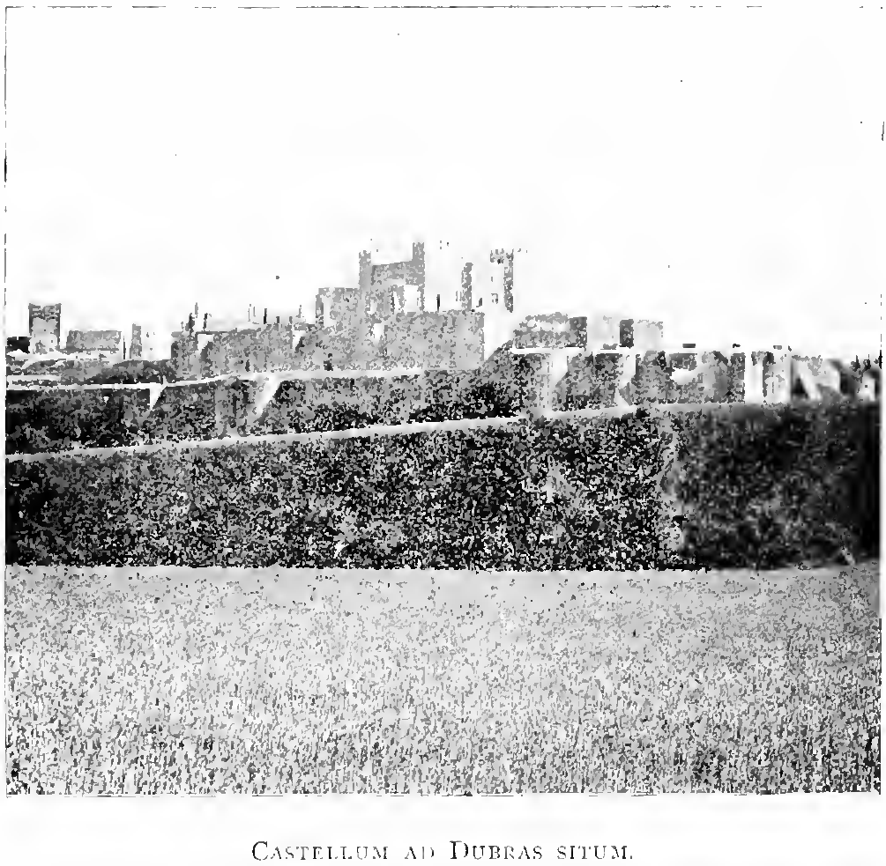
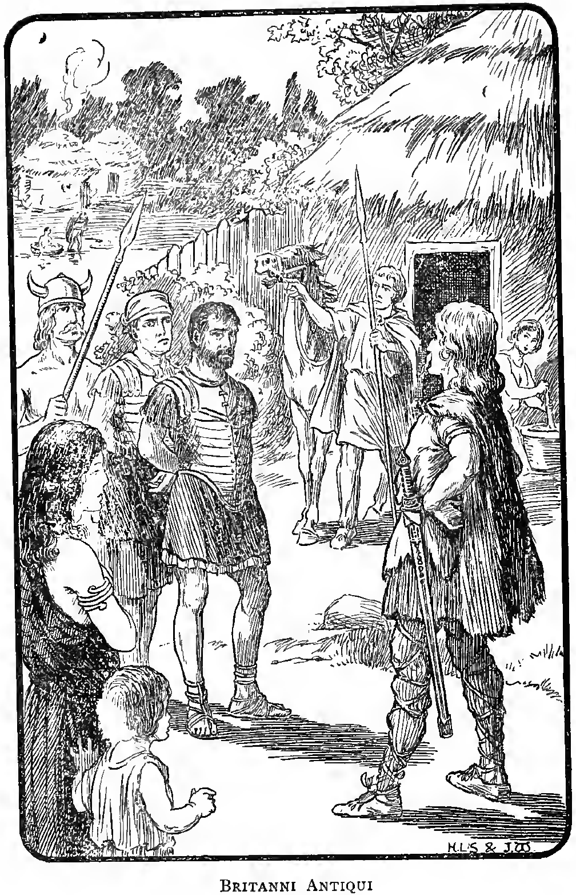
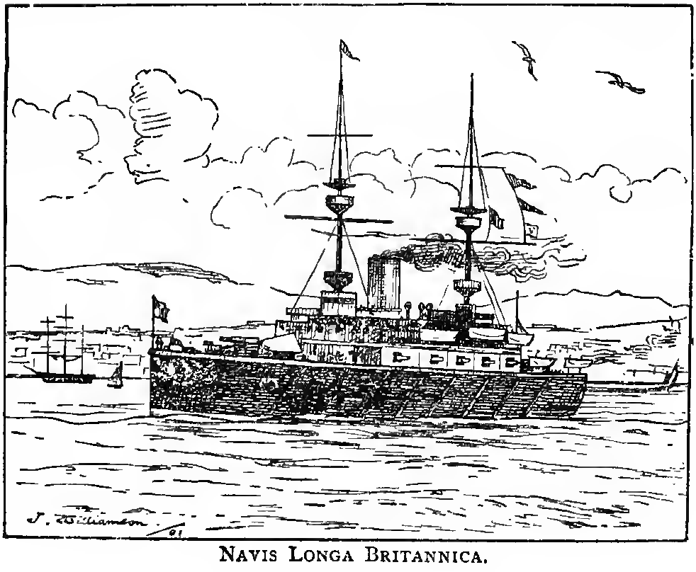

# Ora maritima vel commentāriī dē vīta mea ad Dubrās annō MDCCCXCIX

## I. Ōra maritima.

*First Declension of Nouns and Adjectives, together with the Present Indicative of sum and of the First Conjugation.*

*1.* Quam bella est ōra maritima! Nōn procul ab ōrā maritimā est vīlla. In vīllā amita mea habitat; et ego cum amitā meā nunc habitō. Ante iānuam vīllae est ārea. In āreā est castanea, ubi luscinia interdum cantat. Sub umbrā castaneae ancilla interdum cēnam parat. Amō ōram maritimam; amō vīllam bellam.

*2.* Fēriae nunc sunt. Inter fēriās in vīllā maritimā habitō. Ō beātās fēriās! In arēnā ōrae maritimae sunt ancorae et catēnae. Nam incolae ōrae maritimae sunt nautae. Magna est audācia nautārum: procellās nōn formīdant. Nautās amō, ut nautae mē amant. Cum nautīs interdum in scaphīs nāvigō.

*3.* Ex fenestrīs vīllae undās spectās. Undās caeruleās amō. Quam magnae sunt, quam perlucidae! Post cēnam lūnam et stēllās ex fenestrā meā spectō. Prope vīllam est silva, ubi cum amitā meā saepe ambulō. Quantopere nōs silva dēlectat! Ō cōpiam plantārum et herbārum! Ō cōpiam bācārum! Nōn sōlum nautae sed etiam agricolae circum habitant. Casae agricolārum parvae sunt. Nautae casās albās habitant. Amita mea casās agricolārum et nautārum saepe vīsitat.

*4.* Victōria est rēgīna mea. Magna est glōria Victōriae Rēgīnae, nōn sōlum in īnsulīs Britannicīs sed etiam in Indiā, in Canadā, in Austrāliā, in Āfricā, ubi colōniae Britannicae sunt. Rēgīna est domina multārum terrārum. Britannia est domina undārum. In glōriā rēgīnae meae triumphō. Tē, Britannia, amō: vōs, īnsulae Britannicae, amō. Sed Britannia nōn est patria mea. Ex Āfricā Merīdiānā sum.

*5.* Lȳdia quoque, cōnsobrīna mea, apud amitam meam nunc habitat. Lȳdia columbās cūrat: cūra columbārum Lȳdiae magnam laetitiam dat. Tū, Lȳdia, cum apud magistram tuam es, linguae Francogallicae et linguae Anglicae operam dās; sed ego linguīs antīquīs Rōmae et Graeciae operam dō. Saepe cum Lȳdiā ad silvam vel ad ōram maritimam ambulō. Interdum cum nautā in scaphā nāvigāmus. Quantopere nōs undae caeruleae dēlectant! Lȳdia casās agricolārum cum amitā meā interdum vīsitat. Vōs, fīliae agricolārum, Lȳdiam amātis, ut Lȳdia vōs amat. Ubi inopia est, ibi amita mea inopiam levat.

## II. Patruus meus.

*Second Declension: Nouns and Adjectives in us.*

*6.* Patruus meus quondam praefectus erat in Āfricā Merīdiānā Nunc mīlitiā vacat, et agellō suō operam dat. Agellus patruī meī nōn magnus est. Circum vīllam est hortus. Mūrus hortī nōn altus est. Rīvus est prope hortum, unde aquam portāmus, cum hortum irrigāmus. In hortō magnus est numerus rosārum et violārum. Rosae et violae tibi, mī patrue, magnam laetitiam dant. Tū, Lȳdia, cum patruō meō in hortō saepe ambulās.

*7.* In angulō hortī sunt ulmī. In ulmīs corvī nīdificant. Corvōs libenter spectō, cum circum nīdōs suōs volitant. Magnus est numerus corvōrum in hortō patruī meī; multī mergī super ōceanum volitant. Vōs, mergī, libenter spectō, cum super ōceanum volitātis et praedam captātis. Ōceanus mergīs cibum dat. Patruum meum hortus et agellus suus dēlectant; in agellō sunt equī et vaccae et porcī et gallī gallīnaeque. Lȳdia gallōs gallīnāsque cūrat. Nōn procul ab agellō est vīcus, ubi rūsticī habitant. Nōnnūllī ex rūsticīs agellum cum equīs et vaccīs et porcīs cūrant.

*8.* Ex hortō patruī meī scopulōs albōs ōrae maritimae spectāmus. Scopulī sunt altī. Et ōra Francogallica nōn procul abest. Noctū ex scopulīs pharōs ōrae Francogallicae spectāmus, velut stēllās clārās in ōceanō. Quam bellus es, ōceane, cum lūna undās tuās illūstrat! Quantopere mē dēlectat vōs, undae caeruleae, spectāre, cum tranquillae estis et arēnam ōrae maritimae lavātis! Quantopere mē dēlectātis cum turbulentae estis et sub scopulīs spūmātis et murmurātis!

## III. Monumenta antiqua.

*Nouns and Adjectives in um.*

*9.* Agellus patruī meī in Cantiō est, inter Dubrās et Rutupiās situs. Dubrae et Rutupiae oppida antīqua sunt. Multa sunt monumenta antīqua in Britanniā, multa vestīgia Rōmānōrum. Reliquiae vīllārum, oppidōrum, amphitheātrōrum Rōmānōrum hodiē exstant. Multae viae Rōmānae in Britanniā sunt. In Cantiō est via Rōmāna inter Rutupiās et Londinium. Solum Britannicum multōs nummōs aureōs, argenteōs, aēneōs et Britannōrum et Rōmānōrum occultat. Rūsticīs nummī saepe sunt causa lucrī, cum arant vel fundāmenta aedificiōrum antīquōrum excavant. Nam nummōs antīquōs magnō pretiō vēnumdant. Patruō meō magnus numerus est nummōrum Rōmānōrum.

*10.* Inter fēriās commentāriōs meōs dē vītā meā scrīptitō. Dubrās saepe vīsitāmus; nam oppidum nōn procul abest. Super oppidum est castellum magnum; in castellō est specula antīqua. Mūrī speculae altī et lātī sunt. Quondam erat pharus Rōmānōrum. Prope speculam est aedificium cōnsecrātum. Iam secundō saeculō post Chrīstum nātum basilica Chrīstiāna erat.

*11.* Castellum in prōmunturiō ōrae maritimae stat. Post castellum sunt clīvī grāmineī et lātī. Ex castellō fretum Gallicum spectās. Ante oculōs sunt vēla alba multōrum nāvigiōrum: nāvigia sunt Britannica, Francogallica, Germānica, Belgica. Nōnnūlla ex nāvigiīs Britannicīs “castella” nōmināta sunt. Littera C in signō est. “Castella in Āfricam Merīdiānam nāvigant, ubi patria mea est.

## IV. Delectamenta puerorum.

*Nouns and Adiectives like puer.*

*12.* In numerō amīcōrum meōrum sunt duo puerī. Marcus, puer quattuordecim annōrum, mihi praecipuus amīcus est. Prope Dubrās nunc habitant, sed ex Calēdoniā oriundī sunt. Nōbīs puerīs fēriae nunc sunt; nam condiscipulī sumus. Inter fēriās līberī sumus scholīs. Amīcī meī mē saepe vīsitant, et ego amīcōs meōs vīsitō. Magna est inter nōs amīcitia. Ūnā ambulāmus, ūnā in undīs spūmiferīs natāmus, cum nōn nimis asperae sunt. Quantopere nōs puerōs lūdī pilārum in arēnā dēlectant! Ut iuvat castella contrā undās spūmiferās aedificāre!

*13.* Nōbīs puerīs fēriae plēnae sunt gaudiōrum ā māne usque ad vesperum. Nōnnumquam in scaphā cum Petrō nāvigāmus. Petrus est adulescentulus vīgintī annōrum. Petrī scapha nōn sōlum rēmīs sed etiam vēlīs apta est. Plērumque rēmigāmus, sed nōnnumquam vēla damus, cum ventus nōn nimis asper est. Petrus scapham gubernat et vēlīs ministrat. Nōs puerī scapham bellam laudāmus et amāmus.

*14.* Nōn procul ā Dubrīs est scopulus altus, unde ōceanum et nāvigia et ōram maritimam spectās.  Locus in fābulā commemorātus est, ubi Leir, rēgulus Britannōrum antīquōrum, fortūnam suam miseram dēplōrat, stultitiam suam culpat, fīliās suās animī ingrātī accūsat. Ō fortūnam asperam! Ō fīliās impiās! Ō cōnstantiam Cordēliae! Scopulus ex poētā nōminātus est. Nam in fābulā est locus ubi vir generōsus, amīcus fīdus rēgulī, dē scopulō sē praecipitāre parat; sed fīlius suus virum ex perīculō servat. Fīlium fīdum laudō et amō. Nōs puerī locum saepe vīsitāmus.

## V. Magister noster.
*Nouns and Adjcctives like magister.*

*15.* Magister noster vir doctus est, sed lūdōrum perītus. Nōbīs puerīs cārus est. Inter fēriās patruum meum interdum vīsitat. Dextra magistrī nostrī valida est, et puerī pigrī nec dextram nec magistrum amant.

“Nōn amō tē, Sabidī, nec possum dīcere quārē.  
Hōc tantum possum dīcere: nōn amō tē.”  

Magistrum nōn amant quia librōs Graecōs et Latīnōs nōn amant. Nam discipulī scholae nostrae linguīs antīquīs operam dant, atque scientiīs mathēmaticīs. Magistrō nostrō magna cōpia est librōrum pulchrōrum. Schola nostra antīqua et clāra est: nōn sōlum librīs sed etiam lūdīs operam damus. Schola nostra nōn in Cantiō est. In vīcō nostrō est lūdus litterārius, crēber puerīs et puellīs, līberīs agricolārum. Sed ego cum Marcō et Alexandrō, amīcīs meīs, ad
Ventam Belgārum discipulus sum.

## VI. Britannia antiqua.

*Mixed forms of Nouns and Adjectives of the 1st and 2nd Declensions, together with the Past Imperfect Indicative of sum and of the 1st Conjugation.*

*16.* Magister noster librōrum historicōrum studiōsus est; dē patriā nostrā antīquā libenter narrat. Proximō annō, dum apud nōs erat, dē vītā Britannōrum antīquōrum saepe narrābat. Patruus meus et amita mea libenter auscultābant; ego quoque nōnnumquam aderam. Sīc narrābat:—

“Fere tōta Britannia quondam silvīs dēnsīs crēbra erat. Inter ōram maritimam et fluvium Tamesam, ubi nunc agrī frūgiferī sunt, silva erat Anderida, locus vāstus et incultus. Silvae plēnae erant ferārum — lupōrum, ursōrum, cervōrum, aprōrum. Multa et varia māteria erat in silvīs Britannicīs: sed fāgus Britannīs antīquīs nōn erat nōta, sī Gāius Iūlius vēra affirmat. Et pīnus Scōtica dēerat.”

*17.* “Solum, ubi līberum erat silvīs, frūgiferum erat. Metallīs quoque multīs abundābat — plumbō albō et ferrō, atque, ut Tacitus affirmat, aurō argentōque. Margarītās et ostreās dabat ōceanus: margarītae parvae erant, sed ostreae magnae et praeclārae. Caelum tum quoque crēbrīs pluviīs et nebulīs ātrīs foedum erat; sed pruīnae asperae aberant. Nātūra ōceanī ‘pigra’ erat, sī testimōnium Tacitī vērum est: nautae Rōmānī, inquit, in aquā pigrā vix poterant rēmigāre. Sed vērumne est testimōnium? An nātūra nautārum Rōmānōrum nōn satis impigra erat?”

*18.* “Incolae antīquī īnsulae nostrae ferī et bellicōsī erant. Hastīs, sagittīs, essedīs inter sē pugnābant. Proelia Britannōs antīquōs dēlectābant. Multī et dīversī erant populī Britannōrum. Multī ex populīs erant Celtae. Celtīs antīquīs, sīcut Germānīs, capillī flāvī, oculī caeruleī, membra magna et rōbusta erant. Sīc Tacitus dē Calēdoniīs narrat. Incolae Cambriae merīdiānae colōrātī’ erant. Sed Rōmānīs statūra parva, oculī et capillī nigrī erant. Ūniversī Britannī, ut Gāius Iūlius affirmat, membra vitrō colōrābant, sīcut nautae nostrī hodiernī. Vestīmenta ex coriīs ferārum cōnstābant. In casīs parvīs circum silvās suās habitābant.”

*19.* Hīc amita mea “Nōnne in oppidīs habitābant?” inquit. Et ille “Oppida aedificābant, ”inquit “sed, sī Gāius Iūlius vēra affirmat, oppida Britannōrum antīquōrum loca firmāta erant, nōn loca ubi habitābant. Sed Britannia merīdiāna crēbra erat incolīs et aedificiīs. Sīc narrat Caesar in librō quīntō Bellī Gallicī. Multī ūnā habitābant, ut putō.” “Itaque nōn plānē barbarī erant,” inquit amita mea. Et ille: “Incolae Cantiī agrī cultūrae operam dabant, atque etiam mercātūrae. Nam Venetī ex Galliā in Britanniam mercātūrae causā nāvigābant. Britannī frūmentum, armenta, aurum, argentum, ferrum, coria, catulōs vēnāticōs, servōs et captīvōs exportābant; frēna, vitrea, gemmās, cētera importābant. Itaque mediocriter hūmānī erant, nec multum dīversī ā Gallīs.”

*20.* “Multī mortuōs cremābant, sīcut Graecī et Rōmānī: exstant in Cantiō sepulchra cum ūrnīs pulchrē ōrnātīs. Exstant etiam nummī Britannicī, aureī, argenteī, aēneī. Esseda quoque fabricābant: nōn plānē inhūmānī erant, sī rotās ferrātās essedōrum et nummōs aureōs aēneōsque fabricāre poterant. Britannīs antīquīs magnus numerus gallōrum gallīnārumque erat; animī, nōn ēscae, causā cūrābant, ut Gāius Iūlius affirmat. Sed incolae mediterrāneōrum et Calēdoniī ferī et barbarī erant. Mortuōs humābant. Agrī cultūrae operam nōn dabant; nōn frūmentō sed ferīnā victitābant. Deōrum fāna in lūcīs sacrīs et silvīs ātrīs erant. Sacra cūrābant Druidae. Sacra erant saeva: virōs, fēminās, līberōs prō victimīs sacrificābant. Inter sē saepe pugnābant; captīvōs miserōs vēnumdabant, vel cruciābant et trucīdābant: nōnnumquam simulācra magna, plēna victimīs hūmānīs, cremābant. Populōrum inter sē discordiae victōriam Rōmānōrum parābant.”

## VII. Vestīgia Rōmānōrum.

*Future Indicative and Imperative of sum and of the 1st Conjugation.*

*21.* Nūper, dum Marcus et Alexander mēcum erant, patruō meō “Quantopere mē dēlectābit” inquam “locum vīsitāre ubi oppidum Rōmānum quondam stābat.” Et Alexander “Mōnstrā nōbīs,” inquit “amābō tē, ruīnās castellī Rutupīnī” Tum patruus meus “Longa est via,” inquit “sed aliquandō mōnstrābō. Crās, sī vōbīs grātum erit, ad locum ubi proelium erat Britannōrum cum Rōmānīs ambulābimus. Ambulābitisne nōbīscum, Marce et Alexander?” “Ego vērō” inquit Marcus “tēcum libenter ambulābō”: et Alexander “Mihi quoque pergrātum erit, sī nōbīs sepulchra Britannōrum et Rōmānōrum mōnstrābis.” Sed patruus meus “Festīnā lentē” inquit; “nūllae sunt ibi reliquiae sepulchrōrum, et virī doctī dē locō proeliī disputant. Sed quotā hōrā parātī eritis?” “Quīntā hōrā” inquiunt.

*22.* Postrīdiē caelum serēnum erat. Inter iēntāculum amita mea “Quotā hōrā” inquit “in viam vōs dabitis? Et quotā hōrā cēnāre poteritis?” Et patruus meus “Quīntā hōrā Marcus et Alexander Dubrīs adventābunt; intrā duās hōrās ad locum proeliī ambulāre poterimus; post ūnam hōram redambulābimus; itaque hōrā decimā vel ūndecimā domī erimus, ut spērō.” Tum ego “Nōnne ieiūnī erimus,” inquam “sī nihil ante vesperum gustābimus?” “Prandium vōbīscum portāte” inquit amita mea; “ego crustula et pōma cūrābō.”

*Perfect Indicative of sum and of the 1st Cenjugation.*

*23.* Quīnta hōra appropinquābat, et amīcōs meōs cupidē exspectābam. Ad sonum tintinnābulī ad fenestram properāvī. Ecce, puerī ad iānuam aderant. Cum intrāvērunt, ūniversī exclāmāvimus “Euge! Opportūnē adventāvistis!” Tum Marcus “Num sērō adventāvimus?” inquit; “hōra fere tertia fuit cum in viam nōs dedimus; sed via longa est, et Alexander celeriter ambulāre nōn potest.” Sed Alexander ‘“Nōn sum fatīgātus ” inquit; “sed quota hōra est?” Tum patruus meus “Nōndum quīnta hōra est” inquit: “parātīne estis ad ambulandam?” Et Alexander “Nō: vērō!” inquit. Tum amita mea et Lȳdia “Bene ambulāte!” inquiunt, et in viam nōs dedimus.

*24.* Inter viam patruus meus mutta nōbīs dē bellō Rōmānōrum cum Britannīs narrāvit. Prīmō saeculō ante Chrīstum nātum Gāius Iūlius in Galliā bellābat, et, postquam Nerviōs cēterōsque populōs Galliae Belgicae dēbellāvit, bellum contrā incolās īnsulae propinquae parāvit. Itaque annō quīntō et quīnquāgēsimō cōpiās suās in Britanniam trānsportāvit.

Dē locō unde nāvigāvit et dē locō quō nāvigia sua applicāvit, virī doctī diū disputāvērunt. Sed inter Dubrās et Rutupiās est locus ad nāvigia applicanda idōneus. Dubrās nōn poterat applicāre; nam scopulī ibi altī erant, ut nunc sunt, et in scopulīs cōpiae armātae Britannōrum stābant. Itaque ad alium locum nāvigāvit, ubi nūllī scopulī fuērunt. Sed Britannī quoque per ōram maritimam ad locum properāvērunt, et ad pugnam sē parāvērunt. Rōmānīs necesse erat nāvigia sua magna ad ancorās dēligāre. Britannīs vada nōta fuērunt; itaque in aquam equitāvērunt et cōpiam pugnae dedērunt.

*Pluperfect (i.e. Past Perfect) Indicative of sum and of the 1st Conjugation.*

*25.* Sed iam ad locum adventāverāmus, et patruus meus “Spectāte puerī” inquit; “hīc campus apertus est; scopulī dēsunt, et locus idōneus est ad cōpiās explicandās. Illīc fortasse, ubi scaphās piscātōriās spectātis, Gāius Iūlius nāvigia Rōmāna ad ancorās dēligāverat. Hīc Britannī cōpiās suās collocāverant, et equōs in aquam incitāverant. Nōnne potestis tōtam pugnam animō spectāre? Sed reliqua narrābō. Dum Rōmānī undīs sē dare dubitant, aquilifer ‘Ad aquilam vōs congregāte, inquit ‘nisi ignāvī estis. Ego certē officium meum praestābō.

Et cum aquilā undīs sē dedit. Iam ūniversī Rōmānī ad aquiliferum sē congregāverant, et cum Britannīs in undīs impigrē pugnābant. Cōnfūsa et aspera fuit pugna. Prīmō labōrābant Rōmānī; sed tandem Britannōs prōpulsāvērunt et terram occupāvērunt. Ante vesperum Britannī sē fugae dederant. Numquam anteā cōpiae Rōmānae in solō Britannicō steterant. Audācia aquiliferī laudanda erat.”

*Future Perfect Indicative of sum and of the 1st Conjugation.]

*26.* Sed nōs puerī prandium iam postulābāmus: nam hōra iam septima erat. Quam bella crustula et pōma tū, amita, dederās! Quantopere nōs bācae rubrae et nigrae dēlectāvērunt! Tum patruus meus “Cum nōs recreāverimus,” inquit “domum properābimus; nam nōn ante ūndecimam hōram adventāverimus; intereā amita tua, mī Antōnī, nōs exspectāverit. Nōnne prandiō satiātī estis?” Tum ego “Nūlla in mē mora fuerit.” Et Alexander “Ego iam parātus sum ” inquit; “sed quandō tū, Marce, satiātus eris?” Tum Marcus “Ieiūnus fuī” inquit; “nam per quīnque hōrās nihil gustāveram. Sed cum mē alterō pōmō recreāverō, parātus erō. Tū, Alexander, inter viam crustulīs operam dedistī; nam puer parvus es.” Nōs cachinnāmus, et mox in viam nōs damus.

## VIII. Expeditio prīma C. Iūliī Caesaris.

*3rd Declension: nouns like Caesar, imperātor, sō!, expedītiō.*

*27.* Sed magnus erat calor sōlis et āeris, neque poterāmus celeriter ambulāre. Paulō post nebulae sōlem obscūrāvērunt, et imber magnus fuit. Mox sōl ōram maritimam splendōre suō illūstrāvit, et iterum in viam nōs dedimus. Imber calōrem āeris temperāverat; et inter viam nōs puerī patruum meum multa dē C. Iūliō Caesare, imperātōre magnō Rōmānōrum, interrogāvimus. “Cūr expedītiōnem suam in Britanniam parāvit?” inquimus; “cūr cōpiās suās in īnsulam nostram trānsportāvit?” Et patruus meus “C. Iūlius Caesar” inquit “prōcōnsul erat Galliae, et per trēs annōs contrā nātiōnēs bellicōsās Gallōrum et Belgārum bellāverat; nam annō duodēsexāgēsimō ante Chrīstum nātum Rōmānī Caesarem prōcōnsulem creāverant. Rōmānī autem Britannōs in numerō Gallōrum esse exīstimābant; et rēvērā nōnnūllae ex nātiōnibus Britanniae merīdiānae ā Belgīs oriundae erant. Atque Britannī Gallīs auxilia contrā Rōmānōs interdum subministrāverant; sed Trinobantēs auxilium Rōmānōrum contrā Cassivellaunum, rēgulum Cassōrum, implōrāverant.”

*28.* “Alia quoque causa bellī fuerat avāritia et exspectātiō praedae. Cupidī erant Rōmānī īnsulam nostram ignōtam et remōtam vīsitandī et explōrandī; nam, ut Tacitus affirmat, ignōtum prō magnificō est. Itaque annō quīntō et quīnquāgēsimō ante Chrīstum nātum C. Iūlius Caesar expedītiōnem suam prīmam contrā Britannōs comparāvit, et victōriam reportāvit, ut narrāvī; nam post ūnum proelium Britannī veniam ā victōribus implōrāvērunt. Sed expedītiō nōn magna fuerat; neque Rōmānī ūllam praedam ex Britanniā reportāverant, nisi paucōs servōs et captīvōs. Annō igitur proximō imperātor Rōmānus secundam et multō maiōrem expedītiōnem in Britanniam parāvit. Nam sescenta nāvigia onerāria in Galliā aedificāvit, et quīnque legiōnēs Rōmānās ūnā cum magnā multitūdine auxiliōrum Gallicōrum in ōram Belgicam congregāvit.”

## IX. Pax violata.

*3rd Declension continued: nouns like pāx, aestās, mīles.*

*29.* “Britannī pācem nōn violāverant, sed Rōmānī pācis nōn cupidī erant. Itaque aestāte annī quārtī et quinquāgēsimī ante Chrīstum nātum dux Rōmānus cum quīnque legiōnibus mīlitum Rōmānōrum et magnō numerō equitum et auxiliōrum Gallicōrum iterum in Britanniam nāvigāvit. Tempestās erat idōnea, sed in mediā nāvigātiōne ventus nōn iam flābat; itaque mīlitibus necesse erat nāvigia rēmīs incitāre. Impigrē rēmigāvērunt, et postrīdiē nāvigia ad ōram Britannicam prospere applicāvērunt. Labor rēmigandī magnus erat, virtūs mīlitum magnopere laudanda. Britannī Rōmānōs in scopulīs ōrae maritimae exspectābant; sed postquam multitūdinem nāvigiōrum et mīlitum equitumque spectāvērunt, in fugam sē dedērunt. Caesar nāvigia sua inter Dubrās et Rutupiās applicāvit, ut putō, nōn procul ā locō quō priōre annō applicāverat. Inde contrā Britannōs properāvit. Intereā ūnam legiōnem cum trecentīs equitibus ad castra in statiōne reservābat: nam perīculōsum erat nāvigia ad ancorās dēligāta dēfēnsōribus nūdāre.”

## X. Certamina varia.

*3rd Declension continucd: nouns like flūmen, tempus.*

*30.* “Britannī certāmen vītāvērunt, et in silvīs sē occultāvērunt, ubi locus erat prope flūmen, ēgregiē et nātūrā et opere firmātus. Itaque ‘oppidum’ Britannicum erat. Dē nōmine flūminis nihil cōnstat. Oppidum iam ante domesticī bellī causā praeparāverant, et crēbrīs arboribus vallīsque firmāverant. Multa et varia certāmina fuērunt: Britannī ex silvīs cum equitibus essedīsque suīs contrā Rōmānōs prōvolābant; Rōmānīs perīculōsum erat intrā mūnītiōnēs Britannōrum intrāre. Sed post aliquantum temporis mīlitēs septimae legiōnis aggere et testūdine locum oppugnāvērunt. Tandem Britannōs ex silvīs prōpulsāvērunt. Pauca erant vulnera Rōmānōrum: nam Rōmānī Britannōs pondere armōrum et scientiā pugnandī multum superābant; magnitūdine et rōbore corporis Britannī Rōmānōs superābant. Sed Rōmānī quoque hominēs rōbustō corpore erant.”

*31.* “Victōria Caesarī nōn multum prōfuit: nam Britannīs fugātīs īnstāre nōn poterat, quia nātūram locī ignōrābat. Praetereā praefectus castrōrum, nōmine Quīntus Ātrius, magnum incommodum nūntiāverat: tempestās nāvigia in lītore afflīctāverat. Tempus perīculōsum erat; nam Caesarī necesse erat ā flūmine ad lītus maritimum properāre, et legiōnēs suās ab īnsectātiōne Britannōrum revocāre. Multa ex nāvigiīs in vadīs afflīctāta erant; cētera novīs armīs ōrnanda erant. Opus magnī labōris erat, et aliquantum temporis postulābat. Sed nautārum atque mīlitum virtūs magnō opere laudanda erat. Nōn sōlum per diurna sed etiam per nocturna tempora labōrāvērunt. Intereā Caesar nova nāvigia in Galliā aedificat: sine nāvigiīs nōn poterat cōpiās suās in Galliam reportāre; ūnō tempore necesse erat et nāvigia reparāre et contrā Britannōs bellāre.”

## XI. Naves Romanae.

*3rd Declension continued: nouns like nāvis.*

*32.* “Duo erant genera nāvium in classe Rōmānā; ūnum erat genus nāvium longārum, alterum nāvium onerāriārum. Nāvēs longae ad pugnam aptae erant, nāvēs onerāriae ad onera atque multitūdinem hominum et equōrum trānsportanda. Tōta classis Caesaris octingentārum erat nāvium; nam sescentās nāvēs onerāriās per hiemem in Galliā aedificāverat, ut narrāvī. Inter cēterās, ducentās numerō, nōnnūllae nāvēs longae erant. Sed nāvibus longīs rēvērā nōn opus erat Caesarī; nam Britannīs antīquīs nūlla erat classis; neque nāvēs onerāriās aedificābant.” Tum ego “Britannia nōndum domina undārum erat” inquam; “sed quōmodo frūmentum exportāre poterant, sī nūllās nāvēs aedificābant?” “Venetōrum nāvēs ” inquit patruus meus “(frūmentum Britannicum in Galliam portābant, et ex Galliā gemmās, vitrea, cētera in Britanniam. Nam Venetī, nātiō maritima, in ōrā Gallicā habitābant. Hostēs fuerant Rōmānōrum, et magnam classem comparāverant.”

*33.* Tum Marcus ‘“Num nātiōnēs barbarae” inquit “nāvēs longās ōrnāre poterant?” Et patruus meus “Formam nāvium Gallicārum Caesar in tertiō librō Bellī Gallicī commemorat. Puppēs altae erant, ad magnitūdinem tempestātum accommodātae; carīnae plānae. Venetī nāvēs tōtās ex rōbore fabricābant; ad ancorās catēnīs ferreīs, nōn fūnibus, dēligābant. Pellēs prō vēlīs erant, sīve propter līnī inopiam, sīve quia in pellibus plūs firmitūdinis quam in vēlīs līneīs erat. Nāvēs longae Rōmānōrum nōn tam altae erant quam Venetōrum, sed rōstrīs ferreīs et interdum turribus armātae erant; itaque victōriam a Venetīs reportāverant” Tum Alexander “Num nāvēs Rōmānae lāminīs ferreīs armātae erant?” inquit. Sed Marcus: “Quid opus erat lāminīs ferreīs, sī tormenta hodierna antīquīs dēerant?”

## XII. Gentium Britannicārum Societās.

*3rd Declension continued: nouns like gens, pars.*

*34.* Tum patruus meus reliqua dē expedītiōne Caesaris narrāvit. “Dum mīlitēs nautaeque Rōmānī classem novīs armīs ōrnant, Caesar ad reliquās cōpiās properat. Intereā hostēs summum imperium Cassivellaunō mandāverant. Cassivellaunus nōn erat rēx ūniversārum gentium Britannicārum, sed dux vel princeps gentis Cassōrum. Annō tamen quārtō et quīnquāgēsimō ante Chrīstum nātum magna pars gentium Britanniae merīdiānae sē sub Cassivellaunō contrā Rōmānōs cōnsociāverant. Flūmen Tamesa fīnēs Cassivellaunī ā fīnibus gentium maritimārum sēparābat; ab oriente erant fīnēs Trinobantium; ab occidente Britannī mediterrāneī. Superiōre tempore bella continua fuerant inter Cassivellaunum et reliquās gentēs; atque Trinobantēs auxilium Rōmānōrum contrā Cassivellaunum implōrāverant, quia rēgem suum trucīdāverat. Numerus hostium magnus erat: nam, ut Caesar affirmat, īnfīnīta multitūdō hominum erat in parte merīdiānā Britanniae.”

*35.* “Caesar formam et incolās Britanniae in capite duodecimō et tertiō decimō librī quīntī commemorat. Incolae partis interiōris Celtae et barbarī erant; incolae maritimae partis ex Belgiō praedae causā immigrāverant, sīcut priōre aetāte trāns flūmen Rhēnum in Belgium migrāverant. Et nōnnūlla nōmina gentium maritimārum, unde nōmina urbium hodiernārum dērīvāta sunt, Belgica vel Gallica sunt.

Belgae autem ā Germānīs oriundī erant, ut Caesar in capite quārtō librī secundī dēmōnstrat. Itaque pars Britannōrum antīquōrum Germānicā orīgine erant. Formam īnsulae esse triquetram dēclārat. Sed ūnum latus ad Galliam spectāre exīstimat, alterum ad Hispāniam atque occidentem, tertium ad septentriōnēs. Itaque dē lateribus et angulīs laterum errābat. Hiberniam ab occidente parte Britanniae esse rēctē iūdicat, īnsulam Monam inter Britanniam et Hiberniam esse.”

## XIII. Maria Britannica.

*3rd Declension continued: nouns like mare.*

*36.* “Lateris prīmī longitūdinem circiter quīngenta mīlia esse iūdicat, secundī septingenta, tertiī octingenta. Itaque dē magnitūdine īnsulae nōn multum errābat. Flūmen Tamesam ā marī circiter octōgintā mīlia distāre iūdicat.” Hīc nōs puerī “Errābat igitur ” inquimus; “nam inter Londinium et mare nōn sunt octōgintā mīlia.” Sed patruus meus “Rēctē iūdicābat” inquit; “nam pars maris ubi Caesaris castra erant circiter octōgintā mīlia Rōmāna ā Londiniō distat. Tria maria īnsulam nostram circumdant; inter Britanniam et Galliam est mare Britannicum vel fretum Gallicum; ab occidente mare Hibernicum; ab oriente mare Germānicum. Nōmina marium temporibus antīquīs nōn ūsitāta erant; sed iam Graecī Britanniam esse īnsulam iūdicābant.”

## XIV. Britannia pacata.
*Recapitulation of nouns of the 3rd Declension.*

*37.* “Inter Tamesam et mare Britannicum prīma concursiō erat Rōmānōrum cum cōpiīs Cassivellaunī. Britannī duās cohortēs Rōmānās in itinere fortiter impugnāvērunt. Ex silvīs suīs prōvolāvērunt; Rōmānōs in fugam dedērunt; multōs Rōmānōrum trucīdāvērunt. Tum suōs ā pugnā revocāvērunt. Novum genus pugnae Rōmānōs perturbāverat. Nam Britannīs nōn mōs erat iūstō proeliō pugnāre; sed equitibus essedīsque suīs per omnēs partēs equitābant, et ōrdinēs hostium perturbābant; tum cōnsultō cōpiās suās revocābant. Essedāriī interdum pedibus pugnābant. Ita mōbilitātem equitum, stabilitātem peditum in proeliīs praestābant. Peditēs Rōmānī propter
pondus armōrum nōn aptī erant ad hūiusmodī hostem. Et equitibus Rōmānīs perīculōsum erat sē longō intervallō ā peditibus sēparāre: neque pedibus pugnāre poterant.”

*38.* “Itaque Rōmānī ōrdinēs suōs contrā equitēs Britannōrum in prīmō certāmine nōn servāverant.

Sed postrīdiē Rōmānī victōriam reportāvērunt. Britannī in collibus procul ā castrīs Rōmānīs stābant. Caesar magnum numerum cohortium et ūniversōs equitēs lēgātō suō Trebōniō mandāverat. Hostēs subitō prōvolāvērunt, et ōrdinēs Rōmānōs impugnāvērunt. Sed Rōmānī superiōrēs fuērunt. Cōpiās Britannicās prōpulsāvērunt, et in fugam dedērunt. Magnum numerum hostium trucīdāvērunt. Tum dux continuīs itineribus ad flūmen Tamesam et in fīnēs Cassivellaunī properāvit. Cassivellaunus autem cum quattuor mīlibus essedāriōrum itinera Rōmānōrum servābat, et paulum dē viā dēclīnābat sēque in silvīs occultābat. Interdum ex silvīs prōvolābat et cum mīlitibus Rōmānīs pugnābat; Rōmānī autem agrōs Britannōrum vāstābant.”

*39.* “In parte flūminis Tamesae ubi fīnēs Cassivellaunī erant ūnum tantum vadum erat. Quō cum Caesar adventāvit, cōpiās hostium ad alteram rīpam flūminis collocātās spectāvit. Rīpa autem sudibus acūtīs firmāta erat; et Britannī multās sudēs sub aquā quoque occultāverant. Sed Caesar hostibus īnstāre nōn dubitāvit. Aqua flūminis profunda erat, et mīlitēs capite solum ex aquā exstābant; sed Rōmānī sē aquae fortiter mandāvērunt, et Britannōs in fugam dedērunt.  ‘Oppidum’ Cassivellaunī nōn longē aberat, inter silvās palūdēsque situm, quō Britannī magnum numerum hominum, equōrum, ovium, boum, congregāverant. Locum ēgregiē et nātūrā et opere firmātum Caesar ex duābus partibus oppugnāre properāvit: oppidum expugnāvit et dēfēnsōrēs fugāvit.”

*40.* “Sed in Cantiō, ubi quattuor rēgēs Britannīs praeerant, nōndum fīnis erat pugnandī. Britannī castra Rōmāna ad mare sita fortiter oppugnant; sed frūstrā Rōmānī victōrēs. Intereā multae ex cīvitātibus Britannicīs pācem ōrant. Trinobantibus Caesar novum rēgem dat, et pācem cōnfirmat. Itaque propter tot clādēs, propter fīnēs suōs bellō vāstātōs, maximē autem propter dēfectiōnem tot cīvitātum, Cassivellaunus dē condiciōnibus pācis dēlīberat. Caesar pācem dat; Cassivellaunum vetat Trinobantēs bellō vexāre, et tribūtum Britannīs imperat. Tum cōpiās suās cum magnō numerō obsidum et captīvōrum in Galliam reportat. Britannī fortiter sed frūstrā prō ārīs et focīs suīs pugnāverant.”

## XV. Robur et aes triplex.

*Adjectives of the 3rd Declension.*

*41.* Tum Marcus “ō gentem fortem et admīrābilem Britannōrum!” inquit. “Nam īnsigne erat facinus quod contrā Rōmānōs, victōrēs orbis terrārum, tam fortiter et nōnnumquam prospere pugnāvērunt. Nōn mīrum est, sī Rōmānī victōriam reportāvērunt.” Nōs sententiam Marcī comprobāvimus. Sed iam nōna hōra erat, cum Alexander, digitō ad orientem mōnstrāns, “Nōnne nāvēs procul ā lītore spectātis?” inquit. Et patruus meus “Ita est “ inquit; “nam illīc est statiō tūta nāvibus. Sed illae nāvēs, ut putō, nāvēs longae sunt ex classe Britannicā; nam pars classis nostrae nunc in fretō Gallicō est. Tum ego “euge, optimē!” inquam; “nāvem longam adhūc nōn spectāvī. Sed nōn tam grandēs sunt quam putāvī.” “Pergrandēs sunt,” inquit patruus meus “sed procul a lītore sunt; omnēs lāminīs ferreīs, nōnnūllae arietibus vel turribus armātae sunt.”

*42.* Tum nautam veterānum dē nōminibus nāvium longārum interrogāvimus. In classe Britannicā mīlitāverat, sed tum mīlitiā vacābat, et custōs erat ōrae maritimae. Nōmina nāvium, ut affirmābat, erant *Grandis, Rēgālis, Magnifica, Tonāns, Arrogāns, Ferōx*; omnibus tegimen erat lāminīs ferreīs fabricātum. In *Grandī* praefectus classis nāvigābat. Omnēs ad ancoram dēligātae erant. Tum Alexander “Cūr nōn” inquit “ad nāvēs in scaphā nāvigāmus?” Mihi et Marcō prōpositum pergrātum erat; et nauta ad nāvigandum parātus erat. Itaque patruus meus “Sērō domum adventābimus” inquit; “sed sī vōs puerī cupidī estis nāvem longam spectandī, ego nōn dēnegābō” Tum nauta “Exspectāte ” inquit “dum omnia parō”; et vēla rēmōsque in scapham portāvit. Quam dulce erat in marī tranquillō nāvigāre! Ventus lēnis flābat, et brevī tempore ad *Rēgālem* appropinquāvimus. Tum classiāriī nōbīs nāvem ingentem mōnstrāvērunt cum māchinīs, tormentīs, rōstrīs, cēterīs.

*43.* Hōra iam decima erat cum ā *Rēgālī* nōs in scapham dedimus. Tum ad lītus rēmigāre necesse erat; nam ventus adversus erat. Ego et Marcus ūnā cum patruō meō et nautā veterānō rēmīs labōrāvimus. Sed nōn ante ūndecimam hōram in lītore stetimus. Dum domum properāmus, imber fuit, et necesse erat in tabernā aliquantum temporis exspectāre: intrāvimus et nōs recreāvimus; nam fatīgātī erāmus. Sed post tenebrās lūx. Cum domum adventāvimus, amita mea et Lȳdia “Ubi tam diū fuistis?” inquiunt; “nōs ānxiae fuimus; sed cēna iam parāta est.” Tum nōs “Multa spectāvimus” inquimus; “ambulātiō longa sed pergrāta et ūtilis fuit” Post cēnam Marcus et Alexander Dubrās in vehiculō properāvērunt. Ego per noctem dē Britannīs antīquīs et dē classe Britannicā hodiernā somniāvī. Ante oculōs erant virī fortēs membrīs rōbustīs, flāvīs capillīs, oculīs caeruleīs cum Rōmānīs terrā marīque pugnantēs.

*Dulce domum.*

*Deus salvam fac rēgīnam, mātrem patriae.*
